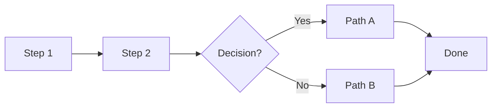

# Blueprint: <Title>

<!-- METADATA — structured for agents, useful for humans
tags:        [tag1, tag2, tag3]
category:    project-setup | ci-cd | architecture | workflow | patterns
difficulty:  beginner | intermediate | advanced
time:        estimated time (e.g. "30 min", "2 hours", "1 day")
stack:       [flutter, dart, github-actions, ...]  (empty = stack-agnostic)
-->

> One-line summary of what this blueprint solves.

## TL;DR

2-3 sentences max. What you'll end up with after following this blueprint.

## When to Use

- Situation or trigger that calls for this blueprint
- What problem it solves
- When **not** to use it (if applicable)

## Prerequisites

- [ ] Prerequisite 1
- [ ] Prerequisite 2

## Overview

<!--
  Visual flow of the blueprint. Adapt the diagram type to the content:
  - Procedural → flowchart LR (left-to-right pipeline)
  - Architectural → flowchart TD (top-down layers)
  - Diagnostic → flowchart TD with decision diamonds
  - Pipeline → flowchart LR with stages
  Delete this comment and keep only the relevant diagram.
-->



## Steps

### 1. First step

**Why**: Explain the reasoning, not just the action.

```bash
# concrete command
```

**Expected outcome**: What you should see or have after this step.

### 2. Second step

**Why**: Reasoning.

Instructions and code.

**Expected outcome**: Validation.

### 3. Third step

Instructions.

<!-- DECISION POINT — use when the blueprint branches -->
> **Decision**: If `<condition>`, go to [Step 4a](#4a-path-a). Otherwise, skip to [Step 4b](#4b-path-b).

## Variants

<!--
  Optional. Use when the blueprint has different paths depending on context.
  Examples: "iOS vs Android", "GitHub Actions vs GitLab CI", "monorepo vs single-repo"
  Delete this section if not applicable.
-->

<details>
<summary><strong>Variant: <Context></strong></summary>

Differences from the main flow and specific instructions.

</details>

## Gotchas

> **<Short title>**: Description of the pitfall. **Fix**: How to avoid or resolve it.

> **<Short title>**: Description. **Fix**: Resolution.

## Checklist

- [ ] Validation item 1
- [ ] Validation item 2
- [ ] Validation item 3

## Artifacts

<!--
  What this blueprint produces. Helps agents verify completion.
  Delete if not applicable.
-->

| Artifact | Location | Description |
|----------|----------|-------------|
| File or config | `path/to/file` | What it does |

## References

- [Link title](url) — short description
