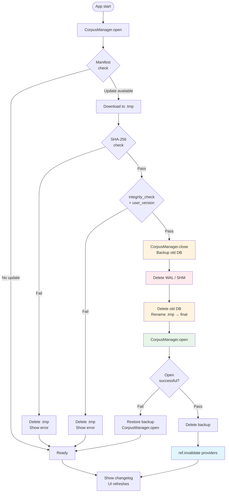

# Blueprint: Corpus Download & Hot-Swap

<!--
tags:        [sqlite, download, hot-swap, database, offline]
category:    architecture
difficulty:  advanced
time:        4 hours
stack:       [flutter, dart, sqlite]
-->

> Safely download, verify, and replace a live SQLite database at runtime without crashes or data corruption.

## TL;DR

A `CorpusManager` singleton owns the full DB connection lifecycle (open, close, replace). Updates download to a `.tmp` file, are verified with SHA-256 and `PRAGMA integrity_check`, then swapped atomically — including WAL/SHM cleanup — before Riverpod providers are invalidated so the UI picks up fresh data without a restart.

## When to Use

- Apps that ship a large read-only SQLite corpus (dictionary, sutta collection, knowledge base) and need to push content updates outside the app release cycle
- When users need the latest corpus version offline, without reinstalling the app
- When **not** to use: the corpus is small enough to bundle in every app release, or the content is always fetched live from an API with no offline requirement

## Prerequisites

- [ ] Flutter project with [Drift](https://drift.simonbinder.eu/) or `sqlite3` / `sqflite` for direct SQLite access
- [ ] Server hosting the corpus file with a version manifest (JSON) and SHA-256 hash
- [ ] Understanding of the [Dual Database Pattern](dual-database-pattern.md) — the corpus is the reference DB side
- [ ] Riverpod for state management (or adapt provider invalidation to your state solution)
- [ ] `path_provider`, `http` / `dio`, `crypto` packages in `pubspec.yaml`

## Overview



## Steps

### 1. Define the CorpusManager singleton

**Why**: SQLite connections hold file-level locks. If any part of the app holds an open connection while you rename or delete the DB file, SQLite raises "database disk image is malformed". A single class that owns every open/close/replace call is the only reliable way to prevent concurrent access during the swap window.

Create `lib/core/corpus/corpus_manager.dart`:

```dart
import 'dart:io';
import 'package:drift/drift.dart';
import 'package:drift/native.dart';
import 'package:path/path.dart' as p;

/// Singleton that owns the corpus DB connection lifecycle.
/// All callers obtain the executor through this class — never open
/// a LazyDatabase or NativeDatabase directly on the corpus file.
class CorpusManager {
  CorpusManager._();
  static final CorpusManager instance = CorpusManager._();

  QueryExecutor? _executor;
  String? _currentPath;

  bool get isOpen => _executor != null;

  /// Opens the corpus at [dbPath]. Idempotent: if already open at the same
  /// path, returns the cached executor.
  Future<QueryExecutor> open(String dbPath) async {
    if (_executor != null && _currentPath == dbPath) {
      return _executor!;
    }
    // Close any stale connection before opening a new path.
    await close();

    final file = File(dbPath);
    if (!file.existsSync()) {
      throw CorpusNotFoundException('No corpus file at $dbPath');
    }

    _executor = NativeDatabase(file, logStatements: false);
    _currentPath = dbPath;
    return _executor!;
  }

  /// Closes the current connection and clears state.
  /// Safe to call when already closed.
  Future<void> close() async {
    await _executor?.close();
    _executor = null;
    _currentPath = null;
  }

  /// Atomically replaces the live corpus with the file at [newDbPath].
  ///
  /// Steps (order is critical):
  ///   1. Close current connection.
  ///   2. Delete WAL / SHM sidecar files.
  ///   3. Backup the old file.
  ///   4. Delete the old file and rename [newDbPath] into position.
  ///   5. Reopen the connection.
  ///
  /// On failure at step 5, restores from backup before rethrowing.
  Future<void> replace({
    required String currentPath,
    required String newDbPath,
    String? backupPath,
  }) async {
    final resolvedBackup = backupPath ?? '$currentPath.backup';

    // 1. Close
    await close();

    // 2. WAL / SHM cleanup (see Step 3)
    _deleteWalFiles(currentPath);

    // 3. Backup old DB so we can roll back
    final oldFile = File(currentPath);
    if (oldFile.existsSync()) {
      await oldFile.copy(resolvedBackup);
    }

    // 4. Atomic rename (only atomic on the same filesystem — see Gotchas)
    try {
      if (oldFile.existsSync()) await oldFile.delete();
      await File(newDbPath).rename(currentPath);
    } catch (e) {
      // If rename failed the .tmp is still there; restore backup.
      await _restoreBackup(resolvedBackup, currentPath);
      rethrow;
    }

    // 5. Reopen
    try {
      await open(currentPath);
    } catch (e) {
      // New DB failed to open — roll back to backup.
      await _restoreBackup(resolvedBackup, currentPath);
      await open(currentPath);
      rethrow;
    }

    // 6. Clean up backup on success
    final backup = File(resolvedBackup);
    if (backup.existsSync()) await backup.delete();
  }

  // ---------------------------------------------------------------------------
  // Private helpers
  // ---------------------------------------------------------------------------

  void _deleteWalFiles(String dbPath) {
    for (final suffix in ['-wal', '-shm']) {
      final sidecar = File('$dbPath$suffix');
      if (sidecar.existsSync()) sidecar.deleteSync();
    }
  }

  Future<void> _restoreBackup(String backupPath, String targetPath) async {
    final backup = File(backupPath);
    if (!backup.existsSync()) return;
    final target = File(targetPath);
    if (target.existsSync()) await target.delete();
    await backup.copy(targetPath);
  }
}

class CorpusNotFoundException implements Exception {
  CorpusNotFoundException(this.message);
  final String message;
  @override
  String toString() => 'CorpusNotFoundException: $message';
}
```

**Expected outcome**: Every part of the app that needs a `QueryExecutor` for the corpus calls `CorpusManager.instance.open(path)`. No raw `NativeDatabase(File(...))` calls exist outside this class.

---

### 2. Model the version manifest

**Why**: You need a machine-readable contract between the server and the app so the app knows whether a download is available and can verify the file after download.

Host a `manifest.json` at a stable URL (e.g. `https://cdn.example.com/corpus/manifest.json`):

```json
{
  "version": 42,
  "user_version": 42,
  "sha256": "e3b0c44298fc1c149afbf4c8996fb92427ae41e4649b934ca495991b7852b855",
  "url": "https://cdn.example.com/corpus/corpus_v42.db",
  "size_bytes": 104857600,
  "changelog": [
    "Added 3 000 new entries in the Pali word index",
    "Fixed romanisation of 47 sutta titles"
  ]
}
```

Model it in Dart (`lib/core/corpus/corpus_manifest.dart`):

```dart
import 'dart:convert';

class CorpusManifest {
  const CorpusManifest({
    required this.version,
    required this.userVersion,
    required this.sha256,
    required this.url,
    required this.sizeBytes,
    this.changelog = const [],
  });

  final int version;
  final int userVersion;
  final String sha256;
  final String url;
  final int sizeBytes;
  final List<String> changelog;

  factory CorpusManifest.fromJson(Map<String, dynamic> json) =>
      CorpusManifest(
        version: json['version'] as int,
        userVersion: json['user_version'] as int,
        sha256: json['sha256'] as String,
        url: json['url'] as String,
        sizeBytes: json['size_bytes'] as int,
        changelog: (json['changelog'] as List<dynamic>? ?? [])
            .cast<String>(),
      );

  static CorpusManifest parse(String raw) =>
      CorpusManifest.fromJson(jsonDecode(raw) as Map<String, dynamic>);
}
```

Store the locally installed version in `SharedPreferences` (key: `corpus_version`). Compare on every app start and after a configurable polling interval.

**Expected outcome**: `manifest.version > prefs.getInt('corpus_version')` is the single condition that gates the download flow.

---

### 3. Implement WAL / SHM cleanup

**Why**: SQLite in WAL mode creates two sidecar files alongside every database:

- `corpus.db-wal` — write-ahead log (uncommitted pages)
- `corpus.db-shm` — shared memory index for the WAL

If you swap the `.db` file without deleting these, the new database opens with a foreign WAL file that contains pages from the old database. SQLite's recovery logic tries to apply them and produces "database disk image is malformed". This error is silent during development (no WAL activity in tests) and catastrophic in production.

The `_deleteWalFiles` call in `CorpusManager.replace` already handles this, but the logic is worth understanding explicitly:

```dart
void _deleteWalFiles(String dbPath) {
  final walFile = File('$dbPath-wal');
  final shmFile = File('$dbPath-shm');

  // WAL first — if both exist, WAL references the SHM.
  if (walFile.existsSync()) walFile.deleteSync();
  if (shmFile.existsSync()) shmFile.deleteSync();
}
```

> **Rule**: WAL/SHM must be deleted **after** `close()` completes and **before** the old `.db` file is deleted. Deleting them before close risks data loss on the old DB; deleting them after the rename leaves the new DB exposed to a stale WAL.

**Expected outcome**: After `close()`, exactly three files exist: `corpus.db`, `corpus.db-wal`, `corpus.db-shm`. After `_deleteWalFiles`, only `corpus.db` remains.

---

### 4. Implement the safe download flow

**Why**: Downloading directly to the final DB path means a partial download is indistinguishable from a corrupt DB. Downloading to a `.tmp` file and only committing on verified success keeps the live DB untouched throughout the entire download.

Create `lib/core/corpus/corpus_downloader.dart`:

```dart
import 'dart:async';
import 'dart:io';
import 'package:crypto/crypto.dart';
import 'package:http/http.dart' as http;
import 'package:sqlite3/sqlite3.dart' as sqlite3_lib;

typedef ProgressCallback = void Function(int received, int total);

class CorpusDownloader {
  CorpusDownloader({http.Client? client})
      : _client = client ?? http.Client();

  final http.Client _client;
  bool _cancelled = false;

  /// Downloads the corpus to [tmpPath], verifying SHA-256 and DB integrity.
  /// Calls [onProgress] with (bytesReceived, totalBytes) throughout.
  ///
  /// Throws [CorpusDownloadException] on any failure.
  /// Returns the path of the verified .tmp file (same as [tmpPath]).
  Future<String> download({
    required String url,
    required String tmpPath,
    required String expectedSha256,
    required int expectedUserVersion,
    ProgressCallback? onProgress,
  }) async {
    _cancelled = false;
    final tmpFile = File(tmpPath);

    // Ensure a clean slate — delete any leftover .tmp from a prior attempt.
    if (tmpFile.existsSync()) await tmpFile.delete();

    try {
      // ── Step 4a: stream download ──────────────────────────────────────────
      await _streamDownload(url, tmpFile, onProgress);

      if (_cancelled) {
        await _cleanup(tmpFile);
        throw CorpusDownloadCancelledException();
      }

      // ── Step 4b: verify SHA-256 ───────────────────────────────────────────
      await _verifySha256(tmpFile, expectedSha256);

      // ── Step 4c: PRAGMA integrity_check ───────────────────────────────────
      await _verifyIntegrity(tmpFile.path);

      // ── Step 4d: PRAGMA user_version ──────────────────────────────────────
      await _verifyUserVersion(tmpFile.path, expectedUserVersion);

      return tmpPath;
    } catch (_) {
      await _cleanup(tmpFile);
      rethrow;
    }
  }

  void cancel() => _cancelled = true;

  // ---------------------------------------------------------------------------
  // Private implementation
  // ---------------------------------------------------------------------------

  Future<void> _streamDownload(
    String url,
    File dest,
    ProgressCallback? onProgress,
  ) async {
    final request = http.Request('GET', Uri.parse(url));
    final response = await _client.send(request);

    if (response.statusCode != 200) {
      throw CorpusDownloadException(
        'Server returned HTTP ${response.statusCode}',
      );
    }

    final total = response.contentLength ?? -1;
    int received = 0;

    final sink = dest.openWrite();
    try {
      await for (final chunk in response.stream) {
        if (_cancelled) break;
        sink.add(chunk);
        received += chunk.length;
        onProgress?.call(received, total);
      }
    } finally {
      await sink.close();
    }
  }

  Future<void> _verifySha256(File file, String expected) async {
    final digest = await sha256.bind(file.openRead()).first;
    final actual = digest.toString();
    if (actual != expected.toLowerCase()) {
      throw CorpusDownloadException(
        'SHA-256 mismatch.\n  Expected: $expected\n  Got:      $actual',
      );
    }
  }

  Future<void> _verifyIntegrity(String path) async {
    // Open the downloaded file with a direct sqlite3 connection — NOT through
    // CorpusManager, which owns the live DB.
    final db = sqlite3_lib.sqlite3.open(path, mode: sqlite3_lib.OpenMode.readOnly);
    try {
      final result = db.select('PRAGMA integrity_check');
      final status = result.first.values.first as String;
      if (status != 'ok') {
        throw CorpusDownloadException('integrity_check failed: $status');
      }
    } finally {
      db.dispose();
    }
  }

  Future<void> _verifyUserVersion(String path, int expected) async {
    final db = sqlite3_lib.sqlite3.open(path, mode: sqlite3_lib.OpenMode.readOnly);
    try {
      final result = db.select('PRAGMA user_version');
      final actual = result.first.values.first as int;
      if (actual != expected) {
        throw CorpusDownloadException(
          'user_version mismatch: expected $expected, got $actual',
        );
      }
    } finally {
      db.dispose();
    }
  }

  Future<void> _cleanup(File file) async {
    if (file.existsSync()) await file.delete();
  }
}

class CorpusDownloadException implements Exception {
  CorpusDownloadException(this.message);
  final String message;
  @override
  String toString() => 'CorpusDownloadException: $message';
}

class CorpusDownloadCancelledException extends CorpusDownloadException {
  CorpusDownloadCancelledException() : super('Download cancelled by user');
}
```

**Expected outcome**: `download()` either returns a `.tmp` path that is a valid, verified SQLite database, or throws — leaving no partially-written file on disk.

---

### 5. Wire the update service

**Why**: The download and the swap are separate concerns, but they must compose in the right order. An `UpdateService` is the orchestrator that fetches the manifest, delegates downloading, then calls `CorpusManager.replace`.

Create `lib/core/corpus/corpus_update_service.dart`:

```dart
import 'dart:io';
import 'package:http/http.dart' as http;
import 'package:path_provider/path_provider.dart';
import 'package:shared_preferences/shared_preferences.dart';
import 'corpus_downloader.dart';
import 'corpus_manager.dart';
import 'corpus_manifest.dart';

class CorpusUpdateService {
  CorpusUpdateService({
    required this.manifestUrl,
    required this.manager,
    CorpusDownloader? downloader,
  }) : _downloader = downloader ?? CorpusDownloader();

  final String manifestUrl;
  final CorpusManager manager;
  final CorpusDownloader _downloader;

  /// Returns `true` if an update was applied, `false` if already up-to-date.
  /// Throws on any unrecoverable error.
  Future<bool> checkAndApply({
    ProgressCallback? onProgress,
  }) async {
    // 1. Fetch manifest
    final manifest = await _fetchManifest();

    // 2. Compare with installed version
    final prefs = await SharedPreferences.getInstance();
    final installedVersion = prefs.getInt('corpus_version') ?? 0;
    if (manifest.version <= installedVersion) return false;

    // 3. Resolve paths
    final dir = await _storageDirectory();
    final dbPath = '${dir.path}/corpus.db';
    final tmpPath = '${dir.path}/corpus.db.tmp';
    final backupPath = '${dir.path}/corpus.db.backup';

    // 4. Check available disk space (need 2× DB size: current + new)
    await _assertDiskSpace(dir, manifest.sizeBytes);

    // 5. Download + verify
    await _downloader.download(
      url: manifest.url,
      tmpPath: tmpPath,
      expectedSha256: manifest.sha256,
      expectedUserVersion: manifest.userVersion,
      onProgress: onProgress,
    );

    // 6. Atomic swap via CorpusManager
    await manager.replace(
      currentPath: dbPath,
      newDbPath: tmpPath,
      backupPath: backupPath,
    );

    // 7. Persist new version
    await prefs.setInt('corpus_version', manifest.version);

    return true;
  }

  void cancelDownload() => _downloader.cancel();

  // ---------------------------------------------------------------------------

  Future<CorpusManifest> _fetchManifest() async {
    final response = await http.get(Uri.parse(manifestUrl));
    if (response.statusCode != 200) {
      throw Exception('Failed to fetch manifest: HTTP ${response.statusCode}');
    }
    return CorpusManifest.parse(response.body);
  }

  Future<Directory> _storageDirectory() async {
    // Use Application Support on iOS (survives app updates; Documents can be
    // wiped by system in low-storage edge cases on iOS — see Gotchas).
    // On Android, getApplicationSupportDirectory() maps to the internal files dir.
    return getApplicationSupportDirectory();
  }

  Future<void> _assertDiskSpace(Directory dir, int requiredBytes) async {
    // Flutter does not expose a cross-platform free-space API in path_provider.
    // On Android, use the `disk_space` package or dart:ffi to call
    // StatFs. On iOS, use NSFileManager.attributesOfFileSystem.
    // Stub: real implementation checks 2× requiredBytes available.
    // Throw CorpusDownloadException('Insufficient disk space') if not met.
  }
}
```

**Expected outcome**: Calling `checkAndApply()` is the single entry point for the update flow. It either returns silently (no update) or updates the DB and returns `true`.

---

### 6. Invalidate Riverpod providers after swap

**Why**: Riverpod providers hold references to the old `QueryExecutor`. After `CorpusManager.replace`, the executor has been closed and reopened — providers that cached the old executor will issue queries to a closed connection and throw. Invalidating the root corpus provider cascades through the dependency graph, rebuilding every provider that depended on it.

```dart
// lib/core/corpus/providers.dart

final corpusManagerProvider = Provider<CorpusManager>((ref) {
  return CorpusManager.instance;
});

/// Root provider — all corpus query providers depend on this.
/// Invalidating this one cascades to every downstream provider.
final corpusExecutorProvider = FutureProvider<QueryExecutor>((ref) async {
  final manager = ref.watch(corpusManagerProvider);
  final dir = await getApplicationSupportDirectory();
  return manager.open('${dir.path}/corpus.db');
});

// Example downstream provider
final wordIndexProvider = FutureProvider.family<List<WordEntry>, String>(
  (ref, query) async {
    final executor = await ref.watch(corpusExecutorProvider.future);
    // ... run query
    return [];
  },
);
```

After `CorpusManager.replace` succeeds, invalidate in the `UpdateService` caller:

```dart
// In your update notifier / controller
Future<void> runUpdate(WidgetRef ref) async {
  final updated = await ref.read(updateServiceProvider).checkAndApply(
    onProgress: (received, total) {
      state = CorpusUpdateState.downloading(received, total);
    },
  );

  if (updated) {
    // Cascade invalidation: executor → all word/sutta/search providers
    ref.invalidate(corpusExecutorProvider);

    // Show changelog
    state = CorpusUpdateState.success(changelog: latestManifest.changelog);
  }
}
```

> **Rule**: Invalidate `corpusExecutorProvider` (the root), not individual leaf providers. Riverpod propagates invalidation through the dependency graph automatically.

**Expected outcome**: After invalidation, the next `ref.watch(wordIndexProvider(...))` call triggers a rebuild that fetches a fresh executor from `CorpusManager`, which already holds the new connection.

---

### 7. Implement the download UX

**Why**: A background download that blocks the UI, provides no feedback, and cannot be cancelled will drive users away. The UX must handle the full lifecycle: progress, cancellation, backgrounding, and the post-update changelog.

#### Progress bar

```dart
// lib/features/corpus_update/corpus_update_notifier.dart

@riverpod
class CorpusUpdateNotifier extends _$CorpusUpdateNotifier {
  @override
  CorpusUpdateState build() => const CorpusUpdateState.idle();

  Future<void> startUpdate() async {
    state = const CorpusUpdateState.checking();

    try {
      final service = ref.read(updateServiceProvider);
      final manifest = await service.fetchManifest();

      state = CorpusUpdateState.downloading(received: 0, total: manifest.sizeBytes);

      final updated = await service.checkAndApply(
        onProgress: (received, total) {
          state = CorpusUpdateState.downloading(received: received, total: total);
        },
      );

      if (updated) {
        ref.invalidate(corpusExecutorProvider);
        state = CorpusUpdateState.success(changelog: manifest.changelog);
      } else {
        state = const CorpusUpdateState.upToDate();
      }
    } on CorpusDownloadCancelledException {
      state = const CorpusUpdateState.idle();
    } catch (e) {
      state = CorpusUpdateState.error(e.toString());
    }
  }

  void cancel() {
    ref.read(updateServiceProvider).cancelDownload();
    state = const CorpusUpdateState.idle();
  }
}

@freezed
class CorpusUpdateState with _$CorpusUpdateState {
  const factory CorpusUpdateState.idle() = _Idle;
  const factory CorpusUpdateState.checking() = _Checking;
  const factory CorpusUpdateState.downloading({
    required int received,
    required int total,
  }) = _Downloading;
  const factory CorpusUpdateState.upToDate() = _UpToDate;
  const factory CorpusUpdateState.success({
    required List<String> changelog,
  }) = _Success;
  const factory CorpusUpdateState.error(String message) = _Error;
}
```

#### Progress bar widget

```dart
class CorpusUpdateProgressBar extends ConsumerWidget {
  const CorpusUpdateProgressBar({super.key});

  @override
  Widget build(BuildContext context, WidgetRef ref) {
    final updateState = ref.watch(corpusUpdateNotifierProvider);

    return updateState.maybeWhen(
      downloading: (received, total) {
        final progress = total > 0 ? received / total : null;
        final receivedMb = (received / 1e6).toStringAsFixed(1);
        final totalMb = total > 0 ? (total / 1e6).toStringAsFixed(1) : '?';

        return Column(
          children: [
            LinearProgressIndicator(value: progress),
            const SizedBox(height: 8),
            Text('$receivedMb MB / $totalMb MB'),
            TextButton(
              onPressed: () =>
                  ref.read(corpusUpdateNotifierProvider.notifier).cancel(),
              child: const Text('Cancel'),
            ),
          ],
        );
      },
      orElse: () => const SizedBox.shrink(),
    );
  }
}
```

#### Cancellation

When the user cancels, `CorpusDownloader.cancel()` sets a flag checked between each streamed chunk. The `.tmp` file is deleted in the `catch` block of `download()`. The live DB is untouched.

#### App backgrounding

On **Android**, the download continues as long as the `Isolate` / `WorkManager` task is alive. For downloads expected to take more than a few seconds, run the download in a `WorkManager` one-off task via `flutter_workmanager`. On **iOS**, downloads exceeding ~30 seconds must use `URLSession` background transfer (via `flutter_background_downloader` or a platform channel) — see Gotchas.

#### Changelog display

```dart
updateState.maybeWhen(
  success: (changelog) => ChangelogDialog(items: changelog),
  orElse: () => const SizedBox.shrink(),
);
```

**Expected outcome**: Users see a smooth progress bar, can cancel without data loss, and see a "what's new" summary on completion.

---

### 8. Implement rollback

**Why**: The swap is not truly atomic at the filesystem level (on most platforms, `File.rename` is atomic within the same volume, but open+write then rename is not). If the app crashes between deleting the old DB and completing the rename, the user loses their corpus. A `.backup` file provides a recovery path.

The rollback is already wired into `CorpusManager.replace`:

```dart
// If open() fails after rename, restore backup and reopen:
try {
  await open(currentPath);
} catch (e) {
  await _restoreBackup(resolvedBackup, currentPath);
  await open(currentPath); // Reopen from backup
  rethrow;                 // Caller gets exception; UI shows error
}

// Backup is deleted only after successful open:
final backup = File(resolvedBackup);
if (backup.existsSync()) await backup.delete();
```

At app start, check for a leftover backup (indicates a crash mid-swap):

```dart
// In app startup (main.dart or an InitService)
Future<void> recoverIfNeeded(String dbPath) async {
  final db = File(dbPath);
  final backup = File('$dbPath.backup');

  if (backup.existsSync() && !db.existsSync()) {
    // Crash happened after delete, before rename completed.
    await backup.copy(dbPath);
    await backup.delete();
  }
}
```

**Expected outcome**: Even if the app crashes mid-swap, the user restarts to a working (possibly old) corpus rather than a missing-file crash.

---

### 9. Bundled DB extraction (first install / app update)

**Why**: On first install there is no downloaded DB. The app must extract the bundled asset into the Application Support directory so `CorpusManager.open` has a file to open.

```dart
// lib/core/corpus/corpus_bootstrap.dart

import 'dart:io';
import 'package:flutter/services.dart';
import 'package:path_provider/path_provider.dart';
import 'package:shared_preferences/shared_preferences.dart';

const int kBundledCorpusVersion = 1; // Bump when you ship a new bundled asset

Future<String> bootstrapCorpus() async {
  final dir = await getApplicationSupportDirectory();
  final dbPath = '${dir.path}/corpus.db';
  final prefs = await SharedPreferences.getInstance();

  final installedVersion = prefs.getInt('corpus_version') ?? 0;

  // Extract if: file missing OR installed version is older than the bundled asset.
  // Do NOT overwrite a newer downloaded version.
  if (!File(dbPath).existsSync() || installedVersion < kBundledCorpusVersion) {
    final data = await rootBundle.load('assets/corpus.db');
    final bytes = data.buffer.asUint8List();
    await File(dbPath).writeAsBytes(bytes, flush: true);
    await prefs.setInt('corpus_version', kBundledCorpusVersion);
  }

  return dbPath;
}
```

Call `bootstrapCorpus()` before `CorpusManager.instance.open()` in your app initialisation sequence:

```dart
void main() async {
  WidgetsFlutterBinding.ensureInitialized();
  await recoverIfNeeded(await _dbPath());
  final dbPath = await bootstrapCorpus();
  await CorpusManager.instance.open(dbPath);
  runApp(ProviderScope(child: MyApp()));
}
```

**Expected outcome**: First run and post-app-update runs both have a valid corpus DB before any query is issued.

## Variants

<details>
<summary><strong>Variant: Bundled-only replacement (no download)</strong></summary>

Some apps ship a new corpus version inside each app binary rather than downloading it. The same `CorpusManager.replace` flow applies; only the source of `newDbPath` changes.

```dart
// Instead of CorpusDownloader, extract the new asset to a temp path first.
Future<void> applyBundledUpdate() async {
  final dir = await getApplicationSupportDirectory();
  final dbPath = '${dir.path}/corpus.db';
  final tmpPath = '${dir.path}/corpus.db.tmp';

  // Extract bundled asset to .tmp
  final data = await rootBundle.load('assets/corpus_v2.db');
  await File(tmpPath).writeAsBytes(data.buffer.asUint8List(), flush: true);

  // Verify before swap (same checks — integrity_check + user_version)
  await _verifyIntegrity(tmpPath);

  // Swap via CorpusManager (WAL cleanup + rollback included)
  await CorpusManager.instance.replace(
    currentPath: dbPath,
    newDbPath: tmpPath,
  );

  await prefs.setInt('corpus_version', kBundledCorpusVersion);
}
```

**When to use**: Corpus updates are infrequent, the file is small enough to bundle (< 50 MB APK budget), or you lack a CDN. The integrity verification step is still mandatory — a corrupt asset in the binary is a real scenario during development.

</details>

<details>
<summary><strong>Variant: Multi-language corpus (one DB per language)</strong></summary>

For apps with language-selectable corpora, each language gets its own DB file and its own entry in the manifest:

```json
{
  "languages": {
    "en": {"version": 42, "sha256": "...", "url": "...", "size_bytes": 104857600},
    "fr": {"version": 38, "sha256": "...", "url": "...", "size_bytes": 89400000}
  }
}
```

`CorpusManager` holds a `Map<String, QueryExecutor>` keyed by language code. `replace` accepts a `key` parameter and closes only the connection for that language. English (the default) is bundled; other languages are downloaded on demand.

```dart
final executor = await CorpusManager.instance.open(
  '${dir.path}/corpus_$langCode.db',
);
```

Provider invalidation targets the per-language executor provider rather than a single root provider.

</details>

<details>
<summary><strong>Variant: Resumable downloads (large corpora)</strong></summary>

For corpora > 200 MB, HTTP range requests allow resuming interrupted downloads:

```dart
Future<void> _streamDownloadResumable(
  String url,
  File dest,
  ProgressCallback? onProgress,
) async {
  int startByte = dest.existsSync() ? dest.lengthSync() : 0;
  final request = http.Request('GET', Uri.parse(url));
  if (startByte > 0) {
    request.headers['Range'] = 'bytes=$startByte-';
  }

  final response = await _client.send(request);
  // 206 Partial Content = server supports range requests
  final mode = startByte > 0 && response.statusCode == 206
      ? FileMode.append
      : FileMode.write;
  if (mode == FileMode.write) startByte = 0;

  int received = startByte;
  final total = (response.contentLength ?? -1) + startByte;
  final sink = dest.openWrite(mode: mode);
  try {
    await for (final chunk in response.stream) {
      if (_cancelled) break;
      sink.add(chunk);
      received += chunk.length;
      onProgress?.call(received, total);
    }
  } finally {
    await sink.close();
  }
}
```

The SHA-256 check at the end validates the complete assembled file regardless of how many resume segments were used.

</details>

## Gotchas

> **`File.rename` is only atomic on the same filesystem**: If `.tmp` is on a different volume from the final DB path (e.g., external SD card vs. internal storage), `rename` falls back to a copy+delete, which is not atomic. **Fix**: Always place `.tmp` and the final DB in the same directory (both in Application Support / internal files dir). Never use the system temp directory (`Directory.systemTemp`) for the `.tmp` file.

> **WAL/SHM files inherit from the old DB**: Forgetting to delete `-wal` and `-shm` before the rename causes the new DB to open with stale WAL pages. SQLite attempts to apply them and produces "database disk image is malformed". This error appears only after the first write transaction, not on open — making it deceptively hard to catch in QA. **Fix**: Always delete WAL/SHM as part of `CorpusManager.replace`, after `close()` and before the rename.

> **iOS Documents directory can be wiped**: iOS may purge the `Documents` directory under extreme low-storage conditions or in some iCloud Drive edge cases. A downloaded corpus stored there disappears silently. **Fix**: Store the corpus in `getApplicationSupportDirectory()`, which maps to the `Application Support` sandbox, excluded from iCloud sync and not subject to system purge.

> **Android disk space check**: Android does not prevent downloads when disk is full — it writes zeros or truncates the file. A full disk means a corrupt `.tmp` that passes a byte-count check but fails SHA-256. **Fix**: Query free space before starting the download (via `dart:ffi` + `StatFs` or the `disk_space` package) and require `2 × manifest.sizeBytes` available (current DB + new download).

> **iOS background downloads cut off after ~30 seconds**: URLSession kills network connections in suspended apps after approximately 30 seconds. A `dart:io` HttpClient download will silently stop when the user backgrounds the app mid-download. **Fix**: For corpora expected to take > 30 seconds to download, use `flutter_background_downloader` (backed by `URLSession` background transfer on iOS) or `WorkManager` on Android.

> **Two open connections to the same file during verification**: `_verifyIntegrity` and `_verifyUserVersion` open the `.tmp` file with a direct `sqlite3` connection. If `CorpusManager` also opens the same file (e.g., because a refactor accidentally pointed it at the `.tmp` path), SQLite journal locking causes intermittent errors. **Fix**: Verification always targets the `.tmp` path. `CorpusManager` is never pointed at a `.tmp` path — only at the final path.

> **Providers not rebuilding after invalidation**: If a provider uses `keepAlive: true` (auto-dispose disabled), invalidation marks it stale but does not dispose it immediately. The next `ref.watch` still returns the cached (old-executor) result until the widget rebuilds. **Fix**: Ensure `corpusExecutorProvider` does NOT use `keepAlive`. Or call `ref.invalidate` and then navigate away and back to force a rebuild.

> **`user_version` mismatch is not caught by `integrity_check`**: `PRAGMA integrity_check` validates the B-tree structure but does not check schema-level invariants. A DB that passes integrity check but has the wrong `user_version` is structurally valid but semantically wrong (wrong schema version). **Fix**: Always run both checks: `integrity_check` first, then `user_version`. Treat a `user_version` mismatch as a hard failure — do not swap the DB.

> **Leftover `.backup` from a previous crash**: If the app crashed during `replace` on a previous run, `.backup` exists on disk at next startup. If `corpus.db` also exists (the crash happened after rename but before backup deletion), you have two valid DBs. **Fix**: At startup, if both `corpus.db` and `corpus.db.backup` exist, delete the backup — the current DB is the successfully swapped one. If only the backup exists, restore it.

> **Shared `corpus_version` pref not reset on factory reset**: On Android, `SharedPreferences` is backed by an XML file in the app data directory. A factory reset or app data clear wipes prefs AND the DB together, so the version falls back to 0 and bootstrap re-extracts the bundled asset correctly. No special handling needed. On iOS, `NSUserDefaults` survives an app uninstall in iCloud-backed devices, but the DB file does not — so `corpus_version > 0` with no DB file triggers bootstrap. Make `bootstrapCorpus` check for file existence, not only the version.

## Checklist

- [ ] `CorpusManager` is the sole place that opens and closes the corpus connection
- [ ] No `NativeDatabase(File(...))` calls outside `CorpusManager` reference the corpus path
- [ ] `.tmp` file is in the same directory as the final DB path (same filesystem/volume)
- [ ] WAL and SHM files are deleted inside `CorpusManager.replace`, after `close()` and before rename
- [ ] Download verifies SHA-256 checksum before any swap is initiated
- [ ] `PRAGMA integrity_check` is run on the `.tmp` file (not the live DB)
- [ ] `PRAGMA user_version` is validated against the manifest `user_version`
- [ ] `.tmp` file is deleted on download failure, cancellation, or verification failure
- [ ] A `.backup` copy of the old DB is made before delete+rename
- [ ] Rollback (restore from `.backup`) is exercised in a failure scenario test
- [ ] Startup recovery handles: backup-only, db-only, and both-present states
- [ ] `bootstrapCorpus` uses `Application Support`, not `Documents` (iOS) or `Downloads` (Android)
- [ ] Disk space is checked before download (2× DB size required)
- [ ] `corpusExecutorProvider` does not use `keepAlive: true`
- [ ] `ref.invalidate(corpusExecutorProvider)` is called after a successful swap
- [ ] Changelog is shown to the user after a successful update
- [ ] iOS downloads > 30 s use a background URL session transport
- [ ] Android long-running downloads use WorkManager

## Artifacts

| Artifact | Location | Description |
|----------|----------|-------------|
| `CorpusManager` | `lib/core/corpus/corpus_manager.dart` | Singleton owning DB open/close/replace lifecycle |
| `CorpusDownloader` | `lib/core/corpus/corpus_downloader.dart` | Streaming download with SHA-256, integrity_check, user_version |
| `CorpusManifest` | `lib/core/corpus/corpus_manifest.dart` | Typed model for the server version manifest |
| `CorpusUpdateService` | `lib/core/corpus/corpus_update_service.dart` | Orchestrates manifest fetch → download → swap |
| `CorpusUpdateNotifier` | `lib/features/corpus_update/corpus_update_notifier.dart` | Riverpod notifier driving download UX state |
| `bootstrapCorpus` | `lib/core/corpus/corpus_bootstrap.dart` | First-install and post-app-update asset extraction |
| `corpus_version` pref | `SharedPreferences` | Persisted installed version number |
| `corpus.db` | `getApplicationSupportDirectory()` | Live corpus SQLite database |
| `corpus.db.tmp` | same directory | Download staging file (deleted on failure/success) |
| `corpus.db.backup` | same directory | Rollback copy (deleted after successful swap) |
| Server manifest | `https://cdn.example.com/corpus/manifest.json` | Version, SHA-256, URL, changelog per release |

## References

- [SQLite WAL mode](https://www.sqlite.org/wal.html) — how write-ahead logging creates sidecar files and why they must be cleaned up
- [SQLite PRAGMA integrity_check](https://www.sqlite.org/pragma.html#pragma_integrity_check) — structural validation of a DB file
- [SQLite PRAGMA user_version](https://www.sqlite.org/pragma.html#pragma_user_version) — application-controlled schema version field
- [Drift documentation](https://drift.simonbinder.eu/) — Flutter SQLite ORM used for `QueryExecutor`
- [flutter_background_downloader](https://pub.dev/packages/flutter_background_downloader) — URLSession-backed background downloads for iOS
- [Dual Database Pattern](dual-database-pattern.md) — companion blueprint: separating reference DB from user DB
- [Drift Database Migrations](../patterns/drift-database-migrations.md) — companion blueprint for the user DB migration side
