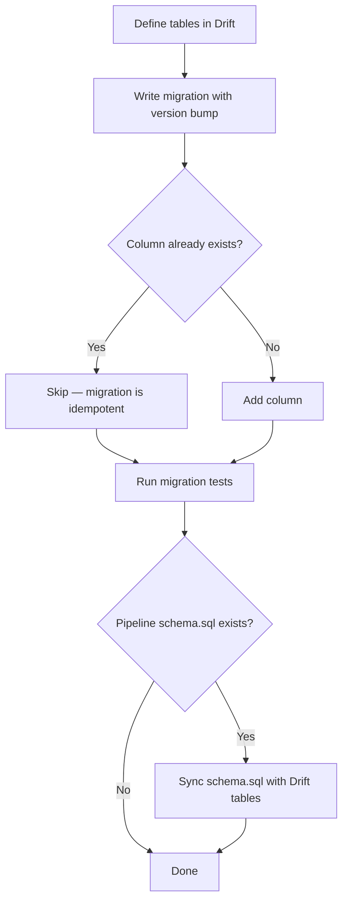

# Blueprint: Drift Database Migrations

<!-- METADATA — structured for agents, useful for humans
tags:        [drift, sqlite, database, migrations, flutter, dart]
category:    architecture
difficulty:  intermediate
time:        1 hour
stack:       [flutter, dart, drift, sqlite]
-->

> Idempotent database migrations with Drift, keeping schemas in sync between a build pipeline and the app, with in-memory testing.

## TL;DR

You will have a repeatable migration workflow where every `ALTER TABLE` is safe to re-run, an in-memory DB factory for fast unit tests, and a convention for keeping a pipeline's `schema.sql` in lockstep with Drift table definitions.

## When to Use

- You are adding or modifying columns in a Drift (SQLite) database
- Your project has a build pipeline that also produces or reads the same SQLite schema
- You need migrations that survive partial runs, re-installs, or backup restores
- When **not** to use: greenfield apps with no existing users (just recreate the DB)

## Prerequisites

- [ ] Drift and `drift_dev` added to `pubspec.yaml`
- [ ] At least one existing Drift database class with a `schemaVersion` getter
- [ ] Basic familiarity with SQLite `PRAGMA table_info`

## Overview



## Steps

### 1. Define tables in Drift

**Why**: Drift generates type-safe Dart code from table definitions. The table class is the single source of truth inside the app.

```dart
class Texts extends Table {
  IntColumn get id => integer().autoIncrement()();
  TextColumn get content => text()();
  // NEW column — added in migration v2
  TextColumn get language => text().withDefault(const Constant('pli'))();
}
```

**Expected outcome**: After running `dart run build_runner build`, Drift generates the companion classes and the new column appears in the generated schema.

### 2. Write migration with version bump

**Why**: Drift only runs migration callbacks whose version range matches the jump from the on-device version to the new `schemaVersion`.

```dart
@override
int get schemaVersion => 2; // was 1

@override
MigrationStrategy get migration => MigrationStrategy(
  onUpgrade: (migrator, from, to) async {
    if (from < 2) {
      await _migrateV1ToV2(migrator);
    }
    // Future migrations chain here:
    // if (from < 3) { await _migrateV2ToV3(migrator); }
  },
);
```

**Expected outcome**: A fresh install calls `onCreate`; an upgrade from v1 calls `_migrateV1ToV2`.

### 3. Make migrations idempotent (column existence check)

**Why**: `Migrator.addColumn()` calls `ALTER TABLE ADD COLUMN` under the hood. SQLite does **not** support `IF NOT EXISTS` for `ALTER TABLE ADD COLUMN`. If the column already exists — from a partial migration, a restored backup, or a re-run — you get `SqliteException(1): duplicate column name`. The only safe approach is to check first.

```dart
Future<void> _migrateV1ToV2(Migrator m) async {
  // Idempotent column add — check before altering
  if (!await _columnExists('texts', 'language')) {
    await m.addColumn(texts, texts.language);
  }
}

/// Returns true if [column] already exists in [table].
Future<bool> _columnExists(String table, String column) async {
  final result = await customSelect(
    'PRAGMA table_info($table)',
  ).get();
  return result.any((row) => row.read<String>('name') == column);
}
```

For databases with many migrations, extract a reusable helper:

```dart
extension IdempotentMigrator on DatabaseConnectionUser {
  Future<void> addColumnIfNotExists(
    Migrator migrator,
    TableInfo table,
    GeneratedColumn column,
  ) async {
    final tableName = table.actualTableName;
    final columnName = column.name;
    final rows = await customSelect('PRAGMA table_info($tableName)').get();
    final exists = rows.any((r) => r.read<String>('name') == columnName);
    if (!exists) {
      await migrator.addColumn(table, column);
    }
  }
}
```

**Expected outcome**: Running the migration twice produces no error and no duplicate column.

### 4. Create a `forTesting()` factory

**Why**: Unit tests need a disposable database that starts with the latest schema but does not touch disk. `Migrator.createAll()` builds every table from current Drift definitions in an in-memory SQLite DB.

```dart
class CorpusDatabase extends _$CorpusDatabase {
  CorpusDatabase(QueryExecutor e) : super(e);

  /// In-memory database with the latest schema — no migrations, no files.
  static Future<CorpusDatabase> forTesting() async {
    final db = CorpusDatabase(
      NativeDatabase.memory(),
    );
    // createAll() reads current table definitions, not migration history
    final migrator = db.createMigrator();
    await migrator.createAll();
    return db;
  }

  // ...
}
```

**Expected outcome**: `await CorpusDatabase.forTesting()` returns a ready-to-use DB with all tables and columns at the latest schema version.

### 5. Write migration tests

**Why**: A migration test catches schema mismatches before they reach users. Test both the upgrade path and the fresh-install path.

```dart
void main() {
  late CorpusDatabase db;

  setUp(() async {
    db = await CorpusDatabase.forTesting();
  });

  tearDown(() => db.close());

  test('v1 → v2 migration adds language column', () async {
    // Simulate v1 schema: drop the column, then migrate
    await db.customStatement('ALTER TABLE texts RENAME TO texts_old');
    await db.customStatement(
      'CREATE TABLE texts (id INTEGER PRIMARY KEY AUTOINCREMENT, content TEXT NOT NULL)',
    );
    await db.customStatement('INSERT INTO texts SELECT id, content FROM texts_old');
    await db.customStatement('DROP TABLE texts_old');

    // Run the migration
    final migrator = db.createMigrator();
    await db._migrateV1ToV2(migrator);

    // Verify column exists
    final info = await db.customSelect('PRAGMA table_info(texts)').get();
    expect(info.any((r) => r.read<String>('name') == 'language'), isTrue);
  });

  test('idempotent migration does not throw on re-run', () async {
    final migrator = db.createMigrator();
    // Run twice — second call must be a no-op
    await db._migrateV1ToV2(migrator);
    await db._migrateV1ToV2(migrator);
  });
}
```

**Expected outcome**: Both tests pass. The idempotency test proves a double-run is harmless.

### 6. Keep `schema.sql` in sync (if pipeline exists)

**Why**: When a build pipeline (e.g., a Python or Dart script that populates a corpus DB) defines the schema in a standalone SQL file, two sources of truth exist. They **must** match or the app will fail to open the pipeline-generated DB.

Convention:

| Source | Role |
|--------|------|
| `pipeline/schema.sql` | Reference DDL executed by the pipeline |
| Drift table classes | App-side schema used at runtime |

Sync procedure:

1. Make the change in the Drift table class first (step 1).
2. Run `dart run build_runner build` to regenerate.
3. Update `pipeline/schema.sql` to mirror the new column, default, and type.
4. Add a CI check that diffs the two schemas (or at minimum, a comment in the PR template reminding reviewers).

```sql
-- pipeline/schema.sql  (keep in sync with lib/db/tables.dart)
CREATE TABLE IF NOT EXISTS texts (
    id      INTEGER PRIMARY KEY AUTOINCREMENT,
    content TEXT    NOT NULL,
    language TEXT   NOT NULL DEFAULT 'pli'   -- added in v2
);
```

> **Decision**: If your project has no pipeline-generated DB, skip this step entirely.

**Expected outcome**: `pipeline/schema.sql` and the Drift table class produce structurally identical tables.

## Gotchas

> **`addColumn` crash on duplicate**: `Migrator.addColumn()` throws `SqliteException(1): duplicate column name` if the column already exists. SQLite has no `ALTER TABLE ... ADD COLUMN IF NOT EXISTS`. **Fix**: Always check with `PRAGMA table_info` before calling `addColumn` (see step 3).

> **Partial migrations**: If the app crashes mid-migration (e.g., between two `addColumn` calls), some columns exist and others do not, but Drift records the version as not-yet-bumped. The next launch re-runs the migration. Without idempotency checks every successful `addColumn` from the first run will now throw. **Fix**: Make every individual `addColumn` idempotent.

> **Schema drift between pipeline and app**: The pipeline's `schema.sql` and Drift tables diverge silently. The app then fails to read rows or writes NULLs into columns the pipeline expects. **Fix**: Add a CI step or test that compares both schemas, and document the sync convention in the repo.

> **Forgetting to bump `schemaVersion`**: You add a migration callback but leave the version unchanged. Drift never calls the callback because `from == to`. **Fix**: Treat the version bump and the migration body as an atomic pair — always change both in the same commit.

## Checklist

- [ ] New column added to the Drift table class with a sensible default
- [ ] `schemaVersion` incremented
- [ ] Migration callback written with idempotency guard (`_columnExists` check)
- [ ] `forTesting()` factory exists and uses `NativeDatabase.memory()` + `createAll()`
- [ ] Migration test passes (upgrade path)
- [ ] Idempotency test passes (double-run)
- [ ] `pipeline/schema.sql` updated (if applicable)
- [ ] `build_runner build` ran successfully after table change

## Artifacts

| Artifact | Location | Description |
|----------|----------|-------------|
| Database class | `lib/db/database.dart` | Drift database with migration strategy |
| Table definitions | `lib/db/tables.dart` | Drift table classes (source of truth for app) |
| Pipeline schema | `pipeline/schema.sql` | Reference DDL for pipeline-generated DBs |
| Migration tests | `test/db/migration_test.dart` | Upgrade-path and idempotency tests |

## References

- [Drift migrations documentation](https://drift.simonbinder.eu/Migrations/) — official guide to schema versioning and migration callbacks
- [SQLite ALTER TABLE](https://www.sqlite.org/lang_altertable.html) — documents the lack of `IF NOT EXISTS` for `ADD COLUMN`
- [SQLite PRAGMA table_info](https://www.sqlite.org/pragma.html#pragma_table_info) — returns column metadata used for idempotency checks
- [Drift testing guide](https://drift.simonbinder.eu/testing/) — patterns for in-memory test databases
