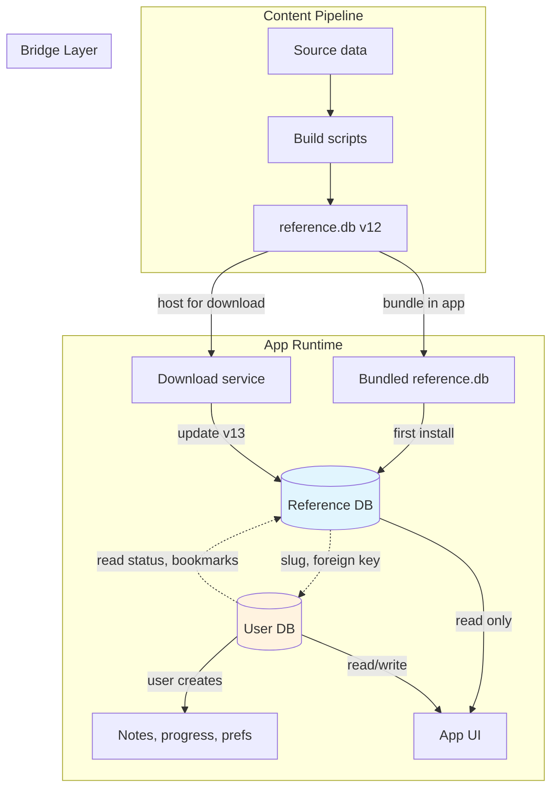
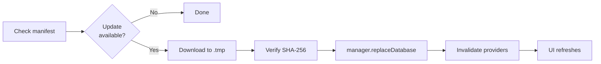

# Blueprint: Dual Database Pattern for Data-Driven Apps

<!--
tags:        [database, architecture, sqlite, content-db, user-db, versioning, data-driven]
category:    architecture
difficulty:  intermediate
time:        2-3 hours
stack:       []
-->

> Separate reference/content data from user data using two databases, enabling independent content updates without app releases.

## TL;DR

Your app uses two databases: a **reference DB** (read-only content, updatable independently) and a **user DB** (user-generated data, migrations with the app). This decouples content releases from app releases and keeps user data safe during updates.

## When to Use

- Apps with curated/editorial content (articles, courses, catalogs, translations)
- Content that needs updating more frequently than the app ships
- Apps supporting multiple languages with downloadable content packs
- When **not** to use: simple apps where all data is user-generated, or pure API-backed apps with no local content

## Prerequisites

- [ ] Local database engine (SQLite, Realm, CoreData, etc.)
- [ ] Clear distinction between "system content" and "user data"
- [ ] Content pipeline or build process to generate the reference DB

## Overview



## Steps

### 1. Define the boundary between reference and user data

**Why**: The most critical decision. Getting this wrong means painful migrations later.

**Reference DB** (read-only, replaceable):
- Curated content (articles, courses, catalog items)
- Search indexes, embeddings, metadata
- Translations, localized strings
- Anything produced by a pipeline or editorial process

**User DB** (read-write, persistent):
- User-created content (notes, highlights, bookmarks)
- Progress tracking (reading sessions, course progress)
- Preferences, settings
- Anything the user would lose if deleted

**The bridge**: Some data crosses the boundary. User DB references content by stable identifiers (slugs, UIDs) rather than auto-increment IDs.

```
Reference DB                    User DB
┌─────────────┐                ┌──────────────────┐
│ articles     │←──slug────────│ article_read_status│
│ suttas       │←──sutta_uid───│ bookmarks         │
│ study_plans  │←──plan_slug───│ study_progress    │
│ embeddings   │               │ notes             │
│ metadata     │               │ preferences       │
└─────────────┘                └──────────────────┘
```

> **Rule**: Reference DB rows are identified by **stable business keys** (slugs, UIDs), never by auto-increment IDs. User DB foreign references use these stable keys.

**Expected outcome**: A clear list of which tables go where.

### 2. Design the reference DB lifecycle

**Why**: The reference DB is a deployable artifact — it needs versioning, bundling, downloading, and replacement logic.

**Three states**:
1. **Bundled** — shipped inside the app binary (first install, offline fallback)
2. **Downloaded** — fetched from server (newer than bundled)
3. **Updating** — transitioning between versions

**Version tracking**:
```
Asset version (in code):     controls bundled DB extraction on app update
Manifest version (on server): compared to detect available downloads
Local version (on device):   tracks what's currently installed
```

```
Fresh install:
  localVersion = assetVersion (e.g., 10)
  manifestVersion = 12
  → 12 > 10 → update available → download → localVersion = 12

App update (new bundled DB):
  assetVersion bumped to 11
  localVersion was 12 (downloaded)
  → 12 > 11 → keep downloaded version (it's newer)

App update (new bundled DB, user never downloaded):
  assetVersion bumped to 11
  localVersion was 10 (old bundled)
  → 11 > 10 → re-extract bundled asset
```

**Expected outcome**: Version logic handles all upgrade paths correctly.

### 3. Implement the DB manager

**Why**: SQLite connections hold file locks. Replacing a DB file while connections are open corrupts the database.

The DB manager is a singleton that:
- Opens and caches database connections by key (e.g., language code)
- Provides a `replaceDatabase(key, newFile)` method: close → cleanup WAL/SHM → swap file → reopen
- Provides a `closeDatabase(key)` for explicit cleanup before file operations
- Separates bundled DB from downloaded DB in the registry

```
// Pseudocode
class DatabaseManager {
    registry: Map<String, Database>
    bundledFallback: Database

    getDatabase(key) → registry[key] ?? open(key)
    getBundledFallback() → bundledFallback (always available)

    replaceDatabase(key, newFile):
        closeDatabase(key)
        deleteWalFiles(key)      // .db-wal, .db-shm
        rename(newFile → dbPath)
        registry[key] = open(key)

    closeDatabase(key):
        registry[key]?.close()
        registry.remove(key)
}
```

> **Critical rule**: NEVER replace a DB file without closing the connection first. SQLite WAL mode holds locks that cause "database disk image is malformed" errors.

**Expected outcome**: Safe DB replacement without corruption.

### 4. Handle the download flow

**Why**: Content updates are downloaded, verified, and swapped atomically.



Key principles:
- Download to a **temp file** first (atomic swap)
- **Verify integrity** (SHA-256 hash) before replacing
- The download service does NOT touch the DB — the manager does the swap
- After swap, **invalidate** all providers/caches that reference the old DB

**Expected outcome**: Users see updated content without restarting the app.

### 5. Set up the content pipeline

**Why**: The reference DB is a build artifact. You need reproducible builds.

```
pipeline/
├── ingest/          # Source data → raw tables
├── seed/            # Structured content → DB tables
├── dist/            # Embeddings, search indexes
├── tools/           # Validation, schema sync checks
├── output/          # Generated DBs
├── schema.sql       # Reference SQL schema
└── build_all.sh     # Single entry point
```

**Build flow**:
1. Ingest source data into tables
2. Seed structured content (articles, courses, translations)
3. Generate derived data (embeddings, search indexes)
4. Validate DB integrity
5. Update version manifest (version number + SHA-256)
6. Copy to app assets (bundled) + upload to server (downloadable)

> **Decision**: Schema is defined in TWO places — the pipeline SQL and the app ORM. Keep them in sync with automated validation (CI check).

**Expected outcome**: `./build_all.sh` produces a validated, versioned reference DB.

### 6. Handle schema evolution

**Why**: Both databases evolve, but with different strategies.

**Reference DB** — Replace, don't migrate:
- New version = new file. No ALTER TABLE needed.
- The pipeline always builds from scratch.
- Old downloaded DBs are simply replaced on next update.
- **Resilient queries**: New tables/columns may not exist in old downloaded DBs. Use try/catch returning empty results.

**User DB** — Migrate incrementally:
- Standard migration system (Drift, CoreData, Room, etc.)
- Idempotent migrations (check before ALTER)
- Never lose user data

**Cross-DB schema changes**:
- Adding a new table to reference DB? Add resilient queries in the app for users who haven't updated yet.
- Adding a new reference column that user DB depends on? Make it nullable in bridge queries.

**Expected outcome**: Both databases can evolve independently without breaking the app.

## Variants

<details>
<summary><strong>Variant: Multiple reference DBs (one per language)</strong></summary>

For multilingual apps, each language gets its own reference DB:

```
assets/corpus_en.db  (bundled)
downloads/corpus_fr.db  (downloaded)
downloads/corpus_vi.db  (downloaded)
```

The DB manager keys by language code. Users download only the languages they need. The bundled default language (usually EN) is always available as fallback.

Version tracking is per-language in the manifest:
```json
{
  "en": {"version": 12, "sha256": "...", "url": "..."},
  "fr": {"version": 8, "sha256": "...", "url": "..."}
}
```

</details>

<details>
<summary><strong>Variant: Hybrid entities (bridge pattern)</strong></summary>

Some entities live in both databases:

- **Articles**: Content (blocks, translations) in reference DB. Read status in user DB. Linked by `slug`.
- **Study plans**: Plan definition in reference DB. User progress in user DB. Linked by `plan_slug`.

The app joins data from both DBs at the provider/repository level — never at the SQL level (different DB files).

```
// Pseudocode
getArticleWithStatus(slug):
    article = referenceDb.getArticle(slug)
    status = userDb.getReadStatus(slug)
    return ArticleView(article, status)
```

</details>

## Gotchas

> **Downloaded DB bypasses bundled version check**: If a downloaded DB exists (even if stale), the app may prefer it over a newer bundled asset. **Fix**: Compare the downloaded version against the bundled asset version. Only prefer downloaded if its version exceeds the bundled version.

> **Two version numbers that must stay in sync**: The bundled asset version (in code) and the manifest version (on server) must follow the rule: `manifest version > asset version` for updates to be detected. **Fix**: When bumping the asset version (new app release), also bump the manifest version above it.

> **Replacing DB file while connection is open**: Causes "database disk image is malformed" errors. **Fix**: Always close the connection via the DB manager before any file operation. Clean up WAL/SHM files too.

> **New tables in reference DB crash old downloaded DBs**: Users who downloaded an old version don't have new tables. Queries to those tables crash. **Fix**: Wrap queries to new tables in try/catch returning empty results. This provides graceful degradation until the user downloads the update.

> **Auto-increment IDs differ across reference DB versions**: Don't use reference DB auto-increment IDs as foreign keys in the user DB. **Fix**: Always use stable business keys (slugs, UIDs) for cross-DB references.

> **Schema defined in two places drifts**: Pipeline SQL and app ORM diverge silently. **Fix**: Automated schema sync check in CI that compares both definitions and fails on drift.

## Checklist

- [ ] Clear boundary defined between reference and user data
- [ ] Reference DB uses stable business keys (not auto-increment IDs)
- [ ] Version tracking handles: fresh install, app update, download update
- [ ] DB manager closes connections before file replacement
- [ ] WAL/SHM files cleaned up during replacement
- [ ] Download flow: temp file → verify SHA-256 → atomic swap
- [ ] Providers/caches invalidated after DB replacement
- [ ] Pipeline produces reproducible, versioned builds
- [ ] Schema sync validated in CI
- [ ] Resilient queries for tables that may not exist in old downloads
- [ ] User DB migrations are idempotent

## Artifacts

| Artifact | Location | Description |
|----------|----------|-------------|
| Reference DB | `assets/reference.db` | Bundled content database |
| User DB | App data directory | User-generated data with migrations |
| DB Manager | `lib/core/services/db_manager` | Singleton managing all DB connections |
| Version manifest | Server + `assets/` | Version numbers + SHA-256 hashes per DB |
| Pipeline | `pipeline/` | Build scripts producing reference DBs |
| Schema sync check | `pipeline/tools/` | CI validation of schema consistency |

## References

- [SQLite WAL mode](https://www.sqlite.org/wal.html) — understanding file locks during replacement
- [Drift Database Migrations](drift-database-migrations.md) — companion blueprint for user DB migrations
- [Data Pipeline i18n](../patterns/data-pipeline-i18n.md) — companion blueprint for content pipeline
- [Data Fallback Resolution](../patterns/data-fallback-resolution.md) — fallback pattern for incomplete reference data
