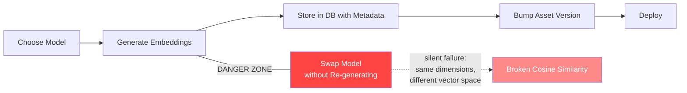

# Blueprint: Embedding Model Management

<!-- METADATA — structured for agents, useful for humans
tags:        [embeddings, onnx, ml, semantic-search, model-management]
category:    architecture
difficulty:  intermediate
time:        1 hour
stack:       [python, onnx]
-->

> Safely swap ONNX embedding models, re-generate embeddings, and version the resulting assets so deployed apps never silently serve stale or mismatched vectors.

## TL;DR

Switching embedding models (even between models with identical output dimensions) invalidates all existing vectors. This blueprint walks through the full lifecycle: choosing a model, generating embeddings, storing them with metadata, bumping the asset version, and deploying without breaking semantic search for existing installs.

## When to Use

- You need to change the ONNX embedding model powering local semantic search (e.g. `all-MiniLM-L6-v2` to `multilingual-e5-small`).
- You are adding embedding-based search to a new corpus or locale for the first time.
- A new app release must ship updated embeddings and you want zero silent failures.
- **Not** applicable when you only need to update corpus text without changing the model itself — in that case, just re-run the embedding pipeline without a model swap.

## Prerequisites

- [ ] Python 3.9+ installed
- [ ] ONNX Runtime (`pip install onnxruntime`)
- [ ] Access to the embedding generation script (e.g. `pipeline/dist/add_embeddings.py`)
- [ ] The target ONNX model file downloaded and available locally
- [ ] A working copy of the corpus database (e.g. `corpus.db`)

## Overview



## Steps

### 1. Choose your embedding model

**Why**: Not all models are interchangeable. The model you pick determines output dimensions, inference speed, binary size, and language coverage. Choosing wrong means re-doing this work later.

Key considerations:

| Factor | Question to answer |
|--------|--------------------|
| **Multilingual?** | Does the app serve more than one locale? If yes, pick a multilingual model. |
| **Dimensions** | Higher dimensions capture more nuance but increase storage and search cost. 384-dim is a common sweet spot. |
| **Speed** | Profile inference time on your slowest target device. Mobile/edge constraints differ from server. |
| **Size** | ONNX model file size ships with the app. Aim for under 100 MB for mobile. |

**Decision**: For apps that serve multiple locales, prefer `multilingual-e5-small` (384-dim, ~100 MB). It works across all languages, so semantic search functions correctly regardless of the active locale — no need to maintain separate per-language models.

**Expected outcome**: A single ONNX model file selected and documented for the project.

### 2. Generate embeddings for your corpus

**Why**: Embeddings are model-specific numerical representations. Every time the model changes, all vectors must be regenerated from scratch.

First, clear any existing embeddings to avoid mixing vectors from different models:

```bash
# Clear old embeddings from the corpus database
sqlite3 pipeline/output/corpus_en.db "DELETE FROM embeddings;"
```

Then generate fresh embeddings with the chosen model:

```bash
python3 pipeline/dist/add_embeddings.py --db pipeline/output/corpus_en.db
```

Repeat for every locale-specific database if applicable:

```bash
for db in pipeline/output/corpus_*.db; do
  sqlite3 "$db" "DELETE FROM embeddings;"
  python3 pipeline/dist/add_embeddings.py --db "$db"
done
```

**Expected outcome**: Each corpus database contains embeddings produced exclusively by the new model. Verify with:

```bash
sqlite3 pipeline/output/corpus_en.db "SELECT COUNT(*) FROM embeddings;"
```

### 3. Store embeddings with model metadata

**Why**: Without metadata, there is no programmatic way to detect a model/embedding mismatch after the fact. Recording the model name and version alongside the vectors makes the system self-describing.

Ensure the embeddings table (or a companion metadata table) tracks at minimum:

| Column | Example value | Purpose |
|--------|---------------|---------|
| `model_name` | `multilingual-e5-small` | Identifies which model produced the vectors |
| `model_version` | `v1.0.0` or commit hash | Pinpoints the exact model weights |
| `dimensions` | `384` | Sanity-check field |
| `generated_at` | `2026-04-02T12:00:00Z` | Audit trail |

```sql
CREATE TABLE IF NOT EXISTS embedding_metadata (
    model_name    TEXT NOT NULL,
    model_version TEXT NOT NULL,
    dimensions    INTEGER NOT NULL,
    generated_at  TEXT NOT NULL DEFAULT (datetime('now'))
);
```

At generation time, insert a row so any consumer can verify compatibility at runtime.

**Expected outcome**: A metadata record exists in every corpus database that unambiguously identifies the model behind the stored vectors.

### 4. Version your embeddings (asset version bump)

**Why**: Apps that bundle the corpus database as a pre-built asset cache locally. If you regenerate embeddings server-side but do not bump the asset version, existing installs will keep using the stale, now-incompatible embeddings indefinitely.

Bump the asset version constant in your app code:

```dart
// Example (Dart/Flutter) — adapt to your stack
const _kCorpusAssetVersion = 7; // was 6 → bump after regeneration
```

```swift
// Example (Swift)
let kCorpusAssetVersion = 7
```

```kotlin
// Example (Kotlin)
const val CORPUS_ASSET_VERSION = 7
```

The app's asset extraction logic should compare the bundled version against the locally cached version and re-extract when they differ.

**Expected outcome**: The asset version constant is incremented. On next app launch, the runtime detects the mismatch and replaces the local database with the freshly bundled one.

### 5. Swap models safely (full checklist)

**Why**: This is the end-to-end sequence that prevents the "silent failure" scenario. Skipping or reordering steps leads to broken search that produces no errors — only meaningless results.

The safe swap sequence:

1. **Clear** all existing embeddings from every corpus database.
2. **Regenerate** embeddings using the new model (step 2).
3. **Record** model metadata (step 3).
4. **Bump** the asset version (step 4).
5. **Test** semantic search queries against known-good results before shipping.
6. **Deploy** the updated databases and app binary together.

> **Decision**: If you are only updating the corpus text (not changing the model), you can skip the clear step and simply re-run embedding generation. You still need to bump the asset version.

**Expected outcome**: The new model is in production, all vectors are consistent, and existing installs re-extract the updated asset on next launch.

## Gotchas

> **Same dimensions, different vector spaces**: Two models can both output 384-dimensional vectors, but those vectors live in entirely different mathematical spaces. Cosine similarity between vectors from `all-MiniLM-L6-v2` and `multilingual-e5-small` is meaningless — the code will not crash, but search results will be garbage. **Fix**: Always clear and regenerate all embeddings when switching models. Never mix vectors from different models in the same database.

> **Forgetting to bump the asset version**: You regenerate embeddings on your build server, but the app binary still carries the old version constant. Existing installs never re-extract the asset — they keep serving stale embeddings forever. **Fix**: Make the version bump part of your CI pipeline or pre-commit checklist. Automate it if possible (e.g. hash the model file and embed that as the version).

> **Mixing model versions across locales**: If `corpus_en.db` uses model A and `corpus_fr.db` uses model B, cross-locale search or fallback logic will produce inconsistent results. **Fix**: Unify on a single model for all locales. Run the generation script against every database in the same pipeline step to guarantee consistency.

> **Model file not bundled with the build**: The embedding generation script may reference a model path that exists on your dev machine but is absent in CI. The pipeline succeeds locally but fails in CI with a cryptic ONNX error. **Fix**: Pin the model file in version control or a deterministic download step, and validate its checksum before generation.

## Checklist

- [ ] Single embedding model selected and documented for the project
- [ ] Old embeddings cleared from all corpus databases
- [ ] New embeddings generated for every locale/corpus
- [ ] Model metadata recorded in each database
- [ ] Asset version constant bumped in app code
- [ ] Semantic search tested with known queries producing expected results
- [ ] CI pipeline updated to use the new model path
- [ ] No mixed-model vectors remain in any database

## Artifacts

| Artifact | Location | Description |
|----------|----------|-------------|
| Corpus database(s) | `pipeline/output/corpus_*.db` | SQLite databases containing text and embedding vectors |
| Embedding script | `pipeline/dist/add_embeddings.py` | Python script that reads corpus text and writes embeddings |
| Asset version constant | App source (e.g. `_kCorpusAssetVersion`) | Integer that triggers re-extraction on version mismatch |
| ONNX model file | Project-specific path | The model binary used by the embedding script |

## References

- [ONNX Runtime documentation](https://onnxruntime.ai/docs/) — official docs for running ONNX models
- [multilingual-e5-small on Hugging Face](https://huggingface.co/intfloat/multilingual-e5-small) — model card, benchmarks, and usage
- [all-MiniLM-L6-v2 on Hugging Face](https://huggingface.co/sentence-transformers/all-MiniLM-L6-v2) — the English-only model being replaced
- [SQLite documentation](https://www.sqlite.org/docs.html) — reference for corpus database operations
