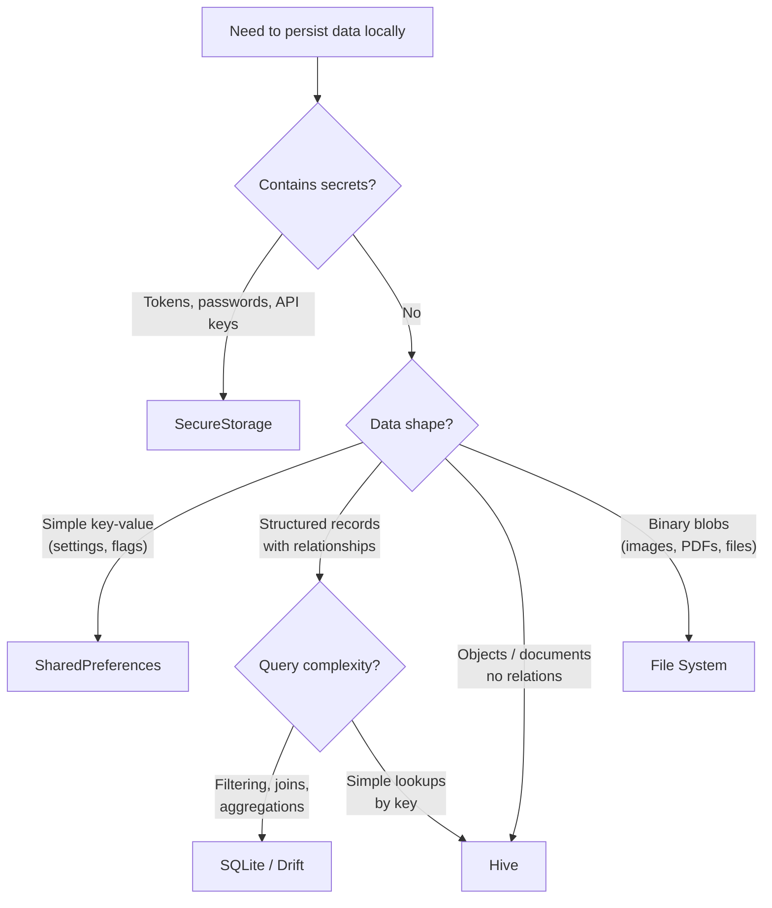

# Blueprint: Local Storage Decision Guide

<!-- METADATA — structured for agents, useful for humans
tags:        [local-storage, shared-preferences, hive, sqlite, drift, secure-storage, flutter]
category:    architecture
difficulty:  beginner
time:        30 min
stack:       [flutter, dart]
-->

> A decision framework for choosing the right local storage solution in Flutter — SharedPreferences, Hive, SQLite/Drift, SecureStorage, or file system.

## TL;DR

Match your data to the simplest storage that satisfies its constraints: key-value settings go in SharedPreferences, structured/queryable data goes in SQLite/Drift, fast NoSQL objects go in Hive, secrets go in SecureStorage, and binary blobs go on the file system. Most production apps use two or three of these together.

## When to Use

- You need to persist data locally and aren't sure which storage mechanism fits
- You're reviewing an existing app where everything is crammed into SharedPreferences (including tokens)
- A team member asks "should we use Hive or SQLite?" and you need a principled answer
- You're designing an offline-first feature and need to choose a persistence layer
- When **not** to use it: your app has no local persistence needs (pure API-driven, no caching, no settings)

## Prerequisites

- [ ] Basic Flutter/Dart knowledge
- [ ] Understanding of your app's data types and access patterns (what you're storing, how you query it)
- [ ] A rough sense of data volume (kilobytes of settings vs. megabytes of records)

## Overview



## Steps

### 1. Evaluate your data against the decision matrix

**Why**: Different storage solutions have fundamentally different strengths. Picking the wrong one means either fighting the API or migrating later. A quick matrix check saves hours of rework.

Use this matrix to score each piece of data you need to persist:

| Factor | SharedPreferences | Hive | SQLite / Drift | SecureStorage | File System |
|--------|-------------------|------|----------------|---------------|-------------|
| **Data type** | Primitives (String, int, bool, List\<String\>) | Dart objects, maps, lists | Structured rows with typed columns | Small strings (tokens, keys) | Any binary data |
| **Data size** | < 1 MB total | Moderate (MBs) | Large (MBs to GBs) | < 4 KB per entry | Unlimited |
| **Query needs** | Key lookup only | Key lookup, basic filtering | Full SQL: joins, WHERE, ORDER BY, aggregation | Key lookup only | Path-based access |
| **Encryption** | None | AES via `hive_flutter` | None by default (SQLCipher available) | OS-level (Keychain / EncryptedSharedPrefs) | Manual |
| **Performance** | Fast for small reads | Very fast (in-memory cache) | Fast with indexes, slower without | Slower (OS encryption overhead) | Depends on file size |
| **Schema / migrations** | None | Type adapters (manual) | Full migration system (Drift) | None | None |
| **Relationships** | None | Manual | Foreign keys, joins | None | None |

**Expected outcome**: Each piece of persistent data mapped to one or two candidate storage solutions.

### 2. SharedPreferences — small key-value settings

**Why**: SharedPreferences is the simplest storage option and the right default for small, non-sensitive settings. It wraps platform-native key-value stores (NSUserDefaults on iOS, SharedPreferences on Android) with zero setup.

**Use for**: theme preference, locale, onboarding-complete flag, last-sync timestamp, feature flags.

```yaml
# pubspec.yaml
dependencies:
  shared_preferences: ^2.2.0
```

```dart
import 'package:shared_preferences/shared_preferences.dart';

// Write
final prefs = await SharedPreferences.getInstance();
await prefs.setBool('onboarding_complete', true);
await prefs.setString('locale', 'en');

// Read
final complete = prefs.getBool('onboarding_complete') ?? false;
final locale = prefs.getString('locale') ?? 'en';

// Remove
await prefs.remove('locale');
```

**Boundaries — do NOT use SharedPreferences for**:
- Sensitive data (tokens, passwords) — it's stored in plaintext XML/plist
- Large data sets (hundreds of entries, lists of objects)
- Data that needs querying beyond key lookup
- Complex objects (you'd have to JSON-encode, which is a sign you need Hive or SQLite)

**Expected outcome**: App settings persist across launches with minimal code and no schema management.

### 3. SQLite / Drift — relational data with queries and migrations

**Why**: When your data has structure, relationships, or needs filtering/sorting/aggregation, a relational database is the right tool. Drift (formerly Moor) provides a type-safe Dart API on top of SQLite, with compile-time query validation and built-in migrations.

**Use for**: todo items, transaction history, product catalogs, chat messages, any data you'd put in a SQL table.

```yaml
# pubspec.yaml
dependencies:
  drift: ^2.14.0
  sqlite3_flutter_libs: ^0.5.0
  path_provider: ^2.1.0
  path: ^1.8.0

dev_dependencies:
  drift_dev: ^2.14.0
  build_runner: ^2.4.0
```

```dart
import 'package:drift/drift.dart';

// Define a table
class Transactions extends Table {
  IntColumn get id => integer().autoIncrement()();
  TextColumn get description => text()();
  RealColumn get amount => real()();
  DateTimeColumn get date => dateTime()();
  TextColumn get category => text().withDefault(const Constant('other'))();
}

// Define the database
@DriftDatabase(tables: [Transactions])
class AppDatabase extends _$AppDatabase {
  AppDatabase(super.e);

  @override
  int get schemaVersion => 2;

  @override
  MigrationStrategy get migration => MigrationStrategy(
    onUpgrade: (migrator, from, to) async {
      if (from < 2) {
        await migrator.addColumn(transactions, transactions.category);
      }
    },
  );

  // Type-safe query
  Future<List<Transaction>> getByCategory(String category) {
    return (select(transactions)
      ..where((t) => t.category.equals(category))
      ..orderBy([(t) => OrderingTerm.desc(t.date)])
    ).get();
  }

  // Aggregation
  Future<double> totalForMonth(DateTime month) {
    final start = DateTime(month.year, month.month);
    final end = DateTime(month.year, month.month + 1);
    final query = selectOnly(transactions)
      ..addColumns([transactions.amount.sum()])
      ..where(transactions.date.isBetweenValues(start, end));
    return query.map((row) => row.read(transactions.amount.sum()) ?? 0.0).getSingle();
  }
}
```

**When NOT to use SQLite/Drift**:
- Simple key-value pairs (SharedPreferences is simpler)
- You only need to store and retrieve objects by key (Hive is faster with less ceremony)
- You have fewer than ~20 records with no query needs

**Expected outcome**: A type-safe, queryable local database with a clear migration path for schema changes.

### 4. Hive — fast NoSQL object storage

**Why**: Hive is a lightweight, pure-Dart NoSQL database optimized for speed. It uses an in-memory cache backed by a binary file, making reads extremely fast. It's ideal for storing Dart objects without the overhead of SQL schemas.

**Use for**: cached API responses, user profile objects, app configuration objects, shopping cart, draft forms.

```yaml
# pubspec.yaml
dependencies:
  hive: ^2.2.3
  hive_flutter: ^1.1.0

dev_dependencies:
  hive_generator: ^2.0.1
  build_runner: ^2.4.0
```

```dart
import 'package:hive_flutter/hive_flutter.dart';

// 1. Initialize in main()
await Hive.initFlutter();
Hive.registerAdapter(UserProfileAdapter());
await Hive.openBox<UserProfile>('profiles');

// 2. Define model with TypeAdapter
@HiveType(typeId: 0)
class UserProfile extends HiveObject {
  @HiveField(0)
  final String name;

  @HiveField(1)
  final String email;

  @HiveField(2)
  final int age;

  UserProfile({required this.name, required this.email, required this.age});
}

// 3. CRUD operations
final box = Hive.box<UserProfile>('profiles');

// Write
await box.put('current_user', UserProfile(name: 'Alice', email: 'a@b.com', age: 30));

// Read
final user = box.get('current_user');

// Delete
await box.delete('current_user');

// Listen to changes (reactive)
box.listenable().addListener(() {
  // Box contents changed
});
```

**Key constraints**:
- No relations or joins — if you need those, use SQLite/Drift
- Type adapters must be registered before opening a box
- Field indexes (`@HiveField(n)`) must never be reused or changed — this is your "migration" system
- No built-in full-text search or complex queries

**Expected outcome**: Fast object persistence with minimal boilerplate, suitable for caching and document-style storage.

### 5. SecureStorage — tokens, passwords, and secrets

**Why**: Credentials and tokens must never be stored in SharedPreferences, Hive, or SQLite — all of which store data in plaintext files on disk. `flutter_secure_storage` delegates to the OS-level secure enclave: Keychain on iOS and EncryptedSharedPreferences (backed by Android Keystore) on Android.

**Use for**: JWT tokens, refresh tokens, API keys, user passwords, biometric-related secrets.

```yaml
# pubspec.yaml
dependencies:
  flutter_secure_storage: ^9.0.0
```

```dart
import 'package:flutter_secure_storage/flutter_secure_storage.dart';

const storage = FlutterSecureStorage();

// Write
await storage.write(key: 'access_token', value: token);
await storage.write(key: 'refresh_token', value: refreshToken);

// Read
final token = await storage.read(key: 'access_token');

// Delete
await storage.delete(key: 'access_token');

// Delete all (e.g., on logout)
await storage.deleteAll();

// Android-specific options (require minSdk 23)
const androidOptions = AndroidOptions(encryptedSharedPreferences: true);
const secureStorage = FlutterSecureStorage(aOptions: androidOptions);
```

**Boundaries**:
- Do NOT store large data — SecureStorage is for small strings only (< 4 KB per entry is a safe guideline)
- Every read/write involves OS encryption overhead — not suitable for frequent bulk operations
- On Android, `encryptedSharedPreferences: true` requires **minSdk 23** (Android 6.0)
- On iOS, Keychain items can persist across app reinstalls — explicitly delete on "reset account" flows

**Expected outcome**: Sensitive credentials stored using OS-level encryption, inaccessible to other apps and not visible in plaintext on the file system.

### 6. File system — blobs, images, and documents

**Why**: Binary data (images, PDFs, audio, video, large JSON exports) doesn't belong in a database. The file system is purpose-built for this. Use `path_provider` to get platform-appropriate directories and standard `dart:io` for read/write.

**Use for**: downloaded images, PDF reports, exported data files, audio recordings, cached media.

```yaml
# pubspec.yaml
dependencies:
  path_provider: ^2.1.0
  path: ^1.8.0
```

```dart
import 'dart:io';
import 'package:path_provider/path_provider.dart';
import 'package:path/path.dart' as p;

// Get the right directory
final appDir = await getApplicationDocumentsDirectory(); // persists
final cacheDir = await getTemporaryDirectory();          // OS can clear

// Write a file
final file = File(p.join(appDir.path, 'reports', 'monthly.pdf'));
await file.parent.create(recursive: true);
await file.writeAsBytes(pdfBytes);

// Read a file
final bytes = await file.readAsBytes();

// Check existence
if (await file.exists()) { /* ... */ }

// Delete
await file.delete();

// List files in a directory
final dir = Directory(p.join(appDir.path, 'reports'));
final files = dir.listSync().whereType<File>().toList();
```

**Directory choice matters**:

| Directory | Persists | Backed up | Use case |
|-----------|----------|-----------|----------|
| `getApplicationDocumentsDirectory()` | Yes | Yes (iOS) | User-created content, exports |
| `getApplicationSupportDirectory()` | Yes | Yes (iOS) | App-managed files the user doesn't see |
| `getTemporaryDirectory()` | No (OS clears) | No | Caches, thumbnails, temp downloads |

**Expected outcome**: Binary files stored in platform-appropriate directories, with clear separation between persistent user data and disposable cache.

### 7. Combining storage types in a typical app

**Why**: Real apps don't use a single storage mechanism. Understanding how they compose prevents overlap, duplication, and the "we stored the token in SharedPreferences" security incident.

Here is how a typical production Flutter app layers its storage:

```
┌─────────────────────────────────────────────────┐
│                  Flutter App                     │
├─────────────────────────────────────────────────┤
│  SecureStorage     │  Auth tokens, API keys      │
├─────────────────────────────────────────────────┤
│  SharedPreferences │  Theme, locale, flags        │
├─────────────────────────────────────────────────┤
│  Hive              │  Cached profiles, drafts     │
│        OR          │                              │
│  SQLite/Drift      │  Transactions, messages,     │
│                    │  queryable records            │
├─────────────────────────────────────────────────┤
│  File System       │  Images, PDFs, exports        │
└─────────────────────────────────────────────────┘
```

**Practical example — a budgeting app**:

| Data | Storage | Why |
|------|---------|-----|
| Access token / refresh token | SecureStorage | Sensitive credential |
| Selected currency, theme mode | SharedPreferences | Simple key-value setting |
| Transaction records | SQLite/Drift | Needs filtering by date, category; aggregation for totals |
| Cached user profile from API | Hive | Object storage, fast reads, no relations |
| Exported PDF reports | File system | Binary blob, user-facing document |

**Wrap each storage behind a repository interface** so your business logic never depends on a specific storage package:

```dart
abstract class AuthTokenRepository {
  Future<String?> getAccessToken();
  Future<void> saveAccessToken(String token);
  Future<void> clearTokens();
}

class SecureStorageAuthTokenRepository implements AuthTokenRepository {
  final FlutterSecureStorage _storage;

  SecureStorageAuthTokenRepository(this._storage);

  @override
  Future<String?> getAccessToken() => _storage.read(key: 'access_token');

  @override
  Future<void> saveAccessToken(String token) =>
      _storage.write(key: 'access_token', value: token);

  @override
  Future<void> clearTokens() => _storage.deleteAll();
}
```

**Expected outcome**: A clear storage map for your app where each data type has exactly one home, wrapped behind repository abstractions for testability.

## Gotchas

> **SharedPreferences is NOT secure**: On Android, SharedPreferences writes to an unencrypted XML file in the app's data directory. On a rooted device, anyone can read it. On iOS, NSUserDefaults is similarly unencrypted. Never store tokens, passwords, or PII here. **Fix**: Use `flutter_secure_storage` for any sensitive data. Audit your SharedPreferences keys — if you see "token" or "password" in there, migrate immediately.

> **Hive box must be opened before use**: Calling `Hive.box('name')` before `Hive.openBox('name')` throws a `HiveError`. This is a common crash in apps that access Hive from multiple entry points (e.g., background isolates, deep links). **Fix**: Open all boxes in your `main()` before `runApp()`, or use a lazy initialization pattern with `Hive.isBoxOpen('name')` checks. Never assume a box is already open.

> **SecureStorage requires minSdk 23 on Android**: `EncryptedSharedPreferences` (the recommended Android backend) requires API level 23 (Android 6.0). On older devices, the plugin falls back to a less secure AES implementation. **Fix**: Set `minSdkVersion 23` in `android/app/build.gradle`. If you must support older devices, accept the fallback but document the security trade-off. As of 2025, devices below API 23 represent less than 2% of active Android installs.

> **SQLite is overkill for simple key-value storage**: Setting up Drift with code generation, table definitions, and migration strategies just to store five settings is a waste of time and adds build complexity. **Fix**: Use the decision matrix in Step 1. If you don't need queries, relationships, or migrations, you don't need SQLite.

> **Hive TypeAdapter field indexes are permanent**: If you assign `@HiveField(0)` to `name` and later delete that field, you cannot reuse index 0 for a different field. Reusing indexes corrupts existing data on disk. **Fix**: Treat HiveField indexes like database column IDs — only append, never reuse. Keep a comment listing retired indexes in your model class.

> **File system paths differ across platforms**: Hardcoding `/data/data/com.example/` or `~/Documents/` will fail on other platforms. The correct path varies by OS and app sandbox. **Fix**: Always use `path_provider` to get directories. Never construct file paths from string literals.

> **Hive does not survive isolate boundaries easily**: Hive boxes opened in the main isolate are not accessible from background isolates. Attempting to access them causes crashes or data corruption. **Fix**: If you need storage in a background isolate (e.g., `workmanager`), open a separate Hive instance in that isolate, or use SQLite which handles concurrent access natively.

## Checklist

- [ ] Every piece of persistent data is mapped to a storage type using the decision matrix
- [ ] Sensitive data (tokens, passwords, API keys) uses SecureStorage, not SharedPreferences or Hive
- [ ] SharedPreferences is only used for simple, non-sensitive key-value settings
- [ ] SQLite/Drift is used only when queries, relations, or migrations are genuinely needed
- [ ] Hive type adapters are registered before any box is opened
- [ ] HiveField indexes are never reused across schema changes
- [ ] File system paths use `path_provider`, not hardcoded strings
- [ ] Android `minSdkVersion` is >= 23 if using SecureStorage with EncryptedSharedPreferences
- [ ] Each storage mechanism is wrapped behind a repository interface for testability
- [ ] Storage choices are documented in CLAUDE.md or an ADR

## References

- [shared_preferences](https://pub.dev/packages/shared_preferences) — Flutter team's key-value storage plugin
- [flutter_secure_storage](https://pub.dev/packages/flutter_secure_storage) — Keychain (iOS) and EncryptedSharedPreferences (Android)
- [Drift documentation](https://drift.simonbinder.eu/) — type-safe SQLite for Dart and Flutter
- [Hive documentation](https://docs.hivedb.dev/) — lightweight, fast NoSQL database for Dart
- [path_provider](https://pub.dev/packages/path_provider) — platform-appropriate directory paths
- [Flutter cookbook: Persist data with SQLite](https://docs.flutter.dev/cookbook/persistence/sqlite) — official SQLite guide
- [Android Keystore system](https://developer.android.com/privacy-and-security/keystore) — how EncryptedSharedPreferences works under the hood
