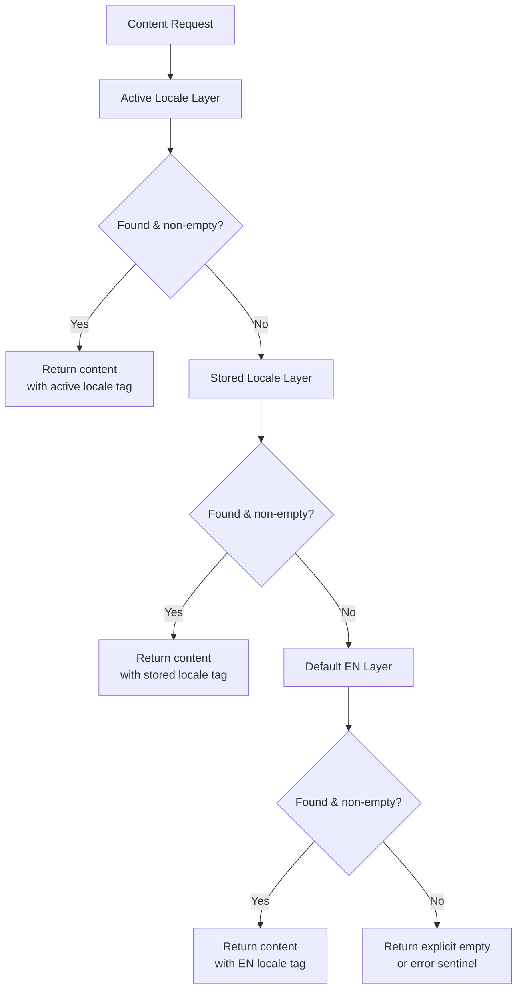

# Blueprint: Multilingual Content Resolution

<!-- METADATA — structured for agents, useful for humans
tags:        [i18n, multilingual, fallback, architecture, content-resolution]
category:    architecture
difficulty:  intermediate
time:        2 hours
stack:       []
-->

> Layered fallback pattern for apps that serve content in multiple languages with incomplete translations.

## TL;DR

Define an ordered stack of content layers (active locale, stored locale, default EN) and resolve every content request through a single resolver that walks the stack top-to-bottom, returning the first non-empty result. User-facing content blocks carry their locale immutably so display stays consistent even when the user switches languages.

## When to Use

- Your app serves content in multiple languages and translations are frequently incomplete
- Users can switch locales at runtime, but previously loaded content must keep its original language attribution
- You need a predictable, testable strategy for "what shows when a translation is missing"
- When **not** to use: single-language apps, or systems where every piece of content is guaranteed to exist in every locale

## Prerequisites

- [ ] A content storage layer (database, file system, API) that can be queried per locale
- [ ] A known default locale (typically EN) with complete content coverage
- [ ] A way to identify the user's active locale and any previously stored locale preference

## Overview



## Steps

### 1. Design the content layer stack

**Why**: A well-defined stack makes fallback order explicit and configurable rather than buried in conditional logic throughout the codebase.

Define a `ContentLayer` abstraction that pairs a locale with a data-access object. Then compose layers into an ordered `ContentStack`.

```
// Pseudocode

record ContentLayer(locale: Locale, dao: ContentDAO)

class ContentStack:
    layers: List<ContentLayer>   // ordered: highest priority first

    constructor(activeLocale, storedLocale, defaultLocale = EN):
        layers = deduplicate([
            ContentLayer(activeLocale, daoFor(activeLocale)),
            ContentLayer(storedLocale,  daoFor(storedLocale)),
            ContentLayer(defaultLocale, daoFor(defaultLocale)),
        ])
```

Deduplication matters: if the active locale and stored locale are both FR, the stack should not query FR twice.

**Expected outcome**: A single data structure that describes the full fallback chain for any content request.

### 2. Implement the resolver with fallback

**Why**: Centralising resolution in one component (the "Resolver") prevents scattered null-checks and inconsistent fallback logic across the codebase. This is the SegmentResolver pattern -- all content access goes through one entry point.

```
// Pseudocode

class ContentResolver:
    stack: ContentStack

    resolve(contentId) -> ResolvedContent | Empty:
        for layer in stack.layers:
            result = layer.dao.fetch(contentId)
            if result is not null AND result is not empty:
                return ResolvedContent(
                    body    = result,
                    locale  = layer.locale,
                    source  = layer,          // useful for debugging
                )
        return Empty(contentId)
```

Key rule: **never return raw content**. Always wrap it with the locale it actually came from so downstream code knows the language of what it received.

**Expected outcome**: A resolver that, given any content ID, walks the stack and returns the best available translation along with its locale metadata.

### 3. Handle locale immutability for user content

**Why**: When a user views content resolved as FR, that content block must remain tagged as FR even if the user later switches to EN. Without immutability, switching locales can corrupt displayed content -- a FR paragraph silently labelled EN, or mixed-language views.

```
// Pseudocode

record ContentBlock:
    body:       String
    locale:     Locale       // set once at creation, never mutated
    translator: String       // set once at creation

    // No setter for locale or translator.
    // To change language, discard and re-resolve.
```

Apply this at the boundary where resolved content enters the UI or response layer:

1. Resolve content via ContentResolver.
2. Construct an immutable ContentBlock with the returned locale.
3. If the user switches locale, **re-resolve from scratch** rather than patching existing blocks.

**Expected outcome**: ContentBlock objects that always truthfully report their language, regardless of the app's current locale setting.

### 4. Handle translator and variant mismatches

**Why**: A single locale can have content from multiple translators or translation variants. Picking "the" translator for a locale is a lossy operation that hides real differences in translation source.

```
// Pseudocode — WRONG
function translatorForLocale(locale) -> Translator:
    return DEFAULT_TRANSLATORS[locale]   // loses variant info

// Pseudocode — RIGHT
record ContentLayer(locale: Locale, translator: Translator, dao: ContentDAO)

class ContentStack:
    // Stack can contain multiple layers for the same locale
    // with different translators, ordered by preference.
    layers = [
        ContentLayer(FR, "translator-A", daoA),
        ContentLayer(FR, "translator-B", daoB),
        ContentLayer(EN, "default",      daoEN),
    ]
```

When the content corpus for a locale has multiple translators, model each as a separate layer rather than flattening them behind a single locale lookup.

**Expected outcome**: The stack correctly resolves content even when a locale has multiple translation sources, preferring higher-priority translators while falling through to others.

### 5. Add "empty result" checks (not just null)

**Why**: A common class of bugs (see the v2.2.2 lesson: 5 bugs traced to missing fallback) comes from checking only for null while ignoring empty strings, whitespace-only content, or zero-segment results.

```
// Pseudocode

function isUsable(result) -> Boolean:
    if result is null:          return false
    if result is "":            return false
    if result.trim() is "":    return false
    if result is List and result.length == 0:
                                return false
    return true
```

Use this predicate inside the resolver loop instead of a bare null check. Define "usable" once and share it.

**Expected outcome**: The resolver falls through to the next layer for empty strings, blank segments, and empty lists -- not only for null.

### 6. Test with incomplete translations

**Why**: The whole point of this architecture is graceful degradation. Tests must prove it works when translations are missing, partial, or empty.

Write tests for at least these scenarios:

| Scenario | Active | Stored | Default | Expected result |
|----------|--------|--------|---------|-----------------|
| Full hit | FR content exists | -- | -- | FR content returned |
| Active miss, stored hit | FR missing | DE exists | -- | DE content returned |
| Active + stored miss | FR missing | DE missing | EN exists | EN content returned |
| All miss | FR missing | DE missing | EN missing | Explicit Empty returned |
| Empty string in active | FR = "" | DE exists | -- | DE content returned |
| Null in active | FR = null | -- | EN exists | EN content returned |
| Locale tag correctness | FR missing | -- | EN exists | Block tagged EN, not FR |
| Locale immutability | Block created as FR | User switches to EN | -- | Block still tagged FR |

**Expected outcome**: A test suite that exercises every layer of the fallback chain and verifies locale metadata integrity.

## Gotchas

> **Empty vs null**: Content that exists but is an empty string or whitespace will pass a naive null check and display as blank. **Fix**: Use a shared `isUsable()` predicate that rejects null, empty strings, whitespace-only strings, and empty collections.

> **Translator mismatch**: A locale like FR may have suttas from multiple translators, but a `translatorForLocale('fr')` helper returns only one. **Fix**: Model translator as a property of each content layer, not of the locale. Allow multiple layers per locale with different translators.

> **Locale immutability violation**: Switching the app locale and re-rendering without re-resolving can leave stale content blocks with an incorrect locale tag. **Fix**: Make locale and translator fields on content blocks immutable. On locale switch, discard existing blocks and re-resolve.

> **Checking only null, missing empty**: Five bugs in a real project (v2.2.2) traced back to fallback not triggering because the check was `if result != null` instead of `if isUsable(result)`. **Fix**: Always gate fallback on a usability check, not just nullity.

## Checklist

- [ ] ContentLayer and ContentStack abstractions are defined
- [ ] A single ContentResolver handles all content lookups with ordered fallback
- [ ] The resolver uses `isUsable()` checks, not just null checks
- [ ] Resolved content blocks carry immutable locale and translator metadata
- [ ] Multiple translators per locale are modelled as separate layers
- [ ] The default (EN) layer has complete content coverage
- [ ] Fallback chain is covered by tests for each miss scenario
- [ ] Locale switch triggers re-resolution, not in-place mutation

## Artifacts

| Artifact | Location | Description |
|----------|----------|-------------|
| ContentLayer | domain model | Pairs a locale (and optional translator) with a data-access object |
| ContentStack | domain model | Ordered list of ContentLayers defining the fallback chain |
| ContentResolver | service layer | Single entry point that walks the stack and returns the best match |
| ContentBlock | domain model | Immutable record carrying resolved content with locale metadata |
| isUsable() | shared utility | Predicate rejecting null, empty, and whitespace-only results |

## References

- SegmentResolver pattern -- centralised content resolution with 3-tier fallback (active locale, stored locale, bundled EN)
- CorpusStack pattern -- ordered list of CorpusLayer(locale, dao) with automatic fallback, iterating layers top-to-bottom and skipping nulls
- Passage locale immutability -- every content block must have locale and translator set at creation time; a FR passage stays FR even when the user switches to EN
- v2.2.2 bug cluster -- 5 bugs fixed, all related to missing fallback when content was unavailable in the active locale
