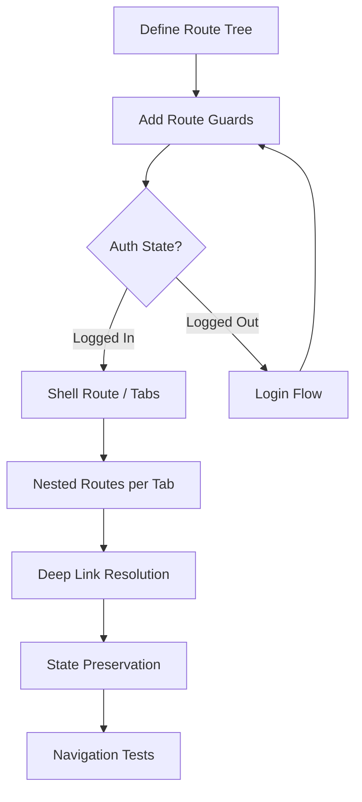

# Blueprint: Navigation & Routing

<!-- METADATA — structured for agents, useful for humans
tags:        [navigation, routing, deep-links, go-router, guards]
category:    architecture
difficulty:  intermediate
time:        2 hours
stack:       [flutter, dart]
-->

> Set up scalable, testable navigation with route guards, deep linking, and state preservation for a mobile app.

## TL;DR

Define your app's route tree using a declarative router (go_router or auto_route), protect routes with composable guards for auth and onboarding, and wire up deep links so that iOS Universal Links and Android App Links resolve to the correct screen. You'll end up with navigation that survives tab switches, preserves back-stack state, and is fully testable without booting a simulator.

## When to Use

- Your app has more than a login screen and a home screen — tabs, nested flows, modals, onboarding gates
- You need deep links or universal links that open specific screens from push notifications, emails, or the web
- You want route-level access control (auth guards, role gates, feature flags)
- When **not** to use it: single-screen utility apps or proof-of-concepts where `Navigator.push` is sufficient

## Prerequisites

- [ ] Flutter 3.x project initialized with a `MaterialApp.router` or `CupertinoApp.router`
- [ ] State management solution in place (Riverpod, Bloc, or Provider) for auth state
- [ ] iOS and Android bundle/package identifiers finalized (deep links are tied to these)
- [ ] HTTPS domain you control for hosting AASA / assetlinks.json files

## Overview



## Steps

### 1. Choose a routing approach

**Why**: Flutter offers three main routing options, each with different tradeoffs. Picking the wrong one means a painful migration later when you hit its limitations. Navigator 2.0 (the raw API) gives you full control but requires hundreds of lines of boilerplate. go_router wraps Navigator 2.0 with a URL-based declarative API. auto_route uses code generation to produce type-safe routes from annotations.

| Concern | go_router | auto_route | Navigator 2.0 (raw) |
|---------|-----------|------------|----------------------|
| Setup effort | Low | Medium (codegen) | High |
| Type-safe params | Manual (extras/state) | Built-in (codegen) | Manual |
| Deep link support | Built-in | Built-in | Manual |
| Nested navigation | `ShellRoute` / `StatefulShellRoute` | `AutoTabsRouter` | Custom `RouterDelegate` |
| Redirect / guards | `redirect` callback | `AutoRouteGuard` mixin | Custom `RouteInformationParser` |
| Google-maintained | Yes (flutter team) | No (community) | Yes (core API) |
| Code generation | No | Yes (build_runner) | No |

> **Decision**: If you want minimal setup and are comfortable with string-based paths, use **go_router**. If you need type-safe route parameters and have codegen already in your project, use **auto_route**. Avoid raw Navigator 2.0 unless you need behavior neither package supports.

The rest of this blueprint uses **go_router** for examples. The [Variants](#variants) section covers auto_route equivalents.

**Expected outcome**: A clear choice of routing package, added to `pubspec.yaml` and ready to configure.

### 2. Define route structure

**Why**: A flat list of routes becomes unmanageable past ten screens. Organizing routes into a tree with shells for tab navigation gives you persistent bottom bars, independent back stacks per tab, and URLs that mirror your information architecture.

```dart
// router/app_router.dart
import 'package:go_router/go_router.dart';

final appRouter = GoRouter(
  initialLocation: '/home',
  routes: [
    // Unauthenticated routes — no shell
    GoRoute(
      path: '/login',
      builder: (context, state) => const LoginScreen(),
    ),
    GoRoute(
      path: '/onboarding',
      builder: (context, state) => const OnboardingScreen(),
    ),

    // Authenticated routes — wrapped in a StatefulShellRoute for tabs
    StatefulShellRoute.indexedStack(
      builder: (context, state, navigationShell) => AppShell(
        navigationShell: navigationShell,
      ),
      branches: [
        // Tab 1: Home
        StatefulShellBranch(
          routes: [
            GoRoute(
              path: '/home',
              builder: (context, state) => const HomeScreen(),
              routes: [
                GoRoute(
                  path: 'detail/:id',  // → /home/detail/42
                  builder: (context, state) => DetailScreen(
                    id: state.pathParameters['id']!,
                  ),
                ),
              ],
            ),
          ],
        ),
        // Tab 2: Search
        StatefulShellBranch(
          routes: [
            GoRoute(
              path: '/search',
              builder: (context, state) => const SearchScreen(),
              routes: [
                GoRoute(
                  path: 'results',  // → /search/results?q=flutter
                  builder: (context, state) => SearchResultsScreen(
                    query: state.uri.queryParameters['q'] ?? '',
                  ),
                ),
              ],
            ),
          ],
        ),
        // Tab 3: Profile
        StatefulShellBranch(
          routes: [
            GoRoute(
              path: '/profile',
              builder: (context, state) => const ProfileScreen(),
              routes: [
                GoRoute(
                  path: 'settings',  // → /profile/settings
                  builder: (context, state) => const SettingsScreen(),
                ),
              ],
            ),
          ],
        ),
      ],
    ),
  ],
);
```

```dart
// router/app_shell.dart
class AppShell extends StatelessWidget {
  final StatefulNavigationShell navigationShell;

  const AppShell({required this.navigationShell, super.key});

  @override
  Widget build(BuildContext context) {
    return Scaffold(
      body: navigationShell,
      bottomNavigationBar: NavigationBar(
        selectedIndex: navigationShell.currentIndex,
        onDestinationSelected: (index) => navigationShell.goBranch(
          index,
          // Tap on already-selected tab pops to root of that branch
          initialLocation: index == navigationShell.currentIndex,
        ),
        destinations: const [
          NavigationDestination(icon: Icon(Icons.home), label: 'Home'),
          NavigationDestination(icon: Icon(Icons.search), label: 'Search'),
          NavigationDestination(icon: Icon(Icons.person), label: 'Profile'),
        ],
      ),
    );
  }
}
```

**Expected outcome**: A route tree with tab-based navigation. Each tab has its own back stack. The bottom bar persists across screens within the shell. URLs like `/home/detail/42` resolve to the correct tab and nested screen.

### 3. Implement route guards

**Why**: Without guards, users can type a URL or follow a deep link to a screen they shouldn't see. Guards centralize access control so individual screens don't need to check auth state themselves. The critical design rule: guards must be **mutually exclusive** — if guard A redirects to `/login` and guard B redirects to `/home`, they must never both match on the same route, or you get an infinite redirect loop.

```dart
// router/app_router.dart (add redirect to GoRouter)
final appRouter = GoRouter(
  initialLocation: '/home',
  redirect: (context, state) {
    final authState = context.read<AuthNotifier>(); // or your state management
    final isLoggedIn = authState.isAuthenticated;
    final hasCompletedOnboarding = authState.hasCompletedOnboarding;
    final currentPath = state.matchedLocation;

    // Public routes that never redirect
    const publicPaths = ['/login', '/signup', '/forgot-password'];
    if (publicPaths.contains(currentPath)) {
      // But if already logged in, don't show login
      return isLoggedIn ? '/home' : null;
    }

    // Not logged in → login
    if (!isLoggedIn) {
      return '/login?redirect=${Uri.encodeComponent(currentPath)}';
    }

    // Logged in but hasn't onboarded → onboarding
    if (!hasCompletedOnboarding && currentPath != '/onboarding') {
      return '/onboarding';
    }

    // All checks passed — no redirect
    return null;
  },
  refreshListenable: authNotifier, // re-evaluates redirect when auth changes
  routes: [/* ... same as step 2 ... */],
);
```

Key design details:
- **Return `null` to allow navigation** — only return a path when you need to redirect.
- **Preserve the intended destination** with a `redirect` query param so post-login can send the user where they wanted to go.
- **`refreshListenable`** triggers re-evaluation whenever auth state changes, so logging in automatically navigates away from the login screen.

**Expected outcome**: Unauthenticated users are redirected to `/login` with their intended destination preserved. Authenticated users who haven't onboarded are redirected to `/onboarding`. Already-authenticated users hitting `/login` bounce to `/home`. No redirect loops.

### 4. Handle deep links and universal links

**Why**: Push notifications, email campaigns, QR codes, and web search results all need to open specific screens in your app. Platform-level configuration (Associated Domains on iOS, App Links on Android) tells the OS to hand these URLs to your app instead of the browser. Without the server-side verification files, the OS silently falls back to the browser and your users never arrive in the app.

**iOS — Associated Domains and AASA file:**

1. Enable the Associated Domains capability in Xcode:
```
// ios/Runner/Runner.entitlements
<key>com.apple.developer.associated-domains</key>
<array>
    <string>applinks:yourdomain.com</string>
</array>
```

2. Serve the Apple App Site Association file at `https://yourdomain.com/.well-known/apple-app-site-association`:
```json
{
  "applinks": {
    "apps": [],
    "details": [
      {
        "appID": "TEAM_ID.com.yourcompany.yourapp",
        "paths": [
          "/home/detail/*",
          "/search/*",
          "/profile/*",
          "/invite/*"
        ]
      }
    ]
  }
}
```

**Android — App Links and assetlinks.json:**

1. Add intent filters to `AndroidManifest.xml`:
```xml
<!-- android/app/src/main/AndroidManifest.xml -->
<activity android:name=".MainActivity">
    <intent-filter android:autoVerify="true">
        <action android:name="android.intent.action.VIEW" />
        <category android:name="android.intent.category.DEFAULT" />
        <category android:name="android.intent.category.BROWSABLE" />
        <data
            android:scheme="https"
            android:host="yourdomain.com"
            android:pathPrefix="/home" />
        <data android:pathPrefix="/search" />
        <data android:pathPrefix="/profile" />
        <data android:pathPrefix="/invite" />
    </intent-filter>
</activity>
```

2. Serve the Digital Asset Links file at `https://yourdomain.com/.well-known/assetlinks.json`:
```json
[{
  "relation": ["delegate_permission/common.handle_all_urls"],
  "target": {
    "namespace": "android_app",
    "package_name": "com.yourcompany.yourapp",
    "sha256_cert_fingerprints": [
      "AA:BB:CC:...:FF"
    ]
  }
}]
```

**Deferred deep links (app not installed):**

```dart
// deep_link/deferred_link_handler.dart
class DeferredDeepLinkHandler {
  /// Call once after first app launch to check for deferred links.
  Future<void> handleDeferredLink() async {
    final isFirstLaunch = await _prefs.getBool('first_launch') ?? true;
    if (!isFirstLaunch) return;

    await _prefs.setBool('first_launch', false);

    // Firebase Dynamic Links, Branch.io, or AppsFlyer
    final pendingLink = await FirebaseDynamicLinks.instance.getInitialLink();
    if (pendingLink != null) {
      final deepLink = pendingLink.link;
      // Navigate after auth completes — store and replay
      await _prefs.setString('deferred_deep_link', deepLink.toString());
    }
  }
}
```

**Expected outcome**: `https://yourdomain.com/home/detail/42` opens the detail screen in the app on both platforms. If the app is not installed, the user is sent to the store, and the link resolves after first launch.

### 5. Navigation state management

**Why**: Users expect that switching tabs preserves their scroll position and back stack, that the back button/gesture undoes the last navigation, and that query parameters survive configuration changes. Without explicit state management, Flutter rebuilds widgets from scratch on tab switch, losing all transient state.

**Preserve state on tab switch:**

`StatefulShellRoute.indexedStack` (used in step 2) keeps all tab widgets alive in an `IndexedStack`. This is the simplest approach but uses more memory. For apps with heavy tabs, consider lazy initialization:

```dart
StatefulShellRoute.indexedStack(
  builder: (context, state, navigationShell) => AppShell(
    navigationShell: navigationShell,
  ),
  branches: [/* ... */],
)
// Each branch maintains its own Navigator with its own back stack.
// Switching tabs does NOT reset the stack.
```

**Preserve scroll position:**

```dart
// screens/home_screen.dart
class HomeScreen extends StatefulWidget {
  const HomeScreen({super.key});

  @override
  State<HomeScreen> createState() => _HomeScreenState();
}

class _HomeScreenState extends State<HomeScreen>
    with AutomaticKeepAliveClientMixin {
  @override
  bool get wantKeepAlive => true; // prevents disposal on tab switch

  final _scrollController = ScrollController();

  @override
  Widget build(BuildContext context) {
    super.build(context); // required by AutomaticKeepAliveClientMixin
    return ListView.builder(
      controller: _scrollController,
      // PageStorageKey preserves position even without keepAlive
      key: const PageStorageKey('home_list'),
      itemBuilder: (context, index) => ListTile(title: Text('Item $index')),
    );
  }
}
```

**Handle query parameters and path parameters:**

```dart
// Pass complex state via extras (not in the URL)
context.go('/home/detail/42', extra: DetailArgs(highlight: true));

// Read in the destination
class DetailScreen extends StatelessWidget {
  final String id;
  const DetailScreen({required this.id, super.key});

  @override
  Widget build(BuildContext context) {
    // Extras are lost on browser refresh / deep link — always handle null
    final args = GoRouterState.of(context).extra as DetailArgs?;
    final highlight = args?.highlight ?? false;
    // ...
  }
}
```

**Expected outcome**: Tab switches preserve scroll position and back stacks. Path parameters are available from the URL. Extras carry transient state but degrade gracefully when absent.

### 6. Testing navigation

**Why**: Navigation bugs are among the hardest to catch manually — you need to be logged out, follow a deep link, complete onboarding, and verify you land on the right screen. Automated tests catch guard logic errors, redirect loops, and broken deep link paths without booting a device.

**Test route guards:**

```dart
// test/router/route_guard_test.dart
void main() {
  group('Route guards', () {
    late GoRouter router;

    GoRouter createRouter({
      required bool isAuthenticated,
      required bool hasOnboarded,
    }) {
      final authNotifier = MockAuthNotifier(
        isAuthenticated: isAuthenticated,
        hasCompletedOnboarding: hasOnboarded,
      );
      return GoRouter(
        initialLocation: '/home',
        redirect: buildRedirect(authNotifier),
        routes: appRoutes,
      );
    }

    test('unauthenticated user redirects to /login', () {
      router = createRouter(isAuthenticated: false, hasOnboarded: false);
      expect(router.location, '/login?redirect=%2Fhome');
    });

    test('authenticated user without onboarding redirects to /onboarding', () {
      router = createRouter(isAuthenticated: true, hasOnboarded: false);
      expect(router.location, '/onboarding');
    });

    test('fully authenticated user stays on /home', () {
      router = createRouter(isAuthenticated: true, hasOnboarded: true);
      expect(router.location, '/home');
    });

    test('authenticated user on /login redirects to /home', () {
      final authNotifier = MockAuthNotifier(
        isAuthenticated: true,
        hasCompletedOnboarding: true,
      );
      router = GoRouter(
        initialLocation: '/login',
        redirect: buildRedirect(authNotifier),
        routes: appRoutes,
      );
      expect(router.location, '/home');
    });
  });
}
```

**Test deep link resolution:**

```dart
// test/router/deep_link_test.dart
void main() {
  group('Deep link resolution', () {
    late GoRouter router;

    setUp(() {
      final authNotifier = MockAuthNotifier(
        isAuthenticated: true,
        hasCompletedOnboarding: true,
      );
      router = GoRouter(
        initialLocation: '/',
        redirect: buildRedirect(authNotifier),
        routes: appRoutes,
      );
    });

    test('/home/detail/42 resolves to DetailScreen', () {
      router.go('/home/detail/42');
      expect(router.location, '/home/detail/42');
      // The route match confirms the path is defined and parseable
    });

    test('/search/results?q=flutter preserves query params', () {
      router.go('/search/results?q=flutter');
      final uri = Uri.parse(router.location);
      expect(uri.queryParameters['q'], 'flutter');
    });

    test('unknown path falls back to /home', () {
      router.go('/nonexistent/path');
      // Depends on your errorBuilder or redirect — verify your fallback
      expect(router.location, isNot('/nonexistent/path'));
    });
  });
}
```

**Verify deep links on device:**

```bash
# iOS — test universal link (device or simulator)
xcrun simctl openurl booted "https://yourdomain.com/home/detail/42"

# Android — test app link
adb shell am start -a android.intent.action.VIEW \
  -d "https://yourdomain.com/home/detail/42" \
  com.yourcompany.yourapp
```

**Expected outcome**: Guard logic is verified without UI. Deep link paths are tested for resolution and parameter parsing. On-device verification confirms the OS-level handoff works end-to-end.

## Variants

<details>
<summary><strong>Variant: auto_route</strong></summary>

auto_route uses code generation to produce type-safe route classes from annotations. The mental model differs: you define routes as annotated page widgets, then run `build_runner` to generate the router.

**Key differences from the go_router flow:**

| Concern | go_router | auto_route |
|---------|-----------|------------|
| Route definition | `GoRoute(path: ...)` in a list | `@RoutePage()` annotation on widget |
| Parameter passing | `state.pathParameters['id']` (stringly-typed) | Generated constructor args (type-safe) |
| Tab navigation | `StatefulShellRoute` | `AutoTabsRouter` with `AutoTabsScaffold` |
| Guards | `redirect` callback on router | `AutoRouteGuard` mixin on pages or router |
| Code generation | None | Required (`build_runner`) |

```dart
// Route definition with auto_route
@RoutePage()
class DetailScreen extends StatelessWidget {
  final String id; // auto_route generates the route arg from this
  const DetailScreen({@PathParam('id') required this.id, super.key});
}

// Guard with auto_route
class AuthGuard extends AutoRouteGuard {
  final AuthService _auth;
  AuthGuard(this._auth);

  @override
  void onNavigation(NavigationResolver resolver, StackRouter router) {
    if (_auth.isAuthenticated) {
      resolver.next(true);
    } else {
      resolver.redirect(LoginRoute(onResult: (success) {
        if (success) resolver.next(true);
      }));
    }
  }
}
```

**Tradeoffs:**
- Stronger compile-time safety (route exists or code doesn't compile)
- Slower iteration (must run `build_runner` after route changes)
- More complex guard API but more composable (guards per route, not global)
- Community-maintained, not Google-maintained

</details>

<details>
<summary><strong>Variant: Web (Flutter Web or cross-platform)</strong></summary>

When targeting Flutter Web alongside mobile, routing has additional considerations:

- **URL bar is the source of truth** — users can type URLs directly, bookmark them, and use browser back/forward. Your route tree must handle arbitrary entry points, not just `/home`.
- **No Associated Domains / App Links** — deep links are just regular URLs. The web server must serve your Flutter app for all route paths (SPA fallback to `index.html`).
- **Hash vs path-based URLs** — use `usePathUrlStrategy()` in `main.dart` for clean URLs (`/home/detail/42` instead of `/#/home/detail/42`). Requires server-side URL rewriting.
- **extras are lost on refresh** — anything passed via `GoRouter.go(..., extra: data)` disappears when the user refreshes the page. All state must be serializable in the URL or fetched from the URL params on load.

```dart
// main.dart — enable path-based URLs for web
void main() {
  usePathUrlStrategy();
  runApp(const MyApp());
}
```

</details>

## Gotchas

> **Deep link not opening the app (iOS)**: The AASA file at `https://yourdomain.com/.well-known/apple-app-site-association` must be served with `Content-Type: application/json`, no redirects, and over HTTPS. iOS fetches it at install time and caches it — changes can take 24-48 hours to propagate. The Associated Domains entitlement must match exactly (no trailing slash, no wildcard on the domain itself). **Fix**: Verify with `curl -I https://yourdomain.com/.well-known/apple-app-site-association` (must return 200 with correct content type). Use Apple's [search-api tool](https://search.developer.apple.com/appsearch-validation-tool/) to check CDN cache. After changes, delete and reinstall the app to force a re-fetch.

> **GoRouter redirect loops**: If your guard redirects `/home` to `/login` for unauthenticated users AND redirects `/login` to `/home` for authenticated users, but the auth state check returns inconsistent results (e.g., async state not yet loaded), the router enters an infinite redirect loop and throws `too many redirects`. **Fix**: Ensure guards are mutually exclusive: add a "loading" state where no redirect happens while auth initializes. Return `null` (no redirect) as the default, and only redirect when state is definitively resolved.

> **Losing state on tab switch**: Using a plain `ShellRoute` instead of `StatefulShellRoute` rebuilds the tab body from scratch every time the user switches tabs. Scroll position, form input, and sub-navigation stacks are all lost. **Fix**: Use `StatefulShellRoute.indexedStack` to keep all branches alive. Combine with `AutomaticKeepAliveClientMixin` and `PageStorageKey` for scroll preservation. Accept the memory tradeoff — lazy initialization with `StatefulShellRoute` constructor and `preload` option can help if memory is a concern.

> **Android back button vs iOS swipe-back**: Android's system back button calls `SystemNavigator.pop()` when at the root of the back stack, which closes the app. iOS has no hardware back button — users swipe from the left edge. If you use `WillPopScope` (deprecated) or `PopScope` to intercept back, the behavior must be tested on both platforms. Swipe-back on iOS can also be inadvertently disabled by gesture detectors or horizontal scrollables near the screen edge. **Fix**: Use `PopScope` (not the deprecated `WillPopScope`) with `canPop: false` and `onPopInvokedWithResult` only when you need to intercept (e.g., unsaved form data). Test on both platforms. For tab-based apps, ensure back on Android pops within the current tab's stack before switching tabs or exiting.

> **Deep link arrives before auth state is ready**: When a cold-start deep link hits your app, the router's `redirect` fires before your auth provider has loaded tokens from secure storage. The guard sees "unauthenticated" and redirects to `/login`, discarding the deep link destination. **Fix**: Add a splash/loading route as the initial location. Hold navigation until auth state resolves. Store the incoming deep link path and replay it after auth initialization completes.

## Checklist

- [ ] Routing package chosen and added to `pubspec.yaml`
- [ ] Route tree defined with `StatefulShellRoute` for tab navigation
- [ ] Auth guard redirects unauthenticated users to `/login` with return URL
- [ ] Onboarding guard redirects un-onboarded users to `/onboarding`
- [ ] No redirect loop — guards are mutually exclusive with a loading state
- [ ] iOS Associated Domains entitlement added and AASA file served correctly
- [ ] Android intent filters added and `assetlinks.json` served correctly
- [ ] Deep link resolution tested on-device (`xcrun simctl openurl`, `adb shell am start`)
- [ ] Tab switch preserves scroll position and sub-navigation stack
- [ ] Query parameters and path parameters tested for all route patterns
- [ ] Route guard unit tests cover all auth/onboarding state combinations
- [ ] Unknown/malformed deep links handled gracefully (error page or fallback)
- [ ] Android back button behavior tested at root of tab and within sub-navigation

## References

- [go_router package](https://pub.dev/packages/go_router) — Declarative router by the Flutter team
- [auto_route package](https://pub.dev/packages/auto_route) — Code-generated type-safe routing
- [Flutter deep linking docs](https://docs.flutter.dev/ui/navigation/deep-linking) — Official Flutter deep linking guide
- [Apple — Supporting Associated Domains](https://developer.apple.com/documentation/xcode/supporting-associated-domains) — AASA file format and entitlement setup
- [Android — Verify App Links](https://developer.android.com/training/app-links/verify-android-applinks) — Digital Asset Links and intent filter verification
- [StatefulShellRoute API](https://pub.dev/documentation/go_router/latest/go_router/StatefulShellRoute-class.html) — Preserving state across branches
- [Flutter Navigation and Routing](https://docs.flutter.dev/ui/navigation) — Official overview of Navigator 2.0 and declarative routing
