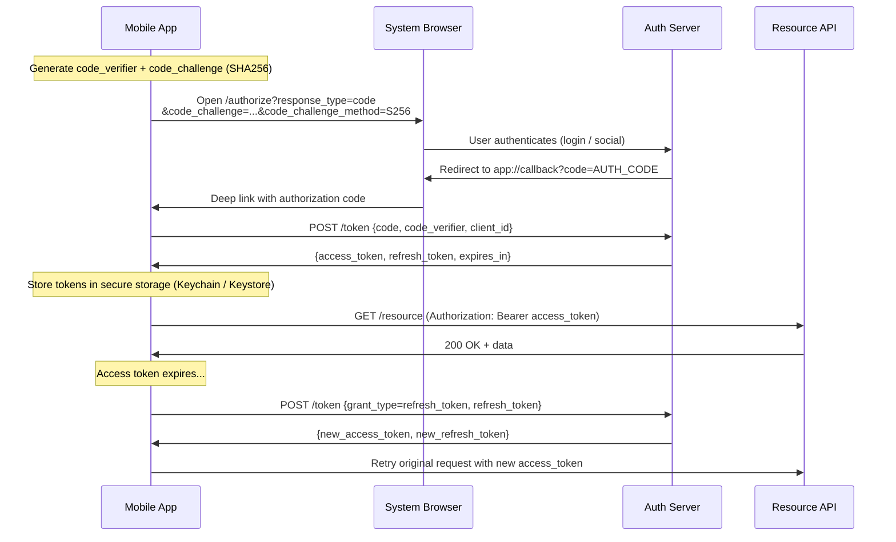

# Blueprint: OAuth / Authentication Flow

<!-- METADATA — structured for agents, useful for humans
tags:        [oauth, authentication, pkce, token, security]
category:    architecture
difficulty:  intermediate
time:        2-4 hours
stack:       [flutter, dart, swift, kotlin]
-->

> Implement a production-grade OAuth 2.0 + PKCE authentication flow with secure token storage, refresh interceptor, social login, and clean logout.

## TL;DR

Set up OAuth 2.0 with PKCE for your mobile app so that tokens never pass through a backend-for-frontend you don't control. You'll end up with a token interceptor that silently refreshes expired access tokens, secure storage in the platform keychain/keystore, social login (Google, Apple) that normalizes into the same token flow, and a logout path that revokes server-side and wipes local state.

## When to Use

- Your mobile or SPA app needs user authentication against an OAuth 2.0-compliant provider
- You need social login (Google, Apple Sign-In) alongside email/password auth
- You want silent token refresh without forcing re-login on every app resume
- When **not** to use it: server-to-server communication where client credentials grant is simpler and sufficient, or internal tools where basic auth behind a VPN is acceptable

## Prerequisites

- [ ] OAuth 2.0 provider configured (Firebase Auth, Auth0, Keycloak, or custom)
- [ ] Client ID registered for your platform (iOS bundle ID, Android package name)
- [ ] HTTPS everywhere — no exceptions, even in dev (use `mkcert` for local)
- [ ] Platform keychain/keystore access configured (Keychain Services on iOS, EncryptedSharedPreferences or Keystore on Android)
- [ ] Deep link / custom URL scheme registered for the OAuth redirect callback

## Overview



## Steps

### 1. Generate the PKCE challenge pair

**Why**: Native apps cannot keep a `client_secret` confidential — anyone can decompile your APK or IPA. PKCE replaces the secret with a one-time cryptographic challenge that proves your app initiated the request, blocking authorization code interception attacks.

```dart
// auth/pkce.dart
import 'dart:convert';
import 'dart:math';
import 'package:crypto/crypto.dart';

class PkcePair {
  final String codeVerifier;
  final String codeChallenge;

  PkcePair._({required this.codeVerifier, required this.codeChallenge});

  factory PkcePair.generate() {
    final random = Random.secure();
    // 32 bytes → 43 chars base64url (RFC 7636 requires 43-128)
    final verifierBytes = List<int>.generate(32, (_) => random.nextInt(256));
    final codeVerifier = base64Url.encode(verifierBytes).replaceAll('=', '');

    final digest = sha256.convert(utf8.encode(codeVerifier));
    final codeChallenge = base64Url.encode(digest.bytes).replaceAll('=', '');

    return PkcePair._(codeVerifier: codeVerifier, codeChallenge: codeChallenge);
  }
}
```

**Expected outcome**: A `PkcePair` with a random `code_verifier` and its SHA-256 `code_challenge`, ready to attach to the authorization URL.

### 2. Open the authorization URL in a system browser

**Why**: Never use a WebView for OAuth. WebViews let the app intercept credentials (phishing risk), and Google explicitly blocks them. The system browser shares cookies and saved passwords, giving users a better experience.

```dart
// auth/oauth_login.dart
Future<String> startAuthorizationFlow(OAuthConfig config) async {
  final pkce = PkcePair.generate();
  // Store verifier — you need it for the token exchange
  await _secureStorage.write(key: 'pkce_verifier', value: pkce.codeVerifier);

  final authUrl = Uri.https(config.authDomain, '/authorize', {
    'response_type': 'code',
    'client_id': config.clientId,
    'redirect_uri': config.redirectUri,
    'scope': 'openid profile email offline_access',
    'code_challenge': pkce.codeChallenge,
    'code_challenge_method': 'S256',
    'state': _generateRandomState(), // CSRF protection
  });

  // Opens ASWebAuthenticationSession (iOS) or Chrome Custom Tab (Android)
  final callbackUrl = await FlutterAppAuth.authorize(authUrl);
  return Uri.parse(callbackUrl).queryParameters['code']!;
}
```

**Expected outcome**: The system browser opens the login page. After authentication, the provider redirects back to your app's deep link with an authorization `code` in the query string.

### 3. Exchange the code for tokens

**Why**: The authorization code is a one-time, short-lived credential. Exchanging it server-side (with the PKCE verifier) gives you the actual access and refresh tokens. The auth server verifies that `sha256(code_verifier) == code_challenge` from step 2 — this is the PKCE proof.

```dart
// auth/token_exchange.dart
Future<TokenPair> exchangeCodeForTokens(String authCode, OAuthConfig config) async {
  final codeVerifier = await _secureStorage.read(key: 'pkce_verifier');

  final response = await http.post(
    Uri.https(config.authDomain, '/oauth/token'),
    headers: {'Content-Type': 'application/x-www-form-urlencoded'},
    body: {
      'grant_type': 'authorization_code',
      'code': authCode,
      'redirect_uri': config.redirectUri,
      'client_id': config.clientId,
      'code_verifier': codeVerifier,
    },
  );

  final json = jsonDecode(response.body);
  final tokens = TokenPair(
    accessToken: json['access_token'],
    refreshToken: json['refresh_token'],
    expiresAt: DateTime.now().add(Duration(seconds: json['expires_in'])),
  );

  await _secureStorage.write(key: 'access_token', value: tokens.accessToken);
  await _secureStorage.write(key: 'refresh_token', value: tokens.refreshToken);
  await _secureStorage.write(key: 'expires_at', value: tokens.expiresAt.toIso8601String());

  // Clean up one-time verifier
  await _secureStorage.delete(key: 'pkce_verifier');

  return tokens;
}
```

**Expected outcome**: Access token and refresh token stored securely. The PKCE verifier is deleted — it's single-use.

### 4. Store tokens in platform-secure storage

**Why**: SharedPreferences and NSUserDefaults are plaintext. Anyone with a rooted/jailbroken device (or a backup tool) can read them. The platform keychain/keystore encrypts at rest and ties access to your app's signing identity.

```dart
// auth/secure_token_store.dart
import 'package:flutter_secure_storage/flutter_secure_storage.dart';

class SecureTokenStore {
  // iOS: Keychain with kSecAttrAccessibleAfterFirstUnlockThisDeviceOnly
  // Android: EncryptedSharedPreferences backed by AndroidKeyStore
  final _storage = const FlutterSecureStorage(
    aOptions: AndroidOptions(encryptedSharedPreferences: true),
    iOptions: IOSOptions(
      accessibility: KeychainAccessibility.first_unlock_this_device,
    ),
  );

  Future<void> saveTokens(TokenPair tokens) async {
    await Future.wait([
      _storage.write(key: 'access_token', value: tokens.accessToken),
      _storage.write(key: 'refresh_token', value: tokens.refreshToken),
      _storage.write(key: 'expires_at', value: tokens.expiresAt.toIso8601String()),
    ]);
  }

  Future<TokenPair?> loadTokens() async {
    final results = await Future.wait([
      _storage.read(key: 'access_token'),
      _storage.read(key: 'refresh_token'),
      _storage.read(key: 'expires_at'),
    ]);
    if (results.any((r) => r == null)) return null;
    return TokenPair(
      accessToken: results[0]!,
      refreshToken: results[1]!,
      expiresAt: DateTime.parse(results[2]!),
    );
  }

  Future<void> clearAll() async {
    await _storage.deleteAll();
  }
}
```

**Expected outcome**: Tokens are encrypted at rest. On iOS, they survive app reinstalls (unless you set `this_device` accessibility). On Android, EncryptedSharedPreferences uses AES-256-GCM.

### 5. Build a token refresh interceptor

**Why**: You don't want every API call to manually check token expiry. A single interceptor transparently refreshes tokens and retries failed requests. The critical piece is the mutex — without it, ten parallel 401s trigger ten refresh calls, and all but the first will fail (or worse, rotate your refresh token out from under you).

```dart
// auth/auth_interceptor.dart
class AuthInterceptor extends Interceptor {
  final SecureTokenStore _store;
  final OAuthConfig _config;
  final Dio _tokenClient; // separate Dio instance — no interceptor loop
  final _refreshLock = Lock(); // from package:synchronized

  @override
  void onRequest(RequestOptions options, RequestInterceptorHandler handler) async {
    final tokens = await _store.loadTokens();
    if (tokens == null) return handler.reject(DioException(requestOptions: options));

    // Proactively refresh if expiring within 60s buffer
    if (tokens.expiresAt.difference(DateTime.now()).inSeconds < 60) {
      final refreshed = await _safeRefresh(tokens.refreshToken);
      if (refreshed != null) {
        options.headers['Authorization'] = 'Bearer ${refreshed.accessToken}';
        return handler.next(options);
      }
      return handler.reject(DioException(requestOptions: options));
    }

    options.headers['Authorization'] = 'Bearer ${tokens.accessToken}';
    handler.next(options);
  }

  @override
  void onError(DioException err, ErrorInterceptorHandler handler) async {
    if (err.response?.statusCode != 401) return handler.next(err);

    final tokens = await _store.loadTokens();
    if (tokens == null) return handler.next(err);

    final refreshed = await _safeRefresh(tokens.refreshToken);
    if (refreshed == null) return handler.next(err);

    // Retry the original request with the new token
    final retryOptions = err.requestOptions;
    retryOptions.headers['Authorization'] = 'Bearer ${refreshed.accessToken}';
    final response = await _tokenClient.fetch(retryOptions);
    handler.resolve(response);
  }

  /// Mutex ensures only one refresh executes at a time.
  /// Concurrent calls wait and reuse the result.
  Future<TokenPair?> _safeRefresh(String refreshToken) async {
    return _refreshLock.synchronized(() async {
      // Re-read store — another caller may have already refreshed
      final current = await _store.loadTokens();
      if (current != null &&
          current.expiresAt.difference(DateTime.now()).inSeconds > 60) {
        return current; // already refreshed by another caller
      }

      try {
        final response = await _tokenClient.post(
          'https://${_config.authDomain}/oauth/token',
          data: {
            'grant_type': 'refresh_token',
            'refresh_token': refreshToken,
            'client_id': _config.clientId,
          },
        );
        final newTokens = TokenPair.fromJson(response.data);
        await _store.saveTokens(newTokens);
        return newTokens;
      } catch (_) {
        await _store.clearAll(); // refresh token is dead — force re-login
        return null;
      }
    });
  }
}
```

**Expected outcome**: API calls transparently attach tokens. Expired tokens trigger a single refresh. Parallel requests queue behind the mutex. If refresh fails, local state is cleared and the app navigates to login.

### 6. Integrate social login providers

**Why**: Social login removes friction. The trick is that Google and Apple each give you a provider-specific token (ID token / authorization code), which you then exchange with *your* auth server for your app's canonical access/refresh tokens. This keeps your API layer uniform regardless of how the user authenticated.

```dart
// auth/social_login.dart
abstract class SocialAuthProvider {
  /// Returns a credential (ID token or auth code) from the provider.
  Future<SocialCredential> authenticate();
}

class GoogleAuthProvider implements SocialAuthProvider {
  @override
  Future<SocialCredential> authenticate() async {
    final account = await GoogleSignIn(scopes: ['email', 'profile']).signIn();
    final auth = await account!.authentication;
    return SocialCredential(
      provider: 'google',
      idToken: auth.idToken!,
    );
  }
}

class AppleAuthProvider implements SocialAuthProvider {
  @override
  Future<SocialCredential> authenticate() async {
    final credential = await SignInWithApple.getAppleIDCredential(
      scopes: [AppleIDAuthorizationScopes.email, AppleIDAuthorizationScopes.fullName],
    );
    return SocialCredential(
      provider: 'apple',
      authorizationCode: credential.authorizationCode,
      // Apple only sends email/name on FIRST sign-in — persist them
      email: credential.email,
      fullName: credential.givenName,
    );
  }
}

/// Exchange the social credential for your app's canonical tokens.
Future<TokenPair> socialLogin(SocialCredential cred, OAuthConfig config) async {
  final response = await http.post(
    Uri.https(config.authDomain, '/oauth/token'),
    body: {
      'grant_type': 'urn:ietf:params:oauth:grant-type:token-exchange',
      'subject_token': cred.idToken ?? cred.authorizationCode,
      'subject_token_type': cred.idToken != null
          ? 'urn:ietf:params:oauth:token-type:id_token'
          : 'urn:ietf:params:oauth:token-type:access_token',
      'provider': cred.provider,
      'client_id': config.clientId,
    },
  );
  final tokens = TokenPair.fromJson(jsonDecode(response.body));
  await SecureTokenStore().saveTokens(tokens);
  return tokens;
}
```

**Expected outcome**: Google and Apple logins funnel into the same `TokenPair` your API expects. The rest of the app doesn't know or care which provider was used.

### 7. Implement logout (local + server revocation)

**Why**: Deleting local tokens is not enough. The refresh token is still valid server-side — anyone who extracted it (compromised device, shared iPad) can keep generating access tokens. Always revoke, then clear.

```dart
// auth/logout.dart
Future<void> logout(OAuthConfig config) async {
  final store = SecureTokenStore();
  final tokens = await store.loadTokens();

  if (tokens != null) {
    // Best-effort server revocation — don't block logout on network failure
    try {
      await http.post(
        Uri.https(config.authDomain, '/oauth/revoke'),
        body: {
          'token': tokens.refreshToken,
          'client_id': config.clientId,
          'token_type_hint': 'refresh_token',
        },
      ).timeout(const Duration(seconds: 5));
    } catch (_) {
      // Log but don't block — local cleanup still happens
    }
  }

  // Wipe all local auth state
  await store.clearAll();

  // Clear any in-memory caches, navigation state, etc.
  // Navigate to login screen
}
```

**Expected outcome**: Refresh token is revoked server-side. Local secure storage is wiped. The user sees the login screen. Even if revocation fails (offline), local tokens are gone.

### 8. Handle silent re-auth on app resume

**Why**: Users leave your app for hours. When they return, the access token is expired but the refresh token is still valid. A lifecycle hook that checks tokens on resume avoids showing a login screen unnecessarily.

```dart
// auth/app_lifecycle_handler.dart
class AuthLifecycleObserver extends WidgetsBindingObserver {
  final AuthInterceptor _authInterceptor;
  final SecureTokenStore _store;

  @override
  void didChangeAppLifecycleState(AppLifecycleState state) async {
    if (state != AppLifecycleState.resumed) return;

    final tokens = await _store.loadTokens();
    if (tokens == null) {
      _navigateToLogin();
      return;
    }

    // If token expires within 5 min, proactively refresh
    if (tokens.expiresAt.difference(DateTime.now()).inMinutes < 5) {
      final refreshed = await _authInterceptor._safeRefresh(tokens.refreshToken);
      if (refreshed == null) {
        _navigateToLogin();
      }
    }
  }
}
```

**Expected outcome**: App resume silently refreshes tokens when needed. Users only see the login screen when the refresh token itself has expired or been revoked.

## Variants

<details>
<summary><strong>Variant: Firebase Auth</strong></summary>

Firebase Auth handles the OAuth dance, token storage, and refresh internally. You trade control for speed.

**Key differences from the main flow:**

- **No manual PKCE** — Firebase SDKs handle the authorization flow end-to-end
- **No manual token storage** — Firebase persists auth state in its own secure store
- **ID token as access token** — Firebase issues a Firebase ID token (JWT), not an OAuth access token. Your backend verifies it with `firebase-admin`
- **Auto-refresh built in** — `FirebaseAuth.instance.currentUser?.getIdToken()` automatically refreshes if expired

```dart
// With Firebase, the interceptor simplifies to:
class FirebaseAuthInterceptor extends Interceptor {
  @override
  void onRequest(RequestOptions options, RequestInterceptorHandler handler) async {
    final user = FirebaseAuth.instance.currentUser;
    if (user == null) return handler.reject(DioException(requestOptions: options));

    // getIdToken(true) forces refresh if expired
    final idToken = await user.getIdToken();
    options.headers['Authorization'] = 'Bearer $idToken';
    handler.next(options);
  }
}
```

**Tradeoffs:**
- Faster to ship (days, not weeks)
- Less control over token lifetimes, claims, and refresh behavior
- Vendor lock-in on the auth layer (migration is painful)
- Firebase ID tokens are 1-2KB JWTs — larger than opaque tokens, adds bandwidth on every request

</details>

<details>
<summary><strong>Variant: Web (SPA) vs Mobile</strong></summary>

**Key differences for web:**

| Concern | Mobile | Web (SPA) |
|---------|--------|-----------|
| PKCE | Required (no client secret) | Required (no client secret) |
| Token storage | Keychain / Keystore | HttpOnly cookie or in-memory only |
| Refresh strategy | Background refresh via interceptor | Silent iframe or rotating refresh tokens |
| Redirect handling | Deep link / custom URL scheme | Standard HTTP redirect |
| Secure storage | Hardware-backed | No equivalent — avoid `localStorage` for tokens |

**Web-specific concerns:**
- **Never store tokens in `localStorage`** — XSS can read them. Use HttpOnly, Secure, SameSite cookies set by a backend-for-frontend, or keep tokens in memory and accept re-login on page refresh
- **Silent refresh via iframe** — load `/authorize?prompt=none` in a hidden iframe. If the session is still valid, you get a new code without user interaction. This breaks if third-party cookies are blocked (Safari, Firefox strict mode)
- **Rotating refresh tokens** — if you must store a refresh token on the web, use refresh token rotation with automatic reuse detection. If a rotated-out token is reused, the server invalidates the entire chain

</details>

## Gotchas

> **Token expiry race condition**: Two parallel API calls both see an expired token. Both trigger a refresh. The first succeeds, but the second sends the now-rotated-out refresh token and fails. Both requests error out. **Fix**: Use a mutex/lock on the refresh call (see `_refreshLock` in step 5). Second caller waits and reuses the first caller's result.

> **Refresh token rotation and replay detection**: When using rotating refresh tokens, a network failure after the server rotates but before your app saves the new token means you hold a dead token. The old one is revoked, the new one is lost. **Fix**: Implement retry logic on the token exchange. Some providers (Auth0) offer a grace period where the previous refresh token remains valid for a short window after rotation.

> **Apple Sign-In only sends email and name once**: Apple sends the user's email and full name only on the *first* authorization. If your app crashes before persisting them, or your backend doesn't save them from that first payload, they're gone. Calling Sign In with Apple again returns no email/name. **Fix**: Persist email and name the instant you receive the Apple credential, before doing anything else. Send them to your backend in the same token exchange request. If you've already lost them, the user must go to Settings > Apple ID > Sign-In & Security > Apps Using Apple ID, remove your app, and re-authorize.

> **Apple private email relay**: Users who choose "Hide My Email" get a `xyz@privaterelay.appleid.com` address. Emails sent to this address only arrive if you've registered your outbound email domains in Apple's developer portal AND configured SPF/DKIM. **Fix**: Register your sending domain in Certificates, Identifiers & Profiles > Services > Sign In with Apple for Email Communication. Test with a real "Hide My Email" account before launch.

> **Silent re-auth fails after OS-level credential changes**: If the user changes their Apple ID password or revokes your app's access, the refresh token is silently invalidated. The next `getIdToken()` or refresh call fails with a cryptic error. **Fix**: Treat any refresh failure as "session dead." Clear local state and route to login. Don't retry refresh in a loop.

> **Keychain persistence across app reinstalls (iOS)**: iOS Keychain items survive app deletion and reinstall by default. This means a reinstalled app may auto-login with stale tokens that reference a deleted server-side account. **Fix**: Set `kSecAttrAccessibleAfterFirstUnlockThisDeviceOnly` and store a "first launch" flag in `UserDefaults` (which *does* get wiped on reinstall). On first launch, wipe Keychain entries.

> **Android Keystore instability on some OEMs**: Some Samsung and Huawei devices corrupt the Android Keystore after OS updates, making all encrypted data unreadable. `flutter_secure_storage` throws `PlatformException`. **Fix**: Wrap all secure storage reads in try/catch. On decryption failure, wipe the store and force re-login. Log the device model and OS version to your crash reporter so you can track vendor-specific issues.

> **Clock skew breaks token expiry checks**: If the device clock is wrong (manual timezone, no NTP sync), your "expires in 60 seconds" buffer check fires at the wrong time. Tokens appear expired when they're not, or appear valid when they've expired. **Fix**: Use the `expires_in` delta from the server response relative to `DateTime.now()` at the moment you receive it, rather than parsing an absolute `exp` claim. If you do parse `exp`, compare against server time from the `Date` response header, not the device clock.

## Checklist

- [ ] PKCE challenge generated with cryptographically secure random bytes
- [ ] Authorization opens in system browser (not WebView)
- [ ] Token exchange sends `code_verifier` to prove PKCE
- [ ] Access token, refresh token, and expiry stored in platform secure storage
- [ ] Token interceptor attaches Bearer token to every API request
- [ ] Refresh uses a mutex — only one refresh executes at a time
- [ ] Proactive refresh fires before expiry (60s buffer), not only on 401
- [ ] Social login credentials exchange for canonical app tokens
- [ ] Apple Sign-In email/name persisted on first authorization
- [ ] Logout revokes refresh token server-side, then clears local storage
- [ ] App resume lifecycle hook checks token validity and refreshes silently
- [ ] Keychain cleared on first launch after reinstall (iOS)
- [ ] Secure storage read failures handled gracefully (force re-login)

## Artifacts

| Artifact | Location | Description |
|----------|----------|-------------|
| PKCE generator | `lib/auth/pkce.dart` | Generates `code_verifier` / `code_challenge` pair |
| OAuth login flow | `lib/auth/oauth_login.dart` | Opens system browser, handles redirect callback |
| Token exchange | `lib/auth/token_exchange.dart` | Exchanges auth code + PKCE verifier for tokens |
| Secure token store | `lib/auth/secure_token_store.dart` | Platform keychain/keystore wrapper for token persistence |
| Auth interceptor | `lib/auth/auth_interceptor.dart` | Dio interceptor with mutex-protected token refresh |
| Social login | `lib/auth/social_login.dart` | Google and Apple sign-in abstraction + token exchange |
| Logout | `lib/auth/logout.dart` | Server revocation + local cleanup |
| Lifecycle observer | `lib/auth/app_lifecycle_handler.dart` | Silent re-auth on app resume |

## References

- [RFC 7636 — PKCE](https://datatracker.ietf.org/doc/html/rfc7636) — Proof Key for Code Exchange specification
- [RFC 6749 — OAuth 2.0](https://datatracker.ietf.org/doc/html/rfc6749) — The OAuth 2.0 Authorization Framework
- [OAuth 2.0 for Native Apps (RFC 8252)](https://datatracker.ietf.org/doc/html/rfc8252) — Best practices for mobile/desktop OAuth
- [OAuth 2.0 Security Best Current Practice](https://datatracker.ietf.org/doc/html/draft-ietf-oauth-security-topics) — IETF security recommendations
- [Apple Sign In — Handle User Credentials](https://developer.apple.com/documentation/sign_in_with_apple/sign_in_with_apple_rest_api) — Apple's REST API reference
- [Google Sign-In for Flutter](https://pub.dev/packages/google_sign_in) — Official Flutter plugin
- [flutter_secure_storage](https://pub.dev/packages/flutter_secure_storage) — Keychain/Keystore wrapper for Flutter
- [flutter_appauth](https://pub.dev/packages/flutter_appauth) — AppAuth SDK wrapper for Flutter (handles PKCE, system browser, redirect)
