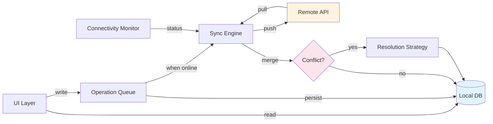

# Blueprint: Offline-First Architecture

<!-- METADATA — structured for agents, useful for humans
tags:        [offline-first, sync, local-storage, crdt, conflict-resolution]
category:    architecture
difficulty:  advanced
time:        1-2 days
stack:       [flutter, dart, sqlite]
-->

> Design an application where offline is the default mode, not a degraded fallback, with robust local storage, sync engine, and conflict resolution.

## TL;DR

You will have a fully functional app that works without any network connection by default, stores all data locally, queues mutations when offline, and syncs bidirectionally with a remote API when connectivity returns. Conflicts are resolved automatically (or surfaced to the user) depending on the strategy you choose.

## When to Use

- Your users operate in environments with unreliable, intermittent, or no connectivity (field workers, travelers, rural areas)
- You need the app to feel instant — reads should never wait on the network
- Multiple devices or users may edit the same data and need to converge
- You want to decouple the UI lifecycle from network availability entirely
- When **not** to use: the data is inherently real-time and stale reads are unacceptable (e.g., live stock tickers, multiplayer game state), or the dataset is too large to store locally

## Prerequisites

- [ ] Flutter project initialized with a state management solution (Riverpod, Bloc, etc.)
- [ ] Remote API available (REST or GraphQL) with defined data contracts
- [ ] Basic understanding of SQLite or another embedded database
- [ ] Decision on whether data ownership is per-user or collaborative

## Overview



**Read path**: UI always reads from Local DB. Never from the network directly.

**Write path**: UI writes to the Operation Queue, which persists to Local DB immediately (optimistic update) and pushes to Remote API when online.

**Sync path**: Sync Engine pulls remote changes, detects conflicts, applies the configured resolution strategy, and writes the merged result to Local DB.

## Steps

### 1. Choose local storage

**Why**: The local database is the single source of truth for the running app. Everything the UI displays comes from here. Picking the wrong storage layer creates pain at every subsequent step — schema migrations, query performance, reactive streams.

| Library | Strengths | Trade-offs |
|---------|-----------|------------|
| **SQLite / Drift** | Relational queries, mature, raw SQL escape hatch | More boilerplate, manual reactive streams |
| **Isar** | Fast, Flutter-native, built-in reactive queries | Less mature ecosystem, no raw SQL |
| **Hive** | Simple key-value, fast for small datasets | No relational queries, no migration tooling |
| **ObjectBox** | High performance, ACID, built-in sync option | Proprietary license for sync features |

For most offline-first apps with relational data, **Drift (SQLite)** is the recommended default.

```dart
// lib/db/app_database.dart
import 'package:drift/drift.dart';
import 'package:drift/native.dart';

part 'app_database.g.dart';

class Items extends Table {
  TextColumn get id => text()();
  TextColumn get content => text()();
  IntColumn get updatedAt => integer()(); // epoch ms, used for sync
  BoolColumn get pendingSync => boolean().withDefault(const Constant(true))();
  IntColumn get version => integer().withDefault(const Constant(1))();

  @override
  Set<Column> get primaryKey => {id};
}

@DriftDatabase(tables: [Items])
class AppDatabase extends _$AppDatabase {
  AppDatabase() : super(NativeDatabase.memory()); // swap for file in prod

  @override
  int get schemaVersion => 1;
}
```

Key columns: `updatedAt` for ordering, `pendingSync` for the queue, `version` for optimistic concurrency.

**Expected outcome**: A working local database with tables that include sync metadata columns.

### 2. Design the sync protocol

**Why**: The sync protocol determines how your client and server agree on the state of the world. Choosing the wrong strategy means either data loss (last-write-wins on collaborative data) or unbounded complexity (CRDTs when simple merge would suffice).

| Strategy | How it works | Best for |
|----------|-------------|----------|
| **Last-write-wins (LWW)** | Highest timestamp wins; loser is discarded | Single-user, low conflict risk |
| **Field-level merge** | Merge non-conflicting field changes; flag true conflicts | Multi-device, same user |
| **CRDT** | Conflict-free replicated data types; mathematically guaranteed convergence | Multi-user collaborative editing |
| **Manual / user-prompted** | Surface both versions to the user | When business rules are ambiguous |

```dart
// lib/sync/sync_protocol.dart
enum ConflictStrategy { lastWriteWins, fieldLevelMerge, userPrompted }

class SyncConfig {
  final ConflictStrategy strategy;
  final Duration syncInterval;
  final int maxRetries;
  final Duration retryBackoff;

  const SyncConfig({
    this.strategy = ConflictStrategy.lastWriteWins,
    this.syncInterval = const Duration(minutes: 5),
    this.maxRetries = 5,
    this.retryBackoff = const Duration(seconds: 2),
  });
}
```

> **Decision**: If your app is single-user with multiple devices, go with LWW or field-level merge. If it is multi-user collaborative, evaluate CRDTs (step 2a) or user-prompted resolution (step 5).

**Expected outcome**: A documented decision on which conflict strategy to use, codified in a `SyncConfig`.

### 3. Implement the operation queue

**Why**: When the device is offline, writes must not be lost. An operation queue persists every mutation as a pending operation, guaranteeing delivery when connectivity returns. Without it, users lose work silently.

```dart
// lib/sync/operation_queue.dart
import 'dart:collection';

enum OperationType { create, update, delete }

class PendingOperation {
  final String id;
  final String entityType;
  final String entityId;
  final OperationType type;
  final Map<String, dynamic> payload;
  final DateTime createdAt;
  int attempts;

  PendingOperation({
    required this.id,
    required this.entityType,
    required this.entityId,
    required this.type,
    required this.payload,
    required this.createdAt,
    this.attempts = 0,
  });
}

class OperationQueue {
  final Queue<PendingOperation> _queue = Queue();
  final AppDatabase _db;
  static const int maxAttempts = 5;

  OperationQueue(this._db);

  /// Enqueue a mutation. Persists to local DB immediately.
  Future<void> enqueue(PendingOperation op) async {
    _queue.addLast(op);
    await _persistToDb(op);
  }

  /// Process the queue FIFO. Called when connectivity is restored.
  Future<void> flush(RemoteApi api) async {
    while (_queue.isNotEmpty) {
      final op = _queue.first;
      try {
        await _send(api, op);
        _queue.removeFirst();
        await _removeFromDb(op.id);
      } on Exception {
        op.attempts++;
        if (op.attempts >= maxAttempts) {
          _queue.removeFirst();
          await _markFailed(op);
          continue;
        }
        // Exponential backoff: 2s, 4s, 8s, 16s, 32s
        final delay = Duration(
          seconds: 2 * (1 << (op.attempts - 1)),
        );
        await Future.delayed(delay);
      }
    }
  }

  Future<void> _send(RemoteApi api, PendingOperation op) async {
    switch (op.type) {
      case OperationType.create:
        await api.create(op.entityType, op.payload);
      case OperationType.update:
        await api.update(op.entityType, op.entityId, op.payload);
      case OperationType.delete:
        await api.delete(op.entityType, op.entityId);
    }
  }

  Future<void> _persistToDb(PendingOperation op) async { /* ... */ }
  Future<void> _removeFromDb(String id) async { /* ... */ }
  Future<void> _markFailed(PendingOperation op) async { /* ... */ }
}
```

Critical design decisions:
- **FIFO ordering**: Operations must be applied in the order they were created to preserve causality.
- **Exponential backoff**: Prevents hammering a struggling server. Doubles each retry: 2s, 4s, 8s, 16s, 32s.
- **Max attempts**: After 5 failures, the operation is moved to a dead-letter state for manual inspection, not silently dropped.
- **Persistence**: The queue itself is stored in the local DB so it survives app restarts.

**Expected outcome**: Mutations created while offline are persisted locally and replayed in order when connectivity returns.

### 4. Build a connectivity monitor

**Why**: The sync engine needs to know when to attempt syncing. Polling the network or relying on platform APIs alone is unreliable — a device can have Wi-Fi signal but no internet, or be behind a captive portal. A robust monitor combines platform signals with actual reachability checks.

```dart
// lib/sync/connectivity_monitor.dart
import 'dart:async';
import 'package:connectivity_plus/connectivity_plus.dart';

enum ConnectivityStatus { online, offline }

class ConnectivityMonitor {
  final Connectivity _connectivity = Connectivity();
  final StreamController<ConnectivityStatus> _controller =
      StreamController.broadcast();

  Stream<ConnectivityStatus> get status => _controller.stream;
  ConnectivityStatus _current = ConnectivityStatus.offline;
  ConnectivityStatus get current => _current;

  Timer? _pingTimer;

  void start() {
    // Layer 1: platform connectivity changes
    _connectivity.onConnectivityChanged.listen((results) {
      final hasConnection = results.any((r) => r != ConnectivityResult.none);
      if (hasConnection) {
        _verifyReachability();
      } else {
        _update(ConnectivityStatus.offline);
      }
    });

    // Layer 2: periodic reachability ping (catches captive portals)
    _pingTimer = Timer.periodic(
      const Duration(seconds: 30),
      (_) => _verifyReachability(),
    );
  }

  Future<void> _verifyReachability() async {
    try {
      // Hit your own API health endpoint, not a third party
      final response = await http.get(
        Uri.parse('https://api.example.com/health'),
      ).timeout(const Duration(seconds: 5));
      _update(
        response.statusCode == 200
            ? ConnectivityStatus.online
            : ConnectivityStatus.offline,
      );
    } on Exception {
      _update(ConnectivityStatus.offline);
    }
  }

  void _update(ConnectivityStatus status) {
    if (status != _current) {
      _current = status;
      _controller.add(status);
    }
  }

  void dispose() {
    _pingTimer?.cancel();
    _controller.close();
  }
}
```

Two-layer approach:
1. **Platform signal** (`connectivity_plus`): fast, battery-efficient, but lies about actual internet access.
2. **Reachability ping**: hits your own health endpoint to confirm real connectivity. Runs on platform change events and every 30 seconds as a fallback.

**Expected outcome**: A stream that emits `online`/`offline` transitions, triggering sync flushes on `online`.

### 5. Implement conflict resolution

**Why**: When two devices (or a device and the server) modify the same entity while disconnected, the sync engine must decide which version wins. Ignoring this guarantees data loss.

#### Last-write-wins (LWW)

```dart
// Simple: compare timestamps, keep the newer one.
Item resolveConflict(Item local, Item remote) {
  if (local.updatedAt >= remote.updatedAt) return local;
  return remote;
}
```

#### Field-level merge

```dart
// Merge non-conflicting fields. Flag true conflicts.
class MergeResult {
  final Map<String, dynamic> merged;
  final List<String> conflicts; // field names that need user input

  const MergeResult({required this.merged, required this.conflicts});
}

MergeResult fieldLevelMerge(
  Map<String, dynamic> base,   // last known common ancestor
  Map<String, dynamic> local,
  Map<String, dynamic> remote,
) {
  final merged = Map<String, dynamic>.from(base);
  final conflicts = <String>[];

  final allKeys = {...base.keys, ...local.keys, ...remote.keys};
  for (final key in allKeys) {
    final localChanged = local[key] != base[key];
    final remoteChanged = remote[key] != base[key];

    if (localChanged && remoteChanged && local[key] != remote[key]) {
      // True conflict: both sides changed the same field differently
      conflicts.add(key);
      merged[key] = remote[key]; // default to remote, flag for review
    } else if (localChanged) {
      merged[key] = local[key];
    } else if (remoteChanged) {
      merged[key] = remote[key];
    }
  }

  return MergeResult(merged: merged, conflicts: conflicts);
}
```

#### User-prompted resolution

```dart
// Surface both versions to the user via UI
class ConflictEvent {
  final String entityId;
  final Map<String, dynamic> localVersion;
  final Map<String, dynamic> remoteVersion;
  final List<String> conflictingFields;

  const ConflictEvent({
    required this.entityId,
    required this.localVersion,
    required this.remoteVersion,
    required this.conflictingFields,
  });
}

// Expose a stream of unresolved conflicts for the UI to present
final conflictStream = StreamController<ConflictEvent>.broadcast();
```

**Expected outcome**: A conflict resolution strategy implemented and tested against known conflict scenarios.

### 6. Handle sync errors and retry

**Why**: Network operations fail in ways that are often transient (timeout, 502, DNS hiccup). A sync engine without retry logic will leave data stuck in limbo. But retrying without limits creates infinite loops and battery drain.

```dart
// lib/sync/sync_engine.dart
class SyncEngine {
  final AppDatabase db;
  final RemoteApi api;
  final OperationQueue queue;
  final ConnectivityMonitor connectivity;
  final SyncConfig config;

  SyncEngine({
    required this.db,
    required this.api,
    required this.queue,
    required this.connectivity,
    required this.config,
  });

  Timer? _syncTimer;

  void start() {
    // React to connectivity changes
    connectivity.status.listen((status) {
      if (status == ConnectivityStatus.online) {
        syncNow();
      }
    });

    // Periodic sync as safety net
    _syncTimer = Timer.periodic(config.syncInterval, (_) {
      if (connectivity.current == ConnectivityStatus.online) {
        syncNow();
      }
    });
  }

  Future<void> syncNow() async {
    try {
      // 1. Push: flush pending operations to remote
      await queue.flush(api);

      // 2. Pull: fetch remote changes since last sync
      final lastSync = await db.getLastSyncTimestamp();
      final remoteChanges = await api.getChangesSince(lastSync);

      // 3. Merge: apply remote changes with conflict resolution
      for (final remote in remoteChanges) {
        final local = await db.getById(remote.id);
        if (local == null) {
          await db.insert(remote);
        } else if (local.pendingSync) {
          // Local has unsent changes — conflict
          await _resolveConflict(local, remote);
        } else {
          await db.upsert(remote);
        }
      }

      // 4. Update sync cursor
      await db.setLastSyncTimestamp(DateTime.now().millisecondsSinceEpoch);
    } on SocketException {
      // Network gone during sync — will retry on next online event
    } on TimeoutException {
      // Server slow — will retry on next interval
    } on ApiException catch (e) {
      if (e.statusCode >= 500) {
        // Server error — transient, retry later
      } else {
        // Client error (4xx) — likely a bug, log and investigate
        _logSyncError(e);
      }
    }
  }

  Future<void> _resolveConflict(Item local, Item remote) async {
    switch (config.strategy) {
      case ConflictStrategy.lastWriteWins:
        final winner = local.updatedAt >= remote.updatedAt ? local : remote;
        await db.upsert(winner.copyWith(pendingSync: winner == local));
      case ConflictStrategy.fieldLevelMerge:
        final base = await db.getBaseVersion(local.id);
        final result = fieldLevelMerge(base, local.toMap(), remote.toMap());
        if (result.conflicts.isEmpty) {
          await db.upsert(Item.fromMap(result.merged));
        } else {
          conflictStream.add(ConflictEvent(/* ... */));
        }
      case ConflictStrategy.userPrompted:
        conflictStream.add(ConflictEvent(/* ... */));
    }
  }

  void dispose() {
    _syncTimer?.cancel();
  }
}
```

Error categories and handling:

| Error | Transient? | Action |
|-------|-----------|--------|
| `SocketException` | Yes | Retry on next online event |
| `TimeoutException` | Yes | Retry on next sync interval |
| HTTP 5xx | Yes | Retry with backoff |
| HTTP 4xx | No | Log, alert developer, stop retrying this operation |
| HTTP 409 Conflict | No | Trigger conflict resolution |

**Expected outcome**: The sync engine gracefully handles transient failures and does not lose data or drain the battery.

### 7. Test offline scenarios

**Why**: Offline-first bugs only surface in specific state combinations (offline write + server change + reconnect). If you only test the happy path, you will ship data loss bugs.

```dart
void main() {
  late AppDatabase db;
  late MockRemoteApi api;
  late SyncEngine engine;

  setUp(() async {
    db = await AppDatabase.forTesting();
    api = MockRemoteApi();
    engine = SyncEngine(
      db: db,
      api: api,
      queue: OperationQueue(db),
      connectivity: MockConnectivityMonitor(),
      config: const SyncConfig(),
    );
  });

  group('offline scenarios', () {
    test('writes persist locally when offline', () async {
      // Arrange: device is offline
      connectivity.setOffline();

      // Act: user creates an item
      await engine.createItem(Item(id: '1', content: 'hello', updatedAt: 100));

      // Assert: item exists locally, marked pending
      final item = await db.getById('1');
      expect(item, isNotNull);
      expect(item!.pendingSync, isTrue);
    });

    test('queued operations flush on reconnect', () async {
      connectivity.setOffline();
      await engine.createItem(Item(id: '1', content: 'hello', updatedAt: 100));

      // Act: device comes online
      connectivity.setOnline();
      await engine.syncNow();

      // Assert: API received the create, local item no longer pending
      verify(() => api.create('items', any())).called(1);
      final item = await db.getById('1');
      expect(item!.pendingSync, isFalse);
    });

    test('conflict resolution with LWW', () async {
      // Arrange: item exists locally with local edits
      await db.insert(Item(
        id: '1', content: 'local edit', updatedAt: 200, pendingSync: true,
      ));

      // Remote has a newer version
      when(() => api.getChangesSince(any())).thenReturn([
        Item(id: '1', content: 'remote edit', updatedAt: 300),
      ]);

      // Act
      await engine.syncNow();

      // Assert: remote wins (updatedAt 300 > 200)
      final item = await db.getById('1');
      expect(item!.content, 'remote edit');
    });

    test('operations retry with exponential backoff', () async {
      // Arrange: API fails twice, then succeeds
      var callCount = 0;
      when(() => api.create(any(), any())).thenAnswer((_) {
        callCount++;
        if (callCount < 3) throw const SocketException('no internet');
        return Future.value();
      });

      connectivity.setOnline();
      await engine.syncNow();

      // Assert: API was called 3 times (2 retries + 1 success)
      expect(callCount, 3);
    });

    test('stale cache is replaced after sync', () async {
      // Arrange: local item is outdated
      await db.insert(Item(
        id: '1', content: 'stale', updatedAt: 100, pendingSync: false,
      ));

      when(() => api.getChangesSince(any())).thenReturn([
        Item(id: '1', content: 'fresh', updatedAt: 500),
      ]);

      // Act
      await engine.syncNow();

      // Assert
      final item = await db.getById('1');
      expect(item!.content, 'fresh');
    });
  });
}
```

Test matrix — make sure you cover:

| Scenario | Description |
|----------|-------------|
| Cold start offline | App opens with no network, displays cached data |
| Write while offline | Mutation queued, visible in UI immediately |
| Reconnect flush | Pending operations sent in FIFO order |
| Conflict: local wins | Local timestamp newer than remote |
| Conflict: remote wins | Remote timestamp newer than local |
| Conflict: field-level | Different fields changed, auto-merged |
| Conflict: true conflict | Same field changed, surfaced to user |
| Retry exhaustion | Operation exceeds max attempts, moved to dead letter |
| Partial sync failure | Some operations succeed, others fail mid-batch |
| Large payload timeout | Sync of bulk data exceeds server timeout |

**Expected outcome**: Full test coverage of the offline/online state machine, with no data loss in any scenario.

## Variants

<details>
<summary><strong>Variant: Read-heavy app (cache-first)</strong></summary>

For apps where users mostly consume content (news readers, reference apps, dashboards), optimize for the read path.

- **Strategy**: Cache-first with background refresh. UI always reads from local DB. A background job pulls fresh data when online.
- **No operation queue needed**: Writes are rare or non-existent. Focus on cache invalidation.
- **TTL-based staleness**: Tag cached records with a `fetchedAt` timestamp. Show cached data immediately but trigger a background refresh if `fetchedAt` is older than the TTL.
- **Pagination-aware caching**: Cache pages of results keyed by query parameters. Invalidate entire query caches when the underlying data changes.

```dart
class CacheFirstRepository {
  final AppDatabase db;
  final RemoteApi api;
  final Duration ttl;

  Future<List<Item>> getItems() async {
    final cached = await db.getAllItems();
    final lastFetch = await db.getLastFetchTimestamp();

    // Always return cached data immediately
    if (cached.isNotEmpty) {
      // Refresh in background if stale
      if (DateTime.now().difference(lastFetch) > ttl) {
        _refreshInBackground();
      }
      return cached;
    }

    // No cache — must wait for network
    return _fetchAndCache();
  }
}
```

</details>

<details>
<summary><strong>Variant: Write-heavy app (queue-first)</strong></summary>

For apps where users create lots of data offline (field surveys, inspection forms, data collection), optimize for the write path.

- **Strategy**: Queue-first with batch sync. Every write is appended to the operation queue. Sync batches operations to reduce round trips.
- **Batch upload**: Group pending operations by entity type and send in bulk (e.g., `POST /items/batch`).
- **Compression**: Compress payloads before sending — offline-collected data can accumulate into large batches.
- **Priority queue**: Some operations are more important (e.g., user-facing submissions vs. analytics). Use priority levels in the queue.
- **Storage budget**: Monitor local DB size. Alert the user if they are approaching device storage limits.

```dart
class BatchSyncEngine {
  static const int batchSize = 50;

  Future<void> flushBatch(RemoteApi api) async {
    final pending = await db.getPendingOperations(limit: batchSize);
    if (pending.isEmpty) return;

    final grouped = groupBy(pending, (op) => op.entityType);
    for (final entry in grouped.entries) {
      await api.batchCreate(entry.key, entry.value.map((e) => e.payload).toList());
      await db.markSynced(entry.value.map((e) => e.id).toList());
    }
  }
}
```

</details>

<details>
<summary><strong>Variant: Collaborative app (CRDT)</strong></summary>

For apps where multiple users edit the same data concurrently (shared documents, collaborative task boards), use CRDTs to guarantee convergence without coordination.

- **Strategy**: Conflict-free replicated data types. Every device maintains its own replica. Merges are mathematically guaranteed to converge.
- **Libraries**: Consider `crdt` (Dart), Yjs (via FFI), or Automerge.
- **Trade-offs**: CRDTs add storage overhead (operation logs or version vectors), increase payload sizes, and make debugging harder. Only use when simpler strategies genuinely fail.
- **Tombstones**: Deleted items are not removed but marked as deleted. Without tombstones, deletions cannot propagate. Implement a compaction strategy to prune old tombstones.

```dart
// Using the crdt package for a Dart-native CRDT
import 'package:crdt/crdt.dart';

class CollaborativeStore {
  final MapCrdt<String, String> _crdt;

  CollaborativeStore(String nodeId)
      : _crdt = MapCrdt<String, String>(nodeId);

  void put(String key, String value) {
    _crdt.put(key, value);
  }

  String? get(String key) => _crdt.get(key);

  /// Merge a remote changeset — convergence is guaranteed
  void merge(CrdtChangeset changeset) {
    _crdt.merge(changeset);
  }

  /// Get local changes since last sync for sending to remote
  CrdtChangeset getChanges(Hlc since) {
    return _crdt.getChangeset(modifiedSince: since);
  }
}
```

</details>

## Gotchas

> **Clock skew between devices**: LWW relies on timestamps, but device clocks drift. A device with a clock 5 minutes ahead will always win conflicts, silently overwriting legitimate changes. **Fix**: Use server-assigned timestamps for sync ordering. If that is not possible, use Hybrid Logical Clocks (HLC) which combine physical clocks with logical counters to guarantee causal ordering even with clock drift.

> **Sync ordering violates causality**: If operation B depends on operation A (e.g., "create parent" then "create child with foreign key"), and they sync out of order, the server rejects B with a foreign key violation. **Fix**: Maintain causal ordering in the operation queue. Group dependent operations into a single batch, or use a dependency graph to ensure parents sync before children.

> **Large payload sync timeout**: After extended offline periods, the operation queue can accumulate hundreds of pending operations. Flushing them all at once may exceed server timeouts or rate limits. **Fix**: Paginate the sync — flush in batches of 50-100 operations. Implement server-side pagination for pull sync as well. Use `delta sync` (only changes since last cursor) instead of full sync.

> **Stale cache showing outdated data**: Users see cached data and assume it is current. If the cache is days old, they make decisions based on wrong information. **Fix**: Display a "last synced" indicator in the UI. Use visual cues (e.g., dimmed text, a banner) when data is older than a threshold. Never silently show stale data as if it were fresh.

> **Merge conflicts on nested objects**: Field-level merge works on flat key-value structures but breaks on nested JSON. If local changes `address.city` and remote changes `address.zip`, a naive merge that compares the `address` field as a whole will flag a false conflict. **Fix**: Flatten nested structures for merge comparison, or implement recursive field-level merge. Alternatively, normalize your schema so nested objects become separate entities with their own sync lifecycle.

> **Local schema migration during sync**: You ship a new app version with a database schema change. The user has pending operations queued under the old schema. After migration, the queue contains operations with fields that no longer match the schema. **Fix**: Version your operation queue payloads. During migration, transform pending operations to match the new schema before processing. Never assume the queue contains current-schema data.

> **Battery and bandwidth awareness**: Aggressive sync drains battery and burns through metered data plans. Syncing large payloads over cellular when the user expects Wi-Fi-only sync causes surprise data charges. **Fix**: Check `connectivity_plus` for connection type (Wi-Fi vs. cellular). Offer a "Wi-Fi only sync" setting. Reduce sync frequency when battery is low. Use the `battery_plus` package to read battery state.

> **Optimistic UI rollback**: The UI shows a write as successful immediately (optimistic update), but the server later rejects it (validation error, permission denied). The user sees the data, navigates away, comes back, and it is gone. **Fix**: Track optimistic state separately. Show a subtle pending indicator on unsynced items. When the server rejects an operation, surface a clear notification explaining what was reverted and why.

> **Tombstone accumulation**: In CRDT or soft-delete sync systems, deleted records are marked with a tombstone rather than removed. Over months, tombstones accumulate and bloat the local DB and sync payloads. **Fix**: Implement a compaction window — after all known replicas have acknowledged a tombstone (or after a configurable TTL, e.g., 90 days), permanently remove it. Include a "full re-sync" escape hatch for devices that were offline longer than the compaction window.

> **Duplicate operations on retry**: If the client sends an operation, the server processes it, but the response is lost (network drops after server commit), the client retries and creates a duplicate. **Fix**: Make all sync operations idempotent. Use a client-generated operation ID. The server must deduplicate by checking if an operation ID has already been processed before applying it.

## Checklist

- [ ] Local database selected and configured with sync metadata columns (`updatedAt`, `pendingSync`, `version`)
- [ ] Sync protocol chosen and documented (LWW, field-level merge, CRDT, or user-prompted)
- [ ] Operation queue implemented with FIFO ordering, persistence across app restarts, and exponential backoff
- [ ] Connectivity monitor in place with both platform signal and reachability ping layers
- [ ] Conflict resolution strategy implemented and unit-tested for all conflict scenarios
- [ ] Sync engine handles push (flush queue), pull (fetch remote changes), and merge in that order
- [ ] Error handling covers transient failures (retry) and permanent failures (dead letter / log)
- [ ] UI shows sync status: last synced timestamp, pending operation count, conflict indicators
- [ ] Offline test scenarios pass: cold start, write-while-offline, reconnect flush, conflict resolution
- [ ] Battery and bandwidth awareness: Wi-Fi-only option, reduced frequency on low battery
- [ ] All sync operations are idempotent (client-generated operation IDs, server-side deduplication)
- [ ] Local schema migration strategy handles pending operations from previous schema versions

## Artifacts

| Artifact | Location | Description |
|----------|----------|-------------|
| Database definition | `lib/db/app_database.dart` | Drift database with sync metadata columns |
| Sync config | `lib/sync/sync_protocol.dart` | Conflict strategy and sync interval configuration |
| Operation queue | `lib/sync/operation_queue.dart` | FIFO queue with persistence, retry, and backoff |
| Connectivity monitor | `lib/sync/connectivity_monitor.dart` | Two-layer online/offline detection |
| Sync engine | `lib/sync/sync_engine.dart` | Orchestrates push, pull, merge, and error handling |
| Sync tests | `test/sync/sync_engine_test.dart` | Offline scenario test suite |

## References

- [Offline-First Web Apps](https://offlinefirst.org/) — community principles and patterns for offline-first design
- [Designing Data-Intensive Applications, Ch. 5](https://dataintensive.net/) — Martin Kleppmann's coverage of replication, conflict resolution, and CRDTs
- [CRDTs: The Hard Parts](https://martin.kleppmann.com/2020/07/06/crdt-hard-parts-hydra.html) — Martin Kleppmann's talk on practical CRDT challenges
- [Drift documentation](https://drift.simonbinder.eu/) — Flutter/Dart SQLite ORM used in this blueprint
- [connectivity_plus](https://pub.dev/packages/connectivity_plus) — Flutter plugin for network connectivity detection
- [crdt (Dart package)](https://pub.dev/packages/crdt) — Dart-native CRDT implementation
- [Hybrid Logical Clocks](https://cse.buffalo.edu/tech-reports/2014-04.pdf) — paper on HLC for distributed timestamp ordering
- [Jepsen: Consistency Models](https://jepsen.io/consistency) — reference for understanding consistency guarantees in distributed systems
