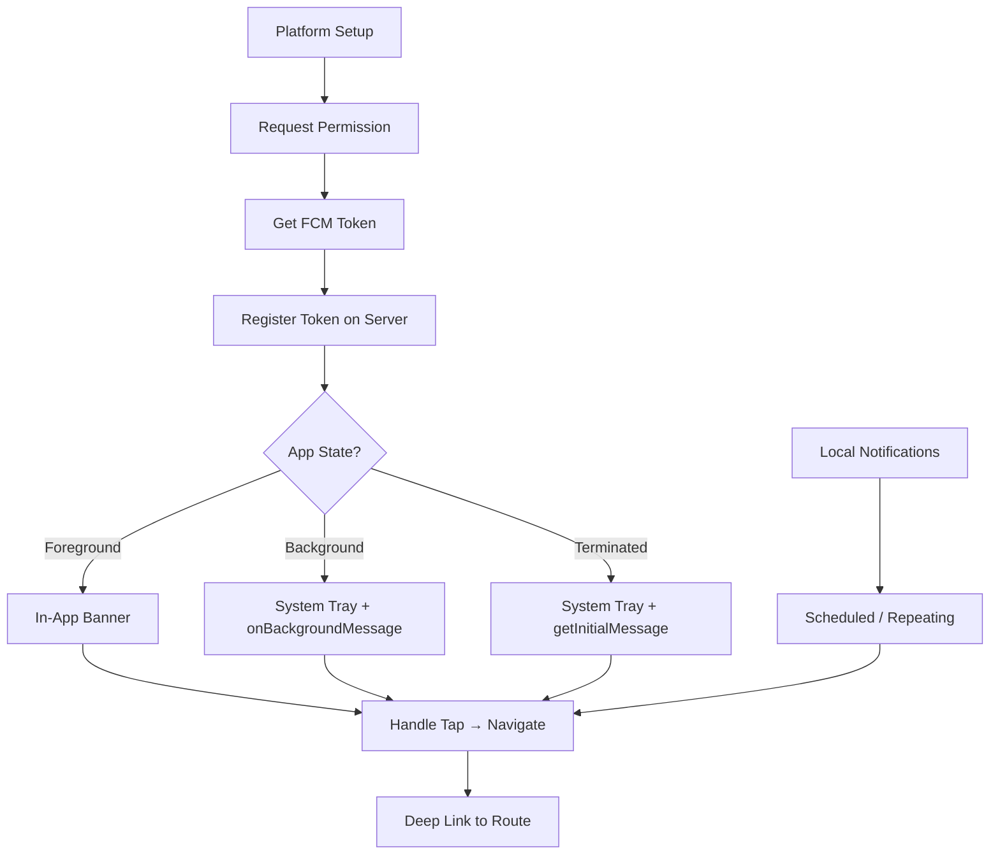

# Blueprint: Push Notifications

<!-- METADATA — structured for agents, useful for humans
tags:        [push-notifications, fcm, apns, local-notifications, background-processing]
category:    architecture
difficulty:  intermediate
time:        3-4 hours
stack:       [flutter, dart, firebase]
-->

> Set up push notifications end-to-end: FCM/APNs delivery, permission handling, foreground/background processing, local notifications, and deep linking from notification taps.

## TL;DR

Configure Firebase Cloud Messaging with APNs for iOS, handle permission requests at the right moment, manage device tokens with server-side registration, process notifications in all app states (foreground, background, terminated), schedule local notifications, and wire up deep links so tapping a notification lands the user on the correct screen.

## When to Use

- Your app needs to deliver real-time alerts to users when they are outside the app (chat messages, order updates, reminders)
- You need scheduled or repeating local notifications that work offline (medication reminders, daily check-ins)
- You want to drive users back into specific screens via notification taps
- When **not** to use it: if you only need in-app real-time updates, consider WebSockets or SSE instead — push notifications add platform complexity you may not need

## Prerequisites

- [ ] Firebase project created with iOS and Android apps registered
- [ ] APNs key (.p8) generated in Apple Developer Portal and uploaded to Firebase Console
- [ ] Flutter project with `firebase_core` initialized (`flutterfire configure` completed)
- [ ] Physical device for testing (iOS simulator does not receive push notifications)
- [ ] Backend capable of sending FCM messages (or access to FCM Console for manual testing)

## Overview



## Steps

### 1. Platform setup

**Why**: FCM acts as the unified gateway — it translates your server's message into an APNs call for iOS and a direct push for Android. Without the platform plumbing (APNs key, Android manifest, iOS entitlements), messages silently vanish with no error.

**Android — `android/app/src/main/AndroidManifest.xml`:**

```xml
<manifest>
    <uses-permission android:name="android.permission.POST_NOTIFICATIONS" />

    <application>
        <!-- Default notification channel for FCM -->
        <meta-data
            android:name="com.google.firebase.messaging.default_notification_channel_id"
            android:value="high_importance_channel" />

        <!-- Default notification icon (must be white-on-transparent) -->
        <meta-data
            android:name="com.google.firebase.messaging.default_notification_icon"
            android:resource="@drawable/ic_notification" />
    </application>
</manifest>
```

**iOS — enable capabilities in Xcode:**

1. Open `ios/Runner.xcworkspace` in Xcode
2. Target → Signing & Capabilities → `+ Capability`
3. Add **Push Notifications**
4. Add **Background Modes** → check **Remote notifications**

**Dependencies — `pubspec.yaml`:**

```yaml
dependencies:
  firebase_core: ^3.0.0
  firebase_messaging: ^15.0.0
  flutter_local_notifications: ^18.0.0
```

**Expected outcome**: Android manifest declares notification permission and default channel. iOS project has Push Notifications entitlement and Background Modes enabled. Running `flutter build` succeeds without errors on both platforms.

### 2. Permission request flow

**Why**: Android 13+ and iOS both require explicit notification permission. Asking on first launch (before the user understands the value) leads to permanent denials. Request permission at the moment the user can see why — after they complete onboarding, or when they enable a feature that needs notifications.

```dart
// notifications/permission_handler.dart
import 'package:firebase_messaging/firebase_messaging.dart';

class NotificationPermissionHandler {
  final FirebaseMessaging _messaging = FirebaseMessaging.instance;

  /// Call this at a contextually appropriate moment, NOT on cold start.
  Future<bool> requestPermission() async {
    final settings = await _messaging.requestPermission(
      alert: true,
      badge: true,
      sound: true,
      // iOS 12+ provisional: delivers silently to Notification Center
      // without prompting — great for low-urgency apps
      provisional: false,
    );

    switch (settings.authorizationStatus) {
      case AuthorizationStatus.authorized:
        return true;
      case AuthorizationStatus.provisional:
        return true; // delivered quietly, user can upgrade later
      case AuthorizationStatus.denied:
        // Don't re-ask — on iOS the dialog won't appear again.
        // Show an in-app banner explaining how to enable in Settings.
        return false;
      case AuthorizationStatus.notDetermined:
        return false;
    }
  }

  /// For low-friction onboarding: use provisional on iOS.
  /// Notifications arrive silently; the user decides to keep/disable later.
  Future<bool> requestProvisionalPermission() async {
    final settings = await _messaging.requestPermission(
      provisional: true, // iOS only — Android ignores this
    );
    return settings.authorizationStatus == AuthorizationStatus.provisional ||
        settings.authorizationStatus == AuthorizationStatus.authorized;
  }
}
```

**Expected outcome**: On iOS, the system permission dialog appears when you call `requestPermission()`. On Android 13+, the `POST_NOTIFICATIONS` runtime permission dialog appears. Provisional mode on iOS skips the dialog entirely and delivers notifications quietly.

### 3. Token management

**Why**: The FCM token is the address your server uses to reach this specific device. Tokens change unpredictably — app reinstall, clearing data, restoring from backup, or FCM rotating them internally. If your server holds a stale token, notifications silently fail with no error (FCM returns 200 but the message is dropped).

```dart
// notifications/token_manager.dart
import 'package:firebase_messaging/firebase_messaging.dart';

class TokenManager {
  final FirebaseMessaging _messaging = FirebaseMessaging.instance;

  Future<void> initialize({
    required Future<void> Function(String token) onTokenRegistered,
  }) async {
    // Get current token
    final token = await _messaging.getToken();
    if (token != null) {
      await onTokenRegistered(token);
    }

    // Listen for token refresh — this fires when FCM rotates the token,
    // after reinstall, or when the user clears app data.
    _messaging.onTokenRefresh.listen((newToken) async {
      await onTokenRegistered(newToken);
    });
  }

  /// Call this on logout to prevent notifications going to a signed-out device.
  Future<void> deleteToken() async {
    await _messaging.deleteToken();
  }
}

// Server registration — your API call
class ServerTokenRegistry {
  final ApiClient _api;
  ServerTokenRegistry(this._api);

  /// Upsert: send device ID + token so the server can replace stale tokens.
  Future<void> registerToken(String fcmToken) async {
    await _api.put('/users/me/devices', body: {
      'device_id': _getDeviceId(), // stable ID (e.g. android_id, identifierForVendor)
      'fcm_token': fcmToken,
      'platform': Platform.isIOS ? 'ios' : 'android',
      'updated_at': DateTime.now().toIso8601String(),
    });
  }

  /// Remove all tokens for this device on logout.
  Future<void> unregisterDevice() async {
    await _api.delete('/users/me/devices/${_getDeviceId()}');
  }
}
```

**Expected outcome**: On app launch, the current FCM token is sent to your server keyed by a stable device ID. When the token refreshes, the server is updated immediately. On logout, the token is deleted both locally (FCM) and server-side.

### 4. Foreground notification handling

**Why**: By default, FCM does not show a system notification when the app is in the foreground — the message arrives silently via `onMessage`. You need to decide: show an in-app banner (less intrusive) or force a system notification (consistent behavior). Most apps use in-app banners for non-critical messages and system notifications for time-sensitive ones.

```dart
// notifications/foreground_handler.dart
import 'package:firebase_messaging/firebase_messaging.dart';
import 'package:flutter_local_notifications/flutter_local_notifications.dart';

class ForegroundNotificationHandler {
  final FlutterLocalNotificationsPlugin _localNotifications;

  ForegroundNotificationHandler(this._localNotifications);

  void initialize({required void Function(String? route) onTap}) {
    // iOS: tell the OS to show banners even when the app is in foreground
    FirebaseMessaging.instance.setForegroundNotificationPresentationOptions(
      alert: true,
      badge: true,
      sound: true,
    );

    // Listen to foreground messages
    FirebaseMessaging.onMessage.listen((RemoteMessage message) {
      final notification = message.notification;
      if (notification == null) return; // data-only messages — handle separately

      // Show as a local notification so the user sees it in the system tray
      _localNotifications.show(
        notification.hashCode,
        notification.title,
        notification.body,
        NotificationDetails(
          android: AndroidNotificationDetails(
            'high_importance_channel',
            'High Importance Notifications',
            importance: Importance.high,
            priority: Priority.high,
          ),
          iOS: const DarwinNotificationDetails(
            presentAlert: true,
            presentBadge: true,
            presentSound: true,
          ),
        ),
        payload: message.data['route'], // attach route for tap handling
      );
    });

    // Handle tap on the local notification shown above
    _localNotifications.initialize(
      const InitializationSettings(
        android: AndroidInitializationSettings('@drawable/ic_notification'),
        iOS: DarwinInitializationSettings(),
      ),
      onDidReceiveNotificationResponse: (response) {
        onTap(response.payload);
      },
    );
  }
}
```

**Expected outcome**: When a notification arrives while the app is open, a system banner appears (iOS) or a heads-up notification shows (Android). Tapping it triggers the `onTap` callback with the route payload.

### 5. Background and terminated state handling

**Why**: Background and terminated states are where most notification bugs live. The OS displays the notification from the `notification` field automatically, but your Dart code only runs if there is a `data` payload and you register a top-level handler. The critical constraint: `onBackgroundMessage` runs in a **separate isolate** with no access to your app's providers, singletons, or widget tree.

```dart
// main.dart — the handler MUST be a top-level function, not a method
@pragma('vm:entry-point')
Future<void> _firebaseMessagingBackgroundHandler(RemoteMessage message) async {
  // Must re-initialize Firebase in the background isolate
  await Firebase.initializeApp();

  // Only do lightweight work here:
  // - Write to local DB (drift/sqflite, not SharedPreferences — no Flutter engine)
  // - Schedule a local notification
  // - Update badge count

  // Do NOT:
  // - Access providers/riverpod/bloc from the main isolate
  // - Show UI or navigate
  // - Make long-running network calls (OS kills after ~30s)
}

void main() async {
  WidgetsFlutterBinding.ensureInitialized();
  await Firebase.initializeApp();

  // Register BEFORE runApp
  FirebaseMessaging.onBackgroundMessage(_firebaseMessagingBackgroundHandler);

  runApp(const MyApp());
}
```

**Handling notification tap from terminated state:**

```dart
// notifications/initial_message_handler.dart
class InitialMessageHandler {
  /// Call once in your app's root widget initState or splash screen.
  Future<void> checkForInitialMessage({
    required void Function(String route) navigate,
  }) async {
    // App was terminated → user tapped notification → app launched
    final initialMessage = await FirebaseMessaging.instance.getInitialMessage();
    if (initialMessage != null) {
      final route = initialMessage.data['route'];
      if (route != null) navigate(route);
    }

    // App was in background → user tapped notification → app brought to foreground
    FirebaseMessaging.onMessageOpenedApp.listen((RemoteMessage message) {
      final route = message.data['route'];
      if (route != null) navigate(route);
    });
  }
}
```

**Payload strategy — data-only vs notification+data:**

| Payload type | Foreground | Background | Terminated |
|---|---|---|---|
| `notification` only | `onMessage` fires, no system tray | OS shows notification | OS shows notification |
| `data` only | `onMessage` fires | `onBackgroundMessage` fires | `onBackgroundMessage` fires |
| `notification` + `data` | `onMessage` fires | OS shows notification + `onBackgroundMessage` | OS shows notification, tap → `getInitialMessage` |

**Expected outcome**: Background messages are handled by the top-level isolate function. Terminated-state taps are caught by `getInitialMessage` on next launch. Data-only payloads give you full control in all states.

### 6. Local notifications

**Why**: Push notifications require a server and network connectivity. Local notifications handle offline use cases — medication reminders, daily habit check-ins, calendar alerts. On Android, notification channels are mandatory (API 26+) and once created, the user controls their settings. You cannot programmatically change importance or sound on an existing channel.

```dart
// notifications/local_notification_service.dart
import 'package:flutter_local_notifications/flutter_local_notifications.dart';
import 'package:timezone/timezone.dart' as tz;
import 'package:timezone/data/latest_all.dart' as tz;

class LocalNotificationService {
  final FlutterLocalNotificationsPlugin _plugin =
      FlutterLocalNotificationsPlugin();

  Future<void> initialize({
    required void Function(String? payload) onTap,
  }) async {
    tz.initializeTimeZones();

    // Create Android notification channels
    const androidPlugin =
        AndroidFlutterLocalNotificationsPlugin();

    await androidPlugin.createNotificationChannel(
      const AndroidNotificationChannel(
        'reminders',
        'Reminders',
        description: 'Scheduled reminder notifications',
        importance: Importance.high,
        sound: RawResourceAndroidNotificationSound('reminder_sound'),
      ),
    );

    await androidPlugin.createNotificationChannel(
      const AndroidNotificationChannel(
        'general',
        'General',
        description: 'General app notifications',
        importance: Importance.defaultImportance,
      ),
    );

    await _plugin.initialize(
      const InitializationSettings(
        android: AndroidInitializationSettings('@drawable/ic_notification'),
        iOS: DarwinInitializationSettings(
          requestAlertPermission: false, // we handle permissions separately
          requestBadgePermission: false,
          requestSoundPermission: false,
        ),
      ),
      onDidReceiveNotificationResponse: (response) {
        onTap(response.payload);
      },
    );
  }

  /// Schedule a one-time notification at a specific time.
  Future<void> scheduleNotification({
    required int id,
    required String title,
    required String body,
    required DateTime scheduledTime,
    String? payload,
    String channelId = 'reminders',
  }) async {
    await _plugin.zonedSchedule(
      id,
      title,
      body,
      tz.TZDateTime.from(scheduledTime, tz.local),
      NotificationDetails(
        android: AndroidNotificationDetails(
          channelId,
          channelId == 'reminders' ? 'Reminders' : 'General',
          importance: Importance.high,
          priority: Priority.high,
        ),
        iOS: const DarwinNotificationDetails(
          presentAlert: true,
          presentBadge: true,
          presentSound: true,
        ),
      ),
      androidScheduleMode: AndroidScheduleMode.exactAllowWhileIdle,
      matchDateTimeComponents: null, // one-time
      payload: payload,
    );
  }

  /// Schedule a daily repeating notification.
  Future<void> scheduleDailyNotification({
    required int id,
    required String title,
    required String body,
    required int hour,
    required int minute,
    String? payload,
  }) async {
    await _plugin.zonedSchedule(
      id,
      title,
      body,
      _nextInstanceOfTime(hour, minute),
      NotificationDetails(
        android: AndroidNotificationDetails(
          'reminders',
          'Reminders',
          importance: Importance.high,
          priority: Priority.high,
        ),
        iOS: const DarwinNotificationDetails(),
      ),
      androidScheduleMode: AndroidScheduleMode.exactAllowWhileIdle,
      matchDateTimeComponents: DateTimeComponents.time, // repeats daily
      payload: payload,
    );
  }

  tz.TZDateTime _nextInstanceOfTime(int hour, int minute) {
    final now = tz.TZDateTime.now(tz.local);
    var scheduled = tz.TZDateTime(tz.local, now.year, now.month, now.day, hour, minute);
    if (scheduled.isBefore(now)) {
      scheduled = scheduled.add(const Duration(days: 1));
    }
    return scheduled;
  }

  Future<void> cancelNotification(int id) => _plugin.cancel(id);
  Future<void> cancelAll() => _plugin.cancelAll();
}
```

**Expected outcome**: Local notifications fire at scheduled times even when the app is killed. Android channels appear in the device notification settings. Tapping a local notification triggers the `onTap` callback with the payload.

### 7. Deep link from notification

**Why**: A notification that opens the app's home screen is a wasted interaction. The payload should carry a route, and the app should navigate there — even on cold start when the widget tree is not yet built.

```dart
// notifications/notification_router.dart
class NotificationRouter {
  final GlobalKey<NavigatorState> navigatorKey;

  NotificationRouter(this.navigatorKey);

  /// Call from all notification entry points:
  /// - ForegroundHandler.onTap
  /// - InitialMessageHandler (getInitialMessage + onMessageOpenedApp)
  /// - LocalNotificationService.onTap
  void handleNotificationRoute(String? routePayload) {
    if (routePayload == null || routePayload.isEmpty) return;

    // Parse route and params from the payload
    final uri = Uri.parse(routePayload);

    // Deferred navigation: if the navigator isn't ready yet (cold start),
    // schedule it after the first frame.
    WidgetsBinding.instance.addPostFrameCallback((_) {
      navigatorKey.currentState?.pushNamed(
        uri.path,
        arguments: uri.queryParameters,
      );
    });
  }
}
```

**Server-side payload structure:**

```json
{
  "message": {
    "token": "<FCM_TOKEN>",
    "notification": {
      "title": "Order Shipped",
      "body": "Your order #1234 is on its way!"
    },
    "data": {
      "route": "/orders/detail?id=1234",
      "type": "order_update"
    }
  }
}
```

**Expected outcome**: Tapping a notification navigates directly to the relevant screen. On cold start, navigation is deferred until the widget tree is ready. The route format is consistent across push and local notifications.

### 8. Testing notifications

**Why**: Push notifications involve three moving parts (server, FCM, device) and three app states. You need to test each combination systematically. The FCM Console is the fastest way to verify end-to-end delivery; `curl` to the FCM API tests your exact payload structure.

**FCM Console (quickest sanity check):**

1. Go to Firebase Console → Cloud Messaging → "Send your first message"
2. Enter title/body, click "Send test message"
3. Paste your FCM token (print it with `debugPrint(await FirebaseMessaging.instance.getToken())`)
4. Test in all three states: foreground, background (press home), terminated (force kill)

**curl to FCM v1 API (tests your exact payload):**

```bash
# Get an OAuth2 access token for the service account
ACCESS_TOKEN=$(gcloud auth application-default print-access-token)

curl -X POST \
  "https://fcm.googleapis.com/v1/projects/YOUR_PROJECT_ID/messages:send" \
  -H "Authorization: Bearer $ACCESS_TOKEN" \
  -H "Content-Type: application/json" \
  -d '{
    "message": {
      "token": "DEVICE_FCM_TOKEN",
      "notification": {
        "title": "Test Title",
        "body": "Test body from curl"
      },
      "data": {
        "route": "/orders/detail?id=42"
      },
      "android": {
        "notification": {
          "channel_id": "high_importance_channel"
        }
      },
      "apns": {
        "payload": {
          "aps": {
            "sound": "default",
            "badge": 1
          }
        }
      }
    }
  }'
```

**Data-only payload test (to verify background handler):**

```bash
curl -X POST \
  "https://fcm.googleapis.com/v1/projects/YOUR_PROJECT_ID/messages:send" \
  -H "Authorization: Bearer $ACCESS_TOKEN" \
  -H "Content-Type: application/json" \
  -d '{
    "message": {
      "token": "DEVICE_FCM_TOKEN",
      "data": {
        "route": "/chat?id=99",
        "title": "New message",
        "body": "Hey, are you free tonight?"
      }
    }
  }'
```

**Local notification testing:**

```dart
// Quick test — fire a notification in 5 seconds
await localNotificationService.scheduleNotification(
  id: 9999,
  title: 'Test Local',
  body: 'This should appear in 5 seconds',
  scheduledTime: DateTime.now().add(const Duration(seconds: 5)),
  payload: '/test',
);
```

**Test matrix — verify each cell:**

| Scenario | Foreground | Background | Terminated |
|---|---|---|---|
| `notification` + `data` payload | Banner shown, tap navigates | System tray, tap navigates | System tray, tap navigates on launch |
| `data`-only payload | `onMessage` fires, local notif shown | `onBackgroundMessage` fires | `onBackgroundMessage` fires |
| Local notification | Shown immediately | Shown at scheduled time | Shown at scheduled time |
| Tap deep link | Navigates to route | Navigates to route | Deferred navigation on launch |

**Expected outcome**: All cells in the test matrix produce the expected behavior. FCM token is confirmed reachable. Deep link navigation works from all three app states.

## Variants

<details>
<summary><strong>Variant: iOS provisional quiet notifications</strong></summary>

Provisional authorization (iOS 12+) lets you deliver notifications without asking the user first. Notifications appear silently in the Notification Center (not on the lock screen, no sound). Each notification includes "Keep..." and "Turn Off..." buttons, letting the user promote or disable your notifications organically.

**When to use**: onboarding-sensitive apps where a permission dialog would cause drop-off. News apps, social apps, or any app where users need to experience the notification value before committing.

```dart
final settings = await FirebaseMessaging.instance.requestPermission(
  provisional: true,
);
// settings.authorizationStatus == AuthorizationStatus.provisional
```

**Tradeoffs:**
- No sound, no lock screen, no banners — easy to miss
- User may never notice the notifications and never upgrade to full permission
- Only works on iOS 12+; Android has no equivalent (you must ask explicitly on Android 13+)

</details>

<details>
<summary><strong>Variant: Topic-based subscriptions vs. individual tokens</strong></summary>

Instead of tracking individual FCM tokens on your server, subscribe devices to topics. FCM handles fan-out.

```dart
// Subscribe to a topic
await FirebaseMessaging.instance.subscribeToTopic('promotions');
await FirebaseMessaging.instance.subscribeToTopic('sport_scores');

// Unsubscribe
await FirebaseMessaging.instance.unsubscribeFromTopic('promotions');
```

**Server sends to topic instead of token:**

```json
{
  "message": {
    "topic": "sport_scores",
    "notification": {
      "title": "Goal!",
      "body": "Team A scores in the 89th minute"
    }
  }
}
```

**Tradeoffs:**
- No server-side token management needed — simpler architecture
- Cannot target a specific user or device
- No delivery tracking per-user (you get aggregate stats only)
- Topic subscriptions are eventually consistent (~24h propagation delay in rare cases)
- Best for broadcast-style notifications (news, promotions, live scores)

</details>

## Gotchas

> **Background isolate cannot access main isolate state**: `onBackgroundMessage` runs in a separate Dart isolate. Your providers, singletons, GetIt registrations, and Riverpod containers from the main isolate do not exist there. Calling them throws or returns null. **Fix**: Treat the background handler as a standalone entry point. Re-initialize only what you need (Firebase, local DB). For shared state, write to a local database and read it when the main isolate resumes.

> **iOS foreground notifications are silent by default**: On iOS, FCM notifications are not displayed when the app is in the foreground. The `onMessage` callback fires but the user sees nothing. **Fix**: Call `setForegroundNotificationPresentationOptions(alert: true, badge: true, sound: true)` during initialization, or display a local notification manually from the `onMessage` handler for full control over appearance.

> **Android notification channels are immutable after creation**: Once you create a channel with `createNotificationChannel()`, changing its importance, sound, or vibration pattern in code has no effect — the OS ignores the update. The user owns the channel settings. **Fix**: If you need to change channel behavior, create a new channel with a different ID (e.g., `reminders_v2`) and delete the old one. Update your server payloads to reference the new channel ID.

> **Token refresh race condition**: The FCM token can refresh at any time — during a network call, between app sessions, or while your server is processing a send. If the server holds the old token, FCM silently drops the message (no error returned). **Fix**: Always register tokens with a stable device ID as the key (not the token itself). Use `onTokenRefresh` to update the server immediately. On the server, use `PUT` (upsert) semantics so the new token replaces the old one atomically.

> **Data-only messages on iOS require background modes**: iOS will not wake your app for data-only FCM messages unless the Background Modes capability with "Remote notifications" is enabled AND `content-available: 1` is set in the APNs payload. Without this, the message is silently dropped. **Fix**: Enable the Background Modes capability in Xcode and ensure your server sets the `content-available` flag for data-only payloads.

> **Exact alarms restricted on Android 12+**: `AndroidScheduleMode.exactAllowWhileIdle` requires the `SCHEDULE_EXACT_ALARM` permission on Android 12+. Starting with Android 14, apps targeting API 34 must use `USE_EXACT_ALARM` (auto-granted for calendar/alarm apps) or fall back to `inexact` scheduling. **Fix**: Check `canScheduleExactAlarms()` before scheduling. If denied, fall back to inexact alarms with `AndroidScheduleMode.inexact` and accept up to 15 minutes of drift.

## Checklist

- [ ] Firebase project configured with APNs key uploaded for iOS
- [ ] Android manifest declares `POST_NOTIFICATIONS` permission and default channel
- [ ] iOS has Push Notifications and Background Modes (Remote notifications) capabilities
- [ ] Permission requested at a contextually appropriate moment (not cold start)
- [ ] FCM token obtained and sent to server with stable device ID
- [ ] `onTokenRefresh` listener registered to update server on token change
- [ ] `setForegroundNotificationPresentationOptions` called for iOS
- [ ] Foreground messages displayed via local notification or in-app banner
- [ ] `onBackgroundMessage` registered with a top-level function before `runApp`
- [ ] `getInitialMessage` checked on app launch for terminated-state taps
- [ ] `onMessageOpenedApp` listener set for background-state taps
- [ ] Local notification channels created on Android
- [ ] Deep link route parsed from notification payload and navigated correctly
- [ ] All cells in the test matrix verified on a physical device
- [ ] Token deleted on logout (both FCM and server-side)

## Artifacts

| Artifact | Location | Description |
|----------|----------|-------------|
| Permission handler | `lib/notifications/permission_handler.dart` | Request and check notification permissions |
| Token manager | `lib/notifications/token_manager.dart` | FCM token lifecycle and server registration |
| Foreground handler | `lib/notifications/foreground_handler.dart` | Display and handle foreground notifications |
| Background handler | `main.dart` (top-level function) | Process data-only messages in background isolate |
| Initial message handler | `lib/notifications/initial_message_handler.dart` | Catch notification taps from terminated state |
| Local notification service | `lib/notifications/local_notification_service.dart` | Schedule, repeat, and cancel local notifications |
| Notification router | `lib/notifications/notification_router.dart` | Parse payload and navigate to deep link route |

## References

- [Firebase Cloud Messaging — Flutter](https://firebase.google.com/docs/cloud-messaging/flutter/client) — Official FCM Flutter setup guide
- [flutter_local_notifications](https://pub.dev/packages/flutter_local_notifications) — Local notification plugin with channel, scheduling, and platform support
- [FCM HTTP v1 API](https://firebase.google.com/docs/cloud-messaging/send-message) — Server-side send API reference
- [APNs Overview](https://developer.apple.com/documentation/usernotifications) — Apple Push Notification service documentation
- [Android Notification Channels](https://developer.android.com/develop/ui/views/notifications/channels) — Required for Android 8.0+ notification management
- [Firebase Messaging — Background Messages](https://firebase.google.com/docs/cloud-messaging/flutter/receive#background_messages) — Isolate constraints and setup for background processing
