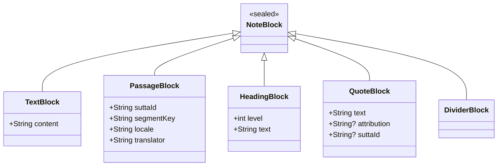

# Blueprint: Sealed Class Modeling

<!-- METADATA — structured for agents, useful for humans
tags:        [sealed-class, type-safety, domain-modeling, dart, kotlin, swift]
category:    architecture
difficulty:  intermediate
time:        1 hour
stack:       [dart]
-->

> Type-safe domain modeling with sealed classes, exhaustive matching, and JSON serialization using discriminator fields.

## TL;DR

Define polymorphic domain types as sealed class hierarchies so the compiler enforces exhaustive handling at every call site. When you add a new subtype, the compiler tells you every place that needs updating. You get type safety, self-documenting code, and a JSON serialization pattern that uses a `type` discriminator field.

## When to Use

- A domain concept has a fixed, known set of variants (e.g., note blocks, payment methods, navigation destinations)
- You currently rely on `if (obj.isX)` / `is` checks scattered across the codebase
- You need JSON round-tripping of polymorphic objects through an API or local storage
- When **not** to use it: the set of subtypes is open-ended and third parties need to add their own (use an abstract class or interface instead)

## Prerequisites

- [ ] Dart 3.0+ (sealed classes and pattern matching)
- [ ] Familiarity with pattern matching / switch expressions

## Overview



## Steps

### 1. Identify the polymorphic domain

**Why**: Choosing the wrong abstraction leads to over-engineering or under-modeling. Sealed classes sit between plain enums (no data per variant) and open inheritance (unlimited subtypes).

| Mechanism | When to reach for it |
|-----------|---------------------|
| `enum` | Fixed set of values, no per-variant data |
| `sealed class` | Fixed set of variants, each carrying different data |
| Abstract class / interface | Open set of subtypes, extensible by consumers |

Ask: "Do I know all the variants at compile time, and do they carry different shapes of data?" If yes, use a sealed class.

**Expected outcome**: A clear list of subtypes and the data each one carries.

### 2. Define the sealed class with subtypes

**Why**: The sealed modifier tells the compiler that no other subtypes exist outside this file, enabling exhaustive checking.

```dart
// lib/domain/note_block.dart

sealed class NoteBlock {
  const NoteBlock();
}

class TextBlock extends NoteBlock {
  const TextBlock({required this.content});
  final String content;
}

class PassageBlock extends NoteBlock {
  const PassageBlock({
    required this.suttaId,
    required this.segmentKey,
    required this.locale,
    required this.translator,
  });
  final String suttaId;
  final String segmentKey;
  final String locale;
  final String translator;
}

class HeadingBlock extends NoteBlock {
  const HeadingBlock({required this.level, required this.text});
  final int level;
  final String text;
}

class QuoteBlock extends NoteBlock {
  const QuoteBlock({required this.text, this.attribution, this.suttaId});
  final String text;
  final String? attribution;
  final String? suttaId;
}

class DividerBlock extends NoteBlock {
  const DividerBlock();
}
```

**Expected outcome**: All subtypes in a single file. The compiler now knows the complete set.

### 3. Use exhaustive switch/when everywhere

**Why**: This is the core payoff. Replace `if (block is TextBlock)` chains with exhaustive switch expressions. The compiler will error on any unhandled subtype.

```dart
Widget buildBlock(NoteBlock block) {
  return switch (block) {
    TextBlock(:final content) => Text(content),
    PassageBlock(:final suttaId, :final segmentKey) =>
        PassageWidget(suttaId: suttaId, segmentKey: segmentKey),
    HeadingBlock(:final level, :final text) =>
        HeadingWidget(level: level, text: text),
    QuoteBlock(:final text, :final attribution) =>
        QuoteWidget(text: text, attribution: attribution),
    DividerBlock() => const Divider(),
  };
}
```

Notice: no `default` or wildcard `_` case. That is intentional. If you add a sixth subtype tomorrow, this switch will fail to compile until you handle it.

**Expected outcome**: Every consumer of `NoteBlock` uses a switch expression with no default case.

### 4. Implement JSON serialization with a discriminator field

**Why**: Polymorphic types need a way to identify which subtype to deserialize into. A `type` discriminator field is the standard approach.

```dart
extension NoteBlockJson on NoteBlock {
  Map<String, dynamic> toJson() {
    return switch (this) {
      TextBlock(:final content) => {
        'type': 'text',
        'content': content,
      },
      PassageBlock(
        :final suttaId,
        :final segmentKey,
        :final locale,
        :final translator,
      ) =>
        {
          'type': 'passage',
          'suttaId': suttaId,
          'segmentKey': segmentKey,
          'locale': locale,
          'translator': translator,
        },
      HeadingBlock(:final level, :final text) => {
        'type': 'heading',
        'level': level,
        'text': text,
      },
      QuoteBlock(:final text, :final attribution, :final suttaId) => {
        'type': 'quote',
        'text': text,
        if (attribution != null) 'attribution': attribution,
        if (suttaId != null) 'suttaId': suttaId,
      },
      DividerBlock() => {
        'type': 'divider',
      },
    };
  }

  static NoteBlock fromJson(Map<String, dynamic> json) {
    return switch (json['type'] as String) {
      'text' => TextBlock(content: json['content'] as String),
      'passage' => PassageBlock(
        suttaId: json['suttaId'] as String,
        segmentKey: json['segmentKey'] as String,
        locale: json['locale'] as String,
        translator: json['translator'] as String,
      ),
      'heading' => HeadingBlock(
        level: json['level'] as int,
        text: json['text'] as String,
      ),
      'quote' => QuoteBlock(
        text: json['text'] as String,
        attribution: json['attribution'] as String?,
        suttaId: json['suttaId'] as String?,
      ),
      'divider' => const DividerBlock(),
      _ => throw ArgumentError('Unknown NoteBlock type: ${json['type']}'),
    };
  }
}
```

Note: `fromJson` does need a wildcard/default case because the JSON input is untrusted at runtime.

**Expected outcome**: Round-trip serialization works. Every JSON object carries a `type` field that maps to exactly one subtype.

### 5. Add new subtypes safely

**Why**: This step validates the entire pattern. The compiler becomes your checklist.

To add a new subtype (e.g., `ImageBlock`):

1. Add the subclass to `note_block.dart`:

```dart
class ImageBlock extends NoteBlock {
  const ImageBlock({required this.url, this.caption});
  final String url;
  final String? caption;
}
```

2. Run `dart analyze` (or let your IDE refresh). Every switch on `NoteBlock` that lacks an `ImageBlock` case will produce a compile error.

3. Fix each error by adding the missing case. The compiler tells you exactly which files and lines need updating.

4. Add the `'image'` case to `fromJson` and the serialization to `toJson`.

**Expected outcome**: Zero runtime surprises. The compiler caught every location that needs updating.

## Variants

<details>
<summary><strong>Variant: Kotlin sealed interface</strong></summary>

Kotlin uses `sealed interface` (or `sealed class`) with `when` expressions. The `when` must be exhaustive when used as an expression.

```kotlin
sealed interface NoteBlock

data class TextBlock(val content: String) : NoteBlock
data class PassageBlock(
    val suttaId: String,
    val segmentKey: String,
    val locale: String,
    val translator: String,
) : NoteBlock
data class HeadingBlock(val level: Int, val text: String) : NoteBlock
data class QuoteBlock(
    val text: String,
    val attribution: String? = null,
    val suttaId: String? = null,
) : NoteBlock
data object DividerBlock : NoteBlock

// Exhaustive when-expression
fun NoteBlock.render(): String = when (this) {
    is TextBlock -> content
    is PassageBlock -> "[$suttaId] $segmentKey"
    is HeadingBlock -> "${"#".repeat(level)} $text"
    is QuoteBlock -> "> $text"
    DividerBlock -> "---"
}
```

For JSON serialization, Kotlin's `kotlinx.serialization` supports sealed classes natively with a `classDiscriminator`:

```kotlin
@Serializable
@JsonClassDiscriminator("type")
sealed interface NoteBlock
```

</details>

<details>
<summary><strong>Variant: Swift enum with associated values</strong></summary>

Swift models this pattern as an enum where each case carries associated values.

```swift
enum NoteBlock {
    case text(content: String)
    case passage(suttaId: String, segmentKey: String, locale: String, translator: String)
    case heading(level: Int, text: String)
    case quote(text: String, attribution: String?, suttaId: String?)
    case divider
}

// Exhaustive switch
func render(_ block: NoteBlock) -> String {
    switch block {
    case .text(let content):
        return content
    case .passage(let suttaId, let segmentKey, _, _):
        return "[\(suttaId)] \(segmentKey)"
    case .heading(let level, let text):
        return String(repeating: "#", count: level) + " " + text
    case .quote(let text, _, _):
        return "> \(text)"
    case .divider:
        return "---"
    }
}
```

For JSON serialization, use a `CodingKeys` enum with a `type` key and implement `Codable` manually or use a library like `AnyCodable`.

</details>

## Gotchas

> **Wildcard cases defeat exhaustiveness**: Adding a `default` or `_` wildcard to a switch on a sealed class compiles today but silently swallows new subtypes added later. **Fix**: Never use `default` / `_` on sealed-class switches. The only exception is `fromJson` where runtime input is untrusted.

> **Discriminator field naming conflicts**: If your JSON payload already has a `type` field for another purpose, the discriminator will collide. **Fix**: Choose a distinct discriminator name like `blockType` or `_type` and keep it consistent across your entire serialization layer.

> **Forgetting `const` constructors**: Sealed subtypes with only final fields should have `const` constructors for performance (widget rebuilds, collection equality). **Fix**: Always declare `const` constructors on sealed subtypes. The analyzer will not warn you, but unnecessary rebuilds will cost you.

> **Nested sealed hierarchies**: Dart sealed classes can only be extended within the same library. If you try to create a sealed subtype in another file (same library), it works, but splitting across libraries does not. **Fix**: Keep the entire sealed hierarchy in one file or one `part` / `part of` library.

## Checklist

- [ ] Sealed class and all subtypes defined in one library file
- [ ] Every switch on the sealed class is exhaustive (no `default` / `_`)
- [ ] JSON serialization uses a consistent discriminator field (`type`)
- [ ] `fromJson` has a fallback/throw for unknown discriminator values
- [ ] `const` constructors on all subtypes where possible
- [ ] Adding a new subtype causes compile errors at every unhandled switch (verified)
- [ ] Tests cover round-trip JSON serialization for each subtype

## Artifacts

| Artifact | Location | Description |
|----------|----------|-------------|
| Sealed class definition | `lib/domain/note_block.dart` | `NoteBlock` sealed class with all subtypes |
| JSON serialization | `lib/domain/note_block.dart` | `toJson` / `fromJson` via extension on `NoteBlock` |
| Widget builder | caller site | Exhaustive switch expression mapping blocks to widgets |

## References

- [Dart sealed classes](https://dart.dev/language/class-modifiers#sealed) — official language documentation
- [Dart patterns and exhaustiveness](https://dart.dev/language/patterns) — pattern matching and switch expressions
- [Kotlin sealed classes](https://kotlinlang.org/docs/sealed-classes.html) — Kotlin language reference
- [Swift enumerations](https://docs.swift.org/swift-book/documentation/the-swift-programming-language/enumerations/) — associated values and pattern matching
- [kotlinx.serialization polymorphism](https://github.com/Kotlin/kotlinx.serialization/blob/master/docs/polymorphism.md) — sealed class JSON serialization in Kotlin
