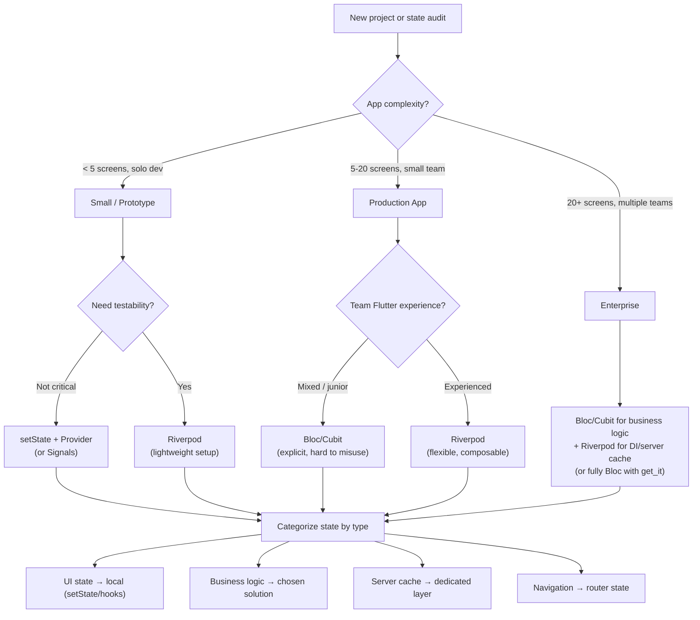

# Blueprint: State Management Decision Guide

<!-- METADATA — structured for agents, useful for humans
tags:        [state-management, riverpod, bloc, flutter, architecture]
category:    architecture
difficulty:  intermediate
time:        1-2 hours
stack:       [flutter, dart]
-->

> A decision framework for choosing the right state management approach per layer of your Flutter app — not a tutorial, a chooser.

## TL;DR

Categorize your state into four buckets (UI/ephemeral, business logic, server cache, navigation), then pick the simplest tool that handles each bucket for your team size and app complexity. Most production apps use two approaches in combination, not one silver bullet.

## When to Use

- You're starting a new Flutter project and need to commit to a state management strategy
- Your current app has become a tangled mix of state approaches with no clear rationale
- You're evaluating whether to migrate from one state management solution to another
- A team member asks "why Riverpod and not Bloc?" and you need a principled answer
- When **not** to use it: you already have a working, consistent state architecture and the team is productive with it — don't fix what isn't broken

## Prerequisites

- [ ] Basic Flutter knowledge (StatefulWidget, InheritedWidget concepts)
- [ ] Understanding of the difference between synchronous and asynchronous state
- [ ] A rough sense of your app's scope (number of screens, team size, expected lifespan)

## Overview



## Steps

### 1. Identify app complexity and constraints

**Why**: The right state management approach for a weekend prototype is wrong for a 50-screen app maintained by three teams. Over-engineering kills velocity; under-engineering kills maintainability. Start with honest scoping.

Score your project on these axes:

| Factor | Low (1) | Medium (2) | High (3) |
|--------|---------|------------|----------|
| Screen count | < 5 | 5-20 | 20+ |
| Team size | Solo | 2-5 | 5+ |
| App lifespan | Months | 1-2 years | 3+ years |
| Offline requirements | None | Light caching | Full offline-first |
| Real-time data | None | Some streams | Heavy WebSocket/SSE |

**Total 5-8**: small app. **9-12**: production app. **13+**: enterprise.

**Expected outcome**: A clear complexity tier (small, production, enterprise) that narrows your choices.

### 2. Define your state categories

**Why**: Treating all state the same is the root cause of spaghetti state architectures. A loading spinner and a user's authentication token have completely different lifetimes, scopes, and invalidation rules. Separate them.

Classify every piece of state in your app into one of four categories:

| Category | Lifetime | Examples | Typical owner |
|----------|----------|---------|---------------|
| **UI / Ephemeral** | Single widget | Animation progress, text field input, tab index, scroll position | The widget itself |
| **Business logic** | Feature or app | Auth status, shopping cart, form validation across steps, user preferences | State management solution |
| **Server cache** | Until invalidated | API responses, paginated lists, search results | Caching / query layer |
| **Navigation** | Route lifetime | Current route, deep link params, back stack | Router |

Rules of thumb:
- If state dies when a widget is removed from the tree, it's UI state. Keep it local.
- If two unrelated widgets need the same state, it's business logic or server cache.
- If state comes from a network call, treat it as server cache even if it also drives business logic.

**Expected outcome**: A table or list mapping each piece of state in your app to one of the four categories.

### 3. Choose an approach per category

**Why**: No single package excels at all four categories. Picking one tool per category (with at most two total packages) gives you clarity without chaos.

#### UI / Ephemeral state

Always use `setState`, `ValueNotifier`, or `flutter_hooks`. No package needed. This is not a debate.

#### Business logic state

This is where the real decision lives. Here is an honest comparison:

| Solution | Strengths | Weaknesses | Best for |
|----------|-----------|------------|----------|
| **Riverpod** | Compile-safe, no BuildContext needed, excellent composition, strong async support | Steeper learning curve, ref lifecycle is subtle, code generation optional but recommended | Experienced teams, apps with complex dependency graphs |
| **Bloc/Cubit** | Extremely explicit data flow, great tooling (bloc_test, observer), hard to misuse, forced separation of events/states | Verbose boilerplate (events, states, mappers), overkill for simple state, event ordering can surprise | Teams with mixed experience, enterprise apps, apps needing audit trails |
| **Provider** | Simple mental model, built on InheritedWidget, large community | Depends on BuildContext (problematic outside widget tree), no built-in async patterns, creator is moving to Riverpod | Legacy apps, very simple apps |
| **GetX** | Minimal boilerplate, fast to prototype | Implicit magic, hard to test, mixes concerns (routing, DI, state), poor separation of layers | Prototypes you plan to throw away |
| **Signals** | Fine-grained reactivity, minimal boilerplate, no build context needed | Young ecosystem in Flutter, fewer battle-tested patterns, limited tooling | Experimental projects, devs coming from SolidJS/Angular |

> **Decision**: If your team is experienced and values composition, choose Riverpod. If your team needs guardrails and explicit patterns, choose Bloc/Cubit. If you're prototyping, Provider or Signals are fine. Avoid GetX for anything you plan to maintain.

#### Server cache state

Use a dedicated caching layer regardless of your business logic choice:
- **Riverpod** users: `AsyncNotifierProvider` + `ref.invalidate()` gives you query-like behavior natively
- **Bloc** users: Separate repository layer with in-memory or Drift-backed cache; consider `flutter_query` or `graphql_flutter` if API-heavy
- All: Treat server cache as a separate concern. Don't stuff API responses directly into your Bloc states or Riverpod providers without a cache invalidation strategy.

#### Navigation state

Use `go_router` (or `auto_route`). Navigation state should live in the router, not in your state management solution. The router reads auth/business state to decide redirects, but does not own it.

**Expected outcome**: A clear mapping — e.g., "UI: setState, Business: Riverpod, Server cache: AsyncNotifierProvider, Navigation: go_router."

### 4. Set up architecture scaffolding

**Why**: Choosing a tool is half the battle. Structuring the code so the team uses it consistently is the other half. Without scaffolding, you'll end up with three different Bloc patterns in the same app.

Define a standard folder structure based on your choice:

**Riverpod project structure:**
```
lib/
  features/
    auth/
      data/
        auth_repository.dart        # server cache + API calls
      domain/
        auth_state.dart             # business logic state (freezed)
      presentation/
        auth_screen.dart            # UI (ConsumerWidget)
        auth_controller.dart        # Notifier (business logic)
  core/
    providers/
      shared_providers.dart         # app-wide providers (locale, theme)
```

**Bloc project structure:**
```
lib/
  features/
    auth/
      data/
        auth_repository.dart        # server cache + API calls
      bloc/
        auth_bloc.dart              # business logic
        auth_event.dart             # inputs
        auth_state.dart             # outputs (freezed)
      view/
        auth_screen.dart            # UI (BlocBuilder/BlocListener)
  core/
    di/
      injection.dart                # get_it or manual DI
```

Establish these rules in your project's `CLAUDE.md` or contributing guide:
1. One state class (Notifier/Bloc/Cubit) per feature, not per screen
2. State classes are always immutable (use `freezed` or manual `copyWith`)
3. UI widgets never call repository methods directly
4. Providers/Blocs never import Flutter material/widgets

**Expected outcome**: A scaffold that a new team member can follow by copying an existing feature folder.

### 5. Define a testing strategy per approach

**Why**: State management that can't be tested in isolation isn't state management, it's spaghetti with a package name. Your choice of solution directly impacts how you write tests.

| Approach | Unit test pattern | What to verify |
|----------|------------------|----------------|
| **Riverpod** | Create a `ProviderContainer`, override dependencies, read provider | State transitions, async behavior, dependency injection |
| **Bloc/Cubit** | `blocTest()` from `bloc_test` package — given events, expect state sequence | State sequence per event, error handling, event ordering |
| **Provider** | Wrap widget in `MultiProvider` with mock values, use `WidgetTester` | Harder to unit test in isolation — often requires widget tests |

**Riverpod test example:**
```dart
test('auth controller signs out', () async {
  final container = ProviderContainer(
    overrides: [
      authRepositoryProvider.overrideWithValue(MockAuthRepository()),
    ],
  );

  final controller = container.read(authControllerProvider.notifier);
  await controller.signOut();

  expect(
    container.read(authControllerProvider),
    const AuthState.unauthenticated(),
  );
});
```

**Bloc test example:**
```dart
blocTest<AuthBloc, AuthState>(
  'emits [loading, unauthenticated] on SignOutRequested',
  build: () => AuthBloc(authRepository: MockAuthRepository()),
  act: (bloc) => bloc.add(const SignOutRequested()),
  expect: () => [
    const AuthState.loading(),
    const AuthState.unauthenticated(),
  ],
);
```

**Expected outcome**: A test template for each state category that the team copies for new features. Business logic state should have > 90% unit test coverage.

## Variants

<details>
<summary><strong>Variant: Small app / prototype</strong></summary>

For apps under 5 screens with a solo developer:

- **Skip formal state management entirely** for the first iteration. Use `setState` + `ValueNotifier` + `ListenableBuilder`.
- If you need shared state across 2-3 screens, a single `ChangeNotifier` with `Provider` is fine.
- **Signals** (`flutter_signals`) is a compelling option here — reactive, minimal boilerplate, no codegen.
- Do not set up Bloc for a prototype. The boilerplate-to-feature ratio will be painful.
- Plan a migration path: if the prototype survives, refactor to Riverpod or Bloc before adding the sixth screen.

**When to graduate**: When you catch yourself passing callbacks through three widget layers, or when a second developer joins.

</details>

<details>
<summary><strong>Variant: Production app with team (2-5 devs)</strong></summary>

This is where the Riverpod vs. Bloc decision matters most.

**Choose Riverpod if:**
- The team has used it before or is willing to invest in learning ref lifecycle
- The app has many interdependent async data sources (providers compose naturally)
- You want to avoid a separate DI package (Riverpod is its own DI)

**Choose Bloc if:**
- Team members have varying Flutter experience (Bloc's explicitness acts as guardrails)
- You need an event log / audit trail (Bloc Observer gives you this for free)
- The business logic is complex but the data dependency graph is relatively flat

**Either way:**
- Use `freezed` for all state classes
- Enforce lint rules: `always_use_package_imports`, custom lint rules for your state layer
- Set up a shared `BlocObserver` or Riverpod `ProviderObserver` for logging from day one

</details>

<details>
<summary><strong>Variant: Enterprise (5+ devs, multiple teams)</strong></summary>

At enterprise scale, consistency matters more than picking the "best" tool.

- **Pick one primary approach and enforce it.** Two state management solutions is the maximum. Three is chaos.
- Common enterprise pattern: **Bloc for business logic** (its verbosity becomes a feature — every state transition is documented in code) + **get_it for DI** + **a repository pattern** for server cache.
- Alternatively: **Riverpod for everything** works if you invest in team training and code review standards.
- Create a shared package (`company_state_utils` or similar) with base classes, test helpers, and lint rules.
- Use `BlocObserver` or `ProviderObserver` to push state transitions to your analytics/crash reporting.
- Write architecture decision records (ADRs) for why you chose what you chose — people will ask in 18 months.

</details>

## Gotchas

> **Provider context loss outside the widget tree**: `Provider.of(context)` and `context.read()` only work inside the widget tree. If you try to access a provider from a callback, isolate, or platform channel handler, you'll get a "no ancestor" error or stale data. **Fix**: If you're hitting this, it's a sign you need Riverpod (context-free) or a service locator (get_it) for that specific case. Don't pass BuildContext to repositories.

> **Riverpod ref lifecycle surprises**: A provider's `ref.onDispose` fires when the last listener is removed, but `autoDispose` providers may be kept alive longer than expected if a `ProviderScope` ancestor holds a reference. Conversely, navigating away from a screen can dispose a provider you assumed was still alive. **Fix**: Explicitly use `ref.keepAlive()` for providers that must survive navigation, and always handle the "provider was disposed" case in async callbacks with `ref.exists()`.

> **Bloc event ordering is not guaranteed to match emission order**: If you add three events rapidly, the resulting states depend on each event handler's async behavior. Two fast events can interleave if handlers contain `await`. **Fix**: Use `transformer: droppable()` or `sequential()` from `bloc_concurrency` to make event processing predictable. Default Bloc behavior is concurrent, which surprises most developers.

> **Over-engineering state for simple UI**: Wrapping a tab index or a boolean toggle in a Bloc with events, states, and a repository is a productivity killer. Not everything needs to go through your state management solution. **Fix**: Apply the "would this state survive a widget rebuild?" test. If no, use `setState`. If you're writing more than 30 lines of state management code for a single boolean, step back.

> **Mixing state approaches without boundaries**: Using Riverpod in feature A, Bloc in feature B, and GetX in feature C within the same app creates a maintenance nightmare. Each approach has different testing patterns, different lifecycle rules, and different mental models. **Fix**: If you must use two approaches (common at enterprise scale), draw a hard boundary: e.g., "Bloc for features, Riverpod for DI and server cache only." Document it. Enforce it in code review.

> **Mutable state masquerading as immutable**: Using a `List<Item>` inside a state class and mutating it directly (`.add()`, `.remove()`) instead of creating a new list. The state management solution sees the same reference and skips the rebuild. **Fix**: Always create new collection instances: `state = state.copyWith(items: [...state.items, newItem])`. Use `freezed` to generate `copyWith` — it makes immutable updates painless.

> **Forgetting to handle loading and error states**: Storing only the "success" data and using a separate `isLoading` boolean leads to impossible states (loading = true AND data = stale value). **Fix**: Use a sealed union for async state: `AsyncValue<T>` (Riverpod), or define your own `Initial | Loading | Success(data) | Failure(error)` sealed class. Never use parallel booleans for async status.

> **Testing state in isolation but never in integration**: Unit-testing a Bloc's state transitions is necessary but not sufficient. If the widget never actually subscribes to the right state, or rebuilds too broadly, you'll miss bugs. **Fix**: Write at least one widget test per feature that creates the real Bloc/Provider (with mocked repositories), pumps the widget, and verifies the UI reacts to state changes end-to-end.

## Checklist

- [ ] App complexity assessed and tier identified (small / production / enterprise)
- [ ] Every piece of state categorized (UI, business logic, server cache, navigation)
- [ ] Primary state management solution chosen with documented rationale
- [ ] Architecture scaffolding created (folder structure, base classes)
- [ ] UI/ephemeral state uses local widget state, not the global solution
- [ ] Server cache is a separate concern from business logic
- [ ] State classes are immutable (using `freezed` or manual `copyWith`)
- [ ] Testing template exists and has been applied to at least one feature
- [ ] Observer/logger set up for state transitions (BlocObserver / ProviderObserver)
- [ ] Decision documented in ADR, CLAUDE.md, or contributing guide

## Artifacts

| Artifact | Location | Description |
|----------|----------|-------------|
| State category mapping | Project wiki or ADR | Table mapping each state to a category and owner |
| Feature folder template | `lib/features/<name>/` | Scaffolding that new features copy |
| Test template | `test/features/<name>/` | Unit + widget test structure per feature |
| State management ADR | `docs/adr/` or `CLAUDE.md` | Why this solution was chosen, with trade-offs acknowledged |

## References

- [Riverpod documentation](https://riverpod.dev/) — official docs, migration guides, and provider types
- [Bloc library documentation](https://bloclibrary.dev/) — tutorials, architecture guidance, and bloc_test
- [Flutter state management overview](https://docs.flutter.dev/data-and-backend/state-mgmt/options) — Flutter team's list of options (intentionally non-prescriptive)
- [bloc_concurrency](https://pub.dev/packages/bloc_concurrency) — event transformers (sequential, droppable, restartable)
- [freezed](https://pub.dev/packages/freezed) — immutable state classes with union types and copyWith
- [flutter_signals](https://pub.dev/packages/signals) — signals-based reactivity for Flutter
- [go_router](https://pub.dev/packages/go_router) — declarative routing with redirect support
- [Andrea Bizzotto — Riverpod architecture](https://codewithandrea.com/articles/flutter-app-architecture-riverpod-introduction/) — practical Riverpod architecture guide
