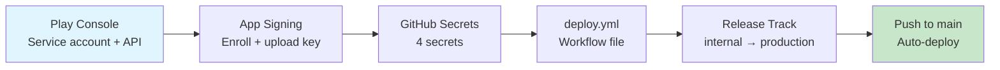

# Blueprint: Android Play Store Deploy

<!--
tags:        [android, play-store, ci-cd, github-actions, signing, flutter]
category:    ci-cd
difficulty:  intermediate
time:        3-4 hours
stack:       [flutter, dart, android, github-actions]
-->

> Set up automated Android builds and Play Store deployment via GitHub Actions, with proper app signing and release track management.

## TL;DR

You'll have a GitHub Actions workflow that builds your Flutter Android app as an App Bundle (AAB), signs it with an upload keystore, and publishes to the Google Play Store automatically on merge to `main` or version tags. Release tracks let you promote from internal testing to production with staged rollouts.

## When to Use

- Deploying a Flutter Android app to Google Play Store
- Setting up CI/CD for any Android app on GitHub Actions
- When you want automated internal/beta/production releases with staged rollouts
- When **not** to use: iOS-only apps (see [iOS TestFlight Deploy](ios-testflight-deploy.md)), local-only builds, or apps distributed outside the Play Store (e.g., F-Droid)

## Prerequisites

- [ ] Google Play Developer account ($25 one-time fee)
- [ ] App created in Google Play Console (package name, store listing draft)
- [ ] GitHub repository
- [ ] Flutter SDK installed locally (for initial keystore setup)

## Overview



## Steps

### 1. Google Play Console setup

**Why**: The CI runner needs a service account with API access to upload builds programmatically. Without this, you'd have to upload every build manually through the web console.

1. Go to [Google Play Console → Setup → API access](https://play.google.com/console/developers/api-access)
2. Click **Create new service account** — this opens Google Cloud Console
3. In Cloud Console:
   - Name the service account (e.g., `ci-play-deploy`)
   - Grant no project-level roles (permissions are set in Play Console)
   - Under **Keys**, click **Add Key → Create new key → JSON** — download the JSON file
4. Back in Play Console, click **Done** on the dialog, then **Grant access** on the new service account
5. Set permission to **Release manager** (under Release section) for your app
6. Ensure your app is created with its package name and has at least a draft store listing

**Expected outcome**: You have a service account JSON key file and the account has Release manager access in Play Console.

### 2. Play App Signing and upload keystore

**Why**: Google Play App Signing separates the upload key (you hold) from the signing key (Google holds). If you lose your upload key, Google can reset it. Without enrollment, losing the keystore means the app is permanently orphaned.

**Enroll in Play App Signing** (strongly recommended):
1. Go to Play Console → your app → **Setup → App signing**
2. Accept the terms — Google now manages the final signing key

**Create an upload keystore** (if you don't already have one):

```bash
keytool -genkey -v \
  -keystore upload-keystore.jks \
  -keyalg RSA -keysize 2048 \
  -validity 10000 \
  -alias upload
```

Enter a password when prompted. Store this keystore file securely outside the repo.

**Encode the keystore for CI**:

```bash
base64 -i upload-keystore.jks | pbcopy   # macOS
base64 -w 0 upload-keystore.jks          # Linux
```

**Configure local signing** in `android/key.properties` (git-ignored):

```properties
storePassword=your-store-password
keyPassword=your-key-password
keyAlias=upload
storeFile=../upload-keystore.jks
```

Ensure `android/app/build.gradle` reads from `key.properties` for release builds:

```groovy
def keystoreProperties = new Properties()
def keystorePropertiesFile = rootProject.file('key.properties')
if (keystorePropertiesFile.exists()) {
    keystoreProperties.load(new FileInputStream(keystorePropertiesFile))
}

android {
    // ...
    signingConfigs {
        release {
            keyAlias keystoreProperties['keyAlias']
            keyPassword keystoreProperties['keyPassword']
            storeFile keystoreProperties['storeFile'] ? file(keystoreProperties['storeFile']) : null
            storePassword keystoreProperties['storePassword']
        }
    }
    buildTypes {
        release {
            signingConfig signingConfigs.release
        }
    }
}
```

**Expected outcome**: You are enrolled in Play App Signing, have an upload keystore encoded in base64, and your Gradle config reads signing properties from a file.

### 3. Configure GitHub Secrets

**Why**: Signing credentials and service account keys must never be in the repo. Secrets are injected at runtime.

Go to repo → Settings → Secrets and variables → Actions, and add:

| Secret | Value | Source |
|--------|-------|--------|
| `KEYSTORE_BASE64` | Base64-encoded `upload-keystore.jks` | Step 2 |
| `KEYSTORE_PASSWORD` | Store password for the keystore | Step 2 |
| `KEY_PASSWORD` | Key password (often same as store password) | Step 2 |
| `PLAY_SERVICE_ACCOUNT_JSON` | Full contents of the service account `.json` file | Step 1 |

**Expected outcome**: 4 secrets configured in GitHub.

### 4. Create the deploy workflow

**Why**: This is the core — decode the keystore on the runner, build the AAB, sign it, and upload to the Play Store via Fastlane supply.

Create `.github/workflows/deploy-android.yml`:

```yaml
name: Deploy to Play Store

on:
  push:
    branches: [main]
    tags: ['v*']

jobs:
  deploy:
    runs-on: ubuntu-latest
    steps:
      - uses: actions/checkout@v4

      - uses: subosito/flutter-action@v2
        with:
          channel: stable
          cache: true

      - uses: ruby/setup-ruby@v1
        with:
          ruby-version: '3.2'
          bundler-cache: true

      - name: Install Fastlane
        run: gem install fastlane

      - name: Install dependencies
        run: flutter pub get

      - name: Decode keystore
        run: |
          echo "${{ secrets.KEYSTORE_BASE64 }}" | base64 --decode > $RUNNER_TEMP/upload-keystore.jks

      - name: Create key.properties
        run: |
          cat > android/key.properties <<EOL
          storePassword=${{ secrets.KEYSTORE_PASSWORD }}
          keyPassword=${{ secrets.KEY_PASSWORD }}
          keyAlias=upload
          storeFile=$RUNNER_TEMP/upload-keystore.jks
          EOL

      - name: Build AAB
        run: |
          flutter build appbundle --release \
            --build-number=${{ github.run_number }}

      - name: Write service account key
        run: |
          echo '${{ secrets.PLAY_SERVICE_ACCOUNT_JSON }}' > $RUNNER_TEMP/service-account.json

      - name: Upload to Play Store (internal track)
        run: |
          fastlane supply \
            --aab build/app/outputs/bundle/release/app-release.aab \
            --track internal \
            --json_key $RUNNER_TEMP/service-account.json \
            --package_name com.yourorg.yourapp \
            --skip_upload_metadata \
            --skip_upload_images \
            --skip_upload_screenshots

      - name: Clean up credentials
        if: always()
        run: |
          rm -f $RUNNER_TEMP/upload-keystore.jks
          rm -f $RUNNER_TEMP/service-account.json
          rm -f android/key.properties
```

Replace `com.yourorg.yourapp` with your actual package name.

**Expected outcome**: Merge to `main` triggers an automatic build and upload to the internal test track.

### 5. Build number strategy

**Why**: The Play Store requires `versionCode` to be strictly increasing. A duplicate or lower value is rejected outright.

```yaml
# In the build step:
flutter build appbundle --release \
  --build-number=${{ github.run_number }}
```

`github.run_number` auto-increments per workflow and never collides. If you need to offset it (e.g., migrating from another CI), use an expression:

```yaml
--build-number=${{ github.run_number + 1000 }}
```

For apps with multiple flavors publishing independently, consider using a timestamp-based version code:

```yaml
--build-number=$(date +%s)
```

**Expected outcome**: Each CI build gets a unique, ascending versionCode that the Play Store accepts.

### 6. Release tracks and staged rollouts

**Why**: Google Play provides multiple release tracks so you can validate with small groups before going wide. Pushing directly to production risks exposing bugs to all users at once.

The track hierarchy:

| Track | Audience | Purpose |
|-------|----------|---------|
| `internal` | Up to 100 internal testers | Smoke testing, fast iteration |
| `alpha` | Closed testing group | QA team validation |
| `beta` | Open testing (opt-in) | Wider pre-release feedback |
| `production` | All users | General availability |

To promote a build between tracks using Fastlane:

```bash
# Promote from internal to beta
fastlane supply \
  --track internal \
  --track_promote_to beta \
  --json_key service-account.json \
  --package_name com.yourorg.yourapp

# Promote to production with 10% staged rollout
fastlane supply \
  --track beta \
  --track_promote_to production \
  --rollout 0.1 \
  --json_key service-account.json \
  --package_name com.yourorg.yourapp
```

Staged rollout percentages: typically `0.01` (1%), `0.05`, `0.1`, `0.25`, `0.5`, `1.0` (full).

**Expected outcome**: You can promote builds through tracks and control rollout percentage.

### 7. Fastlane supply setup (optional full Fastlane integration)

**Why**: If you manage metadata (descriptions, screenshots, changelogs) in the repo, Fastlane supply can upload everything alongside the binary — no manual Play Console editing.

Create `android/fastlane/Fastfile`:

```ruby
default_platform(:android)

platform :android do
  desc "Deploy to internal track"
  lane :deploy_internal do
    supply(
      aab: "../build/app/outputs/bundle/release/app-release.aab",
      track: "internal",
      json_key: ENV["SERVICE_ACCOUNT_JSON_PATH"],
      package_name: "com.yourorg.yourapp",
      skip_upload_metadata: false,
      skip_upload_changelogs: false,
      skip_upload_images: true,
      skip_upload_screenshots: true
    )
  end

  desc "Promote internal to production with staged rollout"
  lane :promote_production do |options|
    supply(
      track: "internal",
      track_promote_to: "production",
      rollout: options[:rollout] || "0.1",
      json_key: ENV["SERVICE_ACCOUNT_JSON_PATH"],
      package_name: "com.yourorg.yourapp"
    )
  end
end
```

Store changelogs in the Fastlane metadata structure:

```
android/fastlane/metadata/android/en-US/
  changelogs/
    <versionCode>.txt     # e.g., 42.txt
  full_description.txt
  short_description.txt
  title.txt
```

Update the workflow to use the Fastfile:

```yaml
- name: Upload to Play Store
  env:
    SERVICE_ACCOUNT_JSON_PATH: ${{ runner.temp }}/service-account.json
  run: |
    cd android && fastlane deploy_internal
```

**Expected outcome**: Metadata and changelogs are managed in version control and uploaded alongside the binary.

## Variants

<details>
<summary><strong>Variant: Gradle Play Publisher (no Fastlane)</strong></summary>

If you prefer a pure Gradle solution without Ruby/Fastlane, use the [Gradle Play Publisher](https://github.com/Triple-T/gradle-play-publisher) plugin:

In `android/app/build.gradle`:

```groovy
plugins {
    id 'com.github.triplet.play' version '3.9.0'
}

play {
    serviceAccountCredentials.set(file(System.getenv("SERVICE_ACCOUNT_JSON_PATH") ?: "/dev/null"))
    track.set("internal")
    defaultToAppBundles.set(true)
}
```

Then replace the upload step in the workflow:

```yaml
- name: Upload to Play Store
  env:
    SERVICE_ACCOUNT_JSON_PATH: ${{ runner.temp }}/service-account.json
  run: |
    cd android && ./gradlew publishReleaseBundle
```

This removes the Ruby/Fastlane dependency entirely. Tradeoff: less flexibility for metadata and screenshot management.

</details>

<details>
<summary><strong>Variant: Local CLI upload (no CI)</strong></summary>

For manual Play Store uploads from your machine:

```bash
flutter clean && flutter pub get
flutter build appbundle --release

fastlane supply \
  --aab build/app/outputs/bundle/release/app-release.aab \
  --track internal \
  --json_key ~/path/to/service-account.json \
  --package_name com.yourorg.yourapp
```

Local builds use the keystore referenced in `key.properties` directly.

</details>

<details>
<summary><strong>Variant: Multiple flavors (dev, staging, production)</strong></summary>

For apps with multiple flavors, build and upload each flavor separately:

```yaml
- name: Build production AAB
  run: |
    flutter build appbundle --release \
      --flavor production \
      --build-number=${{ github.run_number }}

- name: Upload production to Play Store
  run: |
    fastlane supply \
      --aab build/app/outputs/bundle/productionRelease/app-production-release.aab \
      --track internal \
      --json_key $RUNNER_TEMP/service-account.json \
      --package_name com.yourorg.yourapp
```

Note: each flavor's AAB is in a different output directory — `bundle/<flavor>Release/`.

</details>

## Gotchas

> **versionCode must be strictly increasing**: The Play Store rejects any upload where the versionCode is equal to or lower than the current highest. This applies across all tracks. **Fix**: Use `github.run_number` and never manually set a lower value. If migrating CI systems, add an offset.

> **Upload keystore lost = app permanently orphaned**: If you lose the upload keystore and are NOT enrolled in Play App Signing, you can never update the app again. **Fix**: Enroll in Play App Signing immediately — Google holds the final signing key and can reset your upload key if lost. Back up the keystore in a secure vault regardless.

> **Service account needs Release manager permission**: A service account with only "Viewer" or "Editor" access cannot upload builds. The API returns a generic 403 that doesn't explain why. **Fix**: In Play Console → Users and permissions, grant the service account "Release manager" permission specifically for your app.

> **AAB required for new apps**: Since August 2021, Google Play rejects APK uploads for new apps. Existing apps that previously uploaded APKs are grandfathered but should migrate. **Fix**: Always use `flutter build appbundle`, never `flutter build apk`, for Play Store distribution.

> **Staged rollout halted on crash spike**: Google automatically halts a staged rollout if the crash rate exceeds a threshold (typically 1-2% above baseline). You'll get no notification in CI — only in the Play Console. **Fix**: Monitor the Play Console vitals dashboard after each rollout increase. Fix crashes before resuming.

> **First upload must be done manually**: The Play Store API cannot upload the very first AAB for a new app. You must upload the first build through the Play Console web UI. **Fix**: Upload the first build manually, then all subsequent builds can use the CI pipeline.

> **key.properties must be git-ignored**: If committed, your keystore passwords are in version history forever. **Fix**: Add `android/key.properties` to `.gitignore` before the first commit. If already committed, rotate all passwords and use `git filter-repo` to purge history.

## Checklist

- [ ] App created in Google Play Console with package name
- [ ] Service account created with Release manager permission
- [ ] Enrolled in Play App Signing
- [ ] Upload keystore generated and base64-encoded
- [ ] 4 GitHub Secrets configured (`KEYSTORE_BASE64`, `KEYSTORE_PASSWORD`, `KEY_PASSWORD`, `PLAY_SERVICE_ACCOUNT_JSON`)
- [ ] `android/key.properties` added to `.gitignore`
- [ ] `build.gradle` reads from `key.properties` for release signing
- [ ] `deploy-android.yml` workflow created
- [ ] Build number uses `github.run_number`
- [ ] Credential cleanup step with `if: always()`
- [ ] First AAB uploaded manually through Play Console
- [ ] Second push to `main` triggers a successful automated upload

## Artifacts

| Artifact | Location | Description |
|----------|----------|-------------|
| Deploy workflow | `.github/workflows/deploy-android.yml` | Automated Play Store deployment |
| Fastlane config | `android/fastlane/Fastfile` | Lane definitions for upload and promotion |
| Signing config | `android/key.properties` | Keystore references (git-ignored) |
| Fastlane metadata | `android/fastlane/metadata/android/` | Store listing text and changelogs |

## References

- [Google Play — App signing](https://support.google.com/googleplay/android-developer/answer/9842756) — Play App Signing enrollment and key management
- [Google Play — API access](https://developers.google.com/android-publisher/getting_started) — service account setup for the Publishing API
- [Fastlane supply](https://docs.fastlane.tools/actions/supply/) — automated Play Store uploads and metadata
- [Gradle Play Publisher](https://github.com/Triple-T/gradle-play-publisher) — pure Gradle alternative to Fastlane
- [Flutter — Build and release an Android app](https://docs.flutter.dev/deployment/android) — official Flutter deployment guide
- [iOS TestFlight Deploy](ios-testflight-deploy.md) — companion blueprint for iOS
- [GitHub Actions for Flutter](github-actions-flutter.md) — PR checks companion
