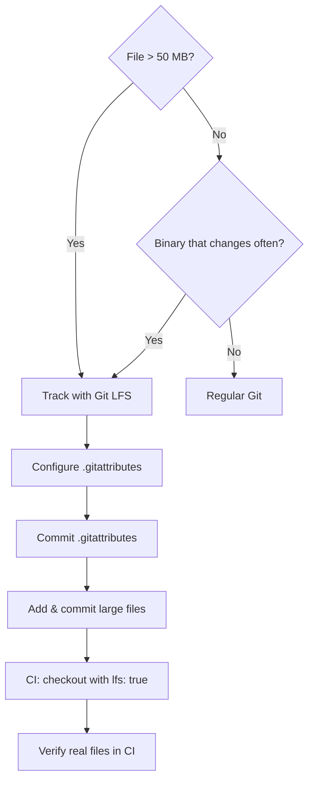

# Blueprint: Git LFS in CI

<!--
tags:        [git-lfs, ci, github-actions, large-files, gitattributes]
category:    ci-cd
difficulty:  beginner
time:        20 min
stack:       [git, github-actions]
-->

> Configure Git LFS so large binary files are tracked correctly in your repo and actually downloaded (not pointer files) in CI.

## TL;DR

You'll have `.gitattributes` tracking your large files with Git LFS, and every CI workflow step will check out real binaries instead of 130-byte pointer stubs. No more mysterious build failures from missing assets.

## When to Use

- Your repo contains files over 50 MB (databases, ML models, compiled assets, media)
- You see GitHub warnings about large file pushes
- CI builds fail with cryptic errors because binaries are actually LFS pointer files
- When **not** to use: if all your large files are fetched at build time from an external store (S3, GCS, artifact registry) -- LFS is for files that live in the repo

## Prerequisites

- [ ] Git 2.x installed
- [ ] GitHub repository (or GitLab / other host with LFS support)
- [ ] Admin access to configure CI workflows

## Overview



## Steps

### 1. Install Git LFS

**Why**: Git LFS is a separate binary that extends Git. It must be installed once per machine and once per repo clone.

```bash
# macOS
brew install git-lfs

# Ubuntu / Debian
sudo apt-get install git-lfs

# Then initialize LFS hooks in your user config (one-time)
git lfs install
```

**Expected outcome**: `git lfs install` prints `Git LFS initialized`.

### 2. Decide what to track

**Why**: Not everything belongs in LFS. Tracking the wrong files adds latency and burns bandwidth quota.

Rules of thumb:

| Track with LFS | Keep in regular Git |
|---|---|
| Binary files > 10 MB (databases, models, images) | Source code, config, text |
| Any file > 50 MB (GitHub will block pushes > 100 MB) | Small generated files that change often |
| Large files that rarely change (fonts, trained models) | Files fetched from external stores at build time |

Real-world example from a production project:

| Pattern | Size | Reason |
|---|---|---|
| `assets/corpus.db` | ~68 MB | SQLite database, too large for regular Git |
| `assets/model/*.onnx` | ~113 MB | ML model weights |
| `assets/model/spm_vocab.tsv` | ~7.4 MB | Vocabulary file, binary-like content |

### 3. Configure .gitattributes

**Why**: `.gitattributes` tells Git which files LFS should manage. This file must be committed **before** you add the large files, otherwise Git stores them as regular objects first.

```bash
# Track specific patterns
git lfs track "assets/corpus.db"
git lfs track "assets/model/*.onnx"
git lfs track "assets/model/spm_vocab.tsv"

# Or track by extension
git lfs track "*.onnx"
git lfs track "*.db"
```

This creates or updates `.gitattributes`:

```gitattributes
assets/corpus.db filter=lfs diff=lfs merge=lfs -text
assets/model/*.onnx filter=lfs diff=lfs merge=lfs -text
assets/model/spm_vocab.tsv filter=lfs diff=lfs merge=lfs -text
```

Verify the tracking rules:

```bash
git lfs track
```

**Expected outcome**: Lists all tracked patterns.

### 4. Add files and commit

**Why**: Order matters. Commit `.gitattributes` first (or at least in the same commit) so Git knows to route files through LFS.

```bash
# Stage .gitattributes first
git add .gitattributes
git commit -m "chore: configure Git LFS tracking"

# Now add the large files
git add assets/corpus.db assets/model/
git commit -m "chore: add LFS-tracked assets"

# Push (LFS objects are uploaded to the LFS store automatically)
git push
```

**Expected outcome**: `git push` shows LFS upload progress for large files.

### 5. Configure CI checkout with `lfs: true`

**Why**: This is the critical step. By default, `actions/checkout` does **not** download LFS objects. You get 130-byte pointer files that look like:

```
version https://git-lfs.github.com/spec/v1
oid sha256:4d7a214614...
size 71340032
```

Your build then fails because it tries to read a pointer as a real database/model.

```yaml
# .github/workflows/ci.yml
name: CI

on:
  push:
    branches: [main]
  pull_request:

jobs:
  build:
    runs-on: ubuntu-latest
    steps:
      - uses: actions/checkout@v4
        with:
          lfs: true          # <-- THIS IS REQUIRED

      # All subsequent steps now have real binary files
      - name: Verify LFS files
        run: |
          git lfs ls-files
          file assets/corpus.db   # Should show "SQLite", not "ASCII text"
```

> **Every** `actions/checkout` step across **all** workflows must include `lfs: true`. One missed checkout and that job gets pointer files.

**Expected outcome**: `git lfs ls-files` in CI shows your tracked files with checkmarks. `file` commands identify the real file types.

### 6. Verify LFS is working

**Why**: Silent failures are the whole problem with LFS in CI. Add an explicit check.

```yaml
      - name: Verify LFS checkout
        run: |
          # Fail fast if any LFS file is still a pointer
          git lfs fsck --pointers
          # Double-check a known file
          if head -c 40 assets/corpus.db | grep -q "version https://git-lfs"; then
            echo "ERROR: corpus.db is a pointer file, not the real binary"
            exit 1
          fi
```

**Expected outcome**: Step passes silently. If you ever break LFS config, this step catches it immediately.

## Variants

<details>
<summary><strong>Variant: GitLab CI</strong></summary>

GitLab CI runners fetch LFS objects by default if the runner is configured with LFS support. To be explicit:

```yaml
# .gitlab-ci.yml
variables:
  GIT_LFS_SKIP_SMUDGE: "0"   # Ensure LFS files are downloaded (default)

build:
  script:
    - git lfs ls-files
    - file assets/corpus.db
```

To skip LFS download for jobs that don't need large files (faster):

```yaml
lint:
  variables:
    GIT_LFS_SKIP_SMUDGE: "1"  # Skip LFS, only get pointers
  script:
    - flutter analyze
```

</details>

<details>
<summary><strong>Variant: Self-hosted runners</strong></summary>

Self-hosted runners need Git LFS installed on the machine itself:

```bash
# On the runner machine
sudo apt-get install git-lfs
git lfs install --system   # System-wide, not per-user
```

If using Docker-based runners, add to the Dockerfile:

```dockerfile
RUN apt-get update && apt-get install -y git-lfs && git lfs install
```

The `actions/checkout` `lfs: true` flag still applies -- it tells the action to run `git lfs pull` after checkout.

</details>

## Gotchas

> **Pointer files in CI**: The most common trap. Everything works locally because you have LFS installed, but CI silently checks out 130-byte pointer files. Builds fail with confusing errors (corrupt database, invalid model, etc.). **Fix**: Add `lfs: true` to every `actions/checkout` step and add a verification step.

> **LFS bandwidth limits**: GitHub Free includes 1 GB/month of LFS bandwidth and 1 GB of storage. CI runs consume bandwidth on every checkout. **Fix**: Monitor usage at `github.com/<org>/<repo>/settings` > Git LFS. Consider caching LFS objects between runs with `actions/cache`, or upgrade to GitHub Pro/Enterprise for higher limits.

> **Forgetting `git lfs install` on new machines**: Cloning a repo with LFS-tracked files on a machine without LFS installed gives you pointer files with no warning. **Fix**: Add a check to your project's setup script: `git lfs version || echo "Install Git LFS: https://git-lfs.com"`.

> **.gitattributes must be committed BEFORE adding large files**: If you add a 100 MB file, then add `.gitattributes` tracking it, the file is already stored as a regular Git object. LFS only intercepts at `git add` time. **Fix**: Always commit `.gitattributes` first. To fix retroactively, use `git lfs migrate import --include="pattern"` to rewrite history.

> **LFS and shallow clones**: `actions/checkout` defaults to `fetch-depth: 1` (shallow clone). This works fine with `lfs: true`, but if you also set `fetch-depth: 0` for full history, LFS download time increases significantly. **Fix**: Only fetch full history when you actually need it.

## Checklist

- [ ] `git lfs install` run on local machine
- [ ] `.gitattributes` committed with correct tracking patterns
- [ ] Large files show in `git lfs ls-files` output
- [ ] Every `actions/checkout` in every workflow has `lfs: true`
- [ ] CI includes a verification step for LFS files
- [ ] LFS bandwidth usage is within GitHub plan limits

## Artifacts

| Artifact | Location | Description |
|----------|----------|-------------|
| LFS tracking config | `.gitattributes` | Defines which file patterns are managed by LFS |
| CI workflow | `.github/workflows/ci.yml` | Checkout step with `lfs: true` |

## References

- [Git LFS documentation](https://git-lfs.com) -- official docs and installation guide
- [actions/checkout LFS option](https://github.com/actions/checkout#usage) -- `lfs` parameter reference
- [GitHub LFS billing](https://docs.github.com/en/repositories/working-with-files/managing-large-files/about-storage-and-bandwidth-usage) -- storage and bandwidth limits
- [git lfs migrate](https://github.com/git-lfs/git-lfs/blob/main/docs/man/git-lfs-migrate.adoc) -- retroactively move files into LFS
