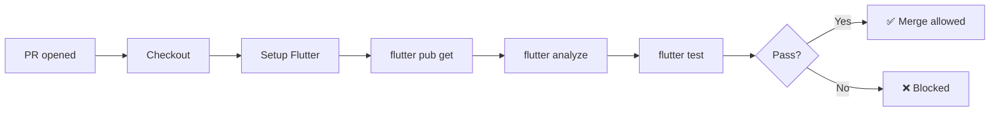

# Blueprint: GitHub Actions for Flutter

<!--
tags:        [flutter, github-actions, ci, testing, linting]
category:    ci-cd
difficulty:  beginner
time:        30 min
stack:       [flutter, dart, github-actions]
-->

> Set up GitHub Actions to run Flutter analysis and tests on every pull request.

## TL;DR

You'll have a CI workflow that runs `flutter analyze` and `flutter test` on every PR, with dependency caching for fast builds. Merge is blocked if checks fail.

## When to Use

- Any Flutter project hosted on GitHub
- When **not** to use: if you use GitLab, Bitrise, or Codemagic (adapt the concepts)

## Prerequisites

- [ ] Flutter project with `pubspec.yaml`
- [ ] GitHub repository
- [ ] At least one test in `test/`

## Overview



## Steps

### 1. Create the CI workflow

**Why**: Automated checks catch issues before human review, saving everyone's time.

Create `.github/workflows/ci.yml`:

```yaml
name: CI

on:
  pull_request:
    branches: [main]
  push:
    branches: [main]

concurrency:
  group: ci-${{ github.ref }}
  cancel-in-progress: true

jobs:
  check:
    runs-on: ubuntu-latest
    steps:
      - uses: actions/checkout@v4

      - uses: subosito/flutter-action@v2
        with:
          channel: stable
          cache: true

      - name: Install dependencies
        run: flutter pub get

      - name: Analyze
        run: flutter analyze --fatal-infos

      - name: Run tests
        run: flutter test
```

**Key details**:
- `concurrency` cancels outdated runs when you push again — saves CI minutes
- `cache: true` on `flutter-action` caches the Flutter SDK between runs
- `--fatal-infos` makes info-level lint issues fail the build (strict mode)

**Expected outcome**: PRs show a check status. Green = safe to merge.

### 2. Add dependency caching

**Why**: `flutter pub get` downloads packages every run. Caching cuts ~30s per build.

```yaml
      - uses: actions/cache@v4
        with:
          path: |
            ~/.pub-cache
            .dart_tool
          key: pub-${{ hashFiles('pubspec.lock') }}
          restore-keys: pub-
```

Add this step **before** `flutter pub get`.

**Expected outcome**: Second run is noticeably faster.

### 3. Add code generation step (if needed)

**Why**: Projects using Drift, Freezed, or json_serializable need generated code before analysis and tests run.

```yaml
      - name: Code generation
        run: dart run build_runner build --delete-conflicting-outputs
```

Add this step **after** `flutter pub get` and **before** `flutter analyze`.

> **Decision**: Only add this if your project uses `build_runner`. It adds ~20-40s to the build.

**Expected outcome**: Generated `.g.dart` and `.freezed.dart` files are present for analysis.

### 4. Enable branch protection

**Why**: Without branch protection, developers can merge PRs that skip CI.

1. Go to repo → Settings → Branches → Add rule
2. Branch name pattern: `main`
3. Check **Require status checks to pass before merging**
4. Select the `check` job
5. Check **Require branches to be up to date before merging**

**Expected outcome**: The "Merge" button is disabled until CI passes.

### 5. (Optional) Add coverage reporting

**Why**: Track test coverage trends over time.

```yaml
      - name: Run tests with coverage
        run: flutter test --coverage

      - name: Upload coverage
        uses: codecov/codecov-action@v4
        with:
          file: coverage/lcov.info
          token: ${{ secrets.CODECOV_TOKEN }}
```

**Expected outcome**: Coverage badge and PR comments showing coverage diff.

## Variants

<details>
<summary><strong>Variant: Monorepo with multiple packages</strong></summary>

Use a matrix to test each package:

```yaml
jobs:
  check:
    runs-on: ubuntu-latest
    strategy:
      matrix:
        package: [packages/core, packages/app, packages/api]
    steps:
      - uses: actions/checkout@v4
      - uses: subosito/flutter-action@v2
        with:
          channel: stable
          cache: true
      - run: cd ${{ matrix.package }} && flutter pub get
      - run: cd ${{ matrix.package }} && flutter analyze
      - run: cd ${{ matrix.package }} && flutter test
```

</details>

<details>
<summary><strong>Variant: With Git LFS assets</strong></summary>

If your project uses Git LFS (large DB files, models, etc.):

```yaml
      - uses: actions/checkout@v4
        with:
          lfs: true
```

See [Git LFS in CI](git-lfs-in-ci.md) for full details.

</details>

## Gotchas

> **Missing `lfs: true` on checkout**: If your project uses Git LFS, the checkout gets pointer files instead of actual binaries. Tests pass locally but fail on CI with obscure errors. **Fix**: Add `lfs: true` to the checkout step.

> **`flutter analyze` passes but `--fatal-infos` fails**: By default, `flutter analyze` only fails on errors and warnings. Adding `--fatal-infos` is stricter — existing info-level issues will block the build. **Fix**: Run `dart fix --apply` first, or add `--no-fatal-infos` to start lenient and tighten later.

> **Pub cache invalidation**: If the cache key doesn't include `pubspec.lock`, you may get stale dependencies after updating packages. **Fix**: Always use `hashFiles('pubspec.lock')` in the cache key.

> **`concurrency` kills long-running jobs**: If you push frequently, `cancel-in-progress: true` cancels the previous run. This is usually fine for CI, but don't use it for deploy workflows.

## Checklist

- [ ] `.github/workflows/ci.yml` exists
- [ ] Runs on `pull_request` and `push` to `main`
- [ ] Flutter SDK cached (`cache: true`)
- [ ] Pub dependencies cached
- [ ] `flutter analyze` with `--fatal-infos`
- [ ] `flutter test` passes
- [ ] Code generation step added (if using build_runner)
- [ ] Branch protection enabled on `main`

## Artifacts

| Artifact | Location | Description |
|----------|----------|-------------|
| CI workflow | `.github/workflows/ci.yml` | PR checks: analyze + test |

## References

- [GitHub Actions for Flutter](https://docs.flutter.dev/deployment/cd#github-actions)
- [subosito/flutter-action](https://github.com/subosito/flutter-action)
- [iOS TestFlight Deploy](ios-testflight-deploy.md) — deploy companion
- [Git LFS in CI](git-lfs-in-ci.md) — if using large assets
