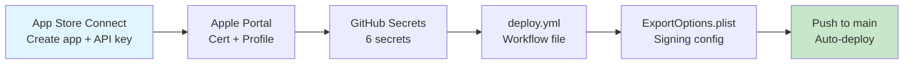

# Blueprint: iOS TestFlight Deploy

<!--
tags:        [ios, testflight, ci-cd, github-actions, signing, certificates, flutter]
category:    ci-cd
difficulty:  advanced
time:        2-4 hours
stack:       [flutter, github-actions, xcode, apple]
-->

> Set up automated iOS builds and TestFlight deployment via GitHub Actions, with proper code signing on CI runners.

## TL;DR

You'll have a GitHub Actions workflow that builds your Flutter iOS app, signs it with manual signing on the CI runner, and uploads to TestFlight automatically on merge to `main` or version tags.

## When to Use

- Deploying a Flutter iOS app to TestFlight
- Setting up CI/CD for any iOS app on GitHub Actions
- When **not** to use: Android-only apps, local-only builds (see the CLI variant below)

## Prerequisites

- [ ] Apple Developer account ($99/year)
- [ ] App created in App Store Connect (bundle ID, SKU, name)
- [ ] GitHub repository
- [ ] Xcode installed locally (for initial certificate setup)

## Overview



## Steps

### 1. Create the App Store Connect API key

**Why**: The CI runner needs API authentication to upload builds. This replaces the deprecated `xcrun altool` approach.

1. Go to [App Store Connect → Users and Access → Integrations → Team Keys](https://appstoreconnect.apple.com/access/integrations/api)
2. Click **Generate API Key**
3. Name: `CI` / Access: `App Manager`
4. Download the `.p8` file — **you can only download it once**

Save these three values:
- **Key ID** (e.g., `UHSNF9H5U6`)
- **Issuer ID** (UUID on the same page)
- **Key file contents** (the `.p8` file text)

**Expected outcome**: You have a `.p8` file and two IDs.

### 2. Create the distribution certificate and provisioning profile

**Why**: CI runners don't have an Apple account — they need an explicit certificate and profile to sign the app.

**Certificate**:
1. Open **Keychain Access** on your Mac
2. Find `Apple Distribution: Your Name (TEAM_ID)` in "My Certificates"
3. Right-click → **Export** → save as `.p12` with a **simple alphanumeric password**
4. Encode it: `base64 -i cert.p12 | pbcopy`

**Provisioning Profile**:
1. Go to [developer.apple.com → Certificates, IDs & Profiles → Profiles](https://developer.apple.com/account/resources/profiles/list)
2. Create new → **App Store Distribution**
3. Select your bundle ID + your Distribution certificate
4. Download the `.mobileprovision` file
5. Encode it: `base64 -i profile.mobileprovision | pbcopy`

**Expected outcome**: You have a base64-encoded cert and profile, plus a p12 password.

### 3. Configure GitHub Secrets

**Why**: Signing credentials must never be in the repo. Secrets are injected at runtime.

Go to repo → Settings → Secrets and variables → Actions, and add:

| Secret | Value | Source |
|--------|-------|--------|
| `APP_STORE_CONNECT_KEY` | Contents of the `.p8` file | Step 1 |
| `APP_STORE_CONNECT_KEY_ID` | Key ID (e.g., `UHSNF9H5U6`) | Step 1 |
| `APP_STORE_CONNECT_ISSUER_ID` | Issuer UUID | Step 1 |
| `BUILD_CERTIFICATE_BASE64` | Base64-encoded `.p12` | Step 2 |
| `P12_PASSWORD` | Password used when exporting `.p12` | Step 2 |
| `BUILD_PROVISION_PROFILE_BASE64` | Base64-encoded `.mobileprovision` | Step 2 |

**Expected outcome**: 6 secrets configured in GitHub.

### 4. Create ExportOptions.plist

**Why**: Tells `xcodebuild` how to sign and package the archive for App Store upload.

Create `ios/ExportOptions.plist`:

```xml
<?xml version="1.0" encoding="UTF-8"?>
<!DOCTYPE plist PUBLIC "-//Apple//DTD PLIST 1.0//EN"
  "http://www.apple.com/DTDs/PropertyList-1.0.dtd">
<plist version="1.0">
<dict>
    <key>method</key>
    <string>app-store-connect</string>
    <key>signingStyle</key>
    <string>manual</string>
    <key>teamID</key>
    <string>YOUR_TEAM_ID</string>
    <key>provisioningProfiles</key>
    <dict>
        <key>com.yourorg.yourapp</key>
        <string>Your Profile Name</string>
    </dict>
</dict>
</plist>
```

Replace `YOUR_TEAM_ID`, bundle ID, and profile name with your values.

**Expected outcome**: `ios/ExportOptions.plist` committed to the repo.

### 5. Create the deploy workflow

**Why**: This is the core — install signing credentials on the macOS runner, build, sign, and upload.

Create `.github/workflows/deploy.yml`:

```yaml
name: Deploy to TestFlight

on:
  push:
    branches: [main]
    tags: ['v*']

jobs:
  deploy:
    runs-on: macos-latest
    steps:
      - uses: actions/checkout@v4

      - uses: subosito/flutter-action@v2
        with:
          channel: stable
          cache: true

      - name: Install dependencies
        run: flutter pub get

      - name: Write API key file
        run: |
          echo "${{ secrets.APP_STORE_CONNECT_KEY }}" > $RUNNER_TEMP/AuthKey.p8

      - name: Install certificate and provisioning profile
        env:
          BUILD_CERTIFICATE_BASE64: ${{ secrets.BUILD_CERTIFICATE_BASE64 }}
          P12_PASSWORD: ${{ secrets.P12_PASSWORD }}
          BUILD_PROVISION_PROFILE_BASE64: ${{ secrets.BUILD_PROVISION_PROFILE_BASE64 }}
        run: |
          CERT_PATH=$RUNNER_TEMP/build_certificate.p12
          PP_PATH=$RUNNER_TEMP/build_pp.mobileprovision
          KEYCHAIN_PATH=$RUNNER_TEMP/app-signing.keychain-db

          echo -n "$BUILD_CERTIFICATE_BASE64" | base64 --decode -o $CERT_PATH
          echo -n "$BUILD_PROVISION_PROFILE_BASE64" | base64 --decode -o $PP_PATH

          security create-keychain -p "" $KEYCHAIN_PATH
          security set-keychain-settings -lut 21600 $KEYCHAIN_PATH
          security unlock-keychain -p "" $KEYCHAIN_PATH
          security import $CERT_PATH -P "$P12_PASSWORD" -A -t cert -f pkcs12 -k $KEYCHAIN_PATH
          security set-key-partition-list -S apple-tool:,apple: -k "" $KEYCHAIN_PATH
          security list-keychain -d user -s $KEYCHAIN_PATH

          mkdir -p ~/Library/MobileDevice/Provisioning\ Profiles
          cp $PP_PATH ~/Library/MobileDevice/Provisioning\ Profiles/

      - name: Build iOS (no codesign)
        run: |
          flutter build ios --release --no-codesign \
            --build-number=${{ github.run_number }}

      - name: Archive and export
        run: |
          xcodebuild archive \
            -workspace ios/Runner.xcworkspace \
            -scheme Runner \
            -configuration Release \
            -archivePath build/ios/archive/Runner.xcarchive \
            CODE_SIGN_STYLE=Manual \
            CODE_SIGN_IDENTITY="Apple Distribution" \
            DEVELOPMENT_TEAM=${{ vars.TEAM_ID }} \
            -allowProvisioningUpdates

          xcodebuild -exportArchive \
            -archivePath build/ios/archive/Runner.xcarchive \
            -exportOptionsPlist ios/ExportOptions.plist \
            -exportPath build/ios/ipa \
            -allowProvisioningUpdates \
            -authenticationKeyPath $RUNNER_TEMP/AuthKey.p8 \
            -authenticationKeyID ${{ secrets.APP_STORE_CONNECT_KEY_ID }} \
            -authenticationKeyIssuerID ${{ secrets.APP_STORE_CONNECT_ISSUER_ID }}

      - name: Clean up keychain
        if: always()
        run: security delete-keychain $RUNNER_TEMP/app-signing.keychain-db
```

> **Decision**: Use `flutter build ios --no-codesign` + `xcodebuild archive` instead of `flutter build ipa`. The latter ignores CLI signing overrides and fails on CI.

**Expected outcome**: Merge to `main` → automatic TestFlight build.

### 6. Set up build number strategy

**Why**: TestFlight rejects duplicate build numbers. Auto-increment avoids collisions.

```yaml
# In the build step:
flutter build ios --release --no-codesign \
  --build-number=${{ github.run_number }}
```

`github.run_number` auto-increments per workflow, never collides.

**Expected outcome**: Each CI build gets a unique, ascending build number.

## Variants

<details>
<summary><strong>Variant: Local CLI upload (no CI)</strong></summary>

For manual TestFlight uploads from your Mac:

```bash
flutter clean && flutter pub get
cd ios && pod install --repo-update && cd ..
flutter build ipa --release

xcodebuild -exportArchive \
  -archivePath build/ios/archive/Runner.xcarchive \
  -exportOptionsPlist ios/ExportOptions.plist \
  -exportPath build/ios/export \
  -allowProvisioningUpdates \
  -authenticationKeyPath ~/.appstoreconnect/private_keys/AuthKey_KEYID.p8 \
  -authenticationKeyID KEYID \
  -authenticationKeyIssuerID ISSUER_UUID
```

Local builds can use `automatic` signing style since your Mac has an Apple account.

</details>

<details>
<summary><strong>Variant: App Store Connect API key auth (no cert/profile)</strong></summary>

If you only need 3 secrets instead of 6, use API key authentication with automatic signing:
- `APP_STORE_CONNECT_KEY`, `APP_STORE_CONNECT_KEY_ID`, `APP_STORE_CONNECT_ISSUER_ID`
- Add `-allowProvisioningUpdates` to let Xcode manage profiles via the API key
- Requires the API key to have **Profiles** permission

This is simpler but less reliable — some edge cases fail without explicit profiles.

</details>

## Gotchas

> **`flutter build ipa` ignores CLI signing overrides**: The command reads `CODE_SIGN_STYLE` from `project.pbxproj`. If set to `Automatic`, the CI runner fails because it has no Apple account. **Fix**: Use `flutter build ios --no-codesign` + `xcodebuild archive` with manual signing overrides. Never modify pbxproj for CI — it breaks local builds.

> **P12 password special characters**: If the `.p12` password contains `$`, `"`, or `\`, bash interprets them in the CI runner. **Fix**: Always use a simple alphanumeric password when exporting the certificate.

> **`SecKeychainItemImport` error**: Means the P12_PASSWORD doesn't match the certificate. **Fix**: Re-export the certificate from Keychain Access with a fresh password, re-encode to base64, and update both secrets.

> **Provisioning Profiles path has a space**: The path is `~/Library/MobileDevice/Provisioning Profiles/` (with a space). Missing the escaped space causes "no provisioning profile found" errors.

> **`xcrun altool` is deprecated**: Use `xcodebuild -exportArchive` with API key auth flags instead.

> **Always clean up the keychain**: Add a `security delete-keychain` step with `if: always()` to prevent credential leaks on shared runners.

## Checklist

- [ ] App exists in App Store Connect
- [ ] API key `.p8` downloaded and saved
- [ ] Distribution certificate exported as `.p12` (alphanumeric password)
- [ ] Provisioning profile created and downloaded
- [ ] 6 GitHub Secrets configured
- [ ] `ExportOptions.plist` committed to `ios/`
- [ ] `deploy.yml` workflow created
- [ ] Build number uses `github.run_number`
- [ ] Keychain cleanup step with `if: always()`
- [ ] First push to `main` triggers a successful TestFlight upload

## Artifacts

| Artifact | Location | Description |
|----------|----------|-------------|
| Deploy workflow | `.github/workflows/deploy.yml` | Automated TestFlight deployment |
| Export options | `ios/ExportOptions.plist` | Manual signing configuration for CI |

## References

- [Apple — Distributing your app for beta testing](https://developer.apple.com/documentation/xcode/distributing-your-app-for-beta-testing-and-releases)
- [GitHub — Installing an Apple certificate on macOS runners](https://docs.github.com/en/actions/deployment/deploying-xcode-applications/installing-an-apple-certificate-on-macos-runners-for-xcode-development)
- [Flutter Project Kickoff](../project-setup/flutter-project-kickoff.md) — companion blueprint
- [GitHub Actions for Flutter](github-actions-flutter.md) — PR checks companion
