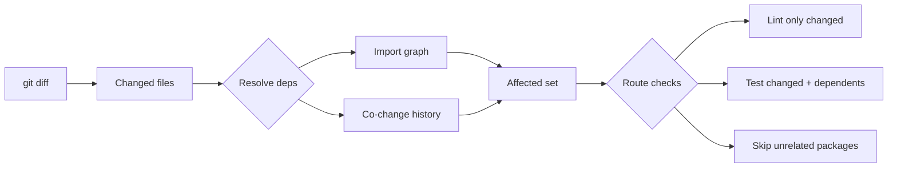

# Blueprint: Targeted CI Checks

<!--
tags:        [ci, testing, performance, git, linting, hooks]
category:    ci-cd
difficulty:  intermediate
time:        1-2 hours
stack:       [github-actions, flutter, dart]
-->

> Run linters, tests, and checks only on changed files and their dependencies — not the entire codebase.

## TL;DR

You'll have a CI pipeline and commit hooks that detect which files changed, resolve their dependency graph, and run only the relevant linters and tests. A 2-minute full-suite CI drops to 20 seconds on a focused change.

## When to Use

- Monorepos or projects with multiple independent packages/features
- CI pipelines that take too long because they run everything on every commit
- Pre-commit hooks that are slow and get skipped (`--no-verify`)
- When **not** to use: tiny projects (< 50 files) where full runs take under 30 seconds

## Prerequisites

- [ ] Git-based workflow (diff detection requires git)
- [ ] Clear dependency structure (imports resolvable statically)
- [ ] CI system with conditional job support (GitHub Actions, GitLab CI)

## Overview



## Steps

### 1. Detect changed files from git

**Why**: Everything starts from knowing what actually changed. The diff source depends on context: commit hook sees staged files, CI sees the PR diff against base branch.

```bash
# Pre-commit hook: staged files only
git diff --cached --name-only --diff-filter=d

# CI (GitHub Actions): PR diff against base
git diff --name-only origin/main...HEAD

# CI: last commit only (push to main)
git diff --name-only HEAD~1
```

For GitHub Actions, use a dedicated action:

```yaml
- uses: tj-actions/changed-files@v45
  id: changed
  with:
    files_yaml: |
      dart:
        - '**/*.dart'
      config:
        - 'pubspec.yaml'
        - 'analysis_options.yaml'
        - 'build.yaml'
      ci:
        - '.github/**'
```

**Expected outcome**: A list of changed file paths, filterable by type.

### 2. Build the affected set (dependency resolution)

**Why**: If you changed `lib/core/models/user.dart`, you need to test not just that file, but everything that imports it. Conversely, `lib/features/settings/` doesn't need re-testing if it has zero dependency on the changed file.

**Strategy: static import analysis**

```bash
# Dart: find all files that import a changed file (direct + transitive)
# Using dart_dependency_resolver or a simple grep-based approach

#!/bin/bash
# scripts/resolve_affected.sh
CHANGED_FILES="$@"
AFFECTED="$CHANGED_FILES"

for file in $CHANGED_FILES; do
  # Find direct importers (files that import this file)
  basename=$(echo "$file" | sed 's|lib/||')
  importers=$(grep -rl "import.*$basename" lib/ test/ || true)
  AFFECTED="$AFFECTED $importers"
done

# Deduplicate
echo "$AFFECTED" | tr ' ' '\n' | sort -u
```

For Dart/Flutter projects, a more robust approach:

```dart
// tools/affected_files.dart
// Uses package:analyzer to resolve the full import graph
import 'package:analyzer/dart/analysis/analysis_context_collection.dart';

/// Given a set of changed files, returns all files that
/// transitively depend on them (the "blast radius").
Set<String> resolveAffected(Set<String> changed, String projectRoot) {
  final collection = AnalysisContextCollection(
    includedPaths: [projectRoot],
  );
  final affected = <String>{...changed};
  var frontier = changed.toSet();

  while (frontier.isNotEmpty) {
    final nextFrontier = <String>{};
    for (final ctx in collection.contexts) {
      for (final file in ctx.contextRoot.analyzedFiles()) {
        if (affected.contains(file)) continue;
        final result = ctx.currentSession.getParsedUnit(file);
        final imports = result.unit.directives
            .whereType<ImportDirective>()
            .map((d) => d.uri.stringValue)
            .whereType<String>();
        if (imports.any((i) => frontier.any((f) => f.endsWith(i)))) {
          affected.add(file);
          nextFrontier.add(file);
        }
      }
    }
    frontier = nextFrontier;
  }
  return affected;
}
```

> **Decision**: If your project is small (< 200 files), the grep approach works fine. For larger projects or monorepos, invest in a proper import graph tool.

**Expected outcome**: From 3 changed files, you get the full list of 12 affected files (direct + transitive dependents).

### 3. Route linting to changed files only

**Why**: Linters don't need to analyze the full codebase. They work file-by-file. Running `dart analyze` on 500 files when you changed 3 is pure waste.

```yaml
# GitHub Actions: lint only changed Dart files
- name: Lint changed files
  if: steps.changed.outputs.dart_any_changed == 'true'
  run: |
    # dart analyze accepts specific files
    CHANGED="${{ steps.changed.outputs.dart_all_changed_files }}"
    if [ -n "$CHANGED" ]; then
      dart analyze $CHANGED
    fi
```

For pre-commit hooks:

```bash
#!/bin/bash
# .git/hooks/pre-commit (or via lefthook/husky)

STAGED=$(git diff --cached --name-only --diff-filter=d -- '*.dart')
if [ -z "$STAGED" ]; then
  exit 0
fi

echo "Analyzing $(echo "$STAGED" | wc -l | tr -d ' ') changed files..."
dart analyze $STAGED
dart format --set-exit-if-changed $STAGED
```

**Expected outcome**: Linting takes 2-5 seconds instead of 30+ seconds.

### 4. Run only affected tests

**Why**: This is the biggest time saver. If you changed a feature in `lib/features/home/`, you don't need to run tests for `lib/features/settings/`.

**Strategy 1: Convention-based matching**

```bash
# scripts/run_affected_tests.sh
# Convention: test/foo/bar_test.dart tests lib/foo/bar.dart

CHANGED_FILES="$@"
TEST_FILES=""

for file in $CHANGED_FILES; do
  # lib/foo/bar.dart → test/foo/bar_test.dart
  test_file=$(echo "$file" | sed 's|^lib/|test/|; s|\.dart$|_test.dart|')
  if [ -f "$test_file" ]; then
    TEST_FILES="$TEST_FILES $test_file"
  fi
done

if [ -n "$TEST_FILES" ]; then
  flutter test $TEST_FILES
else
  echo "No affected test files found."
fi
```

**Strategy 2: Full affected set (includes dependents)**

```bash
# Combine with step 2: resolve affected → find matching tests
AFFECTED=$(./scripts/resolve_affected.sh $CHANGED_FILES)
TEST_FILES=""

for file in $AFFECTED; do
  test_file=$(echo "$file" | sed 's|^lib/|test/|; s|\.dart$|_test.dart|')
  if [ -f "$test_file" ]; then
    TEST_FILES="$TEST_FILES $test_file"
  fi
done

flutter test $TEST_FILES
```

**Strategy 3: Tag-based test groups** (for larger projects)

```dart
// In test files, use @Tags
@Tags(['feature:home', 'tier:viewmodel'])
void main() { ... }
```

```bash
# Run only tests tagged for the affected feature
flutter test --tags "feature:home"
```

**Expected outcome**: `flutter test` runs 15 tests in 5 seconds instead of 200 tests in 45 seconds.

### 5. Handle the "full run" escape hatches

**Why**: Some changes affect everything and need the full suite. Detect these and don't try to optimize them.

```yaml
# GitHub Actions: detect "run everything" triggers
- name: Check for full-run triggers
  id: scope
  run: |
    CHANGED="${{ steps.changed.outputs.all_changed_files }}"
    FULL_RUN=false

    # Config changes affect everything
    if echo "$CHANGED" | grep -qE '(pubspec\.yaml|analysis_options\.yaml|build\.yaml|\.github/)'; then
      FULL_RUN=true
    fi

    # Core model changes: too many dependents, just run all
    if echo "$CHANGED" | grep -qE '^lib/core/(models|database)/'; then
      FULL_RUN=true
    fi

    echo "full_run=$FULL_RUN" >> $GITHUB_OUTPUT

- name: Run targeted tests
  if: steps.scope.outputs.full_run == 'false'
  run: ./scripts/run_affected_tests.sh ${{ steps.changed.outputs.dart_all_changed_files }}

- name: Run full test suite
  if: steps.scope.outputs.full_run == 'true'
  run: flutter test
```

Typical full-run triggers:

| Trigger | Why |
|---------|-----|
| `pubspec.yaml` changed | Dependencies changed, anything could break |
| `analysis_options.yaml` | Lint rules changed, re-analyze everything |
| `lib/core/models/` | Foundational models, high fan-out |
| `lib/core/database/` | Schema change, all DAOs and services affected |
| `.github/workflows/` | CI config itself changed |
| `build.yaml` | Code generation config, rebuild everything |

**Expected outcome**: Core changes still run the full suite. Feature changes stay targeted.

### 6. Set up pre-commit hooks with targeting

**Why**: Developers skip slow hooks. A targeted hook that takes 3 seconds gets used. A full-codebase hook that takes 40 seconds gets `--no-verify`'d.

Using [Lefthook](https://github.com/evilmartians/lefthook) (recommended):

```yaml
# lefthook.yml
pre-commit:
  parallel: true
  commands:
    dart-format:
      glob: "*.dart"
      run: dart format --set-exit-if-changed {staged_files}
    dart-analyze:
      glob: "*.dart"
      run: dart analyze {staged_files}
    affected-tests:
      glob: "*.dart"
      run: ./scripts/run_affected_tests.sh {staged_files}

pre-push:
  commands:
    full-affected-tests:
      run: |
        CHANGED=$(git diff --name-only origin/main...HEAD -- '*.dart')
        ./scripts/run_affected_tests.sh $CHANGED
```

> **Key**: `{staged_files}` in Lefthook automatically injects only the staged file paths matching the glob. No scripting needed.

**Expected outcome**: `git commit` runs lint + affected tests in 3-5 seconds. `git push` runs the broader affected set.

### 7. Monorepo package isolation

**Why**: In a monorepo with multiple packages, a change in `packages/auth/` should never trigger tests in `packages/billing/` unless there's an explicit dependency.

```yaml
# GitHub Actions: path-filtered jobs
jobs:
  detect-changes:
    runs-on: ubuntu-latest
    outputs:
      auth: ${{ steps.filter.outputs.auth }}
      billing: ${{ steps.filter.outputs.billing }}
      shared: ${{ steps.filter.outputs.shared }}
    steps:
      - uses: dorny/paths-filter@v3
        id: filter
        with:
          filters: |
            auth:
              - 'packages/auth/**'
            billing:
              - 'packages/billing/**'
            shared:
              - 'packages/shared/**'

  test-auth:
    needs: detect-changes
    if: needs.detect-changes.outputs.auth == 'true' || needs.detect-changes.outputs.shared == 'true'
    runs-on: ubuntu-latest
    steps:
      - run: cd packages/auth && flutter test

  test-billing:
    needs: detect-changes
    if: needs.detect-changes.outputs.billing == 'true' || needs.detect-changes.outputs.shared == 'true'
    runs-on: ubuntu-latest
    steps:
      - run: cd packages/billing && flutter test
```

> **Key**: `shared` changes trigger ALL dependent packages. Package-specific changes only trigger that package.

**Expected outcome**: PR touching only `packages/auth/` skips `test-billing` entirely.

## Variants

<details>
<summary><strong>Variant: Simple project (no monorepo)</strong></summary>

Skip step 7. Use convention-based test matching (strategy 1 in step 4) and the pre-commit hook from step 6. For most single-package projects, this covers 80% of the benefit:

```bash
# .git/hooks/pre-commit — minimal version
STAGED=$(git diff --cached --name-only --diff-filter=d -- '*.dart')
[ -z "$STAGED" ] && exit 0
dart format --set-exit-if-changed $STAGED
dart analyze $STAGED
TESTS=$(echo "$STAGED" | sed 's|^lib/|test/|; s|\.dart$|_test.dart|' | xargs -I{} sh -c 'test -f {} && echo {}')
[ -n "$TESTS" ] && flutter test $TESTS
```

</details>

<details>
<summary><strong>Variant: Rust / Cargo workspace</strong></summary>

Cargo has built-in workspace awareness:

```bash
# Detect changed crates
CHANGED_CRATES=$(git diff --name-only origin/main...HEAD | grep -oP 'crates/\K[^/]+' | sort -u)

for crate in $CHANGED_CRATES; do
  cargo test -p "$crate"
  cargo clippy -p "$crate" -- -D warnings
done
```

For dependency-aware targeting:
```bash
# cargo-depgraph can resolve reverse dependencies
cargo test -p "$crate" $(cargo metadata --format-version 1 | \
  jq -r ".packages[] | select(.dependencies[].name == \"$crate\") | \"-p \" + .name" | tr '\n' ' ')
```

</details>

<details>
<summary><strong>Variant: TypeScript / Node monorepo</strong></summary>

Use [Turborepo](https://turbo.build/) or [Nx](https://nx.dev/) for built-in affected detection:

```bash
# Turborepo: only run affected packages
npx turbo run test lint --filter='...[origin/main]'

# Nx: affected command built-in
npx nx affected --target=test --base=origin/main
```

For simpler setups without a monorepo tool:
```bash
CHANGED=$(git diff --name-only origin/main...HEAD)
PACKAGES=$(echo "$CHANGED" | grep -oP 'packages/\K[^/]+' | sort -u)
for pkg in $PACKAGES; do
  (cd "packages/$pkg" && npm test)
done
```

</details>

## Gotchas

> **Stale import graph**: If your dependency resolution uses a cached graph (not live analysis), a new import added in the same PR won't be detected. **Fix**: Always resolve from the working tree, not from a pre-computed cache.

> **Test file naming mismatch**: Convention-based matching (`lib/foo.dart` → `test/foo_test.dart`) breaks if tests don't follow the naming convention. **Fix**: Enforce the convention via CI or use `@Tags` for explicit mapping.

> **`dart analyze` on individual files misses cross-file errors**: Some analyzer rules (like unused imports) need context from other files. **Fix**: For critical PRs, run `dart analyze` on the full package but filter the output to only show warnings in changed files.

> **Glob patterns miss renames**: `git diff --name-only` shows old AND new names for renames. A renamed file's old path doesn't exist. **Fix**: Use `--diff-filter=d` (exclude deletions) or filter for existing files.

> **Transitive dependency explosion**: In tightly coupled codebases, one core file change can affect 80% of files, making targeting useless. **Fix**: This is a design smell. Refactor to reduce coupling. In the meantime, set a threshold — if affected files > 60% of total, just run everything.

> **CI caching interacts with targeting**: If you cache `build_runner` output, a targeted run might use stale generated code from a previous full run. **Fix**: Invalidate codegen cache when `build.yaml` or model files change.

> **Pre-commit hook bypass**: Developers will `--no-verify` if hooks are flaky or slow. **Fix**: Keep hooks under 5 seconds (targeting helps), and make CI the real gate — hooks are a convenience, not a guarantee.

## Checklist

- [ ] Changed file detection works for both PRs and direct pushes
- [ ] Dependency resolution catches direct + transitive dependents
- [ ] Linting runs only on changed files
- [ ] Tests run only on affected files (changed + dependents)
- [ ] Full-run escape hatches cover config/core changes
- [ ] Pre-commit hook is targeted and under 5 seconds
- [ ] Monorepo packages are isolated (if applicable)
- [ ] CI time reduced by >50% on typical feature PRs

## Artifacts

| Artifact | Location | Description |
|----------|----------|-------------|
| Affected files script | `scripts/resolve_affected.sh` | Resolves transitive dependents of changed files |
| Targeted test runner | `scripts/run_affected_tests.sh` | Runs only tests matching affected files |
| Lefthook config | `lefthook.yml` | Pre-commit and pre-push hooks with file targeting |
| CI workflow | `.github/workflows/ci.yml` | Path-filtered jobs with targeted lint and test |

## References

- [tj-actions/changed-files](https://github.com/tj-actions/changed-files) — GitHub Action for detecting changed files
- [dorny/paths-filter](https://github.com/dorny/paths-filter) — Path-based job filtering for monorepos
- [Lefthook](https://github.com/evilmartians/lefthook) — Fast, cross-platform git hooks manager
- [Turborepo filtering](https://turbo.build/repo/docs/crafting-your-repository/running-tasks) — Built-in affected detection for JS/TS
- [GitHub Actions for Flutter](../ci-cd/github-actions-flutter.md) — Companion blueprint for base CI setup
