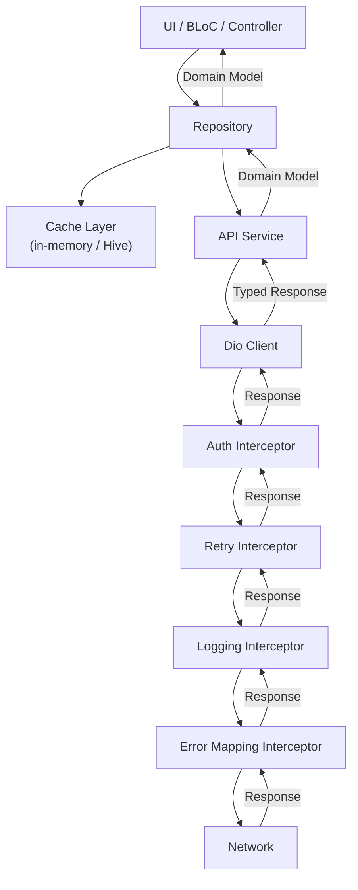

# Blueprint: API Integration Pattern

<!-- METADATA — structured for agents, useful for humans
tags:        [api, http, dio, rest, interceptor, repository]
category:    patterns
difficulty:  intermediate
time:        2-3 hours
stack:       [flutter, dart, dio]
-->

> Clean, layered API integration architecture for Flutter apps using Dio — from HTTP client to domain layer.

## TL;DR

Build an API layer as a pipeline: HTTP client (Dio) with an interceptor chain handles cross-cutting concerns (auth, retry, logging), API service classes map endpoints to typed requests, and a repository layer adds caching and domain translation. After following this blueprint you will have a production-grade API layer that handles token refresh, retries, cancellation, pagination, and offline gracefully.

## When to Use

- You are building a Flutter app that consumes one or more REST APIs.
- You need structured error handling, token refresh, request retries, and caching rather than ad-hoc `http.get()` calls scattered across the codebase.
- You want a testable architecture where the network layer can be swapped for mocks without touching business logic.
- When **not** to use it: for a single-endpoint prototype or a BaaS-only app (Firebase, Supabase) where the SDK already provides retry, auth, and caching.

## Prerequisites

- [ ] Flutter project initialized with `dio` and `json_annotation` / `json_serializable` in `pubspec.yaml`
- [ ] A running API (or at least an OpenAPI/Swagger spec to code against)
- [ ] Basic understanding of Dart generics and `Future`-based async

## Overview



## Steps

### 1. Configure the HTTP client with base settings

**Why**: Centralizing base URL, timeouts, and default headers in one place prevents duplication and ensures every request shares the same foundation. Separating `connectTimeout` from `receiveTimeout` lets you fail fast on unreachable servers while still allowing large responses to stream in.

```dart
// lib/core/network/api_client.dart

import 'package:dio/dio.dart';

Dio createApiClient({
  required String baseUrl,
  Duration connectTimeout = const Duration(seconds: 10),
  Duration receiveTimeout = const Duration(seconds: 30),
  Duration sendTimeout = const Duration(seconds: 30),
}) {
  final dio = Dio(
    BaseOptions(
      baseUrl: baseUrl,
      connectTimeout: connectTimeout,
      receiveTimeout: receiveTimeout,
      sendTimeout: sendTimeout,
      headers: {
        'Accept': 'application/json',
        'Content-Type': 'application/json',
      },
      responseType: ResponseType.json,
    ),
  );

  // Interceptors are added in Steps 2a-2d.
  // ORDER MATTERS — see Gotchas section.

  return dio;
}
```

**Expected outcome**: A single `Dio` instance configured with base URL and timeouts, ready to receive interceptors.

### 2. Add interceptors for cross-cutting concerns

**Why**: Interceptors separate infrastructure concerns (auth, retry, logging, error mapping) from business logic. Each interceptor has a single responsibility and can be tested in isolation.

> **Important**: Interceptor order determines execution order. Requests flow top-to-bottom through the list, responses flow bottom-to-top. Add interceptors in this order: auth, retry, error mapping, logging. Logging goes last on the request path so it captures the final request (with auth headers), and first on the response path so it logs before error mapping transforms the response.

#### 2a. Auth interceptor — attach tokens and handle refresh

```dart
// lib/core/network/interceptors/auth_interceptor.dart

import 'dart:async';
import 'package:dio/dio.dart';

class AuthInterceptor extends QueuedInterceptor {
  // QueuedInterceptor — not Interceptor — serializes requests during
  // token refresh so only the first 401 triggers a refresh. All others
  // wait in the queue and retry with the new token.

  final Future<String?> Function() getAccessToken;
  final Future<String?> Function() refreshToken;
  final void Function() onAuthFailure;

  AuthInterceptor({
    required this.getAccessToken,
    required this.refreshToken,
    required this.onAuthFailure,
  });

  @override
  Future<void> onRequest(
    RequestOptions options,
    RequestInterceptorHandler handler,
  ) async {
    final token = await getAccessToken();
    if (token != null) {
      options.headers['Authorization'] = 'Bearer $token';
    }
    handler.next(options);
  }

  @override
  Future<void> onError(
    DioException err,
    ErrorInterceptorHandler handler,
  ) async {
    if (err.response?.statusCode != 401) {
      return handler.next(err);
    }

    try {
      final newToken = await refreshToken();
      if (newToken == null) {
        onAuthFailure();
        return handler.next(err);
      }

      // Retry the original request with the new token.
      final options = err.requestOptions;
      options.headers['Authorization'] = 'Bearer $newToken';
      final response = await Dio().fetch(options);
      return handler.resolve(response);
    } catch (_) {
      onAuthFailure();
      return handler.next(err);
    }
  }
}
```

#### 2b. Retry interceptor — exponential backoff for transient failures

```dart
// lib/core/network/interceptors/retry_interceptor.dart

import 'dart:async';
import 'dart:math';
import 'package:dio/dio.dart';

class RetryInterceptor extends Interceptor {
  final Dio dio;
  final int maxRetries;
  final Duration baseDelay;
  final Set<int> retryStatusCodes;

  RetryInterceptor({
    required this.dio,
    this.maxRetries = 3,
    this.baseDelay = const Duration(milliseconds: 500),
    this.retryStatusCodes = const {408, 429, 500, 502, 503, 504},
  });

  @override
  Future<void> onError(
    DioException err,
    ErrorInterceptorHandler handler,
  ) async {
    final statusCode = err.response?.statusCode;
    final attempt = _getAttempt(err.requestOptions);

    final isRetryable = (err.type == DioExceptionType.connectionTimeout ||
            err.type == DioExceptionType.receiveTimeout ||
            (statusCode != null && retryStatusCodes.contains(statusCode))) &&
        attempt < maxRetries &&
        err.requestOptions.method != 'POST'; // POST is not idempotent by default

    if (!isRetryable) {
      return handler.next(err);
    }

    final delay = baseDelay * pow(2, attempt);
    await Future.delayed(delay);

    err.requestOptions.extra['retryAttempt'] = attempt + 1;

    try {
      final response = await dio.fetch(err.requestOptions);
      return handler.resolve(response);
    } on DioException catch (e) {
      return handler.next(e);
    }
  }

  int _getAttempt(RequestOptions options) {
    return options.extra['retryAttempt'] as int? ?? 0;
  }
}
```

#### 2c. Error mapping interceptor — translate Dio errors to domain errors

```dart
// lib/core/network/interceptors/error_mapping_interceptor.dart

import 'package:dio/dio.dart';

class ErrorMappingInterceptor extends Interceptor {
  @override
  void onError(DioException err, ErrorInterceptorHandler handler) {
    final mapped = switch (err.type) {
      DioExceptionType.connectionTimeout ||
      DioExceptionType.sendTimeout ||
      DioExceptionType.receiveTimeout =>
        ApiException.timeout(err.requestOptions.uri.toString()),
      DioExceptionType.connectionError =>
        ApiException.noConnection(),
      _ when err.response != null =>
        ApiException.fromResponse(
          err.response!.statusCode ?? 0,
          err.response!.data,
        ),
      _ => ApiException.unknown(err.message ?? 'Unknown error'),
    };

    handler.next(
      DioException(
        requestOptions: err.requestOptions,
        error: mapped,
        response: err.response,
        type: err.type,
      ),
    );
  }
}

/// Domain-level API exception. Never expose DioException to the UI.
sealed class ApiException implements Exception {
  final String message;
  const ApiException(this.message);

  factory ApiException.timeout(String url) = TimeoutException;
  factory ApiException.noConnection() = NoConnectionException;
  factory ApiException.unknown(String message) = UnknownApiException;

  factory ApiException.fromResponse(int statusCode, dynamic data) {
    final serverMessage = data is Map ? data['message'] as String? : null;
    return switch (statusCode) {
      400 => BadRequestException(serverMessage ?? 'Bad request'),
      401 => UnauthorizedException(serverMessage ?? 'Unauthorized'),
      403 => ForbiddenException(serverMessage ?? 'Forbidden'),
      404 => NotFoundException(serverMessage ?? 'Not found'),
      422 => ValidationException(serverMessage ?? 'Validation failed', data),
      429 => RateLimitException(serverMessage ?? 'Rate limit exceeded'),
      >= 500 => ServerException(serverMessage ?? 'Server error ($statusCode)'),
      _ => UnknownApiException('HTTP $statusCode'),
    };
  }
}

class TimeoutException extends ApiException {
  const TimeoutException(super.message);
}
class NoConnectionException extends ApiException {
  const NoConnectionException() : super('No internet connection');
}
class BadRequestException extends ApiException {
  const BadRequestException(super.message);
}
class UnauthorizedException extends ApiException {
  const UnauthorizedException(super.message);
}
class ForbiddenException extends ApiException {
  const ForbiddenException(super.message);
}
class NotFoundException extends ApiException {
  const NotFoundException(super.message);
}
class ValidationException extends ApiException {
  final dynamic errors;
  const ValidationException(super.message, this.errors);
}
class RateLimitException extends ApiException {
  const RateLimitException(super.message);
}
class ServerException extends ApiException {
  const ServerException(super.message);
}
class UnknownApiException extends ApiException {
  const UnknownApiException(super.message);
}
```

#### 2d. Logging interceptor

```dart
// lib/core/network/interceptors/logging_interceptor.dart

import 'package:dio/dio.dart';
import 'package:logger/logger.dart';

class ApiLoggingInterceptor extends Interceptor {
  final Logger _logger;

  ApiLoggingInterceptor(this._logger);

  @override
  void onRequest(RequestOptions options, RequestInterceptorHandler handler) {
    _logger.d('→ ${options.method} ${options.uri}');
    handler.next(options);
  }

  @override
  void onResponse(Response response, ResponseInterceptorHandler handler) {
    _logger.d(
      '← ${response.statusCode} ${response.requestOptions.method} '
      '${response.requestOptions.uri} '
      '(${response.data.toString().length} chars)',
    );
    handler.next(response);
  }

  @override
  void onError(DioException err, ErrorInterceptorHandler handler) {
    _logger.e(
      '✗ ${err.requestOptions.method} ${err.requestOptions.uri} '
      '— ${err.response?.statusCode ?? err.type}',
    );
    handler.next(err);
  }
}
```

**Wire them together** (order matters):

```dart
dio.interceptors.addAll([
  AuthInterceptor(
    getAccessToken: () => tokenStore.accessToken,
    refreshToken: () => authService.refresh(),
    onAuthFailure: () => authController.logout(),
  ),
  RetryInterceptor(dio: dio),
  ErrorMappingInterceptor(),
  ApiLoggingInterceptor(logger),
]);
```

**Expected outcome**: Every outgoing request is authenticated, retried on transient failure, logged, and translated to a domain error on failure — without any business logic code touching these concerns.

### 3. Define request/response models with JSON serialization

**Why**: Typed models catch API contract changes at compile time. A generic response envelope standardizes how you unwrap data, errors, and metadata across every endpoint.

```dart
// lib/core/network/api_response.dart

import 'package:json_annotation/json_annotation.dart';
part 'api_response.g.dart';

/// Generic envelope matching the API's standard response format:
/// { "data": ..., "meta": {...}, "error": {...} }
@JsonSerializable(genericArgumentFactories: true)
class ApiResponse<T> {
  final T? data;
  final ApiMeta? meta;
  final ApiError? error;

  const ApiResponse({this.data, this.meta, this.error});

  bool get isSuccess => error == null;

  factory ApiResponse.fromJson(
    Map<String, dynamic> json,
    T Function(Object? json) fromJsonT,
  ) => _$ApiResponseFromJson(json, fromJsonT);
}

@JsonSerializable()
class ApiMeta {
  final int? page;
  final int? perPage;
  final int? total;
  final int? totalPages;
  final String? nextCursor;

  const ApiMeta({
    this.page,
    this.perPage,
    this.total,
    this.totalPages,
    this.nextCursor,
  });

  bool get hasNextPage =>
      (totalPages != null && page != null && page! < totalPages!) ||
      nextCursor != null;

  factory ApiMeta.fromJson(Map<String, dynamic> json) =>
      _$ApiMetaFromJson(json);
}

@JsonSerializable()
class ApiError {
  final String code;
  final String message;
  final Map<String, List<String>>? fieldErrors;

  const ApiError({
    required this.code,
    required this.message,
    this.fieldErrors,
  });

  factory ApiError.fromJson(Map<String, dynamic> json) =>
      _$ApiErrorFromJson(json);
}
```

```dart
// Example resource model
// lib/features/users/data/models/user_dto.dart

import 'package:json_annotation/json_annotation.dart';
part 'user_dto.g.dart';

@JsonSerializable()
class UserDto {
  final String id;
  final String name;
  final String email;
  @JsonKey(name: 'created_at')
  final DateTime createdAt;

  const UserDto({
    required this.id,
    required this.name,
    required this.email,
    required this.createdAt,
  });

  factory UserDto.fromJson(Map<String, dynamic> json) =>
      _$UserDtoFromJson(json);
  Map<String, dynamic> toJson() => _$UserDtoToJson(this);
}
```

**Expected outcome**: Every API response is deserialized into typed Dart objects. The `ApiResponse<T>` envelope is reused across all endpoints.

### 4. Create API service classes per resource

**Why**: Service classes map 1:1 with API resources and encapsulate endpoint paths, HTTP methods, and request/response types. This is the seam where you mock for tests.

```dart
// lib/features/users/data/services/user_api_service.dart

import 'package:dio/dio.dart';

class UserApiService {
  final Dio _dio;

  UserApiService(this._dio);

  Future<ApiResponse<UserDto>> getUser(String id, {CancelToken? cancelToken}) async {
    final response = await _dio.get(
      '/users/$id',
      cancelToken: cancelToken,
    );
    return ApiResponse.fromJson(
      response.data as Map<String, dynamic>,
      (json) => UserDto.fromJson(json as Map<String, dynamic>),
    );
  }

  Future<ApiResponse<List<UserDto>>> listUsers({
    int page = 1,
    int perPage = 20,
    CancelToken? cancelToken,
  }) async {
    final response = await _dio.get(
      '/users',
      queryParameters: {'page': page, 'per_page': perPage},
      cancelToken: cancelToken,
    );
    return ApiResponse.fromJson(
      response.data as Map<String, dynamic>,
      (json) => (json as List)
          .map((e) => UserDto.fromJson(e as Map<String, dynamic>))
          .toList(),
    );
  }

  Future<ApiResponse<UserDto>> createUser(Map<String, dynamic> body) async {
    final response = await _dio.post('/users', data: body);
    return ApiResponse.fromJson(
      response.data as Map<String, dynamic>,
      (json) => UserDto.fromJson(json as Map<String, dynamic>),
    );
  }

  Future<void> deleteUser(String id) async {
    await _dio.delete('/users/$id');
  }
}
```

**Expected outcome**: Each API resource has its own service class. Controllers and repositories never construct URLs or parse raw JSON.

### 5. Build a repository layer with caching

**Why**: The repository sits between the service layer and domain logic. It decides whether to hit the network or return cached data, translates DTOs to domain entities, and hides the data source from callers. This is where you implement cache-aside, ETag support, and optimistic updates.

```dart
// lib/features/users/data/repositories/user_repository.dart

class UserRepository {
  final UserApiService _api;
  final UserLocalSource _local;  // e.g. Hive, Drift, or in-memory cache
  final Duration _cacheTtl;

  UserRepository(this._api, this._local, {
    Duration cacheTtl = const Duration(minutes: 5),
  }) : _cacheTtl = cacheTtl;

  Future<User> getUser(String id, {bool forceRefresh = false}) async {
    // Check cache first
    if (!forceRefresh) {
      final cached = await _local.getUser(id);
      if (cached != null && !cached.isExpired(_cacheTtl)) {
        return cached.toDomain();
      }
    }

    final response = await _api.getUser(id);
    if (response.data == null) {
      throw ApiException.unknown('User not found');
    }

    // Cache the fresh data
    await _local.saveUser(response.data!);
    return response.data!.toDomain();
  }

  /// ETag-based conditional fetch — saves bandwidth on large payloads
  Future<User> getUserWithETag(String id) async {
    final etag = await _local.getETag('user:$id');

    try {
      final response = await _api.getUser(
        id,
        // Pass ETag in a custom extension on the service, or add
        // headers directly via Options
      );
      // Save new ETag
      final newEtag = response.meta?.toString(); // adapt to your API
      if (newEtag != null) {
        await _local.saveETag('user:$id', newEtag);
      }
      await _local.saveUser(response.data!);
      return response.data!.toDomain();
    } on DioException catch (e) {
      if (e.response?.statusCode == 304) {
        // Not modified — return cache
        final cached = await _local.getUser(id);
        return cached!.toDomain();
      }
      rethrow;
    }
  }

  /// Optimistic update: update UI immediately, sync to server, roll back on failure
  Future<User> updateUserOptimistic(String id, Map<String, dynamic> changes) async {
    final previous = await _local.getUser(id);

    // Apply optimistic update locally
    final optimistic = previous!.applyChanges(changes);
    await _local.saveUser(optimistic);

    try {
      final response = await _api.updateUser(id, changes);
      await _local.saveUser(response.data!);
      return response.data!.toDomain();
    } catch (e) {
      // Roll back to previous state
      await _local.saveUser(previous);
      rethrow;
    }
  }
}
```

**Expected outcome**: Business logic calls `repository.getUser(id)` and never knows whether the result came from cache or network. Cache invalidation, ETag handling, and optimistic updates are encapsulated.

### 6. Handle pagination patterns

**Why**: Most list APIs use pagination. A reusable pagination helper avoids re-implementing page tracking, loading state, and "load more" logic in every feature.

```dart
// lib/core/network/paginated_result.dart

class PaginatedResult<T> {
  final List<T> items;
  final int currentPage;
  final int? totalPages;
  final String? nextCursor;

  const PaginatedResult({
    required this.items,
    required this.currentPage,
    this.totalPages,
    this.nextCursor,
  });

  bool get hasNextPage =>
      (totalPages != null && currentPage < totalPages!) ||
      nextCursor != null;
}

// lib/core/network/paginator.dart

class Paginator<T> {
  final Future<PaginatedResult<T>> Function(int page) fetchPage;

  final List<T> _items = [];
  int _currentPage = 0;
  bool _hasMore = true;
  bool _isLoading = false;

  Paginator({required this.fetchPage});

  List<T> get items => List.unmodifiable(_items);
  bool get hasMore => _hasMore;
  bool get isLoading => _isLoading;

  Future<void> loadNextPage() async {
    if (_isLoading || !_hasMore) return;

    _isLoading = true;
    try {
      final result = await fetchPage(_currentPage + 1);
      _items.addAll(result.items);
      _currentPage = result.currentPage;
      _hasMore = result.hasNextPage;
    } finally {
      _isLoading = false;
    }
  }

  Future<void> refresh() async {
    _items.clear();
    _currentPage = 0;
    _hasMore = true;
    await loadNextPage();
  }
}
```

**Expected outcome**: Every paginated list uses the same `Paginator<T>` helper. No duplicated page-tracking logic across features.

### 7. Add request cancellation support

**Why**: Without cancellation, navigating away from a screen still completes the HTTP request and may trigger `setState` on a disposed widget. Dio's `CancelToken` lets you abort in-flight requests when they are no longer needed.

```dart
// In a BLoC or Controller:

class UserDetailController extends ChangeNotifier {
  final UserRepository _repo;
  CancelToken? _cancelToken;

  UserDetailController(this._repo);

  Future<void> loadUser(String id) async {
    // Cancel any previous in-flight request
    _cancelToken?.cancel('New request superseded the previous one');
    _cancelToken = CancelToken();

    try {
      final user = await _repo.getUser(id, cancelToken: _cancelToken);
      // update state...
    } on DioException catch (e) {
      if (e.type == DioExceptionType.cancel) {
        // Request was intentionally cancelled — do nothing
        return;
      }
      rethrow;
    }
  }

  @override
  void dispose() {
    _cancelToken?.cancel('Controller disposed');
    super.dispose();
  }
}
```

For request deduplication (multiple widgets requesting the same resource simultaneously):

```dart
// lib/core/network/request_deduplicator.dart

class RequestDeduplicator {
  final Map<String, Future<dynamic>> _inFlight = {};

  Future<T> deduplicate<T>(String key, Future<T> Function() factory) {
    if (_inFlight.containsKey(key)) {
      return _inFlight[key] as Future<T>;
    }

    final future = factory().whenComplete(() => _inFlight.remove(key));
    _inFlight[key] = future;
    return future;
  }
}
```

**Expected outcome**: Screen transitions cancel stale requests. Duplicate simultaneous requests are collapsed into one network call.

## Variants

<details>
<summary><strong>Variant: GraphQL (graphql_flutter / ferry)</strong></summary>

The layered architecture is the same, but the transport and service layers change:

- **HTTP client**: Replace Dio with a GraphQL client (`graphql_flutter`, `ferry`, or `gql`). The client manages its own link chain (roughly equivalent to interceptors).
- **Interceptors become Links**: Auth link, retry link, and logging link replace Dio interceptors. The concept is identical — composable middleware.
- **Service layer**: Instead of `GET /users/:id`, services execute named queries/mutations. Return types are generated from the schema.
- **Caching**: GraphQL clients have normalized caches built in. The repository layer still exists but delegates more caching responsibility to the client's cache.
- **Pagination**: Use cursor-based relay-style pagination. Offset pagination is uncommon in GraphQL.

Key difference: error handling is trickier because GraphQL returns `200 OK` with errors in the response body. Your error mapping must inspect `response.data['errors']`, not HTTP status codes.

</details>

<details>
<summary><strong>Variant: gRPC (grpc / protobuf)</strong></summary>

- **HTTP client**: Replace Dio with a gRPC `ClientChannel`. Protobuf handles serialization — no JSON step.
- **Interceptors**: gRPC uses `ClientInterceptor` with `onRequest` / `onResponse` / `onError`. Same pattern, different API.
- **Models**: Generated from `.proto` files, not `json_serializable`. No manual DTO classes.
- **Streaming**: gRPC natively supports server-streaming and bidirectional streaming, which has no direct REST equivalent.
- **Error mapping**: gRPC uses status codes (e.g. `UNAVAILABLE`, `UNAUTHENTICATED`) that map cleanly to the `ApiException` sealed class from Step 2c.

Key difference: binary payloads are faster to parse than JSON, so the "large response on main thread" gotcha is less severe. But proto deserialization for very large messages can still benefit from `compute()`.

</details>

<details>
<summary><strong>Variant: REST with code generation (retrofit / openapi_generator)</strong></summary>

If your API has an OpenAPI spec, you can generate the service layer automatically:

- **retrofit**: Annotate an abstract class with `@RestApi()` and method annotations (`@GET`, `@POST`). Code generation produces the implementation.
- **openapi_generator**: Generates models, service classes, and even the Dio configuration from the spec.

The repository layer and interceptors remain hand-written. Generation replaces only Step 3 (models) and Step 4 (service classes).

Trade-off: faster initial setup, but generated code can be harder to debug and customize. Works best when the API spec is stable.

</details>

## Gotchas

> **Interceptor ordering matters**: Dio executes interceptors in list order for requests and reverse order for responses. If the retry interceptor is added before the auth interceptor, retried requests will not have a refreshed token. **Fix**: Always add auth first, retry second, error mapping third, logging last.

> **Refresh token race condition (multiple 401s)**: If three requests fail with 401 simultaneously, three refresh calls fire in parallel, invalidating each other's tokens. **Fix**: Use `QueuedInterceptor` (not `Interceptor`) for auth. It serializes interceptor execution — only the first 401 triggers a refresh, and the rest wait for the new token.

> **Large response parsing blocks the main thread**: `jsonDecode` of a 5 MB payload freezes the UI. **Fix**: Use `compute()` or `Isolate.run()` to parse large responses off the main thread. Dio's `transformer` property supports a custom `BackgroundTransformer` for this.

> **Missing Content-Type header on requests**: Some servers reject requests without `Content-Type: application/json` even for GET. Dio does not set `Content-Type` on GET requests by default. **Fix**: Set it in `BaseOptions.headers` so it applies globally, or set it per-request via `Options`.

> **connectTimeout vs receiveTimeout confusion**: `connectTimeout` is the time to establish a TCP connection. `receiveTimeout` is the time between data packets once connected. A slow server that connects fast but responds slowly will not trigger `connectTimeout`. **Fix**: Set both. Use a short `connectTimeout` (5-10s) and a longer `receiveTimeout` (30s+).

> **SSL pinning breaks debug/proxy tools**: If you add certificate pinning, Charles Proxy and similar tools will fail with `CERTIFICATE_VERIFY_FAILED`. **Fix**: Disable pinning in debug builds using `kDebugMode` or a build flavor flag. Never ship debug builds without pinning.

> **Mock server vs mock interceptor for testing**: Using a mock HTTP server (e.g. `MockWebServer`) tests the full Dio pipeline including serialization. Mocking the interceptor or the Dio instance skips serialization bugs. **Fix**: Use mock interceptors for unit tests (fast), mock servers for integration tests (thorough). Never mock only the repository — you will miss serialization regressions.

> **CancelToken.cancel() after dispose throws**: If a widget's `dispose()` cancels a token and the response handler tries to call `setState`, you get a "setState after dispose" error. **Fix**: Check `mounted` before updating state, or use a pattern where the cancel silently swallows the response (Step 7).

> **Retry interceptor retrying POST requests**: POST is not idempotent. Retrying a `POST /orders` might create duplicate orders. **Fix**: Only retry idempotent methods (GET, PUT, DELETE, HEAD) by default. Support explicit opt-in for POST endpoints that are known to be idempotent (e.g. those using idempotency keys).

> **DioException.type check is not exhaustive**: Dart does not enforce exhaustive switch on `DioExceptionType` enums, so adding a new Dio version with new types silently falls to the default case. **Fix**: Use the `_` wildcard as a catch-all in switch expressions and log unhandled types so you notice them.

> **Forgetting to close CancelTokens leaks memory**: A `CancelToken` holds references to all requests that share it. If you create one per screen but never cancel or dereference it, the requests and their response data stay in memory. **Fix**: Always cancel in `dispose()` and null out the reference.

## Checklist

- [ ] Single `Dio` instance with base URL, timeouts, and default headers
- [ ] Auth interceptor uses `QueuedInterceptor` (not `Interceptor`)
- [ ] Interceptors are added in correct order: auth, retry, error mapping, logging
- [ ] Retry interceptor skips non-idempotent methods by default
- [ ] `ApiResponse<T>` envelope handles data, error, and meta uniformly
- [ ] All DTOs use `json_serializable` with code generation — no manual `fromJson`
- [ ] API service classes accept `CancelToken` on all read operations
- [ ] Repository layer checks cache before network
- [ ] Large JSON responses are parsed off the main thread
- [ ] Request deduplication is in place for shared resources
- [ ] Pagination uses a reusable helper, not per-feature implementation
- [ ] `ApiException` sealed class covers all expected HTTP error codes
- [ ] SSL pinning is enabled in release builds and disabled in debug
- [ ] Integration tests use a mock server; unit tests mock the service layer

## Artifacts

| Artifact | Location | Description |
|----------|----------|-------------|
| Dio client factory | `lib/core/network/api_client.dart` | Creates and configures the shared Dio instance |
| Auth interceptor | `lib/core/network/interceptors/auth_interceptor.dart` | Token attachment and refresh with queue serialization |
| Retry interceptor | `lib/core/network/interceptors/retry_interceptor.dart` | Exponential backoff for transient failures |
| Error mapping interceptor | `lib/core/network/interceptors/error_mapping_interceptor.dart` | Translates Dio errors to domain `ApiException` |
| Logging interceptor | `lib/core/network/interceptors/logging_interceptor.dart` | Request/response logging |
| API response envelope | `lib/core/network/api_response.dart` | Generic `ApiResponse<T>` with meta and error |
| Paginator | `lib/core/network/paginator.dart` | Reusable pagination state machine |
| Request deduplicator | `lib/core/network/request_deduplicator.dart` | Collapses duplicate in-flight requests |
| API service (per resource) | `lib/features/<resource>/data/services/` | Endpoint mapping per API resource |
| Repository (per resource) | `lib/features/<resource>/data/repositories/` | Cache-aside, domain translation, optimistic updates |

## References

- [Dio package](https://pub.dev/packages/dio) — HTTP client for Dart with interceptor support
- [json_serializable](https://pub.dev/packages/json_serializable) — code generation for JSON models
- [retrofit](https://pub.dev/packages/retrofit) — type-safe REST client generator for Dio
- [QueuedInterceptor docs](https://pub.dev/documentation/dio/latest/dio/QueuedInterceptor-class.html) — serialized interceptor execution for token refresh
- [Dart isolates](https://dart.dev/language/concurrency) — background parsing for large payloads
- [HTTP ETag](https://developer.mozilla.org/en-US/docs/Web/HTTP/Headers/ETag) — conditional requests for bandwidth savings
