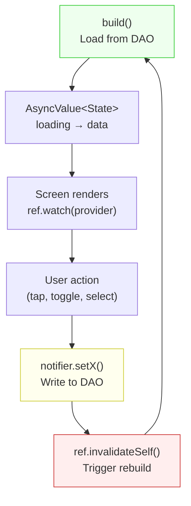

# Blueprint: AsyncNotifier Lifecycle

<!-- METADATA — structured for agents, useful for humans
tags:        [riverpod, asyncnotifier, flutter, dart, state-management, lifecycle]
category:    patterns
difficulty:  intermediate
time:        30 min
stack:       [flutter, dart, riverpod]
-->

> Master the full AsyncNotifier lifecycle: build → state → mutate → invalidateSelf → rebuild, with a concrete settings persistence example.

## TL;DR

`AsyncNotifier` is the Riverpod pattern for state that is loaded asynchronously and mutated by user actions. The lifecycle is: `build()` loads initial state from the DB, mutation methods write to DB then call `ref.invalidateSelf()` to trigger a rebuild. The screen watches the provider and reacts to every state change automatically. Get any step wrong and the UI silently stops updating.

## When to Use

- A screen that reads persistent state (settings, profiles, preferences)
- State that can be mutated by user actions (toggle theme, change locale, update profile)
- When you need loading/error/data states handled automatically
- After reading [Riverpod Provider Wiring](riverpod-provider-wiring.md) — this blueprint covers the *notifier* side

## Prerequisites

- [ ] `flutter_riverpod` and `riverpod_annotation` in `pubspec.yaml`
- [ ] `riverpod_generator` and `build_runner` for code generation
- [ ] A DAO or repository that provides async read/write access
- [ ] Understanding of [Riverpod Provider Wiring](riverpod-provider-wiring.md) (bootstrap + ConsumerWidget wrapper)

## Overview



## Steps

### 1. Define the state class

**Why**: The state holds all the data the screen needs. Immutable, with a const constructor.

```dart
// lib/features/settings/settings_state.dart

class SettingsState {
  const SettingsState({
    required this.locale,
    required this.currency,
    required this.dateFormat,
    required this.themeMode,
  });

  final Locale locale;
  final Currency currency;
  final String dateFormat;
  final ThemeMode themeMode;
}
```

**Expected outcome**: A clean data class that maps 1:1 to what the settings screen displays.

### 2. Write the AsyncNotifier with build()

**Why**: `build()` is the async initializer — it runs on first access AND on every `invalidateSelf()`. It's the single source of truth for how state is loaded.

```dart
// lib/features/settings/settings_notifier.dart

import 'package:riverpod_annotation/riverpod_annotation.dart';

part 'settings_notifier.g.dart';

@riverpod
class SettingsNotifier extends _$SettingsNotifier {
  @override
  Future<SettingsState> build() async {
    final db = ref.watch(userDatabaseProvider);
    final profile = await db.profileDao.getOrCreateDefault();

    return SettingsState(
      locale: Locale(profile.locale),
      currency: Currency.byCode(profile.currencyCode),
      dateFormat: profile.dateFormat,
      themeMode: ThemeMode.values.byName(profile.theme),
    );
  }
}
```

**Key points**:
- `build()` is `Future<SettingsState>`, making this an `AsyncNotifier`
- `ref.watch(userDatabaseProvider)` — if the DB provider changes, this rebuilds too
- `getOrCreateDefault()` — handles first-launch gracefully (no null checks needed)

**Expected outcome**: On first access, the provider is in `loading` state, then transitions to `data` with the loaded settings.

### 3. Add mutation methods

**Why**: Each user action gets its own method. The pattern is always: **validate → write to DB → invalidateSelf()**. The `invalidateSelf()` call triggers `build()` again, which reloads from DB, ensuring state is always consistent with persistence.

```dart
// Add to SettingsNotifier class:

Future<void> setLocale(Locale locale) async {
  final db = ref.read(userDatabaseProvider);
  await db.profileDao.updateLocale(locale.languageCode);
  ref.invalidateSelf();
}

Future<void> setCurrency(Currency currency) async {
  final db = ref.read(userDatabaseProvider);
  await db.profileDao.updateCurrency(currency.code);
  ref.invalidateSelf();
}

Future<void> setThemeMode(ThemeMode mode) async {
  final db = ref.read(userDatabaseProvider);
  await db.profileDao.updateTheme(mode.name);
  ref.invalidateSelf();
}

Future<void> setDateFormat(String format) async {
  final db = ref.read(userDatabaseProvider);
  await db.profileDao.updateDateFormat(format);
  ref.invalidateSelf();
}
```

**Critical**: Always use `ref.read()` (not `ref.watch()`) inside mutation methods. `ref.watch()` is only for `build()`.

**Expected outcome**: Each method writes to DB, then the UI automatically updates because `invalidateSelf()` re-runs `build()`.

### 4. Connect the screen via ConsumerWidget

**Why**: The screen watches the provider and renders the current state. Mutation callbacks are passed as props to keep the screen widget testable.

```dart
// lib/features/settings/settings_screen.dart

class SettingsScreenWrapper extends ConsumerWidget {
  const SettingsScreenWrapper({super.key});

  @override
  Widget build(BuildContext context, WidgetRef ref) {
    final asyncSettings = ref.watch(settingsNotifierProvider);

    return asyncSettings.when(
      loading: () => const Scaffold(
        body: Center(child: CircularProgressIndicator()),
      ),
      error: (e, _) => Scaffold(
        body: Center(child: Text('Error: $e')),
      ),
      data: (state) {
        final notifier = ref.read(settingsNotifierProvider.notifier);
        return SettingsScreen(
          state: state,
          onLocaleChanged: notifier.setLocale,
          onCurrencyChanged: notifier.setCurrency,
          onThemeChanged: notifier.setThemeMode,
          onDateFormatChanged: notifier.setDateFormat,
        );
      },
    );
  }
}

// The pure screen — testable with fake state, no Riverpod needed
class SettingsScreen extends StatelessWidget {
  const SettingsScreen({
    super.key,
    required this.state,
    required this.onLocaleChanged,
    required this.onCurrencyChanged,
    required this.onThemeChanged,
    required this.onDateFormatChanged,
  });

  final SettingsState state;
  final ValueChanged<Locale> onLocaleChanged;
  final ValueChanged<Currency> onCurrencyChanged;
  final ValueChanged<ThemeMode> onThemeChanged;
  final ValueChanged<String> onDateFormatChanged;

  @override
  Widget build(BuildContext context) {
    return Scaffold(
      appBar: AppBar(title: Text(AppLocalizations.of(context)!.settings)),
      body: ListView(
        children: [
          ListTile(
            title: Text('Language'),
            subtitle: Text(state.locale.languageCode),
            onTap: () => _showLocalePicker(context),
          ),
          // ... more tiles
        ],
      ),
    );
  }
}
```

**Expected outcome**: User taps a setting → `notifier.setX()` → DB write → `invalidateSelf()` → `build()` reloads → screen rebuilds with new value. Instant, reactive, consistent.

### 5. Handle edge cases

**Why**: The lifecycle has subtle traps that cause silent failures.

#### Optimistic updates (optional)

For instant UI feedback before the DB write completes:

```dart
Future<void> setLocale(Locale locale) async {
  // Optimistic: update state immediately
  final current = state.valueOrNull;
  if (current != null) {
    state = AsyncData(SettingsState(
      locale: locale,
      currency: current.currency,
      dateFormat: current.dateFormat,
      themeMode: current.themeMode,
    ));
  }

  // Then persist
  final db = ref.read(userDatabaseProvider);
  await db.profileDao.updateLocale(locale.languageCode);
  ref.invalidateSelf(); // reload from DB to confirm
}
```

#### Error handling in mutations

```dart
Future<void> setLocale(Locale locale) async {
  try {
    final db = ref.read(userDatabaseProvider);
    await db.profileDao.updateLocale(locale.languageCode);
    ref.invalidateSelf();
  } catch (e) {
    // Don't invalidate — keep current state
    // Optionally set error state:
    state = AsyncError(e, StackTrace.current);
  }
}
```

**Expected outcome**: Errors don't leave the UI in a broken state.

## Gotchas

> **Missing `invalidateSelf()` after write**: The most common bug. The DB is updated but the UI shows stale data. There's no error — it just doesn't update. **Fix**: Every mutation method MUST end with `ref.invalidateSelf()`. Add it to your code review checklist.

> **Using `ref.watch()` in mutation methods**: `ref.watch()` inside a mutation re-subscribes to the dependency, which can cause infinite rebuild loops. **Fix**: Always use `ref.read()` inside mutation methods. Reserve `ref.watch()` for `build()` only.

> **`keepAlive` misconception**: `@Riverpod(keepAlive: true)` prevents the provider from being disposed when no widget watches it. But it does NOT prevent `invalidateSelf()` from working. Use `keepAlive` for providers that should survive navigation (settings, auth state). Don't use it for screen-specific data.

> **Race condition on rapid mutations**: If the user taps two settings quickly, the second `invalidateSelf()` may trigger `build()` before the first write completes. **Fix**: Either debounce mutations or use optimistic updates (step 5) so the UI always reflects the latest intent.

> **`build()` called during `state = AsyncLoading()`**: If you set `state = const AsyncLoading()` at the start of a mutation, the screen flashes a loading spinner. **Fix**: Don't set loading state for fast mutations (< 100ms). Only show loading for network calls or heavy operations.

## Checklist

- [ ] `build()` loads state from the single source of truth (DB/API)
- [ ] State class is immutable with `const` constructor
- [ ] Every mutation method follows: validate → write → `invalidateSelf()`
- [ ] Mutation methods use `ref.read()`, not `ref.watch()`
- [ ] Screen uses a `ConsumerWidget` wrapper with `asyncValue.when()`
- [ ] The pure screen widget is a `StatelessWidget` with callback props
- [ ] Error handling in mutations doesn't leave UI in broken state
- [ ] `keepAlive: true` only for providers that should survive navigation
- [ ] No `state = AsyncLoading()` for fast mutations (< 100ms)

## Artifacts

| Artifact | Location | Description |
|----------|----------|-------------|
| State class | `lib/features/<name>/<name>_state.dart` | Immutable state |
| Notifier | `lib/features/<name>/<name>_notifier.dart` | AsyncNotifier with build() + mutations |
| Generated | `lib/features/<name>/<name>_notifier.g.dart` | Riverpod codegen output |
| Wrapper | `lib/features/<name>/<name>_screen_wrapper.dart` | ConsumerWidget that watches provider |
| Pure screen | `lib/features/<name>/<name>_screen.dart` | StatelessWidget with props |

## References

- Settings persistence pattern (Budget Tier 7e) — original pattern note
- [Riverpod Provider Wiring](riverpod-provider-wiring.md) — bootstrap + test wiring (prerequisite)
- [ViewModel Pure Functions](viewmodel-pure-functions.md) — when you DON'T need mutations (read-only state)
- [Flutter UI Gotchas → S1](flutter-ui-gotchas.md) — silent null return on async error
- [Riverpod AsyncNotifier docs](https://riverpod.dev/docs/providers/async_notifier_provider) — official reference
