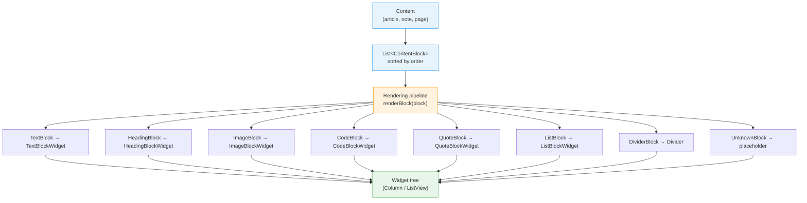

# Blueprint: Block-Based Content Modeling

<!-- METADATA — structured for agents, useful for humans
tags:        [content, blocks, sealed-class, rendering, editor, modeling]
category:    patterns
difficulty:  intermediate
time:        3 hours
stack:       [flutter, dart]
-->

> Model rich content as an ordered list of typed blocks using Dart sealed classes, with JSON serialization via discriminator field and a rendering pipeline that maps each block type to a widget.

## TL;DR

Define your content as `List<ContentBlock>` where `ContentBlock` is a sealed class hierarchy covering text, headings, images, code, quotes, dividers, and lists. Serialize each block with a `type` discriminator field. Render with an exhaustive switch expression — one widget per block type. The compiler catches every missing case when you add a new block type.

## When to Use

- Building a content editor or viewer where content is rich and structured (articles, notes, documentation, CMS pages)
- When content must round-trip through an API or local database and be rendered as a widget tree
- When different block types carry different data shapes (image needs URL + aspect ratio; code needs language hint; heading needs level)
- When you want the compiler to enforce completeness as the block type set evolves
- **Not** for simple plain-text fields — a single `String` property is enough there
- **Not** when the set of block types is open-ended and callers define their own — use an abstract class instead

## Prerequisites

- [ ] Dart 3.0+ (sealed classes, pattern matching, exhaustive switch expressions)
- [ ] Flutter project with a data layer (API or local DB)
- [ ] Familiarity with the [Sealed Class Modeling](../architecture/sealed-class-modeling.md) blueprint — this blueprint applies that pattern at scale
- [ ] `json_annotation` or manual JSON serialization (manual shown here)

## Overview



## Steps

### 1. Define the sealed class hierarchy

**Why**: The sealed modifier tells Dart that all subtypes of `ContentBlock` live in this library. This makes switch expressions on `ContentBlock` exhaustive — the compiler errors if you forget a case. Every block carries an `order` field so the list can be sorted and reordered without shuffling indices.

```dart
// lib/domain/content_block.dart

sealed class ContentBlock {
  const ContentBlock({required this.order});

  /// Position in the content. Use gap-based values (1000, 2000, 3000)
  /// to allow insertions without renumbering the entire list.
  final int order;

  /// Discriminator written to JSON.
  String get type;
}

// ---------------------------------------------------------------------------
// Concrete subtypes — all in the same file (Dart requirement for sealed classes)
// ---------------------------------------------------------------------------

class TextBlock extends ContentBlock {
  const TextBlock({
    required super.order,
    required this.text,
    this.style = TextBlockStyle.body,
  });

  final String text;
  final TextBlockStyle style;

  @override
  String get type => 'text';
}

enum TextBlockStyle { body, bold, italic, boldItalic }

// ---------------------------------------------------------------------------

class HeadingBlock extends ContentBlock {
  const HeadingBlock({
    required super.order,
    required this.text,
    required this.level,
  }) : assert(level >= 1 && level <= 6, 'level must be 1–6');

  final String text;

  /// 1 = largest (h1), 6 = smallest (h6).
  final int level;

  @override
  String get type => 'heading';
}

// ---------------------------------------------------------------------------

class ImageBlock extends ContentBlock {
  const ImageBlock({
    required super.order,
    required this.url,
    this.caption,
    this.aspectRatio,
  });

  final String url;
  final String? caption;

  /// Store the aspect ratio (width / height) so the placeholder can reserve
  /// the correct height before the image loads — prevents layout jumps.
  final double? aspectRatio;

  @override
  String get type => 'image';
}

// ---------------------------------------------------------------------------

class CodeBlock extends ContentBlock {
  const CodeBlock({
    required super.order,
    required this.code,
    this.language,
  });

  final String code;

  /// e.g. 'dart', 'bash', 'json'. Used for syntax highlighting hints.
  final String? language;

  @override
  String get type => 'code';
}

// ---------------------------------------------------------------------------

class QuoteBlock extends ContentBlock {
  const QuoteBlock({
    required super.order,
    required this.text,
    this.attribution,
  });

  final String text;
  final String? attribution;

  @override
  String get type => 'quote';
}

// ---------------------------------------------------------------------------

class DividerBlock extends ContentBlock {
  const DividerBlock({required super.order});

  @override
  String get type => 'divider';
}

// ---------------------------------------------------------------------------

class ListBlock extends ContentBlock {
  const ListBlock({
    required super.order,
    required this.items,
    required this.listType,
  });

  final List<String> items;
  final ListType listType;

  @override
  String get type => 'list';
}

enum ListType { ordered, unordered }

// ---------------------------------------------------------------------------

/// Returned when fromJson encounters a type string it does not recognize.
/// Forward compatibility: store the raw JSON so the data is not lost.
class UnknownBlock extends ContentBlock {
  const UnknownBlock({
    required super.order,
    required this.rawType,
    required this.rawJson,
  });

  final String rawType;
  final Map<String, dynamic> rawJson;

  @override
  String get type => rawType;
}
```

**Expected outcome**: One file containing the complete sealed hierarchy. Running `dart analyze` on an empty switch over `ContentBlock` produces a compile error for every missing case.

---

### 2. Add JSON serialization with a discriminator field

**Why**: Content stored in a database or received from an API is a JSON blob. The `type` field is the discriminator — the single source of truth for which subtype to deserialize into. `toJson` is exhaustive (no `default`); `fromJson` must handle unknown types gracefully because the input is untrusted.

```dart
// lib/domain/content_block.dart (continued — same file)

extension ContentBlockJson on ContentBlock {
  Map<String, dynamic> toJson() {
    return switch (this) {
      TextBlock b => {
          'type': b.type,
          'order': b.order,
          'text': b.text,
          'style': b.style.name,
        },
      HeadingBlock b => {
          'type': b.type,
          'order': b.order,
          'text': b.text,
          'level': b.level,
        },
      ImageBlock b => {
          'type': b.type,
          'order': b.order,
          'url': b.url,
          if (b.caption != null) 'caption': b.caption,
          if (b.aspectRatio != null) 'aspectRatio': b.aspectRatio,
        },
      CodeBlock b => {
          'type': b.type,
          'order': b.order,
          'code': b.code,
          if (b.language != null) 'language': b.language,
        },
      QuoteBlock b => {
          'type': b.type,
          'order': b.order,
          'text': b.text,
          if (b.attribution != null) 'attribution': b.attribution,
        },
      DividerBlock b => {
          'type': b.type,
          'order': b.order,
        },
      ListBlock b => {
          'type': b.type,
          'order': b.order,
          'items': b.items,
          'listType': b.listType.name,
        },
      UnknownBlock b => b.rawJson,
    };
  }
}

// Top-level factory — NOT a method on the sealed class, because fromJson
// needs a default/wildcard case for unknown types, which would defeat
// exhaustiveness if written as a switch on the sealed class itself.
ContentBlock contentBlockFromJson(Map<String, dynamic> json) {
  final order = (json['order'] as num?)?.toInt() ?? 0;

  return switch (json['type'] as String? ?? '') {
    'text' => TextBlock(
        order: order,
        text: json['text'] as String,
        style: TextBlockStyle.values.byName(
          json['style'] as String? ?? 'body',
        ),
      ),
    'heading' => HeadingBlock(
        order: order,
        text: json['text'] as String,
        level: (json['level'] as num).toInt(),
      ),
    'image' => ImageBlock(
        order: order,
        url: json['url'] as String,
        caption: json['caption'] as String?,
        aspectRatio: (json['aspectRatio'] as num?)?.toDouble(),
      ),
    'code' => CodeBlock(
        order: order,
        code: json['code'] as String,
        language: json['language'] as String?,
      ),
    'quote' => QuoteBlock(
        order: order,
        text: json['text'] as String,
        attribution: json['attribution'] as String?,
      ),
    'divider' => DividerBlock(order: order),
    'list' => ListBlock(
        order: order,
        items: (json['items'] as List).cast<String>(),
        listType: ListType.values.byName(
          json['listType'] as String? ?? 'unordered',
        ),
      ),
    // _ is the ONLY place a wildcard is acceptable on ContentBlock data.
    // Unknown types are preserved in UnknownBlock, not silently dropped.
    _ => UnknownBlock(
        order: order,
        rawType: json['type'] as String? ?? 'unknown',
        rawJson: json,
      ),
  };
}
```

Example JSON payload:

```json
[
  { "type": "heading", "order": 1000, "text": "Introduction", "level": 1 },
  { "type": "text",    "order": 2000, "text": "Flutter makes UI fun.", "style": "body" },
  { "type": "image",   "order": 3000, "url": "https://example.com/hero.jpg", "aspectRatio": 1.78, "caption": "Hero image" },
  { "type": "code",    "order": 4000, "code": "void main() => runApp(App());", "language": "dart" },
  { "type": "quote",   "order": 5000, "text": "Make it work, then make it fast.", "attribution": "Kent Beck" },
  { "type": "list",    "order": 6000, "items": ["Item A", "Item B", "Item C"], "listType": "unordered" },
  { "type": "divider", "order": 7000 }
]
```

**Expected outcome**: Any array of block JSON round-trips through `contentBlockFromJson` + `toJson` without data loss. Unknown `type` values produce an `UnknownBlock` rather than an exception.

---

### 3. Validate blocks on creation and deserialization

**Why**: Validation catches bad data at the earliest possible moment — either at construction time (for blocks built in code) or immediately after deserialization (for untrusted server/DB input). Catching problems early means stack traces point at the source of bad data, not at a widget that tried to render it.

```dart
// lib/domain/content_block_validation.dart

sealed class ValidationResult {
  const ValidationResult();
}

class ValidationOk extends ValidationResult {
  const ValidationOk();
}

class ValidationError extends ValidationResult {
  const ValidationError(this.message);
  final String message;
}

extension ContentBlockValidation on ContentBlock {
  ValidationResult validate() {
    return switch (this) {
      TextBlock b when b.text.trim().isEmpty =>
        const ValidationError('TextBlock: text must not be empty'),
      HeadingBlock b when b.text.trim().isEmpty =>
        const ValidationError('HeadingBlock: text must not be empty'),
      HeadingBlock b when b.level < 1 || b.level > 6 =>
        const ValidationError('HeadingBlock: level must be 1–6'),
      ImageBlock b when !_isValidUrl(b.url) =>
        ValidationError('ImageBlock: invalid URL "${b.url}"'),
      CodeBlock b when b.code.trim().isEmpty =>
        const ValidationError('CodeBlock: code must not be empty'),
      QuoteBlock b when b.text.trim().isEmpty =>
        const ValidationError('QuoteBlock: text must not be empty'),
      ListBlock b when b.items.isEmpty =>
        const ValidationError('ListBlock: items must not be empty'),
      // DividerBlock, UnknownBlock, and passing cases need no extra checks.
      _ => const ValidationOk(),
    };
  }

  static bool _isValidUrl(String url) {
    final uri = Uri.tryParse(url);
    return uri != null && (uri.isScheme('http') || uri.isScheme('https'));
  }
}

/// Deserialize a list of blocks and validate each one.
/// Throws [FormatException] if any block fails validation.
List<ContentBlock> contentBlocksFromJson(
  List<dynamic> jsonList, {
  bool throwOnInvalid = true,
}) {
  return jsonList.map((e) {
    final block = contentBlockFromJson(e as Map<String, dynamic>);
    final result = block.validate();
    if (result is ValidationError && throwOnInvalid) {
      throw FormatException(result.message, e);
    }
    return block;
  }).toList();
}
```

**Expected outcome**: Invalid data (empty text, bad URL, heading level out of range) is caught immediately after deserialization, not silently rendered as an empty widget.

---

### 4. Build the rendering pipeline

**Why**: An exhaustive switch expression — with no `default` case — maps each block type to exactly one widget. When a new block type is added to the sealed class, this function will not compile until the new case is handled. The compiler IS your checklist.

Spacing and padding are handled by the wrapper (`_BlockWrapper`), not inside individual block widgets. This keeps block widgets reusable and keeps spacing policy in one place.

```dart
// lib/features/content/content_renderer.dart

import 'package:flutter/material.dart';
import '../../domain/content_block.dart';

/// Renders a sorted list of blocks as a scrollable column.
class ContentRenderer extends StatelessWidget {
  const ContentRenderer({
    super.key,
    required this.blocks,
    this.padding = const EdgeInsets.symmetric(horizontal: 16, vertical: 24),
    this.blockSpacing = 16.0,
  });

  final List<ContentBlock> blocks;
  final EdgeInsets padding;
  final double blockSpacing;

  @override
  Widget build(BuildContext context) {
    final sorted = [...blocks]..sort((a, b) => a.order.compareTo(b.order));

    return ListView.separated(
      padding: padding,
      itemCount: sorted.length,
      separatorBuilder: (_, __) => SizedBox(height: blockSpacing),
      itemBuilder: (context, index) => _renderBlock(sorted[index]),
    );
  }

  /// Exhaustive switch — no default case intentional.
  Widget _renderBlock(ContentBlock block) {
    return switch (block) {
      TextBlock b       => TextBlockWidget(block: b),
      HeadingBlock b    => HeadingBlockWidget(block: b),
      ImageBlock b      => ImageBlockWidget(block: b),
      CodeBlock b       => CodeBlockWidget(block: b),
      QuoteBlock b      => QuoteBlockWidget(block: b),
      DividerBlock b    => const _DividerBlockWidget(),
      ListBlock b       => ListBlockWidget(block: b),
      UnknownBlock b    => _UnknownBlockPlaceholder(block: b),
    };
  }
}
```

Individual block widgets — keep them focused: they receive their typed block, nothing else.

```dart
// lib/features/content/widgets/text_block_widget.dart

class TextBlockWidget extends StatelessWidget {
  const TextBlockWidget({super.key, required this.block});
  final TextBlock block;

  @override
  Widget build(BuildContext context) {
    final base = Theme.of(context).textTheme.bodyLarge;
    final style = switch (block.style) {
      TextBlockStyle.body       => base,
      TextBlockStyle.bold       => base?.copyWith(fontWeight: FontWeight.bold),
      TextBlockStyle.italic     => base?.copyWith(fontStyle: FontStyle.italic),
      TextBlockStyle.boldItalic => base?.copyWith(
          fontWeight: FontWeight.bold,
          fontStyle: FontStyle.italic,
        ),
    };
    return Text(block.text, style: style);
  }
}

// lib/features/content/widgets/heading_block_widget.dart

class HeadingBlockWidget extends StatelessWidget {
  const HeadingBlockWidget({super.key, required this.block});
  final HeadingBlock block;

  @override
  Widget build(BuildContext context) {
    final tt = Theme.of(context).textTheme;
    final style = switch (block.level) {
      1 => tt.displaySmall,
      2 => tt.headlineMedium,
      3 => tt.headlineSmall,
      4 => tt.titleLarge,
      5 => tt.titleMedium,
      _ => tt.titleSmall,   // level 6
    };
    return Text(block.text, style: style);
  }
}

// lib/features/content/widgets/image_block_widget.dart

class ImageBlockWidget extends StatelessWidget {
  const ImageBlockWidget({super.key, required this.block});
  final ImageBlock block;

  @override
  Widget build(BuildContext context) {
    return Column(
      crossAxisAlignment: CrossAxisAlignment.stretch,
      children: [
        AspectRatio(
          // Fall back to 16:9 when aspect ratio is unknown
          aspectRatio: block.aspectRatio ?? (16 / 9),
          child: Image.network(
            block.url,
            fit: BoxFit.cover,
            // Placeholder reserves space — no layout jump
            frameBuilder: (context, child, frame, _) =>
                frame == null
                    ? Container(color: Theme.of(context).colorScheme.surfaceVariant)
                    : child,
            errorBuilder: (_, __, ___) => Container(
              color: Theme.of(context).colorScheme.errorContainer,
              child: const Center(child: Icon(Icons.broken_image)),
            ),
          ),
        ),
        if (block.caption != null)
          Padding(
            padding: const EdgeInsets.only(top: 8),
            child: Text(
              block.caption!,
              textAlign: TextAlign.center,
              style: Theme.of(context).textTheme.bodySmall?.copyWith(
                    color: Theme.of(context).colorScheme.onSurfaceVariant,
                  ),
            ),
          ),
      ],
    );
  }
}

// lib/features/content/widgets/code_block_widget.dart

class CodeBlockWidget extends StatelessWidget {
  const CodeBlockWidget({super.key, required this.block});
  final CodeBlock block;

  @override
  Widget build(BuildContext context) {
    return Container(
      decoration: BoxDecoration(
        color: Theme.of(context).colorScheme.surfaceVariant,
        borderRadius: BorderRadius.circular(8),
      ),
      padding: const EdgeInsets.all(16),
      child: Column(
        crossAxisAlignment: CrossAxisAlignment.stretch,
        children: [
          if (block.language != null)
            Text(
              block.language!,
              style: Theme.of(context).textTheme.labelSmall?.copyWith(
                    color: Theme.of(context).colorScheme.primary,
                  ),
            ),
          if (block.language != null) const SizedBox(height: 8),
          SingleChildScrollView(
            scrollDirection: Axis.horizontal,
            child: Text(
              block.code,
              style: const TextStyle(fontFamily: 'monospace', fontSize: 13),
            ),
          ),
        ],
      ),
    );
  }
}

// lib/features/content/widgets/quote_block_widget.dart

class QuoteBlockWidget extends StatelessWidget {
  const QuoteBlockWidget({super.key, required this.block});
  final QuoteBlock block;

  @override
  Widget build(BuildContext context) {
    return IntrinsicHeight(
      child: Row(
        crossAxisAlignment: CrossAxisAlignment.stretch,
        children: [
          Container(
            width: 4,
            decoration: BoxDecoration(
              color: Theme.of(context).colorScheme.primary,
              borderRadius: BorderRadius.circular(2),
            ),
          ),
          const SizedBox(width: 16),
          Expanded(
            child: Column(
              crossAxisAlignment: CrossAxisAlignment.start,
              children: [
                Text(
                  block.text,
                  style: Theme.of(context).textTheme.bodyLarge?.copyWith(
                        fontStyle: FontStyle.italic,
                      ),
                ),
                if (block.attribution != null) ...[
                  const SizedBox(height: 8),
                  Text(
                    '— ${block.attribution!}',
                    style: Theme.of(context).textTheme.bodySmall,
                  ),
                ],
              ],
            ),
          ),
        ],
      ),
    );
  }
}

// lib/features/content/widgets/list_block_widget.dart

class ListBlockWidget extends StatelessWidget {
  const ListBlockWidget({super.key, required this.block});
  final ListBlock block;

  @override
  Widget build(BuildContext context) {
    return Column(
      crossAxisAlignment: CrossAxisAlignment.start,
      children: block.items.indexed.map((entry) {
        final (index, item) = entry;
        final bullet = switch (block.listType) {
          ListType.ordered   => '${index + 1}.',
          ListType.unordered => '•',
        };
        return Padding(
          padding: const EdgeInsets.only(bottom: 4),
          child: Row(
            crossAxisAlignment: CrossAxisAlignment.start,
            children: [
              SizedBox(
                width: 28,
                child: Text(bullet,
                    style: Theme.of(context).textTheme.bodyLarge),
              ),
              Expanded(
                child: Text(item,
                    style: Theme.of(context).textTheme.bodyLarge),
              ),
            ],
          ),
        );
      }).toList(),
    );
  }
}

// Divider and unknown block are simple enough to inline here

class _DividerBlockWidget extends StatelessWidget {
  const _DividerBlockWidget();

  @override
  Widget build(BuildContext context) => const Divider(height: 1);
}

class _UnknownBlockPlaceholder extends StatelessWidget {
  const _UnknownBlockPlaceholder({required this.block});
  final UnknownBlock block;

  @override
  Widget build(BuildContext context) {
    // Show a subtle placeholder — never crash on unknown blocks
    assert(
      false,
      'UnknownBlock rendered: type="${block.rawType}". '
      'Add a widget for this block type.',
    );
    return Container(
      padding: const EdgeInsets.all(12),
      decoration: BoxDecoration(
        border: Border.all(
          color: Theme.of(context).colorScheme.outline,
        ),
        borderRadius: BorderRadius.circular(4),
      ),
      child: Text(
        '[Unsupported block: ${block.rawType}]',
        style: TextStyle(color: Theme.of(context).colorScheme.outline),
      ),
    );
  }
}
```

**Expected outcome**: Every block type renders. Adding a new sealed subtype causes a compile error in `_renderBlock` until the case is added. No block widget crashes — `UnknownBlock` degrades gracefully to a placeholder.

---

### 5. Implement ordering and reordering

**Why**: Storing an integer `order` field (instead of relying on list position) lets you reorder blocks by swapping two values rather than mutating the entire list. Gap-based ordering (1000, 2000, 3000, ...) allows insertions between any two adjacent blocks without touching the surrounding blocks.

```dart
// lib/domain/content_block_ordering.dart

/// Returns a new order value that sits between [before] and [after].
/// If there is no gap left (values differ by 1), returns null —
/// the caller must normalize order values before inserting.
int? orderBetween(int before, int after) {
  assert(before < after);
  if (after - before < 2) return null; // no room — normalize first
  return before + ((after - before) ~/ 2);
}

/// Initial gap between blocks. Choose 1000 so there is plenty of room for
/// insertions before normalization is needed.
const int kOrderGap = 1000;

/// Assigns fresh gap-based order values to a list of blocks.
/// Call this when inserting blocks collapses the gaps to < 2.
List<ContentBlock> normalizeOrder(List<ContentBlock> blocks) {
  final sorted = [...blocks]..sort((a, b) => a.order.compareTo(b.order));
  return [
    for (var i = 0; i < sorted.length; i++)
      _withOrder(sorted[i], (i + 1) * kOrderGap),
  ];
}

ContentBlock _withOrder(ContentBlock block, int order) {
  return switch (block) {
    TextBlock b    => TextBlock(order: order, text: b.text, style: b.style),
    HeadingBlock b => HeadingBlock(order: order, text: b.text, level: b.level),
    ImageBlock b   => ImageBlock(order: order, url: b.url, caption: b.caption, aspectRatio: b.aspectRatio),
    CodeBlock b    => CodeBlock(order: order, code: b.code, language: b.language),
    QuoteBlock b   => QuoteBlock(order: order, text: b.text, attribution: b.attribution),
    DividerBlock _ => DividerBlock(order: order),
    ListBlock b    => ListBlock(order: order, items: b.items, listType: b.listType),
    UnknownBlock b => UnknownBlock(order: order, rawType: b.rawType, rawJson: b.rawJson),
  };
}
```

Usage in an editor:

```dart
// Insert a new block between index 2 and index 3
final sorted = [...state.blocks]..sort((a, b) => a.order.compareTo(b.order));

final before = sorted[2].order;   // e.g. 3000
final after  = sorted[3].order;   // e.g. 4000

final newOrder = orderBetween(before, after) ?? () {
  // Gap exhausted — normalize first, then recalculate
  final renumbered = normalizeOrder(sorted);
  state = state.copyWith(blocks: renumbered);
  return orderBetween(renumbered[2].order, renumbered[3].order)!;
}();

final newBlock = TextBlock(order: newOrder, text: '');
state = state.copyWith(blocks: [...state.blocks, newBlock]);
```

**Expected outcome**: Inserting a block between two others only creates one new block — no other blocks are modified. Normalization is a rare, explicit operation, not an automatic one triggered on every insert.

---

### 6. Choose a database storage strategy

**Why**: How you store blocks affects query flexibility, migration complexity, and performance. There is no single right answer — the choice depends on whether you need to query individual block content.

| Strategy | Schema | Query flexibility | Migration cost | Best for |
|----------|--------|-------------------|----------------|----------|
| **A: JSON blob** | `content TEXT` (JSON array) | Low — whole blob only | Low | Read-only viewer, prototyping |
| **B: Blocks table** | `blocks(id, content_id, type, order, data TEXT)` | High — query by type | Medium | Full-text search, analytics |
| **C: Hybrid** | `content TEXT` + indexed columns | Medium | Medium | Most production apps |

**Option A — JSON blob (simplest):**

```sql
CREATE TABLE articles (
  id       TEXT PRIMARY KEY,
  title    TEXT NOT NULL,
  content  TEXT NOT NULL  -- JSON array of blocks
);
```

```dart
// Store
await db.insert('articles', {
  'id': article.id,
  'title': article.title,
  'content': jsonEncode(article.blocks.map((b) => b.toJson()).toList()),
});

// Load
final row = await db.query('articles', where: 'id = ?', whereArgs: [id]);
final blocks = contentBlocksFromJson(
  jsonDecode(row.first['content'] as String) as List,
);
```

**Option B — blocks table (queryable):**

```sql
CREATE TABLE content_blocks (
  id          TEXT PRIMARY KEY,
  content_id  TEXT NOT NULL REFERENCES articles(id) ON DELETE CASCADE,
  type        TEXT NOT NULL,
  block_order INTEGER NOT NULL,
  data        TEXT NOT NULL  -- JSON of block-specific fields (no type/order)
);
CREATE INDEX idx_blocks_content_id ON content_blocks(content_id, block_order);
```

```dart
// Load all blocks for an article
final rows = await db.query(
  'content_blocks',
  where: 'content_id = ?',
  whereArgs: [contentId],
  orderBy: 'block_order ASC',
);

final blocks = rows.map((row) {
  final data = jsonDecode(row['data'] as String) as Map<String, dynamic>;
  return contentBlockFromJson({
    'type': row['type'],
    'order': row['block_order'],
    ...data,
  });
}).toList();
```

**Option C — hybrid (recommended for production):**

```sql
CREATE TABLE articles (
  id         TEXT PRIMARY KEY,
  title      TEXT NOT NULL,
  content    TEXT NOT NULL,  -- JSON blob for fast full-content loads
  word_count INTEGER,        -- extracted for filtering
  has_images INTEGER         -- 0/1, extracted for filtering
);
```

Store the JSON blob for fast rendering. Extract computed fields (word count, image presence, etc.) as indexed columns for queries. Rebuild extracted fields on each save.

> **Decision**: Start with Option A. Migrate to Option C when you need to filter or sort articles by content properties. Use Option B only if you need to query or mutate individual blocks without loading the full article.

**Expected outcome**: Articles load as a full `List<ContentBlock>` in a single query. Content is renderable without additional DB calls.

---

### 7. Add a new block type safely

**Why**: This step demonstrates the sealed class advantage. Adding a subtype causes compile errors at every unhandled switch — the compiler generates your TODO list automatically.

To add a `VideoBlock`:

**Step 7a** — Add the subclass to `content_block.dart`:

```dart
class VideoBlock extends ContentBlock {
  const VideoBlock({
    required super.order,
    required this.url,
    this.thumbnailUrl,
    this.aspectRatio,
    this.caption,
  });

  final String url;
  final String? thumbnailUrl;
  final double? aspectRatio;
  final String? caption;

  @override
  String get type => 'video';
}
```

**Step 7b** — Run `dart analyze`. You will see compile errors at:

- `toJson` in `ContentBlockJson` — missing `VideoBlock` case
- `_renderBlock` in `ContentRenderer` — missing `VideoBlock` case
- `_withOrder` in `content_block_ordering.dart` — missing `VideoBlock` case
- Any other exhaustive switches in your codebase

**Step 7c** — Fix each error. The compiler will not let you ship until every switch is exhaustive.

```dart
// In toJson:
VideoBlock b => {
  'type': b.type,
  'order': b.order,
  'url': b.url,
  if (b.thumbnailUrl != null) 'thumbnailUrl': b.thumbnailUrl,
  if (b.aspectRatio != null) 'aspectRatio': b.aspectRatio,
  if (b.caption != null) 'caption': b.caption,
},

// In _renderBlock:
VideoBlock b => VideoBlockWidget(block: b),

// In _withOrder:
VideoBlock b => VideoBlock(
  order: order,
  url: b.url,
  thumbnailUrl: b.thumbnailUrl,
  aspectRatio: b.aspectRatio,
  caption: b.caption,
),
```

**Step 7d** — Add `'video'` to `contentBlockFromJson`:

```dart
'video' => VideoBlock(
    order: order,
    url: json['url'] as String,
    thumbnailUrl: json['thumbnailUrl'] as String?,
    aspectRatio: (json['aspectRatio'] as num?)?.toDouble(),
    caption: json['caption'] as String?,
  ),
```

**Step 7e** — Create `VideoBlockWidget`, add to toolbar if building an editor.

**Expected outcome**: Zero unhandled cases at runtime. The compiler caught every location. The only surprise is `contentBlockFromJson` — which you updated in Step 7d — because `fromJson` legitimately uses `_` for forward compatibility.

## Variants

<details>
<summary><strong>Variant: Editor with block manipulation</strong></summary>

When users can add, remove, and reorder blocks, the rendering pipeline extends into an editor. Each block widget needs to expose edit affordances, and the state layer must handle block CRUD.

**State management** — keep blocks as an immutable list in a notifier:

```dart
// lib/features/editor/content_editor_notifier.dart

class ContentEditorNotifier extends ChangeNotifier {
  ContentEditorNotifier({required List<ContentBlock> initial})
      : _blocks = List.unmodifiable(initial);

  List<ContentBlock> _blocks;
  List<ContentBlock> get blocks => _blocks;

  void addBlock(ContentBlock block) {
    _blocks = List.unmodifiable([..._blocks, block]);
    notifyListeners();
  }

  void removeBlock(String blockId) {
    // Blocks are identified by order value in this simple model.
    // In a full editor, add a UUID to ContentBlock instead.
    _blocks = List.unmodifiable(
      _blocks.where((b) => b.order != block.order).toList(),
    );
    notifyListeners();
  }

  void replaceBlock(ContentBlock updated) {
    _blocks = List.unmodifiable(
      _blocks.map((b) => b.order == updated.order ? updated : b).toList(),
    );
    notifyListeners();
  }

  void reorderBlocks(int fromIndex, int toIndex) {
    final sorted = [..._blocks]..sort((a, b) => a.order.compareTo(b.order));
    final moved = sorted.removeAt(fromIndex);
    sorted.insert(toIndex, moved);
    _blocks = List.unmodifiable(normalizeOrder(sorted));
    notifyListeners();
  }
}
```

**Editor block wrapper** — wraps each block widget with drag handle, add-above/below buttons, and delete:

```dart
class EditorBlockWrapper extends StatelessWidget {
  const EditorBlockWrapper({
    super.key,
    required this.child,
    required this.onDelete,
    required this.onAddBelow,
  });

  final Widget child;
  final VoidCallback onDelete;
  final VoidCallback onAddBelow;

  @override
  Widget build(BuildContext context) {
    return Row(
      crossAxisAlignment: CrossAxisAlignment.start,
      children: [
        // Drag handle (used with ReorderableListView)
        ReorderableDragStartListener(
          index: 0, // supplied by ReorderableListView
          child: const Icon(Icons.drag_handle, color: Colors.grey),
        ),
        Expanded(child: child),
        PopupMenuButton<String>(
          icon: const Icon(Icons.more_vert, size: 18),
          onSelected: (value) {
            if (value == 'delete') onDelete();
            if (value == 'add_below') onAddBelow();
          },
          itemBuilder: (_) => const [
            PopupMenuItem(value: 'add_below', child: Text('Add block below')),
            PopupMenuItem(value: 'delete', child: Text('Delete')),
          ],
        ),
      ],
    );
  }
}
```

**Block type picker** — shown when user taps "Add block":

```dart
Future<ContentBlock?> showBlockTypePicker(BuildContext context, int order) {
  return showModalBottomSheet<ContentBlock>(
    context: context,
    builder: (_) => Column(
      mainAxisSize: MainAxisSize.min,
      children: [
        ListTile(
          leading: const Icon(Icons.text_fields),
          title: const Text('Text'),
          onTap: () => Navigator.pop(context, TextBlock(order: order, text: '')),
        ),
        ListTile(
          leading: const Icon(Icons.title),
          title: const Text('Heading'),
          onTap: () => Navigator.pop(context, HeadingBlock(order: order, text: '', level: 2)),
        ),
        ListTile(
          leading: const Icon(Icons.image),
          title: const Text('Image'),
          onTap: () => Navigator.pop(context, ImageBlock(order: order, url: '')),
        ),
        ListTile(
          leading: const Icon(Icons.code),
          title: const Text('Code'),
          onTap: () => Navigator.pop(context, CodeBlock(order: order, code: '')),
        ),
        ListTile(
          leading: const Icon(Icons.format_quote),
          title: const Text('Quote'),
          onTap: () => Navigator.pop(context, QuoteBlock(order: order, text: '')),
        ),
        ListTile(
          leading: const Icon(Icons.format_list_bulleted),
          title: const Text('List'),
          onTap: () => Navigator.pop(context, ListBlock(order: order, items: [''], listType: ListType.unordered)),
        ),
        ListTile(
          leading: const Icon(Icons.horizontal_rule),
          title: const Text('Divider'),
          onTap: () => Navigator.pop(context, DividerBlock(order: order)),
        ),
      ],
    ),
  );
}
```

**Key difference from read-only**: Each block widget needs an editable mode. For `TextBlock`, replace `Text` with a `TextField`. For `HeadingBlock`, add a level picker. Keep the edit state local to each widget and call `notifier.replaceBlock(updated)` on every change.

</details>

<details>
<summary><strong>Variant: Read-only renderer (article viewer)</strong></summary>

When the content is display-only, simplify aggressively:

- No editor state, no drag handles, no delete buttons
- `ContentRenderer` (from Step 4) is the entire implementation — no additional wrapper
- Prefer `ListView.builder` with `separatorBuilder` for long content (lazy rendering)
- For very long articles, consider `sliver_list` inside a `CustomScrollView` to share the scroll context with a header or collapsing app bar

```dart
CustomScrollView(
  slivers: [
    SliverAppBar(
      expandedHeight: 200,
      flexibleSpace: FlexibleSpaceBar(
        title: Text(article.title),
        background: article.coverImageUrl != null
            ? Image.network(article.coverImageUrl!, fit: BoxFit.cover)
            : null,
      ),
    ),
    SliverPadding(
      padding: const EdgeInsets.all(16),
      sliver: SliverList.separated(
        itemCount: blocks.length,
        separatorBuilder: (_, __) => const SizedBox(height: 16),
        itemBuilder: (context, index) => _renderBlock(blocks[index]),
      ),
    ),
  ],
)
```

Block widgets in read-only mode can be `const` where possible and should avoid any mutable local state.

</details>

## Gotchas

> **All sealed subtypes must live in one Dart library file**: Dart's `sealed` modifier is scoped to the library (file). If you attempt to extend `ContentBlock` in another file, the analyzer will reject it. This file can grow large. **Fix**: Accept the long file and use region comments (`// --- TextBlock ---`) to navigate it. Alternatively, use `part` / `part of` to split into multiple files within the same library, though this adds build complexity.

> **Never use `default` in switch expressions on sealed classes**: A `default` or `_` wildcard in `_renderBlock` or `toJson` disables exhaustiveness checking. The compiler will no longer warn you when you add a new subtype. **Fix**: The ONLY legitimate `_` case is `contentBlockFromJson`, because runtime input from a server can contain types not yet known to the client.

> **Image blocks without aspect ratio cause layout jumps**: If `aspectRatio` is null, the image widget has no intrinsic height before the image loads. The list jumps as images arrive. **Fix**: Always store and transmit `aspectRatio` for image blocks. If unknown at creation time, use a sensible default (16/9) and update it after the image loads.

> **Gap-based ordering collapses with increment-by-1 logic**: If you insert blocks by adding 1 to the previous order, you will exhaust the gap between two adjacent blocks after a single insertion and need to renumber everything. **Fix**: Always use `orderBetween(before, after)` to pick the midpoint. Call `normalizeOrder` proactively when the minimum gap in the list drops below a threshold (e.g. < 10).

> **`UnknownBlock` must never crash the renderer**: If the server ships a new block type before the client is updated, every screen showing that content will crash if `UnknownBlock` throws. **Fix**: `_UnknownBlockPlaceholder` must always render something. Use `assert(false, ...)` in debug mode (shows in tests) but render a placeholder in release builds.

> **Validate on deserialization, not just on creation**: Blocks built in code pass through your constructors where you control the data. Blocks loaded from storage or an API bypass constructors entirely — `fromJson` creates them with whatever data is in the JSON. **Fix**: Call `contentBlocksFromJson` (Step 3) rather than mapping `contentBlockFromJson` directly. This validates each block immediately after deserialization.

> **`_withOrder` in `normalizeOrder` is a maintenance hazard**: Every time you add a new subtype, `_withOrder` needs a new case, but it is easy to forget because there is no single switch that is obviously related to adding block types. **Fix**: Add a unit test that creates one of every block type, calls `normalizeOrder`, and asserts the output length matches the input — this will fail if `_withOrder` is missing a case.

## Checklist

- [ ] Sealed class and all subtypes defined in one library file (`content_block.dart`)
- [ ] Every subtype has a `const` constructor
- [ ] `type` getter on each subtype matches its `fromJson` discriminator string
- [ ] `toJson` switch is exhaustive — no `default` or `_`
- [ ] `contentBlockFromJson` handles unknown types with `UnknownBlock` (not a throw)
- [ ] `contentBlocksFromJson` validates each block immediately after deserialization
- [ ] `_renderBlock` switch is exhaustive — no `default` or `_`
- [ ] `_UnknownBlockPlaceholder` renders a safe placeholder (never crashes)
- [ ] `_withOrder` in `normalizeOrder` covers all subtypes
- [ ] Gap-based ordering used (step = 1000, not 1)
- [ ] `orderBetween` used for insertions; `normalizeOrder` available for when gaps collapse
- [ ] Image blocks always carry `aspectRatio` (prevents layout jumps)
- [ ] Adding a new subtype causes compile errors at every unhandled switch (verified manually)
- [ ] Round-trip test: every subtype serializes to JSON and back without data loss
- [ ] Storage strategy chosen (blob / table / hybrid) and documented

## Artifacts

| Artifact | Location | Description |
|----------|----------|-------------|
| Sealed hierarchy + JSON | `lib/domain/content_block.dart` | `ContentBlock` sealed class, all subtypes, `toJson`, `contentBlockFromJson` |
| Validation | `lib/domain/content_block_validation.dart` | `validate()` extension and `contentBlocksFromJson` |
| Ordering helpers | `lib/domain/content_block_ordering.dart` | `orderBetween`, `normalizeOrder`, `_withOrder` |
| Renderer | `lib/features/content/content_renderer.dart` | `ContentRenderer` widget and `_renderBlock` pipeline |
| Block widgets | `lib/features/content/widgets/` | One file per block type widget |
| Editor notifier | `lib/features/editor/content_editor_notifier.dart` | Block CRUD + reorder (editor variant only) |

## References

- [Sealed Class Modeling](../architecture/sealed-class-modeling.md) — foundational pattern this blueprint applies
- [Dart sealed classes](https://dart.dev/language/class-modifiers#sealed) — official language documentation
- [Dart patterns and exhaustiveness](https://dart.dev/language/patterns) — switch expressions and pattern matching
- [Flutter `ListView.separated`](https://api.flutter.dev/flutter/widgets/ListView/ListView.separated.html) — efficient list rendering with separators
- [Flutter `ReorderableListView`](https://api.flutter.dev/flutter/material/ReorderableListView-class.html) — drag-to-reorder for the editor variant
- [Service Layer Pattern](service-layer-pattern.md) — structuring the repository that loads and saves content blocks
