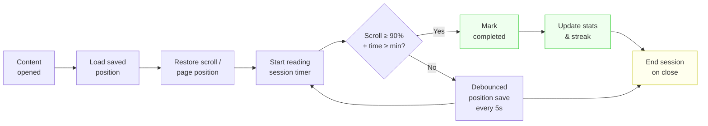

# Blueprint: Content Progress Tracking

<!-- METADATA — structured for agents, useful for humans
tags:        [progress, tracking, bookmarks, reading, completion, streaks]
category:    patterns
difficulty:  intermediate
time:        3 hours
stack:       [flutter, dart, sqlite]
-->

> Track user progress through content — reading position, completion percentage, study streaks, and bookmarks — with offline-first local storage and automatic resume.

## TL;DR

Build an offline-first progress tracking system that resumes users exactly where they left off, detects genuine content completion (not speed-scrolling), records reading sessions, computes daily streaks in the user's local timezone, and surfaces aggregate statistics — all via Riverpod providers backed by SQLite, with no backend required.

## When to Use

- Any app where users consume long-form content: articles, book chapters, lessons, course modules
- When you need resume-on-reopen ("Continue where you left off")
- When engagement metrics matter: streaks, time-on-content, completion rates
- When content is available offline and progress must survive network loss
- **Not** for trivial one-screen content where a boolean "seen" flag is enough
- **Not** when progress must be shared across devices immediately — add a sync layer on top

## Prerequisites

- [ ] Flutter project with `sqflite` (or `drift`) configured
- [ ] `flutter_riverpod` set up with a `ProviderScope` at the app root
- [ ] Familiarity with `WidgetsBindingObserver` for lifecycle events
- [ ] Content rendered with a `ScrollController` (or page-based navigation)

## Overview



## Steps

### 1. Define the progress data model

**Why**: A single `ContentProgress` class covers every content type (article, chapter, lesson). Keeping `lastPosition` as a serialized string lets you store different position strategies — scroll offset, paragraph ID, page number — without schema changes.

```dart
// lib/core/models/content_progress.dart

class ContentProgress {
  const ContentProgress({
    required this.contentId,
    required this.contentType,
    required this.completionPct,
    this.lastPosition,
    required this.lastAccessed,
    this.completedAt,
    required this.accessCount,
    required this.totalTimeSpent,
  });

  final String contentId;
  final String contentType;   // 'article' | 'chapter' | 'lesson'
  final double completionPct; // 0.0 – 1.0
  final String? lastPosition; // serialized: see ContentPosition below
  final DateTime lastAccessed;
  final DateTime? completedAt;
  final int accessCount;
  final Duration totalTimeSpent;

  bool get isCompleted => completedAt != null;
  bool get isStarted => accessCount > 0 && completionPct > 0;
  bool get isNotStarted => accessCount == 0;

  ContentProgress copyWith({
    double? completionPct,
    String? lastPosition,
    DateTime? lastAccessed,
    DateTime? completedAt,
    int? accessCount,
    Duration? totalTimeSpent,
  }) {
    return ContentProgress(
      contentId: contentId,
      contentType: contentType,
      completionPct: completionPct ?? this.completionPct,
      lastPosition: lastPosition ?? this.lastPosition,
      lastAccessed: lastAccessed ?? this.lastAccessed,
      completedAt: completedAt ?? this.completedAt,
      accessCount: accessCount ?? this.accessCount,
      totalTimeSpent: totalTimeSpent ?? this.totalTimeSpent,
    );
  }

  Map<String, dynamic> toRow() => {
        'content_id': contentId,
        'content_type': contentType,
        'completion': completionPct,
        'last_position': lastPosition,
        'last_accessed': lastAccessed.toUtc().toIso8601String(),
        'completed_at': completedAt?.toUtc().toIso8601String(),
        'access_count': accessCount,
        'time_spent_ms': totalTimeSpent.inMilliseconds,
      };

  factory ContentProgress.fromRow(Map<String, dynamic> row) {
    return ContentProgress(
      contentId: row['content_id'] as String,
      contentType: row['content_type'] as String,
      completionPct: (row['completion'] as num).toDouble(),
      lastPosition: row['last_position'] as String?,
      lastAccessed: DateTime.parse(row['last_accessed'] as String).toLocal(),
      completedAt: row['completed_at'] != null
          ? DateTime.parse(row['completed_at'] as String).toLocal()
          : null,
      accessCount: row['access_count'] as int,
      totalTimeSpent: Duration(milliseconds: row['time_spent_ms'] as int),
    );
  }
}
```

Model the serialized position separately so the format can evolve:

```dart
// lib/core/models/content_position.dart

import 'dart:convert';

/// Hybrid position: paragraph/section anchor + fine-grained offset within it.
/// Falls back gracefully when content is updated and an anchor no longer exists.
class ContentPosition {
  const ContentPosition({
    this.anchorId,       // ID of paragraph/section element — robust across content updates
    this.scrollOffset,   // pixel offset as fallback
    this.pageIndex,      // for paginated content
    this.percentage,     // 0.0–1.0, last resort
  });

  final String? anchorId;
  final double? scrollOffset;
  final int? pageIndex;
  final double? percentage;

  String serialize() => jsonEncode({
        if (anchorId != null) 'anchorId': anchorId,
        if (scrollOffset != null) 'scrollOffset': scrollOffset,
        if (pageIndex != null) 'pageIndex': pageIndex,
        if (percentage != null) 'percentage': percentage,
      });

  factory ContentPosition.deserialize(String raw) {
    final map = jsonDecode(raw) as Map<String, dynamic>;
    return ContentPosition(
      anchorId: map['anchorId'] as String?,
      scrollOffset: (map['scrollOffset'] as num?)?.toDouble(),
      pageIndex: map['pageIndex'] as int?,
      percentage: (map['percentage'] as num?)?.toDouble(),
    );
  }

  static ContentPosition? tryDeserialize(String? raw) {
    if (raw == null || raw.isEmpty) return null;
    try {
      return ContentPosition.deserialize(raw);
    } catch (_) {
      return null;
    }
  }
}
```

**Expected outcome**: A type-safe model that round-trips to SQLite and carries all progress metadata in one object.

### 2. Create the database schema and migrations

**Why**: A composite primary key `(content_id, content_type)` means one row per content item across all content types — no separate tables per type. The `reading_sessions` table gives you the raw data to compute per-day time without scanning the main progress table.

```dart
// lib/infrastructure/database/progress_database.dart

import 'package:sqflite/sqflite.dart';
import 'package:path/path.dart';

class ProgressDatabase {
  ProgressDatabase._();

  static ProgressDatabase? _instance;
  static ProgressDatabase get instance => _instance ??= ProgressDatabase._();

  Database? _db;

  Future<Database> get database async {
    _db ??= await _open();
    return _db!;
  }

  Future<Database> _open() async {
    final dbPath = await getDatabasesPath();
    return openDatabase(
      join(dbPath, 'progress.db'),
      version: 1,
      onCreate: _onCreate,
    );
  }

  Future<void> _onCreate(Database db, int version) async {
    await db.execute('''
      CREATE TABLE content_progress (
        content_id    TEXT NOT NULL,
        content_type  TEXT NOT NULL,
        completion    REAL NOT NULL DEFAULT 0.0,
        last_position TEXT,
        last_accessed TEXT NOT NULL,
        completed_at  TEXT,
        access_count  INTEGER NOT NULL DEFAULT 0,
        time_spent_ms INTEGER NOT NULL DEFAULT 0,
        PRIMARY KEY (content_id, content_type)
      )
    ''');

    // Indexes for common query patterns
    await db.execute('''
      CREATE INDEX idx_progress_last_accessed
      ON content_progress(last_accessed DESC)
    ''');
    await db.execute('''
      CREATE INDEX idx_progress_content_type
      ON content_progress(content_type)
    ''');
    await db.execute('''
      CREATE INDEX idx_progress_completed
      ON content_progress(completed_at)
      WHERE completed_at IS NOT NULL
    ''');

    await db.execute('''
      CREATE TABLE reading_sessions (
        id           INTEGER PRIMARY KEY AUTOINCREMENT,
        content_id   TEXT NOT NULL,
        content_type TEXT NOT NULL,
        started_at   TEXT NOT NULL,
        ended_at     TEXT,
        duration_ms  INTEGER
      )
    ''');

    await db.execute('''
      CREATE INDEX idx_sessions_started
      ON reading_sessions(started_at DESC)
    ''');

    await db.execute('''
      CREATE TABLE streak_meta (
        id               INTEGER PRIMARY KEY CHECK (id = 1),
        current_streak   INTEGER NOT NULL DEFAULT 0,
        longest_streak   INTEGER NOT NULL DEFAULT 0,
        last_active_date TEXT
      )
    ''');
    // Ensure exactly one row exists
    await db.insert('streak_meta', {
      'id': 1,
      'current_streak': 0,
      'longest_streak': 0,
      'last_active_date': null,
    });
  }
}
```

**Expected outcome**: A `progress.db` file with three tables and appropriate indexes, created automatically on first launch.

### 3. Build the progress repository

**Why**: Centralising all SQLite reads and writes in one repository keeps the rest of the codebase free of raw SQL. The upsert pattern (`INSERT OR REPLACE` with accumulated values) avoids read-modify-write races.

```dart
// lib/infrastructure/repositories/progress_repository.dart

import 'package:sqflite/sqflite.dart';
import '../../core/models/content_progress.dart';
import '../database/progress_database.dart';

class ProgressRepository {
  ProgressRepository({ProgressDatabase? db})
      : _db = db ?? ProgressDatabase.instance;

  final ProgressDatabase _db;

  // ── Read ────────────────────────────────────────────────────────────────

  Future<ContentProgress?> getProgress(
    String contentId,
    String contentType,
  ) async {
    final db = await _db.database;
    final rows = await db.query(
      'content_progress',
      where: 'content_id = ? AND content_type = ?',
      whereArgs: [contentId, contentType],
      limit: 1,
    );
    if (rows.isEmpty) return null;
    return ContentProgress.fromRow(rows.first);
  }

  Future<List<ContentProgress>> getRecentlyAccessed({int limit = 20}) async {
    final db = await _db.database;
    final rows = await db.query(
      'content_progress',
      orderBy: 'last_accessed DESC',
      limit: limit,
    );
    return rows.map(ContentProgress.fromRow).toList();
  }

  Future<List<ContentProgress>> getInProgress() async {
    final db = await _db.database;
    final rows = await db.rawQuery('''
      SELECT * FROM content_progress
      WHERE completion > 0.0 AND completed_at IS NULL
      ORDER BY last_accessed DESC
    ''');
    return rows.map(ContentProgress.fromRow).toList();
  }

  // ── Write ───────────────────────────────────────────────────────────────

  Future<void> saveProgress(ContentProgress progress) async {
    final db = await _db.database;
    // INSERT OR REPLACE keeps the composite PK unique
    await db.insert(
      'content_progress',
      progress.toRow(),
      conflictAlgorithm: ConflictAlgorithm.replace,
    );
  }

  /// Atomically increment access count and update last_accessed.
  /// Returns the updated row so the caller does not need a second query.
  Future<ContentProgress> recordAccess(
    String contentId,
    String contentType,
  ) async {
    final db = await _db.database;
    final now = DateTime.now();

    await db.transaction((txn) async {
      // Try to insert a fresh row; if it already exists the IGNORE skips it
      await txn.execute('''
        INSERT OR IGNORE INTO content_progress
          (content_id, content_type, completion, last_accessed, access_count, time_spent_ms)
        VALUES (?, ?, 0.0, ?, 0, 0)
      ''', [contentId, contentType, now.toUtc().toIso8601String()]);

      await txn.execute('''
        UPDATE content_progress
        SET access_count  = access_count + 1,
            last_accessed = ?
        WHERE content_id = ? AND content_type = ?
      ''', [now.toUtc().toIso8601String(), contentId, contentType]);
    });

    return (await getProgress(contentId, contentType))!;
  }

  Future<void> updatePosition({
    required String contentId,
    required String contentType,
    required String serializedPosition,
    required double completionPct,
  }) async {
    final db = await _db.database;
    await db.execute('''
      UPDATE content_progress
      SET last_position = ?,
          completion    = ?,
          last_accessed = ?
      WHERE content_id = ? AND content_type = ?
    ''', [
      serializedPosition,
      completionPct,
      DateTime.now().toUtc().toIso8601String(),
      contentId,
      contentType,
    ]);
  }

  Future<void> markCompleted(String contentId, String contentType) async {
    final db = await _db.database;
    final now = DateTime.now().toUtc().toIso8601String();
    await db.execute('''
      UPDATE content_progress
      SET completion   = 1.0,
          completed_at = ?,
          last_accessed = ?
      WHERE content_id = ? AND content_type = ?
    ''', [now, now, contentId, contentType]);
  }

  Future<void> addTimeSpent(
    String contentId,
    String contentType,
    Duration duration,
  ) async {
    final db = await _db.database;
    await db.execute('''
      UPDATE content_progress
      SET time_spent_ms = time_spent_ms + ?
      WHERE content_id = ? AND content_type = ?
    ''', [duration.inMilliseconds, contentId, contentType]);
  }

  // ── Statistics (SQL aggregation, not in-memory) ─────────────────────────

  Future<ProgressStats> getOverallStats() async {
    final db = await _db.database;
    final row = await db.rawQuery('''
      SELECT
        COUNT(*) AS total,
        SUM(CASE WHEN completed_at IS NOT NULL THEN 1 ELSE 0 END) AS completed,
        SUM(CASE WHEN completion > 0 AND completed_at IS NULL THEN 1 ELSE 0 END) AS in_progress,
        SUM(CASE WHEN completion = 0 THEN 1 ELSE 0 END) AS not_started,
        SUM(time_spent_ms) AS total_ms
      FROM content_progress
    ''');
    final r = row.first;
    return ProgressStats(
      total: (r['total'] as int?) ?? 0,
      completed: (r['completed'] as int?) ?? 0,
      inProgress: (r['in_progress'] as int?) ?? 0,
      notStarted: (r['not_started'] as int?) ?? 0,
      totalTimeSpent: Duration(milliseconds: (r['total_ms'] as int?) ?? 0),
    );
  }

  Future<Map<String, double>> completionRateByType() async {
    final db = await _db.database;
    final rows = await db.rawQuery('''
      SELECT
        content_type,
        AVG(completion) AS avg_completion
      FROM content_progress
      GROUP BY content_type
    ''');
    return {
      for (final r in rows)
        r['content_type'] as String: (r['avg_completion'] as num).toDouble(),
    };
  }

  Future<Map<String, Duration>> timeSpentPerDay({int lastDays = 30}) async {
    final db = await _db.database;
    final since = DateTime.now()
        .subtract(Duration(days: lastDays))
        .toUtc()
        .toIso8601String();
    final rows = await db.rawQuery('''
      SELECT
        DATE(started_at) AS day,
        SUM(duration_ms) AS total_ms
      FROM reading_sessions
      WHERE started_at >= ? AND duration_ms IS NOT NULL
      GROUP BY day
      ORDER BY day ASC
    ''', [since]);
    return {
      for (final r in rows)
        r['day'] as String: Duration(milliseconds: (r['total_ms'] as int?) ?? 0),
    };
  }
}

class ProgressStats {
  const ProgressStats({
    required this.total,
    required this.completed,
    required this.inProgress,
    required this.notStarted,
    required this.totalTimeSpent,
  });

  final int total;
  final int completed;
  final int inProgress;
  final int notStarted;
  final Duration totalTimeSpent;

  double get completionRate => total == 0 ? 0 : completed / total;
}
```

**Expected outcome**: All progress I/O goes through typed methods. No raw SQL leaks into feature code.

### 4. Implement session tracking

**Why**: A `ReadingSession` records the exact window of time a user spent with content. Storing sessions separately lets you compute per-day time via SQL without scanning all progress rows. Debouncing position saves at 5-second intervals avoids hammering the database on every scroll event.

```dart
// lib/core/services/reading_session_service.dart

import 'dart:async';
import 'package:flutter/widgets.dart';
import 'package:sqflite/sqflite.dart';
import '../models/content_progress.dart';
import '../models/content_position.dart';
import '../../infrastructure/repositories/progress_repository.dart';
import '../../infrastructure/database/progress_database.dart';

class ReadingSessionService with WidgetsBindingObserver {
  ReadingSessionService({required this.repository});

  final ProgressRepository repository;

  String? _contentId;
  String? _contentType;
  DateTime? _sessionStart;
  DateTime? _backgroundedAt;
  int? _sessionRowId;
  Duration _backgroundedDuration = Duration.zero;

  Timer? _saveTimer;
  ContentPosition? _pendingPosition;
  double _pendingCompletion = 0.0;

  // Minimum time before a session is worth saving (avoids accidental taps)
  static const _minSessionDuration = Duration(seconds: 3);
  // Debounce interval for position saves
  static const _saveInterval = Duration(seconds: 5);

  /// Call when the user opens a piece of content.
  Future<void> startSession(String contentId, String contentType) async {
    await endSession(); // End any previous session cleanly

    _contentId = contentId;
    _contentType = contentType;
    _sessionStart = DateTime.now();
    _backgroundedDuration = Duration.zero;

    WidgetsBinding.instance.addObserver(this);

    final db = await ProgressDatabase.instance.database;
    _sessionRowId = await db.insert('reading_sessions', {
      'content_id': contentId,
      'content_type': contentType,
      'started_at': _sessionStart!.toUtc().toIso8601String(),
    });

    await repository.recordAccess(contentId, contentType);
  }

  /// Call on scroll / page change — debounced, not on every frame.
  void updatePosition(ContentPosition position, double completionPct) {
    _pendingPosition = position;
    _pendingCompletion = completionPct;

    _saveTimer?.cancel();
    _saveTimer = Timer(_saveInterval, _flushPosition);
  }

  Future<void> _flushPosition() async {
    final id = _contentId;
    final type = _contentType;
    final pos = _pendingPosition;
    if (id == null || type == null || pos == null) return;

    await repository.updatePosition(
      contentId: id,
      contentType: type,
      serializedPosition: pos.serialize(),
      completionPct: _pendingCompletion,
    );
  }

  /// Call when the user explicitly marks content as complete, or when
  /// completion is detected automatically.
  Future<void> markCompleted() async {
    final id = _contentId;
    final type = _contentType;
    if (id == null || type == null) return;
    await repository.markCompleted(id, type);
    _pendingCompletion = 1.0;
  }

  /// Call when the user closes the content screen.
  Future<void> endSession() async {
    _saveTimer?.cancel();
    await _flushPosition();

    final id = _contentId;
    final type = _contentType;
    final start = _sessionStart;
    final rowId = _sessionRowId;

    if (id == null || type == null || start == null || rowId == null) return;

    WidgetsBinding.instance.removeObserver(this);

    final now = DateTime.now();
    final wallDuration = now.difference(start);
    final effectiveDuration = wallDuration - _backgroundedDuration;

    if (effectiveDuration >= _minSessionDuration) {
      final db = await ProgressDatabase.instance.database;
      await db.update(
        'reading_sessions',
        {
          'ended_at': now.toUtc().toIso8601String(),
          'duration_ms': effectiveDuration.inMilliseconds,
        },
        where: 'id = ?',
        whereArgs: [rowId],
      );

      await repository.addTimeSpent(id, type, effectiveDuration);
    } else {
      // Delete the session row — it was too short to count
      final db = await ProgressDatabase.instance.database;
      await db.delete('reading_sessions', where: 'id = ?', whereArgs: [rowId]);
    }

    _contentId = null;
    _contentType = null;
    _sessionStart = null;
    _sessionRowId = null;
    _pendingPosition = null;
    _pendingCompletion = 0.0;
    _backgroundedDuration = Duration.zero;
  }

  // ── AppLifecycleObserver ─────────────────────────────────────────────────

  @override
  void didChangeAppLifecycleState(AppLifecycleState state) {
    if (state == AppLifecycleState.paused ||
        state == AppLifecycleState.inactive) {
      _backgroundedAt = DateTime.now();
      // Flush immediately so we don't lose position if the app is killed
      _saveTimer?.cancel();
      _flushPosition();
    } else if (state == AppLifecycleState.resumed) {
      final bg = _backgroundedAt;
      if (bg != null) {
        _backgroundedDuration += DateTime.now().difference(bg);
        _backgroundedAt = null;
      }
    }
  }
}
```

**Expected outcome**: Sessions under 3 seconds are discarded. Position is flushed every 5 seconds and immediately when the app backgrounds. Background time is subtracted from effective reading time.

### 5. Detect completion

**Why**: Completion must represent genuine engagement — not just reaching the bottom of the page on a speed-scroll. The combined scroll + time threshold prevents false positives.

```dart
// lib/features/content/completion_detector.dart

import 'dart:async';

/// Tracks scroll depth and active reading time to detect genuine completion.
/// Does NOT mark completion on the first fast scroll-through.
class CompletionDetector {
  CompletionDetector({
    this.scrollThreshold = 0.90,
    this.minimumReadTime = const Duration(seconds: 30),
    required this.onCompleted,
  });

  /// Fraction of content that must be scrolled past (0.0–1.0).
  final double scrollThreshold;

  /// Minimum wall-clock time (excluding backgrounded) before auto-completion.
  final Duration minimumReadTime;

  /// Callback fires at most once per detector instance.
  final void Function() onCompleted;

  bool _completed = false;
  bool _scrollThresholdReached = false;
  bool _timeThresholdReached = false;

  Timer? _timer;
  Duration _elapsed = Duration.zero;
  DateTime? _lastTick;

  void startTimer() {
    _lastTick = DateTime.now();
    _timer = Timer.periodic(const Duration(seconds: 1), (_) {
      final now = DateTime.now();
      _elapsed += now.difference(_lastTick!);
      _lastTick = now;
      if (_elapsed >= minimumReadTime) {
        _timeThresholdReached = true;
        _tryComplete();
      }
    });
  }

  void pauseTimer() {
    _timer?.cancel();
    _timer = null;
    _lastTick = null;
  }

  void resumeTimer() {
    if (_timer == null && !_completed) startTimer();
  }

  /// Call with the current scroll fraction (0.0–1.0) on each scroll event.
  void onScrollChanged(double fraction) {
    if (fraction >= scrollThreshold) {
      _scrollThresholdReached = true;
      _tryComplete();
    }
  }

  void _tryComplete() {
    if (_completed) return;
    if (_scrollThresholdReached && _timeThresholdReached) {
      _completed = true;
      _timer?.cancel();
      onCompleted();
    }
  }

  /// User explicitly tapped "Mark as complete".
  void forceComplete() {
    if (_completed) return;
    _completed = true;
    _timer?.cancel();
    onCompleted();
  }

  void dispose() {
    _timer?.cancel();
  }
}
```

Wire it into the content screen:

```dart
// lib/features/content/content_screen.dart (excerpt)

class _ContentScreenState extends State<ContentScreen>
    with WidgetsBindingObserver {
  late final ScrollController _scrollController;
  late final ReadingSessionService _session;
  late final CompletionDetector _detector;

  @override
  void initState() {
    super.initState();
    _scrollController = ScrollController()
      ..addListener(_onScroll);

    _session = ref.read(readingSessionServiceProvider);
    _detector = CompletionDetector(
      onCompleted: () async {
        await _session.markCompleted();
        if (mounted) {
          ScaffoldMessenger.of(context).showSnackBar(
            const SnackBar(content: Text('Content completed!')),
          );
        }
      },
    );

    _initSession();
  }

  Future<void> _initSession() async {
    await _session.startSession(widget.contentId, widget.contentType);
    _detector.startTimer();
  }

  void _onScroll() {
    final max = _scrollController.position.maxScrollExtent;
    if (max <= 0) return;
    final fraction = _scrollController.offset / max;
    _session.updatePosition(
      ContentPosition(
        percentage: fraction,
        scrollOffset: _scrollController.offset,
      ),
      fraction.clamp(0.0, 1.0),
    );
    _detector.onScrollChanged(fraction);
  }

  @override
  void didChangeAppLifecycleState(AppLifecycleState state) {
    if (state == AppLifecycleState.paused) {
      _detector.pauseTimer();
    } else if (state == AppLifecycleState.resumed) {
      _detector.resumeTimer();
    }
  }

  @override
  void dispose() {
    _scrollController.dispose();
    _detector.dispose();
    _session.endSession(); // fire-and-forget on screen pop
    super.dispose();
  }
}
```

**Expected outcome**: Completion fires only after the user has scrolled past 90% of the content AND spent at least 30 seconds reading. A "Mark as complete" button calls `forceComplete()` for explicit opt-in.

### 6. Implement streak tracking

**Why**: Streaks are calculated on read, not via a background job — there is no reliable background job in Flutter apps. The calculation compares today's local date against `last_active_date`, applying a one-day grace period so a single missed day does not reset a long streak.

```dart
// lib/core/services/streak_service.dart

import 'package:sqflite/sqflite.dart';
import '../../infrastructure/database/progress_database.dart';

class StreakInfo {
  const StreakInfo({
    required this.currentStreak,
    required this.longestStreak,
    this.lastActiveDate,
    required this.isActiveToday,
  });

  final int currentStreak;
  final int longestStreak;
  final DateTime? lastActiveDate;
  final bool isActiveToday;
}

class StreakService {
  StreakService({ProgressDatabase? db}) : _db = db ?? ProgressDatabase.instance;

  final ProgressDatabase _db;

  /// Call after any content completion or meaningful session end.
  /// Returns the updated streak info.
  Future<StreakInfo> recordActivity() async {
    final db = await _db.database;

    return db.transaction((txn) async {
      final rows = await txn.query('streak_meta', where: 'id = 1', limit: 1);
      final meta = rows.first;

      final current = meta['current_streak'] as int;
      final longest = meta['longest_streak'] as int;
      final lastRaw = meta['last_active_date'] as String?;

      final today = _localDateOnly(DateTime.now());
      final todayStr = _formatDate(today);

      if (lastRaw == todayStr) {
        // Already recorded activity today — nothing changes
        return StreakInfo(
          currentStreak: current,
          longestStreak: longest,
          lastActiveDate: today,
          isActiveToday: true,
        );
      }

      int newStreak;
      if (lastRaw == null) {
        // First ever activity
        newStreak = 1;
      } else {
        final lastDate = DateTime.parse(lastRaw);
        final daysDiff = today.difference(lastDate).inDays;

        if (daysDiff == 1) {
          // Consecutive day
          newStreak = current + 1;
        } else if (daysDiff == 2) {
          // One missed day — streak freeze (grace period)
          newStreak = current + 1;
        } else {
          // Streak broken
          newStreak = 1;
        }
      }

      final newLongest = newStreak > longest ? newStreak : longest;

      await txn.update(
        'streak_meta',
        {
          'current_streak': newStreak,
          'longest_streak': newLongest,
          'last_active_date': todayStr,
        },
        where: 'id = 1',
      );

      return StreakInfo(
        currentStreak: newStreak,
        longestStreak: newLongest,
        lastActiveDate: today,
        isActiveToday: true,
      );
    });
  }

  Future<StreakInfo> getStreak() async {
    final db = await _db.database;
    final rows = await db.query('streak_meta', where: 'id = 1', limit: 1);
    final meta = rows.first;

    final current = meta['current_streak'] as int;
    final longest = meta['longest_streak'] as int;
    final lastRaw = meta['last_active_date'] as String?;

    final today = _localDateOnly(DateTime.now());
    final isActiveToday = lastRaw == _formatDate(today);

    // Compute whether the streak is still alive
    int liveStreak = current;
    if (!isActiveToday && lastRaw != null) {
      final lastDate = DateTime.parse(lastRaw);
      final daysDiff = today.difference(lastDate).inDays;
      if (daysDiff > 2) {
        // Streak expired — show 0 until they complete something today
        liveStreak = 0;
      }
    }

    return StreakInfo(
      currentStreak: liveStreak,
      longestStreak: longest,
      lastActiveDate: lastRaw != null ? DateTime.parse(lastRaw) : null,
      isActiveToday: isActiveToday,
    );
  }

  /// Strip time component — compare dates only in local timezone.
  DateTime _localDateOnly(DateTime dt) =>
      DateTime(dt.year, dt.month, dt.day);

  String _formatDate(DateTime dt) =>
      '${dt.year.toString().padLeft(4, '0')}-'
      '${dt.month.toString().padLeft(2, '0')}-'
      '${dt.day.toString().padLeft(2, '0')}';
}
```

**Expected outcome**: Streak increments once per calendar day (local timezone). A single missed day triggers the grace period instead of a reset. The displayed streak shows 0 if more than 2 days have passed without activity.

### 7. Wire up Riverpod providers

**Why**: Riverpod providers give the UI reactive access to progress without passing repositories down the widget tree. Keeping providers narrow — one per content ID, one aggregate — prevents unnecessary rebuilds.

```dart
// lib/core/providers/progress_providers.dart

import 'package:flutter_riverpod/flutter_riverpod.dart';
import '../../infrastructure/repositories/progress_repository.dart';
import '../../core/models/content_progress.dart';
import '../../core/services/streak_service.dart';
import '../../core/services/reading_session_service.dart';

// ── Infrastructure ───────────────────────────────────────────────────────────

final progressRepositoryProvider = Provider<ProgressRepository>((ref) {
  return ProgressRepository();
});

final streakServiceProvider = Provider<StreakService>((ref) {
  return StreakService();
});

final readingSessionServiceProvider = Provider<ReadingSessionService>((ref) {
  final repo = ref.read(progressRepositoryProvider);
  final service = ReadingSessionService(repository: repo);
  ref.onDispose(service.endSession);
  return service;
});

// ── Per-content progress ─────────────────────────────────────────────────────

final contentProgressProvider = FutureProvider.family<ContentProgress?, (String, String)>(
  (ref, args) async {
    final (contentId, contentType) = args;
    final repo = ref.read(progressRepositoryProvider);
    return repo.getProgress(contentId, contentType);
  },
);

// ── Aggregate stats ──────────────────────────────────────────────────────────

final overallProgressProvider = FutureProvider<ProgressStats>((ref) async {
  final repo = ref.read(progressRepositoryProvider);
  return repo.getOverallStats();
});

final recentlyAccessedProvider = FutureProvider<List<ContentProgress>>((ref) async {
  final repo = ref.read(progressRepositoryProvider);
  return repo.getRecentlyAccessed(limit: 20);
});

final inProgressProvider = FutureProvider<List<ContentProgress>>((ref) async {
  final repo = ref.read(progressRepositoryProvider);
  return repo.getInProgress();
});

final completionRateByTypeProvider = FutureProvider<Map<String, double>>((ref) async {
  final repo = ref.read(progressRepositoryProvider);
  return repo.completionRateByType();
});

// ── Streak ───────────────────────────────────────────────────────────────────

final streakProvider = FutureProvider<StreakInfo>((ref) async {
  final service = ref.read(streakServiceProvider);
  return service.getStreak();
});
```

Consume in the UI — reading position example:

```dart
// lib/features/content/content_screen.dart (provider consumption)

class ContentScreen extends ConsumerWidget {
  const ContentScreen({
    super.key,
    required this.contentId,
    required this.contentType,
  });

  final String contentId;
  final String contentType;

  @override
  Widget build(BuildContext context, WidgetRef ref) {
    final progressAsync = ref.watch(
      contentProgressProvider((contentId, contentType)),
    );

    return progressAsync.when(
      loading: () => const Scaffold(body: Center(child: CircularProgressIndicator())),
      error: (e, _) => Scaffold(body: Center(child: Text('Error: $e'))),
      data: (progress) => _ContentView(
        contentId: contentId,
        contentType: contentType,
        resumePosition: progress?.lastPosition != null
            ? ContentPosition.tryDeserialize(progress!.lastPosition)
            : null,
      ),
    );
  }
}
```

Invalidate providers after progress changes so the home screen refreshes:

```dart
// After marking completed or saving progress:
ref.invalidate(contentProgressProvider((contentId, contentType)));
ref.invalidate(overallProgressProvider);
ref.invalidate(streakProvider);
```

**Expected outcome**: The home screen's "Continue reading" list and the stats dashboard update automatically when any content's progress changes.

### 8. Build the progress dashboard UI

**Why**: Showing aggregate stats in one screen motivates continued engagement. All numbers come from SQL aggregation queries — no O(n) in-memory loops.

```dart
// lib/features/progress/progress_dashboard.dart

import 'package:flutter/material.dart';
import 'package:flutter_riverpod/flutter_riverpod.dart';
import '../../core/providers/progress_providers.dart';

class ProgressDashboard extends ConsumerWidget {
  const ProgressDashboard({super.key});

  @override
  Widget build(BuildContext context, WidgetRef ref) {
    final statsAsync = ref.watch(overallProgressProvider);
    final streakAsync = ref.watch(streakProvider);
    final inProgressAsync = ref.watch(inProgressProvider);

    return Scaffold(
      appBar: AppBar(title: const Text('My Progress')),
      body: RefreshIndicator(
        onRefresh: () async {
          ref.invalidate(overallProgressProvider);
          ref.invalidate(streakProvider);
          ref.invalidate(inProgressProvider);
        },
        child: ListView(
          padding: const EdgeInsets.all(16),
          children: [
            // Streak card
            streakAsync.when(
              loading: () => const _StatCardSkeleton(),
              error: (_, __) => const SizedBox.shrink(),
              data: (streak) => _StreakCard(streak: streak),
            ),
            const SizedBox(height: 16),

            // Overall stats
            statsAsync.when(
              loading: () => const _StatCardSkeleton(),
              error: (_, __) => const SizedBox.shrink(),
              data: (stats) => _StatsGrid(stats: stats),
            ),
            const SizedBox(height: 24),

            // Continue reading
            Text('Continue Reading',
                style: Theme.of(context).textTheme.titleMedium),
            const SizedBox(height: 8),
            inProgressAsync.when(
              loading: () => const Center(child: CircularProgressIndicator()),
              error: (_, __) => const SizedBox.shrink(),
              data: (items) => items.isEmpty
                  ? const _EmptyInProgress()
                  : Column(
                      children: items
                          .map((p) => _ProgressTile(progress: p))
                          .toList(),
                    ),
            ),
          ],
        ),
      ),
    );
  }
}

class _StreakCard extends StatelessWidget {
  const _StreakCard({required this.streak});

  final StreakInfo streak;

  @override
  Widget build(BuildContext context) {
    return Card(
      child: Padding(
        padding: const EdgeInsets.all(16),
        child: Row(
          children: [
            Text(
              '🔥',
              style: Theme.of(context).textTheme.displaySmall,
            ),
            const SizedBox(width: 16),
            Column(
              crossAxisAlignment: CrossAxisAlignment.start,
              children: [
                Text(
                  '${streak.currentStreak} day streak',
                  style: Theme.of(context)
                      .textTheme
                      .headlineSmall
                      ?.copyWith(fontWeight: FontWeight.bold),
                ),
                Text(
                  'Longest: ${streak.longestStreak} days',
                  style: Theme.of(context).textTheme.bodySmall,
                ),
              ],
            ),
            const Spacer(),
            if (streak.isActiveToday)
              Chip(
                label: const Text('Done today'),
                backgroundColor: Colors.green.shade100,
              ),
          ],
        ),
      ),
    );
  }
}

class _StatsGrid extends StatelessWidget {
  const _StatsGrid({required this.stats});

  final ProgressStats stats;

  @override
  Widget build(BuildContext context) {
    return GridView.count(
      crossAxisCount: 2,
      shrinkWrap: true,
      physics: const NeverScrollableScrollPhysics(),
      mainAxisSpacing: 8,
      crossAxisSpacing: 8,
      childAspectRatio: 1.8,
      children: [
        _StatTile(label: 'Completed', value: '${stats.completed}'),
        _StatTile(label: 'In Progress', value: '${stats.inProgress}'),
        _StatTile(
          label: 'Completion Rate',
          value: '${(stats.completionRate * 100).round()}%',
        ),
        _StatTile(
          label: 'Time Spent',
          value: _formatDuration(stats.totalTimeSpent),
        ),
      ],
    );
  }

  String _formatDuration(Duration d) {
    if (d.inHours > 0) return '${d.inHours}h ${d.inMinutes.remainder(60)}m';
    return '${d.inMinutes}m';
  }
}

class _StatTile extends StatelessWidget {
  const _StatTile({required this.label, required this.value});

  final String label;
  final String value;

  @override
  Widget build(BuildContext context) {
    return Card(
      child: Padding(
        padding: const EdgeInsets.all(12),
        child: Column(
          mainAxisAlignment: MainAxisAlignment.center,
          children: [
            Text(value,
                style: Theme.of(context)
                    .textTheme
                    .headlineSmall
                    ?.copyWith(fontWeight: FontWeight.bold)),
            Text(label, style: Theme.of(context).textTheme.bodySmall),
          ],
        ),
      ),
    );
  }
}

class _ProgressTile extends StatelessWidget {
  const _ProgressTile({required this.progress});

  final ContentProgress progress;

  @override
  Widget build(BuildContext context) {
    return ListTile(
      title: Text(progress.contentId), // Replace with content title lookup
      subtitle: Column(
        crossAxisAlignment: CrossAxisAlignment.start,
        children: [
          const SizedBox(height: 4),
          LinearProgressIndicator(value: progress.completionPct),
          const SizedBox(height: 2),
          Text('${(progress.completionPct * 100).round()}% complete'),
        ],
      ),
    );
  }
}

class _EmptyInProgress extends StatelessWidget {
  const _EmptyInProgress();

  @override
  Widget build(BuildContext context) {
    return const Padding(
      padding: EdgeInsets.symmetric(vertical: 32),
      child: Center(child: Text('Nothing in progress yet.')),
    );
  }
}

class _StatCardSkeleton extends StatelessWidget {
  const _StatCardSkeleton();

  @override
  Widget build(BuildContext context) {
    return const Card(child: SizedBox(height: 80));
  }
}
```

**Expected outcome**: A dashboard that shows streak, aggregate counts, completion rate, total time, and a "Continue Reading" list — all populated from SQL aggregation with no in-memory loops.

## Variants

<details>
<summary><strong>Variant: Course / lesson progress (nested content)</strong></summary>

Courses contain modules, modules contain lessons. Completion of the course derives from its children — not a single scroll event.

**Schema addition:**

```sql
-- Track which lessons belong to which course (optional — can live in app config)
CREATE TABLE course_structure (
  course_id  TEXT NOT NULL,
  module_id  TEXT NOT NULL,
  lesson_id  TEXT NOT NULL,
  weight     REAL NOT NULL DEFAULT 1.0,  -- relative length weight
  PRIMARY KEY (course_id, lesson_id)
);
```

**Weighted completion calculation** (run via SQL so it scales):

```dart
Future<double> computeCourseCompletion(String courseId) async {
  final db = await ProgressDatabase.instance.database;
  final rows = await db.rawQuery('''
    SELECT
      SUM(cs.weight) AS total_weight,
      SUM(cs.weight * COALESCE(cp.completion, 0.0)) AS weighted_done
    FROM course_structure cs
    LEFT JOIN content_progress cp
      ON cp.content_id = cs.lesson_id
     AND cp.content_type = 'lesson'
    WHERE cs.course_id = ?
  ''', [courseId]);

  final r = rows.first;
  final total = (r['total_weight'] as num?)?.toDouble() ?? 0;
  if (total == 0) return 0;
  return ((r['weighted_done'] as num?)?.toDouble() ?? 0) / total;
}
```

**Key difference from reading progress**: Completion is derived, never set directly. Marking a lesson complete triggers a re-computation of its module and course completion percentages. Use a Riverpod `FutureProvider.family<double, String>` for `courseCompletionProvider(courseId)` and invalidate it whenever a child lesson is updated.

**Gotcha**: Weight lessons by their estimated reading time or word count — not by count. A 1-minute quiz and a 30-minute video each counting as "1 lesson" skews the percentage.

</details>

<details>
<summary><strong>Variant: Reading progress for paginated content (e-book style)</strong></summary>

For paginated content (PDF-style or custom `PageView`), scroll-based detection does not apply. Use page index as the primary position.

```dart
// Position saved on every page turn — pages are cheap to save
void _onPageChanged(int pageIndex, int totalPages) {
  final fraction = totalPages > 0 ? pageIndex / totalPages : 0.0;
  _session.updatePosition(
    ContentPosition(pageIndex: pageIndex, percentage: fraction),
    fraction,
  );
  _detector.onScrollChanged(fraction);
}
```

**Resume position:**

```dart
// On content open — jump to saved page
final pos = ContentPosition.tryDeserialize(progress?.lastPosition);
if (pos?.pageIndex != null) {
  _pageController.jumpToPage(pos!.pageIndex!);
}
```

**Completion threshold**: Use `pageIndex >= totalPages - 1` (last page reached) instead of scroll percentage. Still require minimum time.

**Percentage for nested course**: Weight by page count, not chapter count. A 2-page chapter and a 50-page chapter should not have equal weight.

</details>

## Gotchas

> **Scroll offset breaks after content updates**: If the article is re-published with different content, a saved pixel offset will scroll to the wrong paragraph. **Fix**: Use paragraph or section IDs as the primary position anchor. Fall back to percentage if the anchor ID is not found. Never rely on raw pixel offsets as the only position strategy.

> **Time tracking inflates when app is backgrounded**: If the user takes a phone call mid-read, that 10-minute call adds to their "reading time". **Fix**: Subscribe to `AppLifecycleState` changes via `WidgetsBindingObserver`. Record `_backgroundedAt` on pause and subtract the gap on resume before accumulating session time.

> **Streak calculation at day boundary**: A user reading at 23:59 should count for "today". If you store times in UTC and compare UTC dates, a user in UTC-5 reading at 23:59 local time would have a UTC date of the next day. **Fix**: Always use the device's local timezone for "day" comparisons. `DateTime.now()` (no `.utc`) gives the local time. Store `last_active_date` as a `YYYY-MM-DD` local date string, not a UTC timestamp.

> **Auto-completing on first fast scroll**: A user who scrolls quickly to check the length of an article should not have it marked complete. **Fix**: Require both the scroll threshold AND minimum time threshold to be satisfied concurrently. The `CompletionDetector` enforces this; do not bypass it.

> **Accidental tap sessions inflating stats**: A user briefly opens content, realizes it's the wrong item, and backs out in 1 second. This should not count as a session or add to time spent. **Fix**: The `ReadingSessionService` checks `effectiveDuration >= _minSessionDuration` (3 seconds) before persisting the session and deletes the session row if too short.

> **Large progress tables**: At 10,000+ rows, `ORDER BY last_accessed DESC` without an index full-scans the table. **Fix**: The schema in Step 2 creates `idx_progress_last_accessed` at table creation. Add `idx_progress_content_type` for type-filtered queries. For apps with 100k+ rows, also consider a TTL cleanup job that archives or deletes progress older than N months.

> **Completion percentage for nested content weighted by count, not length**: If a course has 10 short lessons and 1 long lesson, treating each as 1/11th of the course makes the long lesson disproportionately cheap to "complete." **Fix**: Assign weights proportional to estimated reading time or word count. Use `SUM(weight * completion) / SUM(weight)` (see the Course variant above).

> **`ref.invalidate` not called after progress save**: The progress repository saves to SQLite, but the Riverpod `FutureProvider` caches its last value and will not refetch unless invalidated. **Fix**: After any `saveProgress`, `markCompleted`, or `addTimeSpent` call, invalidate the relevant providers — `contentProgressProvider`, `overallProgressProvider`, `streakProvider`.

## Checklist

- [ ] `ContentProgress` model round-trips through SQLite without data loss
- [ ] Composite primary key `(content_id, content_type)` is used — no duplicate rows per item
- [ ] Indexes on `last_accessed`, `content_type`, and `completed_at` exist in the schema
- [ ] `reading_sessions` table captures start, end, and effective duration (backgrounded time subtracted)
- [ ] Sessions shorter than 3 seconds are deleted — accidental taps do not inflate stats
- [ ] Position is saved via debounce (every 5s), not on every scroll frame
- [ ] Position is flushed immediately when the app backgrounds (`AppLifecycleState.paused`)
- [ ] `ContentPosition` uses anchor ID as primary strategy, scroll offset / percentage as fallback
- [ ] Completion requires both scroll threshold (90%) AND minimum time threshold (30s)
- [ ] Explicit "Mark as complete" button bypasses automatic threshold check
- [ ] Streak uses local timezone date strings, not UTC timestamps
- [ ] Streak grace period allows 1 missed day without reset
- [ ] Displayed streak shows 0 if more than 2 days have passed without activity
- [ ] All aggregate stats (counts, rates, time) computed by SQL, not in-memory loops
- [ ] Riverpod providers are invalidated after any progress mutation
- [ ] For nested course content, completion is weighted by content length, not item count

## Artifacts

| Artifact | Location | Description |
|----------|----------|-------------|
| Progress model | `lib/core/models/content_progress.dart` | Typed model with SQLite round-trip |
| Position model | `lib/core/models/content_position.dart` | Hybrid anchor + offset position, serialized to JSON |
| Database setup | `lib/infrastructure/database/progress_database.dart` | SQLite open + migration with indexes |
| Progress repository | `lib/infrastructure/repositories/progress_repository.dart` | All read/write/aggregate queries |
| Session service | `lib/core/services/reading_session_service.dart` | Session start/end, debounced position save, lifecycle observer |
| Completion detector | `lib/features/content/completion_detector.dart` | Scroll + time threshold logic |
| Streak service | `lib/core/services/streak_service.dart` | Daily streak with grace period, local timezone |
| Riverpod providers | `lib/core/providers/progress_providers.dart` | All providers: per-item, aggregate, streak |
| Progress dashboard | `lib/features/progress/progress_dashboard.dart` | Stats UI: streak card, grid, continue-reading list |

## References

- [sqflite pub.dev](https://pub.dev/packages/sqflite) — SQLite plugin for Flutter
- [SQLite partial indexes](https://www.sqlite.org/partialindex.html) — `WHERE completed_at IS NOT NULL` index used in schema
- [WidgetsBindingObserver](https://api.flutter.dev/flutter/widgets/WidgetsBindingObserver-class.html) — lifecycle events for backgrounded time tracking
- [flutter_riverpod FutureProvider.family](https://riverpod.dev/docs/providers/future_provider) — per-content-ID reactive providers
- [Service Layer Pattern](service-layer-pattern.md) — interface-based dependencies and repository abstractions
- [Search Implementation](search-implementation.md) — companion blueprint for querying content
