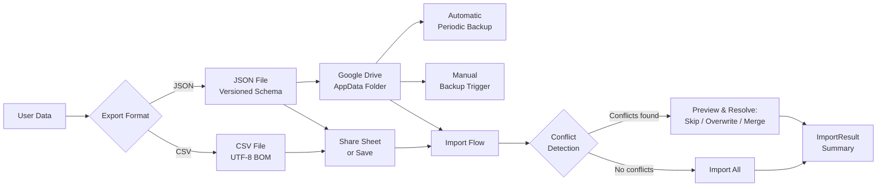

# Blueprint: Data Export/Import & Backup

<!-- METADATA — structured for agents, useful for humans
tags:        [export, import, backup, csv, json, google-drive, cloud-backup]
category:    patterns
difficulty:  intermediate
time:        2-3 hours
stack:       [flutter, dart]
-->

> CSV/JSON export, import with conflict detection, and cloud backup to Google Drive so users never lose data and can move it anywhere.

## TL;DR

Build a data portability layer that exports to CSV (for spreadsheet users) and JSON (for full-fidelity backup), imports with conflict detection and resolution strategies, and backs up automatically to Google Drive's AppData folder. After following this blueprint you will have a complete export/import/backup pipeline with progress indicators, conflict previews, and share sheet integration.

## When to Use

- Your app stores meaningful user data (transactions, notes, habits, etc.) that users expect to keep forever.
- Users ask "can I export to Excel?" or "how do I back up my data?".
- You need device migration support or cross-device sync without building a full backend.
- When **not** to use: apps with trivial/ephemeral data (calculators, timers), or apps that already sync through a server-side database.

## Prerequisites

- [ ] Dart 3.0+ with a Flutter project that has a local database (SQLite, Hive, Drift, etc.).
- [ ] `path_provider` and `share_plus` packages for file system access and share sheet.
- [ ] `googleapis` and `google_sign_in` packages for Google Drive integration.
- [ ] A Google Cloud project with the Drive API enabled and OAuth consent screen configured.

## Overview



## Steps

### 1. Design the export format and metadata header

**Why**: A versioned metadata header lets you evolve the export format without breaking older files. Without it, you cannot distinguish a v1 export from a v2 export, and imports will silently corrupt data when the schema changes.

Define a metadata structure that every export file includes:

```dart
class ExportMetadata {
  const ExportMetadata({
    required this.formatVersion,
    required this.appVersion,
    required this.exportedAt,
    required this.recordCount,
  });

  final int formatVersion;        // Schema version, increment on breaking changes
  final String appVersion;        // e.g. "2.4.1+42"
  final DateTime exportedAt;      // UTC timestamp
  final int recordCount;          // For integrity check on import

  Map<String, dynamic> toJson() => {
    'formatVersion': formatVersion,
    'appVersion': appVersion,
    'exportedAt': exportedAt.toUtc().toIso8601String(),
    'recordCount': recordCount,
  };

  factory ExportMetadata.fromJson(Map<String, dynamic> json) => ExportMetadata(
    formatVersion: json['formatVersion'] as int,
    appVersion: json['appVersion'] as String,
    exportedAt: DateTime.parse(json['exportedAt'] as String),
    recordCount: json['recordCount'] as int,
  );
}
```

For CSV, encode the metadata as a comment header row. For JSON, embed it as a top-level `_metadata` key.

**Expected outcome**: A shared `ExportMetadata` class used by both CSV and JSON exporters. Every export file is self-describing.

### 2. Implement CSV export with Excel compatibility

**Why**: Most users who want to "export data" mean "open it in Excel or Google Sheets". CSV is the universal interchange format for tabular data, but Excel specifically requires a UTF-8 BOM (`\uFEFF`) prefix to detect the encoding correctly. Without it, accented characters, currency symbols, and emoji render as garbled text.

```dart
class CsvExporter {
  /// Exports records to a CSV string with UTF-8 BOM for Excel compatibility.
  String export(List<Transaction> transactions, ExportMetadata metadata) {
    final buffer = StringBuffer();

    // UTF-8 BOM — required for Excel to detect encoding correctly.
    buffer.write('\uFEFF');

    // Metadata as a comment line (optional, some parsers skip # lines).
    buffer.writeln('# Exported: ${metadata.exportedAt.toIso8601String()} '
        '| Format: v${metadata.formatVersion} '
        '| Records: ${metadata.recordCount}');

    // Header row — fixed column order for stable imports.
    buffer.writeln('id,date,amount,currency,category,description,tags');

    // Data rows.
    for (final tx in transactions) {
      buffer.writeln([
        tx.id,
        tx.date.toIso8601String(),          // ISO 8601 — unambiguous date format
        tx.amount.toStringAsFixed(2),
        tx.currency,
        _escapeCsv(tx.category),
        _escapeCsv(tx.description),
        _escapeCsv(tx.tags.join(';')),       // Multi-value field with semicolon
      ].join(','));
    }

    return buffer.toString();
  }

  /// RFC 4180 CSV escaping: wrap in quotes if value contains comma,
  /// newline, or quote. Double-quote any internal quotes.
  String _escapeCsv(String value) {
    if (value.contains(RegExp(r'[,"\n\r]'))) {
      return '"${value.replaceAll('"', '""')}"';
    }
    return value;
  }
}
```

Key decisions:
- **Column order is fixed and documented** — changing order is a breaking change requiring a format version bump.
- **Dates use ISO 8601** (`2025-03-15T10:30:00Z`) — never locale-dependent formats like "3/15/25".
- **Multi-value fields use semicolons** — commas would conflict with the CSV delimiter.
- **Amounts use fixed decimal places** — `10.50`, not `10.5`, for consistent parsing.

**Expected outcome**: A `.csv` file that opens correctly in Excel (Windows and Mac), Google Sheets, and Numbers with all characters intact.

### 3. Implement JSON export for full-fidelity backup

**Why**: CSV flattens your data into rows and loses relationships, nested objects, and type information. JSON preserves the full object graph including foreign keys, enums, nested lists, and metadata. This is the format you use for backup/restore where zero data loss matters.

```dart
class JsonExporter {
  /// Exports the full user data set as a versioned JSON document.
  Future<String> export(UserData data) async {
    final metadata = ExportMetadata(
      formatVersion: 3,
      appVersion: appInfo.version,
      exportedAt: DateTime.now().toUtc(),
      recordCount: data.totalRecordCount,
    );

    final document = {
      '_metadata': metadata.toJson(),
      'accounts': data.accounts.map((a) => a.toJson()).toList(),
      'categories': data.categories.map((c) => c.toJson()).toList(),
      'transactions': data.transactions.map((t) => t.toJson()).toList(),
      'budgets': data.budgets.map((b) => b.toJson()).toList(),
      'tags': data.tags.map((t) => t.toJson()).toList(),
      'settings': data.settings.toJson(),
    };

    // Pretty-print for human readability and diffability.
    const encoder = JsonEncoder.withIndent('  ');
    return encoder.convert(document);
  }
}
```

Include every entity and relationship. The JSON export is the "source of truth" format — if a user restores from JSON, they should get back exactly what they had.

**Expected outcome**: A `.json` file containing all user data with preserved relationships, readable in any text editor, and parseable by any JSON library.

### 4. Build import with conflict detection

**Why**: Import without conflict detection is destructive — it silently overwrites data the user created since the export. Users expect to see what will change before it happens, and they expect a choice: skip duplicates, overwrite with imported data, or merge fields intelligently.

```dart
/// Outcome of an import operation.
class ImportResult {
  final int created;
  final int updated;
  final int skipped;
  final List<ImportConflict> conflicts;
  final List<String> errors;

  bool get hasConflicts => conflicts.isNotEmpty;
  bool get hasErrors => errors.isNotEmpty;
  int get total => created + updated + skipped;
}

class ImportConflict {
  final String entityType;  // "transaction", "category", etc.
  final String entityId;
  final Map<String, dynamic> existing;
  final Map<String, dynamic> incoming;
  final List<String> differingFields;
}

enum ConflictStrategy { skip, overwrite, merge }

class DataImporter {
  /// Phase 1: Analyze the import file and detect conflicts without writing.
  Future<ImportPreview> preview(String jsonContent) async {
    final document = jsonDecode(jsonContent) as Map<String, dynamic>;
    final metadata = ExportMetadata.fromJson(document['_metadata']);

    // Validate format version — reject incompatible future versions.
    if (metadata.formatVersion > currentFormatVersion) {
      return ImportPreview.incompatible(
        'Export format v${metadata.formatVersion} requires app update.',
      );
    }

    // Run migration if needed for older format versions.
    final migrated = _migrateIfNeeded(document, metadata.formatVersion);

    // Detect conflicts by checking each record ID against existing data.
    final conflicts = <ImportConflict>[];
    for (final txJson in migrated['transactions'] as List) {
      final id = txJson['id'] as String;
      final existing = await _transactionRepo.findById(id);
      if (existing != null) {
        final differingFields = _findDifferences(existing.toJson(), txJson);
        if (differingFields.isNotEmpty) {
          conflicts.add(ImportConflict(
            entityType: 'transaction',
            entityId: id,
            existing: existing.toJson(),
            incoming: txJson,
            differingFields: differingFields,
          ));
        }
      }
    }

    return ImportPreview(
      metadata: metadata,
      newRecords: newCount,
      conflictingRecords: conflicts,
      totalRecords: metadata.recordCount,
    );
  }

  /// Phase 2: Execute the import with the chosen conflict strategy.
  Future<ImportResult> execute(
    String jsonContent,
    ConflictStrategy strategy,
  ) async {
    var created = 0, updated = 0, skipped = 0;
    final errors = <String>[];

    // Wrap in a database transaction for atomicity.
    await _database.transaction(() async {
      for (final txJson in transactions) {
        final id = txJson['id'] as String;
        final existing = await _transactionRepo.findById(id);

        if (existing == null) {
          await _transactionRepo.create(Transaction.fromJson(txJson));
          created++;
        } else {
          switch (strategy) {
            case ConflictStrategy.skip:
              skipped++;
            case ConflictStrategy.overwrite:
              await _transactionRepo.update(Transaction.fromJson(txJson));
              updated++;
            case ConflictStrategy.merge:
              final merged = _mergeRecords(existing.toJson(), txJson);
              await _transactionRepo.update(Transaction.fromJson(merged));
              updated++;
          }
        }
      }
    });

    return ImportResult(
      created: created,
      updated: updated,
      skipped: skipped,
      conflicts: [],
      errors: errors,
    );
  }
}
```

The two-phase approach (preview then execute) is critical. Never jump straight to writing.

**Expected outcome**: Import shows a preview screen listing new records, conflicts with field-level diffs, and lets the user choose a resolution strategy before any data is written.

### 5. Add cloud backup to Google Drive AppData folder

**Why**: Local-only backups are lost when the phone is lost, stolen, or factory-reset. Google Drive's AppData folder provides free, invisible cloud storage scoped to your app. Users authenticate once with Google Sign-In and backups happen automatically. The AppData folder is not visible in the Drive UI, so it does not clutter the user's files.

```dart
class GoogleDriveBackup {
  static const _backupFileName = 'budget_backup.json';
  static const _appDataSpace = 'appDataFolder';

  final GoogleSignIn _googleSignIn = GoogleSignIn(
    scopes: [drive.DriveApi.driveAppdataScope],
  );

  /// Upload a backup to Google Drive AppData folder.
  Future<Result<BackupInfo, AppFailure>> backup(String jsonContent) async {
    try {
      final account = await _googleSignIn.signIn();
      if (account == null) {
        return Result.err(
          const AuthFailure(message: 'Google Sign-In cancelled'),
        );
      }

      final authHeaders = await account.authHeaders;
      final client = GoogleAuthClient(authHeaders);
      final driveApi = drive.DriveApi(client);

      // Check for existing backup to update (not create duplicates).
      final existing = await _findExistingBackup(driveApi);

      final media = drive.Media(
        Stream.value(utf8.encode(jsonContent)),
        utf8.encode(jsonContent).length,
      );

      drive.File result;
      if (existing != null) {
        // Update existing file.
        result = await driveApi.files.update(
          drive.File()..name = _backupFileName,
          existing.id!,
          uploadMedia: media,
        );
      } else {
        // Create new file in appDataFolder.
        result = await driveApi.files.create(
          drive.File()
            ..name = _backupFileName
            ..parents = [_appDataSpace],
          uploadMedia: media,
        );
      }

      return Result.ok(BackupInfo(
        id: result.id!,
        timestamp: DateTime.now().toUtc(),
        sizeBytes: utf8.encode(jsonContent).length,
      ));
    } catch (e, stack) {
      AppLogger.error('Drive backup failed', error: e, stackTrace: stack);
      return Result.err(StorageFailure(
        message: 'Backup to Google Drive failed',
        cause: e,
        stackTrace: stack,
      ));
    }
  }

  /// List available backups with metadata.
  Future<Result<List<BackupInfo>, AppFailure>> listBackups() async {
    final driveApi = await _authenticatedDriveApi();
    final fileList = await driveApi.files.list(
      spaces: _appDataSpace,
      q: "name = '$_backupFileName'",
      $fields: 'files(id, name, modifiedTime, size)',
      orderBy: 'modifiedTime desc',
    );

    return Result.ok(
      fileList.files?.map((f) => BackupInfo.fromDriveFile(f)).toList() ?? [],
    );
  }
}
```

For automatic periodic backup, schedule it after meaningful data changes:

```dart
class BackupScheduler {
  static const _minBackupInterval = Duration(hours: 24);

  /// Call after every write operation (transaction created, category updated, etc.)
  Future<void> onDataChanged() async {
    final lastBackup = await _prefs.getLastBackupTime();
    if (lastBackup == null ||
        DateTime.now().difference(lastBackup) > _minBackupInterval) {
      // Run in background — do not block UI.
      unawaited(_performBackup());
    }
  }

  Future<void> _performBackup() async {
    final jsonContent = await _jsonExporter.export(await _userData.getAll());
    final result = await _driveBackup.backup(jsonContent);
    switch (result) {
      case Ok(:final value):
        await _prefs.setLastBackupTime(value.timestamp);
        AppLogger.info('Auto-backup completed', {'size': value.sizeBytes});
      case Err(:final error):
        AppLogger.warning('Auto-backup failed', error: error);
        // Do not bother the user — retry next interval.
    }
  }
}
```

**Expected outcome**: Backups upload to Google Drive without user intervention. A manual "Back Up Now" button is also available. Backup status (last backup time, size) is visible in settings.

### 6. Build the restore flow

**Why**: Restore is the most dangerous operation in the app — it replaces user data. A careless restore flow that overwrites without confirmation will cause data loss and angry reviews. The flow must be: select backup, preview what it contains, show what will be overwritten, confirm, then restore.

```dart
class RestoreFlow {
  /// Step 1: Let user select a backup.
  Future<BackupInfo?> selectBackup() async {
    final backups = await _driveBackup.listBackups();
    return switch (backups) {
      Ok(:final value) => await _showBackupPicker(value),
      Err(:final error) => throw error, // handled by caller
    };
  }

  /// Step 2: Download and preview contents.
  Future<ImportPreview> previewBackup(BackupInfo backup) async {
    final content = await _driveBackup.download(backup.id);
    return _importer.preview(content);
  }

  /// Step 3: Show confirmation dialog with impact summary.
  Future<bool> confirmRestore(ImportPreview preview) async {
    return showDialog<bool>(
      context: _context,
      builder: (ctx) => AlertDialog(
        title: const Text('Restore Backup?'),
        content: Column(
          mainAxisSize: MainAxisSize.min,
          crossAxisAlignment: CrossAxisAlignment.start,
          children: [
            Text('Backup from: ${preview.metadata.exportedAt}'),
            Text('Records: ${preview.metadata.recordCount}'),
            const SizedBox(height: 12),
            if (preview.conflictingRecords.isNotEmpty)
              Text(
                '${preview.conflictingRecords.length} existing records '
                'will be overwritten.',
                style: const TextStyle(color: Colors.orange),
              ),
            Text('${preview.newRecords} new records will be added.'),
          ],
        ),
        actions: [
          TextButton(
            onPressed: () => Navigator.pop(ctx, false),
            child: const Text('Cancel'),
          ),
          FilledButton(
            onPressed: () => Navigator.pop(ctx, true),
            child: const Text('Restore'),
          ),
        ],
      ),
    ) ?? false;
  }

  /// Step 4: Execute restore.
  Future<ImportResult> executeRestore(
    String content,
    ConflictStrategy strategy,
  ) async {
    // Create a local backup before restoring, as a safety net.
    await _createLocalSafetyBackup();
    return _importer.execute(content, strategy);
  }
}
```

Always create a local safety backup before restoring. If the restore goes wrong, the user can recover.

**Expected outcome**: A multi-step restore flow: pick backup, preview contents and conflicts, confirm with impact summary, restore with automatic safety backup.

### 7. Wire up share sheet and file picker for portability

**Why**: Export is only useful if users can get the file out of the app. Share sheet lets them send it via email, AirDrop, save to Files, or upload to any cloud service. File picker lets them import from any source. Correct MIME types ensure the OS shows the right app suggestions.

```dart
class ShareExport {
  /// Share an export file via the system share sheet.
  Future<void> shareFile(String content, ExportFormat format) async {
    final tempDir = await getTemporaryDirectory();
    final extension = format == ExportFormat.csv ? 'csv' : 'json';
    final mimeType = format == ExportFormat.csv
        ? 'text/csv'
        : 'application/json';
    final timestamp = DateFormat('yyyy-MM-dd').format(DateTime.now());
    final fileName = 'budget_export_$timestamp.$extension';

    final file = File('${tempDir.path}/$fileName');
    await file.writeAsString(content, encoding: utf8);

    await Share.shareXFiles(
      [XFile(file.path, mimeType: mimeType)],
      subject: 'Budget Export — $timestamp',
    );
  }

  /// Pick a file for import using the system file picker.
  Future<String?> pickImportFile() async {
    final result = await FilePicker.platform.pickFiles(
      type: FileType.custom,
      allowedExtensions: ['json', 'csv'],
    );

    if (result == null || result.files.isEmpty) return null;

    final file = File(result.files.single.path!);
    return file.readAsString(encoding: utf8);
  }
}
```

Register your app as a handler for `.json` and `.csv` files in `AndroidManifest.xml` and `Info.plist` so users can tap an export file and have it open directly in your app.

**Expected outcome**: Users can export via share sheet to any destination, and import by picking files from any source. File associations allow direct "Open with" from file managers.

## Variants

<details>
<summary><strong>Variant: iCloud backup instead of Google Drive</strong></summary>

For iOS-only apps or apps where users prefer Apple's ecosystem:

- Use the `icloud_storage` or `CloudKit` plugin instead of `googleapis`.
- Store backups in the app's iCloud container (`NSUbiquitousContainerIdentifier` in `Info.plist`).
- iCloud syncs automatically — you write to the local iCloud directory and the OS handles upload.
- No explicit authentication needed; the user's Apple ID is already signed in.
- Limitation: not available on Android. For cross-platform, keep Google Drive as the primary and iCloud as an iOS-only option.

</details>

<details>
<summary><strong>Variant: Local-only backup (no cloud)</strong></summary>

If cloud integration is out of scope or users have privacy concerns:

- Export to the app's documents directory (`getApplicationDocumentsDirectory()`).
- On Android, also offer export to the Downloads folder via `getExternalStorageDirectory()`.
- Maintain a list of local backups with timestamps in shared preferences.
- Remind users to manually copy backups off-device (show a periodic nudge).
- This is a good starting point — add cloud backup later without changing the export format.

</details>

<details>
<summary><strong>Variant: CSV import (spreadsheet round-trip)</strong></summary>

If users edit exported CSVs in Excel and re-import:

- Parse with a proper CSV library (`csv` package) — do not split on commas manually.
- Handle the UTF-8 BOM prefix on import (strip `\uFEFF` if present).
- Validate column headers against expected names — reject files with missing required columns.
- Be lenient with date parsing: try ISO 8601 first, then common locale formats.
- Generate new IDs for rows without an `id` column (user added rows in Excel).

</details>

## Gotchas

> **CSV without UTF-8 BOM opens as garbled text in Excel**: Excel on Windows defaults to the system locale encoding (often Windows-1252) unless it sees a UTF-8 BOM. Characters outside ASCII — accented names, currency symbols, emoji — render as mojibake. **Fix**: Always prepend `\uFEFF` to CSV output. This is invisible to compliant parsers but signals UTF-8 to Excel.

> **Import without conflict detection silently overwrites user data**: If you match records by ID and blindly upsert, the user loses any changes they made after the export was created. They will not notice until they check a specific record days later. **Fix**: Always run a preview phase that detects conflicts by ID, compares fields, and shows a summary before writing. Let the user choose skip, overwrite, or merge per-conflict or globally.

> **Google Drive AppData folder is not visible in the Drive UI**: Users cannot see, manage, or delete backups from drive.google.com or the Drive app. If they want to free space or delete old backups, they have no way to do it outside your app. **Fix**: Provide in-app backup management — list backups with dates and sizes, allow deletion, show total space used. Also handle the case where the user revokes app access from Google Account settings (backups become inaccessible).

> **Large export blocks the UI thread**: Serializing thousands of records to CSV/JSON, or uploading a multi-megabyte file to Drive, can freeze the app for seconds. Users see a hung screen and may force-quit. **Fix**: Run serialization in an isolate using `Isolate.run()` or `compute()`. Show a progress indicator. For uploads, use chunked/resumable upload and report progress.

> **Format version mismatch on import**: A user exports from app v2.0 and imports into app v1.5 — the older app does not understand new fields. Or the reverse: v1.0 exports lack fields that v2.0 requires. **Fix**: Include `formatVersion` in metadata. Reject imports from future versions with a clear "please update the app" message. Write migration functions for each version step (v1 to v2, v2 to v3) and chain them.

> **Concurrent backup and user writes cause inconsistent snapshots**: If the user creates a transaction while a backup is serializing, the backup may include a partial state — the transaction but not its associated tags, or vice versa. **Fix**: Take a database snapshot (e.g., SQLite WAL checkpoint, or read within a single transaction) before serializing. Never read entities piecemeal across multiple async gaps.

## Checklist

- [ ] CSV export includes UTF-8 BOM and proper RFC 4180 escaping.
- [ ] JSON export includes versioned `_metadata` and all user data entities.
- [ ] Export runs in an isolate / `compute()` — does not block the UI thread.
- [ ] Import preview phase shows record counts and field-level conflict diffs.
- [ ] Import supports skip, overwrite, and merge conflict strategies.
- [ ] Import runs inside a single database transaction for atomicity.
- [ ] Format version is checked on import — future versions are rejected with a clear message.
- [ ] Google Drive backup uses `appDataFolder` scope (not full Drive access).
- [ ] Automatic periodic backup triggers after data changes with a minimum interval.
- [ ] In-app backup management lets users list, delete, and inspect backups.
- [ ] Restore flow creates a local safety backup before overwriting.
- [ ] Share sheet uses correct MIME types (`text/csv`, `application/json`).
- [ ] File picker accepts `.json` and `.csv` extensions.
- [ ] Progress indicator shown during export, import, backup, and restore.

## Artifacts

| Artifact | Location | Description |
|----------|----------|-------------|
| Export metadata | `lib/core/export/export_metadata.dart` | Versioned metadata included in every export file |
| CSV exporter | `lib/core/export/csv_exporter.dart` | CSV serializer with BOM and RFC 4180 escaping |
| JSON exporter | `lib/core/export/json_exporter.dart` | Full-fidelity JSON serializer with pretty-printing |
| Data importer | `lib/core/export/data_importer.dart` | Two-phase import: preview with conflict detection, then execute |
| Import result | `lib/core/export/import_result.dart` | `ImportResult` and `ImportConflict` data classes |
| Drive backup | `lib/core/backup/google_drive_backup.dart` | Google Drive AppData upload, download, and list |
| Backup scheduler | `lib/core/backup/backup_scheduler.dart` | Automatic periodic backup trigger |
| Restore flow | `lib/core/backup/restore_flow.dart` | Multi-step restore: select, preview, confirm, execute |
| Share export | `lib/core/export/share_export.dart` | Share sheet and file picker integration |

## References

- [RFC 4180 — CSV format](https://www.rfc-editor.org/rfc/rfc4180) — the standard for CSV escaping and quoting rules
- [Google Drive API — App Data folder](https://developers.google.com/drive/api/guides/appdata) — storing application data invisible to the user
- [google_sign_in package](https://pub.dev/packages/google_sign_in) — Flutter Google Sign-In for Drive authentication
- [share_plus package](https://pub.dev/packages/share_plus) — cross-platform share sheet integration
- [file_picker package](https://pub.dev/packages/file_picker) — cross-platform file selection
- [csv package](https://pub.dev/packages/csv) — robust CSV parsing for Dart
- [Dart isolates](https://dart.dev/language/concurrency#how-isolates-work) — running expensive computation off the main thread
