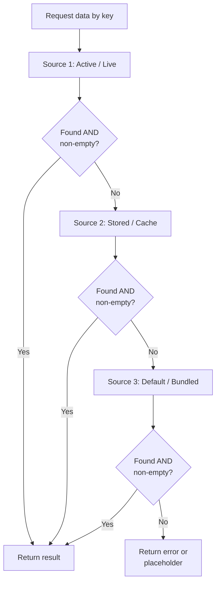

# Blueprint: Data Fallback Resolution

<!-- METADATA — structured for agents, useful for humans
tags:        [fallback, data-resolution, resilience, patterns]
category:    patterns
difficulty:  intermediate
time:        1 hour
stack:       []
-->

> Generic multi-layer fallback pattern for resolving data when sources are incomplete or partially available.

## TL;DR

When a data source returns null, empty, or partial results, a structured resolver tries the next source in a priority chain instead of surfacing raw keys or blank content. After following this blueprint you will have a reusable resolver that walks through N data sources, treats empty collections the same as missing data, and always lands on a sensible default.

## When to Use

- Your application reads data from multiple sources (live service, local store, bundled defaults) and any of them can be incomplete at runtime.
- Users see raw identifiers, blank screens, or disabled items because a single lookup returned nothing.
- You need a repeatable pattern rather than ad-hoc `if null` checks scattered across the codebase.
- When **not** to use it: if data integrity is critical and a missing source should halt the process (e.g. financial transactions). In that case, fail loudly instead of falling back.

## Prerequisites

- [ ] You can enumerate every data source your feature depends on (e.g. API, cache, bundled JSON).
- [ ] You know the priority order of those sources (which is most authoritative?).
- [ ] You have a last-resort default or error state defined by your product spec.

## Overview



## Steps

### 1. Identify your data sources in priority order

**Why**: Every fallback chain starts with knowing what you have. Listing sources explicitly prevents the common mistake of only coding the happy path and tacking on fallbacks later as bug fixes.

Rank your sources from most-preferred to least-preferred. Example from the tipitaka v2.2.2 fixes:

| Priority | Source | Example |
|----------|--------|---------|
| 1 | Active corpus query | Live sutta segments from the current study plan |
| 2 | Stored / cached data | Previously fetched sutta stored in local DB |
| 3 | Bundled default | Hardcoded EN label or placeholder text |

**Expected outcome**: A written list of sources with clear priority. Every team member can point to it.

### 2. Define what "found" really means

**Why**: The most common root cause in tipitaka v2.2.2 was treating `null` as the only failure signal. `getSuttaWithSegments()` returned an object with an empty segments list -- technically not null, but useless. Checking only for null let empty data slip through.

Define a predicate that covers all "not usable" states:

```
function isUsable(value):
    if value is null or undefined:
        return false
    if value is a string and value.trim() is empty:
        return false
    if value is a collection and value.length == 0:
        return false
    return true
```

Apply this predicate uniformly. Never rely on truthiness alone.

**Expected outcome**: A single `isUsable` (or `isEmpty`) helper that every resolver call passes through.

### 3. Implement the resolver pattern

**Why**: Centralizing fallback logic in one resolver prevents the bug pattern seen in tipitaka where some call sites used the resolver and others called the raw DAO directly, leading to inconsistent behavior (passages showing raw keys).

```
function resolve(key, sources):
    for source in sources:
        result = source.fetch(key)
        if isUsable(result):
            return result
        log("fallback", key, source.name)  // see Step 5
    return DEFAULT_VALUE  // or throw if no silent failure is acceptable
```

All call sites go through `resolve()`. Never call a raw data source directly from the UI layer.

**Expected outcome**: A single resolver function (or class) that accepts a key and an ordered list of sources.

### 4. Always have a last-resort default

**Why**: Without a terminal fallback, the resolver can still return null, and the UI ends up showing raw IDs or crashing. In tipitaka, steps pointing to absent suttas showed as disabled because there was no default content to display.

Choose a strategy for the final tier:

```
// Option A: static placeholder
DEFAULT_VALUE = { label: "(content unavailable)", segments: [] }

// Option B: throw so the caller decides
if no source returned usable data:
    throw DataUnavailableError(key)

// Option C: return a "skeleton" that the UI can render gracefully
DEFAULT_VALUE = Skeleton.forType(key.type)
```

**Expected outcome**: Every possible key resolves to something renderable. No raw keys or blank screens reach the user.

### 5. Log fallback events for debugging

**Why**: Silent fallbacks hide data issues. If Source 1 is broken and every request quietly falls to Source 3, you may not notice until data is stale. In tipitaka, the EN-label bug persisted because the fallback worked "well enough" and nobody saw a warning.

```
function logFallback(key, skippedSource, reason):
    logger.warn(
        "Fallback triggered",
        { key: key, source: skippedSource, reason: reason }
    )
    metrics.increment("data.fallback", { source: skippedSource })
```

Set an alert threshold: if fallback rate for Source 1 exceeds N% over a window, something is wrong upstream.

**Expected outcome**: Dashboards or log queries that show how often each fallback tier is hit.

### 6. Test with intentionally incomplete data

**Why**: Fallback paths only get exercised in production by accident -- unless you test them on purpose.

Write tests for each scenario:

```
// Source 1 returns null
assert resolve("key", [nullSource, storedSource, default]) == storedResult

// Source 1 returns empty collection
assert resolve("key", [emptySource, storedSource, default]) == storedResult

// All sources fail
assert resolve("key", [nullSource, nullSource, nullSource]) == DEFAULT_VALUE

// Source 1 returns blank string
assert resolve("key", [blankStringSource, storedSource, default]) == storedResult
```

**Expected outcome**: Full branch coverage of the resolver. CI fails if any fallback tier is broken.

## Gotchas

> **Null is not the only "missing"**: `getSuttaWithSegments()` returned an object with an empty `segments` list. The check `if result != null` passed, and the UI rendered nothing. **Fix**: Always check for empty collections, blank strings, and zero-length content -- not just null.

> **Silent fallback hides upstream breakage**: When Source 1 is down, the resolver quietly serves Source 3 data. Users get stale or generic content with no visible error. **Fix**: Log every fallback event and set alerts on fallback rate. Treat sustained fallback as an incident, not a feature.

> **UI displaying raw identifiers**: When all fallback tiers fail and there is no terminal default, the UI may render the internal key (e.g. `mn1:23.4`) instead of human-readable text. **Fix**: Ensure the resolver always returns something renderable. Never pass a raw key to the view layer.

> **Hardcoded labels as fallback masking locale issues**: In tipitaka, the EN label was the last-resort default. For non-EN users this "worked" but showed the wrong language. **Fix**: Make the default locale-aware, or clearly mark fallback content so users know it is not in their preferred language.

## Checklist

- [ ] All data sources are enumerated and prioritized in a single location.
- [ ] An `isUsable` predicate covers null, empty collections, and blank strings.
- [ ] A central resolver is the only path from data source to UI.
- [ ] No call site queries a raw DAO / data source directly for display purposes.
- [ ] A last-resort default exists for every data type.
- [ ] Fallback events are logged with source name and key.
- [ ] Alerts are configured for abnormal fallback rates.
- [ ] Tests cover: Source 1 null, Source 1 empty, all sources fail, blank string.
- [ ] UI never displays a raw key or identifier to the user.

## References

- tipitaka v2.2.2 release -- 5 bugs fixed by adopting a 3-tier resolver with empty-checking (study plan EN labels, raw passage keys, absent sutta handling, empty segments)
- [Circuit Breaker pattern](https://martinfowler.com/bliki/CircuitBreaker.html) -- complementary pattern for when a source is persistently failing
- [Null Object pattern](https://en.wikipedia.org/wiki/Null_object_pattern) -- related technique for providing safe defaults instead of null
