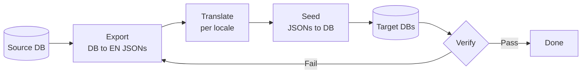

# Blueprint: Data Pipeline i18n

<!-- METADATA — structured for agents, useful for humans
tags:        [pipeline, i18n, translation, data-processing, etl]
category:    patterns
difficulty:  intermediate
time:        2 hours
stack:       [python]
-->

> The export-translate-seed pattern for managing multilingual content pipelines.

## TL;DR

Establish a repeatable three-stage pipeline -- Export, Translate, Seed -- that extracts canonical English content from a source database into JSON files, transforms them into locale-specific translations using externalized dictionaries, and seeds the results back into target databases. A single `build_all.sh` entry point orchestrates the entire flow.

## When to Use

- You have a database-backed application that needs to serve content in multiple languages
- Translation is done offline (by humans or scripts) rather than at runtime
- You want a deterministic, auditable pipeline where each stage can be run and verified independently
- When **not** to use it: real-time translation needs (use an i18n library or translation API instead), or when content changes so frequently that a batch pipeline creates unacceptable lag

## Prerequisites

- [ ] A source database with canonical (English) content already populated
- [ ] Python 3.9+ with database driver installed (e.g. `psycopg2`, `sqlite3`)
- [ ] Target database(s) provisioned and accessible
- [ ] `jq` installed (optional, useful for inspecting intermediate JSON files)

## Overview



## Steps

### 1. Design the pipeline directory structure

**Why**: A consistent directory layout makes scripts discoverable, keeps translation artifacts separate from application code, and lets `build_all.sh` locate everything by convention rather than configuration.

```
project/
  pipeline/
    build_all.sh              # single entry point
    export_content.py         # Stage 1: DB -> EN JSONs
    translate_content.py      # Stage 2: per-locale translation
    seed_content.py           # Stage 3: JSONs -> DB
    translations/
      fr_content.json         # French translation dictionary
      vi_content.json         # Vietnamese translation dictionary
      <locale>_content.json   # One file per locale
    output/
      en/                     # Exported canonical JSONs
      fr/                     # Translated JSONs
      vi/                     # Translated JSONs
```

Group scripts in thematic subdirectories under `pipeline/` when the project grows beyond a single content type (e.g. `pipeline/study_plans/`, `pipeline/articles/`).

**Expected outcome**: A `pipeline/` directory committed to the repo with placeholder scripts and an empty `translations/` folder.

### 2. Create the export script (DB to canonical EN JSONs)

**Why**: The export script is the single source of truth for what content exists. By dumping to JSON, you create a format that is easy to diff, review in PRs, and feed into translation tooling.

```python
#!/usr/bin/env python3
"""export_content.py -- Stage 1: Extract canonical EN content from source DB."""

import json
import os
from pathlib import Path

OUTPUT_DIR = Path(__file__).parent / "output" / "en"

def export_all(db_conn):
    """Query source DB and write one JSON file per content unit."""
    OUTPUT_DIR.mkdir(parents=True, exist_ok=True)

    rows = db_conn.execute("SELECT id, title, body FROM content").fetchall()
    for row in rows:
        path = OUTPUT_DIR / f"{row['id']}.json"
        path.write_text(json.dumps({
            "id": row["id"],
            "locale": "en",
            "title": row["title"],
            "body": row["body"],
        }, ensure_ascii=False, indent=2))

    print(f"Exported {len(rows)} items to {OUTPUT_DIR}")
```

Key details:
- Write one JSON file per content unit so diffs stay small and merge conflicts are rare.
- Use `ensure_ascii=False` to preserve Unicode characters in source content.
- Print counts so `build_all.sh` output is auditable.

**Expected outcome**: Running `python pipeline/export_content.py` produces `pipeline/output/en/*.json` files matching every row in the source table.

### 3. Create translation scripts per locale (with externalized dictionaries)

**Why**: Externalized dictionaries (`translations/fr_content.json`, `translations/vi_content.json`) separate translatable strings from pipeline logic. Translators can edit JSON without touching Python. Every locale follows the same script, just with a different dictionary file.

```python
#!/usr/bin/env python3
"""translate_content.py -- Stage 2: Apply locale dictionaries to EN JSONs."""

import json
import sys
from pathlib import Path

PIPELINE_DIR = Path(__file__).parent
EN_DIR = PIPELINE_DIR / "output" / "en"
TRANSLATIONS_DIR = PIPELINE_DIR / "translations"

def translate(locale: str):
    """Read EN JSONs + locale dictionary, write translated JSONs."""
    dict_path = TRANSLATIONS_DIR / f"{locale}_content.json"
    if not dict_path.exists():
        sys.exit(f"Missing dictionary: {dict_path}")

    dictionary = json.loads(dict_path.read_text())
    out_dir = PIPELINE_DIR / "output" / locale
    out_dir.mkdir(parents=True, exist_ok=True)

    for en_file in sorted(EN_DIR.glob("*.json")):
        item = json.loads(en_file.read_text())
        item_id = str(item["id"])

        if item_id not in dictionary:
            print(f"WARN: No {locale} translation for id={item_id}, skipping")
            continue

        translated = dictionary[item_id]
        item["locale"] = locale
        item["title"] = translated.get("title", item["title"])
        item["body"] = translated.get("body", item["body"])

        (out_dir / en_file.name).write_text(
            json.dumps(item, ensure_ascii=False, indent=2)
        )

    print(f"Translated {locale}: {len(list(out_dir.glob('*.json')))} items")

if __name__ == "__main__":
    translate(sys.argv[1])  # usage: python translate_content.py fr
```

Dictionary file format (`translations/fr_content.json`):

```json
{
  "1": { "title": "Titre traduit", "body": "Corps traduit..." },
  "2": { "title": "...", "body": "..." }
}
```

Each locale (French, Vietnamese, etc.) follows the identical pattern -- only the dictionary file differs.

**Expected outcome**: Running `python pipeline/translate_content.py fr` produces `pipeline/output/fr/*.json` with translated content.

### 4. Create the seed script (JSONs to DB)

**Why**: The seed script is the inverse of export. It reads translated JSONs and upserts them into the target database, making the pipeline idempotent.

```python
#!/usr/bin/env python3
"""seed_content.py -- Stage 3: Load translated JSONs into target DB."""

import json
import sys
from pathlib import Path

OUTPUT_DIR = Path(__file__).parent / "output"

def seed(locale: str, db_conn):
    """Upsert translated JSON files into target DB."""
    locale_dir = OUTPUT_DIR / locale
    if not locale_dir.exists():
        sys.exit(f"No output directory for locale '{locale}'. Run translate first.")

    count = 0
    for json_file in sorted(locale_dir.glob("*.json")):
        item = json.loads(json_file.read_text())
        db_conn.execute(
            """INSERT INTO content (id, locale, title, body)
               VALUES (?, ?, ?, ?)
               ON CONFLICT (id, locale) DO UPDATE
               SET title = excluded.title, body = excluded.body""",
            (item["id"], item["locale"], item["title"], item["body"]),
        )
        count += 1

    db_conn.commit()
    print(f"Seeded {count} {locale} items")
```

Key details:
- Use `ON CONFLICT ... DO UPDATE` (upsert) so the script is safe to rerun.
- Commit once at the end for performance; wrap in a transaction for atomicity.
- Exit with a clear error if the locale directory is missing (catches running seed before translate).

**Expected outcome**: Running `python pipeline/seed_content.py fr` inserts or updates all French rows in the target database.

### 5. Create build_all.sh (single entry point)

**Why**: A unified build script enforces the correct execution order (export, then translate, then seed) and makes CI integration trivial. One command to rebuild all multilingual content.

```bash
#!/usr/bin/env bash
set -euo pipefail

SCRIPT_DIR="$(cd "$(dirname "$0")" && pwd)"
cd "$SCRIPT_DIR"

LOCALES=("fr" "vi")  # add new locales here

echo "=== Stage 1: Export ==="
python export_content.py

echo "=== Stage 2: Translate ==="
for locale in "${LOCALES[@]}"; do
    python translate_content.py "$locale"
done

echo "=== Stage 3: Seed ==="
for locale in "${LOCALES[@]}"; do
    python seed_content.py "$locale"
done

echo "=== Stage 4: Verify ==="
for locale in "${LOCALES[@]}"; do
    count=$(find output/"$locale" -name '*.json' | wc -l | tr -d ' ')
    echo "$locale: $count items"
done

echo "=== Pipeline complete ==="
```

**Expected outcome**: Running `./pipeline/build_all.sh` executes the full pipeline end-to-end and prints counts per locale.

### 6. Keep schema in sync between pipeline and app

**Why**: When your database schema is defined in two places -- the application ORM and the pipeline scripts -- they can drift apart silently. A schema mismatch causes seeds to fail or, worse, to silently drop fields.

Strategies to stay in sync:

1. **Share a schema definition.** Import the same model or DDL file in both the app and the pipeline scripts.
2. **Add a schema check to `build_all.sh`.** Before exporting, compare the pipeline's expected columns against the live DB schema and abort on mismatch.
3. **Test in CI.** Run the full pipeline against a fresh DB in your CI environment so drift is caught before it reaches production.

```bash
# Example schema check (add to build_all.sh before Stage 1)
echo "=== Stage 0: Schema check ==="
python -c "
from db import get_columns
expected = {'id', 'locale', 'title', 'body'}
actual = set(get_columns('content'))
diff = expected.symmetric_difference(actual)
if diff:
    raise SystemExit(f'Schema drift detected: {diff}')
print('Schema OK')
"
```

**Expected outcome**: The pipeline fails fast with an explicit error message when schema drift is detected.

## Gotchas

> **Schema drift**: The pipeline's JSON structure and the app's DB schema evolve independently and quietly fall out of sync. **Fix**: Add a schema check step to `build_all.sh` (see Step 6) and run the full pipeline in CI on every PR that touches models or migrations.

> **Forgetting to seed after translation**: New translations sit in `output/` as JSON files but never make it to the database. **Fix**: Always use `build_all.sh` instead of running individual scripts. The unified entry point enforces the correct sequence.

> **Running seed before export**: If the export step is skipped, the seed script picks up stale JSON files from a previous run, potentially reverting content. **Fix**: `build_all.sh` enforces order. For extra safety, have the export step clear `output/en/` before writing.

> **Locale-specific edge cases**: Right-to-left scripts, CJK character counting, Vietnamese diacritics, or French punctuation spacing can break assumptions in validation or truncation logic. **Fix**: Avoid hard-coded string length limits. Test with real translated content, not lorem ipsum. Use `ensure_ascii=False` everywhere.

## Checklist

- [ ] `pipeline/` directory structure matches the convention
- [ ] `export_content.py` produces one JSON per content unit in `output/en/`
- [ ] Translation dictionaries exist in `translations/<locale>_content.json` for every supported locale
- [ ] `translate_content.py <locale>` produces `output/<locale>/` with the correct item count
- [ ] `seed_content.py <locale>` upserts without errors and is idempotent (safe to rerun)
- [ ] `build_all.sh` runs the full pipeline end-to-end with no manual steps
- [ ] Schema check catches intentionally introduced drift (test by adding a dummy column)
- [ ] CI runs `build_all.sh` against a fresh database on every relevant PR
- [ ] Adding a new locale requires only: create the dictionary JSON, add the locale code to `LOCALES` in `build_all.sh`

## Artifacts

| Artifact | Location | Description |
|----------|----------|-------------|
| Export script | `pipeline/export_content.py` | Extracts canonical EN content from source DB to JSON |
| Translate script | `pipeline/translate_content.py` | Applies locale dictionaries to EN JSONs |
| Seed script | `pipeline/seed_content.py` | Upserts translated JSONs into target DB |
| Build orchestrator | `pipeline/build_all.sh` | Single entry point for the full pipeline |
| Translation dicts | `pipeline/translations/<locale>_content.json` | One externalized dictionary per locale |
| Pipeline output | `pipeline/output/<locale>/` | Intermediate JSON files per locale |

## References

- [GNU gettext manual](https://www.gnu.org/software/gettext/manual/) — foundational concepts for string externalization and locale management
- [JSON as a translation interchange format](https://docs.oasis-open.org/xliff/xliff-core/v2.1/xliff-core-v2.1.html) — XLIFF standard for when JSON dictionaries outgrow their simplicity
- [The Twelve-Factor App: Build, release, run](https://12factor.net/build-release-run) — the pipeline pattern applied to deployment; same separation-of-stages principle
