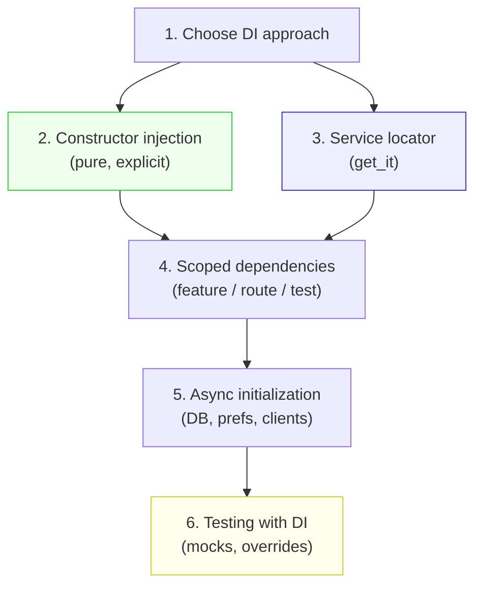

# Blueprint: Dependency Injection

<!-- METADATA — structured for agents, useful for humans
tags:        [dependency-injection, di, get_it, injectable, riverpod, testing, architecture]
category:    patterns
difficulty:  intermediate
time:        1-2 hours
stack:       [flutter, dart]
-->

> Manage dependencies explicitly so every class is testable, swappable, and free of hidden coupling.

## TL;DR

Wire dependencies through constructors by default. Use a service locator (get_it) when constructor chains get deep. Scope registrations per feature or test to avoid global state pollution. The result: every dependency is visible, every class is testable, and swapping implementations is a one-line change.

## When to Use

- Starting a new Flutter app and deciding how to wire services, repositories, and API clients together
- Existing code creates its own dependencies internally (`final api = ApiClient()`) making testing painful
- You need different implementations per environment (real API in prod, mock in tests, fake in dev)
- When **not** to use: trivial apps with 2-3 classes — constructor injection alone is enough, skip the service locator

## Prerequisites

- [ ] A Flutter/Dart project with at least one service or repository
- [ ] Understanding of abstract classes / interfaces in Dart
- [ ] Familiarity with `flutter pub add` and pubspec.yaml

## Overview



## Steps

### 1. Choose a DI approach

**Why**: There is no single "best" DI solution — the right choice depends on project size, team familiarity, and how deep your dependency graph goes. Choosing early avoids a costly migration later.

| Approach | Best for | Trade-off |
|----------|----------|-----------|
| **Constructor injection** | Small-medium apps, shallow graphs | Explicit but verbose when chains are 4+ levels deep |
| **get_it (service locator)** | Medium-large apps, deep graphs | Global access to anything, but hides dependencies from signatures |
| **injectable (codegen on get_it)** | Large apps with many registrations | Less boilerplate, but adds build_runner dependency |
| **Riverpod as DI** | Apps already using Riverpod for state | Unified model, but ties DI to widget tree lifecycle |

> **Decision**: If your dependency graph is shallow (most classes need 1-3 deps), start with **constructor injection** (Step 2) and add get_it later only if wiring becomes painful. If you already have 10+ services, go directly to **Step 3**.

**Expected outcome**: A deliberate, documented choice that the whole team follows — not a mix of approaches in different files.

### 2. Constructor injection pattern

**Why**: Constructor injection is the purest form of DI. Dependencies are visible in the constructor signature, enforced by the compiler, and trivial to swap in tests. No framework needed.

```dart
// lib/core/services/portfolio_service.dart

class PortfolioService {
  PortfolioService({
    required this.portfolioRepository,
    required this.marketService,
  });

  final PortfolioRepository portfolioRepository;
  final MarketService marketService;

  Future<double> getTotalValue(String userId) async {
    final holdings = await portfolioRepository.getHoldings(userId);
    var total = 0.0;
    for (final h in holdings) {
      final price = await marketService.getPrice(h.symbol);
      total += h.quantity * price;
    }
    return total;
  }
}
```

Wire it at the composition root (typically `main.dart` or an `AppModule`):

```dart
// lib/main.dart

void main() {
  final httpClient = http.Client();
  final apiClient = ApiClient(httpClient: httpClient);
  final portfolioRepo = PortfolioRepositoryImpl(apiClient: apiClient);
  final marketService = MarketService(apiClient: apiClient);
  final portfolioService = PortfolioService(
    portfolioRepository: portfolioRepo,
    marketService: marketService,
  );

  runApp(MyApp(portfolioService: portfolioService));
}
```

**Expected outcome**: Every dependency is explicit in the constructor. Reading the constructor tells you exactly what a class needs — no hidden globals.

### 3. Service locator pattern with get_it

**Why**: When constructor chains get deep (Widget -> ViewModel -> Service -> Repository -> ApiClient -> HttpClient), passing everything manually is tedious and clutters intermediate classes. A service locator gives direct access to any registered dependency.

```bash
flutter pub add get_it
```

```dart
// lib/injection.dart

import 'package:get_it/get_it.dart';

final sl = GetIt.instance; // sl = service locator

void configureDependencies() {
  // Singletons — one instance for the app lifetime
  sl.registerLazySingleton<http.Client>(() => http.Client());
  sl.registerLazySingleton<ApiClient>(
    () => ApiClient(httpClient: sl<http.Client>()),
  );

  // Factories — new instance every time
  sl.registerFactory<PortfolioRepository>(
    () => PortfolioRepositoryImpl(apiClient: sl<ApiClient>()),
  );

  // Lazy singleton with interface binding
  sl.registerLazySingleton<MarketService>(
    () => MarketService(apiClient: sl<ApiClient>()),
  );

  sl.registerLazySingleton<PortfolioService>(
    () => PortfolioService(
      portfolioRepository: sl<PortfolioRepository>(),
      marketService: sl<MarketService>(),
    ),
  );
}
```

```dart
// lib/main.dart

void main() {
  configureDependencies();
  runApp(const MyApp());
}

// Anywhere in the app:
final service = sl<PortfolioService>();
```

**Expected outcome**: Dependencies are registered once in `injection.dart`, resolved anywhere with `sl<Type>()`. Registration order does not matter for lazy singletons — get_it resolves them on first access.

### 4. Scoped dependencies

**Why**: Not every dependency should be a global singleton. Feature-level scopes prevent unrelated features from leaking state into each other. Test scopes allow complete isolation.

**Feature-level scope with get_it:**

```dart
// Push a new scope when entering a feature
void enterTradingFeature() {
  sl.pushNewScope(
    init: (scope) {
      scope.registerLazySingleton<TradingEngine>(
        () => TradingEngine(api: sl<ApiClient>()),
      );
      scope.registerFactory<OrderValidator>(
        () => OrderValidator(engine: sl<TradingEngine>()),
      );
    },
    scopeName: 'trading',
  );
}

// Pop the scope when leaving — all scoped registrations are disposed
void leaveTradingFeature() {
  sl.popScope();
}
```

**Per-route scope with Riverpod:**

```dart
// Riverpod automatically scopes providers to the widget tree.
// Override at any level:
ProviderScope(
  overrides: [
    tradingEngineProvider.overrideWithValue(sandboxEngine),
  ],
  child: const TradingScreen(),
)
```

**Expected outcome**: Feature-specific dependencies exist only while the feature is active. No stale singletons lingering after the user navigates away.

### 5. Async initialization

**Why**: Some dependencies require async setup before the app can start — database connections, SharedPreferences, API tokens. Getting the init order wrong causes "not registered" or "not initialized" crashes at startup.

```dart
// lib/injection.dart

Future<void> configureDependencies() async {
  // 1. Async singletons — must complete before dependents register
  final prefs = await SharedPreferences.getInstance();
  sl.registerSingleton<SharedPreferences>(prefs);

  final db = await openDatabase('app.db', version: 1);
  sl.registerSingleton<Database>(db);

  // 2. Sync singletons that depend on async ones
  sl.registerLazySingleton<SettingsRepository>(
    () => SettingsRepository(prefs: sl<SharedPreferences>()),
  );

  sl.registerLazySingleton<TransactionDao>(
    () => TransactionDao(db: sl<Database>()),
  );

  // 3. Services that depend on repositories
  sl.registerLazySingleton<TransactionService>(
    () => TransactionService(dao: sl<TransactionDao>()),
  );

  // Signal that all async deps are ready
  await sl.allReady();
}
```

```dart
// lib/main.dart

void main() async {
  WidgetsFlutterBinding.ensureInitialized();
  await configureDependencies();
  runApp(const MyApp());
}
```

**Expected outcome**: The app waits for all async dependencies before rendering the first frame. `sl.allReady()` acts as a gate — nothing proceeds until everything is initialized.

### 6. Testing with DI

**Why**: The entire point of DI is testability. If you can't swap a dependency in tests, your DI is decorative. Each test should run with isolated, controlled dependencies.

**With constructor injection (simplest):**

```dart
// test/core/services/portfolio_service_test.dart

class MockPortfolioRepository implements PortfolioRepository {
  List<Holding> holdingsToReturn = [];
  bool shouldFail = false;

  @override
  Future<List<Holding>> getHoldings(String userId) async {
    if (shouldFail) throw Exception('DB error');
    return holdingsToReturn;
  }
}

class MockMarketService implements MarketService {
  Map<String, double> prices = {};

  @override
  Future<double> getPrice(String symbol) async {
    return prices[symbol] ?? 0.0;
  }
}

void main() {
  late MockPortfolioRepository mockRepo;
  late MockMarketService mockMarket;
  late PortfolioService service;

  setUp(() {
    mockRepo = MockPortfolioRepository();
    mockMarket = MockMarketService();
    service = PortfolioService(
      portfolioRepository: mockRepo,
      marketService: mockMarket,
    );
  });

  test('calculates total value from holdings and prices', () async {
    mockRepo.holdingsToReturn = [
      Holding(symbol: 'BTC', quantity: 2.0),
      Holding(symbol: 'ETH', quantity: 10.0),
    ];
    mockMarket.prices = {'BTC': 50000.0, 'ETH': 3000.0};

    final total = await service.getTotalValue('user-1');

    expect(total, 130000.0); // 2*50000 + 10*3000
  });
}
```

**With get_it (register overrides per test):**

```dart
// test/helpers/test_injection.dart

void configureTestDependencies() {
  sl.reset(); // CRITICAL — clean slate for every test

  sl.registerSingleton<PortfolioRepository>(MockPortfolioRepository());
  sl.registerSingleton<MarketService>(MockMarketService());
  sl.registerLazySingleton<PortfolioService>(
    () => PortfolioService(
      portfolioRepository: sl<PortfolioRepository>(),
      marketService: sl<MarketService>(),
    ),
  );
}

// In each test file:
setUp(() => configureTestDependencies());
tearDown(() => sl.reset());
```

**Expected outcome**: Tests are fast, isolated, and deterministic. No real HTTP calls, no real databases, no shared state between tests.

## Variants

<details>
<summary><strong>Variant: Injectable with code generation</strong></summary>

For large apps with 30+ registrations, hand-writing `configureDependencies()` gets tedious. Injectable generates it from annotations.

```bash
flutter pub add injectable
flutter pub add get_it
flutter pub add --dev injectable_generator
flutter pub add --dev build_runner
```

```dart
// lib/injection.dart
import 'package:get_it/get_it.dart';
import 'package:injectable/injectable.dart';
import 'injection.config.dart';

final sl = GetIt.instance;

@InjectableInit()
Future<void> configureDependencies() async => sl.init();
```

```dart
// lib/core/services/portfolio_service.dart

@lazySingleton
class PortfolioService {
  PortfolioService(this.portfolioRepository, this.marketService);

  final PortfolioRepository portfolioRepository;
  final MarketService marketService;
}
```

Run code generation:

```bash
dart run build_runner build --delete-conflicting-outputs
```

**Trade-off**: Less boilerplate, but you now depend on build_runner. Forgetting to run codegen after adding a new class leads to confusing "not registered" errors at runtime.

</details>

<details>
<summary><strong>Variant: Riverpod as DI container</strong></summary>

If your app already uses Riverpod for state management, it doubles as a DI system with built-in scoping and disposal.

```dart
// lib/providers/service_providers.dart

final httpClientProvider = Provider<http.Client>((ref) => http.Client());

final apiClientProvider = Provider<ApiClient>((ref) {
  return ApiClient(httpClient: ref.watch(httpClientProvider));
});

final portfolioServiceProvider = Provider<PortfolioService>((ref) {
  return PortfolioService(
    portfolioRepository: ref.watch(portfolioRepositoryProvider),
    marketService: ref.watch(marketServiceProvider),
  );
});
```

Testing with overrides:

```dart
testWidgets('shows portfolio value', (tester) async {
  await tester.pumpWidget(
    ProviderScope(
      overrides: [
        portfolioRepositoryProvider.overrideWithValue(mockRepo),
        marketServiceProvider.overrideWithValue(mockMarket),
      ],
      child: const MyApp(),
    ),
  );
});
```

**Trade-off**: Unified model for state + DI, but all dependencies are tied to the widget tree lifecycle. Not usable in pure Dart code without a `ProviderContainer`.

</details>

## Gotchas

> **Circular dependencies crash at registration**: If ServiceA depends on ServiceB and ServiceB depends on ServiceA, get_it throws a `StackOverflowError` during resolution. **Fix**: Break the cycle by extracting the shared contract into an interface, or use `sl.registerLazySingleton` with a callback that defers resolution until first access.

> **Forgetting to reset get_it between tests**: If one test registers a mock and the next test doesn't call `sl.reset()`, the second test inherits the first test's registrations. This causes flaky tests that pass in isolation but fail when run together. **Fix**: Always call `sl.reset()` in `setUp` or `tearDown` — never rely on registration order across tests.

> **Injectable silently skips unannotated classes**: If you forget `@injectable` or `@lazySingleton` on a class, code generation simply skips it. No compile-time error. You only discover the problem at runtime when get_it throws `"Object/factory not registered"`. **Fix**: Run your app after every codegen cycle. Consider a startup smoke test that resolves all critical dependencies.

> **Riverpod overrides must be above the consumer**: `ProviderScope(overrides: [...])` only affects widgets **below** it in the tree. If the consuming widget is a sibling or ancestor, the override is invisible. **Fix**: Place the overriding `ProviderScope` as a parent of all widgets that need the overridden value — typically at the root for tests.

> **Async registration order matters**: Registering a `LazySingleton` that depends on an async singleton (e.g., `SharedPreferences`) before the async singleton is ready causes a "not registered" crash. **Fix**: Await all async singletons before registering their dependents, and call `await sl.allReady()` as a final gate.

## Checklist

- [ ] DI approach is chosen deliberately and documented (constructor, get_it, injectable, or Riverpod)
- [ ] All services depend on abstract interfaces, not concrete implementations
- [ ] Constructor parameters list every dependency — no hidden `static` access or global variables
- [ ] get_it registrations live in a single `injection.dart` file (or generated equivalent)
- [ ] Async dependencies are awaited before dependents are registered
- [ ] `sl.reset()` is called in test `setUp` or `tearDown`
- [ ] Feature-scoped dependencies use `pushNewScope` / `popScope` or Riverpod `ProviderScope`
- [ ] No circular dependencies — verified by a startup smoke test
- [ ] Tests run with mocks injected via constructor or service locator override

## References

- [get_it package](https://pub.dev/packages/get_it) — service locator for Dart and Flutter
- [injectable package](https://pub.dev/packages/injectable) — code generation for get_it registrations
- [Riverpod documentation](https://riverpod.dev/) — reactive state management with built-in DI
- [Service Layer Pattern](service-layer-pattern.md) — how services consume injected dependencies
- [Error Handling & Logging](error-handling-logging.md) — Result types and error classification in services
