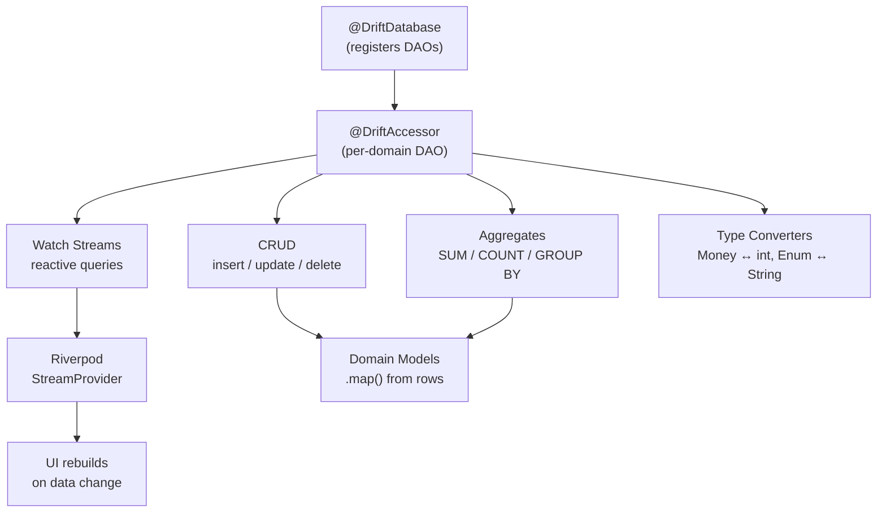

# Blueprint: Drift DAO Patterns

<!-- METADATA — structured for agents, useful for humans
tags:        [drift, dao, sqlite, database, reactive, streams, flutter, dart]
category:    patterns
difficulty:  intermediate
time:        2 hours
stack:       [flutter, dart]
-->

> Type-safe DAOs with reactive watch streams, aggregate queries, and domain-model mapping — the data access companion to schema & migrations.

## TL;DR

You will have a set of `@DriftAccessor` DAOs that encapsulate all CRUD, reactive streams, aggregate queries, and type conversions behind clean interfaces. Each DAO is independently testable with an in-memory database and integrates naturally with Riverpod providers for UI reactivity.

## When to Use

- You have a Drift database and need structured data access beyond raw `select` / `insert`
- Your UI needs reactive streams that update automatically when underlying data changes
- You need aggregate queries (sums, counts, grouped totals) for dashboards or reports
- You want domain models in your app layer, not raw Drift row objects
- When **not** to use: trivial single-table apps where the database class itself is sufficient

> **Companion blueprint**: This blueprint covers **data access patterns** (DAOs, queries, streams, type converters). For **schema definition and migrations**, see [Drift Database Migrations](../architecture/drift-database-migrations.md).

## Prerequisites

- [ ] Drift database set up with at least one table and working `build_runner` generation
- [ ] Familiarity with the [Drift Database Migrations](../architecture/drift-database-migrations.md) blueprint
- [ ] Riverpod installed (for stream provider integration)
- [ ] Domain model classes defined in your app layer

## Overview



## Steps

### 1. Define the DAO structure

**Why**: A `@DriftAccessor` scopes queries to a subset of tables, keeping the database class lean. Each DAO owns one domain area (expenses, categories, profiles). Without this separation, the database class becomes a god object with dozens of unrelated methods.

```dart
// lib/db/daos/expense_dao.dart

import 'package:drift/drift.dart';
import '../database.dart';
import '../tables.dart';

part 'expense_dao.g.dart';

@DriftAccessor(tables: [Expenses, Categories])
class ExpenseDao extends DatabaseAccessor<AppDatabase>
    with _$ExpenseDaoMixin {
  ExpenseDao(super.db);

  // Query methods go here (steps 2–5)
}
```

Then register the DAO in the database class:

```dart
// lib/db/database.dart

@DriftDatabase(
  tables: [Expenses, Categories, Profiles],
  daos: [ExpenseDao, CategoryDao, ProfileDao], // <-- register here
)
class AppDatabase extends _$AppDatabase {
  AppDatabase(QueryExecutor e) : super(e);

  @override
  int get schemaVersion => 1;
}
```

**Expected outcome**: After `dart run build_runner build`, each DAO gets a generated `_$XxxDaoMixin` that provides typed access to only its declared tables.

### 2. Implement CRUD operations

**Why**: Centralizing CRUD in the DAO ensures consistent conflict handling, cascade awareness, and batch semantics. Callers never write raw SQL.

```dart
// Inside ExpenseDao

/// Insert with replace-on-conflict for idempotent syncs.
Future<int> insertExpense(ExpensesCompanion entry) {
  return into(expenses).insert(
    entry,
    mode: InsertMode.insertOrReplace,
  );
}

/// Update a single expense by primary key.
Future<bool> updateExpense(ExpensesCompanion entry) {
  return update(expenses).replace(entry);
}

/// Delete by ID. Returns true if a row was actually removed.
Future<int> deleteExpense(int id) {
  return (delete(expenses)..where((e) => e.id.equals(id))).go();
}

/// Batch insert for imports — runs inside a single transaction.
Future<void> insertAll(List<ExpensesCompanion> entries) {
  return batch((b) {
    b.insertAll(expenses, entries, mode: InsertMode.insertOrReplace);
  });
}
```

**Expected outcome**: All writes go through well-defined methods with explicit conflict strategies. Batch operations are transactional.

### 3. Add reactive watch streams

**Why**: Drift's `.watch()` returns a `Stream` that re-emits whenever the underlying table changes. This is the foundation for reactive UIs — the widget rebuilds automatically when data is inserted, updated, or deleted, with no manual refresh logic.

```dart
// Inside ExpenseDao

/// Watch all expenses for a profile, ordered by date descending.
Stream<List<Expense>> watchExpensesByProfile(int profileId) {
  return (select(expenses)
        ..where((e) => e.profileId.equals(profileId))
        ..orderBy([(e) => OrderingTerm.desc(e.date)]))
      .watch();
}

/// Watch a single expense by ID — emits null if deleted.
Stream<Expense?> watchById(int id) {
  return (select(expenses)..where((e) => e.id.equals(id)))
      .watchSingleOrNull();
}

/// Watch expenses filtered by date range.
Stream<List<Expense>> watchByDateRange(
  int profileId,
  DateTime start,
  DateTime end,
) {
  return (select(expenses)
        ..where((e) =>
            e.profileId.equals(profileId) &
            e.date.isBiggerOrEqualValue(start) &
            e.date.isSmallerOrEqualValue(end))
        ..orderBy([(e) => OrderingTerm.desc(e.date)]))
      .watch();
}
```

Integrate with Riverpod:

```dart
// lib/providers/expense_providers.dart

final expenseListProvider =
    StreamProvider.family<List<Expense>, int>((ref, profileId) {
  final dao = ref.watch(appDatabaseProvider).expenseDao;
  return dao.watchExpensesByProfile(profileId);
});
```

**Expected outcome**: The UI subscribes to a `StreamProvider` and rebuilds only when relevant data changes. No manual `setState` or refresh callbacks.

### 4. Build domain queries with joins and mapping

**Why**: Real features need data from multiple tables — an expense with its category name, a transaction with its profile label. Drift's `join` API returns `TypedResult` rows that must be unpacked explicitly. Mapping to domain models at the DAO boundary keeps Drift types out of the app layer.

```dart
// Inside ExpenseDao

/// Expenses with their category names, mapped to a domain model.
Stream<List<ExpenseWithCategory>> watchExpensesWithCategory(int profileId) {
  final query = select(expenses).join([
    leftOuterJoin(categories, categories.id.equalsExp(expenses.categoryId)),
  ])
    ..where(expenses.profileId.equals(profileId))
    ..orderBy([OrderingTerm.desc(expenses.date)]);

  return query.watch().map((rows) {
    return rows.map((row) {
      final expense = row.readTable(expenses);
      final category = row.readTableOrNull(categories);
      return ExpenseWithCategory(
        id: expense.id,
        amount: Money.fromCents(expense.amountCents),
        date: expense.date,
        description: expense.description,
        categoryName: category?.name ?? 'Uncategorized',
      );
    }).toList();
  });
}
```

**Expected outcome**: The app layer receives `ExpenseWithCategory` domain objects — no Drift types leak past the DAO.

### 5. Write aggregate queries

**Why**: Dashboards need totals, averages, and grouped summaries. Drift supports SQL aggregate functions via its expression API, avoiding raw SQL while staying type-safe.

```dart
// Inside ExpenseDao

/// Total expenses per category for a given month.
Future<List<CategoryTotal>> sumExpensesByCategory(
  int profileId,
  DateTime month,
) async {
  final startOfMonth = DateTime(month.year, month.month);
  final endOfMonth = DateTime(month.year, month.month + 1)
      .subtract(const Duration(milliseconds: 1));

  final sumAmount = expenses.amountCents.sum();

  final query = selectOnly(expenses).join([
    innerJoin(categories, categories.id.equalsExp(expenses.categoryId)),
  ])
    ..where(expenses.profileId.equals(profileId) &
        expenses.date.isBiggerOrEqualValue(startOfMonth) &
        expenses.date.isSmallerOrEqualValue(endOfMonth))
    ..addColumns([categories.name, sumAmount])
    ..groupBy([categories.name]);

  final rows = await query.get();
  return rows.map((row) {
    return CategoryTotal(
      categoryName: row.read(categories.name)!,
      totalCents: row.read(sumAmount)!,
    );
  }).toList();
}

/// Monthly totals across all categories.
Future<List<MonthlyTotal>> monthlyTotals(int profileId) async {
  final monthExpr = expenses.date.month;
  final yearExpr = expenses.date.year;
  final sumAmount = expenses.amountCents.sum();

  final query = selectOnly(expenses)
    ..where(expenses.profileId.equals(profileId))
    ..addColumns([yearExpr, monthExpr, sumAmount])
    ..groupBy([yearExpr, monthExpr])
    ..orderBy([OrderingTerm.desc(yearExpr), OrderingTerm.desc(monthExpr)]);

  final rows = await query.get();
  return rows.map((row) {
    return MonthlyTotal(
      year: row.read(yearExpr)!,
      month: row.read(monthExpr)!,
      totalCents: row.read(sumAmount)!,
    );
  }).toList();
}
```

**Expected outcome**: Aggregate queries run in SQLite (efficient, even on large datasets) and return typed domain objects.

### 6. Implement type converters

**Why**: Domain types (Money, enums, JSON blobs) should not dictate the database schema. Type converters bridge the gap: the database stores primitives (int, String), the Dart layer works with rich types. Define once, apply everywhere.

```dart
// lib/db/converters.dart

/// Stores Money as integer cents — avoids floating-point rounding.
class MoneyConverter extends TypeConverter<Money, int> {
  const MoneyConverter();

  @override
  Money fromSql(int fromDb) => Money.fromCents(fromDb);

  @override
  int toSql(Money value) => value.cents;
}

/// Stores DateTime as Unix timestamp (seconds).
class DateTimeConverter extends TypeConverter<DateTime, int> {
  const DateTimeConverter();

  @override
  DateTime fromSql(int fromDb) =>
      DateTime.fromMillisecondsSinceEpoch(fromDb * 1000);

  @override
  int toSql(DateTime value) => value.millisecondsSinceEpoch ~/ 1000;
}

/// Stores enums as their name string for readability in DB browsers.
class TransactionTypeConverter
    extends TypeConverter<TransactionType, String> {
  const TransactionTypeConverter();

  @override
  TransactionType fromSql(String fromDb) =>
      TransactionType.values.byName(fromDb);

  @override
  String toSql(TransactionType value) => value.name;
}
```

Apply in the table definition:

```dart
class Expenses extends Table {
  IntColumn get id => integer().autoIncrement()();
  IntColumn get amountCents => integer()(); // raw int, converter in DAO
  IntColumn get date => integer().map(const DateTimeConverter())();
  TextColumn get type => text().map(const TransactionTypeConverter())();
  // ...
}
```

**Expected outcome**: The database stores efficient primitives; Dart code works with `Money`, `DateTime`, and enum types without manual conversion at every call site.

### 7. Test DAOs with an in-memory database

**Why**: Each test gets a fresh, isolated database with the latest schema. No file cleanup, no shared state, fast execution. This pairs with the `forTesting()` factory from the [migrations blueprint](../architecture/drift-database-migrations.md).

```dart
// test/db/daos/expense_dao_test.dart

import 'package:drift/native.dart';
import 'package:test/test.dart';

void main() {
  late AppDatabase db;
  late ExpenseDao dao;

  setUp(() async {
    db = AppDatabase(NativeDatabase.memory());
    final migrator = db.createMigrator();
    await migrator.createAll();
    dao = db.expenseDao;
  });

  tearDown(() => db.close());

  test('insertExpense and watchByProfile round-trip', () async {
    await dao.insertExpense(ExpensesCompanion.insert(
      profileId: 1,
      amountCents: 1250,
      date: DateTime(2026, 1, 15),
      description: 'Coffee',
      categoryId: 1,
    ));

    final results = await dao.watchExpensesByProfile(1).first;
    expect(results, hasLength(1));
    expect(results.first.amountCents, 1250);
  });

  test('sumExpensesByCategory aggregates correctly', () async {
    // Insert two expenses in the same category
    await dao.insertExpense(ExpensesCompanion.insert(
      profileId: 1, amountCents: 500, categoryId: 2,
      date: DateTime(2026, 3, 1), description: 'Lunch',
    ));
    await dao.insertExpense(ExpensesCompanion.insert(
      profileId: 1, amountCents: 750, categoryId: 2,
      date: DateTime(2026, 3, 10), description: 'Dinner',
    ));

    final totals = await dao.sumExpensesByCategory(1, DateTime(2026, 3, 1));
    expect(totals.first.totalCents, 1250);
  });

  test('deleteExpense removes row and stream re-emits', () async {
    final id = await dao.insertExpense(ExpensesCompanion.insert(
      profileId: 1, amountCents: 100,
      date: DateTime(2026, 1, 1), description: 'Test',
      categoryId: 1,
    ));

    await dao.deleteExpense(id);

    final results = await dao.watchExpensesByProfile(1).first;
    expect(results, isEmpty);
  });
}
```

**Expected outcome**: Tests run in milliseconds, each fully isolated. No test database files to clean up.

## Variants

<details>
<summary><strong>Variant: DAO with JSON column for flexible metadata</strong></summary>

When a table needs a semi-structured metadata blob (tags, extra fields) alongside typed columns:

```dart
class JsonMapConverter extends TypeConverter<Map<String, dynamic>, String> {
  const JsonMapConverter();

  @override
  Map<String, dynamic> fromSql(String fromDb) =>
      jsonDecode(fromDb) as Map<String, dynamic>;

  @override
  String toSql(Map<String, dynamic> value) => jsonEncode(value);
}

class Transactions extends Table {
  IntColumn get id => integer().autoIncrement()();
  TextColumn get metadata => text().map(const JsonMapConverter())();
}
```

**Gotcha**: You lose SQLite indexing and query ability on fields inside the JSON blob. Only use this for truly optional, unqueried metadata.

</details>

<details>
<summary><strong>Variant: Read-only DAO for reporting</strong></summary>

When a DAO only serves dashboards and never mutates data, make the intent explicit:

```dart
@DriftAccessor(tables: [Expenses, Categories, Profiles])
class ReportingDao extends DatabaseAccessor<AppDatabase>
    with _$ReportingDaoMixin {
  ReportingDao(super.db);

  // Only watch/select methods — no insert, update, or delete.
  Stream<List<MonthlyTotal>> watchMonthlyTotals(int profileId) { ... }
  Future<List<CategoryTotal>> getCategoryBreakdown(int profileId) { ... }
}
```

This signals to other developers that mutations belong in the domain-specific DAO, not here.

</details>

## Gotchas

> **DAO not registered in @DriftDatabase**: Forgetting to add the DAO to `@DriftDatabase(daos: [...])` compiles fine but fails at runtime with "no such table" errors. The mixin is generated but never wired to the database instance. **Fix**: Every new `@DriftAccessor` class must be added to the `daos` list in the database annotation. Add this to your PR checklist.

> **Generated files not present after clone**: The `.g.dart` files produced by `build_runner` are typically gitignored. A new developer cloning the repo gets import errors everywhere. **Fix**: Document in the README (or a setup script) that `dart run build_runner build --delete-conflicting-outputs` must run after clone. Add it to a `Makefile` or `justfile` target.

> **Watch streams emit on ANY table change**: Drift's `.watch()` re-evaluates the query whenever *any* write occurs on *any* table referenced by the DAO, not just the rows matching the query. In a DAO that declares `tables: [Expenses, Categories]`, updating a category name re-emits the expenses stream. **Fix**: Apply `.distinct()` or use `.watch().map(...)` with `const DeepCollectionEquality().equals` to suppress no-op emissions. Alternatively, narrow your `@DriftAccessor(tables: [...])` to only the tables each query actually needs.

> **TypedResult confusion with joins**: Custom `SELECT` with `join()` returns `TypedResult` rows. Using `.read(column)` when you need `.readTable(tableInfo)` (or vice versa) produces null or type errors. **Fix**: Use `row.readTable(expenses)` to get a full row object, `row.readTableOrNull(categories)` for nullable joined tables, and `row.read(expression)` only for aggregate expressions or individual columns from `addColumns`.

> **Money as double causes rounding bugs**: Storing monetary values as `double` in SQLite leads to classic floating-point errors (0.1 + 0.2 != 0.3). Aggregated sums drift over thousands of rows. **Fix**: Always store money as integer cents via a `TypeConverter<Money, int>`. Convert to display format only at the UI boundary.

## Checklist

- [ ] Each domain area has its own `@DriftAccessor` DAO
- [ ] Every DAO is registered in `@DriftDatabase(daos: [...])`
- [ ] `build_runner build` runs cleanly after adding new DAOs
- [ ] CRUD methods use explicit `InsertMode` conflict strategies
- [ ] Watch streams exist for every list the UI displays
- [ ] `.distinct()` or equivalent applied to watch streams that rebuild excessively
- [ ] Join queries map to domain models at the DAO boundary — no Drift types in app layer
- [ ] Aggregate queries use Drift expression API, not raw SQL strings
- [ ] Type converters defined for Money, DateTime, and enums
- [ ] DAO tests use `NativeDatabase.memory()` + `createAll()`, isolated per test
- [ ] New developers can build generated files via documented setup command

## Artifacts

| Artifact | Location | Description |
|----------|----------|-------------|
| DAO classes | `lib/db/daos/<domain>_dao.dart` | `@DriftAccessor` with CRUD + watch + aggregates |
| Type converters | `lib/db/converters.dart` | `TypeConverter` implementations for domain types |
| Domain models | `lib/models/<domain>.dart` | App-layer models returned by DAO mapping |
| Riverpod providers | `lib/providers/<domain>_providers.dart` | `StreamProvider` wrappers over DAO watch methods |
| DAO tests | `test/db/daos/<domain>_dao_test.dart` | In-memory database tests per DAO |

## References

- [Drift Database Migrations](../architecture/drift-database-migrations.md) — companion blueprint covering schema definition, versioning, and idempotent migrations
- [Drift DAOs documentation](https://drift.simonbinder.eu/dart_api/daos/) — official guide to `@DriftAccessor` and `DatabaseAccessor`
- [Drift type converters](https://drift.simonbinder.eu/type_converters/) — official guide to `TypeConverter` usage
- [Drift joins and custom queries](https://drift.simonbinder.eu/dart_api/select/#joins) — `TypedResult`, `readTable`, and aggregate expressions
- [Service Layer Pattern](service-layer-pattern.md) — how services consume DAO-provided data
- [Riverpod Provider Wiring](riverpod-provider-wiring.md) — patterns for exposing streams to the widget tree
