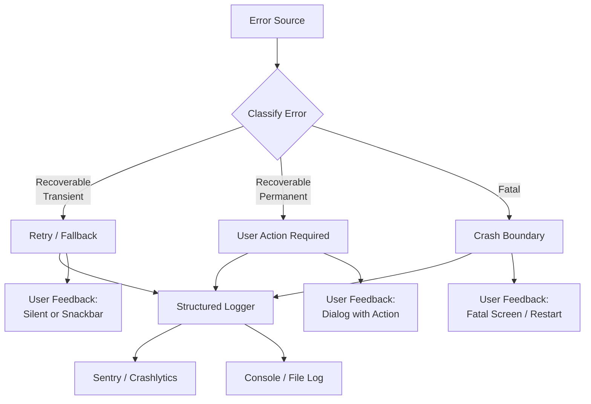

# Blueprint: Error Handling & Logging

<!-- METADATA — structured for agents, useful for humans
tags:        [error-handling, logging, sentry, crashlytics, result-type]
category:    patterns
difficulty:  intermediate
time:        2-3 hours
stack:       [flutter, dart]
-->

> Structured error handling with Result types, classified errors, and production-grade logging so failures are recoverable, observable, and never silently swallowed.

## TL;DR

Replace ad-hoc try-catch blocks with a sealed error hierarchy and a `Result<T, E>` wrapper. Every error is classified (recoverable vs fatal, user-facing vs internal, transient vs permanent), routed through a global error boundary, logged with structured metadata, reported to Sentry/Crashlytics, and translated into a user-friendly message. After following this blueprint you will have a consistent error pipeline from throw site to user feedback.

## When to Use

- You are starting a new Flutter app or backend service and want error handling right from day one.
- Errors are caught inconsistently -- some swallowed, some shown as raw stack traces, some crashing the app.
- Your crash reporting dashboard is noisy or empty because there is no structured classification.
- You need user-facing error messages that are translatable and actionable, not "Something went wrong".
- When **not** to use: quick throwaway prototypes or scripts where a top-level try-catch and `print` is genuinely sufficient.

## Prerequisites

- [ ] Dart 3.0+ (required for sealed classes and pattern matching).
- [ ] A Flutter project with at least one network call or database operation to exercise errors against.
- [ ] A Sentry or Crashlytics account (free tier is fine) for crash reporting integration.
- [ ] A logging package added to `pubspec.yaml` (e.g. `logger`, `logging`, or your own).

## Overview



## Steps

### 1. Define an error type hierarchy

**Why**: A flat `Exception` or raw strings give you no ability to pattern-match on error kind. A sealed hierarchy lets the compiler enforce exhaustive handling -- if you add a new error type, every `switch` that handles errors will fail to compile until you cover it.

```dart
/// Base failure type — sealed so the compiler enforces exhaustive matching.
sealed class AppFailure {
  const AppFailure({
    required this.message,
    this.cause,
    this.stackTrace,
  });

  final String message;
  final Object? cause;
  final StackTrace? stackTrace;
}

// ── Network ────────────────────────────────────────────
class NetworkFailure extends AppFailure {
  const NetworkFailure({
    required super.message,
    super.cause,
    super.stackTrace,
    required this.statusCode,
  });

  final int? statusCode;

  bool get isTransient =>
      statusCode == null || statusCode == 408 || statusCode! >= 500;
}

// ── Persistence ────────────────────────────────────────
class StorageFailure extends AppFailure {
  const StorageFailure({
    required super.message,
    super.cause,
    super.stackTrace,
  });
}

// ── Validation (user input) ────────────────────────────
class ValidationFailure extends AppFailure {
  const ValidationFailure({
    required super.message,
    required this.field,
  });

  final String field;
}

// ── Auth ───────────────────────────────────────────────
class AuthFailure extends AppFailure {
  const AuthFailure({
    required super.message,
    super.cause,
    super.stackTrace,
    this.requiresReauth = false,
  });

  final bool requiresReauth;
}

// ── Unexpected / Fatal ─────────────────────────────────
class UnexpectedFailure extends AppFailure {
  const UnexpectedFailure({
    required super.message,
    super.cause,
    super.stackTrace,
  });
}
```

**Expected outcome**: A `lib/core/errors/app_failure.dart` file with a sealed class tree. Every domain error maps to exactly one subclass.

### 2. Implement a Result wrapper

**Why**: Returning `Result<T, AppFailure>` instead of throwing forces every call site to handle the error path. Unlike try-catch, you cannot accidentally ignore it -- the value is only accessible after checking the result. This eliminates the "forgotten catch" class of bugs entirely.

```dart
/// A discriminated union: either a value or a failure.
sealed class Result<T, E> {
  const Result();

  /// Convenience constructors.
  const factory Result.ok(T value) = Ok<T, E>;
  const factory Result.err(E error) = Err<T, E>;

  /// Transform the success value, short-circuiting on error.
  Result<U, E> map<U>(U Function(T) f) => switch (this) {
    Ok(:final value) => Result.ok(f(value)),
    Err(:final error) => Result.err(error),
  };

  /// Chain async operations that themselves return Result.
  Future<Result<U, E>> flatMapAsync<U>(
    Future<Result<U, E>> Function(T) f,
  ) async =>
      switch (this) {
        Ok(:final value) => await f(value),
        Err(:final error) => Result.err(error),
      };

  /// Unwrap or provide a fallback.
  T getOrElse(T Function(E) fallback) => switch (this) {
    Ok(:final value) => value,
    Err(:final error) => fallback(error),
  };
}

class Ok<T, E> extends Result<T, E> {
  const Ok(this.value);
  final T value;
}

class Err<T, E> extends Result<T, E> {
  const Err(this.error);
  final E error;
}
```

Usage at a call site:

```dart
final result = await userRepository.fetchProfile(userId);

switch (result) {
  case Ok(:final value):
    emit(ProfileLoaded(value));
  case Err(error: AuthFailure(:final requiresReauth)) when requiresReauth:
    emit(ProfileSessionExpired());
  case Err(:final error):
    emit(ProfileError(_userMessage(error)));
}
```

**Expected outcome**: A `lib/core/errors/result.dart` file. Repository and service methods return `Result<T, AppFailure>` instead of throwing.

### 3. Set up a global error boundary

**Why**: Even with Result types, platform code, third-party plugins, and `compute` isolates can throw uncaught exceptions. A global boundary ensures nothing escapes unreported. In Flutter, uncaught errors in the widget tree, the framework itself, and the current Zone all need separate hooks.

```dart
void main() {
  // 1. Catch Flutter framework errors (layout, build, rendering).
  FlutterError.onError = (details) {
    _reportError(details.exception, details.stack);
  };

  // 2. Catch errors in the current Zone (async gaps, microtasks).
  runZonedGuarded(
    () {
      WidgetsFlutterBinding.ensureInitialized();
      _initCrashReporting();
      runApp(const MyApp());
    },
    (error, stack) {
      _reportError(error, stack);
    },
  );
}

void _reportError(Object error, StackTrace? stack) {
  // Log locally.
  AppLogger.fatal('Uncaught error', error: error, stackTrace: stack);
  // Forward to Sentry / Crashlytics.
  CrashReporter.instance.capture(error, stack);
}
```

**Expected outcome**: Zero uncaught exceptions reach the user as a grey/red error screen. All unhandled errors are logged and reported.

### 4. Configure crash reporting (Sentry / Crashlytics)

**Why**: Local logs disappear when the user closes the app. Crash reporting gives you aggregated, searchable, de-duplicated error data in production with device context, breadcrumbs, and release tracking.

```dart
Future<void> _initCrashReporting() async {
  await SentryFlutter.init(
    (options) {
      options
        ..dsn = const String.fromEnvironment('SENTRY_DSN')
        ..environment = const String.fromEnvironment(
          'ENV',
          defaultValue: 'development',
        )
        ..tracesSampleRate = 0.2 // 20% of transactions
        ..beforeSend = _scrubPii;
    },
  );
}

/// Strip PII before it leaves the device.
SentryEvent? _scrubPii(SentryEvent event, Hint hint) {
  // Remove user email from breadcrumbs/extras if present.
  return event.copyWith(
    user: event.user?.copyWith(email: null),
  );
}
```

Set up source maps / debug symbols upload in CI so stack traces are readable:

```yaml
# In your CI pipeline (e.g. GitHub Actions)
- name: Upload Dart debug symbols to Sentry
  run: |
    dart run sentry_dart_plugin \
      --release=${{ github.sha }} \
      --dist=${{ github.run_number }}
```

**Expected outcome**: Errors appear in the Sentry/Crashlytics dashboard within seconds. Stack traces are symbolicated. PII is stripped.

### 5. Add structured logging with severity levels

**Why**: `print()` statements are unsearchable, unlabelled, and end up in production builds. Structured logging attaches a severity, a timestamp, and context fields to every entry, making logs filterable and machine-parseable.

```dart
enum LogLevel {
  debug,   // Developer-only: variable dumps, flow tracing.
  info,    // Noteworthy runtime events: user logged in, sync completed.
  warning, // Degraded but functional: fallback used, retry triggered.
  error,   // Operation failed but app continues: API 500, parse failure.
  fatal,   // App cannot continue: corrupted DB, missing critical config.
}

class AppLogger {
  static void debug(String msg, [Map<String, dynamic>? ctx]) =>
      _log(LogLevel.debug, msg, ctx);

  static void info(String msg, [Map<String, dynamic>? ctx]) =>
      _log(LogLevel.info, msg, ctx);

  static void warning(String msg, {Object? error, StackTrace? stackTrace}) =>
      _log(LogLevel.warning, msg, null, error, stackTrace);

  static void error(String msg, {Object? error, StackTrace? stackTrace}) =>
      _log(LogLevel.error, msg, null, error, stackTrace);

  static void fatal(String msg, {Object? error, StackTrace? stackTrace}) =>
      _log(LogLevel.fatal, msg, null, error, stackTrace);

  static void _log(
    LogLevel level,
    String message, [
    Map<String, dynamic>? context,
    Object? error,
    StackTrace? stackTrace,
  ]) {
    final entry = {
      'time': DateTime.now().toUtc().toIso8601String(),
      'level': level.name,
      'message': message,
      if (context != null) 'context': context,
      if (error != null) 'error': error.toString(),
      if (stackTrace != null) 'stackTrace': stackTrace.toString(),
    };

    // In debug mode, pretty-print. In release, emit JSON for log aggregation.
    assert(() {
      _prettyPrint(entry);
      return true;
    }());

    // Forward error+ to crash reporter.
    if (level.index >= LogLevel.error.index && error != null) {
      CrashReporter.instance.capture(error, stackTrace);
    }
  }
}
```

When to use each level:

| Level | Use for | Example |
|-------|---------|---------|
| `debug` | Developer flow tracing, variable values | `"Cache key: user_42_profile"` |
| `info` | Business events worth recording | `"User completed onboarding"` |
| `warning` | Degraded path, non-critical failure | `"Retry 2/3 for fetchProfile"` |
| `error` | Operation failed, app still running | `"Payment API returned 502"` |
| `fatal` | Unrecoverable, app should restart/exit | `"Database corrupted on open"` |

**Expected outcome**: All logging goes through `AppLogger`. Grep for `print(` returns zero results outside test files. Logs in release mode are JSON-structured.

### 6. Define user-facing error messages

**Why**: Users should never see "SocketException: Connection refused" or a raw stack trace. Every `AppFailure` subclass needs a human-readable, translatable message that tells the user what happened and what they can do.

```dart
/// Maps internal failures to user-visible strings.
/// Uses your i18n solution (intl, easy_localization, etc.)
String userMessageFor(AppFailure failure, AppLocalizations l10n) {
  return switch (failure) {
    NetworkFailure(:final isTransient) when isTransient =>
      l10n.errorNetworkTransient,  // "Connection lost. Retrying..."
    NetworkFailure(statusCode: 401) || AuthFailure(requiresReauth: true) =>
      l10n.errorSessionExpired,    // "Session expired. Please sign in again."
    NetworkFailure() =>
      l10n.errorNetworkGeneral,    // "Could not reach the server."
    ValidationFailure(:final field) =>
      l10n.errorValidation(field), // "Please check your {field}."
    StorageFailure() =>
      l10n.errorStorage,           // "Could not save data. Free up space and try again."
    AuthFailure() =>
      l10n.errorAuth,              // "Authentication failed."
    UnexpectedFailure() =>
      l10n.errorUnexpected,        // "Something unexpected happened. Please try again."
  };
}
```

**Expected outcome**: A `userMessageFor` function that exhaustively covers all `AppFailure` subtypes. The compiler enforces that adding a new failure type requires a new message.

### 7. Add error recovery strategies

**Why**: Not every error should surface to the user. Transient network errors should retry, expired tokens should trigger a silent refresh, and only after recovery fails should the user be notified.

```dart
/// Retry with exponential backoff for transient failures.
Future<Result<T, AppFailure>> withRetry<T>(
  Future<Result<T, AppFailure>> Function() operation, {
  int maxAttempts = 3,
  Duration initialDelay = const Duration(seconds: 1),
}) async {
  var delay = initialDelay;

  for (var attempt = 1; attempt <= maxAttempts; attempt++) {
    final result = await operation();

    switch (result) {
      case Ok():
        return result;
      case Err(:final error) when _isRetryable(error) && attempt < maxAttempts:
        AppLogger.warning(
          'Retry $attempt/$maxAttempts',
          error: error,
        );
        await Future<void>.delayed(delay);
        delay *= 2;
      case Err():
        return result;
    }
  }

  // Unreachable, but Dart needs it.
  return Result.err(
    const UnexpectedFailure(message: 'Retry loop exited unexpectedly'),
  );
}

bool _isRetryable(AppFailure failure) => switch (failure) {
  NetworkFailure(:final isTransient) => isTransient,
  StorageFailure() => false,
  AuthFailure() => false,
  ValidationFailure() => false,
  UnexpectedFailure() => false,
};
```

Error interceptor for Dio/HTTP client:

```dart
class ErrorInterceptor extends Interceptor {
  @override
  void onError(DioException err, ErrorInterceptorHandler handler) {
    final failure = switch (err.type) {
      DioExceptionType.connectionTimeout ||
      DioExceptionType.receiveTimeout =>
        NetworkFailure(
          message: 'Request timed out',
          cause: err,
          stackTrace: err.stackTrace,
          statusCode: err.response?.statusCode,
        ),
      DioExceptionType.badResponse => _fromStatusCode(err),
      DioExceptionType.cancel =>
        const NetworkFailure(message: 'Request cancelled', statusCode: null),
      _ => UnexpectedFailure(
          message: 'HTTP error: ${err.message}',
          cause: err,
          stackTrace: err.stackTrace,
        ),
    };

    AppLogger.error(
      'API error',
      error: failure,
      stackTrace: err.stackTrace,
    );

    // Reject with typed failure so the repository can wrap in Result.err().
    handler.reject(
      DioException(
        requestOptions: err.requestOptions,
        error: failure,
      ),
    );
  }

  NetworkFailure _fromStatusCode(DioException err) {
    final code = err.response?.statusCode;
    return NetworkFailure(
      message: 'HTTP $code',
      cause: err,
      stackTrace: err.stackTrace,
      statusCode: code,
    );
  }
}
```

**Expected outcome**: Transient errors retry transparently. Auth errors trigger re-authentication. Only permanent, unrecoverable failures reach the user.

## Variants

<details>
<summary><strong>Variant: Flutter app</strong></summary>

This is the primary variant described in the steps above. Additional Flutter-specific considerations:

- Use `FlutterError.onError` and `runZonedGuarded` as the global boundary (Step 3).
- Wrap your `MaterialApp` in a widget-level error boundary that shows a friendly fallback UI instead of the red error screen:

```dart
class AppErrorBoundary extends StatelessWidget {
  const AppErrorBoundary({required this.child, super.key});
  final Widget child;

  @override
  Widget build(BuildContext context) {
    ErrorWidget.builder = (details) => Scaffold(
      body: Center(
        child: Text('Something went wrong.\nPlease restart the app.'),
      ),
    );
    return child;
  }
}
```

- Use `Sentry.captureException` or `FirebaseCrashlytics.instance.recordError` for reporting.
- PlatformDispatcher.instance.onError is available from Flutter 3.3+ as an alternative to `runZonedGuarded`.

</details>

<details>
<summary><strong>Variant: Backend service (dart_frog / shelf)</strong></summary>

- No `FlutterError.onError` or Zones needed. Use middleware for the error boundary:

```dart
Handler errorMiddleware(Handler innerHandler) {
  return (Request request) async {
    try {
      return await innerHandler(request);
    } catch (e, stack) {
      AppLogger.error('Unhandled request error', error: e, stackTrace: stack);
      await Sentry.captureException(e, stackTrace: stack);
      return Response.json(
        statusCode: 500,
        body: {'error': 'Internal server error'},
      );
    }
  };
}
```

- Log to stdout in JSON format for consumption by CloudWatch / Datadog / Loki.
- Use HTTP status codes as your primary error classification to the caller.
- Add a request ID to every log entry for tracing across services.

</details>

<details>
<summary><strong>Variant: CLI tool</strong></summary>

- Use process exit codes to signal error severity: `0` = success, `1` = user error, `2` = fatal/internal.
- Write errors to stderr, normal output to stdout:

```dart
void main(List<String> args) async {
  final result = await runTool(args);
  switch (result) {
    case Ok(:final value):
      stdout.writeln(value);
      exit(0);
    case Err(error: ValidationFailure(:final message)):
      stderr.writeln('Error: $message');
      exit(1);
    case Err(:final error):
      stderr.writeln('Fatal: ${error.message}');
      AppLogger.fatal('CLI fatal', error: error);
      exit(2);
  }
}
```

- Sentry is still useful for CLI tools distributed to users. Skip it for internal-only scripts.
- Structured JSON logging is less useful in CLI. Use human-readable format with `--verbose` flag for debug level.

</details>

## Gotchas

> **Swallowing exceptions silently**: An empty `catch (e) {}` block is worse than no try-catch at all -- the operation fails, the user gets no feedback, and the logs contain nothing. **Fix**: Enforce a lint rule or code review policy that every catch block must at minimum log the error. Use `unawaited_futures` and `avoid_empty_catch` analyzer rules.

> **Logging PII in error messages**: Exception messages from auth flows often contain emails, tokens, or user IDs. These end up in Sentry, log files, and sometimes third-party analytics. **Fix**: Implement a `beforeSend` scrubber in Sentry (see Step 4). Audit your `AppFailure.message` fields to never include user data. Log user IDs as context fields that can be redacted, not as part of the message string.

> **Sentry quota explosion from loops**: A network call in a retry loop or a `ListView.builder` that hits an error on every item build can send thousands of identical events to Sentry in seconds, burning through your quota. **Fix**: Use Sentry's `deduplicateIntegration` (enabled by default) and set `maxBreadcrumbs`. Add client-side rate limiting: track the last N error fingerprints and skip duplicates within a time window.

> **Missing stack traces in async code**: `await`ing a Future that throws loses the original call site. You get a stack trace starting at the event loop, not at your `fetchProfile()` call. **Fix**: Always capture `StackTrace.current` at the point you create an error, and pass it through your `AppFailure` and `Result.err`. Alternatively, use the `stack_trace` package's `Chain.capture` for richer async traces.

> **Error message internationalization forgotten**: Developers hardcode English strings in error messages during development and never wire them to the i18n system. **Fix**: Make `userMessageFor` (Step 6) accept your localization object from day one. Never put raw strings in `AppFailure.message` that are intended for users -- that field is for developers/logs only.

> **Zone error handling swallows errors in tests**: `runZonedGuarded` in your `main()` catches all errors, including assertion failures in tests, making test failures silent. **Fix**: Only use `runZonedGuarded` in the real `main()`, not in test setup. In tests, let errors propagate naturally. Use a compile-time or runtime flag to skip zone guarding in test environments.

> **Forgetting to handle all Result cases**: A `Result` is only safe if you handle both `Ok` and `Err`. If you call `.value` directly without checking, you just moved the crash from a thrown exception to a type cast failure. **Fix**: Never expose `.value` on the base `Result` type. Force callers to use `switch`, `map`, or `getOrElse`. The sealed class pattern in Step 2 makes direct access impossible without a cast.

> **Retrying non-idempotent operations**: Blindly retrying a POST that creates a resource can result in duplicates. **Fix**: Only retry operations that are idempotent (GET, PUT, DELETE with the same key). Mark your operations explicitly, and have `withRetry` refuse to retry non-idempotent calls.

## Checklist

- [ ] Sealed `AppFailure` hierarchy covers all error domains in the app.
- [ ] `Result<T, AppFailure>` is returned by all repository and service methods.
- [ ] No repository or service method throws -- all use `Result.err()`.
- [ ] Global error boundary is set up (`FlutterError.onError` + `runZonedGuarded`).
- [ ] Sentry or Crashlytics is initialized with PII scrubbing enabled.
- [ ] Debug symbols / source maps are uploaded in CI.
- [ ] `AppLogger` is the only logging mechanism (zero `print()` in lib/).
- [ ] Every log entry has a level, timestamp, and context.
- [ ] `userMessageFor` exhaustively maps all `AppFailure` subtypes to localized strings.
- [ ] Retry logic only applies to transient, idempotent operations.
- [ ] Tests exist for: each failure type, retry exhaustion, global error boundary.
- [ ] `runZonedGuarded` is not active during test execution.

## Artifacts

| Artifact | Location | Description |
|----------|----------|-------------|
| Error types | `lib/core/errors/app_failure.dart` | Sealed error class hierarchy |
| Result type | `lib/core/errors/result.dart` | `Result<T, E>` discriminated union |
| Logger | `lib/core/logging/app_logger.dart` | Structured logger with severity levels |
| Error interceptor | `lib/core/network/error_interceptor.dart` | Dio interceptor that maps HTTP errors to `AppFailure` |
| User messages | `lib/core/errors/user_message.dart` | `userMessageFor()` mapping failures to i18n strings |
| Crash reporting | `lib/core/reporting/crash_reporter.dart` | Sentry/Crashlytics initialization and PII scrubber |
| Retry helper | `lib/core/errors/retry.dart` | `withRetry()` exponential backoff for transient failures |

## References

- [Dart sealed classes](https://dart.dev/language/class-modifiers#sealed) -- official documentation on sealed class pattern matching
- [Sentry Flutter SDK](https://docs.sentry.io/platforms/flutter/) -- setup, configuration, and PII scrubbing
- [Firebase Crashlytics for Flutter](https://firebase.google.com/docs/crashlytics/get-started?platform=flutter) -- alternative crash reporting setup
- [Result type in Rust](https://doc.rust-lang.org/std/result/) -- the original inspiration for the Result/Either pattern
- [dartz package](https://pub.dev/packages/dartz) -- functional programming in Dart with `Either` type (heavier alternative)
- [fpdart package](https://pub.dev/packages/fpdart) -- modern functional Dart with `Either`, `Option`, `TaskEither`
