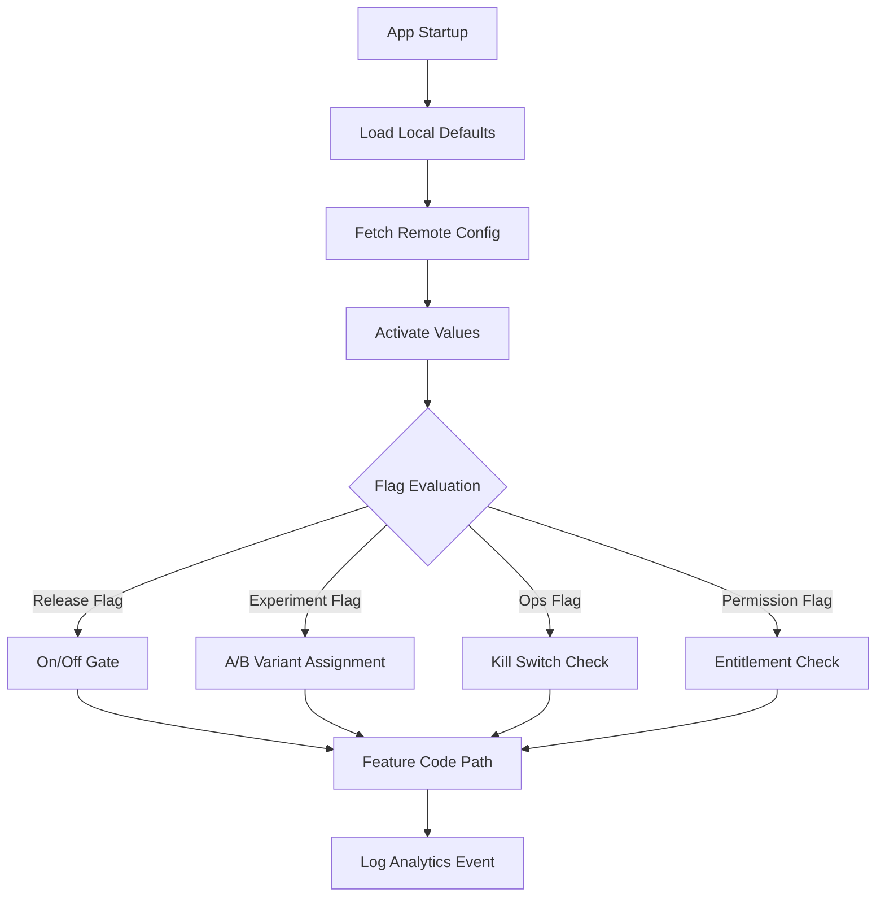

# Blueprint: Feature Flags & Remote Config

<!-- METADATA — structured for agents, useful for humans
tags:        [feature-flags, remote-config, a-b-testing, kill-switch, staged-rollout]
category:    patterns
difficulty:  intermediate
time:        2 hours
stack:       [flutter, dart]
-->

> Staged rollouts, A/B testing, kill switches, and runtime configuration so you can ship features safely, measure impact, and disable anything instantly without a new release.

## TL;DR

Define a typed flag registry behind a `FeatureFlagService` interface, back it with local defaults and a remote provider (Firebase Remote Config), and layer in caching, percentage-based rollouts, kill switches, and A/B experiment variants. After following this blueprint you will have a feature flag system that lets you control every feature at runtime, roll out gradually by percentage or segment, kill broken features instantly, and run measured experiments -- all without app store deployments.

## When to Use

- You are launching a new feature and want to roll it out to 5% of users before going to 100%.
- You need to disable a broken feature in production immediately without pushing a hotfix.
- You want to A/B test two UX variants and pick the winner based on data.
- You need per-environment or per-segment configuration (e.g., different behavior for beta testers, specific countries, or free vs paid users).
- When **not** to use: features that are fully stable and will never be toggled off. Not every boolean needs a flag -- adding flags to trivial, permanent code paths creates maintenance debt.

## Prerequisites

- [ ] A Flutter project with a dependency injection setup (Provider, Riverpod, get_it, etc.).
- [ ] A Firebase project linked to your app (for Remote Config integration).
- [ ] `firebase_remote_config` package added to `pubspec.yaml`.
- [ ] An analytics solution (Firebase Analytics, Mixpanel, Amplitude) for A/B test measurement.
- [ ] Familiarity with the repository/service layer pattern.

## Overview



## Steps

### 1. Define flag types and their lifecycles

**Why**: Not all flags are equal. Treating every flag as a permanent toggle leads to dead code and confusion. Each flag type has a different lifetime, owner, and removal strategy. Naming them explicitly forces the team to think about when a flag should be deleted.

```dart
/// The four flag archetypes. Every flag in the registry must declare its type.
enum FlagType {
  /// Short-lived. Protects an incomplete feature during development.
  /// Remove after the feature ships to 100%.
  release,

  /// Medium-lived. Gates an A/B experiment variant.
  /// Remove after the experiment concludes and a winner is chosen.
  experiment,

  /// Long-lived. Operational toggle for load shedding, maintenance mode, kill switches.
  /// May live indefinitely but should be reviewed quarterly.
  ops,

  /// Long-lived. Gates functionality based on user entitlement (free vs paid, role).
  /// Lives as long as the business rule exists.
  permission,
}

/// Metadata every flag carries so you can track and clean up.
class FlagDefinition {
  const FlagDefinition({
    required this.key,
    required this.type,
    required this.defaultValue,
    required this.owner,
    required this.createdAt,
    this.removeAfter,
    this.description,
  });

  final String key;
  final FlagType type;
  final Object defaultValue; // bool, String, int, or double
  final String owner;        // Team or person responsible
  final DateTime createdAt;
  final DateTime? removeAfter; // Null = no scheduled removal
  final String? description;

  bool get isExpired =>
      removeAfter != null && DateTime.now().isAfter(removeAfter!);
}
```

| Flag type | Typical lifetime | Example | Removal trigger |
|-----------|-----------------|---------|-----------------|
| Release | Days to weeks | `new_checkout_flow` | Feature at 100%, stable for 1 sprint |
| Experiment | Weeks to months | `onboarding_variant_b` | Experiment concluded, winner picked |
| Ops | Indefinite | `kill_payments` | Never (but review quarterly) |
| Permission | Indefinite | `premium_export` | Business rule retired |

**Expected outcome**: Every flag in your codebase has a declared type, owner, creation date, and optional removal date. No flag exists without this metadata.

### 2. Build the FeatureFlagService architecture

**Why**: Putting Firebase Remote Config calls directly in widgets or blocs couples your entire app to one provider. An interface lets you swap providers (Firebase, LaunchDarkly, Statsig, hardcoded) and makes testing trivial by injecting a fake.

```dart
/// Abstract interface — widgets and blocs depend only on this.
abstract interface class FeatureFlagService {
  /// Initialize the service, load cache, fetch remote values.
  Future<void> initialize();

  /// Evaluate a boolean flag.
  bool getBool(String key);

  /// Evaluate a string flag (for multi-variant experiments).
  String getString(String key);

  /// Evaluate a numeric flag (for tunable parameters).
  int getInt(String key);
  double getDouble(String key);

  /// Force-refresh from the remote provider.
  Future<void> refresh();

  /// Stream of flag changes (for reactive UI updates).
  Stream<Set<String>> get onFlagsChanged;

  /// Dispose resources.
  void dispose();
}
```

The implementation layers:

```dart
class FeatureFlagServiceImpl implements FeatureFlagService {
  FeatureFlagServiceImpl({
    required FlagRegistry registry,
    required RemoteFlagProvider remoteProvider,
    required FlagCache cache,
  })  : _registry = registry,
        _remote = remoteProvider,
        _cache = cache;

  final FlagRegistry _registry;
  final RemoteFlagProvider _remote;
  final FlagCache _cache;
  final _changesController = StreamController<Set<String>>.broadcast();

  @override
  Future<void> initialize() async {
    // 1. Load local defaults from the registry.
    _registry.applyDefaults();

    // 2. Load cached values from disk (last known remote state).
    await _cache.load();

    // 3. Fetch fresh remote values (non-blocking after first launch).
    try {
      final changed = await _remote.fetchAndActivate();
      if (changed.isNotEmpty) {
        await _cache.save(_remote.allValues);
        _changesController.add(changed);
      }
    } catch (e) {
      // Network failure is fine — we have defaults + cache.
      AppLogger.warning('Remote config fetch failed, using cache', error: e);
    }
  }

  @override
  bool getBool(String key) =>
      _remote.getBool(key) ??
      _cache.getBool(key) ??
      _registry.defaultBool(key);

  // ... getString, getInt, getDouble follow the same fallback chain.

  @override
  Stream<Set<String>> get onFlagsChanged => _changesController.stream;

  @override
  void dispose() => _changesController.close();
}
```

The evaluation priority is: **remote > cache > local default**. This ensures the freshest value wins, but the app always has a usable value even offline or on first launch.

**Expected outcome**: A `lib/core/feature_flags/feature_flag_service.dart` interface and implementation. All flag reads go through this service, never directly through Firebase.

### 3. Integrate Firebase Remote Config

**Why**: Firebase Remote Config gives you a free, globally distributed key-value store with conditional targeting (by app version, platform, user property, country). It is the most common remote config backend for Flutter apps and integrates natively with Firebase Analytics for experiment measurement.

```dart
class FirebaseRemoteFlagProvider implements RemoteFlagProvider {
  FirebaseRemoteFlagProvider({
    this.fetchInterval = const Duration(hours: 1),
  });

  final Duration fetchInterval;
  late final FirebaseRemoteConfig _config;

  Future<void> init() async {
    _config = FirebaseRemoteConfig.instance;
    await _config.setConfigSettings(
      RemoteConfigSettings(
        fetchTimeout: const Duration(seconds: 10),
        minimumFetchInterval: fetchInterval,
      ),
    );
  }

  @override
  Future<Set<String>> fetchAndActivate() async {
    final changed = await _config.fetchAndActivate();
    if (!changed) return {};

    // Return the set of keys whose values changed.
    return _config.getAll().keys.toSet();
  }

  @override
  bool? getBool(String key) {
    final value = _config.getValue(key);
    if (value.source == ValueSource.valueStatic) return null;
    return value.asBool();
  }

  @override
  String? getString(String key) {
    final value = _config.getValue(key);
    if (value.source == ValueSource.valueStatic) return null;
    return value.asString();
  }

  @override
  Map<String, dynamic> get allValues =>
      _config.getAll().map((k, v) => MapEntry(k, v.asString()));
}
```

Set defaults in the Firebase console or in code:

```dart
await _config.setDefaults(<String, dynamic>{
  'new_checkout_flow': false,
  'onboarding_variant': 'control',
  'max_retry_count': 3,
  'kill_payments': false,
});
```

**Expected outcome**: Remote Config values are fetched on startup, cached locally, and accessible through the `FeatureFlagService`. The Firebase console is the source of truth for remote values.

### 4. Implement staged rollout patterns

**Why**: Shipping a feature to 100% of users on day one means if it breaks, everyone is affected. Staged rollouts let you expose a feature to a small group first, monitor metrics, then gradually increase. If something goes wrong, only a fraction of users are impacted.

Firebase Remote Config supports percentage-based conditions natively. Set them in the Firebase console:

```
Condition: "rollout_10_percent"
  → Applies if: User in random percentile ≤ 10%

Condition: "beta_testers"
  → Applies if: User property "beta_tester" == "true"

Condition: "us_only"
  → Applies if: Device country/region == "US"
```

For finer control in code (e.g., combining multiple conditions):

```dart
class RolloutEvaluator {
  const RolloutEvaluator({required this.userId});

  final String userId;

  /// Deterministic percentage bucket based on user ID + flag key.
  /// Same user always gets the same result for a given flag.
  bool isInRolloutPercentage(String flagKey, int percentageThreshold) {
    final hash = _stableHash('$flagKey:$userId');
    final bucket = hash % 100; // 0-99
    return bucket < percentageThreshold;
  }

  /// Segment-based targeting.
  bool isInSegment(UserSegment segment, Set<UserSegment> targetSegments) {
    return targetSegments.contains(segment);
  }

  int _stableHash(String input) {
    // Use a consistent hash (not Object.hashCode which varies per run).
    var hash = 0x811c9dc5; // FNV-1a offset basis
    for (final byte in utf8.encode(input)) {
      hash ^= byte;
      hash = (hash * 0x01000193) & 0xFFFFFFFF;
    }
    return hash.abs();
  }
}
```

Rollout strategy in practice:

```
Day 1:  1% — smoke test, check crash rate
Day 3:  5% — monitor key metrics (latency, error rate)
Day 5:  25% — watch for edge cases at scale
Day 7:  50% — compare A/B metrics against control
Day 10: 100% — full rollout, schedule flag removal
```

**Expected outcome**: Features roll out gradually. You can target by percentage, user segment, or geography. The same user consistently sees the same variant (no flickering).

### 5. Build kill switches for instant disable

**Why**: When a production feature is causing crashes, data corruption, or a billing error, you cannot wait for an app store review cycle. A kill switch lets you disable the feature from the Firebase console in seconds, with the change propagating to all active clients on their next config fetch.

```dart
/// Kill switch evaluator — checked before any gated feature executes.
class KillSwitchGuard {
  const KillSwitchGuard({required this.flagService});

  final FeatureFlagService flagService;

  /// Returns true if the feature is killed (disabled).
  bool isKilled(String featureKey) {
    return flagService.getBool('kill_$featureKey');
  }

  /// Guard a feature execution. Returns fallback if killed.
  T guard<T>({
    required String featureKey,
    required T Function() execute,
    required T fallback,
  }) {
    if (isKilled(featureKey)) {
      AppLogger.warning(
        'Kill switch active',
        {'feature': featureKey},
      );
      return fallback;
    }
    return execute();
  }
}
```

Usage in a widget or bloc:

```dart
// In a Cubit or Bloc
void processPayment(Order order) {
  final result = killSwitch.guard(
    featureKey: 'payments',
    execute: () => _paymentService.charge(order),
    fallback: () {
      emit(PaymentState.maintenance(
        message: 'Payments are temporarily unavailable. Please try again later.',
      ));
      return null;
    },
  );
  // ...
}
```

For critical situations (forced app update, mandatory maintenance), use a special flag that shows a blocking screen:

```dart
class ForceUpdateChecker {
  const ForceUpdateChecker({required this.flagService});

  final FeatureFlagService flagService;

  /// Call on app resume and after each remote config fetch.
  ForceUpdateAction check(String currentVersion) {
    final minVersion = flagService.getString('min_app_version');
    if (minVersion.isEmpty) return ForceUpdateAction.none;

    if (_isVersionBelow(currentVersion, minVersion)) {
      return ForceUpdateAction.forceUpdate;
    }

    final recommendedVersion = flagService.getString('recommended_app_version');
    if (recommendedVersion.isNotEmpty &&
        _isVersionBelow(currentVersion, recommendedVersion)) {
      return ForceUpdateAction.suggestUpdate;
    }

    return ForceUpdateAction.none;
  }
}

enum ForceUpdateAction { none, suggestUpdate, forceUpdate }
```

**Expected outcome**: Any feature can be disabled from the Firebase console within seconds. Critical issues trigger a kill switch, not an emergency app release. Force-update gates block outdated clients.

### 6. Integrate A/B testing with analytics

**Why**: Feature flags without measurement are just toggles. A/B testing lets you ship two (or more) variants of a feature, measure which one performs better against a success metric, and make data-driven decisions instead of guessing.

```dart
/// Experiment configuration stored in remote config as a JSON string.
class Experiment {
  const Experiment({
    required this.key,
    required this.variants,
    required this.targetMetric,
  });

  final String key;
  final List<String> variants; // e.g. ['control', 'variant_a', 'variant_b']
  final String targetMetric;   // e.g. 'checkout_completed'

  /// Parse from remote config JSON string.
  factory Experiment.fromJson(Map<String, dynamic> json) {
    return Experiment(
      key: json['key'] as String,
      variants: List<String>.from(json['variants'] as List),
      targetMetric: json['target_metric'] as String,
    );
  }
}

/// Assign user to a variant and log exposure.
class ExperimentService {
  ExperimentService({
    required this.flagService,
    required this.analytics,
    required this.userId,
  });

  final FeatureFlagService flagService;
  final AnalyticsService analytics;
  final String userId;

  /// Get the variant for this user. Returns the variant string.
  String getVariant(String experimentKey) {
    // Variant assignment comes from remote config (Firebase handles bucketing).
    final variant = flagService.getString(experimentKey);

    // Log exposure event so analytics knows this user saw this variant.
    analytics.logEvent(
      'experiment_exposure',
      parameters: {
        'experiment_key': experimentKey,
        'variant': variant,
        'user_id': userId,
      },
    );

    return variant;
  }

  /// Log a conversion event tied to an experiment.
  void logConversion(String experimentKey, String metric, {double? value}) {
    analytics.logEvent(
      'experiment_conversion',
      parameters: {
        'experiment_key': experimentKey,
        'metric': metric,
        if (value != null) 'value': value,
      },
    );
  }
}
```

Usage in a widget:

```dart
class OnboardingScreen extends StatelessWidget {
  @override
  Widget build(BuildContext context) {
    final variant = context.read<ExperimentService>().getVariant('onboarding_v2');

    return switch (variant) {
      'variant_a' => const OnboardingCarousel(),
      'variant_b' => const OnboardingVideo(),
      _           => const OnboardingClassic(), // control
    };
  }
}
```

**Expected outcome**: Experiments are defined in remote config, users are bucketed into variants deterministically, exposure and conversion events flow to analytics, and you can query results in your analytics dashboard.

### 7. Organize the flag registry and plan for cleanup

**Why**: Without a central registry, flags scatter across the codebase. Without a removal plan, temporary release flags become permanent dead code. A flag registry acts as a single source of truth and makes cleanup auditable.

```dart
/// Central registry of all flags in the app.
/// This is the ONLY place flags are defined.
class FlagRegistry {
  static final List<FlagDefinition> _flags = [
    // ── Release flags ──────────────────────────────
    FlagDefinition(
      key: 'new_checkout_flow',
      type: FlagType.release,
      defaultValue: false,
      owner: 'payments-team',
      createdAt: DateTime(2026, 3, 15),
      removeAfter: DateTime(2026, 5, 1),
      description: 'New multi-step checkout with address validation.',
    ),

    // ── Experiment flags ───────────────────────────
    FlagDefinition(
      key: 'onboarding_variant',
      type: FlagType.experiment,
      defaultValue: 'control',
      owner: 'growth-team',
      createdAt: DateTime(2026, 3, 20),
      removeAfter: DateTime(2026, 4, 30),
      description: 'A/B test: carousel vs video onboarding.',
    ),

    // ── Ops flags ──────────────────────────────────
    FlagDefinition(
      key: 'kill_payments',
      type: FlagType.ops,
      defaultValue: false,
      owner: 'platform-team',
      createdAt: DateTime(2026, 1, 1),
      description: 'Emergency kill switch for payment processing.',
    ),

    // ── Permission flags ───────────────────────────
    FlagDefinition(
      key: 'premium_export',
      type: FlagType.permission,
      defaultValue: false,
      owner: 'monetization-team',
      createdAt: DateTime(2026, 2, 10),
      description: 'Gates CSV/PDF export behind premium subscription.',
    ),
  ];

  static List<FlagDefinition> get all => List.unmodifiable(_flags);

  /// Flags past their removal date — should be cleaned up.
  static List<FlagDefinition> get expired =>
      _flags.where((f) => f.isExpired).toList();

  bool defaultBool(String key) =>
      _flags.firstWhere((f) => f.key == key).defaultValue as bool;

  String defaultString(String key) =>
      _flags.firstWhere((f) => f.key == key).defaultValue as String;

  void applyDefaults() {
    // Apply all defaults to the remote config instance.
  }
}
```

Add a CI check that fails on expired flags:

```dart
// test/flag_hygiene_test.dart
import 'package:test/test.dart';

void main() {
  test('no expired flags remain in the registry', () {
    final expired = FlagRegistry.expired;
    expect(
      expired,
      isEmpty,
      reason: 'Expired flags must be removed: '
          '${expired.map((f) => '${f.key} (expired ${f.removeAfter})').join(', ')}',
    );
  });

  test('every flag has an owner', () {
    for (final flag in FlagRegistry.all) {
      expect(flag.owner, isNotEmpty, reason: '${flag.key} has no owner');
    }
  });

  test('release and experiment flags have a removal date', () {
    final needsRemoval = FlagRegistry.all.where(
      (f) => f.type == FlagType.release || f.type == FlagType.experiment,
    );
    for (final flag in needsRemoval) {
      expect(
        flag.removeAfter,
        isNotNull,
        reason: '${flag.key} (${flag.type.name}) must have a removeAfter date',
      );
    }
  });
}
```

**Expected outcome**: All flags are declared in one file. CI enforces that expired flags are removed and that temporary flags have a scheduled removal date.

### 8. Test with feature flags

**Why**: If you only test the "flag on" path, the "flag off" path may break silently -- or vice versa. Both paths are production code and both need coverage. Testing with flags also ensures your flag service is injectable and your code is not tightly coupled to Firebase.

```dart
/// A fake implementation for tests — no Firebase, no network.
class FakeFeatureFlagService implements FeatureFlagService {
  final Map<String, Object> _overrides = {};

  /// Set a flag value for this test.
  void override(String key, Object value) => _overrides[key] = value;

  /// Reset all overrides between tests.
  void reset() => _overrides.clear();

  @override
  bool getBool(String key) => _overrides[key] as bool? ?? false;

  @override
  String getString(String key) => _overrides[key] as String? ?? '';

  @override
  int getInt(String key) => _overrides[key] as int? ?? 0;

  @override
  double getDouble(String key) => _overrides[key] as double? ?? 0.0;

  @override
  Future<void> initialize() async {}

  @override
  Future<void> refresh() async {}

  @override
  Stream<Set<String>> get onFlagsChanged => const Stream.empty();

  @override
  void dispose() {}
}
```

Testing both paths:

```dart
void main() {
  late FakeFeatureFlagService flags;
  late CheckoutCubit cubit;

  setUp(() {
    flags = FakeFeatureFlagService();
    cubit = CheckoutCubit(flagService: flags);
  });

  tearDown(() {
    flags.reset();
    cubit.close();
  });

  group('new checkout flow', () {
    test('shows new flow when flag is enabled', () {
      flags.override('new_checkout_flow', true);
      cubit.loadCheckout();
      expect(cubit.state, isA<CheckoutNewFlow>());
    });

    test('shows legacy flow when flag is disabled', () {
      flags.override('new_checkout_flow', false);
      cubit.loadCheckout();
      expect(cubit.state, isA<CheckoutLegacyFlow>());
    });
  });

  group('kill switch', () {
    test('blocks feature when kill switch is active', () {
      flags.override('kill_payments', true);
      cubit.processPayment(mockOrder);
      expect(cubit.state, isA<PaymentMaintenance>());
    });

    test('allows feature when kill switch is inactive', () {
      flags.override('kill_payments', false);
      cubit.processPayment(mockOrder);
      expect(cubit.state, isA<PaymentProcessing>());
    });
  });
}
```

For larger apps, consider a flag matrix test that enumerates critical flag combinations:

```dart
/// Generate test cases for critical flag combinations.
final criticalFlagMatrix = [
  {'new_checkout_flow': true, 'kill_payments': false},
  {'new_checkout_flow': true, 'kill_payments': true},
  {'new_checkout_flow': false, 'kill_payments': false},
  {'new_checkout_flow': false, 'kill_payments': true},
];

for (final combo in criticalFlagMatrix) {
  test('checkout with flags: $combo', () {
    combo.forEach(flags.override);
    // ... exercise the checkout flow and assert.
  });
}
```

**Expected outcome**: Every flag-gated feature has tests for both the on and off paths. The `FakeFeatureFlagService` is used everywhere in tests. No test depends on Firebase or network calls.

## Variants

<details>
<summary><strong>Variant: LaunchDarkly / Statsig instead of Firebase</strong></summary>

The `FeatureFlagService` interface is provider-agnostic. To swap Firebase for LaunchDarkly or Statsig:

1. Implement `RemoteFlagProvider` against the new SDK.
2. Replace the `FirebaseRemoteFlagProvider` binding in your DI container.
3. The rest of the architecture (registry, cache, kill switches, experiments) remains identical.

LaunchDarkly and Statsig offer richer targeting rules (custom attributes, percentage by attribute), built-in experiment analysis, and flag lifecycle management. They cost money but reduce custom code for teams running many concurrent experiments.

</details>

<details>
<summary><strong>Variant: Compile-time flags for stripping code</strong></summary>

Runtime flags leave dead code in the binary. For features that must be completely absent from a build (e.g., debug tools in release, features per white-label client), use Dart compile-time constants:

```dart
// Pass at build time: flutter build --dart-define=ENABLE_DEV_TOOLS=true
const enableDevTools = bool.fromEnvironment('ENABLE_DEV_TOOLS');

// Tree-shaking removes the entire branch in release builds.
if (enableDevTools) {
  // This code is not in the release binary at all.
  registerDevTools();
}
```

Compile-time flags and runtime flags are complementary. Use compile-time for build variants and code stripping. Use runtime for rollouts, experiments, and kill switches.

</details>

## Gotchas

> **Remote Config fetch throttled on first launch**: Firebase Remote Config has a 12-hour default minimum fetch interval. On a user's first app launch, the fetch may return cached/default values, not the latest remote values. Your carefully configured 10% rollout shows 0% for the first 12 hours of a new install. **Fix**: Set a shorter `minimumFetchInterval` (e.g., 1 hour) in production and 0 seconds in debug. Accept that first-launch users always see defaults -- design your defaults accordingly.

> **Stale flags never removed become permanent dead code**: A release flag created six months ago that nobody removed is now load-bearing infrastructure that nobody understands. The "temporary" flag guard wraps code that has diverged so much the off-path no longer compiles. **Fix**: Set a `removeAfter` date at flag creation time. Add a CI test that fails when flags expire (see Step 7). Make flag cleanup part of your sprint hygiene.

> **Boolean flags evolve into multi-variant**: You start with `new_checkout: true/false`, then product asks for a third variant. Refactoring from `bool` to `String` touches every call site. **Fix**: Default to `String` flags from the start, even for simple on/off. Use `'enabled'` / `'disabled'` instead of `true` / `false`. When you need a third variant, just add `'variant_b'` -- no type change required.

> **A/B test metrics polluted by flag interaction**: User is in experiment A (new checkout) AND experiment B (new pricing). You cannot tell which change caused the conversion lift. **Fix**: Limit each user to one active experiment per user journey. Use mutual exclusion groups in your experiment configuration. If you must run overlapping experiments, use multivariate testing methodology and account for interaction effects.

> **Kill switch fetch latency**: Kill switches are only as fast as your fetch interval. If `minimumFetchInterval` is 12 hours, a kill switch takes up to 12 hours to propagate. **Fix**: For critical kill switches, fetch config on app resume (`WidgetsBindingObserver.didChangeAppLifecycleState`) and on key user actions (e.g., before payment). Consider a real-time listener (Firebase Realtime Database or Firestore) for truly instant propagation.

> **Flag evaluation in hot paths**: Evaluating flags inside `build()` methods or tight loops adds overhead if the evaluation involves disk reads or network lookups. **Fix**: Evaluate flags once at the decision point (e.g., in the Bloc/Cubit constructor or route guard) and store the result. Do not re-evaluate on every frame.

## Checklist

- [ ] `FeatureFlagService` interface defined and implemented behind DI.
- [ ] Firebase Remote Config initialized with appropriate fetch interval.
- [ ] Local defaults set for every flag so the app works offline and on first launch.
- [ ] Flag registry contains all flags with type, owner, creation date, and removal date.
- [ ] CI test fails on expired flags still present in the registry.
- [ ] Release and experiment flags have a mandatory `removeAfter` date.
- [ ] Kill switches exist for all critical features (payments, auth, data sync).
- [ ] Kill switch checked on app resume, not just on cold start.
- [ ] A/B experiment exposure and conversion events logged to analytics.
- [ ] `FakeFeatureFlagService` used in all tests -- no Firebase dependency in tests.
- [ ] Both flag-on and flag-off paths tested for every flag-gated feature.
- [ ] Force-update mechanism gates outdated app versions.

## Artifacts

| Artifact | Location | Description |
|----------|----------|-------------|
| Flag service interface | `lib/core/feature_flags/feature_flag_service.dart` | Abstract interface for all flag reads |
| Flag service impl | `lib/core/feature_flags/feature_flag_service_impl.dart` | Implementation with remote/cache/default fallback chain |
| Firebase provider | `lib/core/feature_flags/firebase_remote_flag_provider.dart` | Firebase Remote Config integration |
| Flag registry | `lib/core/feature_flags/flag_registry.dart` | Central list of all flags with metadata |
| Flag definitions | `lib/core/feature_flags/flag_definition.dart` | `FlagDefinition` and `FlagType` classes |
| Kill switch guard | `lib/core/feature_flags/kill_switch_guard.dart` | Kill switch evaluator and guard helper |
| Experiment service | `lib/core/feature_flags/experiment_service.dart` | A/B variant assignment and analytics logging |
| Rollout evaluator | `lib/core/feature_flags/rollout_evaluator.dart` | Deterministic percentage bucketing |
| Force update checker | `lib/core/feature_flags/force_update_checker.dart` | Min version gate for outdated clients |
| Fake flag service | `test/fakes/fake_feature_flag_service.dart` | Test fake with override support |
| Flag hygiene tests | `test/flag_hygiene_test.dart` | CI tests for expired flags and missing metadata |

## References

- [Firebase Remote Config for Flutter](https://firebase.google.com/docs/remote-config/get-started?platform=flutter) -- official setup and API guide
- [Firebase Remote Config conditions](https://firebase.google.com/docs/remote-config/parameters) -- percentage rollouts, user targeting, platform conditions
- [Firebase A/B Testing](https://firebase.google.com/docs/ab-testing) -- experiment setup and statistical analysis
- [Martin Fowler: Feature Toggles](https://martinfowler.com/articles/feature-toggles.html) -- canonical article on flag types and lifecycle management
- [LaunchDarkly Flutter SDK](https://docs.launchdarkly.com/sdk/client-side/flutter) -- alternative feature flag provider
- [Dart define](https://dart.dev/guides/language/language-tour#using-constructors) -- compile-time constants with `--dart-define`
