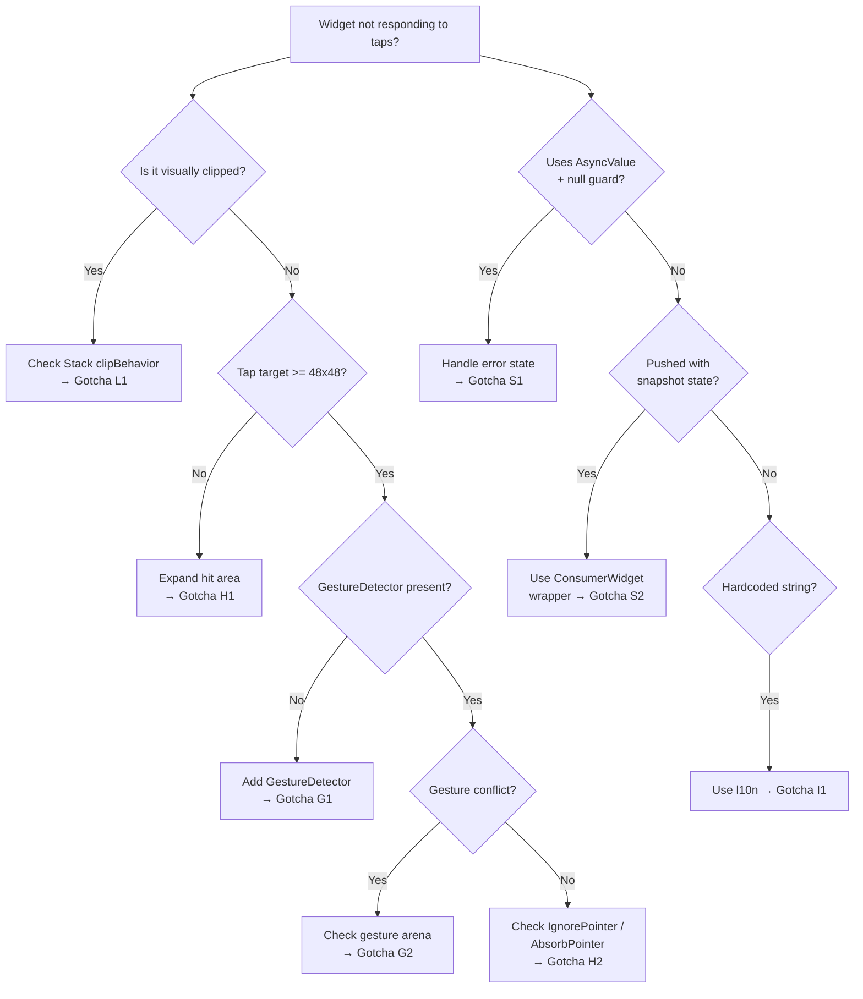

# Blueprint: Flutter UI Gotchas

<!-- METADATA — structured for agents, useful for humans
tags:        [flutter, ui, gotchas, gestures, hit-testing, layout]
category:    patterns
difficulty:  beginner
time:        15 min
stack:       [flutter, dart]
-->

> A catalog of common Flutter UI traps — clip behavior, gesture detection, hit-testing, and overflow — with symptoms, root causes, and proven fixes.

## TL;DR

Flutter's defaults for clipping, tap target sizing, and gesture handling silently break interactions in ways that look correct visually but fail at runtime. This reference collects the gotchas we've hit repeatedly so you can recognize and fix them in seconds instead of hours.

## When to Use

- A button or interactive widget is visible but does not respond to taps
- Drag or swipe gestures are ignored even though the handle looks correct
- Widgets overflow their parent and lose interactivity or disappear
- During UI code review to catch known pitfalls before they ship

## Prerequisites

- [ ] Basic familiarity with Flutter's widget tree and layout model
- [ ] A running Flutter project to test fixes against

## Overview



## Gotchas by Category

---

### Layout

#### L1 — Stack clipBehavior blocks interaction on negative-positioned children

**Symptom**: A widget positioned outside its Stack bounds (e.g. a close button at `top: -6`) is visually hidden AND unresponsive to taps.

**Root Cause**: `Stack` defaults to `clipBehavior: Clip.hardEdge`. This clips both painting and hit-testing. Anything outside the Stack's rect is unreachable.

**Fix**:

```dart
// BEFORE — close button is invisible and untappable
Stack(
  children: [
    Card(...),
    Positioned(
      top: -6,
      right: -6,
      child: CloseButton(),
    ),
  ],
)

// AFTER — set clipBehavior to Clip.none
Stack(
  clipBehavior: Clip.none, // allows painting + hit-testing outside bounds
  children: [
    Card(...),
    Positioned(
      top: -6,
      right: -6,
      child: CloseButton(),
    ),
  ],
)
```

**Prevention rule**: Every time you use a negative offset in `Positioned`, set `clipBehavior: Clip.none` on the parent `Stack`.

---

#### L2 — Unbounded constraints inside flexible parents

**Symptom**: `RenderBox was not laid out` or `Vertical viewport was given unbounded height` errors at runtime.

**Root Cause**: Placing a `ListView` (or other scrollable) directly inside a `Column` or another scrollable without constraining its height.

**Fix**:

```dart
// BEFORE — crashes
Column(
  children: [
    ListView(...),
  ],
)

// AFTER — constrain the ListView
Column(
  children: [
    Expanded(
      child: ListView(...),
    ),
  ],
)
// Or use shrinkWrap: true (slower for long lists)
```

**Prevention rule**: Never place a scrollable inside an unbounded-height parent without `Expanded`, `SizedBox`, or `shrinkWrap: true`.

---

### Gestures

#### G1 — Visual handle without GestureDetector

**Symptom**: A drag handle (e.g. a small bar at the top of a bottom sheet) looks draggable but does nothing when swiped.

**Root Cause**: The handle is a plain `Container` with no gesture recognition. Visual affordance does not imply interactivity.

**Fix**:

```dart
// BEFORE — looks draggable, isn't
Container(
  width: 36,
  height: 4,
  decoration: BoxDecoration(
    color: Colors.grey,
    borderRadius: BorderRadius.circular(2),
  ),
)

// AFTER — wrap with GestureDetector
GestureDetector(
  onVerticalDragUpdate: (details) {
    // dismiss or resize logic
  },
  child: Container(
    width: 36,
    height: 4,
    decoration: BoxDecoration(
      color: Colors.grey,
      borderRadius: BorderRadius.circular(2),
    ),
  ),
)
```

**Prevention rule**: Every visual affordance (handle, grip, chevron) must have a corresponding gesture detector or be wrapped in an interactive widget.

---

#### G2 — Gesture arena conflicts swallow taps

**Symptom**: A tap handler inside a scrollable or draggable parent fires inconsistently or never fires.

**Root Cause**: Flutter's gesture arena resolves conflicts by letting the most "greedy" recognizer win. A parent `GestureDetector` with `onPanUpdate` will beat a child's `onTap` because pan requires pointer movement to lose, while tap requires stillness to win.

**Fix**:

```dart
// Use onTapUp instead of onTap when inside a pan-detecting parent,
// or restructure so the parent uses RawGestureDetector with
// a custom gesture factory.

// Simpler: use GestureDetector.behavior
GestureDetector(
  behavior: HitTestBehavior.opaque, // ensures this widget enters the arena
  onTap: () { /* ... */ },
  child: child,
)
```

**Prevention rule**: When nesting gesture detectors, explicitly set `behavior` and test both gestures on a real device. Simulator single-taps can mask arena bugs.

---

### Hit Testing

#### H1 — Tap target too small

**Symptom**: Users report buttons are "broken" but they work on precise taps. Especially common on mobile.

**Root Cause**: The tappable area is smaller than the recommended 48x48 logical pixels (Material guidelines).

**Fix**:

```dart
// BEFORE — 24x24 icon, tiny hit area
IconButton(
  icon: Icon(Icons.close, size: 16),
  onPressed: onClose,
  padding: EdgeInsets.zero,
  constraints: BoxConstraints(),
)

// AFTER — maintain minimum tap target
IconButton(
  icon: Icon(Icons.close, size: 16),
  onPressed: onClose,
  // IconButton defaults to 48x48 — don't shrink it
)

// Or for custom widgets, expand the hit area:
SizedBox(
  width: 48,
  height: 48,
  child: Center(
    child: GestureDetector(
      onTap: onClose,
      behavior: HitTestBehavior.opaque,
      child: Icon(Icons.close, size: 16),
    ),
  ),
)
```

**Prevention rule**: Never override `constraints` or `padding` on interactive widgets to make them smaller than 48x48.

---

#### H2 — IgnorePointer / AbsorbPointer hiding in the tree

**Symptom**: A subtree is completely unresponsive. No errors, no visual clue.

**Root Cause**: An ancestor widget wraps the subtree in `IgnorePointer` or `AbsorbPointer` (sometimes conditionally, e.g. during an animation or loading state) and the condition is stuck.

**Fix**:

```dart
// Debug: search the widget tree
// In DevTools, select the unresponsive widget and walk up the tree
// looking for IgnorePointer or AbsorbPointer.

// Common pattern that causes this:
IgnorePointer(
  ignoring: isLoading, // if isLoading never flips back to false...
  child: MyForm(),
)

// Fix: ensure the boolean state resets, or add a timeout.
```

**Prevention rule**: Grep for `IgnorePointer` and `AbsorbPointer` during code review. Each usage must have a clear condition that resolves.

---

### Overflow

#### O1 — Overflow hidden by parent clip, breaking interaction

**Symptom**: A dropdown, tooltip, or popup is partially visible or cut off.

**Root Cause**: A parent widget (often `Card`, `Container` with `clipBehavior`, or `ClipRRect`) clips its children. Popups rendered as children of the clipped widget get cut.

**Fix**:

```dart
// Use Overlay or OverlayPortal to render popups above the clip boundary.
// Or use a package like dropdown_button2 that handles overlay placement.

// For tooltips, Flutter's built-in Tooltip widget already uses Overlay,
// so prefer it over custom tooltip containers.
```

**Prevention rule**: Popups, dropdowns, and tooltips should never be children of clipped containers. Use `Overlay`, `showMenu`, or `showDialog` to escape the clip boundary.

---

#### O2 — Text overflow without ellipsis crashes layout

**Symptom**: `A RenderFlex overflowed by N pixels` yellow-black warning stripe in debug mode.

**Root Cause**: `Text` widget inside a `Row` without flexible wrapping.

**Fix**:

```dart
// BEFORE — overflows
Row(
  children: [
    Icon(Icons.info),
    Text(veryLongString),
  ],
)

// AFTER — wrap in Expanded or Flexible
Row(
  children: [
    Icon(Icons.info),
    Expanded(
      child: Text(
        veryLongString,
        overflow: TextOverflow.ellipsis,
      ),
    ),
  ],
)
```

**Prevention rule**: Every `Text` inside a `Row` must be wrapped in `Expanded` or `Flexible` unless the text is guaranteed short (e.g. a single character label).

### State & Provider

#### S1 — Silent null return on async provider error

**Symptom**: Tapping a button (e.g. "Settings") does absolutely nothing. No crash, no error in console, no navigation.

**Root Cause**: The navigation guard checks `if (state == null) return;` on an `AsyncValue`. When the backing provider errors out (e.g. missing DB override), `valueOrNull` returns `null` and the tap is silently swallowed.

**Fix**:

```dart
// BEFORE — silent swallow
void _openSettings(BuildContext context, WidgetRef ref) {
  final state = ref.read(settingsProvider).valueOrNull;
  if (state == null) return; // provider errored → null → nothing happens

  Navigator.of(context).push(...);
}

// AFTER — handle error explicitly
void _openSettings(BuildContext context, WidgetRef ref) {
  final async = ref.read(settingsProvider);
  async.when(
    loading: () => ScaffoldMessenger.of(context).showSnackBar(
      const SnackBar(content: Text('Loading...')),
    ),
    error: (e, _) => ScaffoldMessenger.of(context).showSnackBar(
      SnackBar(content: Text('Error: $e')),
    ),
    data: (state) => Navigator.of(context).push(
      MaterialPageRoute(builder: (_) => const _LiveSettingsScreen()),
    ),
  );
}
```

**Prevention rule**: Never use `valueOrNull` + null-guard as a navigation gate. Always handle loading and error states explicitly, even if it's just a log or snackbar. See also [Riverpod Provider Wiring](riverpod-provider-wiring.md) for the full pattern.

---

#### S2 — Pushed screen receives snapshot state, never updates

**Symptom**: You change a setting (locale, currency), go back, re-open the screen — it shows the old value. Or worse: it looks updated but reverts on rebuild.

**Root Cause**: The screen was pushed with `SettingsScreen(state: currentState)` — a frozen snapshot. The pushed route never watches the provider.

**Fix**:

```dart
// BEFORE — snapshot, never updates
Navigator.push(MaterialPageRoute(
  builder: (_) => SettingsScreen(state: ref.read(provider).value!),
));

// AFTER — push a ConsumerWidget wrapper that watches the provider
Navigator.push(MaterialPageRoute(
  builder: (_) => const _LiveSettingsScreen(), // watches provider
));
```

**Prevention rule**: Never pass async state as a constructor parameter to a pushed route. Use a `ConsumerWidget` wrapper that `ref.watch`es the provider. The original widget stays a pure `StatelessWidget` for testability. Full pattern in [Riverpod Provider Wiring](riverpod-provider-wiring.md).

---

#### S3 — ConsumerWidget migration breaks widget tests

**Symptom**: After converting a widget from `StatelessWidget` to `ConsumerWidget`, widget tests crash with `UnimplementedError` or `ProviderScope not found`.

**Root Cause**: The widget now reads a provider at build time. Tests that pump the widget (or its parent) without a `ProviderScope` with the required overrides will crash.

**Fix**:

```dart
// BEFORE — works until someone adds a provider read
await tester.pumpWidget(const MyApp());

// AFTER — wrap with ProviderScope + in-memory DB
final db = UserDatabase(NativeDatabase.memory());
addTearDown(db.close);

await tester.pumpWidget(
  ProviderScope(
    overrides: [userDatabaseProvider.overrideWithValue(db)],
    child: const MyApp(),
  ),
);
```

**Prevention rule**: Every `ConsumerWidget` migration must include a widget test update. Grep your test files for usages of the affected widget and add `ProviderScope` overrides.

---

### Internationalization

#### I1 — Hardcoded strings "for now" that ship to production

**Symptom**: UI shows French strings to English users (or vice versa). Labels like `'Comptes'`, `'Récurrences'` hardcoded directly in the widget.

**Root Cause**: Developer uses string literals intending to "add i18n later" — then forgets or it ships before the TODO is addressed.

**Fix**:

```dart
// BEFORE — hardcoded
_Tile(label: 'Comptes', icon: Icons.account_balance)

// AFTER — always use l10n from the start
_Tile(label: l10n.moreAccounts, icon: Icons.account_balance)
```

**Prevention rule**: Never write a user-visible string literal in a widget. Add the ARB key at the same time you create the widget. Run `flutter gen-l10n` immediately. If you see a string literal in a `Text()` or `label:` during code review, it's a bug.

---

## Checklist

Use during UI code review:

- [ ] Every `Positioned` with negative offsets has a parent `Stack(clipBehavior: Clip.none)`
- [ ] Every visual affordance (handle, grip) has a corresponding `GestureDetector` or interactive widget
- [ ] All tap targets are at least 48x48 logical pixels
- [ ] No `ListView` or scrollable is placed inside an unbounded-height parent without constraints
- [ ] `IgnorePointer` / `AbsorbPointer` usages have clear, resolvable conditions
- [ ] Nested `GestureDetector`s explicitly set `behavior` and are tested on real devices
- [ ] `Text` inside `Row` is wrapped in `Expanded` or `Flexible` with overflow handling
- [ ] Popups and dropdowns use `Overlay` and are not children of clipped containers
- [ ] No `valueOrNull` + null-guard used as navigation gate — handle error/loading explicitly
- [ ] Pushed routes use `ConsumerWidget` wrappers, not snapshot state props
- [ ] Widget tests include `ProviderScope` override for every `ConsumerWidget` ancestor
- [ ] No user-visible string literals — all text uses `l10n.xxx` keys

## References

- [Flutter Stack class](https://api.flutter.dev/flutter/widgets/Stack-class.html) — official docs on clipBehavior
- [Flutter GestureDetector](https://api.flutter.dev/flutter/widgets/GestureDetector-class.html) — gesture handling and HitTestBehavior
- [Flutter gesture arena](https://docs.flutter.dev/development/ui/advanced/gestures) — how gesture disambiguation works
- [Material tap target guidelines](https://m3.material.io/foundations/accessible-design/accessibility-basics) — minimum 48x48dp
- [Flutter debugging layout issues](https://docs.flutter.dev/development/tools/devtools/inspector) — using DevTools to inspect the widget tree
