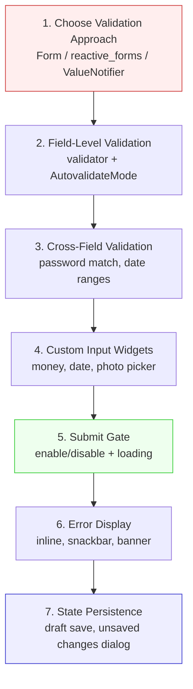

# Blueprint: Form Validation Patterns

<!-- METADATA — structured for agents, useful for humans
tags:        [form, validation, reactive, custom-input, flutter, dart]
category:    patterns
difficulty:  intermediate
time:        2 hours
stack:       [flutter, dart]
-->

> Validate forms reactively with field-level errors, cross-field rules, submit gates, and custom inputs — without frustrating the user with premature error messages.

## TL;DR

A complete validation playbook: choose between `Form` + `GlobalKey<FormState>`, `reactive_forms`, or manual `ValueNotifier`; wire field-level and cross-field validators; build custom input widgets that participate in form validation; gate the submit button on form validity; display errors inline and via snackbar; and persist draft state across navigation.

## When to Use

- Building any multi-field form (sign-up, profile edit, transaction entry, settings)
- You need real-time validation feedback without showing errors before the user has interacted
- Custom inputs (money, date picker, photo) must integrate with the same validation flow
- When **not** to use: single-field search bars or simple toggles that don't need validation

## Prerequisites

- [ ] Flutter project with Material or Cupertino scaffold
- [ ] Familiarity with `TextEditingController` and `FocusNode`
- [ ] (Optional) `reactive_forms` package if choosing the reactive approach

## Overview



## Steps

### 1. Choose a validation approach

**Why**: Flutter offers several validation strategies with different trade-offs. Picking the wrong one leads to either boilerplate explosion or fighting the framework. Decide once, stay consistent across the app.

| Approach | Best for | Trade-off |
|----------|----------|-----------|
| `Form` + `GlobalKey<FormState>` | Simple forms, < 8 fields | Built-in, but no reactive stream of validity |
| `reactive_forms` | Complex forms, dynamic fields, cross-field rules | Extra dependency, learning curve |
| Manual `ValueNotifier` | Single-field or highly custom UIs | Full control, but you wire everything yourself |

```dart
// Built-in Form approach — the default choice
class MyFormScreen extends StatefulWidget {
  const MyFormScreen({super.key});

  @override
  State<MyFormScreen> createState() => _MyFormScreenState();
}

class _MyFormScreenState extends State<MyFormScreen> {
  final _formKey = GlobalKey<FormState>();

  @override
  Widget build(BuildContext context) {
    return Form(
      key: _formKey,
      child: // ... fields go here
    );
  }
}
```

> **Decision**: If your form has cross-field dependencies, dynamic add/remove fields, or you need a stream of form validity, go with `reactive_forms` (see [Variant: reactive_forms](#variant-reactive_forms)). Otherwise, start with the built-in `Form`.

**Expected outcome**: A single `Form` widget wrapping all fields, with a `GlobalKey<FormState>` ready for validation and save calls.

### 2. Field-level validation

**Why**: Users expect immediate feedback on the field they just edited — but not before they've had a chance to type. `AutovalidateMode.onUserInteraction` gives the best UX: errors appear only after the user touches a field.

```dart
TextFormField(
  decoration: const InputDecoration(labelText: 'Email'),
  autovalidateMode: AutovalidateMode.onUserInteraction,
  keyboardType: TextInputType.emailAddress,
  validator: (value) {
    if (value == null || value.trim().isEmpty) {
      return 'Email is required';
    }
    final emailRegex = RegExp(r'^[^@\s]+@[^@\s]+\.[^@\s]+$');
    if (!emailRegex.hasMatch(value.trim())) {
      return 'Enter a valid email address';
    }
    return null; // valid
  },
);
```

For async validation (e.g., checking if a username is taken), validate on submit rather than on every keystroke to avoid excessive network calls:

```dart
// Async validation — triggered manually, not in the validator callback
Future<String?> _validateUsernameRemote(String username) async {
  final taken = await _userRepo.isUsernameTaken(username);
  return taken ? 'Username already taken' : null;
}
```

**Expected outcome**: Each field shows its error message below the input only after the user has interacted with it. No red text on initial render.

### 3. Cross-field validation

**Why**: Some rules span multiple fields — password confirmation, date ranges, conditional required fields. These can't live in a single field's `validator` because they need access to sibling values.

```dart
class _MyFormScreenState extends State<MyFormScreen> {
  final _formKey = GlobalKey<FormState>();
  final _passwordController = TextEditingController();
  final _confirmController = TextEditingController();
  final _startDateController = TextEditingController();

  DateTime? _startDate;
  DateTime? _endDate;

  @override
  void dispose() {
    _passwordController.dispose();
    _confirmController.dispose();
    _startDateController.dispose();
    super.dispose();
  }

  @override
  Widget build(BuildContext context) {
    return Form(
      key: _formKey,
      child: Column(
        children: [
          // Password confirmation — reference sibling controller
          TextFormField(
            controller: _confirmController,
            autovalidateMode: AutovalidateMode.onUserInteraction,
            validator: (value) {
              if (value != _passwordController.text) {
                return 'Passwords do not match';
              }
              return null;
            },
          ),

          // Date range — end must be after start
          TextFormField(
            decoration: const InputDecoration(labelText: 'End date'),
            autovalidateMode: AutovalidateMode.onUserInteraction,
            validator: (value) {
              if (_startDate != null && _endDate != null &&
                  !_endDate!.isAfter(_startDate!)) {
                return 'End date must be after start date';
              }
              return null;
            },
          ),
        ],
      ),
    );
  }
}
```

For conditional required fields (e.g., "Company name" required only when "Employment type" is "Employed"), read the controlling field's value inside the dependent field's validator.

**Expected outcome**: Cross-field errors appear inline under the dependent field, using the same error styling as single-field validators.

### 4. Custom input widgets

**Why**: Real apps need inputs beyond `TextFormField` — money amounts with numpad, date pickers, category selectors, photo pickers. These must participate in `Form` validation via `FormField<T>`.

```dart
/// A money input that integrates with Form validation.
class MoneyFormField extends FormField<int> {
  MoneyFormField({
    super.key,
    required String label,
    super.validator,
    super.onSaved,
    int initialValue = 0,
  }) : super(
          initialValue: initialValue,
          autovalidateMode: AutovalidateMode.onUserInteraction,
          builder: (FormFieldState<int> state) {
            return Column(
              crossAxisAlignment: CrossAxisAlignment.start,
              children: [
                GestureDetector(
                  onTap: () async {
                    final result = await showNumpadBottomSheet(
                      state.context,
                      initialValue: state.value ?? 0,
                    );
                    if (result != null) {
                      state.didChange(result);
                    }
                  },
                  child: InputDecorator(
                    decoration: InputDecoration(
                      labelText: label,
                      errorText: state.errorText,
                    ),
                    child: Text(formatCurrency(state.value ?? 0)),
                  ),
                ),
              ],
            );
          },
        );
}
```

```dart
/// Date picker that participates in Form validation.
class DatePickerFormField extends FormField<DateTime> {
  DatePickerFormField({
    super.key,
    required String label,
    super.validator,
    super.onSaved,
  }) : super(
          autovalidateMode: AutovalidateMode.onUserInteraction,
          builder: (FormFieldState<DateTime> state) {
            return InkWell(
              onTap: () async {
                final picked = await showDatePicker(
                  context: state.context,
                  initialDate: state.value ?? DateTime.now(),
                  firstDate: DateTime(2000),
                  lastDate: DateTime(2100),
                );
                if (picked != null) state.didChange(picked);
              },
              child: InputDecorator(
                decoration: InputDecoration(
                  labelText: label,
                  errorText: state.errorText,
                ),
                child: Text(
                  state.value != null
                      ? DateFormat.yMMMd().format(state.value!)
                      : 'Select date',
                ),
              ),
            );
          },
        );
}
```

Use the same `FormField<T>` pattern for category selectors (`FormField<Category>`) and photo pickers (`FormField<File>`).

**Expected outcome**: Custom inputs show validation errors in the same style as `TextFormField`, and `_formKey.currentState!.validate()` checks them all in one call.

### 5. Submit gate pattern

**Why**: Users should never tap a disabled-looking submit button, and they should never be able to double-tap submit while a request is in flight. Gate the button on both form validity and loading state.

```dart
class _MyFormScreenState extends State<MyFormScreen> {
  final _formKey = GlobalKey<FormState>();
  bool _isSubmitting = false;

  // Track whether the form has been modified for the submit gate.
  // For built-in Form, listen to field changes.
  bool _hasInteracted = false;

  Future<void> _submit() async {
    if (!_formKey.currentState!.validate()) return;
    if (_isSubmitting) return; // prevent double-tap

    setState(() => _isSubmitting = true);

    try {
      _formKey.currentState!.save();
      await _repository.saveEntry(/* ... */);
      if (mounted) Navigator.of(context).pop(true);
    } catch (e) {
      if (mounted) {
        ScaffoldMessenger.of(context).showSnackBar(
          SnackBar(content: Text('Save failed: $e')),
        );
      }
    } finally {
      if (mounted) setState(() => _isSubmitting = false);
    }
  }

  @override
  Widget build(BuildContext context) {
    return Column(
      children: [
        Form(
          key: _formKey,
          onChanged: () => setState(() => _hasInteracted = true),
          child: // ... fields
        ),
        ElevatedButton(
          onPressed: _isSubmitting ? null : _submit,
          child: _isSubmitting
              ? const SizedBox(
                  width: 20, height: 20,
                  child: CircularProgressIndicator(strokeWidth: 2),
                )
              : const Text('Save'),
        ),
      ],
    );
  }
}
```

> **Key insight**: `Form.onChanged` fires on every keystroke, which is useful for enabling the submit button. But don't call `validate()` inside `onChanged` — it's too aggressive and causes jank on large forms.

**Expected outcome**: Submit button is visually disabled during submission, shows a spinner, and prevents duplicate requests. Server errors surface via snackbar.

### 6. Error display patterns

**Why**: Different error types need different display: field-level errors inline, server errors in a snackbar, and validation summary banners for long forms where the error might be off-screen.

```dart
// 1. Inline errors — handled by TextFormField/FormField automatically.
//    The validator return string appears below the field.

// 2. Snackbar for server errors — shown in the catch block (see Step 5).

// 3. Error summary banner — useful for long forms
Widget _buildErrorBanner(List<String> errors) {
  if (errors.isEmpty) return const SizedBox.shrink();

  return MaterialBanner(
    backgroundColor: Theme.of(context).colorScheme.errorContainer,
    content: Column(
      crossAxisAlignment: CrossAxisAlignment.start,
      children: [
        const Text('Please fix the following errors:',
            style: TextStyle(fontWeight: FontWeight.bold)),
        for (final error in errors)
          Padding(
            padding: const EdgeInsets.only(top: 4),
            child: Text('• $error'),
          ),
      ],
    ),
    actions: [
      TextButton(
        onPressed: () => setState(() => _bannerErrors.clear()),
        child: const Text('Dismiss'),
      ),
    ],
  );
}

// After a failed validate(), scroll to the first error:
void _submitWithScroll() {
  if (!_formKey.currentState!.validate()) {
    // Scroll to first error — Scrollable.ensureVisible on the first
    // field with an error, or simply scroll to top of the form.
    _scrollController.animateTo(
      0,
      duration: const Duration(milliseconds: 300),
      curve: Curves.easeOut,
    );
    return;
  }
  _submit();
}
```

**Expected outcome**: Field errors show inline, server errors show as dismissible snackbars, and long forms scroll to the error area with an optional summary banner.

### 7. Form state persistence

**Why**: Users lose work when they accidentally swipe back or the app backgrounds. Save draft state on dispose and restore it when the form reopens. Guard back-navigation with an "unsaved changes" dialog.

```dart
class _MyFormScreenState extends State<MyFormScreen> {
  final _formKey = GlobalKey<FormState>();
  final _nameController = TextEditingController();
  final _amountController = TextEditingController();

  bool _isDirty = false;

  @override
  void initState() {
    super.initState();
    _restoreDraft();
  }

  Future<void> _restoreDraft() async {
    final draft = await _draftStore.load('entry_form');
    if (draft != null) {
      _nameController.text = draft['name'] ?? '';
      _amountController.text = draft['amount'] ?? '';
    }
  }

  @override
  void dispose() {
    if (_isDirty) {
      // Fire-and-forget save — controllers are still alive in dispose()
      _draftStore.save('entry_form', {
        'name': _nameController.text,
        'amount': _amountController.text,
      });
    }
    _nameController.dispose();
    _amountController.dispose();
    super.dispose();
  }

  // Guard back-navigation
  Future<bool> _onWillPop() async {
    if (!_isDirty) return true;

    final result = await showDialog<bool>(
      context: context,
      builder: (context) => AlertDialog(
        title: const Text('Discard changes?'),
        content: const Text('You have unsaved changes. Are you sure?'),
        actions: [
          TextButton(
            onPressed: () => Navigator.pop(context, false),
            child: const Text('Keep editing'),
          ),
          TextButton(
            onPressed: () => Navigator.pop(context, true),
            child: const Text('Discard'),
          ),
        ],
      ),
    );
    return result ?? false;
  }

  @override
  Widget build(BuildContext context) {
    return PopScope(
      canPop: !_isDirty,
      onPopInvokedWithResult: (didPop, _) async {
        if (didPop) return;
        final shouldPop = await _onWillPop();
        if (shouldPop && context.mounted) {
          Navigator.of(context).pop();
        }
      },
      child: Scaffold(
        body: Form(
          key: _formKey,
          onChanged: () => setState(() => _isDirty = true),
          child: // ... fields
        ),
      ),
    );
  }
}
```

**Expected outcome**: Navigating away and returning restores the draft. Pressing back on a dirty form shows a confirmation dialog. Successful submit clears the draft.

## Variants

<details>
<summary><strong>Variant: reactive_forms</strong></summary>

For complex forms with many cross-field rules, dynamic field arrays, or when you need a stream of form validity:

```dart
// pubspec.yaml: reactive_forms: ^17.0.0

final form = FormGroup({
  'email': FormControl<String>(
    validators: [Validators.required, Validators.email],
  ),
  'password': FormControl<String>(
    validators: [Validators.required, Validators.minLength(8)],
  ),
  'confirmPassword': FormControl<String>(),
}, validators: [
  // Cross-field validator at the group level
  const MustMatchValidator('password', 'confirmPassword'),
]);

// In the widget tree
ReactiveForm(
  formGroup: form,
  child: Column(
    children: [
      ReactiveTextField<String>(
        formControlName: 'email',
        decoration: const InputDecoration(labelText: 'Email'),
      ),
      // Submit gate — reactive style
      ReactiveFormConsumer(
        builder: (context, formGroup, child) {
          return ElevatedButton(
            onPressed: formGroup.valid ? _submit : null,
            child: const Text('Submit'),
          );
        },
      ),
    ],
  ),
);
```

The `formGroup.valid` stream drives the submit gate automatically — no manual `onChanged` tracking.

</details>

<details>
<summary><strong>Variant: BLoC/Cubit form validation</strong></summary>

If the project uses BLoC instead of direct `Form` state, encapsulate validation in a Cubit:

```dart
class EntryFormCubit extends Cubit<EntryFormState> {
  EntryFormCubit() : super(const EntryFormState());

  void nameChanged(String value) {
    final error = value.isEmpty ? 'Name is required' : null;
    emit(state.copyWith(name: value, nameError: error));
  }

  void amountChanged(int value) {
    final error = value <= 0 ? 'Amount must be positive' : null;
    emit(state.copyWith(amount: value, amountError: error));
  }

  bool get isValid => state.nameError == null && state.amountError == null;
}
```

The Cubit emits a new state on each change, and `BlocBuilder` rebuilds the submit button reactively.

</details>

## Gotchas

> **AutovalidateMode.always shows errors before typing**: Setting `AutovalidateMode.always` displays red error text the instant the form renders, before the user has typed a single character. **Fix**: Use `AutovalidateMode.onUserInteraction` so errors appear only after the user taps into and modifies (or leaves) a field.

> **Controller disposed before async validation completes**: If you kick off an async validation (e.g., checking username availability) and the user navigates away, the `TextEditingController` may be disposed by the time the future completes, causing a crash. **Fix**: Cancel the async operation on dispose, or guard the callback with `if (!mounted) return;`.

> **Keyboard covers the submit button**: On smaller devices the soft keyboard can obscure the submit button entirely, making the form appear broken. **Fix**: Wrap the form in a `SingleChildScrollView`, keep `Scaffold.resizeToAvoidBottomInset: true` (the default), and add `EdgeInsets.only(bottom: MediaQuery.of(context).viewInsets.bottom)` padding if using a custom scroll layout.

> **Form.save() does not call validators**: Calling `_formKey.currentState!.save()` only triggers `onSaved` callbacks — it does **not** run validators. Submitting without validating first persists invalid data. **Fix**: Always call `validate()` before `save()`, and only proceed to `save()` if `validate()` returns `true`.

> **Cross-field validator sees stale value**: When a user changes the password field, the confirm-password field's validator may still reference the old password value if it hasn't been re-validated. **Fix**: Call `_formKey.currentState!.validate()` on submit (which re-runs all validators with current values) rather than relying solely on per-field `AutovalidateMode`.

## Checklist

- [ ] Validation approach chosen and documented in project conventions
- [ ] Every `TextFormField` has `autovalidateMode: AutovalidateMode.onUserInteraction`
- [ ] Cross-field validators reference live controller values, not stale snapshots
- [ ] Custom inputs extend `FormField<T>` and display `state.errorText`
- [ ] Submit button is disabled during submission and shows loading indicator
- [ ] `validate()` is always called before `save()`
- [ ] Server errors are shown via snackbar, not silent catch blocks
- [ ] Form is wrapped in `SingleChildScrollView` for keyboard safety
- [ ] `PopScope` guards back-navigation when form is dirty
- [ ] Draft persistence saves on dispose and restores on init
- [ ] All `TextEditingController` and `FocusNode` instances are disposed

## References

- [Flutter — Form validation cookbook](https://docs.flutter.dev/cookbook/forms/validation) — official guide to `Form` + `GlobalKey`
- [reactive_forms package](https://pub.dev/packages/reactive_forms) — declarative form handling with cross-field validators
- [AutovalidateMode API](https://api.flutter.dev/flutter/widgets/AutovalidateMode.html) — enum docs explaining `disabled`, `always`, `onUserInteraction`
- [FormField class](https://api.flutter.dev/flutter/widgets/FormField-class.html) — base class for building custom inputs that participate in `Form` validation
- [PopScope migration guide](https://docs.flutter.dev/release/breaking-changes/android-predictive-back) — replacing deprecated `WillPopScope` with `PopScope`
