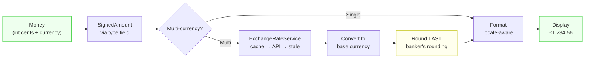

# Blueprint: Money & Currency Handling

<!-- METADATA — structured for agents, useful for humans
tags:        [money, currency, value-object, exchange-rate, formatting, dart, flutter]
category:    patterns
difficulty:  intermediate
time:        2 hours
stack:       [flutter, dart]
-->

> Represent monetary amounts safely with integer cents, handle multi-currency conversion, and format for display — no floating-point surprises.

## TL;DR

Store money as **immutable value objects** backed by integer cents. Use a `type` field (income/expense/transfer) to determine sign via a `signedAmount` getter. Format with locale-aware `NumberFormat`, convert between currencies through a cache+API+fallback exchange rate service, and always round **last**.

## When to Use

- Building any app that deals with money (budgets, invoices, e-commerce, expense trackers)
- Displaying amounts in multiple currencies or converting between them
- When you see `double amount` anywhere near financial logic — replace it immediately
- **Not** for cryptocurrency sub-unit precision (satoshis need `BigInt`, not `int` cents)

## Prerequisites

- [ ] A Dart/Flutter project with a model layer
- [ ] `intl` package for locale-aware number formatting
- [ ] Basic understanding of value objects and operator overloading in Dart

## Overview



## Steps

### 1. Create a Money value object

**Why**: Floating-point arithmetic is broken for money (`0.1 + 0.2 == 0.30000000000000004`). Storing cents as `int` eliminates rounding drift entirely. Making the object immutable prevents accidental mutation and makes it safe to pass around.

```dart
// lib/core/models/money.dart

class Money {
  const Money({required this.cents, required this.currency});

  /// Create from a double amount (e.g. 12.99 → 1299 cents).
  /// Only use at input boundaries (user entry, API response).
  factory Money.fromDouble(double amount, String currency) {
    return Money(cents: (amount * 100).round(), currency: currency);
  }

  /// Zero amount in a given currency.
  factory Money.zero(String currency) => Money(cents: 0, currency: currency);

  final int cents;
  final String currency;

  double get asDouble => cents / 100;

  Money operator +(Money other) {
    assert(currency == other.currency, 'Cannot add different currencies');
    return Money(cents: cents + other.cents, currency: currency);
  }

  Money operator -(Money other) {
    assert(currency == other.currency, 'Cannot subtract different currencies');
    return Money(cents: cents - other.cents, currency: currency);
  }

  Money operator *(num factor) {
    return Money(cents: (cents * factor).round(), currency: currency);
  }

  Money abs() => Money(cents: cents.abs(), currency: currency);

  bool get isZero => cents == 0;
  bool get isNegative => cents < 0;
  bool get isPositive => cents > 0;

  @override
  bool operator ==(Object other) =>
      other is Money && cents == other.cents && currency == other.currency;

  @override
  int get hashCode => Object.hash(cents, currency);

  @override
  String toString() => 'Money($cents $currency)';
}
```

**Expected outcome**: All monetary arithmetic uses `int` under the hood. `Money(cents: 10, currency: 'USD') + Money(cents: 20, currency: 'USD')` yields exactly `Money(cents: 30, currency: 'USD')` — no floating-point drift.

### 2. Signed amount pattern

**Why**: Storing amounts as always-positive with a separate `type` field avoids confusion about whether a negative number means "expense" or "correction". The sign is derived, not stored — making it impossible for sign and type to disagree.

```dart
// lib/core/models/app_transaction.dart

enum TransactionType { income, expense, transfer }

class AppTransaction {
  const AppTransaction({
    required this.id,
    required this.amount, // Always positive
    required this.type,
    required this.date,
    this.description = '',
  }) : assert(amount.cents >= 0, 'Store positive, derive sign from type');

  final String id;
  final Money amount;
  final TransactionType type;
  final DateTime date;
  final String description;

  /// The amount with correct sign for aggregation.
  /// Income → positive, expense/transfer → negative.
  Money get signedAmount {
    switch (type) {
      case TransactionType.income:
        return amount;
      case TransactionType.expense:
      case TransactionType.transfer:
        return Money(cents: -amount.cents, currency: amount.currency);
    }
  }
}
```

Usage for totals:

```dart
Money total(List<AppTransaction> transactions, String currency) {
  return transactions.fold(
    Money.zero(currency),
    (sum, t) => sum + t.signedAmount,
  );
}
```

**Expected outcome**: `signedAmount` is the single source of truth for sign. UI can display `amount` (always positive) with a color/icon for type, while aggregation uses `signedAmount`.

### 3. Currency formatting

**Why**: Currency symbol position, decimal separators, and grouping vary by locale (`$1,234.56` vs `1.234,56 €` vs `1 234,56 €`). Hard-coding any of these guarantees bugs for international users.

```dart
// lib/core/utils/money_formatter.dart

import 'package:intl/intl.dart';

class MoneyFormatter {
  MoneyFormatter({required this.locale});

  final String locale;

  /// Full format: $1,234.56 or 1.234,56 €
  String format(Money money) {
    final formatter = NumberFormat.currency(
      locale: locale,
      symbol: _symbolFor(money.currency),
      decimalDigits: 2,
    );
    return formatter.format(money.asDouble);
  }

  /// Compact format for large amounts: $1.2K, $3.4M
  String formatCompact(Money money) {
    final formatter = NumberFormat.compactCurrency(
      locale: locale,
      symbol: _symbolFor(money.currency),
    );
    return formatter.format(money.asDouble);
  }

  /// Amount without symbol, for input fields: 1,234.56
  String formatPlain(Money money) {
    final formatter = NumberFormat.decimalPatternDigits(
      locale: locale,
      decimalDigits: 2,
    );
    return formatter.format(money.asDouble);
  }

  String _symbolFor(String currencyCode) {
    return NumberFormat.currency(locale: locale, name: currencyCode)
        .currencySymbol;
  }
}
```

**Expected outcome**: `MoneyFormatter(locale: 'de_DE').format(Money(cents: 123456, currency: 'EUR'))` produces `1.234,56 €`. Same amount with `en_US` produces `€1,234.56`.

### 4. Exchange rate service with cache + fallback

**Why**: Exchange rate APIs go down. Users should never be blocked from seeing their data because a third-party API is unreachable. The fallback chain (fresh cache → API → stale cache → error) guarantees graceful degradation.

```dart
// lib/core/services/exchange_rate_provider.dart

abstract class ExchangeRateProvider {
  Future<double> getRate(String from, String to);
}

// lib/core/services/exchange_rate_cache.dart

class RateCache {
  final _store = <String, CacheEntry<double>>{};
  final _manualOverrides = <String, double>{};

  static const _ttl = Duration(hours: 1);

  CacheEntry<double>? get(String key) {
    if (_manualOverrides.containsKey(key)) {
      // Manual overrides never expire — they represent user intent
      return CacheEntry(_manualOverrides[key]!, DateTime.now());
    }
    return _store[key];
  }

  void put(String key, double value) {
    _store[key] = CacheEntry(value, DateTime.now());
  }

  void setManualOverride(String from, String to, double rate) {
    _manualOverrides['$from→$to'] = rate;
  }

  void removeManualOverride(String from, String to) {
    _manualOverrides.remove('$from→$to');
  }

  void clearApiCache() {
    _store.clear();
    // Preserve manual overrides — user intent survives cache clear
  }
}

class CacheEntry<T> {
  CacheEntry(this.value, this.timestamp);

  final T value;
  final DateTime timestamp;

  bool get isStale =>
      DateTime.now().difference(timestamp) > RateCache._ttl;
}

// lib/core/services/exchange_rate_service.dart

class ExchangeRateService {
  ExchangeRateService({
    required this.provider,
    required this.cache,
  });

  final ExchangeRateProvider provider;
  final RateCache cache;

  Future<({double rate, bool isStale})> getRate(String from, String to) async {
    if (from == to) return (rate: 1.0, isStale: false);

    final key = '$from→$to';

    // 1. Fresh cache?
    final cached = cache.get(key);
    if (cached != null && !cached.isStale) {
      return (rate: cached.value, isStale: false);
    }

    // 2. Try API
    try {
      final rate = await provider.getRate(from, to);
      cache.put(key, rate);
      return (rate: rate, isStale: false);
    } catch (_) {
      // 3. Stale cache fallback
      if (cached != null) {
        return (rate: cached.value, isStale: true);
      }

      // 4. No data at all
      rethrow;
    }
  }
}
```

**Expected outcome**: The service returns a record with `rate` and `isStale`. The UI can show a warning icon when `isStale` is true, but the user is never blocked.

### 5. Multi-currency aggregation

**Why**: A budget app with EUR and USD expenses needs a single total. Convert everything to the base currency for aggregation, but always show the original amount alongside the converted one so the user knows exactly what was charged.

```dart
// lib/core/services/multi_currency_aggregator.dart

class ConvertedAmount {
  const ConvertedAmount({
    required this.original,
    required this.converted,
    required this.rate,
    required this.isStaleRate,
  });

  final Money original;
  final Money converted;
  final double rate;
  final bool isStaleRate;
}

class MultiCurrencyAggregator {
  MultiCurrencyAggregator({
    required this.exchangeRateService,
    required this.baseCurrency,
  });

  final ExchangeRateService exchangeRateService;
  final String baseCurrency;

  Future<ConvertedAmount> convert(Money amount) async {
    if (amount.currency == baseCurrency) {
      return ConvertedAmount(
        original: amount,
        converted: amount,
        rate: 1.0,
        isStaleRate: false,
      );
    }

    final (:rate, :isStale) = await exchangeRateService.getRate(
      amount.currency,
      baseCurrency,
    );

    // Multiply cents by rate, round LAST
    final convertedCents = (amount.cents * rate).round();
    return ConvertedAmount(
      original: amount,
      converted: Money(cents: convertedCents, currency: baseCurrency),
      rate: rate,
      isStaleRate: isStale,
    );
  }

  Future<Money> totalInBaseCurrency(List<AppTransaction> transactions) async {
    var totalCents = 0;
    for (final t in transactions) {
      final converted = await convert(t.signedAmount);
      totalCents += converted.converted.cents;
    }
    return Money(cents: totalCents, currency: baseCurrency);
  }
}
```

**Expected outcome**: UI shows "€45.00 (~$48.60)" for a EUR expense in a USD-base app. The total sums all converted amounts in the base currency.

### 6. Serialization — DB, JSON, and Drift type converters

**Why**: The `Money` value object must survive round-trips through JSON APIs, local databases, and Drift (SQLite). Always store the `int` cents — never serialize `double`.

```dart
// JSON serialization
extension MoneyJson on Money {
  Map<String, dynamic> toJson() => {
    'cents': cents,
    'currency': currency,
  };

  static Money fromJson(Map<String, dynamic> json) => Money(
    cents: json['cents'] as int,
    currency: json['currency'] as String,
  );
}

// Drift type converter — stores cents as INTEGER in SQLite
class MoneyConverter extends TypeConverter<Money, int> {
  const MoneyConverter(this.currency);

  final String currency;

  @override
  Money fromSql(int fromDb) => Money(cents: fromDb, currency: currency);

  @override
  int toSql(Money value) => value.cents;
}

// Drift table example
class Transactions extends Table {
  IntColumn get id => integer().autoIncrement()();
  IntColumn get amountCents => integer()(); // Store raw cents
  TextColumn get currency => text().withLength(min: 3, max: 3)();
  TextColumn get type => textEnum<TransactionType>()();
  DateTimeColumn get date => dateTime()();
  TextColumn get description => text().withDefault(const Constant(''))();
}
```

**Expected outcome**: `Money(cents: 1299, currency: 'USD')` serializes to `{"cents": 1299, "currency": "USD"}` in JSON and stores as `1299` + `"USD"` in SQLite. No precision loss on round-trip.

## Variants

<details>
<summary><strong>Variant: Cryptocurrency with sub-cent precision</strong></summary>

Crypto amounts need more than 2 decimal places (BTC has 8, ETH has 18). Use `BigInt` for the smallest unit and a `decimals` field:

```dart
class CryptoAmount {
  const CryptoAmount({
    required this.units,     // smallest unit (satoshi, wei)
    required this.decimals,  // 8 for BTC, 18 for ETH
    required this.symbol,
  });

  final BigInt units;
  final int decimals;
  final String symbol;

  double get asDouble => units.toDouble() / pow(10, decimals);
}
```

This pattern does **not** replace `Money` for fiat — keep them separate to avoid mixing precision models.

</details>

<details>
<summary><strong>Variant: Offline-first with persisted rate cache</strong></summary>

For apps that must work fully offline, persist the rate cache to SQLite or shared preferences instead of keeping it in-memory only:

```dart
class PersistedRateCache extends RateCache {
  PersistedRateCache({required this.prefs});

  final SharedPreferences prefs;

  @override
  CacheEntry<double>? get(String key) {
    // Check manual overrides first (parent behavior)
    final override = super.get(key);
    if (override != null) return override;

    final json = prefs.getString('rate_$key');
    if (json == null) return null;
    final data = jsonDecode(json) as Map<String, dynamic>;
    return CacheEntry(
      data['rate'] as double,
      DateTime.parse(data['timestamp'] as String),
    );
  }

  @override
  void put(String key, double value) {
    super.put(key, value);
    prefs.setString('rate_$key', jsonEncode({
      'rate': value,
      'timestamp': DateTime.now().toIso8601String(),
    }));
  }
}
```

This way rates survive app restarts, and stale fallback works even on cold start with no network.

</details>

## Gotchas

> **Floating-point arithmetic for money**: `0.1 + 0.2` produces `0.30000000000000004` in Dart (and every IEEE 754 language). Over thousands of transactions the drift compounds. **Fix**: Always use `int` cents internally. Only convert to `double` at the display boundary via `asDouble`.

> **Currency symbol position varies by locale**: Hard-coding `$${amount}` breaks for EUR (`€10` in en_US but `10 €` in de_DE), JPY (no decimals), and INR (lakhs grouping). **Fix**: Use `NumberFormat.currency(locale: locale)` from the `intl` package — it handles symbol placement, grouping, and decimal separators per locale.

> **Exchange rate staleness when API is down**: If you block on a fresh rate, users cannot see their data during network outages. **Fix**: Return the stale cached rate with an `isStale: true` flag. Show a subtle warning in the UI but never block the user. Manual overrides bypass the API entirely and never expire.

> **Rounding errors on currency conversion**: Converting USD→EUR→USD should be idempotent but rarely is due to intermediate rounding. **Fix**: Round **last**, after all arithmetic is complete. When you must round intermediate values, use banker's rounding (`(cents * rate).round()` in Dart, which uses round-half-to-even) to avoid systematic bias.

> **Mixing currencies in arithmetic**: `Money(cents: 100, currency: 'USD') + Money(cents: 200, currency: 'EUR')` is a logic error, not a valid operation. **Fix**: Assert same currency in operators. Force explicit conversion through `ExchangeRateService` before adding amounts in different currencies.

## Checklist

- [ ] `Money` value object stores `int` cents — no `double` for amounts
- [ ] `Money` is immutable with `const` constructor
- [ ] Arithmetic operators assert same currency
- [ ] Transactions store positive amounts; sign derived from `type` via `signedAmount`
- [ ] Formatting uses `NumberFormat.currency(locale: ...)` — no hard-coded symbols
- [ ] Exchange rate service follows cache → API → stale cache → error chain
- [ ] Manual rate overrides never expire and survive `clearApiCache()`
- [ ] Stale rates return with a flag — UI warns but never blocks
- [ ] Rounding happens last, after all arithmetic
- [ ] JSON/DB serialization stores `int` cents, not `double`
- [ ] Drift type converter round-trips `Money` without precision loss

## Artifacts

| Artifact | Location | Description |
|----------|----------|-------------|
| Value object | `lib/core/models/money.dart` | Immutable Money with int cents and operators |
| Transaction model | `lib/core/models/app_transaction.dart` | Signed amount pattern via type field |
| Formatter | `lib/core/utils/money_formatter.dart` | Locale-aware currency display |
| Rate cache | `lib/core/services/exchange_rate_cache.dart` | TTL cache with manual overrides |
| Rate service | `lib/core/services/exchange_rate_service.dart` | Cache + API + stale fallback chain |
| Aggregator | `lib/core/services/multi_currency_aggregator.dart` | Convert and sum across currencies |
| Drift converter | `lib/infrastructure/converters/money_converter.dart` | SQLite round-trip for Money |

## References

- [Service Layer Pattern](service-layer-pattern.md) — cache + fallback chain used by ExchangeRateService
- [Dart `intl` package](https://pub.dev/packages/intl) — NumberFormat for locale-aware formatting
- [IEEE 754 floating-point pitfalls](https://floating-point-gui.de/) — why integer cents matter
- [ViewModel Pure Functions](viewmodel-pure-functions.md) — how VMs consume Money for display
