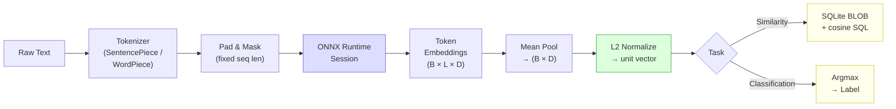

# Blueprint: On-Device ML Inference

<!-- METADATA — structured for agents, useful for humans
tags:        [ml, onnx, inference, embeddings, on-device, mobile]
category:    patterns
difficulty:  advanced
time:        4 hours
stack:       [flutter, dart, onnx]
-->

> Run ONNX models on-device for embeddings, classification, or NLP tasks — no network, no API costs, full privacy.

## TL;DR

Load a quantized ONNX model from Flutter assets, run tokenization and inference on a background isolate, and produce normalized embedding vectors or classification labels entirely on the device. Pair the output with SQLite for similarity search or label-based filtering.

## When to Use

- You need semantic search, sentence similarity, or text classification without calling an external API
- User data is sensitive and must never leave the device (medical, financial, personal notes)
- The app must work fully offline and respond in under 500ms per query
- You want zero ongoing inference costs at scale
- **Not** for large models (> 200MB) where the app bundle size penalty is prohibitive — use a remote API in those cases
- **Not** when you need GPT-class reasoning; on-device models handle matching and classification, not generation

## Prerequisites

- [ ] Flutter project targeting iOS 14+ and Android API 24+ (minimum ONNX Runtime Mobile support)
- [ ] `onnxruntime` Flutter package added to `pubspec.yaml`
- [ ] ONNX model file exported from HuggingFace or converted via `optimum` or `onnxmltools`
- [ ] Tokenizer vocabulary file (`.json` or `.model`) matching the chosen model
- [ ] Familiarity with Flutter isolates and `rootBundle`

## Overview



## Steps

### 1. Add dependencies and declare the model asset

**Why**: ONNX Runtime Mobile is the only production-ready cross-platform inference engine for Flutter. Declaring the model in `pubspec.yaml` bundles it into the app, but Flutter compresses assets by default — you must copy it to a temp file before loading (see Gotchas).

```yaml
# pubspec.yaml
dependencies:
  onnxruntime: ^1.0.0   # Dart bindings for ONNX Runtime Mobile
  path_provider: ^2.1.2  # needed to write model to temp file
  path: ^1.9.0

flutter:
  assets:
    - assets/models/all-MiniLM-L6-v2.onnx
    - assets/models/tokenizer.json
```

```
assets/
  models/
    all-MiniLM-L6-v2.onnx   # 23 MB — embedding model
    tokenizer.json            # WordPiece vocab for the model above
```

**Expected outcome**: `flutter pub get` succeeds and `flutter build` includes both files under `assets/models/`.

### 2. Choose a model for your use case

**Why**: Model choice drives app size, inference latency, memory consumption, and output quality. Picking the wrong model wastes days of integration work. Match the model to the platform constraints first.

| Model | Dimensions | Size | Speed (mid-range Android) | Quality |
|-------|-----------|------|--------------------------|---------|
| paraphrase-MiniLM-L3-v2 | 384 | 17 MB | ~80ms / query | Acceptable |
| all-MiniLM-L6-v2 | 384 | 23 MB | ~130ms / query | Good |
| multilingual-e5-small | 384 | 118 MB | ~300ms / query | Better multilingual |

**Float16 quantized variants** are available for each model — half the file size, ~5% quality loss, recommended for mobile.

**Criteria checklist**:
- App bundle < 50 MB before model? Use `paraphrase-MiniLM-L3-v2` or `all-MiniLM-L6-v2`.
- Non-English content? Use `multilingual-e5-small`.
- Download post-install acceptable? Any model works — see Variant: Post-Install Model Download.
- Classification (not embeddings)? Export a model with a classification head — see Variant: Classification.

> **Decision**: If your model is > 50 MB, go to [Variant: Post-Install Model Download](#variant-post-install-model-download) before continuing. Otherwise proceed to Step 3.

**Expected outcome**: A single `.onnx` file committed to the repo (or a download URL noted in config), and a matching `tokenizer.json`.

### 3. Write the model loader

**Why**: Flutter's `rootBundle` returns compressed bytes. ONNX Runtime requires a file path on disk. The loader reads the asset bytes once, writes them to the app's temp directory, and returns the path. It caches the path so subsequent sessions skip the copy.

```dart
// lib/core/ml/model_loader.dart

import 'dart:io';
import 'package:flutter/services.dart';
import 'package:path/path.dart' as p;
import 'package:path_provider/path_provider.dart';

class ModelLoader {
  ModelLoader({required this.assetPath});

  final String assetPath;
  String? _cachedPath;

  /// Copies the bundled ONNX model to a temp file and returns the path.
  /// Safe to call multiple times — returns the cached path after the first call.
  Future<String> resolvedPath() async {
    if (_cachedPath != null) return _cachedPath!;

    final dir = await getTemporaryDirectory();
    final fileName = p.basename(assetPath);
    final dest = File(p.join(dir.path, fileName));

    // Only copy if the file doesn't already exist from a previous run.
    // For model versioning, include a version suffix in fileName.
    if (!dest.existsSync()) {
      final bytes = await rootBundle.load(assetPath);
      await dest.writeAsBytes(
        bytes.buffer.asUint8List(bytes.offsetInBytes, bytes.lengthInBytes),
      );
    }

    _cachedPath = dest.path;
    return _cachedPath!;
  }
}
```

**Expected outcome**: The `.onnx` file is written to the device temp directory exactly once per install. Subsequent launches skip the copy and load directly from disk.

### 4. Build the tokenizer

**Why**: The tokenizer converts raw text into integer token IDs. It must match the model exactly — using the wrong vocabulary or tokenization strategy produces garbage embeddings with no error from the runtime. Implement it from the bundled `tokenizer.json`.

ONNX Runtime does not bundle a tokenizer. Implement a minimal WordPiece tokenizer from the vocabulary file, or use a pre-tokenized approach for prototyping.

```dart
// lib/core/ml/word_piece_tokenizer.dart

import 'dart:convert';
import 'package:flutter/services.dart';

class WordPieceTokenizer {
  WordPieceTokenizer._({
    required this.vocab,
    required this.clsId,
    required this.sepId,
    required this.padId,
    required this.unkId,
    required this.maxSeqLen,
  });

  final Map<String, int> vocab;
  final int clsId;
  final int sepId;
  final int padId;
  final int unkId;
  final int maxSeqLen;

  static Future<WordPieceTokenizer> fromAsset(
    String assetPath, {
    int maxSeqLen = 128,
  }) async {
    final raw = await rootBundle.loadString(assetPath);
    final json = jsonDecode(raw) as Map<String, dynamic>;
    final vocab = (json['model']['vocab'] as Map<String, dynamic>)
        .map((k, v) => MapEntry(k, v as int));

    return WordPieceTokenizer._(
      vocab: vocab,
      clsId: vocab['[CLS]'] ?? 101,
      sepId: vocab['[SEP]'] ?? 102,
      padId: vocab['[PAD]'] ?? 0,
      unkId: vocab['[UNK]'] ?? 100,
      maxSeqLen: maxSeqLen,
    );
  }

  /// Returns (inputIds, attentionMask) — both length maxSeqLen.
  (List<int> inputIds, List<int> attentionMask) encode(String text) {
    // Basic whitespace + punctuation split; replace with full WordPiece for production.
    final tokens = _tokenize(text.toLowerCase());
    // Reserve 2 slots for [CLS] and [SEP]
    final truncated = tokens.take(maxSeqLen - 2).toList();

    final ids = [clsId, ...truncated.map(_lookupId), sepId];
    final mask = List.filled(ids.length, 1);

    // Pad to maxSeqLen
    while (ids.length < maxSeqLen) {
      ids.add(padId);
      mask.add(0);
    }

    return (ids, mask);
  }

  List<String> _tokenize(String text) {
    // Simplified: split on whitespace and punctuation.
    // For production replace with full WordPiece subword algorithm.
    return text
        .replaceAll(RegExp(r'([^\w\s])'), r' $1 ')
        .split(RegExp(r'\s+'))
        .where((t) => t.isNotEmpty)
        .toList();
  }

  int _lookupId(String token) => vocab[token] ?? unkId;
}
```

> **Note**: The tokenizer above uses a simplified whitespace split for clarity. For production, implement the full WordPiece subword algorithm or call a native tokenizer via FFI. The `transformers.js`-style Dart port is a viable alternative.

**Expected outcome**: `encode("Hello world")` returns a pair of lists of length 128: integer token IDs with `[CLS]` at index 0 and `[SEP]` after the content, and an attention mask of 1s followed by 0-padding.

### 5. Create and configure the ONNX session

**Why**: ONNX Runtime session creation reads the model from disk and compiles it for the target hardware. This takes 1-3 seconds — do it lazily on first use and cache the session. Thread count of 2 is optimal for mobile: more threads cause thermal throttling on most Android devices.

```dart
// lib/core/ml/embedding_service.dart

import 'package:onnxruntime/onnxruntime.dart';
import 'model_loader.dart';
import 'word_piece_tokenizer.dart';

class EmbeddingService {
  EmbeddingService({
    required ModelLoader modelLoader,
    required WordPieceTokenizer tokenizer,
  })  : _modelLoader = modelLoader,
        _tokenizer = tokenizer;

  final ModelLoader _modelLoader;
  final WordPieceTokenizer _tokenizer;
  OrtSession? _session;

  static const _interOpThreads = 2;
  static const _intraOpThreads = 2;

  Future<OrtSession> _getSession() async {
    if (_session != null) return _session!;

    final modelPath = await _modelLoader.resolvedPath();

    final sessionOptions = OrtSessionOptions()
      ..setInterOpNumThreads(_interOpThreads)
      ..setIntraOpNumThreads(_intraOpThreads)
      ..setSessionGraphOptimizationLevel(GraphOptimizationLevel.ortEnableAll);

    _session = OrtSession.fromFile(modelPath, sessionOptions);
    return _session!;
  }

  /// Release the session to free ~200-400 MB of native memory.
  void dispose() {
    _session?.release();
    _session = null;
  }
}
```

**Expected outcome**: First call to `_getSession()` loads the model in 1-3 seconds. Subsequent calls return the cached session immediately. `dispose()` frees the native heap so the OS can reclaim memory.

### 6. Run inference and post-process embeddings

**Why**: The model outputs a tensor of shape `[batch, seq_len, hidden_dim]` — one vector per token per input. Mean pooling collapses the sequence dimension (ignoring padding tokens via the attention mask) to yield a single `[hidden_dim]` vector per input. L2 normalization converts it to a unit vector, making cosine similarity equivalent to a dot product.

```dart
// lib/core/ml/embedding_service.dart (continued)

  import 'dart:math' as math;

  /// Generate a normalized embedding for a single text string.
  Future<List<double>> embed(String text) async {
    final results = await embedBatch([text]);
    return results.first;
  }

  /// Run inference on a single batch of texts.
  Future<List<List<double>>> _runBatch(List<String> texts) async {
    final session = await _getSession();
    final batchSize = texts.length;
    final seqLen = _tokenizer.maxSeqLen;

    // Build flat arrays for batch inputs
    final inputIds = <int>[];
    final attentionMask = <int>[];

    for (final text in texts) {
      final (ids, mask) = _tokenizer.encode(text);
      inputIds.addAll(ids);
      attentionMask.addAll(mask);
    }

    // Shape: [batchSize, seqLen]
    final inputIdsTensor = OrtValueTensor.createTensorWithDataList(
      inputIds,
      [batchSize, seqLen],
    );
    final maskTensor = OrtValueTensor.createTensorWithDataList(
      attentionMask,
      [batchSize, seqLen],
    );

    final inputs = {
      'input_ids': inputIdsTensor,
      'attention_mask': maskTensor,
    };

    // Run inference — output shape: [batchSize, seqLen, hiddenDim]
    final outputs = await session.runAsync(OrtRunOptions(), inputs);
    final rawOutput = outputs.first!.value as List<List<List<double>>>;

    // Cleanup tensors
    inputIdsTensor.release();
    maskTensor.release();

    // Mean pool + L2 normalize per item in the batch
    final embeddings = <List<double>>[];
    for (var b = 0; b < batchSize; b++) {
      final tokenVectors = rawOutput[b]; // [seqLen, hiddenDim]
      final mask = attentionMask.sublist(b * seqLen, (b + 1) * seqLen);
      embeddings.add(_meanPoolAndNormalize(tokenVectors, mask));
    }

    return embeddings;
  }

  /// Collapse [seqLen, hiddenDim] → [hiddenDim] using masked mean, then L2 normalize.
  List<double> _meanPoolAndNormalize(
    List<List<double>> tokenVectors,
    List<int> mask,
  ) {
    final hiddenDim = tokenVectors.first.length;
    final pooled = List<double>.filled(hiddenDim, 0.0);
    var validTokens = 0;

    for (var t = 0; t < tokenVectors.length; t++) {
      if (mask[t] == 0) continue; // skip padding
      validTokens++;
      for (var d = 0; d < hiddenDim; d++) {
        pooled[d] += tokenVectors[t][d];
      }
    }

    if (validTokens == 0) return pooled; // degenerate case

    for (var d = 0; d < hiddenDim; d++) {
      pooled[d] /= validTokens;
    }

    return _l2Normalize(pooled);
  }

  List<double> _l2Normalize(List<double> vector) {
    final norm = math.sqrt(vector.fold(0.0, (sum, v) => sum + v * v));
    if (norm == 0.0) return vector;
    return vector.map((v) => v / norm).toList();
  }
```

**Expected outcome**: `embed("hello world")` returns a `List<double>` of length 384 (for MiniLM) where the dot product of any two outputs equals their cosine similarity. All vectors have magnitude 1.0.

### 7. Implement batched inference for large datasets

**Why**: Processing hundreds of texts requires batching. Running all texts in one massive batch risks OOM. Running them one by one is slow and holds the UI thread. The correct pattern: batch into chunks of N, yield to the UI thread between chunks, and emit progress.

```dart
// lib/core/ml/embedding_service.dart (continued)

  /// Process a large list of texts in chunks.
  /// Yields to the UI thread between batches to keep the app responsive.
  Future<List<List<double>>> embedBatch(
    List<String> texts, {
    int batchSize = 32,
    void Function(int done, int total)? onProgress,
  }) async {
    final results = <List<double>>[];

    for (var i = 0; i < texts.length; i += batchSize) {
      final end = math.min(i + batchSize, texts.length);
      final chunk = texts.sublist(i, end);

      final chunkEmbeddings = await _runBatch(chunk);
      results.addAll(chunkEmbeddings);

      onProgress?.call(end, texts.length);

      // Yield to event loop so the UI thread can process frames
      await Future.delayed(Duration.zero);
    }

    return results;
  }
```

Usage from a screen:

```dart
// lib/features/indexing/indexing_service.dart

Future<void> indexAllNotes(List<Note> notes) async {
  final texts = notes.map((n) => n.body).toList();

  final embeddings = await _embeddingService.embedBatch(
    texts,
    batchSize: 32,
    onProgress: (done, total) {
      _progressNotifier.value = done / total;
    },
  );

  // Persist embeddings to SQLite
  for (var i = 0; i < notes.length; i++) {
    await _db.saveEmbedding(notes[i].id, embeddings[i]);
  }
}
```

**Expected outcome**: 500 notes indexed in roughly 15-30 seconds on a mid-range Android device without the UI freezing. Progress is visible. Memory stays stable because each batch is processed and discarded before the next begins.

### 8. Store and query embeddings in SQLite

**Why**: Embeddings are 384 float64 values = 3 KB per row. SQLite stores them efficiently as BLOBs. For datasets under ~10K rows, cosine similarity computed in SQL (or Dart after fetching candidates) is fast enough. Beyond that, pre-compute top-K or reach for `sqlite-vss`.

```dart
// lib/infrastructure/embedding_repository.dart

import 'dart:convert';
import 'dart:typed_data';
import 'package:sqflite/sqflite.dart';

class EmbeddingRepository {
  EmbeddingRepository({required this.db});

  final Database db;

  static Future<void> createTable(Database db) async {
    await db.execute('''
      CREATE TABLE IF NOT EXISTS embeddings (
        id       TEXT PRIMARY KEY,
        vector   BLOB NOT NULL
      )
    ''');
  }

  /// Serialize a List<double> to a raw BLOB (4 bytes per float32 = 1.5 KB for 384-dim).
  Uint8List _serialize(List<double> vector) {
    final buffer = Float32List.fromList(
      vector.map((v) => v.toDouble()).toList(),
    );
    return buffer.buffer.asUint8List();
  }

  List<double> _deserialize(Uint8List bytes) {
    final floats = bytes.buffer.asFloat32List();
    return floats.map((f) => f.toDouble()).toList();
  }

  Future<void> save(String id, List<double> vector) async {
    await db.insert(
      'embeddings',
      {'id': id, 'vector': _serialize(vector)},
      conflictAlgorithm: ConflictAlgorithm.replace,
    );
  }

  Future<List<({String id, double score})>> findSimilar(
    List<double> query, {
    int topK = 10,
  }) async {
    final rows = await db.query('embeddings');

    // Compute cosine similarity in Dart — fast for < 10K rows
    // (vectors are already L2-normalized, so dot product == cosine similarity)
    final scored = rows.map((row) {
      final id = row['id'] as String;
      final vec = _deserialize(row['vector'] as Uint8List);
      final score = _dotProduct(query, vec);
      return (id: id, score: score);
    }).toList()
      ..sort((a, b) => b.score.compareTo(a.score));

    return scored.take(topK).toList();
  }

  double _dotProduct(List<double> a, List<double> b) {
    var sum = 0.0;
    for (var i = 0; i < a.length; i++) {
      sum += a[i] * b[i];
    }
    return sum;
  }
}
```

For **larger datasets (> 10K rows)**, consider the `sqlite-vss` extension which adds approximate nearest-neighbor search:

```sql
-- With sqlite-vss loaded (separate native integration required)
CREATE VIRTUAL TABLE vss_embeddings USING vss0(vector(384));

-- Query: find top-K similar
SELECT rowid, distance
FROM vss_embeddings
WHERE vss_search(vector, vss_search_params(?, 10));
```

**Expected outcome**: `findSimilar(queryEmbedding)` returns the top-10 most semantically similar document IDs with cosine scores between -1.0 and 1.0. Scores > 0.85 typically indicate strong semantic match for MiniLM models.

### 9. Wire up memory management

**Why**: ONNX Runtime allocates 200-400 MB of native memory during model load. Keeping the session alive between queries is efficient, but the session must be released when the feature is not in use (e.g. user leaves the search screen) or when the app receives a low-memory warning.

```dart
// lib/core/ml/ml_manager.dart

import 'package:flutter/material.dart';
import 'embedding_service.dart';

class MlManager with WidgetsBindingObserver {
  MlManager({required this.embeddingService});

  final EmbeddingService embeddingService;
  bool _sessionHeld = false;

  void initialize() {
    WidgetsBinding.instance.addObserver(this);
  }

  void dispose() {
    WidgetsBinding.instance.removeObserver(this);
    releaseSession();
  }

  @override
  void didReceiveMemoryWarning() {
    // iOS only — release on low memory pressure
    releaseSession();
  }

  @override
  void didChangeAppLifecycleState(AppLifecycleState state) {
    if (state == AppLifecycleState.paused) {
      // Release when app goes to background to avoid OS killing the process
      releaseSession();
    }
  }

  void retainSession() {
    _sessionHeld = true;
  }

  void releaseSession() {
    if (!_sessionHeld) return;
    embeddingService.dispose();
    _sessionHeld = false;
  }
}
```

Usage in a feature that needs embeddings:

```dart
class SearchNotifier extends ChangeNotifier {
  SearchNotifier({required this.mlManager, required this.embeddingService});

  final MlManager mlManager;
  final EmbeddingService embeddingService;

  Future<void> onSearchScreenOpened() async {
    mlManager.retainSession();
    // Warm up the session in the background
    await embeddingService.embed('warmup');
  }

  void onSearchScreenClosed() {
    mlManager.releaseSession();
  }
}
```

**Expected outcome**: The ONNX session is loaded once when the search screen opens (warm-up in the background), stays alive during the session, and is freed when the user navigates away or the OS signals memory pressure.

### 10. Handle model versioning

**Why**: When you ship a new model, every stored embedding is invalid — vectors from different models occupy different geometric spaces and cosine similarity between them is meaningless. You must detect stale embeddings and regenerate them.

Link the current model version to the database schema version so that a model swap always triggers a migration. See the [Database Asset Versioning blueprint](../ci-cd/database-asset-versioning.md) for the full migration pattern.

```dart
// lib/core/ml/model_version.dart

class ModelVersion {
  // Increment this whenever you swap models — even same-dimension swaps!
  static const current = 2;

  static const _prefKey = 'ml_model_version';

  static Future<bool> needsReindex(SharedPreferences prefs) async {
    final stored = prefs.getInt(_prefKey) ?? 0;
    return stored < current;
  }

  static Future<void> markReindexed(SharedPreferences prefs) async {
    await prefs.setInt(_prefKey, current);
  }
}
```

```dart
// At app startup (or lazily before first search)

Future<void> ensureIndexIsCurrentVersion() async {
  if (!await ModelVersion.needsReindex(prefs)) return;

  // Drop and recreate embeddings table
  await db.execute('DELETE FROM embeddings');

  // Re-embed all content
  final notes = await _noteRepository.getAll();
  await _indexingService.indexAllNotes(notes);

  await ModelVersion.markReindexed(prefs);
}
```

**Expected outcome**: Deploying a model update causes a one-time re-indexing on next launch. Users see a progress indicator, not stale search results.

## Variants

<details>
<summary><strong>Variant: Text Classification (not embeddings)</strong></summary>

For classification tasks (sentiment, intent, topic labeling), export a model with a classification head — the output is a `[batch, numClasses]` logits tensor, not a sequence of token embeddings. Post-processing is argmax instead of mean pool + normalize.

```dart
// lib/core/ml/classifier_service.dart

class ClassifierService {
  ClassifierService({
    required ModelLoader modelLoader,
    required WordPieceTokenizer tokenizer,
    required this.labels,
  })  : _modelLoader = modelLoader,
        _tokenizer = tokenizer;

  final ModelLoader _modelLoader;
  final WordPieceTokenizer _tokenizer;
  final List<String> labels; // e.g. ['negative', 'neutral', 'positive']
  OrtSession? _session;

  Future<({String label, double confidence, List<double> scores})> classify(
    String text,
  ) async {
    final session = await _getSession();
    final (inputIds, mask) = _tokenizer.encode(text);

    final inputIdsTensor = OrtValueTensor.createTensorWithDataList(
      inputIds,
      [1, _tokenizer.maxSeqLen],
    );
    final maskTensor = OrtValueTensor.createTensorWithDataList(
      mask,
      [1, _tokenizer.maxSeqLen],
    );

    final outputs = await session.runAsync(
      OrtRunOptions(),
      {'input_ids': inputIdsTensor, 'attention_mask': maskTensor},
    );

    // Output shape: [1, numClasses] — raw logits
    final logits = (outputs.first!.value as List<List<double>>).first;

    inputIdsTensor.release();
    maskTensor.release();

    final scores = _softmax(logits);
    final bestIdx = scores.indexOf(scores.reduce(math.max));

    return (
      label: labels[bestIdx],
      confidence: scores[bestIdx],
      scores: scores,
    );
  }

  List<double> _softmax(List<double> logits) {
    final maxVal = logits.reduce(math.max);
    final exps = logits.map((v) => math.exp(v - maxVal)).toList();
    final sum = exps.reduce((a, b) => a + b);
    return exps.map((e) => e / sum).toList();
  }

  // ... _getSession() same pattern as EmbeddingService
}
```

Usage:

```dart
final result = await classifierService.classify('This product is amazing!');
// result.label == 'positive', result.confidence == 0.94
```

**Model to use**: Export `distilbert-base-uncased-finetuned-sst-2-english` to ONNX for sentiment. Output node name is typically `logits`. Size: ~67 MB (float32), ~34 MB (float16 quantized).

**Trade-off**: Classification models are larger than small embedding models but produce directly actionable output without storing or querying vectors.

</details>

<details>
<summary><strong>Variant: Hardware Acceleration Backends</strong></summary>

ONNX Runtime supports hardware delegates that can double or triple inference speed at the cost of increased integration complexity.

**iOS — CoreML backend**:

```dart
// The onnxruntime Flutter package enables CoreML automatically on iOS
// when the session is created with the CoreML provider option.
// As of onnxruntime 1.17+, this is enabled at compile time via the podspec.
// Verify by checking inference time: CoreML on Apple Silicon cuts latency ~60%.

final sessionOptions = OrtSessionOptions()
  ..appendCoreMLExecutionProvider(OrtCoreMLFlags.useNone);
  // OrtCoreMLFlags.onlyEnableDeviceWithANE — restrict to devices with Apple Neural Engine
```

**Android — NNAPI delegate**:

```dart
final sessionOptions = OrtSessionOptions()
  ..appendNnapiExecutionProvider(0); // 0 = default flags

// NNAPI is available on Android 8.1+ but quality varies by vendor.
// Always fall back to CPU if NNAPI initialization fails:
try {
  sessionOptions.appendNnapiExecutionProvider(0);
} catch (_) {
  // NNAPI unavailable — CPU will be used automatically
}
```

**Minimum OS requirements for hardware backends**:

| Backend | Minimum OS | Notes |
|---------|-----------|-------|
| CoreML | iOS 14 | ANE requires iOS 16+ and A15 chip |
| NNAPI | Android 8.1 (API 27) | Quality varies; test on real devices |
| CPU (default) | iOS 12 / Android 5.0 | Always available |

**Trade-off**: Hardware delegates can introduce subtle numerical differences. Always validate embedding similarity scores against CPU baseline on a set of known pairs before shipping.

</details>

<details>
<summary><strong>Variant: Post-Install Model Download</strong></summary>

Models over 50 MB should not be bundled in the app binary — the iOS App Store shows a cellular download warning and users on poor connections see slow install times. Download the model on first launch instead.

```dart
// lib/core/ml/model_downloader.dart

class ModelDownloader {
  ModelDownloader({required this.client});

  final http.Client client;

  static const _modelUrl =
      'https://your-cdn.example.com/models/all-MiniLM-L6-v2-fp16.onnx';
  static const _expectedSha256 =
      'abc123...'; // precomputed hash of the file

  Future<File> download({
    required Directory dir,
    void Function(double progress)? onProgress,
  }) async {
    final dest = File(p.join(dir.path, 'model.onnx'));
    if (dest.existsSync() && await _isValid(dest)) return dest;

    final request = http.Request('GET', Uri.parse(_modelUrl));
    final response = await client.send(request);

    final total = response.contentLength ?? 0;
    var received = 0;
    final sink = dest.openWrite();

    await for (final chunk in response.stream) {
      sink.add(chunk);
      received += chunk.length;
      if (total > 0) onProgress?.call(received / total);
    }

    await sink.close();

    if (!await _isValid(dest)) {
      dest.deleteSync();
      throw Exception('Model download corrupted — SHA256 mismatch');
    }

    return dest;
  }

  Future<bool> _isValid(File file) async {
    final bytes = await file.readAsBytes();
    final digest = sha256.convert(bytes); // package:crypto
    return digest.toString() == _expectedSha256;
  }
}
```

**iOS on-demand resources**: For App Store distribution, use [On-Demand Resources](https://developer.apple.com/library/archive/documentation/FileManagement/Conceptual/On_Demand_Resources_Guide/) via the native iOS layer and expose the download via a Flutter method channel. This keeps the initial download small and lets the OS manage cache eviction.

**Trade-off**: More setup, requires an initial network fetch, and needs re-download after some cache-clearing events. Best suited for models > 50 MB.

</details>

## Gotchas

> **Different models, same dimensions — incompatible vectors**: Two models that both output 384-dimensional vectors (e.g. `all-MiniLM-L6-v2` and `multilingual-e5-small`) produce vectors in completely different geometric spaces. Computing cosine similarity between them returns a meaningless number — no error is thrown. **Fix**: Store a model version tag alongside every embedding. Reject cross-version comparisons at the repository layer and re-index all content whenever the model changes.

> **ONNX Runtime blocks the UI thread on init**: `OrtSession.fromFile` is synchronous and CPU-heavy. Calling it on the main isolate causes a visible freeze (1-3s). **Fix**: Wrap session creation in `compute()` or spin up a dedicated isolate for all ML work.

> **Asset compression breaks model loading**: `rootBundle.load` returns the compressed bytes that Flutter stores in the asset bundle. ONNX Runtime's `fromFile` path requires uncompressed bytes on disk. **Fix**: Always use `rootBundle.load` to read bytes, then write to `getTemporaryDirectory()` before passing the path to the session. Never pass the asset path directly.

> **Wrong tokenizer = garbage embeddings**: The model and tokenizer must be exported together. Using a `bert-base-uncased` vocabulary with an `all-MiniLM-L6-v2` model, for example, produces embeddings that look valid (correct shape, normalized) but encode nothing meaningful. **Fix**: Download the `tokenizer.json` from the same HuggingFace model card as the `.onnx` file. Validate with a known pair: `("cat", "kitten")` should score > 0.8, `("cat", "airplane")` should score < 0.3.

> **Memory spike during inference**: ONNX Runtime allocates working memory during a forward pass — on a 23 MB model, runtime memory can spike to 300-400 MB. Concurrent inference runs (e.g. two simultaneous `embed()` calls) can OOM low-end devices. **Fix**: Use a `Mutex` or `Queue` to serialize inference requests. Never call `embed()` concurrently from multiple isolates with a shared session.

> **iOS App Store cellular download warning**: Any app binary over 200 MB (or app + OBB over 150 MB on Android) triggers platform download warnings. A 118 MB model pushes most base apps over the limit. **Fix**: Use float16 quantized models (half the size), or use post-install download with a clear UX (see Variant: Post-Install Model Download).

> **Float16 models on CPU-only inference**: Float16 quantized models run efficiently on GPU and ANE backends but are dequantized to float32 on CPU-only paths, sometimes giving no speed benefit. **Fix**: Test with actual hardware. On CPU-only Android, `float32` models are often faster than `float16` due to avoided dequantization overhead.

> **Session not released = background OOM kill**: Holding a 300 MB ONNX session in the background makes the app a prime candidate for OS memory termination on low-RAM devices. **Fix**: Release the session on `AppLifecycleState.paused` and reload on resume (see Step 9).

## Checklist

- [ ] ONNX model and `tokenizer.json` are co-located in `assets/models/` and declared in `pubspec.yaml`
- [ ] Model bytes are copied from `rootBundle` to a temp file before passing to `OrtSession.fromFile`
- [ ] Session creation happens off the main thread (background isolate or `compute()`)
- [ ] Thread count is set to 2 for intra-op and inter-op in `OrtSessionOptions`
- [ ] Tokenizer vocabulary matches the model exactly — validated with known similarity pairs
- [ ] Attention mask is passed to the model (inputs with padding zeros must have mask zeros)
- [ ] Mean pooling ignores padding tokens (mask == 0 positions excluded from average)
- [ ] Output embeddings are L2-normalized to unit vectors
- [ ] Batch size is bounded (default 32) to prevent OOM during large indexing runs
- [ ] `await Future.delayed(Duration.zero)` is called between batches to yield to the UI
- [ ] Embeddings are stored as `Float32List` BLOBs in SQLite (not JSON arrays)
- [ ] A model version integer is stored in `SharedPreferences`; mismatch triggers re-indexing
- [ ] Session is released on `AppLifecycleState.paused` and on `didReceiveMemoryWarning`
- [ ] Concurrent inference calls are serialized (Mutex or single isolate)
- [ ] iOS CoreML / Android NNAPI backend tested on real hardware, not only simulator
- [ ] App binary size checked after adding model — no unexpected App Store warnings

## Artifacts

| Artifact | Location | Description |
|----------|----------|-------------|
| Model loader | `lib/core/ml/model_loader.dart` | Copies bundled ONNX asset to temp file, caches path |
| Tokenizer | `lib/core/ml/word_piece_tokenizer.dart` | WordPiece tokenizer loaded from `tokenizer.json` |
| Embedding service | `lib/core/ml/embedding_service.dart` | ONNX session lifecycle, inference, mean pool, L2 norm |
| Classifier service | `lib/core/ml/classifier_service.dart` | Classification variant — softmax over logits |
| ML manager | `lib/core/ml/ml_manager.dart` | Lifecycle observer — releases session on pause/memory warning |
| Model version | `lib/core/ml/model_version.dart` | Detects stale embeddings after model swap |
| Model downloader | `lib/core/ml/model_downloader.dart` | Post-install download with SHA-256 validation |
| Embedding repository | `lib/infrastructure/embedding_repository.dart` | SQLite BLOB storage and cosine similarity query |
| ONNX model | `assets/models/all-MiniLM-L6-v2.onnx` | Primary embedding model (23 MB, 384-dim) |
| Tokenizer vocab | `assets/models/tokenizer.json` | WordPiece vocabulary matching the model |

## References

- [ONNX Runtime Mobile Flutter package](https://pub.dev/packages/onnxruntime) — Dart bindings and setup guide
- [HuggingFace Optimum ONNX export](https://huggingface.co/docs/optimum/exporters/onnx/usage_guides/export_a_model) — Export any transformer model to ONNX
- [all-MiniLM-L6-v2 model card](https://huggingface.co/sentence-transformers/all-MiniLM-L6-v2) — Recommended base model for English embeddings
- [multilingual-e5-small model card](https://huggingface.co/intfloat/multilingual-e5-small) — Best multilingual option under 130 MB
- [ONNX Runtime session options docs](https://onnxruntime.ai/docs/performance/tune-performance/threading.html) — Thread tuning and optimization levels
- [CoreML Execution Provider](https://onnxruntime.ai/docs/execution-providers/CoreML-ExecutionProvider.html) — iOS hardware acceleration setup
- [NNAPI Execution Provider](https://onnxruntime.ai/docs/execution-providers/NNAPI-ExecutionProvider.html) — Android hardware acceleration setup
- [sqlite-vss extension](https://github.com/asg017/sqlite-vss) — Approximate nearest-neighbor search for SQLite
- [Database Asset Versioning blueprint](../ci-cd/database-asset-versioning.md) — Schema migration pattern for model swaps
