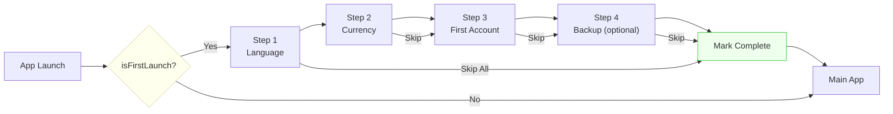

# Blueprint: Onboarding Flow

<!-- METADATA — structured for agents, useful for humans
tags:        [onboarding, wizard, flutter, ux, progressive-disclosure]
category:    patterns
difficulty:  intermediate
time:        2 hours
stack:       [flutter, dart]
-->

> Multi-step wizard for first-launch setup with progressive data collection, skip logic, and safe resume on app kill.

## TL;DR

A first-launch onboarding flow that collects only what the app absolutely needs (language, currency, first account) across 3-4 PageView steps, persists after each step so progress survives app kill, and can be skipped entirely with sensible defaults. Every choice made during onboarding is changeable later in Settings.

## When to Use

- App requires initial configuration before meaningful use (locale, currency, default account)
- You want to reduce time-to-value by pre-filling defaults instead of dumping the user into a blank screen
- User data collection must be progressive — gather essentials now, the rest later
- When **not** to use: if your app works fine with zero config, skip onboarding entirely

## Prerequisites

- [ ] State management wired (Riverpod, Bloc, etc.) — see [Riverpod Provider Wiring](riverpod-provider-wiring.md)
- [ ] Persistent storage available (SharedPreferences or secure storage)
- [ ] Router/navigation setup that supports redirect guards (go_router recommended)
- [ ] Default values defined for every onboarding field (so skip-all works)

## Overview



## Steps

### 1. Define onboarding steps and data requirements

**Why**: If you don't decide upfront what is essential vs nice-to-have, onboarding balloons to 8 steps and users abandon at step 3. The Budget app learned this the hard way — the rule is: collect only what the app cannot function without, default everything else.

Classify every piece of initial data:

| Data | Required? | Default if skipped | Why |
|------|-----------|-------------------|-----|
| Language | Yes | Device locale | UI language for the entire app |
| Currency | Yes | Derived from locale | Formatting all monetary values |
| First account | Yes | "Cash" account, 0 balance | App needs at least one account to record transactions |
| Backup (Google Drive) | No | Off | Nice-to-have, user can enable later |

```dart
// lib/onboarding/onboarding_step.dart
enum OnboardingStep {
  language,
  currency,
  firstAccount,
  backup;

  /// Whether this step can be skipped with a sensible default.
  bool get isSkippable => true; // all steps skippable in Budget

  /// Whether this step is required for app to function
  /// (skippable still — we apply defaults).
  bool get isEssential => this != OnboardingStep.backup;
}
```

**Expected outcome**: A clear, small list of steps (3-4 max) with a default value for every field, so "skip all" always works.

### 2. First-launch gate

**Why**: The onboarding must show exactly once per install. A flag in SharedPreferences controls this. But you also need to handle the reinstall case — if user data already exists (from a backup restore or migration), skip onboarding even if the flag is missing.

```dart
// lib/router/router.dart
GoRouter buildRouter(Ref ref) {
  return GoRouter(
    redirect: (context, state) {
      final prefs = ref.read(sharedPreferencesProvider);
      final onboardingComplete = prefs.getBool('onboarding_complete') ?? false;

      if (!onboardingComplete) {
        // Guard: if user data already exists (reinstall / restore), skip
        final hasExistingData = ref.read(hasUserDataProvider);
        if (hasExistingData) {
          prefs.setBool('onboarding_complete', true);
          return null; // proceed to main app
        }

        // Only redirect if not already on onboarding
        if (!state.matchedLocation.startsWith('/onboarding')) {
          return '/onboarding';
        }
      }
      return null;
    },
    routes: [
      GoRoute(path: '/onboarding', builder: (_, __) => const OnboardingFlow()),
      // ... main app routes
    ],
  );
}
```

**Expected outcome**: First launch redirects to `/onboarding`. Subsequent launches go straight to the main app. Reinstalls with existing data skip onboarding.

### 3. PageView/Stepper implementation

**Why**: A `PageView` gives you swipe support, smooth transitions, and a `PageController` to drive navigation programmatically. A linear progress indicator at the top shows the user where they are and how much is left — critical for completion rates.

```dart
// lib/onboarding/onboarding_flow.dart
class OnboardingFlow extends ConsumerStatefulWidget {
  const OnboardingFlow({super.key});

  @override
  ConsumerState<OnboardingFlow> createState() => _OnboardingFlowState();
}

class _OnboardingFlowState extends ConsumerState<OnboardingFlow> {
  late final PageController _controller;
  int _currentStep = 0;

  final _steps = OnboardingStep.values;

  @override
  void initState() {
    super.initState();
    // Resume from last completed step if app was killed mid-flow
    final lastCompleted = ref.read(sharedPreferencesProvider)
        .getInt('onboarding_last_step') ?? 0;
    _currentStep = lastCompleted;
    _controller = PageController(initialPage: _currentStep);
  }

  void _next() {
    if (_currentStep < _steps.length - 1) {
      setState(() => _currentStep++);
      _controller.animateToPage(
        _currentStep,
        duration: const Duration(milliseconds: 300),
        curve: Curves.easeInOut,
      );
    } else {
      _completeOnboarding();
    }
  }

  void _back() {
    if (_currentStep > 0) {
      setState(() => _currentStep--);
      _controller.animateToPage(_currentStep,
          duration: const Duration(milliseconds: 300),
          curve: Curves.easeInOut);
    }
  }

  @override
  Widget build(BuildContext context) {
    return Scaffold(
      body: SafeArea(
        child: Column(
          children: [
            // Progress indicator
            LinearProgressIndicator(
              value: (_currentStep + 1) / _steps.length,
            ),
            // Step pages
            Expanded(
              child: PageView(
                controller: _controller,
                physics: const NeverScrollableScrollPhysics(), // no free swipe
                children: [
                  LanguageStep(onNext: _next),
                  CurrencyStep(onNext: _next, onBack: _back),
                  FirstAccountStep(onNext: _next, onBack: _back),
                  BackupStep(onNext: _next, onBack: _back),
                ],
              ),
            ),
          ],
        ),
      ),
    );
  }
}
```

**Expected outcome**: A horizontally paging wizard with a progress bar. User navigates forward/back with buttons (not free-swiping, which causes accidental skips). Each step is a self-contained widget receiving `onNext`/`onBack` callbacks.

### 4. Skip logic

**Why**: Never block the user. If someone just wants to try the app, forcing them through 4 setup screens guarantees they uninstall. Every step must have a "Skip" option, and there must be a "Skip All" on the first step that applies sensible defaults for everything.

```dart
// In LanguageStep widget — first step has "Skip All"
Row(
  mainAxisAlignment: MainAxisAlignment.spaceBetween,
  children: [
    TextButton(
      onPressed: () => _skipAll(context),
      child: const Text('Skip setup'),
    ),
    FilledButton(
      onPressed: _validateAndNext,
      child: const Text('Next'),
    ),
  ],
)

// Skip-all applies every default and jumps to completion
Future<void> _skipAll(BuildContext context) async {
  final prefs = ref.read(sharedPreferencesProvider);
  final locale = PlatformDispatcher.instance.locale;

  // Apply all defaults
  await prefs.setString('locale', locale.languageCode);
  await prefs.setString('currency', _currencyFromLocale(locale));
  await ref.read(accountDaoProvider).createDefault();

  // Mark complete and navigate
  await prefs.setBool('onboarding_complete', true);
  if (context.mounted) context.go('/');
}
```

```dart
// Per-step skip — each non-first step has individual "Skip"
TextButton(
  onPressed: () {
    _applyDefault(); // write the default for THIS step
    widget.onNext();  // move to next step
  },
  child: const Text('Skip'),
),
```

**Expected outcome**: User can skip any individual step (default applied) or skip all from step 1. The app always ends up in a valid state regardless of which steps were completed or skipped.

### 5. Persist collected data after each step

**Why**: If you batch all writes to the end of onboarding, an app kill at step 3 of 4 loses everything. Persist each choice the moment the user commits it. This also enables resume-from-last-step.

```dart
// lib/onboarding/steps/currency_step.dart
Future<void> _validateAndNext() async {
  if (!_formKey.currentState!.validate()) return;

  // Persist immediately — don't wait for onboarding to finish
  final prefs = ref.read(sharedPreferencesProvider);
  await prefs.setString('currency', _selectedCurrency);

  // Track progress for resume
  await prefs.setInt('onboarding_last_step', OnboardingStep.currency.index + 1);

  widget.onNext();
}
```

**Expected outcome**: After completing step 2, killing the app, and relaunching, the user resumes at step 3 with their language and currency choices preserved.

### 6. Post-onboarding transition

**Why**: The transition from onboarding to main app must be clean — set the flag, clean up resume state, and navigate with replacement (so back button doesn't return to onboarding).

```dart
Future<void> _completeOnboarding() async {
  final prefs = ref.read(sharedPreferencesProvider);

  // Mark complete — this is the gate flag from Step 2
  await prefs.setBool('onboarding_complete', true);

  // Clean up resume tracking — no longer needed
  await prefs.remove('onboarding_last_step');

  // Replace the entire navigation stack — no back to onboarding
  if (mounted) context.go('/');
}
```

**Expected outcome**: After the last step, the user lands on the main app screen. Pressing back exits the app (does not return to onboarding). Relaunching the app goes straight to main.

### 7. Re-onboarding and Settings

**Why**: If a user can only set their currency during onboarding, they're stuck when they travel abroad. Every single onboarding choice must be changeable in Settings. This also means onboarding widgets should be reusable.

```dart
// lib/ui/screens/settings_screen.dart
// Reuse the same selection widgets from onboarding
ListTile(
  title: const Text('Currency'),
  subtitle: Text(currentCurrency),
  onTap: () => showDialog(
    context: context,
    // Same CurrencyPicker widget used in onboarding step 2
    builder: (_) => CurrencyPicker(
      selected: currentCurrency,
      onSelected: (currency) async {
        await ref.read(sharedPreferencesProvider)
            .setString('currency', currency);
        ref.invalidate(currencyProvider);
      },
    ),
  ),
),
```

```dart
// Optional: "Reset onboarding" for development / support
ListTile(
  title: const Text('Re-run setup wizard'),
  onTap: () async {
    final prefs = ref.read(sharedPreferencesProvider);
    await prefs.setBool('onboarding_complete', false);
    await prefs.remove('onboarding_last_step');
    if (context.mounted) context.go('/onboarding');
  },
),
```

**Expected outcome**: Every onboarding choice appears as a setting. Changing it in Settings has the same effect as choosing it during onboarding. Optionally, a "re-run wizard" option exists for support/debugging.

## Variants

<details>
<summary><strong>Variant: Bottom-sheet onboarding (single-screen apps)</strong></summary>

If your app has a single main screen (e.g., a calculator or timer), a full-screen wizard feels heavy. Instead, show a bottom sheet on first launch that collects 1-2 essentials:

```dart
WidgetsBinding.instance.addPostFrameCallback((_) {
  if (!onboardingComplete) {
    showModalBottomSheet(
      context: context,
      isDismissible: false,
      builder: (_) => const QuickSetupSheet(),
    );
  }
});
```

Same persistence and skip logic applies, just in a lighter container.

</details>

<details>
<summary><strong>Variant: Auth-gated onboarding</strong></summary>

If your app requires sign-in before onboarding (e.g., to fetch server-side defaults), the redirect chain becomes: `launch -> auth check -> onboarding check -> main app`. Use two separate flags (`is_authenticated`, `onboarding_complete`) and handle both in the router redirect.

</details>

## Gotchas

> **Onboarding blocks app on reinstall**: If you only check `isFirstLaunch` flag and it defaults to `true` when missing, reinstalling the app forces onboarding again even though the user's data was restored from backup. **Fix**: Before showing onboarding, check if user data already exists (accounts, transactions). If it does, mark onboarding complete and skip.

> **Too many steps kills completion rate**: Collecting profile photo, notification preferences, and social links during onboarding feels thorough but users abandon at step 3. **Fix**: Hard limit of 3-4 steps. Collect everything else progressively — prompt for notification permission before the first notification, ask for profile photo when they visit their profile.

> **Missing skip button traps users**: If step 3 is "Connect Google Drive" and there's no skip option, users who don't use Google Drive are stuck. **Fix**: Every step must have a skip/later option. No exceptions, even for steps you consider important. The app must function without any optional integration.

> **App kill loses onboarding state**: User completes 3 steps, gets a phone call, OS kills the app. On relaunch they start from step 1 again. **Fix**: Persist after each step (see Step 5) and store `onboarding_last_step` index. Resume from the next incomplete step on relaunch.

> **Onboarding choices not in Settings**: User picked EUR during setup but moved to Japan. There's no way to change currency without clearing app data. **Fix**: Treat onboarding as a shortcut for initial Settings configuration. Every field must exist in Settings (see Step 7).

## Checklist

- [ ] Onboarding steps limited to 3-4 maximum
- [ ] Every field has a sensible default value (skip-all works)
- [ ] First-launch gate checks for existing user data (reinstall case)
- [ ] "Skip setup" button on the first step applies all defaults
- [ ] Each step persists its data immediately, not batched at the end
- [ ] `onboarding_last_step` tracked so flow resumes after app kill
- [ ] Post-onboarding navigation replaces the stack (no back to wizard)
- [ ] `onboarding_complete` flag set only after final step or skip-all
- [ ] Every onboarding choice is editable in Settings
- [ ] Selection widgets are reusable between onboarding and Settings
- [ ] PageView uses `NeverScrollableScrollPhysics` (no accidental swipes)
- [ ] Back button on step 1 is hidden or exits the app

## Artifacts

| Artifact | Location | Description |
|----------|----------|-------------|
| Step enum | `lib/onboarding/onboarding_step.dart` | Defines steps, skip rules, defaults |
| Flow widget | `lib/onboarding/onboarding_flow.dart` | PageView controller, progress bar, navigation |
| Step widgets | `lib/onboarding/steps/*.dart` | Individual step UI with persist-on-commit |
| Router guard | `lib/router/router.dart` | Redirect to onboarding on first launch |
| Settings entries | `lib/ui/screens/settings_screen.dart` | Post-onboarding access to every choice |

## References

- [go_router — Redirection](https://pub.dev/documentation/go_router/latest/topics/Redirection-topic.html) — redirect guards for first-launch gating
- [PageView class](https://api.flutter.dev/flutter/widgets/PageView-class.html) — Flutter docs for the step container
- [Riverpod Provider Wiring](riverpod-provider-wiring.md) — companion blueprint for wiring providers and SharedPreferences
- [Material Design — Onboarding](https://m3.material.io/foundations/content-design/onboarding) — UX guidelines for progressive disclosure
