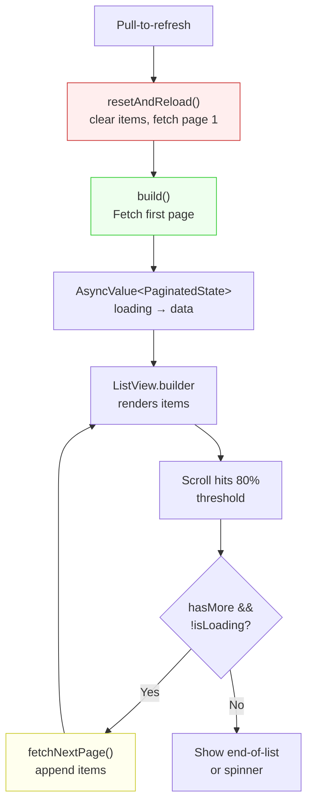

# Blueprint: Pagination & Infinite Scroll

<!-- METADATA — structured for agents, useful for humans
tags:        [pagination, infinite-scroll, cursor, offset, keyset, flutter, dart, riverpod]
category:    patterns
difficulty:  intermediate
time:        2 hours
stack:       [flutter, dart]
-->

> Implement cursor-based, offset-based, or keyset pagination with infinite scroll UI, pull-to-refresh, and local DB paging.

## TL;DR

Build a paginated data source behind a clean `fetchPage()` interface, manage page state with an `AsyncNotifier` holding items + cursor + hasMore + isLoading, and wire it to a `ScrollController` that triggers the next fetch at 80% scroll depth. The result is a smooth infinite scroll list with pull-to-refresh, error retry, and optional local (Drift) pagination.

## When to Use

- Any list screen that can return more items than fit in memory (transactions, messages, feed)
- API or local DB returns data in pages (REST with `?page=` or `?cursor=`, Drift with `LIMIT/OFFSET`)
- When you need seamless "load more" UX without manual page buttons
- **Not** for small bounded lists (< 100 items) — just load them all in `build()`

## Prerequisites

- [ ] `flutter_riverpod` and `riverpod_annotation` in `pubspec.yaml`
- [ ] A data source (API client or Drift DAO) that supports paginated queries
- [ ] Understanding of [AsyncNotifier Lifecycle](async-notifier-lifecycle.md)
- [ ] `riverpod_generator` and `build_runner` for code generation

## Overview



## Steps

### 1. Choose a pagination strategy

**Why**: The wrong strategy causes skipped or duplicated items. Pick based on your data source and access patterns.

| Strategy | How it works | Best for | Watch out |
|----------|-------------|----------|-----------|
| **Offset** | `LIMIT 20 OFFSET 40` | Static datasets, simple APIs | Inserts/deletes shift offsets — items get skipped or duplicated |
| **Cursor** | `WHERE id > :lastId LIMIT 20` | Append-only feeds, real-time data | Requires a stable, unique, sortable column |
| **Keyset** | `WHERE (date, id) > (:lastDate, :lastId) LIMIT 20` | Multi-column sort orders | More complex WHERE clause, but stable under inserts |

> **Decision**: If your data is append-only or frequently mutated, use **cursor-based**. If your data is static or you control the sort order fully, **offset** is simpler. If you sort by a non-unique column (e.g. date), use **keyset** with a tiebreaker (e.g. date + id).

### 2. Define the paginated data source interface

**Why**: A clean `fetchPage` contract decouples pagination logic from UI and makes testing trivial — swap in a fake that returns canned `PageResult` values.

```dart
// lib/core/pagination/page_result.dart

class PageResult<T> {
  const PageResult({
    required this.items,
    required this.nextCursor,
    required this.hasMore,
  });

  final List<T> items;
  final String? nextCursor; // null on first request, opaque token after
  final bool hasMore;
}
```

```dart
// lib/core/pagination/paginated_source.dart

abstract class PaginatedSource<T> {
  Future<PageResult<T>> fetchPage({
    String? cursor,
    int pageSize = 20,
  });
}
```

For offset-based, the cursor is just the offset as a string (or use an int parameter). For keyset, encode the compound key into the cursor string.

**Expected outcome**: A single interface that every paginated list screen programs against, regardless of backend strategy.

### 3. Build the pagination state and AsyncNotifier

**Why**: The notifier owns the accumulated items, the current cursor, and loading/error flags. It is the single source of truth — the UI never manages page state itself.

```dart
// lib/features/transactions/transactions_state.dart

class PaginatedState<T> {
  const PaginatedState({
    required this.items,
    required this.nextCursor,
    required this.hasMore,
    this.isLoadingMore = false,
    this.pageError,
  });

  final List<T> items;
  final String? nextCursor;
  final bool hasMore;
  final bool isLoadingMore;   // true while fetching next page
  final Object? pageError;    // non-null if last fetchNextPage failed

  PaginatedState<T> copyWith({
    List<T>? items,
    String? nextCursor,
    bool? hasMore,
    bool? isLoadingMore,
    Object? pageError,
    bool clearError = false,
  }) {
    return PaginatedState(
      items: items ?? this.items,
      nextCursor: nextCursor ?? this.nextCursor,
      hasMore: hasMore ?? this.hasMore,
      isLoadingMore: isLoadingMore ?? this.isLoadingMore,
      pageError: clearError ? null : (pageError ?? this.pageError),
    );
  }
}
```

```dart
// lib/features/transactions/transactions_notifier.dart

import 'package:riverpod_annotation/riverpod_annotation.dart';

part 'transactions_notifier.g.dart';

@riverpod
class TransactionsNotifier extends _$TransactionsNotifier {
  @override
  Future<PaginatedState<Transaction>> build() async {
    final source = ref.watch(transactionSourceProvider);
    final page = await source.fetchPage(pageSize: 20);

    return PaginatedState(
      items: page.items,
      nextCursor: page.nextCursor,
      hasMore: page.hasMore,
    );
  }

  Future<void> fetchNextPage() async {
    final current = state.valueOrNull;
    if (current == null || !current.hasMore || current.isLoadingMore) return;

    state = AsyncData(current.copyWith(isLoadingMore: true, clearError: true));

    try {
      final source = ref.read(transactionSourceProvider);
      final page = await source.fetchPage(
        cursor: current.nextCursor,
        pageSize: 20,
      );

      state = AsyncData(current.copyWith(
        items: [...current.items, ...page.items],
        nextCursor: page.nextCursor,
        hasMore: page.hasMore,
        isLoadingMore: false,
      ));
    } catch (e) {
      state = AsyncData(current.copyWith(
        isLoadingMore: false,
        pageError: e,
      ));
    }
  }

  Future<void> resetAndReload() async {
    ref.invalidateSelf();
  }
}
```

**Key points**:
- `build()` loads the first page — the screen starts in `loading` then transitions to `data`
- `fetchNextPage()` guards with `!hasMore || isLoadingMore` to prevent duplicate fetches
- Errors on subsequent pages do NOT replace the already-loaded items — they set `pageError` so the UI can show a retry button at the bottom
- `resetAndReload()` invalidates the provider, which re-runs `build()` from scratch

**Expected outcome**: First page loads on screen entry. Subsequent pages append items without flickering or losing scroll position.

### 4. Wire the infinite scroll trigger

**Why**: The `ScrollController` listener fires at 80% scroll depth to start prefetching the next page before the user reaches the bottom, creating a seamless experience.

```dart
// lib/features/transactions/transactions_screen.dart

class TransactionsListWrapper extends ConsumerStatefulWidget {
  const TransactionsListWrapper({super.key});

  @override
  ConsumerState<TransactionsListWrapper> createState() =>
      _TransactionsListWrapperState();
}

class _TransactionsListWrapperState
    extends ConsumerState<TransactionsListWrapper> {
  final _scrollController = ScrollController();

  @override
  void initState() {
    super.initState();
    _scrollController.addListener(_onScroll);
  }

  @override
  void dispose() {
    _scrollController.removeListener(_onScroll);
    _scrollController.dispose();
    super.dispose();
  }

  void _onScroll() {
    if (!_scrollController.hasClients) return;

    final maxScroll = _scrollController.position.maxScrollExtent;
    final currentScroll = _scrollController.position.pixels;
    final threshold = maxScroll * 0.8;

    if (currentScroll >= threshold) {
      ref.read(transactionsNotifierProvider.notifier).fetchNextPage();
    }
  }

  @override
  Widget build(BuildContext context) {
    final asyncState = ref.watch(transactionsNotifierProvider);

    return asyncState.when(
      loading: () => const _ShimmerList(),
      error: (e, _) => _FullScreenError(
        error: e,
        onRetry: () => ref.invalidate(transactionsNotifierProvider),
      ),
      data: (state) => RefreshIndicator(
        onRefresh: () => ref
            .read(transactionsNotifierProvider.notifier)
            .resetAndReload(),
        child: ListView.builder(
          controller: _scrollController,
          itemCount: state.items.length + (state.hasMore ? 1 : 0),
          itemBuilder: (context, index) {
            if (index == state.items.length) {
              return _BottomLoader(
                isLoading: state.isLoadingMore,
                error: state.pageError,
                onRetry: () => ref
                    .read(transactionsNotifierProvider.notifier)
                    .fetchNextPage(),
              );
            }
            return TransactionTile(transaction: state.items[index]);
          },
        ),
      ),
    );
  }
}
```

**Expected outcome**: Scrolling past 80% triggers the next page fetch. The guard in `fetchNextPage()` prevents duplicate calls even though the listener fires on every pixel.

### 5. Build loading and error UI for page boundaries

**Why**: First-page loading needs a full shimmer. Subsequent-page loading needs a bottom spinner. Errors on page N need a retry button — not a full-screen error that hides already-loaded items.

```dart
// Bottom loader widget — placed as the last item in ListView

class _BottomLoader extends StatelessWidget {
  const _BottomLoader({
    required this.isLoading,
    required this.error,
    required this.onRetry,
  });

  final bool isLoading;
  final Object? error;
  final VoidCallback onRetry;

  @override
  Widget build(BuildContext context) {
    if (error != null) {
      return Padding(
        padding: const EdgeInsets.all(16),
        child: Column(
          children: [
            Text('Failed to load more: $error'),
            const SizedBox(height: 8),
            OutlinedButton(
              onPressed: onRetry,
              child: const Text('Retry'),
            ),
          ],
        ),
      );
    }

    if (isLoading) {
      return const Padding(
        padding: EdgeInsets.all(16),
        child: Center(child: CircularProgressIndicator()),
      );
    }

    return const SizedBox.shrink();
  }
}
```

**Expected outcome**: Users see a spinner at the bottom while loading, a retry button on failure, and nothing when all pages are loaded.

### 6. Add pull-to-refresh

**Why**: Pull-to-refresh gives users an explicit way to reload from scratch — essential when the underlying data changes (new transactions, updated feed).

The `RefreshIndicator` is already wired in step 4. The key is `resetAndReload()`:

```dart
Future<void> resetAndReload() async {
  // invalidateSelf() re-runs build(), which fetches page 1
  // The UI transitions: data → loading → data with fresh items
  ref.invalidateSelf();
}
```

If you want to avoid the loading flash on refresh (keep old items visible while refreshing):

```dart
Future<void> resetAndReload() async {
  final source = ref.read(transactionSourceProvider);
  final page = await source.fetchPage(pageSize: 20);

  state = AsyncData(PaginatedState(
    items: page.items,
    nextCursor: page.nextCursor,
    hasMore: page.hasMore,
  ));
}
```

**Expected outcome**: Pull down on the list reloads from page 1. Scroll position resets to the top with fresh data.

### 7. Add local pagination with Drift

**Why**: For offline-first apps, the paginated source is a Drift DAO. The same `PaginatedSource` interface works — the implementation just uses SQL `LIMIT/OFFSET` or keyset queries.

```dart
// lib/data/dao/transaction_dao.dart

class TransactionDao {
  TransactionDao(this._db);
  final AppDatabase _db;

  Future<PageResult<Transaction>> getPage({
    int limit = 20,
    int offset = 0,
  }) async {
    final rows = await (_db.select(_db.transactions)
          ..orderBy([(t) => OrderingTerm.desc(t.date)])
          ..limit(limit + 1, offset: offset))
        .get();

    final hasMore = rows.length > limit;
    final items = hasMore ? rows.sublist(0, limit) : rows;

    return PageResult(
      items: items.map((r) => r.toDomain()).toList(),
      nextCursor: hasMore ? '${offset + limit}' : null,
      hasMore: hasMore,
    );
  }
}
```

**Trick**: Fetch `limit + 1` rows. If you get the extra row, there's more data — trim it off before returning. This avoids a separate COUNT query.

**Expected outcome**: Local pagination works identically to remote — same notifier, same scroll behavior, same UI.

## Gotchas

> **Offset skips items on insert**: If a new item is inserted while the user is on page 3, offset-based pagination skips or duplicates an item at the page boundary. **Fix**: Use cursor-based pagination for mutable datasets. If stuck with offset, accept the trade-off and document it.

> **ScrollController fires multiple times**: The scroll listener fires on every pixel change. Without a guard, `fetchNextPage()` gets called dozens of times as the user scrolls through the 80% zone. **Fix**: The `isLoadingMore` guard in `fetchNextPage()` is mandatory — always check `!current.isLoadingMore` before starting a fetch.

> **Disposing controller during async fetch**: If the user navigates away while `fetchNextPage()` is in-flight, the `ScrollController` is disposed and `setState` throws. **Fix**: Use `ref.onDispose()` to cancel pending work, or check `mounted` before calling `setState`. With Riverpod, the notifier handles state — the widget only reads, so this is less of an issue than with raw `StatefulWidget`.

> **Unbounded page cache blows memory**: Accumulating thousands of items in a single `List<T>` causes jank and OOM on low-end devices. **Fix**: Use a windowed list approach — keep only N pages in memory and rebuild others from the data source. `ListView.builder` already virtualizes widgets, but the data list itself needs capping for very large datasets.

> **Pull-to-refresh triggers during load-more**: The user can pull to refresh while a page is loading, causing a race. **Fix**: Cancel or ignore the in-flight `fetchNextPage()` when `resetAndReload()` is called. `invalidateSelf()` handles this naturally — the rebuild discards stale state.

## Checklist

- [ ] Pagination strategy chosen (offset / cursor / keyset) and documented
- [ ] `PageResult` model has `items`, `nextCursor`, `hasMore`
- [ ] `PaginatedSource` interface implemented for your data source
- [ ] AsyncNotifier `build()` fetches the first page
- [ ] `fetchNextPage()` guards with `!hasMore || isLoadingMore`
- [ ] `fetchNextPage()` errors set `pageError` instead of replacing loaded items
- [ ] ScrollController listener triggers at 80% threshold
- [ ] ScrollController is properly disposed in `dispose()`
- [ ] Bottom of list shows spinner (loading), retry (error), or nothing (done)
- [ ] First-page loading shows shimmer or skeleton, not a blank screen
- [ ] Pull-to-refresh resets state and reloads from page 1
- [ ] Local Drift queries use `LIMIT/OFFSET` with `limit + 1` trick
- [ ] Tested with empty results (0 items), single page, and multi-page

## Artifacts

| Artifact | Location | Description |
|----------|----------|-------------|
| Page result model | `lib/core/pagination/page_result.dart` | Generic `PageResult<T>` with items + cursor + hasMore |
| Source interface | `lib/core/pagination/paginated_source.dart` | Abstract `PaginatedSource<T>` contract |
| Paginated state | `lib/features/<name>/<name>_state.dart` | `PaginatedState<T>` with items, cursor, loading, error |
| Notifier | `lib/features/<name>/<name>_notifier.dart` | AsyncNotifier with `build()`, `fetchNextPage()`, `resetAndReload()` |
| Generated | `lib/features/<name>/<name>_notifier.g.dart` | Riverpod codegen output |
| List screen | `lib/features/<name>/<name>_screen.dart` | ConsumerStatefulWidget with ScrollController + RefreshIndicator |
| Drift DAO | `lib/data/dao/<name>_dao.dart` | Local paginated query with LIMIT/OFFSET |

## References

- [AsyncNotifier Lifecycle](async-notifier-lifecycle.md) — prerequisite: build → mutate → invalidateSelf pattern
- [Riverpod Provider Wiring](riverpod-provider-wiring.md) — bootstrap + ConsumerWidget wrapper
- [Flutter ListView.builder docs](https://api.flutter.dev/flutter/widgets/ListView/ListView.builder.html) — virtualized list construction
- [Drift documentation — Selects](https://drift.simonbinder.eu/docs/getting-started/expressions/#limit) — LIMIT/OFFSET in Drift queries
- [Sliver-based infinite scroll (flutter.dev)](https://docs.flutter.dev/cookbook/lists/long-lists) — official cookbook for long lists
