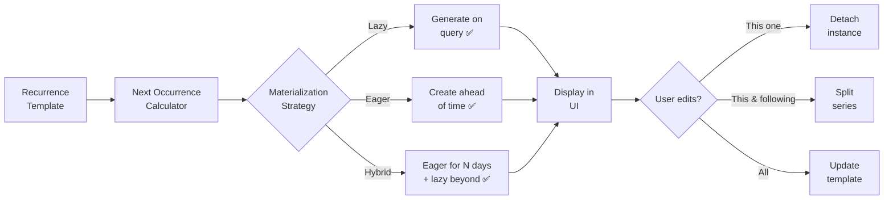

# Blueprint: Recurring Events & Scheduling

<!-- METADATA — structured for agents, useful for humans
tags:        [recurrence, scheduling, materialization, transactions, calendar, architecture]
category:    patterns
difficulty:  intermediate
time:        2 hours
stack:       [flutter, dart]
-->

> Model recurrence rules, calculate next occurrences, and materialize them into concrete events — handling every edge case from Feb 29 to "modify all future."

## TL;DR

A recurring event system stores **template records** with recurrence metadata (frequency, interval, end condition) separately from **materialized instances**. A calculation engine produces the next N occurrences on demand, and a materialization strategy decides when concrete records are created. Modification patterns ("this one," "this and following," "all") let users edit without breaking the series.

## When to Use

- Building recurring transactions in a budget/finance app
- Calendar events with repeat rules (daily standup, monthly rent)
- Subscription tracking, bill reminders, or scheduled tasks
- When **not** to use: one-off reminders or events with no repeat — a simple scheduled notification is enough

## Prerequisites

- [ ] A data layer with persistent storage (SQLite/Drift, Hive, or similar)
- [ ] Understanding of date/time handling in Dart (`DateTime`, `Duration`)
- [ ] A list or calendar view that displays events by date range

## Overview



## Steps

### 1. Define the recurrence model

**Why**: A well-structured recurrence model is the foundation. It must capture frequency, interval, end conditions, and day selection — without these, you'll bolt on fields later and create inconsistent states.

```dart
// lib/core/models/recurrence_rule.dart

enum Frequency { daily, weekly, monthly, yearly }

enum EndType { never, onDate, afterCount }

class RecurrenceRule {
  const RecurrenceRule({
    required this.frequency,
    this.interval = 1,
    this.endType = EndType.never,
    this.endDate,
    this.endCount,
    this.daysOfWeek = const {},   // for weekly: {DateTime.monday, DateTime.friday}
    this.dayOfMonth,               // for monthly: 1-31 (clipped if needed)
    this.monthOfYear,              // for yearly: 1-12
  });

  final Frequency frequency;
  final int interval;             // every N days/weeks/months/years
  final EndType endType;
  final DateTime? endDate;
  final int? endCount;
  final Set<int> daysOfWeek;
  final int? dayOfMonth;
  final int? monthOfYear;
}
```

**Expected outcome**: A single immutable value object that fully describes any recurrence pattern — "every 2 weeks on Mon/Wed," "monthly on the 15th, ending after 12 occurrences," etc.

### 2. Store recurrence rules as template records

**Why**: The template is the source of truth for the series. Materialized instances are derived data. Separating them means you can regenerate instances, change the rule, or delete the series without orphaned rows.

```dart
// lib/core/models/recurring_transaction.dart

class RecurringTransaction {
  const RecurringTransaction({
    required this.id,
    required this.title,
    required this.amount,
    required this.categoryId,
    required this.startDate,
    required this.rule,
    this.lastMaterializedDate,
  });

  final String id;
  final String title;
  final double amount;
  final String categoryId;
  final DateTime startDate;
  final RecurrenceRule rule;
  final DateTime? lastMaterializedDate; // tracks materialization progress
}
```

```dart
// lib/core/models/transaction_instance.dart

class TransactionInstance {
  const TransactionInstance({
    required this.id,
    required this.recurringId,   // FK to template (null if standalone)
    required this.date,
    required this.title,
    required this.amount,
    this.isDetached = false,     // true if user edited this single occurrence
  });

  final String id;
  final String? recurringId;
  final DateTime date;
  final String title;
  final double amount;
  final bool isDetached;
}
```

**Expected outcome**: Two tables/collections — `recurring_transactions` (templates with rules) and `transaction_instances` (concrete records with an optional FK back to the template).

### 3. Implement next occurrence calculation

**Why**: This is the core algorithm. Each frequency type has its own edge cases — monthly recurrence must handle months with fewer days, yearly must handle leap years. Getting this wrong produces skipped or duplicated events.

```dart
// lib/core/services/recurrence_calculator.dart

class RecurrenceCalculator {
  /// Returns the next [count] occurrences starting from [after].
  List<DateTime> nextOccurrences({
    required RecurrenceRule rule,
    required DateTime start,
    required DateTime after,
    int count = 10,
  }) {
    final results = <DateTime>[];
    var candidate = start;

    while (results.length < count) {
      if (candidate.isAfter(after)) {
        // Check end conditions
        if (rule.endType == EndType.onDate &&
            candidate.isAfter(rule.endDate!)) break;
        if (rule.endType == EndType.afterCount &&
            results.length >= rule.endCount!) break;

        results.add(candidate);
      }
      candidate = _advance(candidate, rule);
    }
    return results;
  }

  DateTime _advance(DateTime current, RecurrenceRule rule) {
    switch (rule.frequency) {
      case Frequency.daily:
        return current.add(Duration(days: rule.interval));

      case Frequency.weekly:
        return current.add(Duration(days: 7 * rule.interval));

      case Frequency.monthly:
        return _addMonths(current, rule.interval, rule.dayOfMonth);

      case Frequency.yearly:
        return _addYears(current, rule.interval);
    }
  }

  /// Adds [months] to [date], clipping the day to the last valid day.
  /// Example: Jan 31 + 1 month → Feb 28 (or 29 in leap year).
  DateTime _addMonths(DateTime date, int months, int? preferredDay) {
    final targetMonth = date.month + months;
    final year = date.year + (targetMonth - 1) ~/ 12;
    final month = (targetMonth - 1) % 12 + 1;
    final day = preferredDay ?? date.day;
    final maxDay = DateTime(year, month + 1, 0).day; // last day of month
    return DateTime(year, month, day.clamp(1, maxDay));
  }

  DateTime _addYears(DateTime date, int years) {
    final maxDay = DateTime(date.year + years, date.month + 1, 0).day;
    return DateTime(
      date.year + years,
      date.month,
      date.day.clamp(1, maxDay), // handles Feb 29 → Feb 28 in non-leap
    );
  }
}
```

**Expected outcome**: `nextOccurrences(rule: monthlyOn31, start: jan31, after: jan1, count: 4)` returns `[Jan 31, Feb 28, Mar 31, Apr 30]` — no skips, no crashes.

### 4. Choose a materialization strategy

**Why**: Materialization decides when abstract recurrences become real records. The wrong strategy wastes storage (eager) or makes queries slow (lazy). Most apps benefit from a hybrid approach.

> **Decision**: If your UI always queries by date range (e.g., "show me this month"), [Lazy](#4a-lazy-materialization) is simplest. If you need to attach notes/receipts to individual future instances, go [Eager](#4b-eager-materialization). For most budget apps, use [Hybrid](#4c-hybrid-materialization).

#### 4a. Lazy materialization

Generate occurrences at query time — never persist future instances.

```dart
// lib/core/services/transaction_query_service.dart

Future<List<TransactionInstance>> getTransactionsForRange(
  DateTime from,
  DateTime to,
) async {
  // 1. Fetch real (already materialized) instances
  final persisted = await dao.getInstancesInRange(from, to);

  // 2. Fetch all active recurring templates
  final templates = await dao.getActiveRecurringTransactions();

  // 3. Generate virtual instances for the range
  final virtual = <TransactionInstance>[];
  for (final template in templates) {
    final occurrences = calculator.nextOccurrencesInRange(
      rule: template.rule,
      start: template.startDate,
      from: from,
      to: to,
    );
    for (final date in occurrences) {
      // Skip if already materialized (user edited it)
      if (persisted.any((p) => p.recurringId == template.id && p.date == date)) {
        continue;
      }
      virtual.add(TransactionInstance(
        id: '${template.id}_${date.toIso8601String()}',
        recurringId: template.id,
        date: date,
        title: template.title,
        amount: template.amount,
      ));
    }
  }

  return [...persisted, ...virtual]..sort((a, b) => a.date.compareTo(b.date));
}
```

**Expected outcome**: No future rows in the database. The UI shows recurrences by computing them on the fly. Storage stays minimal.

#### 4b. Eager materialization

Create concrete instances N days/months ahead on a schedule.

```dart
Future<void> materializeUpcoming({int daysAhead = 90}) async {
  final templates = await dao.getActiveRecurringTransactions();
  final horizon = DateTime.now().add(Duration(days: daysAhead));

  for (final template in templates) {
    final from = template.lastMaterializedDate ?? template.startDate;
    final occurrences = calculator.nextOccurrencesInRange(
      rule: template.rule,
      start: template.startDate,
      from: from,
      to: horizon,
    );
    for (final date in occurrences) {
      await dao.insertInstance(TransactionInstance(
        id: uuid.v4(),
        recurringId: template.id,
        date: date,
        title: template.title,
        amount: template.amount,
      ));
    }
    await dao.updateLastMaterialized(template.id, horizon);
  }
}
```

**Expected outcome**: Concrete rows exist for the next 90 days. Users can edit, attach receipts, or mark individual instances as paid. Call this on app startup or via a periodic background task.

#### 4c. Hybrid materialization (recommended)

Eagerly materialize the near future (e.g., 30 days) for editability, and lazily compute beyond that for display.

```dart
Future<List<TransactionInstance>> getTransactionsForRange(
  DateTime from,
  DateTime to,
) async {
  // Ensure near-future is materialized
  await materializeUpcoming(daysAhead: 30);

  // For the materialized window, use real records
  // For beyond, generate virtual instances
  final materializedHorizon = DateTime.now().add(Duration(days: 30));

  if (to.isBefore(materializedHorizon)) {
    return dao.getInstancesInRange(from, to);
  }

  // Merge materialized + virtual for the extended range
  final persisted = await dao.getInstancesInRange(from, to);
  final virtual = await _generateVirtualInstances(
    from: materializedHorizon,
    to: to,
    exclude: persisted,
  );
  return [...persisted, ...virtual]..sort((a, b) => a.date.compareTo(b.date));
}
```

**Expected outcome**: Near-future events are editable real records; far-future events are computed cheaply. Best balance of flexibility and performance.

### 5. Handle user modification patterns

**Why**: Users will want to edit a single occurrence ("skip this week's payment"), all future ones ("rent increased starting next month"), or the entire series. Without explicit patterns, edits corrupt the series.

```dart
// lib/core/services/recurrence_edit_service.dart

enum EditScope { thisOne, thisAndFollowing, all }

class RecurrenceEditService {
  Future<void> editOccurrence({
    required String recurringId,
    required DateTime occurrenceDate,
    required EditScope scope,
    required TransactionUpdate update, // new title, amount, etc.
  }) async {
    switch (scope) {
      case EditScope.thisOne:
        // Materialize and detach this single instance
        await dao.upsertInstance(TransactionInstance(
          id: uuid.v4(),
          recurringId: recurringId,
          date: occurrenceDate,
          title: update.title,
          amount: update.amount,
          isDetached: true, // won't be overwritten by template changes
        ));

      case EditScope.thisAndFollowing:
        // End the current series at occurrenceDate
        final template = await dao.getRecurring(recurringId);
        await dao.updateRecurring(template.copyWith(
          rule: template.rule.copyWith(
            endType: EndType.onDate,
            endDate: occurrenceDate.subtract(Duration(days: 1)),
          ),
        ));
        // Create a new series starting at occurrenceDate with updates
        await dao.insertRecurring(RecurringTransaction(
          id: uuid.v4(),
          title: update.title ?? template.title,
          amount: update.amount ?? template.amount,
          categoryId: template.categoryId,
          startDate: occurrenceDate,
          rule: template.rule.copyWith(
            endType: template.rule.endType,
            endDate: template.rule.endDate,
          ),
        ));
        // Delete any materialized instances after the split point
        await dao.deleteInstancesAfter(recurringId, occurrenceDate);

      case EditScope.all:
        // Update the template — all non-detached instances follow
        final template = await dao.getRecurring(recurringId);
        await dao.updateRecurring(template.copyWith(
          title: update.title,
          amount: update.amount,
        ));
        // Re-materialize non-detached instances
        await dao.deleteNonDetachedInstances(recurringId);
        await materializeUpcoming();
    }
  }
}
```

**Expected outcome**: Three-way edit dialog ("Just this one" / "This and future" / "All") works correctly. Detached instances survive template changes. Series splits create clean boundaries.

### 6. Display and grouping

**Why**: Recurring events are only useful if the UI surfaces them clearly — upcoming due dates, monthly totals, and visual distinction between recurring and one-off items.

```dart
// lib/core/services/recurring_summary_service.dart

class RecurringSummary {
  final double totalMonthlyIncome;
  final double totalMonthlyExpense;
  final double netMonthlyRecurring;
  final List<UpcomingRecurrence> upcoming;
}

class RecurringSummaryService {
  Future<RecurringSummary> getMonthlySummary() async {
    final templates = await dao.getActiveRecurringTransactions();
    var income = 0.0;
    var expense = 0.0;

    for (final t in templates) {
      final monthlyAmount = _normalizeToMonthly(t.amount, t.rule);
      if (monthlyAmount >= 0) {
        income += monthlyAmount;
      } else {
        expense += monthlyAmount.abs();
      }
    }

    final upcoming = await _getUpcomingDueDates(days: 7);

    return RecurringSummary(
      totalMonthlyIncome: income,
      totalMonthlyExpense: expense,
      netMonthlyRecurring: income - expense,
      upcoming: upcoming,
    );
  }

  double _normalizeToMonthly(double amount, RecurrenceRule rule) {
    return switch (rule.frequency) {
      Frequency.daily   => amount * 30 / rule.interval,
      Frequency.weekly  => amount * 4.33 / rule.interval,
      Frequency.monthly => amount / rule.interval,
      Frequency.yearly  => amount / (12 * rule.interval),
    };
  }
}
```

**Expected outcome**: A dashboard card showing "Recurring: -$2,340/mo income, +$5,100/mo expense" and a list of upcoming due dates for the next 7 days.

### 7. Notifications and reminders

**Why**: A recurring transaction is useless if the user forgets about it. Reminders for upcoming due dates and alerts for overdue items close the loop.

```dart
// lib/core/services/recurrence_reminder_service.dart

class RecurrenceReminderService {
  /// Call on app startup or via background task.
  Future<List<Reminder>> checkReminders({
    required DateTime today,
    int alertDaysBefore = 2,
  }) async {
    final templates = await dao.getActiveRecurringTransactions();
    final reminders = <Reminder>[];

    for (final template in templates) {
      final nextDates = calculator.nextOccurrences(
        rule: template.rule,
        start: template.startDate,
        after: today.subtract(Duration(days: 1)),
        count: 1,
      );
      if (nextDates.isEmpty) continue;

      final nextDate = nextDates.first;
      final daysUntil = nextDate.difference(today).inDays;

      if (daysUntil < 0) {
        reminders.add(Reminder(
          template: template,
          dueDate: nextDate,
          type: ReminderType.overdue,
        ));
      } else if (daysUntil <= alertDaysBefore) {
        reminders.add(Reminder(
          template: template,
          dueDate: nextDate,
          type: ReminderType.upcoming,
        ));
      }
    }

    return reminders..sort((a, b) => a.dueDate.compareTo(b.dueDate));
  }
}
```

**Expected outcome**: On app launch, the user sees "Rent due in 2 days" or "Electric bill overdue by 3 days." Integrate with `flutter_local_notifications` for system-level alerts.

## Variants

<details>
<summary><strong>Variant: iCalendar RRULE compatibility</strong></summary>

If you need to import/export recurrence rules from calendar apps, map your model to/from RFC 5545 RRULE strings:

```dart
String toRRule(RecurrenceRule rule) {
  final parts = <String>['RRULE:FREQ=${rule.frequency.name.toUpperCase()}'];
  if (rule.interval > 1) parts.add('INTERVAL=${rule.interval}');
  if (rule.endType == EndType.afterCount) parts.add('COUNT=${rule.endCount}');
  if (rule.endType == EndType.onDate) {
    parts.add('UNTIL=${_formatRRuleDate(rule.endDate!)}');
  }
  if (rule.daysOfWeek.isNotEmpty) {
    parts.add('BYDAY=${rule.daysOfWeek.map(_dayToRRule).join(",")}');
  }
  return parts.join(';');
}
```

This lets you round-trip with Google Calendar, Apple Calendar, or any CalDAV server.

</details>

<details>
<summary><strong>Variant: Weekday-only recurrence (skip weekends)</strong></summary>

For business-day recurrences (e.g., "every weekday"), add a `skipWeekends` flag:

```dart
DateTime _advanceDaily(DateTime current, int interval, {bool skipWeekends = false}) {
  var next = current.add(Duration(days: interval));
  if (skipWeekends) {
    while (next.weekday == DateTime.saturday || next.weekday == DateTime.sunday) {
      next = next.add(Duration(days: 1));
    }
  }
  return next;
}
```

</details>

<details>
<summary><strong>Variant: Nth weekday of month ("second Tuesday")</strong></summary>

For rules like "second Tuesday of every month," compute the target day dynamically:

```dart
DateTime nthWeekdayOfMonth(int year, int month, int weekday, int n) {
  var date = DateTime(year, month, 1);
  // Advance to first occurrence of the target weekday
  while (date.weekday != weekday) {
    date = date.add(Duration(days: 1));
  }
  // Advance to the nth occurrence
  date = date.add(Duration(days: 7 * (n - 1)));
  return date.month == month ? date : throw ArgumentError('No ${n}th weekday in $month/$year');
}
```

</details>

## Gotchas

> **Month-end clipping**: Monthly recurrence on Jan 31 advances to Feb — but Feb has no 31st. If you naively add 1 month you either crash or skip to March. **Fix**: Always clamp the day to the last day of the target month using `DateTime(year, month + 1, 0).day`. Jan 31 → Feb 28 (or 29) → Mar 31 → Apr 30.

> **Template edits after materialization**: If you update the template (e.g., change the amount) but don't regenerate materialized instances, persisted instances diverge from the template. Users see the old amount for already-created records. **Fix**: On template edit with `EditScope.all`, delete non-detached instances and re-materialize. Flag detached (user-edited) instances so they survive.

> **Timezone and DST shifts**: A "daily at 9am" recurrence stored in UTC shifts by an hour when DST changes. The user sees 8am or 10am instead. **Fix**: Store recurrence times in **local time** (wall clock), not UTC. Convert to UTC only at the notification/scheduling layer. Use `TZDateTime` from the `timezone` package if needed.

> **Unbounded recurrence by default**: If you default `endType` to `never`, users who forget to set an end condition generate infinite series. Lazy materialization handles this, but eager materialization will try to create rows forever. **Fix**: Always impose a materialization horizon (`daysAhead` parameter). For UI, consider requiring an explicit "repeats forever" confirmation rather than making it the default.

> **Duplicate materialization on concurrent runs**: If `materializeUpcoming()` runs twice (e.g., app foreground + background task), you get duplicate instances. **Fix**: Use `lastMaterializedDate` on the template as a cursor, and wrap materialization in a database transaction with a unique constraint on `(recurringId, date)`.

## Checklist

- [ ] Recurrence model covers all frequencies (daily, weekly, monthly, yearly)
- [ ] End conditions support never, by date, and by count
- [ ] Monthly/yearly calculation clips days to valid range (no Feb 31)
- [ ] Template and instance tables are separate with FK relationship
- [ ] Materialization strategy chosen and implemented (lazy/eager/hybrid)
- [ ] Materialization horizon prevents unbounded row creation
- [ ] Edit scopes work: this one, this and following, all
- [ ] Detached instances survive template updates
- [ ] Monthly summary normalizes all frequencies to monthly totals
- [ ] Reminder service detects upcoming and overdue recurrences
- [ ] Duplicate materialization prevented via cursor + unique constraint

## Artifacts

| Artifact | Location | Description |
|----------|----------|-------------|
| Recurrence rule model | `lib/core/models/recurrence_rule.dart` | Frequency, interval, end condition value object |
| Recurring template | `lib/core/models/recurring_transaction.dart` | Template record with rule and metadata |
| Transaction instance | `lib/core/models/transaction_instance.dart` | Concrete materialized occurrence |
| Calculator | `lib/core/services/recurrence_calculator.dart` | Next occurrence algorithm with edge-case handling |
| Edit service | `lib/core/services/recurrence_edit_service.dart` | This-one / this-and-following / all edit logic |
| Summary service | `lib/core/services/recurring_summary_service.dart` | Monthly totals and upcoming due dates |
| Reminder service | `lib/core/services/recurrence_reminder_service.dart` | Overdue and upcoming alerts |

## References

- [RFC 5545 — iCalendar RRULE](https://datatracker.ietf.org/doc/html/rfc5545#section-3.3.10) — the standard recurrence rule format
- [Martin Fowler — Recurring Events for Calendars](https://martinfowler.com/apsupp/recurring.pdf) — foundational patterns for recurrence modeling
- [Service Layer Pattern](service-layer-pattern.md) — how to structure the services referenced here
- [Google Calendar "Edit recurring event" UX](https://support.google.com/calendar/answer/37115) — the three-way edit pattern users expect
