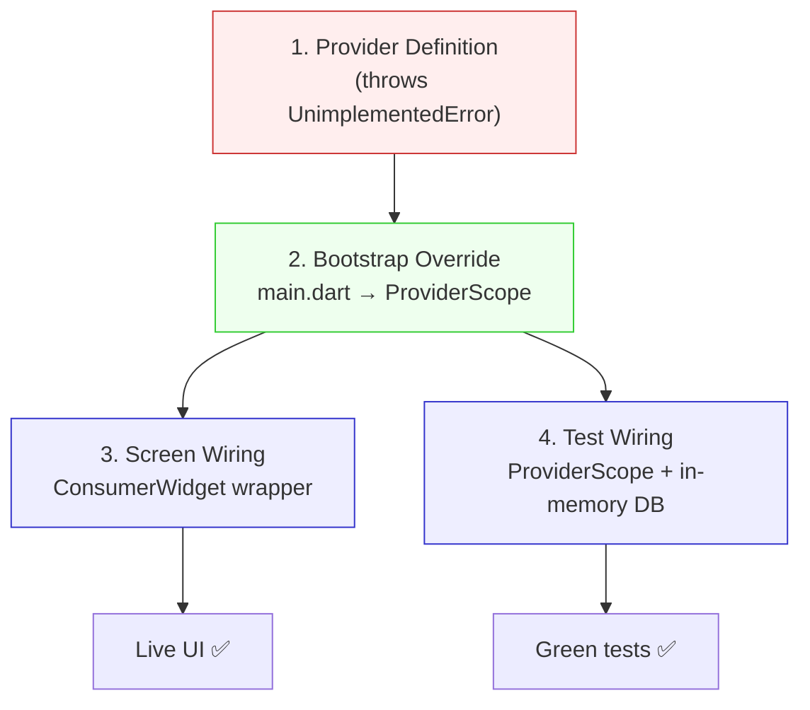

# Blueprint: Riverpod Provider Wiring

<!-- METADATA — structured for agents, useful for humans
tags:        [riverpod, flutter, provider, state-management, testing]
category:    patterns
difficulty:  intermediate
time:        30 min
stack:       [flutter, dart, riverpod]
-->

> Wire Riverpod providers end-to-end: from database bootstrap in `main.dart` to live-updating screens, without silent failures or broken tests.

## TL;DR

A complete wiring pattern for Riverpod `AsyncNotifier` backed by a DAO. Covers the 4 places that must be in sync: **provider definition** (with `throw UnimplementedError` guard), **bootstrap override** in `main.dart`, **ConsumerWidget wrapper** for live state in pushed routes, and **ProviderScope override** in widget tests. Miss any one of these and you get silent failures.

## When to Use

- Adding a new feature that reads/writes persistent state (settings, profiles, accounts…)
- Any screen pushed via `Navigator.push` that needs to react to provider changes
- After converting a `StatelessWidget` to `ConsumerWidget` — tests will break
- When taps on a button "do nothing" with no error in the console

## Prerequisites

- [ ] `flutter_riverpod` and `riverpod_annotation` in `pubspec.yaml`
- [ ] A Drift (or similar) database with at least one DAO
- [ ] Familiarity with `AsyncNotifier` pattern

## Overview



## Steps

### 1. Define the provider with an UnimplementedError guard

**Why**: A provider that depends on a runtime resource (database, HTTP client) can't be initialized at compile time. The `throw UnimplementedError` guard ensures you get an explicit crash instead of a null-related mystery if you forget to override it.

```dart
// lib/providers/database_provider.dart
import 'package:riverpod_annotation/riverpod_annotation.dart';
import '../database/user_database.dart';

part 'database_provider.g.dart';

@Riverpod(keepAlive: true)
UserDatabase userDatabase(UserDatabaseRef ref) {
  // MUST be overridden in ProviderScope — crash loudly if not
  throw UnimplementedError(
    'userDatabaseProvider must be overridden with a real DB instance',
  );
}
```

**Expected outcome**: Calling `ref.read(userDatabaseProvider)` without an override throws immediately with a clear message.

### 2. Override at bootstrap in main.dart

**Why**: The database must be opened once, asynchronously, before the widget tree starts. The override injects the real instance into the entire app.

```dart
// lib/main.dart
import 'dart:io';
import 'package:drift/native.dart';
import 'package:flutter/material.dart';
import 'package:flutter_riverpod/flutter_riverpod.dart';
import 'package:path/path.dart' as p;
import 'package:path_provider/path_provider.dart';

void main() async {
  WidgetsFlutterBinding.ensureInitialized();

  final dir = await getApplicationDocumentsDirectory();
  final file = File(p.join(dir.path, 'app_user.db'));
  final db = UserDatabase(NativeDatabase.createInBackground(file));

  runApp(
    ProviderScope(
      overrides: [
        userDatabaseProvider.overrideWithValue(db),
      ],
      child: const MyApp(),
    ),
  );
}
```

**Expected outcome**: `ref.read(userDatabaseProvider)` returns a live, open database everywhere in the app.

### 3. Wire the screen with a ConsumerWidget wrapper

**Why**: When you `Navigator.push` a screen and pass state as a constructor parameter, you pass a **snapshot**. The pushed screen never rebuilds when the provider updates. The fix is a thin `ConsumerWidget` wrapper that `ref.watch`es the provider and passes live state to the original widget.

```dart
// ❌ ANTI-PATTERN — snapshot state, never updates
void _openSettings(BuildContext context, WidgetRef ref) {
  final state = ref.read(settingsNotifierProvider).valueOrNull;
  if (state == null) return; // silent failure if provider errored!

  Navigator.of(context).push(
    MaterialPageRoute(
      builder: (_) => SettingsScreen(state: state), // frozen snapshot
    ),
  );
}
```

```dart
// ✅ PATTERN — live wrapper
// Navigate to the wrapper, not the screen directly
Navigator.of(context).push(
  MaterialPageRoute(
    builder: (_) => const _LiveSettingsScreen(),
  ),
);

/// Thin wrapper — watches provider, delegates to the pure widget.
class _LiveSettingsScreen extends ConsumerWidget {
  const _LiveSettingsScreen();

  @override
  Widget build(BuildContext context, WidgetRef ref) {
    final settingsAsync = ref.watch(settingsNotifierProvider);

    return settingsAsync.when(
      loading: () => const Scaffold(
        body: Center(child: CircularProgressIndicator()),
      ),
      error: (e, _) => Scaffold(
        body: Center(child: Text('Error: $e')),
      ),
      data: (state) {
        final notifier = ref.read(settingsNotifierProvider.notifier);
        return SettingsScreen(
          state: state,
          onLocaleChanged: notifier.setLocale,
          onCurrencyChanged: notifier.setCurrency,
        );
      },
    );
  }
}
```

**Expected outcome**: Changing a setting triggers `notifier.setX()` → DB write → `invalidateSelf()` → provider rebuild → wrapper rebuilds → screen shows new value instantly.

> **Key insight**: The original `SettingsScreen` stays a pure `StatelessWidget` with props. This means all your existing widget tests (that pass fake state) still work unchanged. Only the navigation call site changes.

### 4. Wire widget tests with ProviderScope + in-memory DB

**Why**: Converting any widget (or its ancestor) to `ConsumerWidget` means it now reads a provider at build time. Your widget test that just pumps `MyApp()` will crash because the provider has no override.

```dart
// test/widget_test.dart
import 'package:drift/native.dart';
import 'package:flutter_riverpod/flutter_riverpod.dart';
import 'package:flutter_test/flutter_test.dart';

void main() {
  testWidgets('App boots and shows bottom nav', (tester) async {
    // In-memory DB — no file system needed
    final db = UserDatabase(NativeDatabase.memory());
    addTearDown(db.close);

    await tester.pumpWidget(
      ProviderScope(
        overrides: [
          userDatabaseProvider.overrideWithValue(db),
        ],
        child: const MyApp(),
      ),
    );
    await tester.pumpAndSettle();

    expect(find.text('Settings'), findsWidgets);
  });
}
```

**Expected outcome**: Tests pass with an isolated in-memory DB. Each test gets a fresh database, no cross-test pollution.

## Variants

<details>
<summary><strong>Variant: Multiple DAOs from one database</strong></summary>

When you have several DAOs (ProfileDao, TransactionDao, AccountDao), create one `userDatabaseProvider` and derive DAO providers from it:

```dart
@riverpod
ProfileDao profileDao(ProfileDaoRef ref) {
  return ref.watch(userDatabaseProvider).profileDao;
}

@riverpod
TransactionDao transactionDao(TransactionDaoRef ref) {
  return ref.watch(userDatabaseProvider).transactionDao;
}
```

Only the database provider needs an override in `main.dart`. DAO providers resolve automatically.

</details>

<details>
<summary><strong>Variant: Provider for non-DB resources (HTTP client, shared prefs)</strong></summary>

Same pattern works for any async resource:

```dart
@Riverpod(keepAlive: true)
SharedPreferences sharedPreferences(SharedPreferencesRef ref) {
  throw UnimplementedError('Override in main.dart');
}

// main.dart
final prefs = await SharedPreferences.getInstance();
runApp(ProviderScope(
  overrides: [sharedPreferencesProvider.overrideWithValue(prefs)],
  child: const MyApp(),
));
```

</details>

## Gotchas

> **Silent null return on async error**: If your navigation does `if (state == null) return;` and the provider is in error state (because the DB override is missing), tapping the button does absolutely nothing. No crash, no log. **Fix**: Always handle the error state explicitly — show a snackbar, log, or navigate to an error screen. See also [Flutter UI Gotchas → S1](flutter-ui-gotchas.md).

> **Short SHA parsed as integer**: When linking commits to KnowLoop, a SHA like `9236634` (all digits) gets parsed as an integer by JSON deserializers. **Fix**: Always use the full 40-character SHA.

> **`invalidateSelf()` needed after writes**: If your `AsyncNotifier.setX()` method writes to DB but doesn't call `ref.invalidateSelf()`, the provider won't rebuild and the wrapper won't re-render. **Fix**: End every mutating method with `ref.invalidateSelf()`.

## Checklist

- [ ] Provider definition has `throw UnimplementedError` guard with descriptive message
- [ ] `main.dart` opens DB asynchronously and overrides the provider in `ProviderScope`
- [ ] Pushed screens use a `ConsumerWidget` wrapper, not snapshot props
- [ ] The wrapper handles `loading`, `error`, and `data` states explicitly
- [ ] The original screen widget remains a pure `StatelessWidget` (testable with fake state)
- [ ] Widget tests wrap the app in `ProviderScope(overrides: [...])` with in-memory DB
- [ ] Every `addTearDown(db.close)` matches every `NativeDatabase.memory()` call
- [ ] Mutating notifier methods call `ref.invalidateSelf()` after DB writes

## Artifacts

| Artifact | Location | Description |
|----------|----------|-------------|
| Database provider | `lib/providers/database_provider.dart` | Guarded provider with `UnimplementedError` |
| Bootstrap | `lib/main.dart` | Async DB init + `ProviderScope` override |
| Live wrapper | `lib/ui/screens/_live_*_screen.dart` | ConsumerWidget that watches provider |
| Test helper | `test/widget_test.dart` | In-memory DB + ProviderScope pattern |

## References

- [Riverpod — Overriding providers](https://riverpod.dev/docs/concepts/scopes#overriding-a-provider) — official docs on ProviderScope overrides
- [Drift — In-memory databases](https://drift.simonbinder.eu/docs/getting-started/#in-memory-databases) — testing with NativeDatabase.memory()
- [Flutter UI Gotchas](flutter-ui-gotchas.md) — companion gotchas for UI-layer issues
- Budget project PR #32 — real-world case where all 4 wiring issues occurred in sequence
