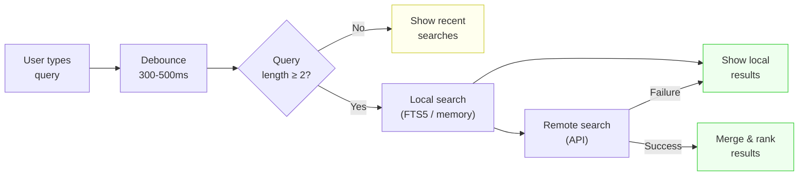

# Blueprint: Search Implementation

<!-- METADATA — structured for agents, useful for humans
tags:        [search, debounce, autocomplete, sqlite, fts5, flutter, dart]
category:    patterns
difficulty:  intermediate
time:        2-3 hours
stack:       [flutter, dart]
-->

> Implement local + remote search with debounce, suggestions, recent searches, and grouped results — without hammering APIs or losing keyboard focus.

## TL;DR

Build a search system that queries locally first (SQLite FTS5 or in-memory), falls back to a remote API when needed, debounces user input at 300-500ms, persists recent searches, and presents results grouped by type with highlighted matching terms.

## When to Use

- Adding search to an app with both local data and a remote API
- When users need instant feedback as they type (autocomplete / suggestions)
- When you want offline-capable search that upgrades to remote when available
- **Not** for server-only search where the client is a thin passthrough — use a simple API call instead

## Prerequisites

- [ ] A Flutter project with a data layer (local DB or API client)
- [ ] `sqflite` or `drift` if using SQLite FTS5 for local search
- [ ] Familiarity with `Timer`, `async/await`, and `StreamController` or `ValueNotifier`

## Overview



## Steps

### 1. Choose the search architecture

**Why**: Flutter offers `SearchDelegate` out of the box, but a custom search widget gives you full control over layout, animations, and state. Decide early so the rest of the code follows one pattern.

```dart
// Option A: Custom search — recommended for most apps
// lib/features/search/search_screen.dart

class SearchScreen extends StatefulWidget {
  const SearchScreen({super.key});

  @override
  State<SearchScreen> createState() => _SearchScreenState();
}

class _SearchScreenState extends State<SearchScreen> {
  final _controller = TextEditingController();
  final _focusNode = FocusNode();
  Timer? _debounce;
  List<SearchResult> _results = [];
  bool _isLoading = false;

  @override
  void dispose() {
    _debounce?.cancel();
    _controller.dispose();
    _focusNode.dispose();
    super.dispose();
  }

  // ...
}
```

> **Decision**: If your app already uses Material's `showSearch` and `SearchDelegate`, wrap the logic below inside `buildSuggestions` / `buildResults`. Otherwise, use a custom screen as shown above.

**Expected outcome**: A dedicated search screen (or delegate) with a `TextEditingController`, a `FocusNode`, and a `Timer?` for debounce.

### 2. Implement debounce on text input

**Why**: Without debounce, every keystroke fires a search — hammering the database and API. A 300-500ms debounce waits for the user to pause typing before executing the query.

```dart
// lib/features/search/search_screen.dart (continued)

void _onQueryChanged(String query) {
  // Cancel the previous timer on every keystroke
  _debounce?.cancel();

  if (query.length < 2) {
    setState(() {
      _results = [];
      _isLoading = false;
    });
    return;
  }

  setState(() => _isLoading = true);

  _debounce = Timer(const Duration(milliseconds: 400), () {
    _performSearch(query);
  });
}
```

Wire it up in `build`:

```dart
TextField(
  controller: _controller,
  focusNode: _focusNode,
  onChanged: _onQueryChanged,
  autofocus: true,
  decoration: InputDecoration(
    hintText: 'Search...',
    suffixIcon: _controller.text.isNotEmpty
        ? IconButton(
            icon: const Icon(Icons.clear),
            onPressed: () {
              _controller.clear();
              _onQueryChanged('');
            },
          )
        : null,
  ),
)
```

**Expected outcome**: Typing "flutter" only triggers one search (after the 400ms pause), not seven.

### 3. Implement local search

**Why**: Local search gives instant results and works offline. Use the right tool for the data size: FTS5 for large datasets, `LIKE` for simple cases, in-memory filtering for small collections.

**SQLite FTS5 (recommended for 1k+ records):**

```dart
// lib/infrastructure/local_search_provider.dart

class LocalSearchProvider {
  LocalSearchProvider({required this.db});

  final Database db;

  /// Create the FTS5 virtual table (run once during migration)
  static Future<void> createFtsTable(Database db) async {
    await db.execute('''
      CREATE VIRTUAL TABLE IF NOT EXISTS items_fts
      USING fts5(title, description, content=items, content_rowid=id)
    ''');
    // Populate from existing data
    await db.execute('''
      INSERT INTO items_fts(rowid, title, description)
      SELECT id, title, description FROM items
    ''');
  }

  /// Search using FTS5 — fast, ranked, supports prefix matching
  Future<List<SearchResult>> search(String query) async {
    final sanitized = query.replaceAll('"', '""');
    final rows = await db.rawQuery('''
      SELECT rowid, title, description,
             rank AS relevance
      FROM items_fts
      WHERE items_fts MATCH '"$sanitized"*'
      ORDER BY rank
      LIMIT 20
    ''');

    return rows.map((r) => SearchResult.fromRow(r)).toList();
  }
}
```

**In-memory filtering (for small datasets < 500 items):**

```dart
// Simple alternative — no SQLite needed
List<SearchResult> searchInMemory(String query, List<Item> items) {
  final lower = query.toLowerCase();
  return items
      .where((item) =>
          item.title.toLowerCase().contains(lower) ||
          item.description.toLowerCase().contains(lower))
      .map((item) => SearchResult.fromItem(item))
      .toList();
}
```

**Expected outcome**: Local search returns results in < 50ms for FTS5, < 100ms for in-memory on typical datasets.

### 4. Add remote search with cancellation

**Why**: Remote search covers data not stored locally (e.g. a catalog API). Cancel the previous request when a new query arrives to avoid stale results overwriting fresh ones.

```dart
// lib/infrastructure/remote_search_provider.dart

class RemoteSearchProvider {
  RemoteSearchProvider({required this.httpClient});

  final http.Client httpClient;
  CancelableOperation<List<SearchResult>>? _pendingSearch;

  Future<List<SearchResult>> search(String query) async {
    // Cancel the previous in-flight request
    await _pendingSearch?.cancel();

    final completer = CancelableCompleter<List<SearchResult>>();

    _pendingSearch = completer.operation;

    try {
      final uri = Uri.parse(
        'https://api.example.com/search?q=${Uri.encodeQueryComponent(query)}&limit=20',
      );
      final response = await httpClient.get(uri);

      if (completer.isCanceled) return [];

      if (response.statusCode != 200) {
        throw ServiceException('Search API returned ${response.statusCode}');
      }

      final json = jsonDecode(response.body) as Map<String, dynamic>;
      final results = (json['results'] as List)
          .map((r) => SearchResult.fromJson(r as Map<String, dynamic>))
          .toList();

      completer.complete(results);
      return results;
    } catch (e) {
      if (completer.isCanceled) return [];
      rethrow;
    }
  }
}
```

Requires `package:async` for `CancelableOperation`:

```yaml
# pubspec.yaml
dependencies:
  async: ^2.11.0
```

**Expected outcome**: Only the latest query's results are used. Previous in-flight requests are cancelled, preventing race conditions.

### 5. Persist recent searches

**Why**: Recent searches let users quickly re-run past queries. Store the last N queries locally and display them when the search field is empty or focused.

```dart
// lib/core/services/recent_searches_service.dart

class RecentSearchesService {
  RecentSearchesService({required this.prefs});

  final SharedPreferences prefs;

  static const _key = 'recent_searches';
  static const _maxItems = 10;

  List<String> getAll() {
    return prefs.getStringList(_key) ?? [];
  }

  Future<void> add(String query) async {
    final trimmed = query.trim();
    if (trimmed.isEmpty) return;

    final searches = getAll();
    // Remove duplicate if exists, then prepend
    searches.remove(trimmed);
    searches.insert(0, trimmed);

    // Keep only the last N
    if (searches.length > _maxItems) {
      searches.removeRange(_maxItems, searches.length);
    }

    await prefs.setStringList(_key, searches);
  }

  Future<void> remove(String query) async {
    final searches = getAll()..remove(query);
    await prefs.setStringList(_key, searches);
  }

  Future<void> clearAll() async {
    await prefs.remove(_key);
  }
}
```

Display as chips when the query is empty:

```dart
// Inside search screen build method
if (_controller.text.isEmpty) ...[
  Padding(
    padding: const EdgeInsets.symmetric(horizontal: 16, vertical: 8),
    child: Row(
      mainAxisAlignment: MainAxisAlignment.spaceBetween,
      children: [
        const Text('Recent', style: TextStyle(fontWeight: FontWeight.bold)),
        TextButton(
          onPressed: () async {
            await _recentSearches.clearAll();
            setState(() {});
          },
          child: const Text('Clear all'),
        ),
      ],
    ),
  ),
  Wrap(
    spacing: 8,
    children: _recentSearches.getAll().map((query) {
      return InputChip(
        label: Text(query),
        onPressed: () {
          _controller.text = query;
          _onQueryChanged(query);
        },
        onDeleted: () async {
          await _recentSearches.remove(query);
          setState(() {});
        },
      );
    }).toList(),
  ),
],
```

**Expected outcome**: Recent searches persist across app restarts, display as deletable chips, and tapping one re-runs the search.

### 6. Build search suggestions with highlighted text

**Why**: Autocomplete suggestions help users find what they want faster. Highlighting the matching portion of each suggestion makes it scannable.

```dart
// lib/features/search/widgets/highlighted_text.dart

class HighlightedText extends StatelessWidget {
  const HighlightedText({
    super.key,
    required this.text,
    required this.query,
    this.style,
    this.highlightStyle,
  });

  final String text;
  final String query;
  final TextStyle? style;
  final TextStyle? highlightStyle;

  @override
  Widget build(BuildContext context) {
    if (query.isEmpty) return Text(text, style: style);

    final lowerText = text.toLowerCase();
    final lowerQuery = query.toLowerCase();
    final spans = <TextSpan>[];
    var start = 0;

    while (true) {
      final index = lowerText.indexOf(lowerQuery, start);
      if (index == -1) {
        spans.add(TextSpan(text: text.substring(start), style: style));
        break;
      }
      if (index > start) {
        spans.add(TextSpan(text: text.substring(start, index), style: style));
      }
      spans.add(TextSpan(
        text: text.substring(index, index + query.length),
        style: highlightStyle ??
            style?.copyWith(fontWeight: FontWeight.bold, backgroundColor: Colors.yellow.withOpacity(0.3)) ??
            const TextStyle(fontWeight: FontWeight.bold, backgroundColor: Color(0x4DFFEB3B)),
      ));
      start = index + query.length;
    }

    return RichText(text: TextSpan(children: spans));
  }
}
```

Use in suggestion tiles:

```dart
ListTile(
  leading: const Icon(Icons.search),
  title: HighlightedText(
    text: suggestion.title,
    query: _controller.text,
  ),
  onTap: () {
    _controller.text = suggestion.title;
    _onQueryChanged(suggestion.title);
  },
)
```

**Expected outcome**: As the user types "bud", the suggestion "Budget Tracker" shows **Bud**get Tracker with the matching portion bolded.

### 7. Present results grouped by type

**Why**: Grouped results (e.g. "People", "Documents", "Settings") help users scan faster than a flat list. Include an empty state so the screen never looks broken.

```dart
// lib/features/search/search_screen.dart (orchestration)

Future<void> _performSearch(String query) async {
  try {
    // Local-first
    final localResults = await _localSearch.search(query);
    if (mounted) {
      setState(() {
        _results = localResults;
        _isLoading = true; // still loading remote
      });
    }

    // Remote augments local
    final remoteResults = await _remoteSearch.search(query);
    if (mounted) {
      setState(() {
        _results = _mergeAndDeduplicate(localResults, remoteResults);
        _isLoading = false;
      });
    }

    // Persist to recent searches on successful search
    await _recentSearches.add(query);
  } catch (_) {
    if (mounted) setState(() => _isLoading = false);
  }
}

List<SearchResult> _mergeAndDeduplicate(
  List<SearchResult> local,
  List<SearchResult> remote,
) {
  final seen = <String>{};
  final merged = <SearchResult>[];

  for (final r in [...local, ...remote]) {
    if (seen.add(r.id)) merged.add(r);
  }

  return merged;
}
```

Group and render:

```dart
Widget _buildResults() {
  if (_isLoading && _results.isEmpty) {
    return const Center(child: CircularProgressIndicator());
  }

  if (_results.isEmpty && _controller.text.length >= 2) {
    return Center(
      child: Column(
        mainAxisSize: MainAxisSize.min,
        children: [
          const Icon(Icons.search_off, size: 64, color: Colors.grey),
          const SizedBox(height: 16),
          Text('No results for "${_controller.text}"'),
        ],
      ),
    );
  }

  final grouped = groupBy(_results, (r) => r.type);

  return ListView(
    children: grouped.entries.expand((entry) {
      return [
        Padding(
          padding: const EdgeInsets.fromLTRB(16, 16, 16, 8),
          child: Text(
            entry.key.label,
            style: Theme.of(context).textTheme.titleSmall,
          ),
        ),
        ...entry.value.map((result) => ListTile(
              leading: Icon(result.type.icon),
              title: HighlightedText(
                text: result.title,
                query: _controller.text,
              ),
              subtitle: result.subtitle != null
                  ? HighlightedText(
                      text: result.subtitle!,
                      query: _controller.text,
                      style: Theme.of(context).textTheme.bodySmall,
                    )
                  : null,
              onTap: () => _onResultTap(result),
            )),
      ];
    }).toList(),
  );
}
```

Requires `package:collection` for `groupBy`.

**Expected outcome**: Results appear grouped under type headers, matching text is highlighted, and an empty state is shown when there are no matches.

## Variants

<details>
<summary><strong>Variant: SearchDelegate instead of custom screen</strong></summary>

If you prefer Material's built-in search, wrap the logic inside a `SearchDelegate`:

```dart
class AppSearchDelegate extends SearchDelegate<SearchResult?> {
  AppSearchDelegate({
    required this.localSearch,
    required this.remoteSearch,
    required this.recentSearches,
  });

  final LocalSearchProvider localSearch;
  final RemoteSearchProvider remoteSearch;
  final RecentSearchesService recentSearches;

  @override
  List<Widget> buildActions(BuildContext context) => [
        IconButton(icon: const Icon(Icons.clear), onPressed: () => query = ''),
      ];

  @override
  Widget buildLeading(BuildContext context) =>
      IconButton(icon: const Icon(Icons.arrow_back), onPressed: () => close(context, null));

  @override
  Widget buildSuggestions(BuildContext context) {
    if (query.length < 2) {
      final recent = recentSearches.getAll();
      return ListView(
        children: recent.map((q) => ListTile(
              leading: const Icon(Icons.history),
              title: Text(q),
              onTap: () {
                query = q;
                showResults(context);
              },
            )).toList(),
      );
    }
    // Debounce + search same as custom approach
    return _buildSearchFuture(query);
  }

  @override
  Widget buildResults(BuildContext context) => _buildSearchFuture(query);
}
```

**Trade-off**: Less control over transitions and layout, but faster to implement for simple cases.

</details>

<details>
<summary><strong>Variant: Search with Riverpod / Bloc</strong></summary>

Move search state out of the widget into a state management solution:

```dart
// Using Riverpod as example
final searchQueryProvider = StateProvider<String>((ref) => '');

final searchResultsProvider = FutureProvider<List<SearchResult>>((ref) async {
  final query = ref.watch(searchQueryProvider);
  if (query.length < 2) return [];

  // Riverpod's built-in debounce (requires riverpod 2.x)
  await Future.delayed(const Duration(milliseconds: 400));
  // Check if query is still current after delay
  if (ref.read(searchQueryProvider) != query) return [];

  final local = await ref.read(localSearchProvider).search(query);
  try {
    final remote = await ref.read(remoteSearchProvider).search(query);
    return _mergeAndDeduplicate(local, remote);
  } catch (_) {
    return local;
  }
});
```

**Trade-off**: Cleaner separation of concerns, but adds a dependency on the state management library.

</details>

## Gotchas

> **No debounce = API spam**: Every keystroke fires a search request. Typing a 10-character query sends 10 API calls. **Fix**: Always debounce with 300-500ms delay and cancel the previous timer on each keystroke.

> **`LIKE '%query%'` does not use indexes**: On tables with 10k+ rows, `LIKE` scans every row. **Fix**: Use SQLite FTS5 virtual tables for full-text search. Create the FTS table in a migration and keep it in sync with triggers or manual inserts.

> **Stale results after data mutation**: User adds a new item, searches for it, and it does not appear because the FTS index is out of date. **Fix**: Update the FTS table in the same transaction as the insert/update/delete, or rebuild the index after mutations.

> **Keyboard dismissed on rebuild**: Calling `setState` during search can cause the `TextField` to lose focus if the widget tree rebuilds improperly. **Fix**: Keep the `FocusNode` in state, pass it to the `TextField`, and ensure the search field is not inside a widget that gets replaced (use keys or keep it outside the rebuilding subtree).

> **Race condition with out-of-order responses**: A slow query A returns after a fast query B, overwriting newer results with stale ones. **Fix**: Cancel previous requests with `CancelableOperation`, or track a query version counter and discard responses that do not match the latest query.

## Checklist

- [ ] Text input is debounced at 300-500ms
- [ ] Previous debounce timer is cancelled on each keystroke
- [ ] Local search uses FTS5 (large data) or in-memory filter (small data)
- [ ] Remote search cancels previous in-flight request on new query
- [ ] Recent searches are persisted (SharedPreferences or local DB)
- [ ] Recent searches display as chips with individual delete and "Clear all"
- [ ] Suggestions highlight matching text portions
- [ ] Results are grouped by type with section headers
- [ ] Empty state is shown when no results match
- [ ] Minimum query length (2+ chars) prevents overly broad searches
- [ ] Keyboard focus is preserved across rebuilds
- [ ] FTS index stays in sync with source data after mutations

## Artifacts

| Artifact | Location | Description |
|----------|----------|-------------|
| Search screen | `lib/features/search/search_screen.dart` | Main search UI with debounce and state |
| Local search | `lib/infrastructure/local_search_provider.dart` | FTS5 or in-memory search provider |
| Remote search | `lib/infrastructure/remote_search_provider.dart` | API search with request cancellation |
| Recent searches | `lib/core/services/recent_searches_service.dart` | Persist and manage recent queries |
| Highlighted text | `lib/features/search/widgets/highlighted_text.dart` | RichText widget for match highlighting |
| Search result model | `lib/core/models/search_result.dart` | Typed result with id, title, type, subtitle |

## References

- [Flutter `SearchDelegate` docs](https://api.flutter.dev/flutter/material/SearchDelegate-class.html) — built-in search scaffold
- [SQLite FTS5 documentation](https://www.sqlite.org/fts5.html) — full-text search extension
- [package:async `CancelableOperation`](https://pub.dev/documentation/async/latest/async/CancelableOperation-class.html) — cancel in-flight futures
- [Service Layer Pattern](service-layer-pattern.md) — interface-based dependencies and cache fallback chains
