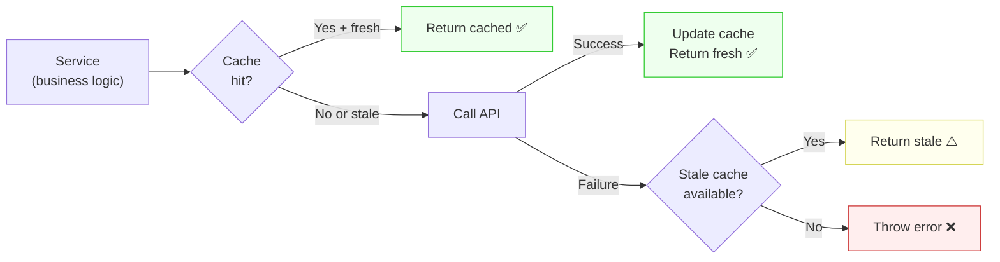

# Blueprint: Service Layer Pattern

<!-- METADATA — structured for agents, useful for humans
tags:        [service, flutter, dart, testing, cache, offline, architecture]
category:    patterns
difficulty:  intermediate
time:        45 min
stack:       [flutter, dart]
-->

> Structure services with interface-based dependencies, cache+fallback chains, and mock-friendly testing — no mocking frameworks needed.

## TL;DR

Every service that touches external I/O (network, file system, platform APIs) depends on **abstract interfaces**, not concrete implementations. Services are testable via simple hand-written mocks. Cache logic follows a **cache → API → stale cache → error** fallback chain that works seamlessly offline.

## When to Use

- Adding a service that calls a REST API, reads files, or uses platform plugins
- When you need offline support with graceful degradation
- When tests are slow because they hit real I/O
- Integrating a third-party SDK (exchange rates, analytics, cloud storage)

## Prerequisites

- [ ] A Dart/Flutter project with a service layer (or about to create one)
- [ ] Understanding of abstract classes / interfaces in Dart
- [ ] Familiarity with async/await and Future error handling

## Overview



## Steps

### 1. Define the interface for external dependencies

**Why**: The service should never know whether it's talking to a real API, a mock, or a stub. The interface is the contract.

```dart
// lib/core/services/exchange_rate_provider.dart

/// Contract for fetching exchange rates.
abstract class ExchangeRateProvider {
  /// Returns the rate for [from] → [to], or throws on failure.
  Future<double> getRate(String from, String to);
}
```

```dart
// lib/core/services/crypto_price_provider.dart

abstract class CryptoPriceProvider {
  Future<double> getPrice(String symbol, String vsCurrency);
}
```

**Expected outcome**: Clean contracts that document what the service needs, without coupling to HTTP, gRPC, or any SDK.

### 2. Implement the real provider

**Why**: The concrete implementation lives in a separate file and handles all the I/O details (HTTP, headers, parsing, error mapping).

```dart
// lib/infrastructure/coingecko_price_provider.dart

class CoinGeckoPriceProvider implements CryptoPriceProvider {
  CoinGeckoPriceProvider({required this.httpClient});

  final http.Client httpClient;

  @override
  Future<double> getPrice(String symbol, String vsCurrency) async {
    final uri = Uri.parse(
      'https://api.coingecko.com/api/v3/simple/price'
      '?ids=$symbol&vs_currencies=$vsCurrency',
    );
    final response = await httpClient.get(uri);
    if (response.statusCode != 200) {
      throw ServiceException('CoinGecko returned ${response.statusCode}');
    }
    final json = jsonDecode(response.body) as Map<String, dynamic>;
    return (json[symbol][vsCurrency] as num).toDouble();
  }
}
```

**Expected outcome**: The real provider is the only place that knows about HTTP, URLs, and JSON parsing.

### 3. Build the service with cache + fallback chain

**Why**: Network calls fail. The cache ensures the user always sees *something*, even if it's slightly stale. The fallback chain defines the priority: fresh cache → API → stale cache → error.

```dart
// lib/core/services/market_service.dart

class MarketService {
  MarketService({
    required this.exchangeRateProvider,
    required this.cryptoPriceProvider,
    required this.cache,
  });

  final ExchangeRateProvider exchangeRateProvider;
  final CryptoPriceProvider cryptoPriceProvider;
  final MarketCache cache;

  Future<double> getExchangeRate(String from, String to) async {
    // 1. Fresh cache?
    final cached = cache.get('$from→$to');
    if (cached != null && !cached.isStale) return cached.value;

    // 2. Try API
    try {
      final rate = await exchangeRateProvider.getRate(from, to);
      cache.put('$from→$to', rate);
      return rate;
    } catch (_) {
      // 3. Stale cache fallback
      if (cached != null) return cached.value;

      // 4. No data at all
      rethrow;
    }
  }
}
```

**Expected outcome**: The service works online (fresh data), degrades gracefully offline (stale data), and only throws when there's truly no data.

### 4. Implement the cache with TTL

**Why**: A simple in-memory cache with time-to-live prevents hammering the API and provides offline fallback.

```dart
// lib/core/services/market_cache.dart

class CacheEntry<T> {
  CacheEntry(this.value, this.timestamp);

  final T value;
  final DateTime timestamp;

  bool get isStale =>
      DateTime.now().difference(timestamp) > const Duration(minutes: 30);
}

class MarketCache {
  final _store = <String, CacheEntry<double>>{};
  final _manualOverrides = <String, double>{};

  CacheEntry<double>? get(String key) {
    // Manual overrides never expire
    if (_manualOverrides.containsKey(key)) {
      return CacheEntry(_manualOverrides[key]!, DateTime.now());
    }
    return _store[key];
  }

  void put(String key, double value) {
    _store[key] = CacheEntry(value, DateTime.now());
  }

  void setManualOverride(String key, double value) {
    _manualOverrides[key] = value;
  }

  void clearAll() {
    _store.clear();
    // Preserve manual overrides — user intent
  }
}
```

**Expected outcome**: Cache with TTL + manual overrides that survive `clearAll()`.

### 5. Write tests with hand-written mocks

**Why**: Simple mocks with a `shouldFail` flag and `callCount` are easier to read and maintain than mockito setups. No code generation, no `@GenerateMocks`.

```dart
// test/core/services/market_service_test.dart

class MockExchangeRateProvider implements ExchangeRateProvider {
  double rateToReturn = 1.1;
  bool shouldFail = false;
  int callCount = 0;

  @override
  Future<double> getRate(String from, String to) async {
    callCount++;
    if (shouldFail) throw Exception('Network error');
    return rateToReturn;
  }
}

void main() {
  late MockExchangeRateProvider mockRates;
  late MarketCache cache;
  late MarketService service;

  setUp(() {
    mockRates = MockExchangeRateProvider();
    cache = MarketCache();
    service = MarketService(
      exchangeRateProvider: mockRates,
      cryptoPriceProvider: MockCryptoPriceProvider(),
      cache: cache,
    );
  });

  test('returns fresh rate from API and caches it', () async {
    mockRates.rateToReturn = 1.08;

    final rate = await service.getExchangeRate('USD', 'EUR');

    expect(rate, 1.08);
    expect(mockRates.callCount, 1);
    expect(cache.get('USD→EUR'), isNotNull);
  });

  test('returns stale cache when API fails', () async {
    // Prime the cache
    cache.put('USD→EUR', 1.05);
    // Simulate network failure
    mockRates.shouldFail = true;

    final rate = await service.getExchangeRate('USD→EUR', 'EUR');

    expect(rate, 1.05); // stale but available
  });

  test('throws when no cache and API fails', () async {
    mockRates.shouldFail = true;

    expect(
      () => service.getExchangeRate('USD', 'EUR'),
      throwsException,
    );
  });
}
```

**Expected outcome**: Tests are fast, readable, and don't need any code generation.

## Variants

<details>
<summary><strong>Variant: CSV export with UTF-8 BOM</strong></summary>

When exporting data to CSV that users will open in Excel:

```dart
String exportToCsv(List<AppTransaction> transactions) {
  final buffer = StringBuffer();
  // UTF-8 BOM for Excel compatibility
  buffer.write('\uFEFF');
  buffer.writeln('Date,Description,Amount,Category');

  for (final t in transactions) {
    final desc = t.description.contains(',')
        ? '"${t.description.replaceAll('"', '""')}"'
        : t.description;
    buffer.writeln('${t.date.toIso8601String()},$desc,${t.amount},${t.category}');
  }

  return buffer.toString();
}
```

**Gotcha**: Without `\uFEFF`, Excel interprets the file as ANSI and mangles accented characters (é→é).

</details>

<details>
<summary><strong>Variant: Backup with conflict detection</strong></summary>

When importing data, check for existing IDs and report conflicts:

```dart
class ImportResult {
  final int imported;
  final int skipped;
  final List<String> conflicts; // IDs that already exist
}

Future<ImportResult> importBackup(BackupData data) async {
  final existingIds = await dao.getAllIds();
  final conflicts = <String>[];
  var imported = 0;

  for (final record in data.records) {
    if (existingIds.contains(record.id)) {
      conflicts.add(record.id);
      continue; // skip, don't overwrite
    }
    await dao.insert(record);
    imported++;
  }

  return ImportResult(
    imported: imported,
    skipped: conflicts.length,
    conflicts: conflicts,
  );
}
```

</details>

<details>
<summary><strong>Variant: Pure stateless service (no deps)</strong></summary>

Some services need no external dependencies at all — they're pure logic:

```dart
class ReminderService {
  List<Reminder> generateReminders({
    required List<RecurringTransaction> recurring,
    required DateTime today,
  }) {
    return recurring
        .where((r) => r.nextDueDate.isBefore(today.add(Duration(days: 3))))
        .map((r) => Reminder(transaction: r, dueDate: r.nextDueDate))
        .toList();
  }
}
```

No interface needed — it's already testable as-is.

</details>

## Gotchas

> **UnimplementedError stubs for deferred features**: When a feature is planned but not yet built (e.g. Google Drive sync), stub it with `throw UnimplementedError('Google Drive: planned for v0.2')`. This documents intent and gives a clear error if someone tries to use it. **Don't** return null or empty data — that hides the fact that the feature doesn't exist yet.

> **Manual override preservation on clearAll()**: When the user manually sets a value (e.g. a custom exchange rate), `clearAll()` should NOT delete it. Manual overrides represent user intent. **Fix**: Separate `_manualOverrides` from `_store` in the cache.

> **HTTP client injection**: Always inject `http.Client` into providers — never create it internally. This lets tests pass a mock client and avoids socket leaks in tests.

## Checklist

- [ ] Every external dependency is behind an abstract interface
- [ ] Service constructor takes interfaces as parameters (dependency injection)
- [ ] Cache follows the 4-step fallback: fresh cache → API → stale cache → error
- [ ] Manual overrides survive `clearAll()`
- [ ] Tests use hand-written mocks with `shouldFail` + `callCount`
- [ ] No mocking framework dependency (no mockito, no build_runner for mocks)
- [ ] Deferred features throw `UnimplementedError` with version note
- [ ] CSV export includes UTF-8 BOM (`\uFEFF`) for Excel compatibility
- [ ] HTTP client is injected, not created internally

## Artifacts

| Artifact | Location | Description |
|----------|----------|-------------|
| Interface | `lib/core/services/<name>_provider.dart` | Abstract contract for external dep |
| Implementation | `lib/infrastructure/<name>_provider.dart` | Concrete HTTP/SDK implementation |
| Service | `lib/core/services/<name>_service.dart` | Business logic with cache + fallback |
| Cache | `lib/core/services/<name>_cache.dart` | In-memory TTL cache with manual overrides |
| Mock | `test/core/services/mock_<name>.dart` | Hand-written mock with `shouldFail` flag |

## References

- [Service layer pattern in Budget (Tier 6)](# ) — original pattern note
- [ViewModel Pure Functions](viewmodel-pure-functions.md) — how VMs consume service data
- [Error Handling & Logging](error-handling-logging.md) — Result types and error classification
- [Offline-First Architecture](../architecture/offline-first-architecture.md) — full offline sync strategy
