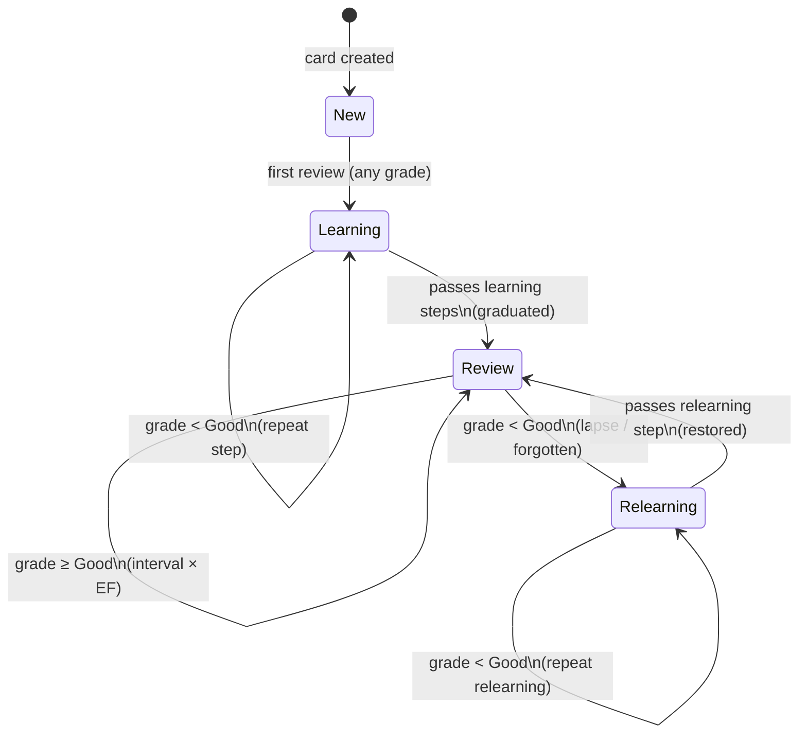

# Blueprint: Spaced Repetition System

<!-- METADATA — structured for agents, useful for humans
tags:        [srs, spaced-repetition, learning, sm2, fsrs, flashcards]
category:    patterns
difficulty:  advanced
time:        6 hours
stack:       [flutter, dart, sqlite]
-->

> Implement a spaced repetition scheduler (SM-2 or FSRS) that maximises long-term retention by showing each flashcard at the exact moment the user is about to forget it.

## TL;DR

Build a flashcard review engine that uses the SM-2 algorithm to compute optimal review intervals: new cards graduate to days, then weeks, then months. Every review is logged, the ease factor adjusts to the user's recall, and analytics surface retention rate and a 30-day forecast — all backed by a local SQLite database via Drift.

## When to Use

- Building a language-learning, medical, or any memorisation-heavy app
- When you want reviews to scale to thousands of cards without overwhelming the user
- When you need offline-first scheduling that does not depend on a server clock
- **Not** for quizzes with fixed question pools reviewed on a fixed schedule — use a simple shuffle instead
- **Not** when card counts are below ~30 — a simple daily review list is sufficient overhead-free

## Prerequisites

- [ ] Flutter project with Drift (or `sqflite`) configured
- [ ] Basic understanding of `async/await` and Dart isolates
- [ ] Familiarity with Drift table definitions and DAOs
- [ ] `drift`, `sqlite3_flutter_libs`, `intl`, and `collection` packages added to `pubspec.yaml`

## Overview



## Steps

### 1. Define the card and review data models

**Why**: A clear domain model separates the scheduling logic from UI and persistence. `CardState` drives which algorithm branch applies. `ReviewCard` is immutable — every review produces a new instance rather than mutating in place, making undo trivial.

```dart
// lib/core/models/card_state.dart

enum CardState { newCard, learning, review, relearning }
```

```dart
// lib/core/models/review_card.dart

class ReviewCard {
  const ReviewCard({
    required this.id,
    required this.contentId,
    required this.nextReview,
    required this.interval,
    required this.easeFactor,
    required this.repetitions,
    required this.lapses,
    required this.state,
  });

  final String id;
  final String contentId;   // FK to the actual question/answer content
  final DateTime nextReview; // always UTC
  final int interval;        // days until next review
  final double easeFactor;   // SM-2 EF, starts at 2.5, floor 1.3
  final int repetitions;     // successful reviews in a row
  final int lapses;          // times the card was forgotten (grade < 2)
  final CardState state;

  /// Produce an updated card after a review without mutating this instance.
  ReviewCard copyWith({
    DateTime? nextReview,
    int? interval,
    double? easeFactor,
    int? repetitions,
    int? lapses,
    CardState? state,
  }) {
    return ReviewCard(
      id: id,
      contentId: contentId,
      nextReview: nextReview ?? this.nextReview,
      interval: interval ?? this.interval,
      easeFactor: easeFactor ?? this.easeFactor,
      repetitions: repetitions ?? this.repetitions,
      lapses: lapses ?? this.lapses,
      state: state ?? this.state,
    );
  }

  /// A brand-new card with default SM-2 values.
  factory ReviewCard.create({required String id, required String contentId}) {
    return ReviewCard(
      id: id,
      contentId: contentId,
      nextReview: DateTime.now().toUtc(),
      interval: 0,
      easeFactor: 2.5,
      repetitions: 0,
      lapses: 0,
      state: CardState.newCard,
    );
  }
}
```

```dart
// lib/core/models/review_log.dart

class ReviewLog {
  const ReviewLog({
    required this.id,
    required this.cardId,
    required this.reviewedAt,
    required this.quality,
    required this.intervalBefore,
    required this.intervalAfter,
    required this.easeFactorBefore,
    required this.easeFactorAfter,
    required this.durationMs,
  });

  final String id;
  final String cardId;
  final DateTime reviewedAt; // UTC
  final int quality;          // 0-5 (SM-2) or 1-4 (FSRS)
  final int intervalBefore;
  final int intervalAfter;
  final double easeFactorBefore;
  final double easeFactorAfter;
  final int durationMs; // time the user spent on this card
}
```

**Expected outcome**: Two clean immutable domain objects with no framework dependencies — easy to unit-test in isolation.

### 2. Implement the SM-2 scheduling algorithm

**Why**: SM-2 is the battle-tested algorithm behind Anki and SuperMemo. It computes the next interval from a quality grade (0–5) and adjusts the ease factor so cards that are consistently hard come back sooner. Implementing it yourself gives full control over edge cases and minimum interval floors.

```dart
// lib/core/srs/sm2_scheduler.dart

/// Quality grades (q) used by SM-2.
/// 0 = complete blackout          — card goes back to learning
/// 1 = incorrect, answer remembered after seeing it
/// 2 = incorrect, but easy to recall when shown
/// 3 = correct with significant difficulty
/// 4 = correct after a hesitation
/// 5 = perfect recall, effortless
class Sm2Scheduler {
  static const double _minEaseFactor = 1.3;
  static const double _startingEaseFactor = 2.5;

  /// Minimum interval floors (days). Prevents EF death spiral.
  static const int _minFirstInterval = 1;
  static const int _minSecondInterval = 6;
  static const int _minRelearningInterval = 1;

  /// Process a review and return the updated [ReviewCard].
  ///
  /// [card]    — the card being reviewed
  /// [quality] — recall quality, 0-5
  /// [now]     — the moment of review (default: UTC now)
  ReviewCard schedule(ReviewCard card, int quality, {DateTime? now}) {
    assert(quality >= 0 && quality <= 5, 'SM-2 quality must be 0-5');

    final reviewedAt = (now ?? DateTime.now()).toUtc();

    if (quality < 3) {
      // Failed review — reset repetitions, reduce EF, send to relearning
      return _handleFail(card, quality, reviewedAt);
    }

    return _handlePass(card, quality, reviewedAt);
  }

  ReviewCard _handlePass(ReviewCard card, int quality, DateTime reviewedAt) {
    // EF' = EF + (0.1 - (5 - q) * (0.08 + (5 - q) * 0.02))
    final delta = 0.1 - (5 - quality) * (0.08 + (5 - quality) * 0.02);
    final newEF = (card.easeFactor + delta).clamp(_minEaseFactor, 5.0);

    final int newInterval;
    final int newRepetitions = card.repetitions + 1;
    final CardState newState;

    switch (card.state) {
      case CardState.newCard:
      case CardState.learning:
        // Learning step 1: 1 day, step 2: 6 days
        if (card.repetitions == 0) {
          newInterval = _minFirstInterval;
          newState = CardState.learning;
        } else {
          newInterval = _minSecondInterval;
          newState = CardState.review;
        }

      case CardState.review:
        // Reviewed card: interval × EF, rounded to nearest day
        final raw = card.interval == 0
            ? _minSecondInterval.toDouble()
            : card.interval * newEF;
        newInterval = raw.round().clamp(_minSecondInterval, 36500);
        newState = CardState.review;

      case CardState.relearning:
        // Graduates back to review with a floor interval
        newInterval = _minRelearningInterval.clamp(1, 36500);
        newState = CardState.review;
    }

    return card.copyWith(
      nextReview: reviewedAt.add(Duration(days: newInterval)),
      interval: newInterval,
      easeFactor: newEF,
      repetitions: newRepetitions,
      state: newState,
    );
  }

  ReviewCard _handleFail(ReviewCard card, int quality, DateTime reviewedAt) {
    // EF degrades on failure but is clamped to the minimum
    final delta = 0.1 - (5 - quality) * (0.08 + (5 - quality) * 0.02);
    final newEF = (card.easeFactor + delta).clamp(_minEaseFactor, 5.0);

    return card.copyWith(
      nextReview: reviewedAt.add(const Duration(minutes: 10)),
      interval: 0,
      easeFactor: newEF,
      repetitions: 0,
      lapses: card.lapses + 1,
      state: card.state == CardState.newCard
          ? CardState.learning
          : CardState.relearning,
    );
  }
}
```

Unit-test the key cases immediately:

```dart
// test/srs/sm2_scheduler_test.dart

void main() {
  late Sm2Scheduler scheduler;

  setUp(() => scheduler = Sm2Scheduler());

  test('new card — quality 4 — first interval is 1 day', () {
    final card = ReviewCard.create(id: '1', contentId: 'c1');
    final result = scheduler.schedule(card, 4);

    expect(result.interval, 1);
    expect(result.state, CardState.learning);
    expect(result.repetitions, 1);
  });

  test('learning card — quality 4 — second interval is 6 days', () {
    final card = ReviewCard.create(id: '1', contentId: 'c1')
        .copyWith(state: CardState.learning, repetitions: 1, interval: 1);
    final result = scheduler.schedule(card, 4);

    expect(result.interval, 6);
    expect(result.state, CardState.review);
  });

  test('review card — quality 4 — interval grows by EF', () {
    final card = ReviewCard.create(id: '1', contentId: 'c1').copyWith(
      state: CardState.review,
      interval: 6,
      easeFactor: 2.5,
      repetitions: 2,
    );
    final result = scheduler.schedule(card, 4);

    // 6 * 2.5 = 15, EF nudged slightly downward for q=4
    expect(result.interval, greaterThan(10));
    expect(result.state, CardState.review);
  });

  test('review card — quality 1 — lapses increments, state is relearning', () {
    final card = ReviewCard.create(id: '1', contentId: 'c1').copyWith(
      state: CardState.review,
      interval: 15,
      easeFactor: 2.5,
      repetitions: 3,
    );
    final result = scheduler.schedule(card, 1);

    expect(result.lapses, 1);
    expect(result.state, CardState.relearning);
    expect(result.interval, 0);
  });

  test('ease factor never drops below 1.3', () {
    var card = ReviewCard.create(id: '1', contentId: 'c1').copyWith(
      state: CardState.review,
      interval: 10,
      easeFactor: 1.35,
      repetitions: 5,
    );
    // Repeatedly fail the card
    for (var i = 0; i < 10; i++) {
      card = scheduler.schedule(card, 0);
    }
    expect(card.easeFactor, greaterThanOrEqualTo(1.3));
  });
}
```

**Expected outcome**: A pure Dart class with zero Flutter dependencies that schedules the next review date correctly. All unit tests pass in < 1 second.

### 3. Define the database schema with Drift

**Why**: Three tables serve distinct purposes: `review_cards` is the live scheduling state, `review_log` is the append-only audit trail for analytics and undo, and `daily_stats` is a pre-aggregated cache so dashboards stay fast even with thousands of log entries.

```dart
// lib/infrastructure/database/tables.dart

import 'package:drift/drift.dart';

class ReviewCards extends Table {
  TextColumn get id => text()();
  TextColumn get contentId => text()();
  DateTimeColumn get nextReview => dateTime()(); // stored as UTC epoch ms
  IntColumn get interval => integer().withDefault(const Constant(0))();
  RealColumn get easeFactor => real().withDefault(const Constant(2.5))();
  IntColumn get repetitions => integer().withDefault(const Constant(0))();
  IntColumn get lapses => integer().withDefault(const Constant(0))();
  TextColumn get state => textEnum<CardState>()(); // 'newCard'|'learning'|'review'|'relearning'

  @override
  Set<Column> get primaryKey => {id};
}

class ReviewLogs extends Table {
  TextColumn get id => text()();
  TextColumn get cardId => text().references(ReviewCards, #id)();
  DateTimeColumn get reviewedAt => dateTime()();
  IntColumn get quality => integer()();
  IntColumn get intervalBefore => integer()();
  IntColumn get intervalAfter => integer()();
  RealColumn get easeFactorBefore => real()();
  RealColumn get easeFactorAfter => real()();
  IntColumn get durationMs => integer()();

  @override
  Set<Column> get primaryKey => {id};
}

class DailyStats extends Table {
  /// ISO date string: '2026-04-06'
  TextColumn get date => text()();
  IntColumn get cardsReviewed => integer().withDefault(const Constant(0))();
  IntColumn get newCardsIntroduced => integer().withDefault(const Constant(0))();
  IntColumn get totalTimeMs => integer().withDefault(const Constant(0))();
  IntColumn get correctCount => integer().withDefault(const Constant(0))();
  IntColumn get incorrectCount => integer().withDefault(const Constant(0))();

  @override
  Set<Column> get primaryKey => {date};

  /// Retention rate is derived: correctCount / (correctCount + incorrectCount)
}
```

```dart
// lib/infrastructure/database/app_database.dart

import 'package:drift/drift.dart';
import 'package:drift/native.dart';
import 'tables.dart';

part 'app_database.g.dart';

@DriftDatabase(tables: [ReviewCards, ReviewLogs, DailyStats])
class AppDatabase extends _$AppDatabase {
  AppDatabase() : super(_openConnection());

  @override
  int get schemaVersion => 1;

  static QueryExecutor _openConnection() {
    return driftDatabase(name: 'srs_database');
  }
}
```

Run migrations by bumping `schemaVersion` and implementing `migration` — never alter existing tables in place. Use `Drift`'s `createMigrator` helper.

**Expected outcome**: Three tables created on first launch, with foreign key enforcement between `review_logs.card_id` and `review_cards.id`.

### 4. Build the review queue DAO

**Why**: Centralising all queue queries in a DAO keeps scheduling logic out of UI code and makes the queries testable. The two critical decisions — how many new cards to introduce per day, and how to interleave new cards with reviews — live here.

```dart
// lib/infrastructure/database/review_queue_dao.dart

import 'package:drift/drift.dart';
import 'package:uuid/uuid.dart';
import '../../core/models/review_card.dart';
import '../../core/models/review_log.dart';
import 'app_database.dart';
import 'tables.dart';

part 'review_queue_dao.g.dart';

@DriftAccessor(tables: [ReviewCards, ReviewLogs, DailyStats])
class ReviewQueueDao extends DatabaseAccessor<AppDatabase>
    with _$ReviewQueueDaoMixin {
  ReviewQueueDao(super.db);

  static const int _defaultNewCardsPerDay = 20;
  static const _uuid = Uuid();

  // ─── Queue fetching ────────────────────────────────────────────────────────

  /// Returns due review cards (state = review/relearning) ordered by overdue-ness.
  Future<List<ReviewCard>> getDueReviews({DateTime? asOf}) async {
    final now = (asOf ?? DateTime.now()).toUtc();
    final rows = await (select(reviewCards)
          ..where((t) =>
              t.nextReview.isSmallerOrEqualValue(now) &
              t.state.isIn(['review', 'relearning']))
          ..orderBy([(t) => OrderingTerm.asc(t.nextReview)]))
        .get();
    return rows.map(_rowToCard).toList();
  }

  /// Returns new cards not yet started, up to the daily limit minus those
  /// already introduced today.
  Future<List<ReviewCard>> getNewCardsForToday({
    int limit = _defaultNewCardsPerDay,
  }) async {
    final todayKey = _todayKey();
    final stats = await (select(dailyStats)
          ..where((t) => t.date.equals(todayKey)))
        .getSingleOrNull();

    final alreadyIntroduced = stats?.newCardsIntroduced ?? 0;
    final remaining = (limit - alreadyIntroduced).clamp(0, limit);
    if (remaining == 0) return [];

    final rows = await (select(reviewCards)
          ..where((t) => t.state.equals('newCard'))
          ..orderBy([(t) => OrderingTerm.asc(t.id)])
          ..limit(remaining))
        .get();
    return rows.map(_rowToCard).toList();
  }

  /// Builds the full session queue: reviews first, then interleaved new cards.
  ///
  /// Interleaving strategy: one new card every [interleavePer] review cards.
  Future<List<ReviewCard>> buildSessionQueue({
    int newCardsLimit = _defaultNewCardsPerDay,
    int interleavePer = 5,
  }) async {
    final reviews = await getDueReviews();
    final newCards = await getNewCardsForToday(limit: newCardsLimit);

    if (newCards.isEmpty) return reviews;

    // Interleave: insert one new card every [interleavePer] reviews
    final queue = <ReviewCard>[];
    var newIndex = 0;

    for (var i = 0; i < reviews.length; i++) {
      if (i > 0 && i % interleavePer == 0 && newIndex < newCards.length) {
        queue.add(newCards[newIndex++]);
      }
      queue.add(reviews[i]);
    }

    // Append any remaining new cards at the end
    while (newIndex < newCards.length) {
      queue.add(newCards[newIndex++]);
    }

    return queue;
  }

  // ─── Persistence ──────────────────────────────────────────────────────────

  /// Persists the result of a single review inside a transaction.
  Future<void> saveReview({
    required ReviewCard before,
    required ReviewCard after,
    required int quality,
    required int durationMs,
  }) async {
    await transaction(() async {
      // Update the card row
      await (update(reviewCards)..where((t) => t.id.equals(after.id)))
          .write(_cardToCompanion(after));

      // Append to log
      await into(reviewLogs).insert(ReviewLogsCompanion.insert(
        id: _uuid.v4(),
        cardId: after.id,
        reviewedAt: DateTime.now().toUtc(),
        quality: quality,
        intervalBefore: before.interval,
        intervalAfter: after.interval,
        easeFactorBefore: before.easeFactor,
        easeFactorAfter: after.easeFactor,
        durationMs: durationMs,
      ));

      // Update daily stats
      await _updateDailyStats(
        isNew: before.state == CardState.newCard,
        correct: quality >= 3,
        durationMs: durationMs,
      );
    });
  }

  Future<void> _updateDailyStats({
    required bool isNew,
    required bool correct,
    required int durationMs,
  }) async {
    final key = _todayKey();
    final existing = await (select(dailyStats)
          ..where((t) => t.date.equals(key)))
        .getSingleOrNull();

    if (existing == null) {
      await into(dailyStats).insert(DailyStatsCompanion.insert(
        date: key,
        cardsReviewed: const Value(1),
        newCardsIntroduced: Value(isNew ? 1 : 0),
        totalTimeMs: Value(durationMs),
        correctCount: Value(correct ? 1 : 0),
        incorrectCount: Value(correct ? 0 : 1),
      ));
    } else {
      await (update(dailyStats)..where((t) => t.date.equals(key))).write(
        DailyStatsCompanion(
          cardsReviewed: Value(existing.cardsReviewed + 1),
          newCardsIntroduced:
              Value(existing.newCardsIntroduced + (isNew ? 1 : 0)),
          totalTimeMs: Value(existing.totalTimeMs + durationMs),
          correctCount: Value(existing.correctCount + (correct ? 1 : 0)),
          incorrectCount: Value(existing.incorrectCount + (correct ? 0 : 1)),
        ),
      );
    }
  }

  // ─── Undo ─────────────────────────────────────────────────────────────────

  /// Reverts the last review by restoring the [before] card state and removing
  /// the most recent log entry for the card.
  Future<void> undoReview(ReviewCard before) async {
    await transaction(() async {
      await (update(reviewCards)..where((t) => t.id.equals(before.id)))
          .write(_cardToCompanion(before));

      // Find and delete the most recent log entry for this card
      final lastLog = await (select(reviewLogs)
            ..where((t) => t.cardId.equals(before.id))
            ..orderBy([(t) => OrderingTerm.desc(t.reviewedAt)])
            ..limit(1))
          .getSingleOrNull();

      if (lastLog != null) {
        await (delete(reviewLogs)..where((t) => t.id.equals(lastLog.id))).go();
      }
    });
  }

  // ─── Helpers ──────────────────────────────────────────────────────────────

  String _todayKey() {
    final now = DateTime.now();
    return '${now.year}-${now.month.toString().padLeft(2, '0')}-'
        '${now.day.toString().padLeft(2, '0')}';
  }

  ReviewCard _rowToCard(ReviewCard row) => row; // Drift returns typed rows
  // (adjust if using raw maps or a separate mapper class)

  ReviewCardsCompanion _cardToCompanion(ReviewCard c) {
    return ReviewCardsCompanion(
      id: Value(c.id),
      contentId: Value(c.contentId),
      nextReview: Value(c.nextReview),
      interval: Value(c.interval),
      easeFactor: Value(c.easeFactor),
      repetitions: Value(c.repetitions),
      lapses: Value(c.lapses),
      state: Value(c.state.name),
    );
  }
}
```

**Expected outcome**: A session queue of at most 20 new cards interleaved with all due reviews, fetched in a single method call. Every review is transactionally written to both the card row and the log.

### 5. Wire the session flow in a Riverpod notifier

**Why**: The session has clear sequential state — loading queue, showing a card, waiting for grade, updating — that maps naturally to a notifier. Keeping `_previousCard` in memory enables single-level undo without a database round-trip.

```dart
// lib/features/review/session_state.dart

import '../../core/models/review_card.dart';

enum SessionStatus { idle, loading, reviewing, sessionComplete }

class SessionState {
  const SessionState({
    required this.status,
    required this.queue,
    required this.currentIndex,
    this.previousCard,
    this.error,
  });

  final SessionStatus status;
  final List<ReviewCard> queue;
  final int currentIndex;
  final ReviewCard? previousCard; // held in memory for undo
  final Object? error;

  ReviewCard? get currentCard =>
      currentIndex < queue.length ? queue[currentIndex] : null;

  int get remaining => queue.length - currentIndex;

  SessionState copyWith({
    SessionStatus? status,
    List<ReviewCard>? queue,
    int? currentIndex,
    ReviewCard? previousCard,
    Object? error,
  }) {
    return SessionState(
      status: status ?? this.status,
      queue: queue ?? this.queue,
      currentIndex: currentIndex ?? this.currentIndex,
      previousCard: previousCard ?? this.previousCard,
      error: error ?? this.error,
    );
  }

  static const empty = SessionState(
    status: SessionStatus.idle,
    queue: [],
    currentIndex: 0,
  );
}
```

```dart
// lib/features/review/session_notifier.dart

import 'package:riverpod_annotation/riverpod_annotation.dart';
import '../../core/srs/sm2_scheduler.dart';
import '../../infrastructure/database/review_queue_dao.dart';
import 'session_state.dart';

part 'session_notifier.g.dart';

@riverpod
class SessionNotifier extends _$SessionNotifier {
  static final _scheduler = Sm2Scheduler();

  @override
  SessionState build() => SessionState.empty;

  ReviewQueueDao get _dao => ref.read(reviewQueueDaoProvider);

  // ─── Session lifecycle ────────────────────────────────────────────────────

  Future<void> startSession({int newCardsLimit = 20}) async {
    state = state.copyWith(status: SessionStatus.loading);
    try {
      final queue = await _dao.buildSessionQueue(newCardsLimit: newCardsLimit);
      state = SessionState(
        status: queue.isEmpty ? SessionStatus.sessionComplete : SessionStatus.reviewing,
        queue: queue,
        currentIndex: 0,
      );
    } catch (e) {
      state = state.copyWith(status: SessionStatus.idle, error: e);
    }
  }

  // ─── Review ───────────────────────────────────────────────────────────────

  /// Called when the user submits a quality grade for the current card.
  Future<void> submitGrade(int quality, {required int durationMs}) async {
    final card = state.currentCard;
    if (card == null) return;

    final updated = _scheduler.schedule(card, quality);

    await _dao.saveReview(
      before: card,
      after: updated,
      quality: quality,
      durationMs: durationMs,
    );

    final nextIndex = state.currentIndex + 1;
    state = state.copyWith(
      previousCard: card, // store for potential undo
      currentIndex: nextIndex,
      status: nextIndex >= state.queue.length
          ? SessionStatus.sessionComplete
          : SessionStatus.reviewing,
    );
  }

  // ─── Undo ─────────────────────────────────────────────────────────────────

  Future<void> undo() async {
    final previous = state.previousCard;
    if (previous == null || state.currentIndex == 0) return;

    await _dao.undoReview(previous);

    state = state.copyWith(
      currentIndex: state.currentIndex - 1,
      previousCard: null, // single-level undo only
      status: SessionStatus.reviewing,
    );
  }
}
```

**Expected outcome**: The UI binds to `SessionNotifier` and gets a reactive stream of card → grade → next card transitions. Undo restores the previous card in-memory and rolls back the database entry.

### 6. Build the review screen UI

**Why**: The review screen has exactly two phases — question (front of card) and answer (back of card + grade buttons). A simple boolean `_showAnswer` flag controls which half renders. The grade buttons map directly to SM-2 quality levels 0, 1, 3, and 4 (skipping 2 and 5 for simplicity).

```dart
// lib/features/review/review_screen.dart

import 'package:flutter/material.dart';
import 'package:flutter_riverpod/flutter_riverpod.dart';
import 'session_notifier.dart';
import 'session_state.dart';

class ReviewScreen extends ConsumerStatefulWidget {
  const ReviewScreen({super.key});

  @override
  ConsumerState<ReviewScreen> createState() => _ReviewScreenState();
}

class _ReviewScreenState extends ConsumerState<ReviewScreen> {
  bool _showAnswer = false;
  DateTime? _shownAt;

  @override
  void initState() {
    super.initState();
    WidgetsBinding.instance.addPostFrameCallback((_) {
      ref.read(sessionNotifierProvider.notifier).startSession();
    });
  }

  void _reveal() {
    setState(() {
      _showAnswer = true;
      _shownAt = DateTime.now();
    });
  }

  Future<void> _grade(int quality) async {
    final durationMs = _shownAt != null
        ? DateTime.now().difference(_shownAt!).inMilliseconds
        : 0;

    setState(() {
      _showAnswer = false;
      _shownAt = null;
    });

    await ref
        .read(sessionNotifierProvider.notifier)
        .submitGrade(quality, durationMs: durationMs);
  }

  @override
  Widget build(BuildContext context) {
    final session = ref.watch(sessionNotifierProvider);

    return Scaffold(
      appBar: AppBar(
        title: Text(session.status == SessionStatus.reviewing
            ? '${session.remaining} remaining'
            : 'Review'),
        actions: [
          if (session.previousCard != null)
            IconButton(
              icon: const Icon(Icons.undo),
              tooltip: 'Undo last review',
              onPressed: () =>
                  ref.read(sessionNotifierProvider.notifier).undo(),
            ),
        ],
      ),
      body: switch (session.status) {
        SessionStatus.loading => const Center(child: CircularProgressIndicator()),
        SessionStatus.sessionComplete => _buildComplete(session),
        SessionStatus.reviewing => _buildCard(session),
        SessionStatus.idle => const SizedBox.shrink(),
      },
    );
  }

  Widget _buildCard(SessionState session) {
    final card = session.currentCard!;

    return Column(
      children: [
        // Progress indicator
        LinearProgressIndicator(
          value: session.currentIndex / session.queue.length,
        ),

        // Card face — in a real app, look up contentId to get front/back text
        Expanded(
          child: Card(
            margin: const EdgeInsets.all(16),
            child: Center(
              child: Padding(
                padding: const EdgeInsets.all(24),
                child: Text(
                  _showAnswer ? 'Back: ${card.contentId}' : 'Front: ${card.contentId}',
                  style: Theme.of(context).textTheme.headlineMedium,
                  textAlign: TextAlign.center,
                ),
              ),
            ),
          ),
        ),

        // Controls
        if (!_showAnswer)
          Padding(
            padding: const EdgeInsets.all(16),
            child: ElevatedButton(
              onPressed: _reveal,
              style: ElevatedButton.styleFrom(
                minimumSize: const Size.fromHeight(52),
              ),
              child: const Text('Show Answer'),
            ),
          )
        else
          _buildGradeButtons(),

        const SizedBox(height: 24),
      ],
    );
  }

  Widget _buildGradeButtons() {
    // Map readable labels to SM-2 quality values
    const grades = [
      (label: 'Again', sublabel: 'Blackout', quality: 0, color: Colors.red),
      (label: 'Hard', sublabel: 'Difficult', quality: 1, color: Colors.orange),
      (label: 'Good', sublabel: 'Correct', quality: 3, color: Colors.green),
      (label: 'Easy', sublabel: 'Effortless', quality: 5, color: Colors.blue),
    ];

    return Padding(
      padding: const EdgeInsets.symmetric(horizontal: 16),
      child: Row(
        children: grades.map((g) {
          return Expanded(
            child: Padding(
              padding: const EdgeInsets.symmetric(horizontal: 4),
              child: OutlinedButton(
                onPressed: () => _grade(g.quality),
                style: OutlinedButton.styleFrom(
                  foregroundColor: g.color,
                  side: BorderSide(color: g.color),
                  padding: const EdgeInsets.symmetric(vertical: 12),
                ),
                child: Column(
                  mainAxisSize: MainAxisSize.min,
                  children: [
                    Text(g.label,
                        style: const TextStyle(fontWeight: FontWeight.bold)),
                    Text(g.sublabel, style: const TextStyle(fontSize: 10)),
                  ],
                ),
              ),
            ),
          );
        }).toList(),
      ),
    );
  }

  Widget _buildComplete(SessionState session) {
    return Center(
      child: Column(
        mainAxisSize: MainAxisSize.min,
        children: [
          const Icon(Icons.check_circle, size: 80, color: Colors.green),
          const SizedBox(height: 16),
          Text(
            'Session complete!',
            style: Theme.of(context).textTheme.headlineSmall,
          ),
          const SizedBox(height: 8),
          Text('${session.queue.length} cards reviewed'),
          const SizedBox(height: 24),
          ElevatedButton(
            onPressed: () =>
                ref.read(sessionNotifierProvider.notifier).startSession(),
            child: const Text('Start another session'),
          ),
        ],
      ),
    );
  }
}
```

**Expected outcome**: A working review loop — front of card → tap "Show Answer" → four grade buttons → next card — with a progress bar and undo button visible after the first review.

### 7. Implement analytics queries

**Why**: Users need feedback to stay motivated. Three metrics matter most: today's retention rate (am I actually learning?), a daily activity streak (am I studying consistently?), and the 30-day forecast (am I staying on top of the pile?).

```dart
// lib/infrastructure/database/analytics_dao.dart

import 'package:drift/drift.dart';
import 'app_database.dart';
import 'tables.dart';

part 'analytics_dao.g.dart';

@DriftAccessor(tables: [ReviewCards, ReviewLogs, DailyStats])
class AnalyticsDao extends DatabaseAccessor<AppDatabase>
    with _$AnalyticsDaoMixin {
  AnalyticsDao(super.db);

  // ─── Retention ────────────────────────────────────────────────────────────

  /// Retention rate for today (0.0 – 1.0).
  /// Defined as: correct reviews / total reviews where correct = quality >= 3.
  Future<double> retentionRateToday() async {
    final key = _todayKey();
    final stats = await (select(dailyStats)
          ..where((t) => t.date.equals(key)))
        .getSingleOrNull();
    if (stats == null) return 0.0;

    final total = stats.correctCount + stats.incorrectCount;
    if (total == 0) return 0.0;
    return stats.correctCount / total;
  }

  /// Retention rate for the past [days] days.
  Future<double> retentionRateForDays(int days) async {
    final since = DateTime.now().subtract(Duration(days: days));
    final rows = await (select(reviewLogs)
          ..where((t) => t.reviewedAt.isBiggerOrEqualValue(since)))
        .get();
    if (rows.isEmpty) return 0.0;
    final correct = rows.where((r) => r.quality >= 3).length;
    return correct / rows.length;
  }

  // ─── Forecast ─────────────────────────────────────────────────────────────

  /// Returns a map of date → number of cards due on that date
  /// for the next [days] days, using lazy evaluation on current card states.
  Future<Map<DateTime, int>> forecastDueCards({int days = 30}) async {
    final now = DateTime.now().toUtc();
    final horizon = now.add(Duration(days: days));

    final rows = await (select(reviewCards)
          ..where((t) => t.nextReview.isSmallerOrEqualValue(horizon)))
        .get();

    final forecast = <DateTime, int>{};
    for (final card in rows) {
      final due = DateTime(
        card.nextReview.year,
        card.nextReview.month,
        card.nextReview.day,
      );
      forecast[due] = (forecast[due] ?? 0) + 1;
    }
    return forecast;
  }

  // ─── Daily stats ──────────────────────────────────────────────────────────

  Future<List<DailyStatsData>> getStatsForRange({
    required DateTime from,
    required DateTime to,
  }) async {
    final fromKey = _dateKey(from);
    final toKey = _dateKey(to);
    return (select(dailyStats)
          ..where((t) =>
              t.date.isBiggerOrEqualValue(fromKey) &
              t.date.isSmallerOrEqualValue(toKey))
          ..orderBy([(t) => OrderingTerm.asc(t.date)]))
        .get();
  }

  // ─── Helpers ──────────────────────────────────────────────────────────────

  String _todayKey() => _dateKey(DateTime.now());

  String _dateKey(DateTime dt) =>
      '${dt.year}-${dt.month.toString().padLeft(2, '0')}-'
      '${dt.day.toString().padLeft(2, '0')}';
}
```

Render the 30-day forecast as a simple bar chart or heatmap using `fl_chart` or `table_calendar`:

```dart
// lib/features/stats/stats_screen.dart (skeleton)

class StatsScreen extends ConsumerWidget {
  const StatsScreen({super.key});

  @override
  Widget build(BuildContext context, WidgetRef ref) {
    final forecastAsync = ref.watch(forecastProvider);
    final retentionAsync = ref.watch(retentionProvider);

    return Scaffold(
      appBar: AppBar(title: const Text('Statistics')),
      body: ListView(
        padding: const EdgeInsets.all(16),
        children: [
          // Retention card
          retentionAsync.when(
            data: (rate) => _RetentionCard(rate: rate),
            loading: () => const CircularProgressIndicator(),
            error: (e, _) => Text('Error: $e'),
          ),
          const SizedBox(height: 16),

          // Forecast bar chart
          forecastAsync.when(
            data: (forecast) => _ForecastChart(forecast: forecast),
            loading: () => const CircularProgressIndicator(),
            error: (e, _) => Text('Error: $e'),
          ),
        ],
      ),
    );
  }
}

class _RetentionCard extends StatelessWidget {
  const _RetentionCard({required this.rate});
  final double rate;

  @override
  Widget build(BuildContext context) {
    final pct = (rate * 100).toStringAsFixed(1);
    return Card(
      child: ListTile(
        leading: CircularProgressIndicator(value: rate),
        title: const Text('Retention rate (today)'),
        trailing: Text('$pct%',
            style: Theme.of(context).textTheme.headlineSmall),
      ),
    );
  }
}
```

**Expected outcome**: A stats screen showing today's retention rate, a 30-day card-due forecast, and a date-range breakdown of cards reviewed per day.

## Variants

<details>
<summary><strong>Variant: FSRS algorithm instead of SM-2</strong></summary>

**FSRS (Free Spaced Repetition Scheduler)** is a modern algorithm by Jarrett Ye that outperforms SM-2 in large-scale studies. It models two memory parameters — **stability** (how long before 90% retention) and **difficulty** (card's inherent hardness) — and uses four grades: Again (1), Hard (2), Good (3), Easy (4).

**When to prefer FSRS over SM-2:**
- You have users who do 50+ reviews per day and want tighter retention targeting
- You want to let users set a target retention rate (e.g. 90%) and have the algorithm back-calculate intervals
- You are building for a domain (medical licensing, language proficiency) where forgetting has consequences

**Key differences:**

| Property | SM-2 | FSRS |
|---|---|---|
| Grades | 0–5 | 1–4 (Again / Hard / Good / Easy) |
| State | repetitions + ease factor | stability + difficulty |
| Interval formula | `interval × EF` | based on stability × ln(retention target) |
| Retention target | implicit (~90%) | explicit, user-configurable |
| Personalisation | minimal | adapts to individual memory curve |

**Dart implementation sketch (FSRS-4.5 simplified):**

```dart
// lib/core/srs/fsrs_scheduler.dart

class FsrsScheduler {
  // FSRS-4.5 default weights (trained on 20M reviews)
  static const List<double> _w = [
    0.4072, 1.1829, 3.1262, 15.4722, 7.2102,
    0.5316, 1.0651, 0.0589, 1.4330, 0.1544,
    1.0070, 1.9395, 0.1100, 0.2900, 2.2700,
    0.1880, 0.1800, 0.6400,
  ];

  static const double _requestRetention = 0.9; // 90% target

  double _initStability(int grade) => _w[grade - 1];
  double _initDifficulty(int grade) =>
      (_w[4] - (_w[5] * (grade - 3))).clamp(1.0, 10.0);

  double _retrievability(int elapsedDays, double stability) =>
      (1 + elapsedDays / (9 * stability)).pow(-1);
  // simplified: use full FSRS formula in production

  double _nextInterval(double stability) =>
      (9 * stability * (1 / _requestRetention - 1)).roundToDouble();
}
```

For production use, prefer the official Dart port of FSRS:
```yaml
dependencies:
  fsrs: ^1.0.0  # community Dart port — verify on pub.dev
```

</details>

<details>
<summary><strong>Variant: Bury siblings (same-note cards)</strong></summary>

When a single note generates multiple cards (e.g. a vocabulary note produces a recognition card and a production card), showing both in the same session undermines the spaced repetition benefit.

```dart
// In ReviewQueueDao.buildSessionQueue():

Future<List<ReviewCard>> buildSessionQueue({
  int newCardsLimit = 20,
  bool burySiblings = true,
}) async {
  final reviews = await getDueReviews();
  final newCards = await getNewCardsForToday(limit: newCardsLimit);

  if (!burySiblings) return _interleave(reviews, newCards);

  // Track contentIds already shown in this session
  final shownContentIds = <String>{};
  final filtered = <ReviewCard>[];

  for (final card in [...reviews, ...newCards]) {
    if (shownContentIds.add(card.contentId)) {
      filtered.add(card);
    }
    // Siblings are silently deferred to the next session
  }

  return filtered;
}
```

**Trade-off**: Slightly fewer cards reviewed per session in exchange for better retention on sibling pairs.

</details>

<details>
<summary><strong>Variant: Server-side scheduling (multiplayer / sync)</strong></summary>

For apps with cloud sync or anti-cheat requirements, move scheduling out of the client:

1. Client sends `{ card_id, quality, reviewed_at_utc }` to the API
2. Server runs the SM-2 or FSRS algorithm and returns `{ next_review_utc, interval, ease_factor }`
3. Client stores the returned values locally

Benefits: clock manipulation is impossible, review history is authoritative, analytics are centralised.

```dart
// lib/infrastructure/remote/srs_api_client.dart

class SrsApiClient {
  Future<ScheduleResult> submitReview({
    required String cardId,
    required int quality,
    required DateTime reviewedAtUtc,
  }) async {
    final response = await _http.post(
      Uri.parse('$_baseUrl/reviews'),
      body: jsonEncode({
        'card_id': cardId,
        'quality': quality,
        'reviewed_at': reviewedAtUtc.toIso8601String(),
      }),
    );
    return ScheduleResult.fromJson(jsonDecode(response.body));
  }
}
```

**Trade-off**: Requires connectivity for every review. Use optimistic local scheduling as a fallback and reconcile on reconnect.

</details>

## Gotchas

> **Timezone trap**: `DateTime.now()` returns local time. If you store `next_review` in local time and the user changes timezone, cards scheduled for "tomorrow" might appear "overdue" or "not yet due". **Fix**: Always store `nextReview` as UTC (`DateTime.now().toUtc()`). Convert to local time only in the UI display layer.

> **Ease factor death spiral**: If a card is repeatedly failed, its EF drops toward 1.3. At EF=1.3, a card with interval=10 only gets a 13-day next interval — but if the user fails it again it drops straight back to 0. The user starts seeing the same hard card daily and quits the app. **Fix**: Add a minimum interval floor (e.g. `max(interval × EF, 1)`) and consider a "leech threshold": after 8 lapses, suspend the card and flag it for the user to rewrite.

> **New card avalanche**: Introducing 20 new cards per day for 7 days creates a wave of 140 cards due for review in week two. **Fix**: Enforce the daily new card cap strictly. A conservative default of 10-15 new cards per day works better than 20 for most users.

> **Midnight queue rebuild**: Recalculating all cards exactly at midnight strains the database and causes a visible stutter. **Fix**: Use lazy evaluation — only check `WHERE next_review <= now` when the user opens the review screen. Never schedule a midnight cron job.

> **Clock manipulation**: On a local-only app, a user can advance the device clock to make all future cards immediately due. This mostly harms the user, but it corrupts analytics. **Fix**: If clock integrity matters, cross-check against a server-provided timestamp, or validate that `reviewed_at` is never earlier than the card's `created_at`.

> **Undo beyond one level**: Storing the full undo history in memory is tempting but dangerous — a user who undoes 50 cards has effectively gamed the system. **Fix**: Limit undo to the single most recent review per session. Clear `previousCard` after any undo.

> **Drift `textEnum` and schema migrations**: Using `textEnum<CardState>()` stores the enum name as a string. If you rename the enum value (e.g. `newCard` → `new`), existing rows break silently. **Fix**: Write a schema migration that `UPDATE review_cards SET state = 'newCard' WHERE state = 'new'` before the app reads any rows.

## Checklist

- [ ] `ReviewCard.nextReview` is always stored as UTC
- [ ] `Sm2Scheduler` passes all unit tests including EF floor and lapse behaviour
- [ ] New cards per day cap is enforced in `ReviewQueueDao.getNewCardsForToday`
- [ ] Each review is written transactionally (card row + log entry + daily stats)
- [ ] Undo restores the card state and deletes the most recent log entry
- [ ] Undo is limited to one level per session
- [ ] Session complete screen shows after the last card in the queue
- [ ] Retention rate (correct / total) is queryable per day and per N days
- [ ] 30-day forecast uses lazy evaluation (no midnight recalculation)
- [ ] Cards with 8+ lapses are suspended or flagged as leeches
- [ ] Sibling cards from the same note are buried (not shown in the same session)
- [ ] Database migrations are tested against the previous schema version
- [ ] `CardState` enum values are stable strings — any rename has a migration

## Artifacts

| Artifact | Location | Description |
|----------|----------|-------------|
| SM-2 scheduler | `lib/core/srs/sm2_scheduler.dart` | Pure Dart scheduling algorithm |
| Card model | `lib/core/models/review_card.dart` | Immutable domain object with `copyWith` |
| Review log model | `lib/core/models/review_log.dart` | Append-only audit record |
| Drift tables | `lib/infrastructure/database/tables.dart` | `review_cards`, `review_logs`, `daily_stats` |
| App database | `lib/infrastructure/database/app_database.dart` | Drift database entry point |
| Queue DAO | `lib/infrastructure/database/review_queue_dao.dart` | Session queue, `saveReview`, `undoReview` |
| Analytics DAO | `lib/infrastructure/database/analytics_dao.dart` | Retention, forecast, date-range stats |
| Session state | `lib/features/review/session_state.dart` | Immutable session snapshot |
| Session notifier | `lib/features/review/session_notifier.dart` | Riverpod notifier orchestrating the session |
| Review screen | `lib/features/review/review_screen.dart` | Card flip UI with grade buttons |
| Stats screen | `lib/features/stats/stats_screen.dart` | Retention rate and forecast display |
| Scheduler tests | `test/srs/sm2_scheduler_test.dart` | Unit tests for all SM-2 edge cases |

## References

- [SuperMemo SM-2 specification](https://www.supermemo.com/en/blog/application-of-a-computer-to-improve-the-results-obtained-in-working-with-the-supermemo-method) — original algorithm paper by Piotr Wozniak
- [FSRS algorithm explainer](https://github.com/open-spaced-repetition/fsrs4anki/wiki/The-Algorithm) — detailed breakdown of stability and difficulty parameters
- [Anki source — scheduler.py](https://github.com/ankitects/anki/blob/main/pylib/anki/scheduler/) — reference implementation of SM-2 and FSRS in production
- [Drift documentation](https://drift.simonbinder.eu/) — type-safe SQLite for Flutter/Dart
- [open-spaced-repetition](https://github.com/open-spaced-repetition) — community implementations of FSRS in multiple languages
- [Service Layer Pattern](service-layer-pattern.md) — interface-based repository pattern used by the DAOs above
