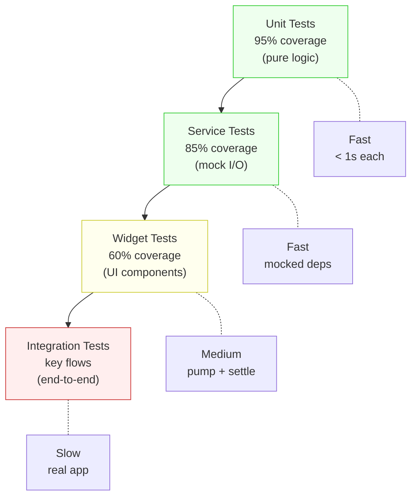

# Blueprint: Testing Strategy

<!-- METADATA — structured for agents, useful for humans
tags:        [testing, unit-test, widget-test, golden-test, integration-test, ci, flutter, dart]
category:    patterns
difficulty:  intermediate
time:        2-3 hours
stack:       [flutter, dart]
-->

> Define testing tiers, coverage targets, and concrete patterns for unit, widget, golden, and integration tests in a Flutter app.

## TL;DR

Structure your tests into four tiers — unit (95%), service (85%), widget (60%), integration (key flows) — each with clear patterns and naming conventions. Use hand-written mocks, `ProviderScope` wrapping, and `fakeAsync` to keep tests fast and deterministic. Golden tests and integration tests run in CI with OS-specific baselines and animation-safe timeouts.

## When to Use

- Starting a new Flutter project and defining the test strategy from day one
- Existing project with low or inconsistent test coverage that needs structure
- CI pipeline needs reliable, parallelizable tests with coverage gates
- When flaky tests are eroding team confidence in the test suite

## Prerequisites

- [ ] A Flutter project with `flutter_test` in `dev_dependencies`
- [ ] Familiarity with `flutter test` CLI and basic `testWidgets` usage
- [ ] CI pipeline (GitHub Actions, GitLab CI, or similar) for automated runs
- [ ] Understanding of Riverpod `ProviderScope` if using Riverpod for state management

## Overview



## Steps

### 1. Define testing tiers and coverage targets

**Why**: Without explicit tiers, teams either over-test UI (slow, brittle) or under-test logic (bugs slip through). Each tier has a different cost/value ratio — invest most in the cheapest, highest-value tier.

| Tier | Target | What it covers | Speed |
|------|--------|---------------|-------|
| Unit | 95% | Pure functions, models, sealed class logic, validators | < 1s |
| Service | 85% | Service methods with mocked I/O, cache chains, error paths | < 1s |
| Widget | 60% | Individual widgets, user interactions, conditional rendering | 1-5s |
| Integration | Key flows | Login, create/edit/delete, navigation, onboarding | 30-120s |

```yaml
# analysis_options.yaml or CI script — enforce coverage gates
# flutter test --coverage
# lcov --summary coverage/lcov.info
# Fail CI if unit coverage < 95%
```

**Expected outcome**: The team has a shared vocabulary for test tiers and knows where to invest effort. Coverage targets are enforced in CI, not just aspirational.

### 2. Unit testing patterns

**Why**: Unit tests are the foundation — they're fast, stable, and catch logic bugs before anything else. Sealed classes deserve exhaustive testing because the compiler won't warn you about missing branches at runtime.

```dart
// test/core/models/amount_test.dart

import 'package:test/test.dart';

void main() {
  group('Amount.format', () {
    test('formats positive with 2 decimals', () {
      expect(Amount(1234.5).format('USD'), r'$1,234.50');
    });

    test('formats zero as $0.00', () {
      expect(Amount(0).format('USD'), r'$0.00');
    });

    test('formats negative with minus sign', () {
      expect(Amount(-99.9).format('USD'), r'-$99.90');
    });
  });

  // Sealed class exhaustive testing — cover every variant
  group('TransactionResult', () {
    test('success carries value', () {
      final result = TransactionResult.success(txn);
      switch (result) {
        case TransactionSuccess(:final transaction):
          expect(transaction, txn);
        case TransactionFailure():
          fail('Expected success');
        case TransactionPending():
          fail('Expected success');
      }
    });

    test('failure carries error message', () {
      final result = TransactionResult.failure('Insufficient funds');
      expect(result, isA<TransactionFailure>());
      expect((result as TransactionFailure).message, 'Insufficient funds');
    });

    test('pending has no value yet', () {
      final result = TransactionResult.pending();
      expect(result, isA<TransactionPending>());
    });
  });

  // Edge cases — the bugs that ship to production
  group('DateRange.contains', () {
    test('inclusive start boundary', () {
      final range = DateRange(start: jan1, end: jan31);
      expect(range.contains(jan1), isTrue);
    });

    test('exclusive end boundary', () {
      final range = DateRange(start: jan1, end: jan31);
      expect(range.contains(jan31), isFalse);
    });

    test('handles leap year Feb 29', () {
      final range = DateRange(start: feb28, end: mar1);
      expect(range.contains(feb29LeapYear), isTrue);
    });
  });
}
```

**Expected outcome**: Pure logic has near-complete coverage. Every sealed class variant has at least one test. Edge cases (boundaries, nulls, empty collections, leap years) are explicitly exercised.

### 3. Widget testing patterns

**Why**: Widget tests verify that UI components render correctly and respond to user interaction. They catch regressions that unit tests can't (wrong widget tree, missing callbacks, broken conditional rendering). The key is wrapping with `ProviderScope` and using `pumpAndSettle` correctly.

```dart
// test/features/transactions/widgets/transaction_tile_test.dart

import 'package:flutter/material.dart';
import 'package:flutter_riverpod/flutter_riverpod.dart';
import 'package:flutter_test/flutter_test.dart';

void main() {
  // Helper — every widget test needs this wrapper
  Widget buildTestWidget(Widget child, {List<Override> overrides = const []}) {
    return ProviderScope(
      overrides: overrides,
      child: MaterialApp(home: Scaffold(body: child)),
    );
  }

  group('TransactionTile', () {
    testWidgets('displays amount and description', (tester) async {
      await tester.pumpWidget(
        buildTestWidget(TransactionTile(transaction: mockTxn)),
      );

      expect(find.text(r'$42.00'), findsOneWidget);
      expect(find.text('Coffee'), findsOneWidget);
    });

    testWidgets('shows category icon', (tester) async {
      await tester.pumpWidget(
        buildTestWidget(TransactionTile(transaction: mockTxn)),
      );

      expect(find.byIcon(Icons.coffee), findsOneWidget);
    });

    // Finding by key — preferred for widgets without visible text
    testWidgets('delete button triggers callback', (tester) async {
      var deleted = false;
      await tester.pumpWidget(
        buildTestWidget(
          TransactionTile(
            transaction: mockTxn,
            onDelete: () => deleted = true,
          ),
        ),
      );

      await tester.tap(find.byKey(const Key('delete-btn')));
      await tester.pumpAndSettle();

      expect(deleted, isTrue);
    });

    // Override providers for isolated widget testing
    testWidgets('shows loading state from provider', (tester) async {
      await tester.pumpWidget(
        buildTestWidget(
          const TransactionListScreen(),
          overrides: [
            transactionListProvider.overrideWith(
              (ref) => const AsyncValue.loading(),
            ),
          ],
        ),
      );

      expect(find.byType(CircularProgressIndicator), findsOneWidget);
    });
  });
}
```

**Expected outcome**: Widget tests are self-contained, always wrapped in `ProviderScope` + `MaterialApp`, and use `find.byKey`, `find.byType`, or `find.text` to locate widgets. Provider overrides isolate the widget from real data.

### 4. Golden tests

**Why**: Golden tests (screenshot comparison) catch visual regressions that are invisible to widget tests — wrong padding, broken layout, color changes. They're powerful but need careful setup to avoid false positives across environments.

```dart
// test/features/dashboard/widgets/balance_card_golden_test.dart

import 'package:flutter/material.dart';
import 'package:flutter_test/flutter_test.dart';

void main() {
  // CRITICAL: Load fonts before golden tests
  setUpAll(() async {
    // Load the app's custom fonts so goldens render correctly
    final fontLoader = FontLoader('Roboto')
      ..addFont(rootBundle.load('assets/fonts/Roboto-Regular.ttf'));
    await fontLoader.load();
  });

  testWidgets('BalanceCard matches golden', (tester) async {
    await tester.pumpWidget(
      MaterialApp(
        theme: appTheme,
        home: Scaffold(
          body: BalanceCard(balance: Amount(1234.56), currency: 'USD'),
        ),
      ),
    );
    await tester.pumpAndSettle();

    await expectLater(
      find.byType(BalanceCard),
      matchesGoldenFile('goldens/balance_card.png'),
    );
  });
}
```

```dart
// flutter_test_config.dart — placed at test/ root for global config

import 'dart:async';
import 'package:flutter_test/flutter_test.dart';

// Tolerate tiny pixel differences between macOS and Linux renders
const _kGoldenTolerance = 0.5 / 100; // 0.5%

Future<void> testExecutable(FutureOr<void> Function() testMain) async {
  if (autoUpdateGoldenFiles) {
    // Running with --update-goldens, no tolerance needed
  } else {
    goldenFileComparator = _TolerantComparator(
      Uri.parse('test/'),
      tolerance: _kGoldenTolerance,
    );
  }
  await testMain();
}
```

Update goldens explicitly and commit them:

```bash
# Generate or update golden files (run on the canonical OS)
flutter test --update-goldens test/features/dashboard/widgets/

# Commit the golden images
git add test/**/goldens/
```

**Expected outcome**: Golden tests catch visual regressions. A `flutter_test_config.dart` at the test root sets a pixel tolerance so minor anti-aliasing differences between macOS and Linux CI don't cause false failures. Goldens are updated explicitly, never auto-updated in CI.

### 5. Integration testing patterns

**Why**: Integration tests verify complete user flows through the real app. They catch bugs that unit and widget tests miss — navigation, deep-link handling, state persistence across screens. They're slow and expensive, so only cover critical paths.

```dart
// integration_test/flows/create_transaction_test.dart

import 'package:flutter_test/flutter_test.dart';
import 'package:integration_test/integration_test.dart';

void main() {
  IntegrationTestWidgetsFlutterBinding.ensureInitialized();

  group('Create transaction flow', () {
    testWidgets('user can create and see a new transaction', (tester) async {
      // Launch the app with a mock backend
      app.main(useMockBackend: true);
      await tester.pumpAndSettle(const Duration(seconds: 5));

      // Navigate to create screen
      await tester.tap(find.byKey(const Key('fab-add')));
      await tester.pumpAndSettle();

      // Fill in the form
      await tester.enterText(
        find.byKey(const Key('amount-field')),
        '42.00',
      );
      await tester.enterText(
        find.byKey(const Key('description-field')),
        'Integration test coffee',
      );
      await tester.tap(find.byKey(const Key('save-btn')));
      await tester.pumpAndSettle(const Duration(seconds: 3));

      // Verify it appears in the list
      expect(find.text('Integration test coffee'), findsOneWidget);
      expect(find.text(r'$42.00'), findsOneWidget);
    });
  });
}
```

```bash
# Run integration tests on a connected device or emulator
flutter test integration_test/

# With Patrol (alternative — supports native interactions)
patrol test --target integration_test/flows/
```

**Expected outcome**: Critical user flows are tested end-to-end. The app launches with a mock backend so tests don't depend on real servers. `pumpAndSettle` includes generous timeouts for CI environments.

### 6. Test organization and naming conventions

**Why**: Consistent structure makes tests discoverable. When a test fails in CI, the file path alone should tell you which source file is broken.

```
lib/
  core/
    models/
      amount.dart
    services/
      market_service.dart
  features/
    transactions/
      widgets/
        transaction_tile.dart

test/                              # Mirror the lib/ structure exactly
  core/
    models/
      amount_test.dart             # Tests for amount.dart
    services/
      market_service_test.dart
  features/
    transactions/
      widgets/
        transaction_tile_test.dart
  helpers/                         # Shared test utilities
    test_factories.dart            # Factory functions for test data
    pump_helpers.dart              # buildTestWidget, pumpApp, etc.

integration_test/
  flows/                           # One file per user flow
    create_transaction_test.dart
    onboarding_test.dart
```

```dart
// test/helpers/test_factories.dart

/// Centralized test data — never hardcode values in individual tests

AppTransaction makeTransaction({
  String id = 'txn-1',
  double amount = 42.0,
  String description = 'Test coffee',
  DateTime? date,
  String category = 'food',
}) {
  return AppTransaction(
    id: id,
    amount: Amount(amount),
    description: description,
    date: date ?? DateTime(2025, 1, 15),
    category: category,
  );
}

/// For lists — generate N unique transactions
List<AppTransaction> makeTransactions(int count) {
  return List.generate(
    count,
    (i) => makeTransaction(id: 'txn-$i', amount: 10.0 * (i + 1)),
  );
}
```

Naming convention for `group` and `test`:

```dart
// Pattern: group = class/function, test = "verb + expected behavior"
group('MarketService.getExchangeRate', () {
  test('returns fresh rate from API on cache miss', () { ... });
  test('returns cached rate when cache is fresh', () { ... });
  test('falls back to stale cache when API fails', () { ... });
  test('throws when no cache and API fails', () { ... });
});
```

**Expected outcome**: Every source file has a matching test file. Test data is generated via factories, not duplicated. Test names read as sentences describing behavior.

### 7. CI integration

**Why**: Tests only protect you if they run on every commit. CI should run tests in parallel, enforce coverage gates, and quarantine flaky tests so they don't block the team.

```yaml
# .github/workflows/test.yml

name: Test
on: [push, pull_request]

jobs:
  unit-and-widget:
    runs-on: ubuntu-latest
    strategy:
      matrix:
        shard: [0, 1, 2, 3]  # 4 parallel shards
    steps:
      - uses: actions/checkout@v4
      - uses: subosito/flutter-action@v2
        with:
          channel: stable

      - name: Run tests (shard ${{ matrix.shard }})
        run: |
          # Collect all test files and split into shards
          ALL_TESTS=$(find test -name '*_test.dart' | sort)
          TOTAL=$(echo "$ALL_TESTS" | wc -l)
          PER_SHARD=$(( (TOTAL + 3) / 4 ))
          SHARD_TESTS=$(echo "$ALL_TESTS" | tail -n +$(( matrix.shard * PER_SHARD + 1 )) | head -n $PER_SHARD)
          flutter test --coverage $SHARD_TESTS

      - name: Upload coverage
        uses: actions/upload-artifact@v4
        with:
          name: coverage-${{ matrix.shard }}
          path: coverage/lcov.info

  coverage-gate:
    needs: unit-and-widget
    runs-on: ubuntu-latest
    steps:
      - name: Merge coverage and check thresholds
        run: |
          # Merge all shard coverage reports
          lcov $(for i in 0 1 2 3; do echo "-a coverage-$i/lcov.info"; done) -o merged.info
          # Enforce minimum coverage
          COVERAGE=$(lcov --summary merged.info 2>&1 | grep 'lines' | grep -o '[0-9.]*%' | tr -d '%')
          echo "Total coverage: $COVERAGE%"
          if (( $(echo "$COVERAGE < 80" | bc -l) )); then
            echo "::error::Coverage $COVERAGE% is below 80% threshold"
            exit 1
          fi

  golden-tests:
    runs-on: ubuntu-latest  # Always Linux — canonical golden environment
    steps:
      - uses: actions/checkout@v4
      - uses: subosito/flutter-action@v2
      - run: flutter test --tags golden

  integration:
    runs-on: ubuntu-latest
    steps:
      - uses: actions/checkout@v4
      - uses: subosito/flutter-action@v2
      - uses: reactivecircus/android-emulator-runner@v2
        with:
          api-level: 33
          script: flutter test integration_test/
```

For flaky test quarantine, tag and isolate known flaky tests:

```dart
// Quarantined — flaky due to animation timing (issue #142)
@Tags(['quarantine'])
testWidgets('complex animation completes', (tester) async { ... });
```

```yaml
# CI runs quarantined tests separately with allow-failure
- name: Quarantined tests (allow failure)
  continue-on-error: true
  run: flutter test --tags quarantine
```

**Expected outcome**: Tests run in parallel across 4 shards. Coverage is merged and gated. Golden tests always run on the same OS. Flaky tests are quarantined so they don't block PRs, but still run so you see when they're fixed.

## Variants

<details>
<summary><strong>Variant: Riverpod-heavy app (providers everywhere)</strong></summary>

When the app uses Riverpod extensively, every widget test needs provider overrides and every service test needs a `ProviderContainer`:

```dart
// test/helpers/pump_helpers.dart

/// Standard test wrapper for Riverpod apps
Widget buildTestApp(Widget child, {List<Override> overrides = const []}) {
  return ProviderScope(
    overrides: overrides,
    child: MaterialApp(
      localizationsDelegates: AppLocalizations.localizationsDelegates,
      home: child,
    ),
  );
}

/// For testing providers in isolation (no widget)
ProviderContainer createTestContainer({List<Override> overrides = const []}) {
  final container = ProviderContainer(overrides: overrides);
  addTearDown(container.dispose);
  return container;
}
```

Use `createTestContainer` for service-level tests that exercise providers without building widgets.

</details>

<details>
<summary><strong>Variant: Patrol for native interaction testing</strong></summary>

When integration tests need to interact with native OS dialogs (permission prompts, share sheets, notifications):

```dart
// integration_test/flows/permission_flow_test.dart

import 'package:patrol/patrol.dart';

void main() {
  patrolTest('grants camera permission and takes photo', ($) async {
    await $.pumpWidgetAndSettle(const MyApp());

    await $.tap(find.byKey(const Key('take-photo-btn')));

    // Patrol can interact with native permission dialogs
    await $.native.grantPermissionWhenInUse();

    await $.pumpAndSettle();
    expect(find.byType(PhotoPreview), findsOneWidget);
  });
}
```

Add `patrol` and `patrol_finders` to `dev_dependencies`. Run with `patrol test` instead of `flutter test`.

</details>

## Gotchas

> **Golden tests fail across OS/CI**: Font rendering differs between macOS, Linux, and Windows. The same widget produces pixel-different screenshots. **Fix**: Generate and commit goldens on a single canonical OS (Linux in CI). Set a pixel tolerance (0.5%) in `flutter_test_config.dart`. Never run `--update-goldens` on a different OS than CI uses.

> **Widget tests hang with Timer/periodic callbacks**: If a widget starts a `Timer.periodic` or uses `Stream.periodic`, `pumpAndSettle` will time out waiting for the app to become idle. **Fix**: Wrap the test body in `fakeAsync` and use `tester.pump(duration)` to advance time manually instead of `pumpAndSettle`.

> **Missing ProviderScope in widget tests**: Forgetting to wrap the test widget in `ProviderScope` produces a cryptic `No ProviderScope found` error at runtime. **Fix**: Always use a `buildTestWidget` helper that includes `ProviderScope` + `MaterialApp`. Never call `tester.pumpWidget(MyWidget())` directly.

> **Integration tests flaky on CI due to animation timing**: Animations that complete in 300ms on a fast machine may take 2s on a CI runner. `pumpAndSettle()` defaults to a 10-second timeout but individual `pump` calls may not wait long enough. **Fix**: Pass an explicit timeout to `pumpAndSettle(const Duration(seconds: 10))` and use `find.byKey` instead of `find.byText` for elements that may not have rendered yet.

> **Test pollution from shared mutable state**: Tests that modify a singleton or static cache can leak state into subsequent tests, causing order-dependent failures. **Fix**: Always create fresh instances in `setUp`. Never rely on `static` or top-level mutable state in test files.

## Checklist

- [ ] Testing tiers defined with explicit coverage targets
- [ ] Unit tests cover all sealed class variants exhaustively
- [ ] Widget tests always wrapped in `ProviderScope` + `MaterialApp`
- [ ] `buildTestWidget` helper exists in `test/helpers/`
- [ ] Test factories centralized in `test/helpers/test_factories.dart`
- [ ] Test file structure mirrors `lib/` directory structure
- [ ] Golden tests use a single canonical OS for baseline images
- [ ] `flutter_test_config.dart` sets pixel tolerance for goldens
- [ ] Integration tests use mock backend, not real servers
- [ ] CI runs test shards in parallel
- [ ] Coverage gate enforced in CI (fails build if below threshold)
- [ ] Flaky tests tagged `@Tags(['quarantine'])` and run with `continue-on-error`
- [ ] No `Timer.periodic` in widget tests without `fakeAsync`

## Artifacts

| Artifact | Location | Description |
|----------|----------|-------------|
| Test helper | `test/helpers/pump_helpers.dart` | `buildTestWidget` and `buildTestApp` wrappers |
| Test factories | `test/helpers/test_factories.dart` | `makeTransaction`, `makeTransactions`, etc. |
| Golden config | `test/flutter_test_config.dart` | Pixel tolerance and font loading for goldens |
| Golden baselines | `test/**/goldens/*.png` | Canonical screenshot baselines (committed) |
| CI workflow | `.github/workflows/test.yml` | Parallel shards, coverage gate, golden + integration jobs |

## References

- [Flutter testing docs](https://docs.flutter.dev/testing) — official guide for unit, widget, and integration tests
- [Service Layer Pattern](service-layer-pattern.md) — hand-written mocks and interface-based testing
- [Patrol](https://patrol.leancode.co/) — native interaction testing for Flutter integration tests
- [Golden Toolkit](https://pub.dev/packages/golden_toolkit) — enhanced golden test utilities
- [Very Good Coverage](https://github.com/VeryGoodOpenSource/very_good_coverage) — GitHub Action for coverage enforcement
