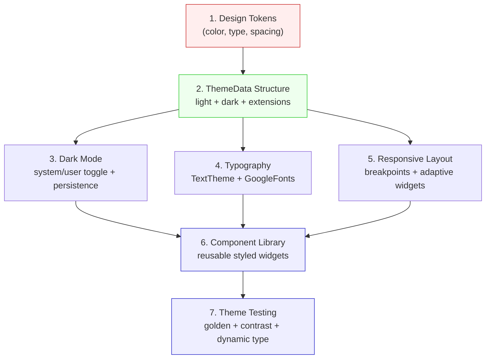

# Blueprint: Theming & Design System

<!-- METADATA — structured for agents, useful for humans
tags:        [theming, material3, dark-mode, responsive, design-system, typography]
category:    patterns
difficulty:  intermediate
time:        2 hours
stack:       [flutter, dart]
-->

> Build a cohesive theming and design system with Material 3 tokens, dark mode, responsive layouts, and reusable components — so every screen stays consistent without hardcoded values.

## TL;DR

A complete theming architecture using Material 3 design tokens, custom `ThemeExtension` for app-specific values, dark/light mode with persistent user preference, a responsive layout system, and a reusable component library. After this blueprint you will have a single source of truth for every color, font, spacing, and breakpoint in your app.

## When to Use

- Starting a new Flutter app and want consistent styling from day one
- Retrofitting an existing app that has hardcoded colors and font sizes scattered across widgets
- Adding dark mode support to an app that only has a light theme
- Building a shared component library across multiple features or packages
- When designers hand off a token-based design system (Figma variables, Material Theme Builder)

## Prerequisites

- [ ] Flutter 3.10+ (for `MediaQuery.sizeOf` and latest Material 3 APIs)
- [ ] `google_fonts` package if using custom typefaces
- [ ] `shared_preferences` or equivalent for persisting theme preference
- [ ] Familiarity with `ThemeData` and `Theme.of(context)`

## Overview



## Steps

### 1. Design token architecture

**Why**: Design tokens are the atomic values (colors, typography scales, spacing, elevation) that define your visual language. Centralizing them means a single change propagates everywhere — no more grep-and-replace across 50 files.

```dart
// lib/theme/tokens.dart

/// Spacing tokens — use instead of raw doubles
abstract final class Spacing {
  static const double xs = 4;
  static const double sm = 8;
  static const double md = 16;
  static const double lg = 24;
  static const double xl = 32;
  static const double xxl = 48;
}

/// Elevation tokens
abstract final class Elevation {
  static const double none = 0;
  static const double low = 1;
  static const double medium = 3;
  static const double high = 6;
}

/// Radii tokens
abstract final class Radii {
  static const double sm = 8;
  static const double md = 12;
  static const double lg = 16;
  static const double full = 999;
}
```

For color tokens, rely on Material 3's `ColorScheme` generated from a seed color rather than defining raw hex values. This gives you 29 harmonized color roles out of the box.

```dart
// Seed-based color scheme — Material 3 handles tonal palettes
final lightColorScheme = ColorScheme.fromSeed(
  seedColor: const Color(0xFF1A6B52), // your brand color
  brightness: Brightness.light,
);
```

**Expected outcome**: A `tokens.dart` file that every widget imports for spacing/elevation/radii, and a seed color that drives the entire color system.

### 2. Theme data structure

**Why**: `ThemeData` is the single object Flutter's widget tree reads for all styling decisions. Building it correctly — with `ColorScheme.fromSeed`, a custom `TextTheme`, and `ThemeExtension` for app-specific tokens — ensures nothing falls through the cracks.

```dart
// lib/theme/app_theme.dart
import 'package:flutter/material.dart';
import 'tokens.dart';

/// Custom tokens that Material 3 doesn't cover
class AppColors extends ThemeExtension<AppColors> {
  const AppColors({
    required this.income,
    required this.expense,
    required this.warning,
    required this.surfaceHighlight,
  });

  final Color income;
  final Color expense;
  final Color warning;
  final Color surfaceHighlight;

  @override
  AppColors copyWith({
    Color? income,
    Color? expense,
    Color? warning,
    Color? surfaceHighlight,
  }) {
    return AppColors(
      income: income ?? this.income,
      expense: expense ?? this.expense,
      warning: warning ?? this.warning,
      surfaceHighlight: surfaceHighlight ?? this.surfaceHighlight,
    );
  }

  @override
  AppColors lerp(covariant AppColors? other, double t) {
    if (other is! AppColors) return this;
    return AppColors(
      income: Color.lerp(income, other.income, t)!,
      expense: Color.lerp(expense, other.expense, t)!,
      warning: Color.lerp(warning, other.warning, t)!,
      surfaceHighlight: Color.lerp(surfaceHighlight, other.surfaceHighlight, t)!,
    );
  }
}

const _lightAppColors = AppColors(
  income: Color(0xFF2E7D32),
  expense: Color(0xFFC62828),
  warning: Color(0xFFF9A825),
  surfaceHighlight: Color(0xFFF5F5F5),
);

const _darkAppColors = AppColors(
  income: Color(0xFF81C784),
  expense: Color(0xFFEF9A9A),
  warning: Color(0xFFFFF176),
  surfaceHighlight: Color(0xFF2C2C2C),
);

ThemeData buildLightTheme() {
  final colorScheme = ColorScheme.fromSeed(
    seedColor: const Color(0xFF1A6B52),
    brightness: Brightness.light,
  );
  return ThemeData(
    useMaterial3: true,
    colorScheme: colorScheme,
    extensions: const [_lightAppColors],
  );
}

ThemeData buildDarkTheme() {
  final colorScheme = ColorScheme.fromSeed(
    seedColor: const Color(0xFF1A6B52),
    brightness: Brightness.dark,
  );
  return ThemeData(
    useMaterial3: true,
    colorScheme: colorScheme,
    extensions: const [_darkAppColors],
  );
}
```

Access custom tokens anywhere:

```dart
final appColors = Theme.of(context).extension<AppColors>()!;
Text('Income', style: TextStyle(color: appColors.income));
```

**Expected outcome**: Two complete `ThemeData` objects (light and dark), each carrying Material 3 color schemes plus your custom `AppColors` extension.

### 3. Dark mode implementation

**Why**: Users expect dark mode. Implementing it correctly means three things: separate color schemes that pass contrast checks, a toggle that respects both system preference and explicit user choice, and persistence so the choice survives app restarts.

```dart
// lib/theme/theme_controller.dart
import 'package:flutter/material.dart';
import 'package:shared_preferences/shared_preferences.dart';

class ThemeController extends ChangeNotifier {
  ThemeController(this._prefs) {
    _mode = ThemeMode.values[_prefs.getInt('themeMode') ?? 0];
  }

  final SharedPreferences _prefs;
  late ThemeMode _mode;

  ThemeMode get mode => _mode;

  Future<void> setMode(ThemeMode mode) async {
    _mode = mode;
    await _prefs.setInt('themeMode', mode.index);
    notifyListeners();
  }

  /// Cycle: system → light → dark → system
  Future<void> cycle() async {
    final next = ThemeMode.values[(_mode.index + 1) % ThemeMode.values.length];
    await setMode(next);
  }
}
```

Wire it into `MaterialApp`:

```dart
// In your root widget (or via Riverpod/provider of choice)
MaterialApp(
  theme: buildLightTheme(),
  darkTheme: buildDarkTheme(),
  themeMode: themeController.mode, // system | light | dark
  // ...
);
```

**Expected outcome**: Tapping a theme toggle cycles through system/light/dark, the preference persists across cold restarts, and animated transitions blend smoothly via `ThemeExtension.lerp`.

### 4. Typography system

**Why**: Consistent typography improves readability and reinforces hierarchy. Material 3's `TextTheme` provides 15 named styles (displayLarge through labelSmall). Customizing it with your brand typeface and ensuring accessibility-friendly scaling prevents ad-hoc `TextStyle` literals.

```dart
// lib/theme/typography.dart
import 'package:flutter/material.dart';
import 'package:google_fonts/google_fonts.dart';

TextTheme buildTextTheme(TextTheme base) {
  return GoogleFonts.interTextTheme(base).copyWith(
    // Override specific styles if needed
    headlineLarge: GoogleFonts.inter(
      fontSize: 32,
      fontWeight: FontWeight.w700,
      letterSpacing: -0.5,
    ),
    // bodyLarge, bodyMedium, bodySmall — NOT bodyText1/bodyText2 (deprecated)
  );
}
```

Apply to both themes:

```dart
ThemeData buildLightTheme() {
  final colorScheme = ColorScheme.fromSeed(/* ... */);
  final textTheme = buildTextTheme(ThemeData.light().textTheme);
  return ThemeData(
    useMaterial3: true,
    colorScheme: colorScheme,
    textTheme: textTheme,
    extensions: const [_lightAppColors],
  );
}
```

Always use named styles from the theme, never raw font sizes:

```dart
// ✅ Correct — scales with accessibility settings
Text('Title', style: Theme.of(context).textTheme.headlineMedium);

// ❌ Wrong — ignores user font scale, breaks large text mode
Text('Title', style: TextStyle(fontSize: 24, fontWeight: FontWeight.bold));
```

**Expected outcome**: All text uses named `TextTheme` styles, Google Fonts load correctly, and text scales proportionally when users change system font size.

### 5. Responsive layout

**Why**: Flutter runs on phones, tablets, desktops, and web. A responsive layout system with explicit breakpoints ensures your UI adapts without duplicating entire screens.

```dart
// lib/theme/breakpoints.dart

/// Breakpoint tokens — match Material 3 adaptive guidelines
abstract final class Breakpoints {
  static const double compact = 600;   // phone
  static const double medium = 840;    // tablet portrait
  static const double expanded = 1200; // tablet landscape / desktop
}

enum WindowSize { compact, medium, expanded }

WindowSize windowSizeOf(BuildContext context) {
  // sizeOf avoids full rebuild — only triggers when size changes
  final width = MediaQuery.sizeOf(context).width;
  if (width < Breakpoints.compact) return WindowSize.compact;
  if (width < Breakpoints.medium) return WindowSize.medium;
  return WindowSize.expanded;
}
```

Use `LayoutBuilder` for component-level responsiveness and `MediaQuery.sizeOf` for page-level decisions:

```dart
// Page-level: pick layout based on window size
class DashboardPage extends StatelessWidget {
  const DashboardPage({super.key});

  @override
  Widget build(BuildContext context) {
    return switch (windowSizeOf(context)) {
      WindowSize.compact  => const DashboardPhoneLayout(),
      WindowSize.medium   => const DashboardTabletLayout(),
      WindowSize.expanded => const DashboardDesktopLayout(),
    };
  }
}

// Component-level: adapt within a widget's constraints
class TransactionCard extends StatelessWidget {
  @override
  Widget build(BuildContext context) {
    return LayoutBuilder(
      builder: (context, constraints) {
        final isWide = constraints.maxWidth > 400;
        return isWide
            ? Row(children: [_icon(), _details(), _amount()])
            : Column(children: [_header(), _amount()]);
      },
    );
  }
}
```

**Expected outcome**: The app adapts between phone, tablet, and desktop layouts using explicit breakpoints. No layout overflow warnings on any supported screen size.

### 6. Component library

**Why**: Reusable styled widgets enforce consistency and reduce duplication. Wrapping common patterns (cards, buttons, section headers) with semantic names means designers and developers speak the same language.

```dart
// lib/ui/components/app_card.dart
import 'package:flutter/material.dart';
import '../../theme/tokens.dart';

class AppCard extends StatelessWidget {
  const AppCard({
    super.key,
    required this.child,
    this.padding = const EdgeInsets.all(Spacing.md),
    this.elevation = Elevation.low,
  });

  final Widget child;
  final EdgeInsets padding;
  final double elevation;

  @override
  Widget build(BuildContext context) {
    final colors = Theme.of(context).colorScheme;
    return Card(
      elevation: elevation,
      color: colors.surfaceContainerLow,
      shape: RoundedRectangleBorder(
        borderRadius: BorderRadius.circular(Radii.md),
      ),
      child: Padding(padding: padding, child: child),
    );
  }
}
```

```dart
// lib/ui/components/section_header.dart
class SectionHeader extends StatelessWidget {
  const SectionHeader(this.title, {super.key, this.action});

  final String title;
  final Widget? action;

  @override
  Widget build(BuildContext context) {
    return Padding(
      padding: const EdgeInsets.symmetric(
        horizontal: Spacing.md,
        vertical: Spacing.sm,
      ),
      child: Row(
        mainAxisAlignment: MainAxisAlignment.spaceBetween,
        children: [
          Text(title, style: Theme.of(context).textTheme.titleMedium),
          if (action != null) action!,
        ],
      ),
    );
  }
}
```

**Expected outcome**: A `lib/ui/components/` directory with semantic widgets that only reference theme tokens — zero hardcoded colors, sizes, or fonts.

### 7. Theme testing

**Why**: Themes are invisible until they break — a missing extension crashes at runtime, poor contrast fails accessibility audits, and large text mode overflows layouts. Automated tests catch these before users do.

```dart
// test/theme/theme_test.dart
import 'package:flutter/material.dart';
import 'package:flutter_test/flutter_test.dart';

void main() {
  group('ThemeData completeness', () {
    test('light theme has AppColors extension', () {
      final theme = buildLightTheme();
      expect(theme.extension<AppColors>(), isNotNull);
    });

    test('dark theme has AppColors extension', () {
      final theme = buildDarkTheme();
      expect(theme.extension<AppColors>(), isNotNull);
    });
  });

  group('Contrast ratios', () {
    test('primary text on surface meets WCAG AA (4.5:1)', () {
      final scheme = buildLightTheme().colorScheme;
      final ratio = _contrastRatio(scheme.onSurface, scheme.surface);
      expect(ratio, greaterThanOrEqualTo(4.5));
    });

    test('primary text on surface meets WCAG AA in dark mode', () {
      final scheme = buildDarkTheme().colorScheme;
      final ratio = _contrastRatio(scheme.onSurface, scheme.surface);
      expect(ratio, greaterThanOrEqualTo(4.5));
    });
  });
}

/// Relative luminance contrast ratio per WCAG 2.1
double _contrastRatio(Color a, Color b) {
  final la = a.computeLuminance();
  final lb = b.computeLuminance();
  final lighter = la > lb ? la : lb;
  final darker = la > lb ? lb : la;
  return (lighter + 0.05) / (darker + 0.05);
}
```

Golden tests for visual regression:

```dart
// test/theme/golden_test.dart
testWidgets('AppCard renders correctly in light theme', (tester) async {
  await tester.pumpWidget(
    MaterialApp(
      theme: buildLightTheme(),
      home: const Scaffold(
        body: Center(child: AppCard(child: Text('Hello'))),
      ),
    ),
  );
  await expectLater(
    find.byType(AppCard),
    matchesGoldenFile('goldens/app_card_light.png'),
  );
});

testWidgets('AppCard renders correctly in dark theme', (tester) async {
  await tester.pumpWidget(
    MaterialApp(
      theme: buildDarkTheme(),
      home: const Scaffold(
        body: Center(child: AppCard(child: Text('Hello'))),
      ),
    ),
  );
  await expectLater(
    find.byType(AppCard),
    matchesGoldenFile('goldens/app_card_dark.png'),
  );
});
```

Dynamic type testing — pump the widget with a large `textScaleFactor` and verify no overflow:

```dart
testWidgets('SectionHeader survives 2x text scale', (tester) async {
  tester.view.platformDispatcher.textScaleFactorTestValue = 2.0;
  addTearDown(() {
    tester.view.platformDispatcher.textScaleFactorTestValue = 1.0;
  });

  await tester.pumpWidget(
    MaterialApp(
      theme: buildLightTheme(),
      home: const Scaffold(
        body: SectionHeader('Recent Transactions'),
      ),
    ),
  );

  // No overflow error = pass
  expect(tester.takeException(), isNull);
});
```

**Expected outcome**: CI catches missing theme extensions, WCAG contrast failures, visual regressions via goldens, and layout overflow under large text scaling.

## Variants

<details>
<summary><strong>Variant: Dynamic color (Material You / Android 12+)</strong></summary>

On Android 12+, the system provides a user-selected color palette. Use the `dynamic_color` package to adopt it while falling back to your seed color on other platforms.

```dart
import 'package:dynamic_color/dynamic_color.dart';

class MyApp extends StatelessWidget {
  @override
  Widget build(BuildContext context) {
    return DynamicColorBuilder(
      builder: (lightDynamic, darkDynamic) {
        final lightScheme = lightDynamic ?? ColorScheme.fromSeed(
          seedColor: const Color(0xFF1A6B52),
        );
        final darkScheme = darkDynamic ?? ColorScheme.fromSeed(
          seedColor: const Color(0xFF1A6B52),
          brightness: Brightness.dark,
        );

        return MaterialApp(
          theme: buildThemeFromScheme(lightScheme),
          darkTheme: buildThemeFromScheme(darkScheme),
          themeMode: themeController.mode,
          // ...
        );
      },
    );
  }
}
```

</details>

<details>
<summary><strong>Variant: Multi-brand / white-label theming</strong></summary>

When the same app ships under multiple brands, parameterize the seed color and custom extensions:

```dart
class BrandConfig {
  const BrandConfig({
    required this.seedColor,
    required this.appColors,
    required this.fontFamily,
  });

  final Color seedColor;
  final AppColors appColors;
  final String fontFamily;
}

const brandA = BrandConfig(
  seedColor: Color(0xFF1A6B52),
  appColors: AppColors(/* ... */),
  fontFamily: 'Inter',
);

const brandB = BrandConfig(
  seedColor: Color(0xFF1565C0),
  appColors: AppColors(/* ... */),
  fontFamily: 'Roboto',
);
```

Inject `BrandConfig` at startup and derive all theme objects from it.

</details>

## Gotchas

> **Hardcoded colors bypass theme**: Searching for `Color(0x` in your codebase reveals values that won't respond to dark mode or brand changes. **Fix**: Replace every instance with `Theme.of(context).colorScheme.xxx` or `Theme.of(context).extension<AppColors>()!.xxx`. Add a lint rule or grep check in CI: `grep -r "Color(0x" lib/ && exit 1`.

> **Deprecated TextTheme names**: `TextTheme.bodyText1`, `bodyText2`, `headline6`, etc. were removed in Material 3. Using them causes compile errors on newer Flutter versions. **Fix**: Use the new names — `bodyLarge`, `bodyMedium`, `bodySmall`, `titleLarge`, etc. See the [migration table](https://docs.flutter.dev/release/breaking-changes/material-3-default).

> **ThemeExtension null at runtime**: If you add `AppColors` to your light theme but forget to add it to the dark theme, `Theme.of(context).extension<AppColors>()` returns `null` in dark mode — crashing on the `!` operator. **Fix**: Always register custom extensions in both `buildLightTheme()` and `buildDarkTheme()`. Write a unit test that asserts both themes have every extension (see Step 7).

> **MediaQuery.of triggers full rebuild**: `MediaQuery.of(context)` listens to all media query changes (size, padding, text scale, orientation). If you only need size, this causes unnecessary rebuilds on every keyboard open/close. **Fix**: Use `MediaQuery.sizeOf(context)` (Flutter 3.10+) to listen only to size changes. Similarly, use `MediaQuery.paddingOf(context)` for safe area insets.

> **Google Fonts network fetch in production**: By default, `google_fonts` downloads fonts at runtime, which fails offline and adds latency. **Fix**: Bundle fonts as assets and set `GoogleFonts.config.allowRuntimeFetching = false` in `main.dart`. Run `dart run google_fonts:generator` to prefetch.

## Checklist

- [ ] All colors come from `ColorScheme` or `ThemeExtension` — zero `Color(0x...)` literals in `lib/`
- [ ] `ThemeData` built with `useMaterial3: true` and `ColorScheme.fromSeed`
- [ ] Custom `ThemeExtension` registered in both light and dark `ThemeData`
- [ ] Dark mode toggle persists to `SharedPreferences` and respects system default
- [ ] `TextTheme` uses Material 3 naming (`bodyLarge`, not `bodyText1`)
- [ ] All text widgets use `Theme.of(context).textTheme.*` — no inline `TextStyle` with hardcoded sizes
- [ ] Responsive breakpoints defined as constants, used via `MediaQuery.sizeOf` (not `.of`)
- [ ] Component library widgets reference only tokens and theme — no magic numbers
- [ ] Unit tests verify both themes have all extensions and meet WCAG AA contrast
- [ ] Golden tests cover key components in both light and dark themes
- [ ] Dynamic type test at 2x scale passes without overflow

## Artifacts

| Artifact | Location | Description |
|----------|----------|-------------|
| Design tokens | `lib/theme/tokens.dart` | Spacing, elevation, radii constants |
| Theme builder | `lib/theme/app_theme.dart` | `buildLightTheme()` / `buildDarkTheme()` with extensions |
| Theme controller | `lib/theme/theme_controller.dart` | Dark mode toggle with persistence |
| Typography | `lib/theme/typography.dart` | `buildTextTheme()` with Google Fonts |
| Breakpoints | `lib/theme/breakpoints.dart` | Responsive window size helper |
| Component library | `lib/ui/components/` | Reusable themed widgets (AppCard, SectionHeader, etc.) |
| Theme tests | `test/theme/` | Extension completeness, contrast ratio, golden, dynamic type |

## References

- [Material 3 Design Tokens](https://m3.material.io/foundations/design-tokens) — official token taxonomy
- [Flutter ThemeExtension docs](https://api.flutter.dev/flutter/material/ThemeExtension-class.html) — custom theme data pattern
- [ColorScheme.fromSeed](https://api.flutter.dev/flutter/material/ColorScheme/ColorScheme.fromSeed.html) — tonal palette generation
- [Material 3 migration guide](https://docs.flutter.dev/release/breaking-changes/material-3-default) — TextTheme renaming table
- [MediaQuery.sizeOf](https://api.flutter.dev/flutter/widgets/MediaQuery/sizeOf.html) — performance-optimized size reads
- [google_fonts package](https://pub.dev/packages/google_fonts) — bundling and runtime fetching config
- [WCAG 2.1 Contrast](https://www.w3.org/WAI/WCAG21/Understanding/contrast-minimum.html) — 4.5:1 AA requirement
