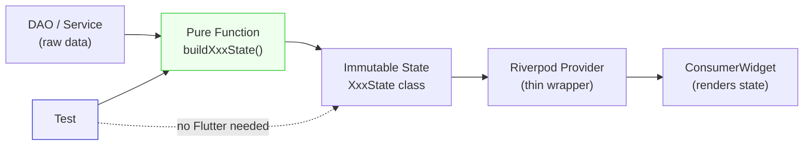

# Blueprint: ViewModel Pure Functions

<!-- METADATA — structured for agents, useful for humans
tags:        [viewmodel, flutter, dart, state-management, testing, pure-functions]
category:    patterns
difficulty:  intermediate
time:        30 min
stack:       [flutter, dart, riverpod]
-->

> Build ViewModels as pure top-level functions with immutable state — testable with plain Dart, no Flutter or ProviderContainer needed.

## TL;DR

Instead of putting business logic inside Riverpod notifiers or StatefulWidgets, extract it into **pure top-level functions** that take data in and return an immutable state object. The Riverpod provider becomes a thin wrapper that fetches data and calls the pure function. Tests are plain Dart — no widgets, no ProviderContainer.

## When to Use

- Building a screen that aggregates data from multiple sources (DAOs, services)
- When you want to test business logic without Flutter test infrastructure
- When multiple screens share the same derived data (e.g. `TransactionTile`)
- Migrating from fat StatefulWidgets to a testable architecture

## Prerequisites

- [ ] Familiarity with Dart immutable classes (final fields, const constructors)
- [ ] A data layer (DAO, repository, or service) that provides raw data
- [ ] `flutter_riverpod` for the thin provider wrapper (optional — pattern works without Riverpod)

## Overview



## Steps

### 1. Define the immutable state class

**Why**: A single object that holds everything the UI needs to render. Immutable = no accidental mutation, easy equality checks, predictable rebuilds.

```dart
// lib/features/dashboard/dashboard_state.dart

class DashboardState {
  const DashboardState({
    required this.netBalance,
    required this.monthlyIncome,
    required this.monthlyExpenses,
    required this.recentTransactions,
    required this.topCategories,
  });

  final Money netBalance;
  final Money monthlyIncome;
  final Money monthlyExpenses;
  final List<TransactionTile> recentTransactions;
  final List<CategoryRank> topCategories;
}
```

**Expected outcome**: A clean, self-contained data class that the UI can render without any transformation.

### 2. Define shared value objects

**Why**: Multiple VMs often need the same display-ready objects. Extract them as reusable value objects to avoid duplication.

```dart
// lib/features/shared/transaction_tile.dart

/// Pre-formatted for display — no business logic in the widget.
class TransactionTile {
  const TransactionTile({
    required this.id,
    required this.title,
    required this.amount,
    required this.categoryIcon,
    required this.dayLabel,
  });

  final String id;
  final String title;
  final Money amount;
  final String categoryIcon;
  final String dayLabel; // "Today", "Yesterday", "15 Mar"
}
```

```dart
// lib/features/shared/category_rank.dart

class CategoryRank {
  const CategoryRank({
    required this.name,
    required this.icon,
    required this.total,
    required this.percentage,
  });

  final String name;
  final String icon;
  final Money total;
  final double percentage;
}
```

**Expected outcome**: Value objects reused across DashboardVM, TransactionListVM, etc.

### 3. Write the pure function

**Why**: This is where all business logic lives. It takes raw data as parameters and returns the state. No `ref`, no `context`, no I/O. Pure input → pure output.

```dart
// lib/features/dashboard/dashboard_vm.dart

DashboardState buildDashboardState({
  required List<AppTransaction> transactions,
  required List<Category> categories,
  required List<Account> accounts,
  required AppLocalizations l10n,
}) {
  final now = DateTime.now();
  final monthStart = DateTime(now.year, now.month);

  final monthTxns = transactions.where(
    (t) => t.date.isAfter(monthStart),
  );

  final income = monthTxns
      .where((t) => t.type == TransactionType.income)
      .fold(Money.zero, (sum, t) => sum + t.amount);

  final expenses = monthTxns
      .where((t) => t.type == TransactionType.expense)
      .fold(Money.zero, (sum, t) => sum + t.amount);

  return DashboardState(
    netBalance: accounts.fold(Money.zero, (sum, a) => sum + a.balance),
    monthlyIncome: income,
    monthlyExpenses: expenses,
    recentTransactions: transactions
        .take(5)
        .map((t) => t.toTile(l10n))
        .toList(),
    topCategories: _rankCategories(monthTxns, categories),
  );
}
```

**Expected outcome**: A function you can call from a test with fake data and assert the result — no setup, no mocking frameworks.

### 4. Add the thin Riverpod wrapper

**Why**: The provider's only job is to fetch data from DAOs and call the pure function. It's the I/O boundary — keep it as thin as possible.

```dart
// lib/features/dashboard/dashboard_provider.dart

@riverpod
Future<DashboardState> dashboardState(DashboardStateRef ref) async {
  final db = ref.watch(userDatabaseProvider);
  final l10n = ref.watch(l10nProvider);

  final transactions = await db.transactionDao.getAll();
  final categories = await db.categoryDao.getAll();
  final accounts = await db.accountDao.getAll();

  return buildDashboardState(
    transactions: transactions,
    categories: categories,
    accounts: accounts,
    l10n: l10n,
  );
}
```

**Expected outcome**: The provider is 10-15 lines. All logic is in the pure function.

### 5. Test with plain Dart

**Why**: No `WidgetTester`, no `ProviderContainer`, no `pumpWidget`. Just call the function and assert.

```dart
// test/features/dashboard/dashboard_vm_test.dart

import 'package:flutter_test/flutter_test.dart';

void main() {
  test('net balance sums all accounts', () {
    final state = buildDashboardState(
      transactions: [],
      categories: [],
      accounts: [
        Account(id: '1', name: 'Cash', balance: Money(100)),
        Account(id: '2', name: 'Bank', balance: Money(500)),
      ],
      l10n: FakeLocalizations(),
    );

    expect(state.netBalance, Money(600));
  });

  test('monthly expenses only count current month', () {
    final state = buildDashboardState(
      transactions: [
        fakeExpense(amount: 50, date: DateTime.now()),
        fakeExpense(amount: 30, date: DateTime.now().subtract(Duration(days: 60))),
      ],
      categories: [],
      accounts: [],
      l10n: FakeLocalizations(),
    );

    expect(state.monthlyExpenses, Money(50)); // old expense excluded
  });
}
```

**Expected outcome**: Tests run in milliseconds, no Flutter dependency.

## Variants

<details>
<summary><strong>Variant: dayLabel helper shared across VMs</strong></summary>

When multiple VMs need human-friendly date labels ("Today", "Yesterday", "15 Mar"), extract a shared helper:

```dart
// lib/features/shared/day_label.dart

String dayLabel(DateTime date, AppLocalizations l10n) {
  final now = DateTime.now();
  final today = DateTime(now.year, now.month, now.day);
  final d = DateTime(date.year, date.month, date.day);

  if (d == today) return l10n.today;
  if (d == today.subtract(const Duration(days: 1))) return l10n.yesterday;
  return DateFormat.MMMd().format(date);
}
```

Used by both `TransactionListVM` and `DashboardVM` via `toTile()`.

</details>

<details>
<summary><strong>Variant: toTile() mapper on the model</strong></summary>

Add an extension or method on the raw model to convert to the display VO:

```dart
extension TransactionMapping on AppTransaction {
  TransactionTile toTile(AppLocalizations l10n) => TransactionTile(
    id: id,
    title: description,
    amount: signedAmount,
    categoryIcon: category?.icon ?? '📦',
    dayLabel: dayLabel(date, l10n),
  );
}
```

This keeps the mapping close to the model and DRY across VMs.

</details>

## Gotchas

> **Passing l10n to a pure function**: `AppLocalizations` depends on `BuildContext` — you can't access it in a pure function directly. **Fix**: Pass `l10n` as a parameter from the provider, or extract the strings you need into a simple data class.

> **DateTime.now() makes tests flaky**: If the pure function calls `DateTime.now()` internally, tests that run near midnight may break. **Fix**: Accept a `DateTime now` parameter with a default of `DateTime.now()` — tests pass a fixed date.

> **Large state objects**: If the state holds lists of hundreds of items, rebuilds can be expensive. **Fix**: Use `select` in the widget to watch only the fields it needs: `ref.watch(dashboardProvider.select((s) => s.netBalance))`.

## Checklist

- [ ] Business logic is in a pure top-level function, not in a Notifier or Widget
- [ ] State class has all fields `final` and a `const` constructor
- [ ] Shared value objects (tiles, ranks) are extracted and reused across VMs
- [ ] Pure function takes all data as parameters — no `ref`, no `context`, no I/O
- [ ] Riverpod provider is a thin wrapper (< 20 lines): fetch data → call pure function
- [ ] Tests use plain `flutter_test`, no `WidgetTester` or `ProviderContainer`
- [ ] `DateTime.now()` is injectable for deterministic tests
- [ ] Localized strings are passed as parameter, not accessed via `context`

## Artifacts

| Artifact | Location | Description |
|----------|----------|-------------|
| State class | `lib/features/<name>/<name>_state.dart` | Immutable state with all display-ready fields |
| Pure function | `lib/features/<name>/<name>_vm.dart` | `buildXxxState()` — all business logic |
| Shared VOs | `lib/features/shared/` | `TransactionTile`, `CategoryRank`, etc. |
| Provider | `lib/features/<name>/<name>_provider.dart` | Thin wrapper: fetch + call |
| Tests | `test/features/<name>/<name>_vm_test.dart` | Plain Dart tests |

## References

- [ViewModel pattern in Budget (Tier 7)](# ) — original pattern note from Budget project
- [Riverpod Provider Wiring](riverpod-provider-wiring.md) — how to wire the thin provider wrapper
- [AsyncNotifier Lifecycle](async-notifier-lifecycle.md) — when you need mutating state (settings, forms)
- [Flutter UI Gotchas](flutter-ui-gotchas.md) — common UI traps when rendering state
