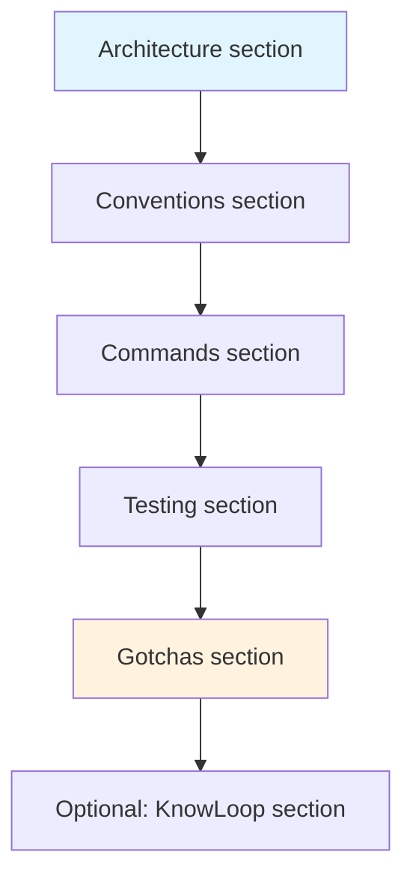

# Blueprint: CLAUDE.md Conventions

<!--
tags:        [claude-code, ai-assisted, conventions, documentation, project-setup]
category:    project-setup
difficulty:  beginner
time:        30 min
stack:       []
-->

> How to write an effective CLAUDE.md that gives AI assistants the right context to work on your project.

## TL;DR

A `CLAUDE.md` at your project root tells AI coding assistants (Claude Code, etc.) your project's architecture, conventions, and commands. It's the difference between an agent that fights your codebase and one that works with it.

## When to Use

- Any project where you use AI-assisted development
- When onboarding new contributors (humans benefit from it too)
- When **not** to use: throwaway scripts, one-file projects

## Prerequisites

- [ ] Project exists with some conventions already in place
- [ ] You know your stack, testing approach, and git workflow

## Overview



## Steps

### 1. Start with the architecture overview

**Why**: The agent needs to understand the project structure before touching any code. Without this, it will guess — and guess wrong.

```markdown
## Architecture
- Clean architecture: core/ → features/ → shared/ → main.dart
- State management: Riverpod (providers in each feature folder)
- Database: Drift (SQLite), tables in core/database/
- Navigation: GoRouter, routes defined in core/routing/
```

**Key rules**:
- Name the actual folders and files, don't be abstract
- State the dependency direction ("core never imports features")
- Mention code generation tools if any (build_runner, freezed, drift)

**Expected outcome**: An agent can answer "where does X go?" without searching.

### 2. Define conventions

**Why**: Without explicit rules, agents default to their training data — which may not match your style.

```markdown
## Conventions
- Language: English for code, comments, and commits
- Commits: conventional commits (feat/fix/docs/refactor/test/chore/ci)
- Branches: feature/, fix/, docs/, refactor/, chore/
- PRs: < 500 lines, atomic commits < 300 lines
- Naming: snake_case for files, PascalCase for classes, camelCase for variables
- Imports: relative within lib/, package imports for external deps
```

**What to include**:
- Anything you'd correct in a code review
- Anything that differs from "standard" conventions
- File naming patterns specific to your project

**Expected outcome**: Agent-written code passes your linter and review on first try.

### 3. List essential commands

**Why**: Agents need to run builds, tests, and generators. Don't make them guess the commands.

```markdown
## Commands
- `flutter run` — run the app
- `flutter test` — run all tests
- `flutter test --coverage` — run tests with coverage report
- `dart run build_runner build` — generate code (Drift, Freezed)
- `dart fix --apply` — apply lint fixes
- `flutter analyze` — static analysis
```

**Key rules**:
- Only include commands the agent will actually use
- Add flags that matter (e.g., `--delete-conflicting-outputs` for build_runner)
- If a command requires setup first, say so

**Expected outcome**: Agent can build and test without asking.

### 4. Describe the testing approach

**Why**: Agents write better tests when they know the expected strategy and coverage targets.

```markdown
## Testing
- TDD for models and DAOs (Tier 0-1)
- Test-after for services and ViewModels (Tier 2-3)
- Test-with for bug fixes at any tier
- Coverage targets: models 95%, services 85%, VMs 80%, widgets 60%
- Use `CorpusDatabase.forTesting()` for in-memory DB tests
- Test files mirror lib/ structure: lib/core/models/foo.dart → test/core/models/foo_test.dart
```

**Expected outcome**: Agent writes tests at the right level with the right approach.

### 5. Document gotchas

**Why**: This is the highest-value section. It prevents the agent from hitting the same walls you already hit.

```markdown
## Gotchas
- NEVER use `getSuttaById()` for lookups — use `getSutta()` (queries sutta_uid, not primary key id)
- `Migrator.addColumn()` crashes if column already exists — wrap in try/catch or check first
- EN corpus has TWO version numbers that must stay in sync: `_kCorpusAssetVersion` and manifest version
- All checkout steps in GitHub Actions MUST include `lfs: true` (corpus.db is in LFS)
```

**What qualifies as a gotcha**:
- Anything that cost you > 30 min debugging
- Silent failures (code runs but produces wrong results)
- Non-obvious ordering dependencies
- Things that work locally but break in CI

**Expected outcome**: Agent avoids your past mistakes.

### 6. (Optional) Add KnowLoop integration rules

**Why**: If you use KnowLoop, the agent needs to know the workflow.

```markdown
## KnowLoop
- Warm-up: always check active plans and notes at session start
- Every code change must be linked to a plan and task
- Create notes for every discovery (gotchas, patterns, guidelines)
- Link commits to tasks: commit → link_to_task
- Implementation order follows plan waves (topological sort)
```

**Expected outcome**: Agent follows your project management workflow.

## Variants

<details>
<summary><strong>Variant: Rust / Backend project</strong></summary>

Replace Flutter-specific sections with:

```markdown
## Architecture
- Workspace: crates/core, crates/api, crates/cli
- Async runtime: Tokio
- Database: SQLx with migrations in migrations/

## Commands
- `cargo build` — compile
- `cargo test` — run tests
- `cargo clippy` — lints
- `sqlx migrate run` — apply DB migrations

## Gotchas
- All SQL queries are checked at compile time (sqlx). Run `cargo sqlx prepare` before CI.
- UTF-8 byte slicing panics — always use char_indices() for string manipulation.
```

</details>

<details>
<summary><strong>Variant: Monorepo</strong></summary>

Add a top-level map:

```markdown
## Monorepo Structure
- `packages/core/` — shared models and utilities
- `packages/app/` — Flutter mobile app
- `packages/api/` — backend API
- `packages/shared/` — shared code between app and api

Each package has its own README. This CLAUDE.md covers cross-package conventions only.
```

</details>

## Gotchas

> **Don't dump your entire architecture doc**: CLAUDE.md should be concise — 50-100 lines. It's a quick-reference, not a wiki. Link to detailed docs if needed.

> **Keep it updated**: A stale CLAUDE.md is worse than none. When conventions change, update CLAUDE.md in the same PR.

> **Gotchas section is king**: If you only write one section well, make it this one. Agents are good at figuring out architecture from code — they're bad at knowing your project's traps.

## Checklist

- [ ] Architecture section names real folders and files
- [ ] Conventions cover everything you'd flag in code review
- [ ] Commands section is copy-pasteable
- [ ] Testing strategy includes approach per tier
- [ ] Gotchas section has at least 3 entries from real experience
- [ ] File is < 100 lines (concise)
- [ ] Located at project root as `CLAUDE.md`

## Artifacts

| Artifact | Location | Description |
|----------|----------|-------------|
| AI context file | `CLAUDE.md` | Project conventions and context for AI assistants |

## References

- [Claude Code documentation](https://docs.anthropic.com/en/docs/claude-code)
- [Flutter Project Kickoff](flutter-project-kickoff.md) — companion blueprint
