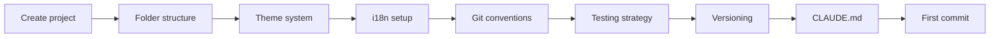
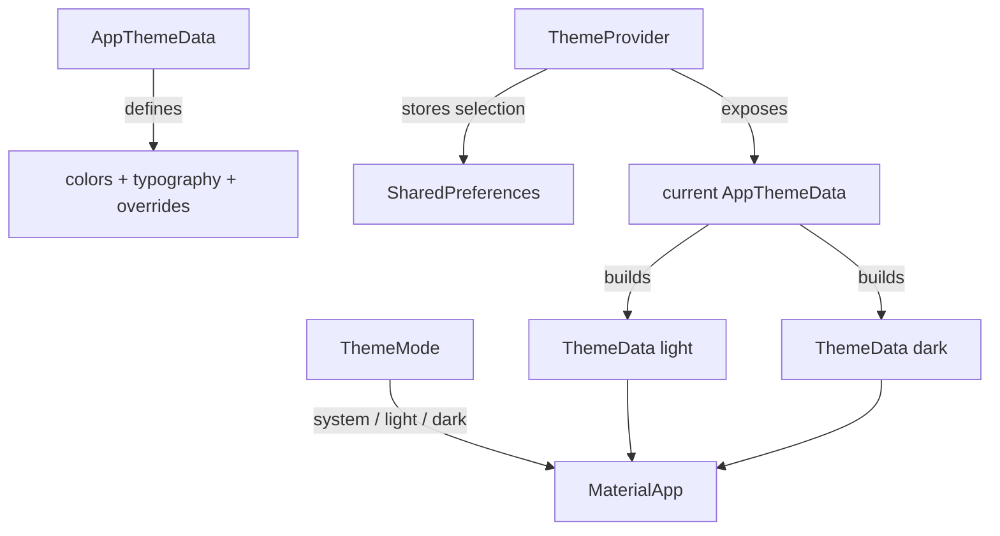

# Blueprint: Flutter Project Kickoff

<!--
tags:        [flutter, dart, project-setup, conventions, git, testing]
category:    project-setup
difficulty:  beginner
time:        1-2 hours
stack:       [flutter, dart, github]
-->

> Bootstrap a new Flutter project with proper conventions, git workflow, testing strategy, and CI-ready structure.

## TL;DR

You'll end up with a Flutter project that has: a clean folder structure following clean architecture, a multi-theme system with user personalization and dark mode, i18n ready from day 1, git branching conventions, a tiered testing strategy, SemVer versioning, and a `CLAUDE.md` for AI-assisted development.

## When to Use

- Starting a brand new Flutter/Dart project
- Restructuring an existing project that grew without conventions
- When **not** to use: pure Dart packages (use a lighter setup)

## Prerequisites

- [ ] Flutter SDK installed (`flutter doctor` passes)
- [ ] Git initialized
- [ ] GitHub repo created (for CI later — see [GitHub Actions for Flutter](../ci-cd/github-actions-flutter.md))

## Overview



## Steps

### 1. Create the Flutter project

**Why**: Start clean with the standard Flutter scaffold, then reshape.

```bash
flutter create --org com.yourorg your_app
cd your_app
```

**Expected outcome**: Running `flutter run` launches the counter demo app.

### 2. Set up the folder structure

**Why**: A consistent structure prevents spaghetti as the project grows. Follow clean architecture tiers — dependencies flow inward only.

```
lib/
├── core/                   # Tier 0-2: shared foundation
│   ├── models/             # Domain models, value objects
│   ├── database/           # DB tables, DAOs, migrations
│   └── services/           # Business logic, repositories
├── features/               # Tier 3-5: feature modules
│   ├── home/
│   │   ├── home_screen.dart
│   │   └── home_vm.dart    # ViewModel / Controller
│   └── settings/
│       ├── settings_screen.dart
│       └── settings_vm.dart
├── shared/                 # Tier 6: shared UI components
│   ├── widgets/
│   └── theme/
└── main.dart               # Tier 7: app entry point
```

> **Rule**: Dependencies go **inward only**. `features/` can import `core/`, but `core/` never imports `features/`.

**Expected outcome**: Empty folders in place. No code changes yet.

### 3. Set up the theme system

**Why**: A centralized, multi-theme system prevents scattered `Color(0xFF...)` literals and lets users personalize the app. Supporting multiple themes from day 1 is almost free — retrofitting it later means touching every screen.



Create `lib/shared/theme/`:

```dart
// lib/shared/theme/app_theme_data.dart
/// Each theme is a self-contained set of design tokens.
class AppThemeData {
  final String id;          // persisted key: "default", "ocean", "sunset"
  final String label;       // user-facing name
  final Color seed;         // M3 seed color
  final Color? secondary;   // optional override
  final String? fontFamily; // optional custom font

  const AppThemeData({
    required this.id,
    required this.label,
    required this.seed,
    this.secondary,
    this.fontFamily,
  });

  /// Build a full ThemeData for the given brightness.
  ThemeData toThemeData(Brightness brightness) {
    final colorScheme = ColorScheme.fromSeed(
      seedColor: seed,
      secondary: secondary,
      brightness: brightness,
    );
    return ThemeData(
      useMaterial3: true,
      colorScheme: colorScheme,
      fontFamily: fontFamily,
      appBarTheme: AppBarTheme(
        centerTitle: false,
        backgroundColor: colorScheme.surface,
      ),
      inputDecorationTheme: InputDecorationTheme(
        border: OutlineInputBorder(borderRadius: BorderRadius.circular(8)),
      ),
    );
  }
}
```

```dart
// lib/shared/theme/app_themes.dart
/// Registry of available themes. Add new themes here.
abstract final class AppThemes {
  static const defaultTheme = AppThemeData(
    id: 'default', label: 'Default', seed: Color(0xFF6750A4),
  );
  static const ocean = AppThemeData(
    id: 'ocean', label: 'Ocean', seed: Color(0xFF006D77),
    secondary: Color(0xFF83C5BE),
  );
  static const sunset = AppThemeData(
    id: 'sunset', label: 'Sunset', seed: Color(0xFFE76F51),
    fontFamily: 'Nunito',
  );
  static const forest = AppThemeData(
    id: 'forest', label: 'Forest', seed: Color(0xFF2D6A4F),
  );

  static const List<AppThemeData> all = [defaultTheme, ocean, sunset, forest];

  static AppThemeData fromId(String id) =>
      all.firstWhere((t) => t.id == id, orElse: () => defaultTheme);
}
```

```dart
// lib/shared/theme/theme_provider.dart
/// Manages theme selection + persistence.
/// Adapt to your state management (Riverpod, Bloc, ChangeNotifier...).
class ThemeProvider extends ChangeNotifier {
  static const _themeKey = 'app_theme_id';
  static const _modeKey = 'app_theme_mode';

  final SharedPreferences _prefs;

  late AppThemeData _current;
  late ThemeMode _mode;

  ThemeProvider(this._prefs) {
    final id = _prefs.getString(_themeKey) ?? 'default';
    _current = AppThemes.fromId(id);
    _mode = ThemeMode.values.byName(
      _prefs.getString(_modeKey) ?? 'system',
    );
  }

  AppThemeData get current => _current;
  ThemeMode get mode => _mode;
  ThemeData get light => _current.toThemeData(Brightness.light);
  ThemeData get dark => _current.toThemeData(Brightness.dark);

  Future<void> setTheme(AppThemeData theme) async {
    _current = theme;
    await _prefs.setString(_themeKey, theme.id);
    notifyListeners();
  }

  Future<void> setMode(ThemeMode mode) async {
    _mode = mode;
    await _prefs.setString(_modeKey, mode.name);
    notifyListeners();
  }
}
```

Wire it in `main.dart`:
```dart
final themeProvider = ThemeProvider(await SharedPreferences.getInstance());

runApp(
  ChangeNotifierProvider.value(
    value: themeProvider,
    child: Builder(builder: (context) {
      final tp = context.watch<ThemeProvider>();
      return MaterialApp(
        theme: tp.light,
        darkTheme: tp.dark,
        themeMode: tp.mode,
        // ...
      );
    }),
  ),
);
```

> **Rule**: NEVER use raw `Color(...)` or `TextStyle(...)` in widgets. Always reference `Theme.of(context).colorScheme` or `Theme.of(context).textTheme`.

> **Adding a new theme**: Add one `AppThemeData` const in `AppThemes` + add it to the `all` list. That's it — the theme picker, persistence, and light/dark variants all work automatically.

**Expected outcome**: App supports multiple themes + light/dark mode per theme. User preference persists across restarts.

### 4. Set up internationalization (i18n)

**Why**: Retrofitting i18n is painful — you end up with grep-and-replace across hundreds of files. Starting with it from day 1 costs 10 minutes and saves hours later, even if you only support one language initially.

Add the dependency in `pubspec.yaml`:
```yaml
dependencies:
  flutter_localizations:
    sdk: flutter
  intl: any

flutter:
  generate: true
```

Create `l10n.yaml` at project root:
```yaml
arb-dir: lib/l10n
template-arb-file: app_en.arb
output-localization-file: app_localizations.dart
output-class: L10n
nullable-getter: false
```

Create the template ARB file `lib/l10n/app_en.arb`:
```json
{
  "@@locale": "en",
  "appTitle": "Your App",
  "@appTitle": { "description": "The app title shown in the app bar" },
  "ok": "OK",
  "cancel": "Cancel",
  "error_generic": "Something went wrong. Please try again.",
  "@error_generic": { "description": "Generic error message" }
}
```

Wire it in `main.dart`:
```dart
import 'package:flutter_gen/gen_l10n/app_localizations.dart';

MaterialApp(
  localizationsDelegates: L10n.localizationsDelegates,
  supportedLocales: L10n.supportedLocales,
  // ...
)
```

Usage in widgets:
```dart
Text(L10n.of(context).appTitle)
```

> **Rule**: NEVER hardcode user-visible strings. Always use `L10n.of(context).key`. This applies from the first screen, not "when we add a second language."

> **Decision**: If you need plurals or gendered text, use ICU syntax in ARB files:
> ```json
> "itemCount": "{count, plural, =0{No items} =1{1 item} other{{count} items}}"
> ```

**Expected outcome**: `flutter gen-l10n` generates type-safe accessors. Adding a new locale = copying the ARB file.

### 5. Configure git conventions

**Why**: Consistent branch names and commit messages make history searchable and CI automatable.

**Branch naming**:
```
feature/short-description
fix/short-description
docs/short-description
refactor/short-description
chore/short-description
```

**Commit format** (conventional commits):
```
type(scope): short description

Optional body explaining WHY, not WHAT.
```

Types: `feat`, `fix`, `docs`, `refactor`, `test`, `chore`, `ci`

**PR rules**:
- Atomic commits, < 300 lines changed per commit
- PRs < 500 lines total
- Never push directly to `main`

**Expected outcome**: Document these rules in `CONTRIBUTING.md` or `CLAUDE.md`.

### 6. Define the testing strategy

**Why**: Not everything needs the same coverage. Tiered targets focus effort where it matters.

| Tier | Layer | Coverage target | Approach |
|------|-------|----------------|----------|
| 0 | Models, value objects | 95% | TDD — write tests first |
| 1 | Database, DAOs | 90% | TDD with in-memory DB |
| 2 | Services, repos | 85% | Test-after for features |
| 3 | ViewModels | 80% | Test-after |
| 4 | Widgets | 60% | Test-with for bugs |

```bash
# Run all tests
flutter test

# Run with coverage
flutter test --coverage
genhtml coverage/lcov.info -o coverage/html
```

> **Decision**: TDD for primitives (Tier 0-1), test-after for features (Tier 2-3), test-with for bugs at any tier.

**Expected outcome**: `test/` folder mirrors `lib/` structure.

### 7. Set up versioning

**Why**: Consistent versioning lets CI auto-deploy and users know what changed.

Use **SemVer** in `pubspec.yaml`:
```yaml
version: 0.1.0+1
#        ^^^^^  ^ build number (auto-increment in CI)
#        |||
#        ||patch: bug fixes
#        |minor: new features
#        major: breaking changes
```

**Rules**:
- Start at `0.1.0` — you're not v1 until you ship to users
- Tags on `main`: `git tag v0.1.0 && git push --tags`
- Build number: auto-increment via CI (`github.run_number`)

**Expected outcome**: `pubspec.yaml` has a proper version. Git tags are ready.

### 8. Create CLAUDE.md

**Why**: If you use AI-assisted development (Claude Code, Copilot), a `CLAUDE.md` gives the agent project context. See [CLAUDE.md Conventions](claude-md-conventions.md) for the full blueprint.

Minimal version at project root:

```markdown
# Project Name

## Architecture
- Clean architecture: core/ → features/ → shared/ → main.dart
- State management: [Riverpod/Bloc/Provider]
- Database: [Drift/Hive/none]

## Conventions
- Conventional commits in English
- Branches: feature/, fix/, docs/, refactor/, chore/
- PRs < 500 lines, commits < 300 lines

## Testing
- TDD for models and DAOs
- flutter test --coverage

## Commands
- `flutter run` — run the app
- `flutter test` — run tests
- `dart run build_runner build` — code generation
```

**Expected outcome**: `CLAUDE.md` exists at project root.

### 9. First commit

```bash
git add -A
git commit -m "feat: initial project setup with clean architecture structure"
```

## Gotchas

> **Don't over-structure too early**: Start with `core/` and one feature folder. Add folders as needed — empty folders are noise. The structure above is a target, not a starting point.

> **`build_runner` codegen**: If using Drift, Freezed, or json_serializable, add `build.yaml` and run `dart run build_runner build` before first test. Forgetting this causes "class not found" errors that look like import bugs.

> **State management choice**: Pick one and stick with it. Riverpod is the current community favorite for new projects. Don't mix Provider and Riverpod in the same project.

> **Theme: don't hardcode colors outside `AppThemeData`**: All colors should flow from the seed via `ColorScheme.fromSeed()`. If you need semantic colors (success, warning), extend `AppThemeData` with extra fields and access them via an extension on `BuildContext` — never with static constants that bypass the theme system.

> **Theme: persistence key mismatch after rename**: If you rename an `AppThemeData.id`, users who had that theme selected will fall back to `defaultTheme` silently. Add a migration in `ThemeProvider` constructor if you rename IDs.

> **i18n: missing `flutter gen-l10n` after ARB edit**: The generated files are NOT auto-updated. Run `flutter gen-l10n` (or rely on `flutter run` which triggers it). Forgetting this causes "getter not found" errors that look like typos but are just stale codegen.

> **i18n: context-less locations**: Sometimes you need a translated string outside a widget (in a service, a notification, a test). Use `L10n.of(navigatorKey.currentContext!)` with a global navigator key, or pass the string as a parameter. Never import the ARB JSON directly.

## Checklist

- [ ] `flutter run` works
- [ ] Folder structure follows clean architecture tiers
- [ ] Multi-theme system in `shared/theme/` — no raw `Color(...)` in widgets
- [ ] At least 2 themes defined in `AppThemes.all`
- [ ] Theme + mode selection persisted via `SharedPreferences`
- [ ] Dark mode works for each theme
- [ ] i18n configured with `flutter_localizations` and ARB files
- [ ] `flutter gen-l10n` generates without errors
- [ ] No hardcoded user-visible strings — all use `L10n.of(context)`
- [ ] Git branch naming documented
- [ ] Commit message format documented
- [ ] Testing targets defined per tier
- [ ] `pubspec.yaml` has proper SemVer version
- [ ] `CLAUDE.md` exists at root
- [ ] First commit on `main`

## Artifacts

| Artifact | Location | Description |
|----------|----------|-------------|
| Project scaffold | `lib/` | Clean architecture folder structure |
| Theme system | `lib/shared/theme/` | Colors, text styles, ThemeData builder |
| i18n config | `l10n.yaml` + `lib/l10n/` | Localization setup and ARB templates |
| AI context | `CLAUDE.md` | Project conventions for AI assistants |
| Git config | `.gitignore` | Flutter defaults + platform-specific ignores |

## References

- [Flutter project structure best practices](https://docs.flutter.dev/resources/architectural-overview)
- [Conventional Commits](https://www.conventionalcommits.org/)
- [SemVer](https://semver.org/)
- [CLAUDE.md Conventions](claude-md-conventions.md) — companion blueprint
