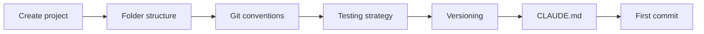

# Blueprint: Flutter Project Kickoff

<!--
tags:        [flutter, dart, project-setup, conventions, git, testing]
category:    project-setup
difficulty:  beginner
time:        1-2 hours
stack:       [flutter, dart, github]
-->

> Bootstrap a new Flutter project with proper conventions, git workflow, testing strategy, and CI-ready structure.

## TL;DR

You'll end up with a Flutter project that has: a clean folder structure following clean architecture, git branching conventions, a tiered testing strategy, SemVer versioning, and a `CLAUDE.md` for AI-assisted development.

## When to Use

- Starting a brand new Flutter/Dart project
- Restructuring an existing project that grew without conventions
- When **not** to use: pure Dart packages (use a lighter setup)

## Prerequisites

- [ ] Flutter SDK installed (`flutter doctor` passes)
- [ ] Git initialized
- [ ] GitHub repo created (for CI later — see [GitHub Actions for Flutter](../ci-cd/github-actions-flutter.md))

## Overview



## Steps

### 1. Create the Flutter project

**Why**: Start clean with the standard Flutter scaffold, then reshape.

```bash
flutter create --org com.yourorg your_app
cd your_app
```

**Expected outcome**: Running `flutter run` launches the counter demo app.

### 2. Set up the folder structure

**Why**: A consistent structure prevents spaghetti as the project grows. Follow clean architecture tiers — dependencies flow inward only.

```
lib/
├── core/                   # Tier 0-2: shared foundation
│   ├── models/             # Domain models, value objects
│   ├── database/           # DB tables, DAOs, migrations
│   └── services/           # Business logic, repositories
├── features/               # Tier 3-5: feature modules
│   ├── home/
│   │   ├── home_screen.dart
│   │   └── home_vm.dart    # ViewModel / Controller
│   └── settings/
│       ├── settings_screen.dart
│       └── settings_vm.dart
├── shared/                 # Tier 6: shared UI components
│   ├── widgets/
│   └── theme/
└── main.dart               # Tier 7: app entry point
```

> **Rule**: Dependencies go **inward only**. `features/` can import `core/`, but `core/` never imports `features/`.

**Expected outcome**: Empty folders in place. No code changes yet.

### 3. Configure git conventions

**Why**: Consistent branch names and commit messages make history searchable and CI automatable.

**Branch naming**:
```
feature/short-description
fix/short-description
docs/short-description
refactor/short-description
chore/short-description
```

**Commit format** (conventional commits):
```
type(scope): short description

Optional body explaining WHY, not WHAT.
```

Types: `feat`, `fix`, `docs`, `refactor`, `test`, `chore`, `ci`

**PR rules**:
- Atomic commits, < 300 lines changed per commit
- PRs < 500 lines total
- Never push directly to `main`

**Expected outcome**: Document these rules in `CONTRIBUTING.md` or `CLAUDE.md`.

### 4. Define the testing strategy

**Why**: Not everything needs the same coverage. Tiered targets focus effort where it matters.

| Tier | Layer | Coverage target | Approach |
|------|-------|----------------|----------|
| 0 | Models, value objects | 95% | TDD — write tests first |
| 1 | Database, DAOs | 90% | TDD with in-memory DB |
| 2 | Services, repos | 85% | Test-after for features |
| 3 | ViewModels | 80% | Test-after |
| 4 | Widgets | 60% | Test-with for bugs |

```bash
# Run all tests
flutter test

# Run with coverage
flutter test --coverage
genhtml coverage/lcov.info -o coverage/html
```

> **Decision**: TDD for primitives (Tier 0-1), test-after for features (Tier 2-3), test-with for bugs at any tier.

**Expected outcome**: `test/` folder mirrors `lib/` structure.

### 5. Set up versioning

**Why**: Consistent versioning lets CI auto-deploy and users know what changed.

Use **SemVer** in `pubspec.yaml`:
```yaml
version: 0.1.0+1
#        ^^^^^  ^ build number (auto-increment in CI)
#        |||
#        ||patch: bug fixes
#        |minor: new features
#        major: breaking changes
```

**Rules**:
- Start at `0.1.0` — you're not v1 until you ship to users
- Tags on `main`: `git tag v0.1.0 && git push --tags`
- Build number: auto-increment via CI (`github.run_number`)

**Expected outcome**: `pubspec.yaml` has a proper version. Git tags are ready.

### 6. Create CLAUDE.md

**Why**: If you use AI-assisted development (Claude Code, Copilot), a `CLAUDE.md` gives the agent project context. See [CLAUDE.md Conventions](claude-md-conventions.md) for the full blueprint.

Minimal version at project root:

```markdown
# Project Name

## Architecture
- Clean architecture: core/ → features/ → shared/ → main.dart
- State management: [Riverpod/Bloc/Provider]
- Database: [Drift/Hive/none]

## Conventions
- Conventional commits in English
- Branches: feature/, fix/, docs/, refactor/, chore/
- PRs < 500 lines, commits < 300 lines

## Testing
- TDD for models and DAOs
- flutter test --coverage

## Commands
- `flutter run` — run the app
- `flutter test` — run tests
- `dart run build_runner build` — code generation
```

**Expected outcome**: `CLAUDE.md` exists at project root.

### 7. First commit

```bash
git add -A
git commit -m "feat: initial project setup with clean architecture structure"
```

## Gotchas

> **Don't over-structure too early**: Start with `core/` and one feature folder. Add folders as needed — empty folders are noise. The structure above is a target, not a starting point.

> **`build_runner` codegen**: If using Drift, Freezed, or json_serializable, add `build.yaml` and run `dart run build_runner build` before first test. Forgetting this causes "class not found" errors that look like import bugs.

> **State management choice**: Pick one and stick with it. Riverpod is the current community favorite for new projects. Don't mix Provider and Riverpod in the same project.

## Checklist

- [ ] `flutter run` works
- [ ] Folder structure follows clean architecture tiers
- [ ] Git branch naming documented
- [ ] Commit message format documented
- [ ] Testing targets defined per tier
- [ ] `pubspec.yaml` has proper SemVer version
- [ ] `CLAUDE.md` exists at root
- [ ] First commit on `main`

## Artifacts

| Artifact | Location | Description |
|----------|----------|-------------|
| Project scaffold | `lib/` | Clean architecture folder structure |
| AI context | `CLAUDE.md` | Project conventions for AI assistants |
| Git config | `.gitignore` | Flutter defaults + platform-specific ignores |

## References

- [Flutter project structure best practices](https://docs.flutter.dev/resources/architectural-overview)
- [Conventional Commits](https://www.conventionalcommits.org/)
- [SemVer](https://semver.org/)
- [CLAUDE.md Conventions](claude-md-conventions.md) — companion blueprint
