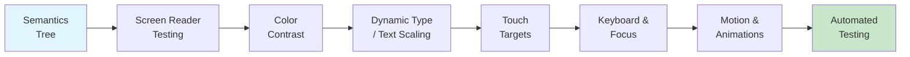

# Blueprint: Accessibility Checklist

<!-- METADATA — structured for agents, useful for humans
tags:        [accessibility, a11y, screen-reader, wcag, inclusive-design]
category:    workflow
difficulty:  beginner
time:        2 hours
stack:       [flutter, dart]
-->

> Systematic checklist for making mobile apps usable for everyone — screen readers, contrast, Dynamic Type, and motor accessibility.

## TL;DR

A step-by-step accessibility audit you can run against any Flutter app. Covers semantics, screen reader testing, color contrast, text scaling, touch targets, focus management, motion sensitivity, and automated testing. Follow it before every release to ensure your app meets WCAG 2.1 AA and platform accessibility guidelines.

## When to Use

- You are preparing an app for release and need to verify accessibility compliance
- You received user feedback about screen reader or usability issues
- You are building a new feature and want to ensure it is accessible from the start
- Your organization requires WCAG 2.1 AA conformance
- When **not** to use: prototype-only builds that will never reach real users (but building the habit early is still recommended)

## Prerequisites

- [ ] Flutter project with at least one screen to audit
- [ ] Physical device or emulator/simulator with TalkBack (Android) or VoiceOver (iOS) available
- [ ] Basic understanding of widget tree and Flutter layout
- [ ] `flutter analyze` passing with no errors

## Overview



## Steps

### 1. Semantics tree basics

**Why**: The semantics tree is how screen readers understand your app. Every interactive element and meaningful piece of content must have a semantics node with appropriate properties. Without it, your widget is invisible to assistive technology.

Flutter builds a semantics tree in parallel with the widget tree. The `Semantics` widget lets you annotate nodes explicitly:

```dart
Semantics(
  label: 'Delete item',       // read aloud by screen reader
  hint: 'Double tap to delete', // additional instruction
  value: '3 items',            // current value for sliders, counters
  button: true,                // role: identifies as a button
  header: true,                // role: identifies as a heading
  excludeSemantics: true,      // hides children from semantics tree
  child: Icon(Icons.delete),
)
```

Key properties to know:
- **label**: the primary text the screen reader announces. Required for any element without visible text.
- **hint**: describes what happens on interaction ("Double tap to toggle").
- **value**: communicates current state (e.g., "50%" for a slider).
- **button / header / image / link**: semantic roles that change how the screen reader presents the element.
- **excludeSemantics**: removes all children from the tree. Use when a parent Semantics node provides a complete description and children would be redundant noise.

For images, use the `semanticLabel` parameter directly:

```dart
Image.asset(
  'assets/logo.png',
  semanticLabel: 'Company logo',
)
```

For decorative images that add no information, exclude them:

```dart
Image.asset(
  'assets/decorative-border.png',
  excludeFromSemantics: true,
)
```

**Expected outcome**: Every meaningful element in your widget tree has a semantics label. Decorative elements are excluded. Running `flutter test --debug` with `debugDumpSemanticsTree()` shows a clean tree with no unlabeled interactive nodes.

### 2. Screen reader testing

**Why**: Automated tools cannot catch everything. A screen reader announces elements in traversal order and with specific phrasing — the only way to know if it makes sense is to listen to it.

#### Enable TalkBack (Android)

1. On the device or emulator: Settings > Accessibility > TalkBack > On.
2. Navigation: swipe right to move to the next element, swipe left to go back, double-tap to activate.
3. Open your app and swipe through every screen.

#### Enable VoiceOver (iOS)

1. On the device or simulator: Settings > Accessibility > VoiceOver > On (or triple-click the side button if shortcut is configured).
2. Navigation: swipe right/left to traverse, double-tap to activate.
3. On the simulator: use Accessibility Inspector (Xcode > Open Developer Tool > Accessibility Inspector) for a quicker feedback loop.

#### What to verify

- [ ] Every button and interactive element is announced with a meaningful label
- [ ] Reading order follows the visual layout (top-to-bottom, start-to-end)
- [ ] No elements are skipped or unreachable
- [ ] Modal dialogs trap focus (screen reader cannot reach content behind the dialog)
- [ ] Custom gestures (swipe-to-dismiss, long-press) have accessible alternatives
- [ ] Screen transitions announce the new screen name
- [ ] Form fields announce their label, current value, and error state

**Expected outcome**: You can navigate your entire app using only the screen reader without encountering unlabeled elements, dead ends, or confusing reading order.

### 3. Color contrast

**Why**: Approximately 1 in 12 men and 1 in 200 women have some form of color vision deficiency. Low contrast text is also difficult for everyone in bright sunlight. WCAG 2.1 AA defines minimum contrast ratios that ensure readability.

#### Minimum contrast ratios (WCAG 2.1 AA)

| Text type | Minimum ratio |
|-----------|---------------|
| Normal text (< 18pt or < 14pt bold) | 4.5:1 |
| Large text (>= 18pt or >= 14pt bold) | 3:1 |
| UI components and graphical objects | 3:1 |

#### How to check

1. **Manual**: Use the [WebAIM Contrast Checker](https://webaim.org/resources/contrastchecker/) — enter foreground and background hex values.
2. **Xcode Accessibility Inspector**: Displays contrast ratios for iOS builds.
3. **In code**: Define your color palette in one place and document the contrast ratios:

```dart
// theme/colors.dart
abstract class AppColors {
  // Primary text on white — ratio 7.4:1 (passes AA and AAA)
  static const textPrimary = Color(0xFF1A1A2E);

  // Secondary text on white — ratio 4.6:1 (passes AA)
  static const textSecondary = Color(0xFF6B6B80);

  // Danger on white — ratio 4.8:1 (passes AA)
  static const danger = Color(0xFFCC3333);
}
```

#### Never convey information by color alone

Bad:
```dart
// Red = error, green = success — colorblind users cannot distinguish
Container(color: isValid ? Colors.green : Colors.red)
```

Good:
```dart
// Color + icon + text
Row(children: [
  Icon(isValid ? Icons.check_circle : Icons.error,
       color: isValid ? Colors.green : Colors.red),
  Text(isValid ? 'Valid' : 'Error'),
])
```

**Expected outcome**: All text meets the 4.5:1 (normal) or 3:1 (large) contrast ratio. No information is conveyed by color alone — icons, text, or patterns provide a redundant cue.

### 4. Dynamic Type and text scaling

**Why**: Many users increase their system font size for readability. iOS Dynamic Type and Android font scaling can push text to 200% or more. If your layout hardcodes heights or clips text, these users see broken UI.

#### Respect the scale factor

Flutter applies text scaling automatically through `MediaQuery.textScaleFactor`. Do not override it:

```dart
// BAD — ignores user's text scale preference
Text('Hello', textScaleFactor: 1.0)

// GOOD — uses system text scale (default behavior)
Text('Hello')
```

#### Test at 200% scale

1. **iOS**: Settings > Accessibility > Display & Text Size > Larger Text > drag slider to maximum.
2. **Android**: Settings > Accessibility > Font size > largest setting.
3. Alternatively, wrap your app in `MediaQuery` for testing:

```dart
MediaQuery(
  data: MediaQuery.of(context).copyWith(textScaleFactor: 2.0),
  child: MyApp(),
)
```

#### Layout guidelines

- Use `Flexible` and `Expanded` instead of fixed-height containers for text.
- Prefer `minHeight` constraints over fixed `height` when a container must have a minimum size.
- Use `TextOverflow.ellipsis` as a last resort, not as the default — truncated text hides information.
- Test that scrollable areas still scroll when text is larger.

```dart
// BAD — text clips at 200% scale
SizedBox(
  height: 48,
  child: Text('Account settings'),
)

// GOOD — grows with text
ConstrainedBox(
  constraints: const BoxConstraints(minHeight: 48),
  child: Text('Account settings'),
)
```

**Expected outcome**: At 200% text scale, all text is fully visible, no content overlaps, and the app remains usable. Scrollable areas accommodate the larger content.

### 5. Touch targets

**Why**: Users with motor impairments, tremors, or simply large fingers need adequately sized touch targets. Both Apple (44x44pt) and Material Design (48x48dp) define minimums. Small or tightly packed targets cause frustration and mis-taps.

#### Minimum sizes

- **Material Design**: 48x48dp minimum touch target
- **Apple HIG**: 44x44pt minimum touch target
- Use the larger value (48x48) to satisfy both platforms

#### How to enforce

```dart
// BAD — icon button with no minimum size
IconButton(
  icon: Icon(Icons.close, size: 16),
  onPressed: onClose,
)

// GOOD — explicit constraints
IconButton(
  icon: Icon(Icons.close, size: 16),
  constraints: const BoxConstraints(minWidth: 48, minHeight: 48),
  onPressed: onClose,
)
```

#### Spacing between targets

Ensure at least 8dp of spacing between adjacent tap targets. Without spacing, users trying to tap one button frequently hit the neighboring one.

```dart
// Check for tightly packed rows of buttons
Row(
  children: [
    IconButton(...),
    const SizedBox(width: 8), // minimum spacing
    IconButton(...),
  ],
)
```

**Expected outcome**: Every interactive element has at least a 48x48dp touch target. Adjacent targets have adequate spacing. No "impossible to tap" elements exist on small screens.

### 6. Keyboard and focus management

**Why**: Users who rely on external keyboards, switch devices, or tab navigation (especially on web and desktop targets) need a logical focus traversal order. Broken focus traps or unreachable elements make the app unusable for these users.

#### Focus traversal order

Flutter uses `FocusNode` and `FocusTraversalGroup` to manage focus order:

```dart
FocusTraversalGroup(
  policy: OrderedTraversalPolicy(),
  child: Column(
    children: [
      FocusTraversalOrder(
        order: const NumericFocusOrder(1),
        child: TextField(decoration: InputDecoration(labelText: 'Email')),
      ),
      FocusTraversalOrder(
        order: const NumericFocusOrder(2),
        child: TextField(decoration: InputDecoration(labelText: 'Password')),
      ),
      FocusTraversalOrder(
        order: const NumericFocusOrder(3),
        child: ElevatedButton(
          onPressed: onLogin,
          child: Text('Log in'),
        ),
      ),
    ],
  ),
)
```

#### Keyboard dismissal

Ensure the keyboard can be dismissed and does not cover input fields:

```dart
// Dismiss keyboard when tapping outside
GestureDetector(
  onTap: () => FocusScope.of(context).unfocus(),
  child: Scaffold(...),
)

// Ensure fields scroll into view when focused
SingleChildScrollView(
  child: Column(children: [/* form fields */]),
)
```

#### What to verify

- [ ] Tab key moves focus in logical order (web/desktop)
- [ ] Enter/Space activates buttons and toggles
- [ ] Escape closes dialogs and menus
- [ ] Focus is never trapped (except in modals, intentionally)
- [ ] Focus is moved to new content when it appears (e.g., dialog opens, focus moves to dialog)
- [ ] Keyboard does not cover the focused input field

**Expected outcome**: The app is fully navigable via keyboard/tab on web and desktop. Focus order matches visual order. Keyboard dismisses properly on mobile.

### 7. Motion and animations

**Why**: Some users experience vestibular disorders triggered by excessive motion. Others have photosensitive conditions. Platform accessibility settings provide a "reduce motion" preference that your app should respect.

#### Respect the reduce motion setting

```dart
final reduceMotion = MediaQuery.of(context).disableAnimations;

// Use it to simplify or skip animations
AnimatedContainer(
  duration: reduceMotion
      ? Duration.zero
      : const Duration(milliseconds: 300),
  curve: Curves.easeInOut,
  // ...
)
```

#### Guidelines

- **No autoplay video with sound**: always start muted, provide play/pause controls.
- **No flashing content**: nothing should flash more than 3 times per second (WCAG 2.3.1).
- **Provide alternatives**: if an animation conveys information (e.g., a progress indicator), also provide a text or numeric representation.
- **Parallax and large-scale motion**: skip entirely when reduce motion is enabled.

```dart
// Conditional animation
Widget build(BuildContext context) {
  final reduceMotion = MediaQuery.of(context).disableAnimations;

  if (reduceMotion) {
    return _buildStaticContent();
  }
  return _buildAnimatedContent();
}
```

**Expected outcome**: When "Reduce Motion" is enabled in system settings, the app removes or simplifies all non-essential animations. No content flashes rapidly. All motion-conveyed information has a static alternative.

### 8. Testing automation

**Why**: Manual testing catches issues but does not scale. Automated accessibility checks in CI catch regressions early and enforce standards without relying on human memory.

#### Flutter accessibility_tools package

Add the `accessibility_tools` package for a visual overlay that highlights accessibility issues during development:

```yaml
# pubspec.yaml (dev_dependencies)
dev_dependencies:
  accessibility_tools: ^1.0.0
```

```dart
// main.dart (debug only)
import 'package:accessibility_tools/accessibility_tools.dart';

MaterialApp(
  builder: (context, child) {
    return AccessibilityTools(child: child);
  },
)
```

This overlay highlights:
- Missing semantics labels
- Insufficient touch target sizes
- Missing tooltip on `IconButton`

#### Semantic label audit in widget tests

```dart
testWidgets('all buttons have semantic labels', (tester) async {
  await tester.pumpWidget(MyApp());

  // Find all buttons and verify they have semantics
  final buttons = find.byType(IconButton);
  for (final button in buttons.evaluate()) {
    final semantics = tester.getSemantics(find.byWidget(button.widget));
    expect(semantics.label, isNotEmpty,
        reason: 'IconButton must have a semantic label');
  }
});
```

#### CI integration

Add accessibility checks to your CI pipeline:

```yaml
# In your GitHub Actions workflow
- name: Run accessibility audit
  run: |
    flutter test test/accessibility/
    dart run accessibility_tools:audit
```

#### Contrast checker integration

Use a custom lint or test that validates your color constants:

```dart
// test/accessibility/contrast_test.dart
import 'package:flutter_test/flutter_test.dart';

double contrastRatio(Color foreground, Color background) {
  final fgLuminance = foreground.computeLuminance();
  final bgLuminance = background.computeLuminance();
  final lighter = fgLuminance > bgLuminance ? fgLuminance : bgLuminance;
  final darker = fgLuminance > bgLuminance ? bgLuminance : fgLuminance;
  return (lighter + 0.05) / (darker + 0.05);
}

void main() {
  test('primary text meets AA contrast on white', () {
    const foreground = Color(0xFF1A1A2E);
    const background = Color(0xFFFFFFFF);
    expect(contrastRatio(foreground, background), greaterThanOrEqualTo(4.5));
  });
}
```

**Expected outcome**: `accessibility_tools` overlay runs in debug builds, widget tests verify semantic labels, contrast tests validate color palette, and all checks run in CI on every pull request.

## Variants

<details>
<summary><strong>Variant: iOS-only app</strong></summary>

- Focus screen reader testing on VoiceOver only (skip TalkBack)
- Use Xcode Accessibility Inspector as your primary audit tool
- Test Dynamic Type using the iOS Settings slider (no Android font scaling needed)
- Follow Apple HIG 44x44pt minimum touch target (though 48x48 remains a safe default)
- Check VoiceOver rotor actions for custom swipe gestures

</details>

<details>
<summary><strong>Variant: Flutter Web / Desktop</strong></summary>

- Keyboard navigation becomes the primary concern over touch targets
- Test with browser screen readers: NVDA (Windows), VoiceOver (macOS), Orca (Linux)
- Ensure all ARIA-equivalent semantics are generated (Flutter web renders to DOM with ARIA attributes)
- Verify tab order in the browser matches visual order
- Test at browser zoom levels (100%, 150%, 200%) in addition to text scaling
- Ensure focus indicators are visible (default browser outline or custom)

</details>

## Gotchas

> **Image without Semantics label**: Images that lack a `semanticLabel` are completely invisible to screen readers. A sighted user sees a photo; a screen reader user hears nothing. **Fix**: Always set `semanticLabel` on meaningful images. For decorative images, set `excludeFromSemantics: true` so the screen reader skips them without confusion.

> **Icon-only buttons without tooltip**: An `IconButton` with no `tooltip` and no wrapping `Semantics` is announced as "button" with no description — useless for TalkBack and VoiceOver users. **Fix**: Always provide a `tooltip` on `IconButton` (Flutter uses the tooltip as the semantic label automatically) or wrap with an explicit `Semantics(label: ...)` widget.

> **Custom widgets bypass default semantics**: Standard Flutter widgets (`ElevatedButton`, `TextField`, `Checkbox`) come with built-in semantics. Custom widgets built from `GestureDetector` + `Container` have zero semantic information by default. **Fix**: Wrap custom interactive widgets with the `Semantics` widget and set appropriate properties (`button: true`, `label`, `hint`, `onTap`).

> **Text scaling breaks layout with hardcoded heights**: A `SizedBox(height: 40)` around a `Text` widget works at 100% scale but clips text at 150% or 200%. This is one of the most common accessibility regressions. **Fix**: Use `ConstrainedBox` with `minHeight` instead of fixed `height`. Use `Flexible` or `Expanded` in flex layouts. Always test at 200% text scale before release.

> **Semantic label on container wrapping multiple children**: Wrapping a complex card in a single `Semantics(label: 'Product card')` with `excludeSemantics: true` hides all child information (price, name, rating) from the screen reader. **Fix**: Either provide a comprehensive label that includes all critical child information, or let children keep their individual semantics and use `MergeSemantics` to combine them logically.

> **Color-only error indication**: Marking a form field as invalid by changing only its border color to red means colorblind users see no change. **Fix**: Combine color with an error icon and descriptive error text. Use `InputDecoration.errorText` in Flutter, which also adds semantics automatically.

## Checklist

### Semantics
- [ ] All interactive elements have a semantic label
- [ ] All meaningful images have `semanticLabel`
- [ ] Decorative images use `excludeFromSemantics: true`
- [ ] Custom widgets are wrapped with `Semantics`
- [ ] Semantic roles (`button`, `header`, `link`) are set correctly

### Screen Readers
- [ ] Full app navigation tested with VoiceOver (iOS)
- [ ] Full app navigation tested with TalkBack (Android)
- [ ] Reading order matches visual layout
- [ ] Dialogs and modals trap focus correctly
- [ ] No dead-end or unreachable elements

### Visual
- [ ] Normal text contrast ratio >= 4.5:1
- [ ] Large text contrast ratio >= 3:1
- [ ] UI component contrast ratio >= 3:1
- [ ] No information conveyed by color alone

### Text Scaling
- [ ] App tested at 200% text scale
- [ ] No text clipping or overflow at maximum scale
- [ ] No hardcoded heights on text containers
- [ ] Scrollable areas accommodate enlarged content

### Touch and Motor
- [ ] All touch targets are at least 48x48dp
- [ ] Adjacent targets have >= 8dp spacing
- [ ] Keyboard focus order is logical (web/desktop)
- [ ] Keyboard can dismiss and does not cover fields

### Motion
- [ ] Animations respect `disableAnimations` / reduce motion setting
- [ ] No content flashes more than 3 times per second
- [ ] No autoplay video with sound

### Automation
- [ ] `accessibility_tools` overlay enabled in debug builds
- [ ] Semantic label tests exist in widget tests
- [ ] Contrast ratio tests validate color palette
- [ ] Accessibility checks run in CI

## References

- [Flutter Accessibility documentation](https://docs.flutter.dev/ui/accessibility-and-internationalization/accessibility) — official Flutter accessibility guide
- [WCAG 2.1 Quick Reference](https://www.w3.org/WAI/WCAG21/quickref/) — filterable reference for all WCAG success criteria
- [Material Design Accessibility](https://m3.material.io/foundations/accessible-design/overview) — Material 3 accessibility guidelines
- [Apple Accessibility HIG](https://developer.apple.com/design/human-interface-guidelines/accessibility) — Apple Human Interface Guidelines for accessibility
- [Android Accessibility Developer Guide](https://developer.android.com/guide/topics/ui/accessibility) — Android-specific accessibility patterns
- [WebAIM Contrast Checker](https://webaim.org/resources/contrastchecker/) — online tool for checking color contrast ratios
- [accessibility_tools package](https://pub.dev/packages/accessibility_tools) — Flutter dev overlay for accessibility issues
