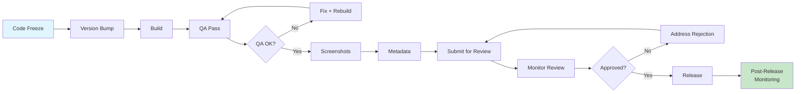

# Blueprint: App Store Release Checklist

<!-- METADATA — structured for agents, useful for humans
tags:        [release, app-store, play-store, deployment, fastlane]
category:    workflow
difficulty:  intermediate
time:        4-8 hours
stack:       [flutter, ios, android]
-->

> End-to-end checklist for releasing a mobile app to the Apple App Store and Google Play Store.

## TL;DR

A repeatable release process that takes you from code freeze to live-in-store. Covers version bumping, QA, screenshots, metadata, submission, review monitoring, and post-release verification for both iOS and Android. Follow it every release to avoid rejections and missed steps.

## When to Use

- You are preparing a new version of your app for public release
- You need a repeatable process that catches rejection-causing mistakes before submission
- You are onboarding a team member to the release process
- When **not** to use: internal-only TestFlight/Firebase App Distribution builds (those are deployment, not release)

## Prerequisites

- [ ] Apple Developer account with App Store Connect access (Admin or App Manager role)
- [ ] Google Play Console access with release manager permissions
- [ ] App already created in both App Store Connect and Google Play Console
- [ ] Code signing configured (certificates, provisioning profiles, keystore)
- [ ] CI/CD pipeline operational (or local build toolchain ready)
- [ ] Fastlane installed (if using automated variant)
- [ ] All features for this release merged to the release branch

## Overview



## Steps

### 1. Version bump and changelog

**Why**: A clean version bump creates a single source of truth for what is in this release. The changelog forces you to articulate user-visible changes, which you will need for the "What's New" metadata later.

1. Create a release branch from your main branch: `release/x.y.z`
2. Bump the version in `pubspec.yaml` (Flutter) or the platform-specific config:
   ```yaml
   # pubspec.yaml
   version: 2.4.0+42  # version+buildNumber
   ```
3. On Android, verify `versionCode` in `android/app/build.gradle` is strictly higher than the last published build. Google Play rejects duplicate or lower version codes.
4. Write the changelog entry. Be specific about user-visible changes:
   ```markdown
   ## 2.4.0 — 2026-04-02
   - Added offline mode for saved articles
   - Fixed crash when opening notifications on Android 14
   - Improved search performance by 40%
   ```
5. Commit: `chore(release): bump version to 2.4.0+42`

**Expected outcome**: Release branch exists with updated version numbers and a changelog entry.

### 2. Final QA pass

**Why**: App review teams test on real devices with production-like conditions. If your app crashes, the review is rejected — often with a multi-day delay before re-review.

Run through these checks:

1. **Fresh install test** — delete the app, install the release build, verify onboarding and first-launch flows work.
2. **Upgrade test** — install the previous production version, then upgrade to the new build. Verify data migration and persistence.
3. **Permission prompts** — every permission your app requests must have a clear purpose string. Test denying each permission and confirm the app degrades gracefully.
4. **Network conditions** — test on airplane mode, slow connections (use Network Link Conditioner on iOS or Charles Proxy throttling). The app must not hang or crash.
5. **Device matrix** — test on the oldest supported OS version and at least one small-screen device. Reviewers sometimes use older hardware.
6. **Dark mode and Dynamic Type** — Apple reviewers will check these. Ensure nothing is unreadable.
7. **Deep links and universal links** — verify they open the correct screens and do not crash on invalid payloads.
8. **In-app purchases** (if applicable) — test in sandbox environment. Verify purchase, restore, and receipt validation flows.

**Expected outcome**: QA sign-off with no P0/P1 issues. Any known issues are documented and accepted.

### 3. Generate screenshots

**Why**: Screenshots are the first thing users see on the store page. Outdated screenshots that do not match the app are also a common rejection reason on iOS.

For each required device size:
- **iOS**: 6.7" (iPhone 15 Pro Max), 6.5" (iPhone 11 Pro Max), 5.5" (iPhone 8 Plus), 12.9" iPad Pro (if universal)
- **Android**: phone (16:9 and 20:9), 7" tablet, 10" tablet (if applicable)

Using Fastlane:
```bash
# iOS
fastlane snapshot

# Android (using screengrab)
fastlane screengrab
```

Manual alternative:
1. Run the app on each simulator/emulator size
2. Navigate to each key screen
3. Take screenshots (Cmd+S in iOS Simulator, Ctrl+S in Android Emulator)
4. Apply frames and marketing text if your team requires it (tools: `fastlane frameit`, Figma templates)

**Expected outcome**: Complete set of screenshots for every required device size and supported language.

### 4. Prepare app metadata

**Why**: Metadata is what convinces users to download and what reviewers check for policy compliance. Mismatched or misleading metadata is a top rejection cause.

#### App Store (iOS)

| Field | Notes |
|-------|-------|
| App Name | Max 30 characters. Cannot include generic terms like "best" or competitor names. |
| Subtitle | Max 30 characters. Summarize the value proposition. |
| Description | Up to 4000 characters. First 3 lines are visible before "more". |
| Keywords | Max 100 characters, comma-separated. No spaces after commas. Do not repeat words already in your app name. |
| What's New | Pull from your changelog. Write for users, not developers. |
| Privacy Policy URL | Required. Must be a live, accessible URL. |
| Support URL | Required. Must actually work. |
| App Privacy (Nutrition Labels) | Declare every data type your app collects. See Step 4a below. |

#### Google Play

| Field | Notes |
|-------|-------|
| Title | Max 30 characters. |
| Short Description | Max 80 characters. Shown on search results. |
| Full Description | Max 4000 characters. |
| Release Notes | Per-release "What's New" text. Max 500 characters. |
| Data Safety Form | Equivalent of Apple's privacy labels. Must be accurate. |
| Content Rating | Complete the IARC questionnaire if not already done. |
| Target Audience | Required. If your app targets children, strict COPPA/GDPR rules apply. |

#### 4a. Privacy Nutrition Labels (iOS)

Apple requires you to declare all data types your app collects, for each purpose (analytics, app functionality, third-party advertising, etc.) and whether they are linked to the user's identity.

1. Audit every SDK in your app (Firebase, analytics, crash reporting, ad networks).
2. Check each SDK's documentation for its data collection disclosure.
3. Fill in the App Privacy section in App Store Connect.

Common missed items:
- Crash logs (collected by Firebase Crashlytics) — declare "Crash Data" under Diagnostics
- Device ID (collected by analytics SDKs) — declare "Device ID" under Identifiers
- Precise location (even if only used for localized content) — declare under Location

#### 4b. Data Safety Form (Android)

Google Play's equivalent. Key differences from Apple:
- You must declare data shared with third parties separately from data collected
- You must specify whether each data type is encrypted in transit
- You must disclose whether users can request data deletion

**Expected outcome**: All metadata fields populated, privacy declarations accurate and complete.

### 5. Build release artifacts

**Why**: The binary you submit must be the exact binary QA tested. Never rebuild after QA sign-off unless QA re-tests.

#### iOS

```bash
# Flutter
flutter build ipa --release \
  --build-number=42 \
  --export-options-plist=ios/ExportOptions.plist

# The .ipa is at build/ios/ipa/*.ipa
```

Or via Fastlane:
```bash
fastlane ios release  # assuming your Fastfile is configured
```

#### Android

```bash
# Flutter — Android App Bundle (required by Google Play)
flutter build appbundle --release \
  --build-number=42

# The .aab is at build/app/outputs/bundle/release/app-release.aab
```

Sign the bundle with your upload key (if not using Play App Signing):
```bash
jarsigner -verbose -sigalg SHA256withRSA -digestalg SHA-256 \
  -keystore upload-keystore.jks \
  app-release.aab upload
```

**Expected outcome**: Signed `.ipa` and `.aab` files ready for upload.

### 6. Submit for review

**Why**: Submission is not just uploading a binary. You need to verify that everything — screenshots, metadata, privacy declarations, review notes — is correct before clicking Submit.

#### iOS

1. Upload the `.ipa` via Xcode, `xcrun altool`, or Transporter app.
   ```bash
   xcrun altool --upload-app -f build/ios/ipa/Runner.ipa \
     -t ios \
     --apiKey YOUR_KEY_ID \
     --apiIssuer YOUR_ISSUER_ID
   ```
2. Wait for processing (5-30 minutes). Check App Store Connect for processing status.
3. Select the build in App Store Connect under the new version.
4. Fill in **Review Notes** if anything needs explanation (e.g., demo account credentials, non-obvious features).
5. Verify all screenshots, metadata, and privacy labels one final time.
6. Click **Submit for Review**.

#### Android

1. Go to Google Play Console → your app → Production → Create new release.
2. Upload the `.aab` file.
3. Enter release notes.
4. Choose rollout percentage (recommend starting at 20% for non-critical releases).
5. Review the release summary for warnings.
6. Click **Start rollout to Production** (or staged rollout).

**Expected outcome**: Both platforms show "Waiting for Review" (iOS) or "In review" / rolling out (Android).

### 7. Monitor review status

**Why**: iOS reviews typically take 24-48 hours but can take longer. Rejection responses have deadlines. Android reviews are usually faster (hours to 1 day) but automated checks can reject instantly.

1. **iOS**: Enable email notifications in App Store Connect. Check status daily. If rejected, read the rejection reason carefully — it is in the Resolution Center.
2. **Android**: Check the Play Console inbox. Automated policy warnings appear quickly; manual reviews may take a few days.
3. If rejected, see the Gotchas section for common causes and fixes.

> **Decision**: If rejected on iOS, go to [Gotchas](#gotchas) to diagnose. Fix the issue, increment the build number (not the version number), rebuild, and resubmit. Do not create a new version — update the existing submission.

**Expected outcome**: App approved and ready for release on both platforms.

### 8. Post-release monitoring

**Why**: A successful review does not mean a successful release. Crashes, ANRs, and negative reviews in the first 24-48 hours need immediate attention.

1. **Crash monitoring**: Watch Firebase Crashlytics / Sentry for new crash clusters. Compare crash-free rate to the previous version.
2. **ANR rate (Android)**: Google Play Console → Android Vitals. If ANR rate exceeds 0.47%, your app risks demotion in search results.
3. **App Store ratings**: Monitor for 1-star reviews mentioning new bugs. Respond to reviews where possible.
4. **Phased rollout (iOS)**: If enabled, Apple releases to 1%, 2%, 5%, 10%, 20%, 50%, 100% over 7 days. Pause if crash rate spikes.
5. **Staged rollout (Android)**: Manually increase percentage as confidence grows: 20% → 50% → 100%.
6. **Hotfix readiness**: If a critical issue is found, be prepared to:
   - Halt the phased/staged rollout
   - Fix the issue on the release branch
   - Bump only the build number (not version): `2.4.0+43`
   - Fast-track through QA (regression test the fix only)
   - Submit with expedited review request (iOS) or immediate rollout (Android)

**Expected outcome**: Stable release with crash-free rate above 99%, no P0 issues in the first 48 hours.

## Variants

<details>
<summary><strong>Variant: iOS only</strong></summary>

Skip all Android-specific steps:
- Skip `versionCode` verification in Step 1 (but still bump the build number in `pubspec.yaml`)
- Skip Android device testing in Step 2
- Skip Google Play screenshots in Step 3
- Skip Data Safety Form in Step 4
- Skip `.aab` build in Step 5
- Skip Google Play Console submission in Step 6
- Skip Android Vitals monitoring in Step 8

Everything else applies as written.

</details>

<details>
<summary><strong>Variant: Android only</strong></summary>

Skip all iOS-specific steps:
- Skip provisioning profile and certificate checks
- Skip iOS device/simulator testing in Step 2
- Skip App Store screenshots and iPad sizes in Step 3
- Skip Privacy Nutrition Labels in Step 4
- Skip `.ipa` build in Step 5
- Skip App Store Connect submission in Step 6
- Skip phased rollout monitoring in Step 8 (use staged rollout only)

Everything else applies as written.

</details>

<details>
<summary><strong>Variant: Fastlane automated</strong></summary>

Replace manual steps with Fastlane lanes. This requires an initial setup but saves significant time on repeated releases.

**Fastfile structure**:
```ruby
platform :ios do
  desc "Release to App Store"
  lane :release do
    increment_build_number(build_number: ENV["BUILD_NUMBER"])
    build_app(
      workspace: "ios/Runner.xcworkspace",
      scheme: "Runner",
      export_options: {
        method: "app-store",
        signingStyle: "manual",
      }
    )
    upload_to_app_store(
      skip_metadata: false,
      skip_screenshots: false,
      submit_for_review: true,
      automatic_release: false,
      precheck_include_in_app_purchases: false
    )
  end

  lane :screenshots do
    snapshot(
      devices: [
        "iPhone 15 Pro Max",
        "iPhone 8 Plus",
        "iPad Pro (12.9-inch) (6th generation)"
      ]
    )
    frameit(white: true)
  end
end

platform :android do
  desc "Release to Play Store"
  lane :release do
    build_android_app(
      task: "bundle",
      build_type: "Release"
    )
    upload_to_play_store(
      track: "production",
      rollout: "0.2",
      aab: "../build/app/outputs/bundle/release/app-release.aab"
    )
  end
end
```

**Metadata directory structure** (managed by Fastlane `deliver` and `supply`):
```
fastlane/
  metadata/
    en-US/
      name.txt
      subtitle.txt
      description.txt
      keywords.txt
      release_notes.txt
      privacy_url.txt
    android/
      en-US/
        title.txt
        short_description.txt
        full_description.txt
        changelogs/
          42.txt          # keyed by versionCode
  screenshots/
    en-US/
      iPhone 15 Pro Max-01.png
      ...
```

Run the full release:
```bash
# iOS
fastlane ios screenshots
fastlane ios release

# Android
fastlane android release
```

This variant still requires manual verification of privacy labels/data safety and review monitoring.

</details>

<details>
<summary><strong>Variant: Manual (no CI, no Fastlane)</strong></summary>

For small teams or solo developers without CI infrastructure:

1. Build locally using `flutter build ipa` and `flutter build appbundle`
2. Upload iOS builds via **Transporter** app (Mac App Store, free)
3. Upload Android builds via the Google Play Console web UI
4. Manage screenshots manually (take them on simulators/emulators, apply frames in Figma or similar)
5. Enter metadata directly in App Store Connect and Play Console web UIs

This works but does not scale. Move to the Fastlane variant once you are releasing more than once a month.

</details>

## Gotchas

> **Metadata mismatch with app content**: Apple reviewers compare your screenshots and description to the actual app. If your screenshots show features that are behind a paywall without disclosing it, or show UI that has changed, expect a rejection under Guideline 2.3.7. **Fix**: Regenerate screenshots from the exact build you are submitting. Never use mockups or outdated screenshots.

> **Missing or inaccessible privacy policy**: Both stores require a live privacy policy URL. Apple will reject if the link returns a 404 or the page is behind a login. **Fix**: Host your privacy policy on a public URL (e.g., your marketing site or GitHub Pages). Test the URL in an incognito browser before submitting.

> **Background location without justification**: If your app uses `Always` location permission, Apple requires a detailed explanation of why background location is essential. "We might use it later" is not sufficient. **Fix**: Only request `Always` if you have a clear, demonstrable use case (e.g., geofencing, fitness tracking). Provide a video or detailed instructions in Review Notes showing the feature. If you only need location while the app is open, use `When In Use` instead.

> **Crash on review device**: Apple tests on physical devices that may differ from your test matrix. Common causes: assuming a specific screen size, force-unwrapping nil values in Swift, missing null checks on platform channel responses. **Fix**: Test on the oldest supported iOS version and smallest screen size. Use `flutter analyze` and address all warnings. Enable Crashlytics in debug/TestFlight builds so you can see if crashes occur during beta testing.

> **Android versionCode not incremented**: Google Play rejects uploads where `versionCode` is less than or equal to any previously uploaded build, including builds uploaded to internal testing tracks. **Fix**: Always increment `versionCode`. Use a formula like `major * 10000 + minor * 100 + patch` or simply use a monotonically increasing integer. In Flutter, this is the number after `+` in `pubspec.yaml` version field.

> **Android App Bundle signing confusion**: If you enrolled in Google Play App Signing, you upload with your *upload key* but Google signs the final APK with their key. If you lose your upload key, you can reset it via Play Console support — but it takes days. **Fix**: Back up your upload keystore in a secure location (password manager, encrypted cloud storage). Document the keystore password and alias. Never commit the keystore to version control.

> **TestFlight external vs internal testing**: Internal testing (up to 100 users) does not require Beta App Review. External testing (up to 10,000 users) triggers a review that can reject your beta. **Fix**: Use internal testing for quick iteration. Only push to external when the build is near-final. External beta review checks the same guidelines as production review.

> **Phased rollout cannot be reversed on iOS**: Once a user receives the update via phased rollout, you cannot roll them back to the previous version. You can only pause the rollout to stop new users from getting it. **Fix**: Use phased rollout for every release. If a critical bug is found, pause immediately, fix, and submit a new build. Users already on the broken version will need the hotfix.

> **Expedited review is not guaranteed**: Apple offers expedited review requests for critical fixes, but approval is at their discretion. Average review time is 24-48 hours even with expedited requests. **Fix**: Do not rely on expedited review for time-sensitive fixes. Always have a server-side feature flag or kill switch for critical features so you can disable them without an app update.

> **Google Play staged rollout and crash thresholds**: If your staged rollout triggers a spike in ANRs or crashes, Google may automatically halt the rollout and send you a warning. This counts against your app's "bad behavior" score. **Fix**: Start staged rollouts at 20% or less. Monitor Android Vitals within the first 6 hours. Only increase rollout percentage after confirming stability.

> **Rejected for missing IDFA declaration (iOS)**: If any SDK in your app (including Firebase Analytics, Facebook SDK, or ad networks) accesses the IDFA, you must implement App Tracking Transparency (ATT) and declare it in App Store Connect. **Fix**: Audit your dependencies with `grep -r "ASIdentifierManager\|advertisingIdentifier\|ATTrackingManager" ios/`. If found, implement the ATT prompt and declare the purpose in your Info.plist.

> **"What's New" text mismatch**: Apple sometimes rejects if the "What's New" section mentions features that are not in the submitted build (e.g., leftover text from a previous version). **Fix**: Write "What's New" fresh for each version. Do not copy-paste from the previous release. Cross-reference with the changelog from Step 1.

## Checklist

### Pre-submission
- [ ] Version number bumped in `pubspec.yaml` (or platform config)
- [ ] Android `versionCode` is strictly higher than all previously uploaded builds
- [ ] Changelog written with user-facing language
- [ ] Release branch created and code-frozen
- [ ] Fresh install test passed on both platforms
- [ ] Upgrade test passed (previous version to new version)
- [ ] All permission prompts have purpose strings and degrade gracefully on denial
- [ ] Tested on oldest supported OS version
- [ ] Tested on airplane mode and slow network
- [ ] Dark mode and Dynamic Type verified (iOS)

### Store assets
- [ ] Screenshots generated for all required device sizes
- [ ] Screenshots match the actual submitted build
- [ ] App description and keywords updated
- [ ] "What's New" text written and accurate
- [ ] Privacy policy URL is live and accessible
- [ ] Support URL is live and accessible
- [ ] App Privacy Nutrition Labels updated (iOS)
- [ ] Data Safety Form updated (Android)
- [ ] Content rating questionnaire completed (Android)

### Submission
- [ ] Release build artifact signed and uploaded (`.ipa` and/or `.aab`)
- [ ] Build processed successfully (no upload errors)
- [ ] Review Notes provided if needed (demo credentials, feature explanations)
- [ ] IDFA/ATT declaration correct (iOS, if applicable)
- [ ] Submitted for review on both platforms

### Post-release
- [ ] Crash-free rate monitored for first 48 hours
- [ ] ANR rate checked in Android Vitals
- [ ] User reviews monitored for new-issue reports
- [ ] Phased/staged rollout progressing on schedule
- [ ] Release branch merged back to main
- [ ] Git tag created: `v2.4.0`

## Artifacts

| Artifact | Location | Description |
|----------|----------|-------------|
| Release build (iOS) | `build/ios/ipa/*.ipa` | Signed iOS App Store archive |
| Release build (Android) | `build/app/outputs/bundle/release/app-release.aab` | Signed Android App Bundle |
| Screenshots (iOS) | `fastlane/screenshots/` | Generated via `fastlane snapshot` |
| Screenshots (Android) | `fastlane/screenshots/` or manual | Generated via `fastlane screengrab` |
| Metadata (Fastlane) | `fastlane/metadata/` | Store listing text managed as files |
| Changelog | `CHANGELOG.md` | Release history |

## References

- [App Store Review Guidelines](https://developer.apple.com/app-store/review/guidelines/) — the canonical rules for iOS approval
- [Google Play Developer Policy Center](https://play.google.com/about/developer-content-policy/) — Android store policies
- [App Store Connect Help — App privacy details](https://developer.apple.com/app-store/app-privacy-details/) — nutrition label guide
- [Google Play Data Safety documentation](https://support.google.com/googleplay/android-developer/answer/10787469) — data safety form guide
- [Fastlane documentation](https://docs.fastlane.tools/) — automation for screenshots, builds, and uploads
- [iOS TestFlight Deploy](../ci-cd/ios-testflight-deploy.md) — companion blueprint for CI/CD setup
- [GitHub Actions for Flutter](../ci-cd/github-actions-flutter.md) — CI pipeline companion
