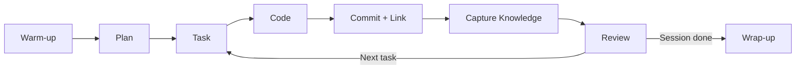

# Blueprint: KnowLoop Integration

<!-- METADATA — structured for agents, useful for humans
tags:        [knowloop, workflow, project-management, knowledge-capture]
category:    workflow
difficulty:  beginner
time:        30 min
stack:       []
-->

> How to use KnowLoop for project management, knowledge capture, and AI-assisted development workflow.

## TL;DR

KnowLoop structures your development sessions around a repeatable cycle: warm up, plan, execute tasks, commit with links, and capture knowledge. After following this blueprint you will have a consistent workflow that turns daily coding into a growing, searchable knowledge base that makes every future session smarter.

## When to Use

- Starting a new project or onboarding onto an existing one managed with KnowLoop
- You want a structured development loop instead of ad-hoc coding sessions
- You need to capture decisions, gotchas, and patterns so they are never lost
- When **not** to use it: one-off throwaway scripts where traceability has no value

## Prerequisites

- [ ] KnowLoop MCP server running and connected to your Claude Code session
- [ ] At least one KnowLoop project created (`project.create`)
- [ ] Familiarity with basic git commit workflow

## Overview

## Steps

### 1. Session warm-up

**Why**: Starting cold leads to duplicated effort and missed context. The warm-up loads your current state so you pick up exactly where you left off.

1. Check **active plans** for the project — see what is in progress and what is blocked.
2. Review **recent notes** — especially gotchas and guidelines — so you do not repeat past mistakes.
3. Glance at project **health** (open tasks, stale plans, unlinked commits).

**Expected outcome**: You have a clear picture of what needs attention today and no surprises hiding in the backlog.

### 2. Create or continue a plan

**Why**: Plans give structure to work. Without one, tasks drift and priorities blur.

- If no plan exists for the current objective, create one and link it to the project.
- If a plan already exists, review its tasks and their wave order to decide what to tackle next.
- Break large objectives into small, concrete tasks — each task should be completable in a single focused session.

**Expected outcome**: An active plan with prioritized tasks ready to execute.

### 3. Work through tasks in wave order

**Why**: Wave order ensures dependencies are respected and high-priority items land first.

1. Pick the next unstarted task in the current wave.
2. Mark it as **in-progress**.
3. For each task, break it into steps if the work is non-trivial.
4. Execute each step: research, code, test.

**Expected outcome**: The task is complete and its steps are recorded.

### 4. Link commits to tasks

**Why**: Linking creates traceability. Six months from now you can ask "why did we change this file?" and get a direct answer.

- After each meaningful commit, link it to the task it fulfills using `commit.link`.
- Include the task reference in the commit message or metadata.
- If a commit touches multiple tasks, link it to all of them.

**Expected outcome**: Every commit is traceable back to a task and, through it, to a plan and project.

### 5. Capture knowledge

**Why**: Knowledge captured in the moment is accurate. Knowledge captured a week later is folklore.

Create a note every time you encounter something worth remembering. Use the appropriate note type:

| Note Type       | When to Use |
|-----------------|-------------|
| **guideline**   | A rule or convention the project should follow (e.g., "always use absolute imports") |
| **gotcha**      | A non-obvious pitfall you hit or narrowly avoided (e.g., "this API silently drops nulls") |
| **pattern**     | A reusable solution you applied (e.g., "repository pattern for data access") |
| **context**     | Background information needed to understand a decision or area of code |
| **tip**         | A shortcut or efficiency trick (e.g., "run tests with `--fail-fast` during local dev") |
| **observation** | Something you noticed that may matter later but does not require action now |
| **assertion**   | A fact you verified and want to pin down (e.g., "max payload size is 1 MB") |
| **rfc**         | A proposal for a cross-cutting change that needs discussion before implementation |

Link notes to the relevant entities — files, functions, modules — so they surface in context when those entities are revisited.

**Expected outcome**: New discoveries are persisted as typed, linked notes.

### 6. Record architectural decisions

**Why**: Decisions without recorded rationale get relitigated endlessly.

When you make a non-trivial choice:

1. Use `decision.create` to record it.
2. List the **alternatives** you considered.
3. State the **rationale** for the chosen option.
4. Note the **affected files** or modules.

This is especially important for technology choices, API design trade-offs, and structural patterns.

**Expected outcome**: A decision record that anyone (including future-you) can review to understand why things are the way they are.

### 7. Session wrap-up

**Why**: A clean wrap-up prevents the next session from starting in confusion.

1. Mark completed tasks as **done**.
2. Update the plan status if a wave is finished.
3. Review any unlinked commits and link them.
4. Capture any remaining observations or gotchas you did not note during the session.
5. Optionally, write a brief session summary note of type **context**.

**Expected outcome**: The project state is accurate, all commits are linked, and knowledge is captured.

## Gotchas

> **Forgetting to link commits**: Unlinked commits break traceability and make it hard to understand why changes were made. **Fix**: Make linking part of your commit habit. Check for unlinked commits during session wrap-up.

> **Not capturing gotchas in the moment**: If you hit a pitfall and think "I'll note this later," you won't. **Fix**: Create the note immediately, even if it is rough. You can refine it later.

> **Stale plans**: Plans that are not updated become misleading — they show work as "in progress" that was finished or abandoned weeks ago. **Fix**: Review and update plan status during every session warm-up. Archive plans that are no longer relevant.

> **RFC skipped for cross-cutting changes**: Making a sweeping change without an RFC leads to surprises for collaborators and AI agents alike. **Fix**: If a change touches multiple modules or alters a convention, create an RFC note and get alignment before coding.

## Checklist

- [ ] KnowLoop project exists and is active
- [ ] At least one plan is linked to the project
- [ ] Tasks are organized in wave order
- [ ] Commits are linked to their corresponding tasks
- [ ] Notes are created for discoveries (gotchas, patterns, guidelines)
- [ ] Notes are linked to relevant entities (files, functions)
- [ ] Architectural decisions are recorded with alternatives and rationale
- [ ] No stale or orphaned plans remain

## References

- KnowLoop MCP tools — available via `mcp__knowloop__*` in your Claude Code session
- Note types: guideline, gotcha, pattern, context, tip, observation, assertion, rfc
- Skills in KnowLoop emerge automatically from clusters of related notes
