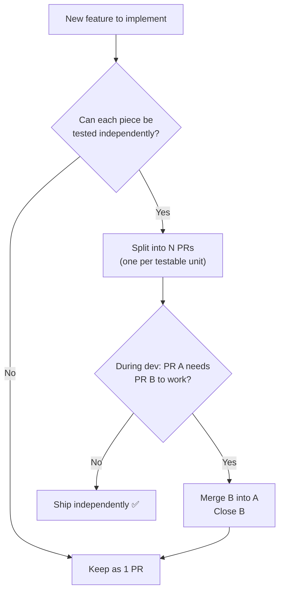

# Blueprint: PR Strategy — Split vs Merge

<!-- METADATA — structured for agents, useful for humans
tags:        [git, pull-request, workflow, code-review, qa]
category:    workflow
difficulty:  beginner
time:        15 min
stack:       []
-->

> Decide when to split work into multiple PRs vs keeping it in one, and how to consolidate when a split was premature.

## TL;DR

Split PRs by **QA-ability**, not by layer. If PR A can't be tested without PR B, they should be one PR. When you discover a bad split mid-flight, merge the branches and close the redundant PR.

## When to Use

- Starting a feature that touches multiple layers (UI + data + provider)
- Two PRs are open and reviewers can't test either independently
- Deciding how to scope work for a tier/milestone

## Prerequisites

- [ ] Git basics (branches, merge, rebase)
- [ ] A PR workflow (GitHub, GitLab, etc.)

## Overview



## Decision Rules

### When to SPLIT

Split when each PR is **independently QA-able** — a reviewer can check it out, run it, and verify the acceptance criteria without needing code from another branch.

Good splits:
- **By feature slice**: Login screen (PR1) vs Registration screen (PR2) — each is a standalone user flow
- **By infra vs feature**: Add database migration (PR1) → then feature that uses the new tables (PR2) — PR1 is verifiable via tests alone
- **By risk**: Refactoring with no behavior change (PR1) → new feature on top (PR2) — PR1 can be reviewed for correctness, PR2 for functionality

### When to KEEP as ONE

Keep when splitting would create PRs that **can't be tested in isolation**:

- UI screen + the provider it reads → screen without provider = crash or stub
- DAO + notifier + screen for a single settings page → they only make sense together
- Migration + model change + query update → partial application breaks the schema

### The QA-ability Test

Ask: _"If I checkout ONLY this branch, can I run the app and verify the feature works?"_

- **Yes** → valid PR boundary
- **No, it crashes/stubs/shows nothing** → merge with its dependency

## Consolidation Pattern

When you discover mid-flight that two PRs can't be QA'd separately:

### 1. Merge the dependency branch into the feature branch

```bash
# You're on feature/settings-screen (PR #32)
# feature/provider-wiring (PR #33) is needed for it to work
git checkout feature/settings-screen
git merge feature/provider-wiring --no-edit
```

### 2. Push the consolidated branch

```bash
git push origin feature/settings-screen
```

### 3. Close the redundant PR with an explanation

```bash
gh pr close 33 --comment "Merged into PR #32 — feature + wiring consolidated for QA."
```

### 4. Update the surviving PR description

Add the merged PR's content to the description so reviewers see the full scope.

## Anti-patterns

### Layer-based splitting (UI / Data / Logic)

```
PR #1: ProfileDao + migration          ← can't QA (no UI)
PR #2: SettingsNotifier                 ← can't QA (no UI)
PR #3: SettingsScreen                   ← can't QA (no provider)
```

This looks clean architecturally but creates 3 un-testable PRs. Better:

```
PR #1: SettingsScreen + SettingsNotifier + ProfileDao  ← full feature, QA-able
```

### Premature splitting on speculation

Don't split "because we might reuse the DAO elsewhere." Split when there's an actual second consumer, not in anticipation of one.

## Gotchas

> **Merge direction matters**: Always merge the dependency INTO the feature branch, not the other way. This keeps the feature branch as the PR target and avoids orphaning reviews/comments on the closed PR.

> **CI runs on both branches**: After merging, the redundant branch still triggers CI. Close the PR promptly to avoid confusion and wasted runner minutes.

> **Commit history gets noisier**: The merged branch brings all its commits into the feature branch. Use a merge commit (not rebase) so the history is clear. Squash on final merge to main if desired.

## Checklist

- [ ] Each PR passes the QA-ability test: checkout-and-verify works standalone
- [ ] No PR depends on another un-merged PR to function
- [ ] If consolidation was needed, the redundant PR is closed with a comment
- [ ] The surviving PR description covers all merged content
- [ ] Acceptance criteria are updated to reflect the full scope

## References

- [Google Engineering — Small PRs](https://google.github.io/eng-practices/review/developer/small-cls.html) — principles of PR sizing
- [Ship/Show/Ask](https://martinfowler.com/articles/ship-show-ask.html) — framework for PR review strategies
- Budget project PR #32/#33 — real-world case of premature split → consolidation
